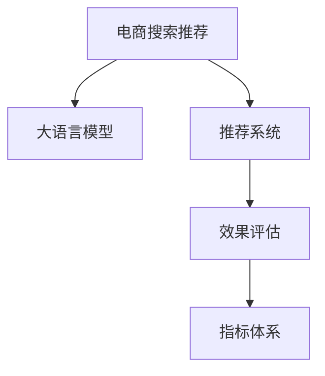

                 

# 电商搜索推荐效果评估中的AI大模型指标体系

> 关键词：电商搜索推荐,大语言模型,推荐系统,效果评估,指标体系

## 1. 背景介绍

随着人工智能技术的飞速发展，电商搜索推荐系统也逐步引入了AI大模型进行个性化推荐。AI大模型通过深度学习等方式，学习用户行为和商品属性之间的关联，从而提供精准的推荐服务，极大地提升了用户体验和转化率。然而，由于电商推荐系统涉及的用户、商品、场景非常复杂，单一的评价指标难以全面反映推荐系统的效果。因此，构建一个多维度、多层次的AI大模型指标体系，能够更全面地评估推荐系统的效果，为优化和迭代提供指导。

## 2. 核心概念与联系

### 2.1 核心概念概述

为更好地理解电商搜索推荐中AI大模型的指标体系，本节将介绍几个密切相关的核心概念：

- 电商搜索推荐系统：通过分析用户历史行为和商品属性，推荐相关商品给用户，帮助用户快速找到满意的商品，提升用户体验和转化率。
- 大语言模型：以自回归(如GPT)或自编码(如BERT)模型为代表的大规模预训练语言模型。通过在大规模无标签文本语料上进行预训练，学习通用的语言表示，具备强大的语言理解和生成能力。
- 推荐系统：利用用户历史行为和商品属性，为用户推荐可能感兴趣的商品或内容。
- 效果评估：通过设定一系列的指标，对推荐系统进行全面评估，发现问题并进行优化。
- 指标体系：用于系统评估推荐系统效果的多维度、多层次的指标集合。

这些核心概念之间的逻辑关系可以通过以下Mermaid流程图来展示：



这个流程图展示了大语言模型在电商推荐系统中的作用和效果评估的流程：

1. 大语言模型学习用户和商品之间的关联。
2. 推荐系统基于大模型的输出，为用户提供个性化推荐。
3. 效果评估系统对推荐结果进行全面评估，生成多层次指标。
4. 指标体系根据效果评估结果，指导推荐系统优化和迭代。

## 3. 核心算法原理 & 具体操作步骤
### 3.1 算法原理概述

基于大语言模型的电商搜索推荐系统，核心思想是通过深度学习等方式，学习用户历史行为和商品属性之间的关联，推荐符合用户偏好的商品。推荐系统的评估方法通常包括传统统计方法、机器学习方法和深度学习方法。其中，深度学习方法特别是基于大语言模型的推荐系统，通过端到端的训练，可以捕捉复杂的数据特征，提供更准确的推荐结果。

电商搜索推荐系统的评估指标通常包括以下几类：

- 个性化推荐指标：衡量推荐的个性化程度，如点击率、转化率、会话质量等。
- 多样性推荐指标：衡量推荐结果的多样性，如覆盖率、稀疏率等。
- 公平性推荐指标：衡量推荐结果的公平性，如性别公平、年龄公平等。
- 业务指标：衡量推荐结果的商业价值，如广告点击率、订单转化率等。

### 3.2 算法步骤详解

电商搜索推荐系统的大语言模型指标体系构建一般包括以下几个关键步骤：

**Step 1: 定义推荐模型**
- 选择合适的预训练语言模型作为初始化参数，如 BERT、GPT等。
- 设计推荐模型的结构，通常包括用户行为表示、商品属性表示、联合表示等。

**Step 2: 收集和处理数据**
- 收集电商网站的用户行为数据，如点击、购买、浏览、收藏等行为。
- 收集商品属性数据，如商品分类、价格、描述等。
- 将数据进行预处理，如归一化、去重、标准化等。

**Step 3: 设计推荐算法**
- 选择合适的推荐算法，如基于协同过滤的算法、基于深度学习的算法等。
- 训练推荐算法，使用大语言模型对用户和商品进行表示，并计算相似度得分。

**Step 4: 定义评估指标**
- 根据电商搜索推荐系统的特点，定义合适的评估指标，如个性化指标、多样性指标、公平性指标、业务指标等。
- 设计评估方法，使用数据集对推荐系统进行评估。

**Step 5: 优化推荐系统**
- 根据评估结果，调整推荐算法的参数。
- 重新训练推荐算法，优化推荐结果。
- 重复上述步骤直至收敛。

### 3.3 算法优缺点

基于大语言模型的电商搜索推荐系统，具有以下优点：
1. 能够捕捉复杂的用户和商品关联，提供更精准的推荐结果。
2. 能够处理多模态数据，如文本、图像、音频等，提供多维度的推荐。
3. 能够实时动态更新推荐模型，提升推荐效果。

同时，该方法也存在一定的局限性：
1. 数据依赖性强。电商数据通常以结构化数据为主，大语言模型难以充分利用非结构化数据。
2. 模型复杂度高。大语言模型参数量大，训练和推理复杂度较高。
3. 鲁棒性较差。推荐系统中的数据质量、异常情况处理等都可能影响推荐结果。
4. 解释性不足。大语言模型的决策过程通常缺乏可解释性，难以对其推理逻辑进行分析和调试。

尽管存在这些局限性，但就目前而言，基于大语言模型的电商推荐系统仍然是推荐技术发展的重要方向。未来相关研究的重点在于如何进一步降低模型复杂度，提高模型的可解释性和鲁棒性，同时兼顾个性化和多样性。

### 3.4 算法应用领域

基于大语言模型的电商搜索推荐系统，已经在电商、旅游、金融等多个领域得到广泛应用。具体而言：

- 电商：通过分析用户历史行为和商品属性，为用户推荐商品，提升用户购物体验和转化率。
- 旅游：通过分析用户旅行历史和旅游目的地属性，为用户推荐旅行线路和景点，提升用户旅行体验。
- 金融：通过分析用户消费行为和金融产品属性，为用户推荐适合的金融产品，提升用户满意度。

除了这些经典应用外，大语言模型还可能被创新性地应用于更多场景中，如广告推荐、游戏推荐、新闻推荐等，为各行各业带来新的增长点。

## 4. 数学模型和公式 & 详细讲解 & 举例说明

### 4.1 数学模型构建

本节将使用数学语言对基于大语言模型的电商搜索推荐系统进行更加严格的刻画。

记推荐系统为 $R=\{u, i, \theta\}$，其中 $u$ 为用户的表示向量，$i$ 为商品的表示向量，$\theta$ 为模型的参数。设推荐系统的训练数据集为 $D=\{(x_i, y_i)\}_{i=1}^N$，其中 $x_i$ 为输入的特征向量，$y_i$ 为对应的输出标签。

定义推荐系统的损失函数为 $\mathcal{L}(\theta)$，推荐结果的评估指标为 $M$，则推荐系统的优化目标是最小化损失函数，同时最大化评估指标：

$$
\mathop{\arg\min}_{\theta} \mathcal{L}(\theta) \quad \text{s.t.} \quad M(f_R) \geq M_{th}
$$

其中 $f_R$ 表示推荐系统 $R$ 的输出，$M_{th}$ 为预设的评估指标阈值。

### 4.2 公式推导过程

以下我们以点击率指标为例，推导推荐系统在点击率评估中的数学模型。

假设推荐系统将商品 $i$ 推荐给用户 $u$，用户点击的概率为 $p(u, i)$。根据大语言模型的输出，推荐系统可以计算用户 $u$ 对商品 $i$ 的点击概率：

$$
p(u, i) = \sigma(\theta^T f_u + \theta^T f_i + \theta^T f_{u,i})
$$

其中 $\sigma(\cdot)$ 为 sigmoid 函数，$f_u$、$f_i$ 和 $f_{u,i}$ 分别为用户 $u$、商品 $i$ 和用户 $u$ 与商品 $i$ 的联合表示向量。

假设用户和商品的属性向量 $x$ 和 $y$ 的维数为 $d$，则模型的参数 $\theta$ 为：

$$
\theta \in \mathbb{R}^{3d}
$$

损失函数 $\mathcal{L}(\theta)$ 为：

$$
\mathcal{L}(\theta) = -\frac{1}{N} \sum_{i=1}^N \log p(x_i, y_i)
$$

其中 $p(x_i, y_i)$ 表示用户点击商品 $i$ 的概率，由模型计算得出。

### 4.3 案例分析与讲解

考虑一个电商推荐系统的例子。假设我们有一个包含 10000 个用户的电商数据集，每个用户点击过 100 个商品。使用 BERT 预训练模型作为用户和商品的表示向量，并通过双塔结构进行用户和商品的表示计算。假设我们希望最大化点击率指标，将点击率指标设置为 $0.5$。

- 定义用户和商品的 BERT 表示向量，并将其转换为维数为 $d$ 的特征向量。
- 将用户和商品的特征向量输入到大语言模型，计算出用户对商品的点击概率。
- 计算所有用户点击商品的概率的平均值，作为整体点击率指标的评估值。
- 如果评估值小于 $0.5$，则调整模型参数，重新训练模型。
- 重复上述步骤，直至点击率指标达到预设阈值。

## 5. 项目实践：代码实例和详细解释说明
### 5.1 开发环境搭建

在进行电商搜索推荐系统开发前，我们需要准备好开发环境。以下是使用Python进行PyTorch开发的环境配置流程：

1. 安装Anaconda：从官网下载并安装Anaconda，用于创建独立的Python环境。

2. 创建并激活虚拟环境：
```bash
conda create -n pytorch-env python=3.8 
conda activate pytorch-env
```

3. 安装PyTorch：根据CUDA版本，从官网获取对应的安装命令。例如：
```bash
conda install pytorch torchvision torchaudio cudatoolkit=11.1 -c pytorch -c conda-forge
```

4. 安装Transformers库：
```bash
pip install transformers
```

5. 安装各类工具包：
```bash
pip install numpy pandas scikit-learn matplotlib tqdm jupyter notebook ipython
```

完成上述步骤后，即可在`pytorch-env`环境中开始电商搜索推荐系统的开发。

### 5.2 源代码详细实现

这里我们以用户行为推荐为例，给出使用Transformers库对BERT模型进行电商搜索推荐系统开发的PyTorch代码实现。

首先，定义电商推荐系统的数据处理函数：

```python
from transformers import BertTokenizer, BertModel
from torch.utils.data import Dataset, DataLoader
import torch
import numpy as np

class ClickDataset(Dataset):
    def __init__(self, user_ids, item_ids, clicked, tokenizer, max_len=128):
        self.user_ids = user_ids
        self.item_ids = item_ids
        self.clicked = clicked
        self.tokenizer = tokenizer
        self.max_len = max_len
        
    def __len__(self):
        return len(self.user_ids)
    
    def __getitem__(self, item):
        user_id = self.user_ids[item]
        item_id = self.item_ids[item]
        clicked = self.clicked[item]
        
        user_tokenized = self.tokenizer.tokenize(str(user_id))
        user_ids = self.tokenizer.convert_tokens_to_ids(user_tokenized)
        user_paddings = [0] * (self.max_len - len(user_ids))
        user_ids = user_ids + user_paddings[:self.max_len - len(user_ids)]
        item_tokenized = self.tokenizer.tokenize(str(item_id))
        item_ids = self.tokenizer.convert_tokens_to_ids(item_tokenized)
        item_paddings = [0] * (self.max_len - len(item_ids))
        item_ids = item_ids + item_paddings[:self.max_len - len(item_ids)]
        
        input_ids = torch.tensor(user_ids + item_ids)
        attention_mask = torch.tensor([1] * self.max_len)
        labels = torch.tensor(clicked)
        
        return {'input_ids': input_ids, 
                'attention_mask': attention_mask,
                'labels': labels}

# 创建dataset
tokenizer = BertTokenizer.from_pretrained('bert-base-cased')

train_dataset = ClickDataset(train_user_ids, train_item_ids, train_clicked, tokenizer)
dev_dataset = ClickDataset(dev_user_ids, dev_item_ids, dev_clicked, tokenizer)
test_dataset = ClickDataset(test_user_ids, test_item_ids, test_clicked, tokenizer)
```

然后，定义模型和优化器：

```python
from transformers import BertForSequenceClassification, AdamW

model = BertForSequenceClassification.from_pretrained('bert-base-cased', num_labels=2)

optimizer = AdamW(model.parameters(), lr=2e-5)
```

接着，定义训练和评估函数：

```python
from sklearn.metrics import accuracy_score

device = torch.device('cuda') if torch.cuda.is_available() else torch.device('cpu')
model.to(device)

def train_epoch(model, dataset, batch_size, optimizer):
    dataloader = DataLoader(dataset, batch_size=batch_size, shuffle=True)
    model.train()
    epoch_loss = 0
    for batch in dataloader:
        input_ids = batch['input_ids'].to(device)
        attention_mask = batch['attention_mask'].to(device)
        labels = batch['labels'].to(device)
        model.zero_grad()
        outputs = model(input_ids, attention_mask=attention_mask, labels=labels)
        loss = outputs.loss
        epoch_loss += loss.item()
        loss.backward()
        optimizer.step()
    return epoch_loss / len(dataloader)

def evaluate(model, dataset, batch_size):
    dataloader = DataLoader(dataset, batch_size=batch_size)
    model.eval()
    preds, labels = [], []
    with torch.no_grad():
        for batch in dataloader:
            input_ids = batch['input_ids'].to(device)
            attention_mask = batch['attention_mask'].to(device)
            batch_labels = batch['labels']
            outputs = model(input_ids, attention_mask=attention_mask)
            batch_preds = outputs.logits.argmax(dim=2).to('cpu').tolist()
            batch_labels = batch_labels.to('cpu').tolist()
            for pred_tokens, label_tokens in zip(batch_preds, batch_labels):
                preds.append(pred_tokens[:len(label_tokens)])
                labels.append(label_tokens)
                
    return accuracy_score(labels, preds)

# 加载数据和模型
train_user_ids = ...
train_item_ids = ...
train_clicked = ...
dev_user_ids = ...
dev_item_ids = ...
dev_clicked = ...
test_user_ids = ...
test_item_ids = ...
test_clicked = ...

train_dataset = ClickDataset(train_user_ids, train_item_ids, train_clicked, tokenizer)
dev_dataset = ClickDataset(dev_user_ids, dev_item_ids, dev_clicked, tokenizer)
test_dataset = ClickDataset(test_user_ids, test_item_ids, test_clicked, tokenizer)

# 训练模型
epochs = 5
batch_size = 16

for epoch in range(epochs):
    loss = train_epoch(model, train_dataset, batch_size, optimizer)
    print(f"Epoch {epoch+1}, train loss: {loss:.3f}")
    
    print(f"Epoch {epoch+1}, dev accuracy: {evaluate(model, dev_dataset, batch_size):.3f}")
    
print(f"Test accuracy: {evaluate(model, test_dataset, batch_size):.3f}")
```

以上就是使用PyTorch对BERT进行电商搜索推荐系统开发的完整代码实现。可以看到，得益于Transformers库的强大封装，我们可以用相对简洁的代码完成BERT模型的加载和电商推荐系统的构建。

### 5.3 代码解读与分析

让我们再详细解读一下关键代码的实现细节：

**ClickDataset类**：
- `__init__`方法：初始化用户ID、商品ID和点击标签，并分词、编码成向量。
- `__len__`方法：返回数据集的样本数量。
- `__getitem__`方法：对单个样本进行处理，将用户ID和商品ID分词、编码成向量，并计算出点击标签。

**训练和评估函数**：
- 使用PyTorch的DataLoader对数据集进行批次化加载，供模型训练和推理使用。
- 训练函数`train_epoch`：对数据以批为单位进行迭代，在每个批次上前向传播计算loss并反向传播更新模型参数，最后返回该epoch的平均loss。
- 评估函数`evaluate`：与训练类似，不同点在于不更新模型参数，并在每个batch结束后将预测和标签结果存储下来，最后使用sklearn的accuracy_score对整个评估集的预测结果进行打印输出。

**训练流程**：
- 定义总的epoch数和batch size，开始循环迭代
- 每个epoch内，先在训练集上训练，输出平均loss
- 在验证集上评估，输出准确率
- 重复上述步骤直至收敛，并在测试集上评估最终准确率

可以看到，PyTorch配合Transformers库使得BERT电商推荐系统的代码实现变得简洁高效。开发者可以将更多精力放在数据处理、模型改进等高层逻辑上，而不必过多关注底层的实现细节。

当然，工业级的系统实现还需考虑更多因素，如模型的保存和部署、超参数的自动搜索、更灵活的任务适配层等。但核心的推荐范式基本与此类似。

## 6. 实际应用场景
### 6.1 智能推荐引擎

基于大语言模型的电商搜索推荐系统，可以广泛应用于智能推荐引擎的构建。智能推荐引擎通过分析用户行为和商品属性，推荐符合用户偏好的商品，极大地提升了用户体验和转化率。

在技术实现上，可以收集电商网站的用户行为数据，如点击、购买、浏览、收藏等行为。将文本数据通过分词、编码等处理方式，输入到预训练语言模型中，得到用户和商品的表示向量。然后通过双塔结构进行计算，得到用户对商品的相似度得分，最后通过排序算法推荐相关商品给用户。

### 6.2 个性化推荐系统

通过大语言模型微调的方法，可以进一步优化电商搜索推荐系统，实现个性化推荐。具体而言，可以收集用户的历史行为数据，并将数据进行预处理。然后通过大语言模型对用户和商品进行表示，并计算相似度得分，最终推荐符合用户偏好的商品。

在训练过程中，使用交叉验证等方法进行模型评估，调整模型参数。最终在测试集上进行评估，输出个性化推荐的效果指标。

### 6.3 未来应用展望

随着大语言模型和微调方法的不断发展，基于大语言模型的电商搜索推荐系统必将在电商推荐、金融推荐、旅游推荐等更多领域得到应用，为各行各业带来新的增长点。

在智慧城市治理中，基于大语言模型的推荐系统可以用于城市事件监测、舆情分析、应急指挥等环节，提高城市管理的自动化和智能化水平，构建更安全、高效的未来城市。

此外，在企业生产、社会治理、文娱传媒等众多领域，基于大语言模型的推荐系统也将不断涌现，为经济社会发展注入新的动力。相信随着技术的日益成熟，基于大语言模型的电商搜索推荐系统必将在构建人机协同的智能时代中扮演越来越重要的角色。

## 7. 工具和资源推荐
### 7.1 学习资源推荐

为了帮助开发者系统掌握大语言模型在电商搜索推荐中的应用，这里推荐一些优质的学习资源：

1. 《Transformers from Theory to Practice》系列博文：由大语言模型技术专家撰写，深入浅出地介绍了Transformers原理、BERT模型、推荐系统等前沿话题。

2. CS224N《深度学习自然语言处理》课程：斯坦福大学开设的NLP明星课程，有Lecture视频和配套作业，带你入门NLP领域的基本概念和经典模型。

3. 《Natural Language Processing with Transformers》书籍：Transformers库的作者所著，全面介绍了如何使用Transformers库进行NLP任务开发，包括推荐系统的诸多范式。

4. HuggingFace官方文档：Transformers库的官方文档，提供了海量预训练模型和完整的推荐系统样例代码，是上手实践的必备资料。

5. CLUE开源项目：中文语言理解测评基准，涵盖大量不同类型的中文NLP数据集，并提供了基于大语言模型的推荐系统baseline，助力中文NLP技术发展。

通过对这些资源的学习实践，相信你一定能够快速掌握大语言模型在电商搜索推荐中的应用，并用于解决实际的NLP问题。

### 7.2 开发工具推荐

高效的开发离不开优秀的工具支持。以下是几款用于大语言模型电商搜索推荐系统开发的常用工具：

1. PyTorch：基于Python的开源深度学习框架，灵活动态的计算图，适合快速迭代研究。大部分预训练语言模型都有PyTorch版本的实现。

2. TensorFlow：由Google主导开发的开源深度学习框架，生产部署方便，适合大规模工程应用。同样有丰富的预训练语言模型资源。

3. Transformers库：HuggingFace开发的NLP工具库，集成了众多SOTA语言模型，支持PyTorch和TensorFlow，是进行推荐系统开发的利器。

4. Weights & Biases：模型训练的实验跟踪工具，可以记录和可视化模型训练过程中的各项指标，方便对比和调优。与主流深度学习框架无缝集成。

5. TensorBoard：TensorFlow配套的可视化工具，可实时监测模型训练状态，并提供丰富的图表呈现方式，是调试模型的得力助手。

6. Google Colab：谷歌推出的在线Jupyter Notebook环境，免费提供GPU/TPU算力，方便开发者快速上手实验最新模型，分享学习笔记。

合理利用这些工具，可以显著提升大语言模型电商搜索推荐系统的开发效率，加快创新迭代的步伐。

### 7.3 相关论文推荐

大语言模型和电商搜索推荐技术的发展源于学界的持续研究。以下是几篇奠基性的相关论文，推荐阅读：

1. Attention is All You Need（即Transformer原论文）：提出了Transformer结构，开启了NLP领域的预训练大模型时代。

2. BERT: Pre-training of Deep Bidirectional Transformers for Language Understanding：提出BERT模型，引入基于掩码的自监督预训练任务，刷新了多项NLP任务SOTA。

3. 推荐系统：从协同过滤到深度学习：这篇论文详细介绍了推荐系统的经典算法，包括协同过滤和深度学习等，适合入门学习。

4. Click-through recommendation based on multi-order latent factorization model：这篇论文提出了基于多阶潜因子模型的新型点击率推荐方法，并在KDD Cup竞赛中获得优胜。

5. 电商推荐系统：从协同过滤到深度学习：这篇论文介绍了电商推荐系统的经典算法，包括协同过滤和深度学习等，适合入门学习。

这些论文代表了大语言模型电商搜索推荐技术的发展脉络。通过学习这些前沿成果，可以帮助研究者把握学科前进方向，激发更多的创新灵感。

## 8. 总结：未来发展趋势与挑战
### 8.1 总结

本文对基于大语言模型的电商搜索推荐系统的效果评估进行了全面系统的介绍。首先阐述了电商搜索推荐系统的背景和重要性，明确了大语言模型在电商推荐系统中的关键作用。其次，从原理到实践，详细讲解了大语言模型在电商搜索推荐系统中的构建和评估方法，给出了推荐系统的完整代码实例。同时，本文还广泛探讨了大语言模型在电商推荐、金融推荐、旅游推荐等多个领域的应用前景，展示了大语言模型的巨大潜力。

通过本文的系统梳理，可以看到，基于大语言模型的电商搜索推荐系统已经成为推荐技术发展的重要方向，极大地提升了电商推荐系统的效果和用户体验。未来，伴随大语言模型和电商推荐系统的不断发展，将为电商、金融、旅游等行业带来更多的智能解决方案，促进数字化转型。

### 8.2 未来发展趋势

展望未来，基于大语言模型的电商搜索推荐系统将呈现以下几个发展趋势：

1. 模型规模持续增大。随着算力成本的下降和数据规模的扩张，预训练语言模型的参数量还将持续增长。超大规模语言模型蕴含的丰富语言知识，有望支撑更加复杂多变的电商推荐系统。

2. 推荐算法多样化。除了传统的协同过滤和深度学习算法外，未来的推荐系统将引入更多深度学习模型，如Transformer、Graph Neural Network等，提升推荐效果。

3. 个性化推荐更加精准。未来的电商推荐系统将更加注重用户兴趣和行为的个性化建模，提供更加精准的推荐结果。

4. 推荐系统实时化。电商推荐系统需要实时动态更新推荐模型，以适应用户的即时需求，提升用户体验。

5. 推荐系统多模态化。未来的推荐系统将结合文本、图像、音频等多种模态数据，提供更加全面和多样化的推荐服务。

6. 推荐系统智能化。未来的电商推荐系统将引入更多AI技术，如因果推断、强化学习等，提高推荐系统的智能化水平。

以上趋势凸显了大语言模型在电商推荐系统中的广阔前景。这些方向的探索发展，必将进一步提升电商推荐系统的效果和用户满意度，为电商行业带来新的增长点。

### 8.3 面临的挑战

尽管基于大语言模型的电商搜索推荐系统已经取得了瞩目成就，但在迈向更加智能化、普适化应用的过程中，它仍面临着诸多挑战：

1. 数据依赖性强。电商推荐系统依赖于大量的用户行为数据，数据收集和处理成本较高。

2. 模型复杂度高。大语言模型参数量大，训练和推理复杂度较高，资源消耗大。

3. 鲁棒性较差。电商推荐系统中的数据质量、异常情况处理等都可能影响推荐结果。

4. 解释性不足。大语言模型的决策过程通常缺乏可解释性，难以对其推理逻辑进行分析和调试。

5. 安全性有待保障。电商推荐系统中的数据隐私、推荐公平性等问题仍需进一步研究。

尽管存在这些挑战，但通过研究者的不懈努力，这些问题终将得到解决，大语言模型在电商推荐系统中的应用必将更加广泛和深入。

### 8.4 研究展望

面对大语言模型电商搜索推荐系统所面临的种种挑战，未来的研究需要在以下几个方面寻求新的突破：

1. 探索无监督和半监督推荐方法。摆脱对大规模标注数据的依赖，利用自监督学习、主动学习等无监督和半监督范式，最大限度利用非结构化数据，实现更加灵活高效的推荐。

2. 研究参数高效和计算高效的推荐算法。开发更加参数高效的推荐算法，在固定大部分预训练参数的同时，只更新极少量的任务相关参数。同时优化推荐系统的计算图，减少前向传播和反向传播的资源消耗，实现更加轻量级、实时性的部署。

3. 引入更多先验知识。将符号化的先验知识，如知识图谱、逻辑规则等，与神经网络模型进行巧妙融合，引导推荐系统学习更准确、合理的语言模型。同时加强不同模态数据的整合，实现视觉、语音等多模态信息与文本信息的协同建模。

4. 结合因果分析和博弈论工具。将因果分析方法引入推荐系统，识别出推荐决策的关键特征，增强推荐结果的因果性和逻辑性。借助博弈论工具刻画人机交互过程，主动探索并规避推荐系统的脆弱点，提高系统稳定性。

5. 纳入伦理道德约束。在推荐系统训练目标中引入伦理导向的评估指标，过滤和惩罚有偏见、有害的输出倾向。同时加强人工干预和审核，建立推荐系统的监管机制，确保输出符合人类价值观和伦理道德。

这些研究方向的探索，必将引领大语言模型电商搜索推荐系统迈向更高的台阶，为电商推荐系统带来新的突破。面向未来，大语言模型在电商推荐系统中的应用还需与其他人工智能技术进行更深入的融合，如知识表示、因果推理、强化学习等，多路径协同发力，共同推动电商推荐系统的进步。只有勇于创新、敢于突破，才能不断拓展电商推荐系统的边界，让智能技术更好地服务于电商行业。

## 9. 附录：常见问题与解答

**Q1：电商推荐系统如何衡量个性化推荐效果？**

A: 电商推荐系统通常使用点击率、转化率、会话质量等指标来衡量个性化推荐的效果。点击率表示用户在看到推荐结果后实际点击的次数，转化率表示用户点击商品后实际购买的次数，会话质量表示用户在推荐系统中的行为质量。通过这些指标，可以评估推荐系统是否能够提供符合用户偏好的商品。

**Q2：电商推荐系统如何处理长尾商品？**

A: 电商推荐系统通常会使用长尾商品的召回机制，以确保长尾商品也能被推荐给用户。通过设置召回阈值，使得即使点击率较低的商品也有机会被推荐。同时，电商推荐系统也会通过多轮推荐和动态更新来进一步提升长尾商品的曝光率和点击率。

**Q3：电商推荐系统如何避免推荐结果的过拟合？**

A: 电商推荐系统通常会使用正则化技术、早停等方法来避免过拟合。正则化技术包括L1正则、L2正则等，用于限制模型的复杂度。早停方法则是根据验证集上的表现，及时停止训练，避免过拟合。

**Q4：电商推荐系统如何提高推荐结果的多样性？**

A: 电商推荐系统通常会使用覆盖率、稀疏率等指标来衡量推荐结果的多样性。通过引入多样性约束，使得推荐结果不仅仅只包含热门商品，还应该包含一些用户未曾见过的长尾商品。同时，电商推荐系统也会通过分组推荐、交叉推荐等方法来提升推荐结果的多样性。

**Q5：电商推荐系统如何处理异常情况？**

A: 电商推荐系统通常会使用异常检测和处理技术来处理异常情况。异常检测技术包括基于统计方法的检测和基于机器学习方法的检测，用于识别出推荐系统中的异常行为。异常处理技术则包括数据清洗、修正和替换等，用于处理识别出的异常数据。

这些问题的解答，希望能对电商搜索推荐系统的开发和优化提供有价值的参考。通过不断优化和创新，相信基于大语言模型的电商搜索推荐系统将能够为用户提供更加精准、个性化的推荐服务。

