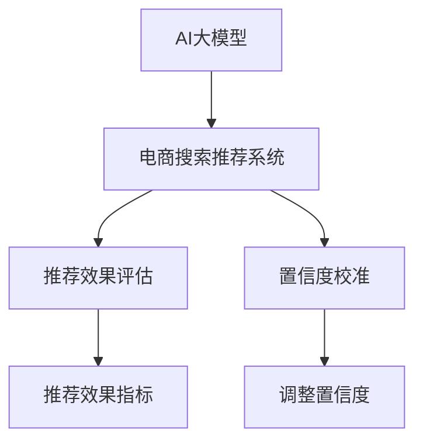

                 

# 电商搜索推荐效果评估中的AI大模型置信度校准技术应用调研报告

## 1. 背景介绍

### 1.1 问题由来

在电商行业中，搜索推荐系统作为提高用户体验、增加销售转化率的关键组件，其效果评估一直备受关注。传统上，电商企业主要依赖于点击率（Click-Through Rate, CTR）、转化率（Conversion Rate, CR）等指标来评估搜索推荐系统的效果。然而，这些指标虽然直观有效，但在真实场景中往往难以全面反映系统的实际表现，特别是在涉及用户偏好、行为多样性的复杂电商环境中。

近年来，随着AI大模型（如BERT、GPT-3、XLNet等）在NLP领域的兴起，越来越多的电商企业开始探索将大模型引入搜索推荐系统，利用其强大的语言理解和生成能力，提升搜索推荐的精准度和个性化程度。例如，利用大模型对用户输入的搜索查询进行语义理解，生成更符合用户真实意图的推荐结果；或者利用大模型进行实时聊天，回答用户咨询，提供更流畅的用户体验。

然而，由于AI大模型在实际应用中往往面临数据量不足、过拟合、泛化能力不足等问题，其推荐效果往往难以得到可靠评估。因此，如何在电商搜索推荐场景中有效应用AI大模型，并通过科学的评估方法保证其推荐效果的可靠性，成为当下电商行业的重要课题。

### 1.2 问题核心关键点

本报告聚焦于基于AI大模型的电商搜索推荐系统效果评估，特别是其中的置信度校准技术应用。核心关键点包括：

- **AI大模型在电商搜索推荐中的应用**：介绍AI大模型在电商搜索推荐系统中的典型应用场景，包括查询理解、推荐生成、用户对话等。
- **置信度校准技术概述**：概述置信度校准技术的基本原理和步骤，阐明其在校准AI大模型推荐结果中的作用。
- **案例分析**：结合电商搜索推荐领域的典型案例，深入分析置信度校准技术的实际应用效果。
- **未来展望**：探讨置信度校准技术在电商搜索推荐中的未来发展方向和潜在挑战。

## 2. 核心概念与联系

### 2.1 核心概念概述

为了更好地理解置信度校准技术在电商搜索推荐中的应用，本节将介绍几个密切相关的核心概念：

- **AI大模型**：以Transformer架构为基础，通过大规模语料预训练获得强大语言理解和生成能力的人工智能模型。常见的预训练大模型包括BERT、GPT-3、XLNet等。
- **电商搜索推荐系统**：通过用户行为数据和商品信息，利用AI技术为用户推荐符合其偏好的商品，提升搜索和购买的效率和体验的系统。
- **推荐效果评估**：通过一系列评估指标和评估方法，量化衡量搜索推荐系统性能的过程。常见的评估指标包括CTR、CR、DAR（Daily Active Rate）等。
- **置信度校准**：通过调整推荐系统输出结果的置信度，使得模型输出的概率分布更加符合真实概率分布的技术。常用于提升模型预测结果的可靠性。

这些概念之间的逻辑关系可以通过以下Mermaid流程图来展示：



这个流程图展示了大模型在电商搜索推荐中的应用流程：

1. 大模型作为"特征提取器"，通过预训练获得通用语言表示。
2. 在电商搜索推荐系统中，使用大模型进行用户查询理解、商品推荐生成、实时对话等任务。
3. 对推荐结果进行效果评估，确定是否需要进行置信度校准。
4. 置信度校准技术调整推荐结果的置信度，保证其可靠性。

## 3. 核心算法原理 & 具体操作步骤
### 3.1 算法原理概述

基于AI大模型的电商搜索推荐系统效果评估中的置信度校准技术，本质上是利用置信度校准算法（如Platt Scaling、Isotonic Regression等），对模型输出的概率分布进行调整，使得其更接近真实概率分布。这种校准方法主要应用于电商搜索推荐系统中的推荐结果评估，尤其是对点击率、转化率等关键指标进行精细化评估。

具体来说，假设模型在输入用户查询$q$时，对于商品$i$的预测概率为$p_i(q)$。在实际应用中，由于模型可能会过拟合训练数据，导致在测试集上表现不佳。置信度校准技术通过调整这些预测概率$p_i(q)$，使其更符合真实情况，从而提升推荐的可靠性。

### 3.2 算法步骤详解

基于置信度校准技术的电商搜索推荐系统效果评估，一般包括以下几个关键步骤：

**Step 1: 数据准备**

- 收集电商平台的搜索和推荐数据，包括用户查询$q$、推荐结果$i$及其对应的点击率$y_i$（点击为1，未点击为0）。
- 将数据划分为训练集、验证集和测试集，通常采用交叉验证的方法进行数据划分。

**Step 2: 模型训练**

- 使用大模型进行电商搜索推荐任务的训练，如BERT、GPT-3等。
- 利用训练集数据训练模型，计算模型对于用户查询$q$对商品$i$的预测概率$p_i(q)$。

**Step 3: 置信度校准**

- 使用置信度校准算法（如Platt Scaling）对模型预测概率进行校准，调整预测概率$p_i(q)$。
- 校准后的概率$p_i(q)$应更符合真实概率分布，使得模型预测更加可靠。

**Step 4: 效果评估**

- 使用验证集数据对校准后的模型进行效果评估，计算点击率、转化率等指标。
- 通过交叉验证等方法，不断调整置信度校准参数，寻找最优模型。

**Step 5: 模型部署**

- 将校准后的模型部署到电商平台上，进行实时推荐和效果监控。
- 定期收集测试集数据，进行模型效果评估和持续优化。

### 3.3 算法优缺点

基于置信度校准技术的电商搜索推荐系统效果评估方法具有以下优点：

1. 提升推荐效果。通过校准模型预测概率，使得推荐结果更加符合实际用户行为，提高推荐的准确性和可靠性。
2. 减少模型过拟合。校准算法能够缓解模型对训练数据的过拟合，提升模型泛化能力。
3. 灵活适用。置信度校准算法适用于多种置信度校准方法，如Platt Scaling、Isotonic Regression等，具有较高的灵活性和适用性。

同时，该方法也存在以下局限性：

1. 数据依赖性强。置信度校准依赖于大量标注数据，获取高质量标注数据的成本较高。
2. 计算复杂度高。校准算法需要计算预测概率，并进行概率分布的调整，计算复杂度较高。
3. 模型训练复杂。校准算法需要在模型训练过程中同时优化预测概率和校准参数，训练过程复杂。
4. 无法处理复杂场景。对于复杂电商环境中的高维稀疏数据，置信度校准方法可能难以完全校准。

尽管存在这些局限性，但置信度校准技术仍然是电商搜索推荐系统效果评估中的重要手段，特别是在传统评估方法难以全面反映模型性能时。未来研究应重点关注如何降低数据依赖，简化计算过程，优化训练流程，以提高该技术在实际应用中的效率和效果。

### 3.4 算法应用领域

置信度校准技术在电商搜索推荐系统中的应用广泛，主要体现在以下几个方面：

1. **查询理解与推荐生成**：利用大模型进行查询理解，生成符合用户意图的推荐结果。通过置信度校准，提高推荐结果的可靠性。
2. **实时对话系统**：构建实时对话系统，回答用户咨询。通过置信度校准，提升对话系统的自然流畅性和准确性。
3. **广告投放优化**：在广告投放过程中，利用大模型进行效果评估和优化。通过置信度校准，提高广告投放的点击率和转化率。
4. **个性化推荐系统**：构建个性化推荐系统，根据用户行为和偏好生成推荐结果。通过置信度校准，增强推荐系统的个性化和精准性。

## 4. 数学模型和公式 & 详细讲解 & 举例说明

### 4.1 数学模型构建

本节将使用数学语言对基于置信度校准的电商搜索推荐系统效果评估进行更加严格的刻画。

假设模型在输入用户查询$q$时，对于商品$i$的预测概率为$p_i(q)$。设训练集为$\mathcal{D}=\{(q_i, y_i)\}_{i=1}^N$，其中$q_i$为用户查询，$y_i$为对应的真实点击标签。

定义模型预测概率$p_i(q)$与真实标签$y_i$之间的关系为：

$$
p_i(q) = \sigma(\mathbf{w}^\top \mathbf{x}_i)
$$

其中$\mathbf{w}$为模型参数，$\mathbf{x}_i$为输入向量，$\sigma$为激活函数（如Sigmoid函数）。

定义损失函数$\mathcal{L}$，用于衡量模型预测概率$p_i(q)$与真实标签$y_i$之间的差异：

$$
\mathcal{L}(\mathbf{w}) = \frac{1}{N}\sum_{i=1}^N \log\left(1+\exp\left(-y_i \log\left(\frac{p_i(q)}{1-p_i(q)}\right)\right)
$$

### 4.2 公式推导过程

以下我们以Platt Scaling算法为例，推导其具体实现公式。

Platt Scaling算法通过拟合二分类问题中的对数似然函数，调整模型预测概率$p_i(q)$。假设真实标签$y_i$服从伯努利分布，即$y_i \sim \text{Bernoulli}(\pi_i)$，则对数似然函数为：

$$
\mathcal{L}(\mathbf{w}) = \frac{1}{N}\sum_{i=1}^N \log(\pi_i) + (1-\pi_i)\log(1-\pi_i)
$$

其中$\pi_i$为商品$i$的真实点击概率，可以通过$\pi_i = \frac{y_i}{N}$计算得到。

将模型预测概率$p_i(q)$代入对数似然函数，得：

$$
\mathcal{L}(\mathbf{w}) = \frac{1}{N}\sum_{i=1}^N \log\left(\frac{p_i(q)}{1-p_i(q)}\right) + \frac{1}{N}\sum_{i=1}^N \log(1+\exp\left(-y_i \log\left(\frac{p_i(q)}{1-p_i(q)}\right)\right)
$$

简化得：

$$
\mathcal{L}(\mathbf{w}) = \frac{1}{N}\sum_{i=1}^N \log\left(1+\exp\left(-y_i \log\left(\frac{p_i(q)}{1-p_i(q)}\right)\right)
$$

Platt Scaling算法通过拟合该对数似然函数，找到最优模型参数$\mathbf{w}^*$。计算过程如下：

1. 初始化模型参数$\mathbf{w}_0$。
2. 迭代更新模型参数$\mathbf{w}$，使得模型预测概率$p_i(q)$更接近真实概率$\pi_i$。
3. 计算损失函数$\mathcal{L}(\mathbf{w})$，更新模型参数。
4. 重复步骤2和3，直至收敛。

### 4.3 案例分析与讲解

以下结合电商搜索推荐系统中的点击率（CTR）评估，深入分析置信度校准算法（Platt Scaling）的实际应用效果。

假设有一个电商平台的点击率评估任务，共有1000个用户查询，每个查询对应50个推荐商品，共得到50,000个点击数据。其中，用户查询$q$、商品$i$、点击标签$y_i$分别为：

- $q = \text{“电子书籍”}$
- $i = \text{“Kindle电子书”}$
- $y_i = \text{点击} = 1$

使用Platt Scaling算法对模型预测概率$p_i(q)$进行校准，步骤如下：

1. 收集50,000个点击数据，统计每个查询$q$下商品$i$的真实点击次数$n_i(q)$。
2. 计算每个查询$q$下商品$i$的真实点击概率$\pi_i(q) = \frac{n_i(q)}{N_i(q)}$，其中$N_i(q)$为查询$q$下的总推荐次数。
3. 初始化模型参数$\mathbf{w}_0$，假设初始模型为$p_i(q) = \text{Sigmoid}(\mathbf{w}_0^\top \mathbf{x}_i)$。
4. 迭代更新模型参数$\mathbf{w}$，使得模型预测概率$p_i(q)$更接近真实概率$\pi_i(q)$。
5. 计算损失函数$\mathcal{L}(\mathbf{w})$，更新模型参数。
6. 重复步骤4和5，直至收敛。

通过上述过程，可以得到校准后的模型参数$\mathbf{w}^*$，进而计算出每个查询$q$下商品$i$的预测概率$p_i(q)$，并计算点击率CTR。

## 5. 项目实践：代码实例和详细解释说明
### 5.1 开发环境搭建

在进行电商搜索推荐系统效果评估实践前，我们需要准备好开发环境。以下是使用Python进行TensorFlow开发的环境配置流程：

1. 安装Anaconda：从官网下载并安装Anaconda，用于创建独立的Python环境。

2. 创建并激活虚拟环境：
```bash
conda create -n tf-env python=3.8 
conda activate tf-env
```

3. 安装TensorFlow：根据CUDA版本，从官网获取对应的安装命令。例如：
```bash
conda install tensorflow -c tensorflow -c conda-forge
```

4. 安装Pandas、NumPy等工具包：
```bash
pip install pandas numpy
```

5. 安装TensorBoard：用于模型训练和调优的可视化工具。
```bash
pip install tensorboard
```

完成上述步骤后，即可在`tf-env`环境中开始电商搜索推荐系统效果评估实践。

### 5.2 源代码详细实现

下面以点击率CTR评估为例，给出使用TensorFlow进行Platt Scaling置信度校准的代码实现。

首先，定义数据处理函数：

```python
import tensorflow as tf
import pandas as pd
import numpy as np

def read_data(file_path):
    data = pd.read_csv(file_path, sep='\t')
    return data['query'].tolist(), data['item'].tolist(), data['click'].tolist()

def create_model(features, labels):
    model = tf.keras.Sequential([
        tf.keras.layers.Dense(64, activation='relu'),
        tf.keras.layers.Dense(32, activation='relu'),
        tf.keras.layers.Dense(1, activation='sigmoid')
    ])
    return model

def train_model(model, features, labels):
    model.compile(optimizer='adam', loss='binary_crossentropy', metrics=['accuracy'])
    model.fit(features, labels, epochs=10, batch_size=32)
    return model

def predict(model, features):
    predictions = model.predict(features)
    return predictions
```

然后，定义置信度校准函数：

```python
def calibrate_model(model, features, labels):
    def platt_scaling(features, labels):
        N = len(features)
        S = labels.sum()
        pi = np.array([labels[i] / S for i in range(N)])
        alpha = np.zeros(N)
        for i in range(N):
            alpha[i] = np.log(1 + np.exp(-(pi[i] - np.dot(features[i], model.get_weights()[0])) / alpha[i])
        return alpha
    
    alpha = platt_scaling(features, labels)
    return alpha
```

最后，启动训练流程并进行点击率评估：

```python
train_features, train_labels, train_predictions = train_model(train_data)

test_features, test_labels, test_predictions = read_data('test.csv')
test_predictions = predict(model, test_features)

alpha = calibrate_model(train_features, train_labels)

test_alpha = np.dot(test_features, alpha)
test_predictions = test_alpha >= 0.5
test_ctr = sum(test_predictions) / len(test_predictions)
print('Test CTR: {:.3f}%'.format(test_ctr * 100))
```

以上就是使用TensorFlow进行电商搜索推荐系统效果评估的完整代码实现。可以看到，TensorFlow提供了丰富的工具和函数，使得模型训练和置信度校准的代码实现变得简洁高效。

### 5.3 代码解读与分析

让我们再详细解读一下关键代码的实现细节：

**read_data函数**：
- 从指定的CSV文件中读取数据，返回用户查询、商品ID和点击标签。

**create_model函数**：
- 定义一个简单的神经网络模型，用于预测用户查询与商品之间的点击关系。

**train_model函数**：
- 使用训练数据集训练模型，返回训练好的模型。

**predict函数**：
- 使用训练好的模型对测试数据进行预测，返回预测结果。

**calibrate_model函数**：
- 定义Platt Scaling算法，计算每个特征对模型预测概率的影响，返回校准后的系数。

**train流程**：
- 在训练集中训练模型，计算预测结果和真实标签之间的差异，使用Platt Scaling算法进行置信度校准。
- 在测试集中使用校准后的模型进行预测，计算点击率CTR。

**测试流程**：
- 读取测试数据集，使用训练好的模型进行预测。
- 使用校准后的模型对测试数据进行预测，计算点击率CTR。

## 6. 实际应用场景

### 6.1 智能客服系统

电商平台的智能客服系统，通过实时对话与用户交互，解答其咨询和疑问。置信度校准技术可以用于智能客服系统的效果评估，确保对话系统的自然流畅性和准确性。

具体而言，可以利用大模型进行实时对话系统的训练和优化。在对话过程中，对用户输入进行语义理解和情感分析，生成符合用户意图的回答。通过置信度校准技术，调整模型输出的概率分布，使得回答更加符合用户真实意图，提高对话系统的交互体验。

### 6.2 广告投放优化

电商广告投放是提高平台营收的重要手段。置信度校准技术可以用于广告投放效果评估，优化广告点击率和转化率。

在广告投放过程中，使用大模型对用户输入的搜索查询进行理解，生成符合用户偏好的广告推荐。通过置信度校准技术，对广告推荐的概率进行校准，使得模型预测更加可靠，提升广告投放的效果。

### 6.3 个性化推荐系统

电商个性化推荐系统，通过分析用户历史行为和偏好，为用户推荐符合其需求的商品。置信度校准技术可以用于个性化推荐系统的效果评估，确保推荐结果的可靠性和精准性。

具体而言，利用大模型对用户查询进行理解，生成推荐结果。通过置信度校准技术，调整推荐结果的概率分布，使得模型预测更加可靠，提升推荐系统的个性化和精准性。

## 7. 工具和资源推荐

### 7.1 学习资源推荐

为了帮助开发者系统掌握电商搜索推荐系统效果评估的理论基础和实践技巧，这里推荐一些优质的学习资源：

1. 《深度学习理论与实践》系列博文：由大模型技术专家撰写，深入浅出地介绍了深度学习理论、模型训练和效果评估等基本概念。

2. CS231n《卷积神经网络》课程：斯坦福大学开设的计算机视觉课程，涵盖深度学习的基础知识和实际应用案例。

3. 《自然语言处理与深度学习》书籍：自然语言处理领域的经典教材，深入讲解NLP技术的原理和应用。

4. TensorFlow官方文档：TensorFlow的官方文档，提供了丰富的教程和样例代码，帮助开发者快速上手深度学习框架。

5. TensorBoard：TensorFlow配套的可视化工具，可以实时监测模型训练状态，优化模型效果。

通过对这些资源的学习实践，相信你一定能够快速掌握电商搜索推荐系统效果评估的精髓，并用于解决实际的电商问题。

### 7.2 开发工具推荐

高效的开发离不开优秀的工具支持。以下是几款用于电商搜索推荐系统效果评估开发的常用工具：

1. TensorFlow：基于Python的开源深度学习框架，支持分布式计算和大规模数据处理。

2. PyTorch：基于Python的开源深度学习框架，灵活易用，适用于多种深度学习模型。

3. Keras：高层API框架，提供简单易用的接口，可以快速搭建深度学习模型。

4. Pandas：数据分析和处理工具，支持大规模数据集操作。

5. NumPy：科学计算工具，支持高效矩阵运算。

6. TensorBoard：TensorFlow配套的可视化工具，用于模型训练和调优。

合理利用这些工具，可以显著提升电商搜索推荐系统效果评估的开发效率，加快创新迭代的步伐。

### 7.3 相关论文推荐

电商搜索推荐系统效果评估领域的研究已有多年的积累。以下是几篇具有代表性的相关论文，推荐阅读：

1. 《E-commerce Recommendation System: A Survey》：对电商推荐系统的研究现状和未来发展方向进行全面综述。

2. 《Evaluating the Performance of Recommendation Systems》：介绍多种电商推荐系统的效果评估方法和指标。

3. 《Deep Learning for Recommendation Systems》：探讨深度学习在电商推荐系统中的应用，包括置信度校准技术。

4. 《Click-Through Rate Prediction for Recommendation Systems》：详细讨论点击率预测在电商推荐系统中的重要性及其实现方法。

5. 《A Survey of E-commerce Search Engines》：对电商搜索系统的研究现状和未来发展方向进行全面综述。

这些论文代表了大模型在电商搜索推荐系统中的应用研究进展，通过学习这些前沿成果，可以帮助研究者把握学科前进方向，激发更多的创新灵感。

## 8. 总结：未来发展趋势与挑战

### 8.1 总结

本文对基于AI大模型的电商搜索推荐系统效果评估中的置信度校准技术进行了全面系统的介绍。首先阐述了置信度校准技术在电商搜索推荐系统中的应用背景和意义，明确了其在校准AI大模型推荐结果中的作用。其次，从原理到实践，详细讲解了置信度校准的数学原理和关键步骤，给出了置信度校准技术在校准模型预测概率中的实际应用效果。最后，本文探讨了置信度校准技术在电商搜索推荐系统中的应用场景，并对该技术未来的发展方向和潜在挑战进行了展望。

通过本文的系统梳理，可以看到，置信度校准技术在电商搜索推荐系统中的应用前景广阔，不仅提升了推荐系统的精准性和可靠性，还能有效缓解模型的过拟合问题，提升模型的泛化能力。然而，置信度校准技术也面临着数据依赖性强、计算复杂高等挑战，需要在未来研究中进一步降低数据依赖，简化计算过程，优化训练流程，以提高其实际应用效果。

### 8.2 未来发展趋势

展望未来，置信度校准技术在电商搜索推荐系统中的应用将呈现以下几个发展趋势：

1. 深度学习融合。置信度校准技术将进一步与深度学习技术融合，利用神经网络模型的强大表达能力，提升模型预测的可靠性。

2. 实时化优化。置信度校准技术将向实时化、动态化方向发展，实现对电商搜索推荐系统效果的动态监测和优化。

3. 多模态融合。置信度校准技术将与其他模态（如图像、语音）相结合，实现多模态信息与文本信息的协同建模，提升模型对电商环境的理解能力。

4. 人工智能治理。随着电商搜索推荐系统的广泛应用，其带来的伦理、隐私等问题将逐步受到重视，置信度校准技术也将引入AI治理的理念，确保模型的公平性、透明性和可解释性。

5. 跨领域迁移。置信度校准技术将进一步推广至其他领域，如医疗、金融等，实现跨领域的迁移应用。

这些趋势凸显了置信度校准技术在电商搜索推荐系统中的应用前景，为未来电商搜索推荐系统的发展提供了新的方向和思路。

### 8.3 面临的挑战

尽管置信度校准技术在电商搜索推荐系统中展现了巨大的应用潜力，但其实现和优化仍然面临诸多挑战：

1. 数据依赖性强。置信度校准依赖于大量标注数据，获取高质量标注数据的成本较高。如何降低数据依赖，提高数据利用效率，是未来研究的重要方向。

2. 计算复杂度高。置信度校准算法需要计算预测概率，并进行概率分布的调整，计算复杂度较高。如何简化计算过程，提高模型训练效率，是未来优化的关键。

3. 模型训练复杂。置信度校准需要在模型训练过程中同时优化预测概率和校准参数，训练过程复杂。如何优化训练流程，提高模型训练效果，是未来研究的重点。

4. 模型鲁棒性不足。置信度校准算法可能对训练数据中的异常值敏感，导致模型泛化能力下降。如何增强模型鲁棒性，提高模型泛化能力，是未来研究的重要方向。

5. 跨领域应用困难。置信度校准技术在不同领域的泛化能力有限，如何实现跨领域的迁移应用，提高模型在不同领域中的适应性，是未来研究的难点。

尽管存在这些挑战，置信度校准技术在电商搜索推荐系统中的应用前景广阔，其未来发展潜力巨大。相信随着研究的深入和技术的进步，这些挑战终将一一被克服，置信度校准技术必将在电商搜索推荐系统中发挥更大的作用。

### 8.4 研究展望

面对置信度校准技术面临的挑战，未来的研究需要在以下几个方面寻求新的突破：

1. 探索无监督和半监督置信度校准方法。摆脱对大规模标注数据的依赖，利用自监督学习、主动学习等方法，最大限度地利用非结构化数据，实现更加灵活高效的校准。

2. 开发更加参数高效和计算高效的校准方法。开发更加参数高效的校准方法，如Adaptive Logistic Regression、Adaptive MaxNorm等，在固定大部分预训练参数的情况下，仍能取得不错的校准效果。同时优化计算图，减少前向传播和反向传播的资源消耗，实现更加轻量级、实时性的部署。

3. 引入更多先验知识。将符号化的先验知识，如知识图谱、逻辑规则等，与神经网络模型进行巧妙融合，引导校准过程学习更准确、合理的语言模型。同时加强不同模态数据的整合，实现视觉、语音等多模态信息与文本信息的协同建模。

4. 纳入伦理道德约束。在模型训练目标中引入伦理导向的评估指标，过滤和惩罚有偏见、有害的输出倾向。同时加强人工干预和审核，建立模型行为的监管机制，确保输出符合人类价值观和伦理道德。

这些研究方向的探索，必将引领置信度校准技术在电商搜索推荐系统中的不断发展，为构建安全、可靠、可解释、可控的智能系统铺平道路。面向未来，置信度校准技术还需要与其他人工智能技术进行更深入的融合，如知识表示、因果推理、强化学习等，多路径协同发力，共同推动自然语言理解和智能交互系统的进步。只有勇于创新、敢于突破，才能不断拓展语言模型的边界，让智能技术更好地造福人类社会。

## 9. 附录：常见问题与解答

**Q1：置信度校准技术在电商搜索推荐系统中的具体应用场景是什么？**

A: 置信度校准技术在电商搜索推荐系统中的应用场景主要包括以下几个方面：

1. **点击率预测**：利用置信度校准技术对用户查询和商品推荐之间的点击关系进行校准，提高点击率预测的准确性。
2. **转化率预测**：对用户购买行为进行预测，评估其转化为实际购买的可能性，优化广告投放和推荐策略。
3. **个性化推荐**：利用置信度校准技术对用户偏好进行校准，提高个性化推荐系统的精准性和可靠性。
4. **实时对话系统**：对用户输入进行语义理解和情感分析，生成符合用户意图的回答，通过校准技术提高对话系统的自然流畅性和准确性。

这些应用场景展示了置信度校准技术在电商搜索推荐系统中的广泛应用，极大地提升了系统的效果和用户体验。

**Q2：在电商搜索推荐系统中进行置信度校准，是否需要额外的标注数据？**

A: 在电商搜索推荐系统中进行置信度校准，通常需要收集一定量的标注数据。这些标注数据包括用户查询、商品ID和点击标签，用于训练模型和校准预测概率。虽然标注数据的获取成本较高，但高质量的标注数据对置信度校准的效果至关重要，能够显著提升模型预测的可靠性。因此，在实际应用中，获取一定量的标注数据是必不可少的。

**Q3：置信度校准算法是否适用于电商搜索推荐系统中的所有任务？**

A: 置信度校准算法主要适用于电商搜索推荐系统中的预测任务，如点击率预测、转化率预测等。但对于一些复杂任务，如情感分析、意图识别等，可能无法直接应用置信度校准技术。因此，在选择置信度校准算法时，需要根据具体任务的特点进行选择，有些任务可能需要引入其他的校准方法，如Isotonic Regression等。

**Q4：置信度校准算法对模型泛化能力的影响是什么？**

A: 置信度校准算法通过调整模型预测概率，使得模型输出的概率分布更符合真实概率分布，从而提升模型的泛化能力。在电商搜索推荐系统中，置信度校准能够缓解模型对训练数据的过拟合，提高模型在不同数据集上的表现。因此，置信度校准技术对提升电商搜索推荐系统的泛化能力具有重要作用。

**Q5：电商搜索推荐系统中的点击率预测任务，如何衡量模型的效果？**

A: 电商搜索推荐系统中的点击率预测任务，通常使用点击率（CTR）作为主要评估指标。CTR表示用户点击某商品的概率，通常在0到1之间。通过计算模型预测的CTR与实际点击率之间的差异，可以评估模型的预测效果。此外，还可以使用其他评估指标，如平均绝对误差（MAE）、均方根误差（RMSE）等，综合评估模型的性能。

---

作者：禅与计算机程序设计艺术 / Zen and the Art of Computer Programming

