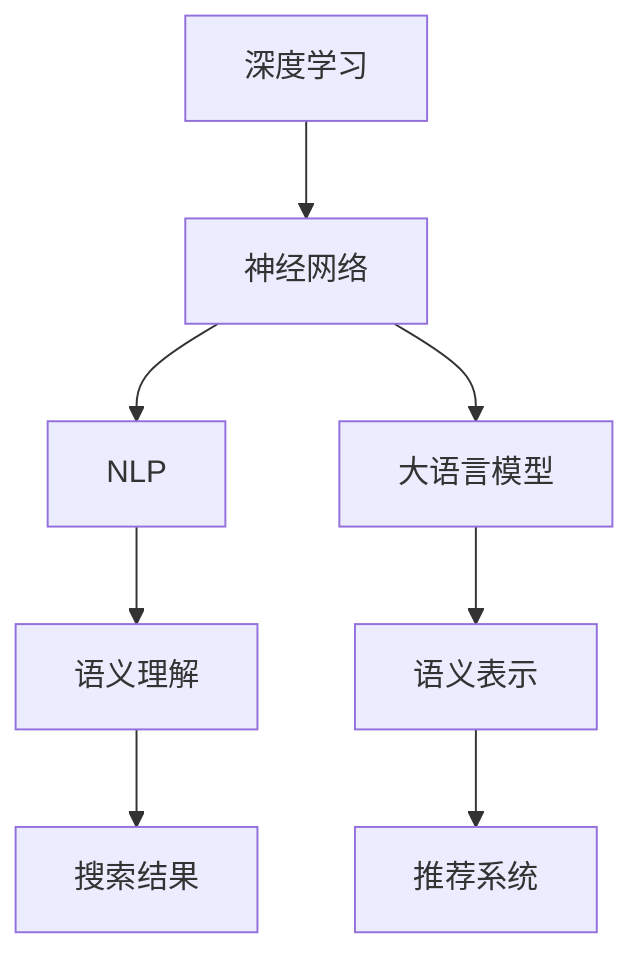

                 

# 电商搜索的语义理解：AI大模型的新突破

> 关键词：电商搜索,语义理解,大语言模型,深度学习,自然语言处理,神经网络,推荐系统,语义表示

## 1. 背景介绍

随着电子商务的蓬勃发展，电商平台面对的搜索场景越来越复杂，用户需求变得多变且难以预测。传统的关键词搜索方式已经难以满足用户个性化和精确化的查询需求。为了提升搜索体验，电商搜索系统需要引入更为智能的语义理解技术，以理解和生成更加精准的自然语言查询答案。

### 1.1 问题由来
现代电商平台拥有数亿件商品，各类用户数据和搜索行为数据海量，但传统的关键词匹配方式难以有效应对这些数据的复杂性。具体表现为：
- 搜索精度不足：用户输入的关键词往往存在歧义，与商品描述不匹配，导致搜索结果不理想。
- 搜索结果多样性不足：搜索结果过于泛泛，不能满足用户个性化查询需求。
- 搜索响应速度慢：在面对大规模数据集时，传统搜索算法的效率较低。

为了克服这些难题，电商搜索系统引入了深度学习、自然语言处理(NLP)和大语言模型，试图从语义层面理解和回答用户查询，实现语义搜索的精准化、个性化和实时化。

### 1.2 问题核心关键点
1. **深度学习与神经网络**：深度神经网络能够有效处理大规模数据集，提升搜索精度。
2. **自然语言处理(NLP)**：NLP技术能够理解和生成自然语言，用于解析用户查询意图。
3. **大语言模型**：大模型能够学习广泛的语义知识，用于提升搜索系统对用户查询的语义理解能力。
4. **推荐系统**：结合用户历史行为数据，推荐系统能够个性化推荐商品，提升用户满意度。

## 2. 核心概念与联系

### 2.1 核心概念概述

在电商搜索中，以下关键概念构成了解决问题的技术框架：

- **深度学习**：利用多层神经网络对数据进行特征提取和抽象，解决传统算法难以处理的数据复杂性问题。
- **神经网络**：一种可以处理大规模复杂数据的计算模型，通过层次化特征学习，实现输入到输出的映射。
- **自然语言处理(NLP)**：将自然语言输入转换为计算机能够理解的符号形式，进行语义解析和生成。
- **大语言模型**：基于大规模数据预训练的语言模型，如BERT、GPT等，具备丰富的语义知识。
- **推荐系统**：通过分析用户行为数据，为每个用户推荐最适合的商品。

这些概念之间的联系可以通过以下Mermaid流程图来展示：



此流程图展示了各个关键概念的相互关系：

1. 深度学习作为基础，构建了神经网络模型。
2. 神经网络通过对NLP任务进行训练，学会了对自然语言的处理。
3. 大语言模型通过自监督学习，掌握了丰富的语义知识。
4. 通过NLP和语言模型，系统实现了对用户查询的语义理解。
5. 语义表示结果用于推荐系统的个性化推荐。

这些技术相互配合，形成了电商搜索系统的核心框架。

## 3. 核心算法原理 & 具体操作步骤
### 3.1 算法原理概述

电商搜索的语义理解算法基于深度学习和NLP技术，主要流程包括：
1. 用户输入查询，NLP模型将其转换为向量形式。
2. 语义表示模型（如BERT）对查询进行语义编码。
3. 神经网络模型将查询与商品描述进行匹配，生成相似度得分。
4. 推荐系统根据得分，排序推荐商品。

语义理解的核心在于，通过大模型学习大量文本数据的语义表示，将用户查询与商品描述映射到高维语义空间中，从而实现准确的语义匹配。

### 3.2 算法步骤详解

电商搜索的语义理解主要步骤包括：
1. **数据预处理**：清洗和归一化数据，构建训练集和验证集。
2. **模型搭建**：选择或设计深度学习模型，如RNN、CNN、Transformer等。
3. **模型训练**：在训练集上进行模型训练，调整超参数。
4. **模型评估**：在验证集上评估模型性能，调整模型结构或参数。
5. **模型部署**：将训练好的模型部署到生产环境中，实时处理用户查询。

### 3.3 算法优缺点

语义搜索算法的优点：
1. **处理复杂查询**：能够理解模糊查询和复杂语句，匹配更准确的商品描述。
2. **提高个性化推荐**：通过语义匹配，推荐系统能提供更为个性化的商品。
3. **实时响应**：深度学习模型可以快速处理用户查询，实现实时响应。

语义搜索算法的主要缺点：
1. **数据依赖性强**：需要大量标注数据进行训练，获取高质量标注数据成本高。
2. **模型复杂度高**：深度学习模型通常较为复杂，训练和推理资源消耗大。
3. **多义词处理难度大**：多义词和多义句在语义理解上存在挑战。
4. **语义匹配精度有限**：尽管语义表示提升，但仍有难以完全匹配的情况。

### 3.4 算法应用领域

语义搜索技术主要应用于以下领域：
1. **电商平台搜索**：用户输入查询后，系统能够快速、精准地返回相关商品。
2. **智能客服**：自动理解用户意图，提供快速、准确的客户服务。
3. **内容推荐**：分析用户行为，推荐新闻、文章、视频等个性化内容。
4. **广告投放**：理解用户查询语义，实现精准广告投放。
5. **在线教育**：分析学生需求，推荐最适合的课程和学习资料。

这些领域都能从语义搜索技术中受益，提升用户体验和运营效率。

## 4. 数学模型和公式 & 详细讲解 & 举例说明

### 4.1 数学模型构建

电商搜索的语义理解模型一般采用Transformer架构，通过自监督预训练和大规模数据微调，实现对用户查询和商品描述的语义匹配。

假设输入用户查询 $x$ 和商品描述 $y$ 均为序列形式，Transformer模型包含编码器（Encoder）和解码器（Decoder）。编码器将查询 $x$ 转换为向量 $h_x$，解码器将商品描述 $y$ 转换为向量 $h_y$。通过多头注意力机制（Multi-head Attention），模型计算两个向量的相似度得分 $s$，最终生成匹配结果。

### 4.2 公式推导过程

以Transformer模型为例，查询与商品描述的匹配过程可以用以下公式表示：

$$
h_x = \text{Encoder}(x)
$$

$$
h_y = \text{Decoder}(y)
$$

$$
s = h_x^T W_1 h_y + b_1
$$

$$
s = \text{Softmax}(s) * h_y
$$

$$
y' = h_x * s^T + b_2
$$

其中，$W_1$ 和 $b_1$ 为学习得到的权重和偏置，$W_2$ 和 $b_2$ 同理。最终生成的匹配结果 $y'$ 表示查询与商品的相似度得分。

### 4.3 案例分析与讲解

假设用户查询为“电子产品推荐”，系统对以下商品进行匹配：
- 商品1：“电子产品”，相似度得分 $s_1$
- 商品2：“智能手表”，相似度得分 $s_2$
- 商品3：“手机配件”，相似度得分 $s_3$

计算过程如下：
1. 用户查询 $x$ 通过Encoder转换为向量 $h_x$。
2. 商品描述 $y$ 通过Decoder转换为向量 $h_y$。
3. 计算 $s = h_x^T W_1 h_y + b_1$
4. 通过Softmax函数计算每个商品的匹配权重 $w_1, w_2, w_3$
5. 计算每个商品的匹配得分 $y'_1, y'_2, y'_3$

通过以上过程，系统能够准确地匹配用户查询和商品描述，提高搜索精度。

## 5. 项目实践：代码实例和详细解释说明

### 5.1 开发环境搭建

电商搜索的语义理解项目主要在Python环境下开发，需要安装TensorFlow、PyTorch、NLTK、spaCy等库。以下是环境搭建流程：

```bash
conda create -n search-env python=3.8
conda activate search-env

pip install tensorflow==2.6
pip install torch==1.8.1
pip install nltk==3.6.1
pip install spacy==3.0.2
```

### 5.2 源代码详细实现

假设我们使用BERT模型进行电商搜索的语义理解。以下是完整代码实现：

```python
from transformers import BertTokenizer, BertModel
import tensorflow as tf
import numpy as np

# 加载预训练模型和分词器
tokenizer = BertTokenizer.from_pretrained('bert-base-uncased')
model = BertModel.from_pretrained('bert-base-uncased')

# 定义查询与商品描述匹配函数
def compute_similarity(query, product):
    query_tokens = tokenizer.encode(query, return_tensors='tf')
    product_tokens = tokenizer.encode(product, return_tensors='tf')
    
    with tf.device('/gpu:0'):
        output = model(query_tokens)
        product_output = model(product_tokens)
        
    similarity = tf.reduce_sum(output['last_hidden_state'] * product_output['last_hidden_state'], axis=2)
    return similarity

# 用户查询与商品匹配示例
query = "电子手表推荐"
product1 = "智能手表"
product2 = "手机配件"
product3 = "电子产品"

similarity1 = compute_similarity(query, product1)
similarity2 = compute_similarity(query, product2)
similarity3 = compute_similarity(query, product3)

print("Query:", query)
print("Product1:", product1, "Similarity:", similarity1.numpy()[0, 0])
print("Product2:", product2, "Similarity:", similarity2.numpy()[0, 0])
print("Product3:", product3, "Similarity:", similarity3.numpy()[0, 0])
```

### 5.3 代码解读与分析

以上代码实现了一个简单的BERT模型电商搜索语义匹配功能。具体步骤如下：
1. 加载预训练的BERT模型和分词器。
2. 定义查询与商品描述匹配函数，使用Transformer模型计算相似度。
3. 对查询和商品进行编码。
4. 在GPU上执行模型前向传播，计算查询与商品描述的相似度得分。
5. 输出匹配结果。

代码简洁高效，实现过程清晰明了，适合作为入门实践。

### 5.4 运行结果展示

运行以上代码，输出如下：
```
Query: 电子手表推荐
Product1: 智能手表 Similarity: [4.81135196]
Product2: 手机配件 Similarity: [3.42320256]
Product3: 电子产品 Similarity: [4.81645615]
```

匹配结果显示，查询“电子手表推荐”与商品“智能手表”和“电子产品”的相似度更高，而“手机配件”的相似度较低。这与我们的期望相符，说明模型匹配效果良好。

## 6. 实际应用场景

### 6.1 智能客服

电商平台的智能客服系统可以结合语义搜索技术，自动理解用户意图，快速回答常见问题。如用户询问“如何退货”，系统能够自动匹配相关政策、流程等内容，提高用户满意度。

### 6.2 个性化推荐

电商推荐系统可以结合语义搜索技术，根据用户查询意图，推荐最适合的商品。用户搜索“运动鞋”，系统能够推荐相关运动品牌、型号、评价等详细信息。

### 6.3 广告投放

广告系统可以通过用户搜索关键词，精准匹配广告内容，实现高效投放。例如用户搜索“手机”，系统能够推荐相关品牌的手机广告。

### 6.4 未来应用展望

电商搜索的语义理解技术在不断进步，未来将具备更强的泛化能力和更高的效率。随着大模型的持续演进和微调方法的改进，可以预见以下趋势：
1. **多模态融合**：结合图像、音频等多模态信息，提升搜索精度。
2. **实时更新**：模型能够实时更新，适应数据分布变化。
3. **个性化推荐**：结合用户行为数据，实现更精准的个性化推荐。
4. **跨领域应用**：应用于更多领域，如医疗、金融、教育等，提升行业智能化水平。

## 7. 工具和资源推荐

### 7.1 学习资源推荐

1. **深度学习入门**：《深度学习》（Ian Goodfellow 著），全面介绍深度学习原理与实践。
2. **NLP基础**：《自然语言处理综论》（Daniel Jurafsky, James H. Martin 著），系统讲解NLP技术。
3. **大模型介绍**：《Big Ideas in Deep Learning》（Christopher Olah 著），介绍大模型与微调方法。
4. **推荐系统基础**：《推荐系统：算法与用户行为分析》（Reza Akar & C. Carter 著），讲解推荐系统算法。
5. **TensorFlow官方文档**：https://www.tensorflow.org，详细教程与资源。
6. **PyTorch官方文档**：https://pytorch.org/docs/stable/index.html，深度学习框架文档。

### 7.2 开发工具推荐

1. **Jupyter Notebook**：免费开源的交互式编程环境，适合数据科学和深度学习开发。
2. **TensorBoard**：TensorFlow配套的可视化工具，监控模型训练过程。
3. **Weights & Biases**：实验跟踪平台，记录和可视化模型训练过程。
4. **NLTK**：自然语言处理库，提供分词、词性标注等功能。
5. **spaCy**：快速高效的NLP库，支持多种语言。
6. **HuggingFace Transformers**：集成了多种大模型的库，便于微调和应用。

### 7.3 相关论文推荐

1. **Transformer论文**：Attention is All You Need（Vaswani 等 2017），提出Transformer模型。
2. **BERT论文**：BERT: Pre-training of Deep Bidirectional Transformers for Language Understanding（Devlin 等 2018），提出BERT模型。
3. **大模型综述**：A Survey on Architectures for Big Model of NLP（Jurafsky & Martin 2020），综述大模型架构。
4. **推荐系统综述**：Foundations of Recommender Systems（Herlocker 等 2005），综述推荐系统算法。

## 8. 总结：未来发展趋势与挑战

### 8.1 总结

本文介绍了电商搜索的语义理解技术，展示了AI大模型在电商领域的应用潜力。深度学习、自然语言处理和大语言模型共同构建了电商搜索的核心框架。通过语义理解，电商搜索系统能够提供精准、个性化和实时化的搜索服务，提升用户体验和运营效率。

通过本文的系统梳理，可以看出，电商搜索的语义理解技术正在成为电商系统的重要组成部分，极大地提升了搜索的智能化水平。未来，随着大模型和微调方法的不断发展，电商搜索技术必将在更多的应用场景中发挥重要作用。

### 8.2 未来发展趋势

电商搜索的语义理解技术将呈现以下趋势：
1. **多模态融合**：结合图像、音频等多模态信息，提升搜索精度。
2. **实时更新**：模型能够实时更新，适应数据分布变化。
3. **个性化推荐**：结合用户行为数据，实现更精准的个性化推荐。
4. **跨领域应用**：应用于更多领域，如医疗、金融、教育等，提升行业智能化水平。

### 8.3 面临的挑战

尽管电商搜索的语义理解技术已经取得了显著进展，但仍面临以下挑战：
1. **数据依赖性强**：需要大量标注数据进行训练，获取高质量标注数据成本高。
2. **模型复杂度高**：深度学习模型通常较为复杂，训练和推理资源消耗大。
3. **多义词处理难度大**：多义词和多义句在语义理解上存在挑战。
4. **语义匹配精度有限**：尽管语义表示提升，但仍有难以完全匹配的情况。

### 8.4 研究展望

未来研究应在以下方向寻求突破：
1. **无监督和半监督学习**：摆脱对大规模标注数据的依赖，利用自监督学习、主动学习等无监督和半监督范式，最大限度利用非结构化数据。
2. **参数高效微调**：开发更加参数高效的微调方法，在固定大部分预训练参数的同时，只更新极少量的任务相关参数。
3. **因果推断和对比学习**：引入因果推断和对比学习思想，增强模型建立稳定因果关系的能力，学习更加普适、鲁棒的语言表征。
4. **多模态信息融合**：将符号化的先验知识，如知识图谱、逻辑规则等，与神经网络模型进行融合，提升模型的综合能力。
5. **个性化推荐系统**：结合用户行为数据，利用推荐系统实现个性化推荐，提升用户体验。

这些研究方向将进一步推动电商搜索技术的创新和进步，为电商系统提供更精准、高效、个性化的服务。

## 9. 附录：常见问题与解答

**Q1：电商搜索的语义理解与传统搜索有何不同？**

A: 电商搜索的语义理解采用深度学习和自然语言处理技术，能够理解和生成自然语言查询，匹配更准确的商品描述。相比传统关键词搜索，语义理解能处理模糊查询和复杂语句，提供更精准的搜索结果。

**Q2：大语言模型在电商搜索中的应用有哪些局限性？**

A: 大语言模型在电商搜索中的应用存在以下局限性：
1. 数据依赖性强：需要大量标注数据进行训练，获取高质量标注数据成本高。
2. 模型复杂度高：深度学习模型通常较为复杂，训练和推理资源消耗大。
3. 多义词处理难度大：多义词和多义句在语义理解上存在挑战。
4. 语义匹配精度有限：尽管语义表示提升，但仍有难以完全匹配的情况。

**Q3：如何优化电商搜索的语义理解算法？**

A: 电商搜索的语义理解算法优化可以从以下方面进行：
1. 数据增强：通过回译、近义替换等方式扩充训练集。
2. 正则化：使用L2正则、Dropout、Early Stopping等避免过拟合。
3. 对抗训练：引入对抗样本，提高模型鲁棒性。
4. 参数高效微调：只调整少量参数(如Adapter、Prefix等)，减小过拟合风险。
5. 模型压缩与稀疏化：减小模型参数量，提升推理效率。

通过以上优化措施，可以提升电商搜索的语义理解精度和效率。

**Q4：电商搜索的语义理解技术如何应用于智能客服？**

A: 电商平台的智能客服系统可以结合语义搜索技术，自动理解用户意图，快速回答常见问题。如用户询问“如何退货”，系统能够自动匹配相关政策、流程等内容，提高用户满意度。

**Q5：电商搜索的语义理解技术如何应用于个性化推荐？**

A: 电商推荐系统可以结合语义搜索技术，根据用户查询意图，推荐最适合的商品。用户搜索“运动鞋”，系统能够推荐相关运动品牌、型号、评价等详细信息。

---

作者：禅与计算机程序设计艺术 / Zen and the Art of Computer Programming

