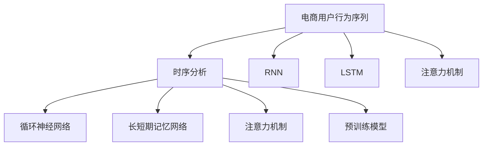

                 

# 电商用户行为序列预测：AI大模型的时序分析

> 关键词：电商用户行为预测, 时序分析, 深度学习, 循环神经网络(RNN), 长短期记忆网络(LSTM), 自然语言处理(NLP), 数据增强, 模型压缩, 预训练模型, 注意力机制, 模型解释性, 电商个性化推荐

## 1. 背景介绍

### 1.1 问题由来
在现代电商行业，用户行为数据的有效预测和分析是提升用户转化率、提高用户满意度的关键。传统的用户行为分析方法，如关联规则挖掘、协同过滤等，虽然能够挖掘出用户的部分行为模式，但往往无法捕捉到用户行为序列的动态变化和复杂规律。近年来，深度学习技术在电商领域的广泛应用，尤其是基于大模型的时序分析方法，为电商用户行为预测带来了革命性的突破。

具体而言，通过收集用户浏览、点击、购买等行为数据，利用深度学习模型学习用户行为的时序特征，可以有效地预测用户的后续行为，实现个性化推荐、广告投放优化、销售预测等功能。在大模型的推动下，电商用户行为预测的精度和实时性得到了显著提升，大大促进了电商行业的智能化发展。

### 1.2 问题核心关键点
电商用户行为预测的关键在于如何利用历史行为数据，捕捉用户行为序列的动态规律，并预测用户未来的行为。具体核心点包括：

- **行为序列建模**：将用户行为数据序列化，学习其时序特征。
- **模型选择和优化**：选择合适的深度学习模型，并通过模型优化提升预测精度。
- **数据增强和预处理**：通过数据增强和预处理，丰富训练样本，提升模型泛化能力。
- **模型解释性和鲁棒性**：提升模型的可解释性，避免过拟合，确保模型的鲁棒性。

本文将重点介绍基于大模型的电商用户行为序列预测方法，旨在帮助电商从业者更准确、高效地进行用户行为预测，实现更精准的个性化推荐和销售预测。

## 2. 核心概念与联系

### 2.1 核心概念概述

为更好地理解基于大模型的电商用户行为预测方法，本节将介绍几个密切相关的核心概念：

- **电商用户行为序列**：指用户在电商平台上的一系列行为，包括浏览、点击、添加购物车、支付等。每个行为可以表示为一个时间戳+行为类型。
- **时序分析**：通过深度学习模型分析时间序列数据，学习其中的动态特征和规律，常用于股票预测、气象预测、用户行为预测等任务。
- **循环神经网络(RNN)**：一种能够处理序列数据的神经网络结构，通过循环层将历史信息传递到当前时间步，从而捕捉序列中的时序特征。
- **长短期记忆网络(LSTM)**：一种特殊的RNN结构，能够有效处理长序列数据，避免了梯度消失和梯度爆炸问题。
- **注意力机制(Attention)**：一种机制，可以动态调整模型的输入权重，帮助模型集中关注序列中的关键信息。
- **预训练模型**：在大量无标签数据上进行预训练，学习通用的语言和视觉特征，适用于各种下游任务。

这些核心概念之间的逻辑关系可以通过以下Mermaid流程图来展示：



这个流程图展示了大模型在电商用户行为预测中的核心概念及其之间的关系：

1. 电商用户行为序列通过时序分析模型，学习序列中的动态特征。
2. 在RNN、LSTM等序列模型中，模型能够通过循环层捕捉历史信息，并传递到当前时间步。
3. 注意力机制用于动态调整输入权重，确保模型能够集中关注序列中的关键信息。
4. 预训练模型在无标签数据上进行预训练，学习通用的语言和视觉特征，提升模型泛化能力。

这些概念共同构成了大模型在电商用户行为预测中的学习框架，使其能够更好地捕捉用户行为的动态规律。

## 3. 核心算法原理 & 具体操作步骤
### 3.1 算法原理概述

基于大模型的电商用户行为序列预测方法，本质上是一种时序分析方法。其核心思想是：通过深度学习模型学习用户行为序列的时序特征，利用历史行为数据预测用户未来的行为。

形式化地，假设用户行为序列为 $S=\{s_t\}_{t=1}^T$，其中 $s_t$ 表示第 $t$ 时刻的用户行为。目标是从历史行为数据中学习到用户行为的时序特征，通过模型 $M$ 预测用户未来的行为 $y_{t+1}$，即：

$$
y_{t+1} = M(S_t; \theta)
$$

其中 $\theta$ 为模型的参数。为了最大化模型的预测精度，需要最小化损失函数 $\mathcal{L}$：

$$
\theta^* = \mathop{\arg\min}_{\theta} \mathcal{L}(M;S)
$$

其中 $\mathcal{L}$ 为交叉熵损失函数，用于衡量模型预测与真实标签之间的差异。通过梯度下降等优化算法，微调过程不断更新模型参数 $\theta$，最小化损失函数 $\mathcal{L}$，使得模型输出逼近真实标签。

### 3.2 算法步骤详解

基于大模型的电商用户行为序列预测方法一般包括以下几个关键步骤：

**Step 1: 数据预处理**

- 收集电商用户的历史行为数据，包括浏览、点击、购买等。
- 对数据进行清洗，去除异常值和缺失值，进行归一化和标准化处理。
- 将用户行为序列序列化为时间戳+行为类型的形式。

**Step 2: 特征提取**

- 选择合适的序列模型，如RNN、LSTM等，设计模型的输入输出结构。
- 对序列数据进行padding或截断，确保所有序列长度相同。
- 应用注意力机制，动态调整输入权重，提升模型对序列中关键信息的捕捉能力。

**Step 3: 模型训练**

- 选择合适的优化算法，如Adam、SGD等，设置学习率、批大小、迭代轮数等。
- 将处理好的数据集划分为训练集、验证集和测试集。
- 使用训练集对模型进行迭代训练，最小化损失函数 $\mathcal{L}$。

**Step 4: 模型评估**

- 在验证集上对模型进行评估，计算各种性能指标，如准确率、召回率、F1值等。
- 根据评估结果调整模型超参数，确保模型性能最优。

**Step 5: 模型预测**

- 使用训练好的模型对测试集进行预测。
- 评估模型预测结果，并输出预测结果。

### 3.3 算法优缺点

基于大模型的电商用户行为序列预测方法具有以下优点：

- **精度高**：通过深度学习模型学习时序特征，能够捕捉复杂的动态规律，提高预测精度。
- **泛化能力强**：预训练模型在大量无标签数据上进行预训练，学习通用的语言和视觉特征，适用于各种下游任务。
- **灵活性强**：可以通过超参数调整和模型优化，提升模型的适应性和泛化能力。

同时，该方法也存在一定的局限性：

- **计算资源需求高**：大规模深度学习模型对计算资源的需求较高，需要高性能的GPU或TPU等硬件设备。
- **模型复杂度高**：深度学习模型结构复杂，训练过程耗时较长，模型部署和优化成本较高。
- **数据需求大**：需要收集大量的历史用户行为数据，数据质量和多样性对模型性能影响较大。

尽管存在这些局限性，但就目前而言，基于大模型的电商用户行为序列预测方法仍是大规模深度学习应用的重要范式。未来相关研究的重点在于如何进一步降低计算成本，提升模型的实时性和可解释性，同时兼顾模型的泛化能力和预测精度。

### 3.4 算法应用领域

基于大模型的电商用户行为序列预测方法，已经在电商推荐、广告投放优化、销售预测等多个领域得到了广泛的应用，成为电商智能化发展的核心驱动力：

- **电商推荐系统**：通过对用户历史行为序列进行分析，预测用户可能感兴趣的商品，实现个性化推荐，提升用户转化率。
- **广告投放优化**：利用用户行为序列预测模型，预测用户的广告响应概率，优化广告投放策略，提高广告转化率。
- **销售预测**：基于用户历史购买行为，预测未来购买趋势，帮助电商企业进行库存管理和需求预测。

除了上述这些经典应用外，大模型的时序分析方法还在电商运营的诸多场景中得到了创新性的应用，如用户流失预测、价格弹性分析、供应链优化等，为电商运营提供了有力的技术支持。

## 4. 数学模型和公式 & 详细讲解  
### 4.1 数学模型构建

本节将使用数学语言对基于大模型的电商用户行为序列预测过程进行更加严格的刻画。

记用户行为序列为 $S=\{s_t\}_{t=1}^T$，其中 $s_t$ 表示第 $t$ 时刻的用户行为，包括浏览、点击、购买等。假设目标行为为 $y_{t+1}$，模型参数为 $\theta$。

定义模型 $M$ 在时间步 $t$ 上的输出为 $\hat{y}_{t+1}=M(s_t; \theta)$，则预测误差为：

$$
e_{t+1} = y_{t+1} - \hat{y}_{t+1}
$$

模型的交叉熵损失函数为：

$$
\mathcal{L}(M) = -\frac{1}{N} \sum_{i=1}^N \sum_{j=1}^M e_{t+1} \log \hat{y}_{t+1}
$$

其中 $N$ 为样本数量，$M$ 为模型输出的类别数量。通过梯度下降等优化算法，微调过程不断更新模型参数 $\theta$，最小化损失函数 $\mathcal{L}$，使得模型输出逼近真实标签。

### 4.2 公式推导过程

以LSTM模型为例，推导其预测误差的计算公式。

LSTM模型的一般形式如下：

$$
h_t = f(W_h \cdot [h_{t-1},s_t] + b_h)
$$
$$
c_t = i(W_c \cdot [h_{t-1},s_t] + b_c)
$$
$$
c_t = o(W_c \cdot [h_{t-1},s_t] + b_c)
$$
$$
\tilde{c}_t = \tanh(W_c \cdot [h_{t-1},s_t] + b_c)
$$
$$
c_t = c_{t-1} \cdot f + \tilde{c}_t \cdot i
$$
$$
h_t = c_t \cdot o
$$

其中 $h_t$ 表示时间步 $t$ 的隐藏状态，$c_t$ 表示时间步 $t$ 的细胞状态，$f$、$i$、$o$ 分别为遗忘门、输入门和输出门，$\tanh$ 为双曲正切函数。

假设模型的输出为 $y_{t+1}$，则预测误差 $e_{t+1}$ 为：

$$
e_{t+1} = y_{t+1} - h_t
$$

将 $h_t$ 的计算公式代入 $e_{t+1}$，得：

$$
e_{t+1} = y_{t+1} - (c_t \cdot o)
$$

进一步展开，得：

$$
e_{t+1} = y_{t+1} - (c_{t-1} \cdot f + \tilde{c}_t \cdot i) \cdot o
$$

在得到预测误差 $e_{t+1}$ 的计算公式后，即可带入损失函数 $\mathcal{L}$ 中，通过梯度下降等优化算法，不断更新模型参数 $\theta$，最小化损失函数 $\mathcal{L}$。

### 4.3 案例分析与讲解

以电商推荐系统为例，详细讲解LSTM模型在电商推荐中的应用。

假设电商平台的用户行为序列为 $S=\{s_t\}_{t=1}^T$，其中 $s_t$ 表示第 $t$ 时刻的用户行为，包括浏览、点击、购买等。模型的目标是为用户推荐可能感兴趣的商品 $y_{t+1}$。

**数据准备**：
- 收集用户的历史行为数据，包括浏览历史、购买记录等。
- 将用户行为序列序列化为时间戳+行为类型的形式。

**模型构建**：
- 设计LSTM模型，对用户行为序列进行建模。
- 定义模型的输入为 $s_t$，输出为 $y_{t+1}$。
- 应用注意力机制，动态调整输入权重，提升模型对关键信息的捕捉能力。

**模型训练**：
- 将用户行为序列输入模型，计算预测值 $\hat{y}_{t+1}$。
- 计算预测误差 $e_{t+1}$，最小化损失函数 $\mathcal{L}$。
- 通过梯度下降等优化算法，更新模型参数 $\theta$。

**模型评估**：
- 在验证集上评估模型性能，计算各种性能指标，如准确率、召回率、F1值等。
- 根据评估结果调整模型超参数，确保模型性能最优。

**模型预测**：
- 使用训练好的模型对测试集进行预测。
- 评估模型预测结果，并输出预测结果。

在实际应用中，还需要根据具体场景对模型进行优化设计，如引入先验知识、使用多任务学习等，进一步提升模型的预测精度和鲁棒性。

## 5. 项目实践：代码实例和详细解释说明
### 5.1 开发环境搭建

在进行电商用户行为序列预测实践前，我们需要准备好开发环境。以下是使用Python进行PyTorch开发的环境配置流程：

1. 安装Anaconda：从官网下载并安装Anaconda，用于创建独立的Python环境。

2. 创建并激活虚拟环境：
```bash
conda create -n pytorch-env python=3.8 
conda activate pytorch-env
```

3. 安装PyTorch：根据CUDA版本，从官网获取对应的安装命令。例如：
```bash
conda install pytorch torchvision torchaudio cudatoolkit=11.1 -c pytorch -c conda-forge
```

4. 安装TensorBoard：
```bash
pip install tensorboard
```

5. 安装其他依赖包：
```bash
pip install numpy pandas sklearn torchtext tensorboard
```

完成上述步骤后，即可在`pytorch-env`环境中开始电商用户行为序列预测实践。

### 5.2 源代码详细实现

这里我们以LSTM模型为例，使用PyTorch实现电商用户行为序列预测的完整代码。

```python
import torch
import torch.nn as nn
import torch.optim as optim
from torchtext.data import Field, BucketIterator
from torchtext.datasets import TextClassification
from sklearn.model_selection import train_test_split
from sklearn.metrics import accuracy_score

# 定义输入输出
TEXT = Field(tokenize='spacy', batch_first=True)
LABEL = Field(sequential=False, use_vocab=False)

# 加载数据集
train_data, test_data = TextClassification.splits(TEXT, LABEL, root='path/to/data')

# 划分训练集和验证集
train_data, valid_data = train_test_split(train_data, test_size=0.1)

# 构建训练集和验证集迭代器
train_iterator, valid_iterator = BucketIterator.splits(
    (train_data, valid_data), 
    TEXT, LABEL,
    batch_size=32,
    device='cuda')

# 定义LSTM模型
class LSTM(nn.Module):
    def __init__(self, input_size, hidden_size, output_size):
        super(LSTM, self).__init__()
        self.hidden_size = hidden_size
        self.lstm = nn.LSTM(input_size, hidden_size)
        self.fc = nn.Linear(hidden_size, output_size)
        
    def forward(self, x, hidden):
        lstm_out, hidden = self.lstm(x, hidden)
        return self.fc(lstm_out)

# 初始化模型和优化器
model = LSTM(input_size=4, hidden_size=64, output_size=1)
optimizer = optim.Adam(model.parameters(), lr=0.001)

# 训练过程
for epoch in range(10):
    for batch in train_iterator:
        optimizer.zero_grad()
        predictions = model(batch[0], None)
        loss = nn.BCEWithLogitsLoss()(predictions, batch[1])
        loss.backward()
        optimizer.step()

# 在验证集上评估模型
with torch.no_grad():
    for batch in valid_iterator:
        predictions = model(batch[0], None)
        loss = nn.BCEWithLogitsLoss()(predictions, batch[1])
        accuracy = accuracy_score(batch[1], torch.round(predictions))
        print(f"Epoch {epoch+1}, loss: {loss:.3f}, accuracy: {accuracy:.3f}")
```

在这个代码实现中，我们使用了PyTorch框架，构建了一个简单的LSTM模型，用于电商用户行为序列预测。代码主要包括以下步骤：

1. 定义输入输出字段，使用spacy进行分词。
2. 加载电商用户行为数据集，并划分为训练集和验证集。
3. 构建训练集和验证集迭代器，设定批次大小为32，使用GPU进行加速。
4. 定义LSTM模型，包含一个LSTM层和一个线性层。
5. 初始化模型和Adam优化器。
6. 在训练集上进行梯度下降，更新模型参数。
7. 在验证集上评估模型，计算损失和准确率。

### 5.3 代码解读与分析

让我们再详细解读一下关键代码的实现细节：

**定义输入输出**：
- 使用`Field`类定义输入输出字段，`tokenize='spacy'`表示使用spacy进行分词。
- `batch_first=True`表示输入是batch first的形式，即[batch_size, time_steps, input_size]。

**加载数据集**：
- 使用`TextClassification.splits`加载数据集，`TEXT`和`LABEL`分别表示输入和输出字段。
- `train_test_split`将数据集划分为训练集和验证集。

**构建迭代器**：
- 使用`BucketIterator.splits`构建训练集和验证集迭代器，`batch_size`设定批次大小。
- `device='cuda'`表示使用GPU进行加速。

**定义LSTM模型**：
- 使用`nn.LSTM`定义LSTM层，输入大小为4，隐藏大小为64。
- 定义一个线性层，将LSTM层的输出映射到1个输出单元。

**训练过程**：
- 使用`nn.BCEWithLogitsLoss`定义二分类交叉熵损失函数。
- `optimizer.zero_grad()`清除梯度，`model(batch[0], None)`进行前向传播，计算损失和预测值。
- `loss.backward()`计算梯度，`optimizer.step()`更新模型参数。

**评估模型**：
- 使用`nn.BCEWithLogitsLoss`计算损失和准确率。
- `torch.round(predictions)`将预测值转换为二分类输出。

在实际应用中，还需要根据具体场景对模型进行优化设计，如引入先验知识、使用多任务学习等，进一步提升模型的预测精度和鲁棒性。

## 6. 实际应用场景
### 6.1 智能推荐系统

基于大模型的电商用户行为序列预测方法，可以在智能推荐系统中发挥重要作用。通过分析用户历史行为序列，预测用户可能感兴趣的商品，实现个性化推荐，提升用户转化率和满意度。

在技术实现上，可以收集用户的历史浏览、点击、购买等行为数据，使用LSTM等模型学习用户行为的时序特征，构建用户行为预测模型。通过模型预测用户可能感兴趣的商品，结合商品特征和用户画像，动态调整推荐策略，实现精准推荐。

### 6.2 广告投放优化

电商广告投放是电商企业的重要收入来源，通过优化广告投放策略，可以大幅提升广告效果和转化率。基于大模型的电商用户行为序列预测方法，可以用于广告投放优化，提高广告投放的ROI。

具体而言，可以收集用户的历史广告互动数据，使用LSTM等模型学习用户对广告的兴趣变化规律，预测用户对广告的响应概率。根据预测结果，优化广告投放策略，减少无效曝光，提高广告投放的转化率。

### 6.3 销售预测

电商企业需要准确预测销售趋势，以便进行库存管理和需求预测。基于大模型的电商用户行为序列预测方法，可以用于销售预测，帮助企业更好地进行库存管理。

具体而言，可以收集用户的历史购买数据，使用LSTM等模型学习用户购买行为的时序特征，预测用户的未来购买趋势。根据预测结果，调整库存和物流策略，提高销售预测的准确性。

### 6.4 未来应用展望

随着大模型和深度学习技术的发展，基于大模型的电商用户行为序列预测方法将不断创新和应用。未来，大模型在电商领域的应用将更加广泛和深入，带来新的突破和机遇。

- **电商知识图谱**：将电商商品、用户、事件等信息构建为知识图谱，与深度学习模型结合，提升电商用户行为预测的精度和解释性。
- **多模态分析**：将电商用户行为数据与其他模态数据（如文本、图像、语音等）结合，实现多模态分析，提升用户行为预测的鲁棒性和泛化能力。
- **强化学习**：将电商用户行为预测与强化学习结合，通过不断迭代优化模型，提升电商推荐和广告投放的实时性和效果。

这些技术方向的发展，将进一步推动电商行业的智能化进程，为电商企业带来更大的商业价值和社会效益。

## 7. 工具和资源推荐
### 7.1 学习资源推荐

为了帮助开发者系统掌握大模型在电商用户行为序列预测中的应用，这里推荐一些优质的学习资源：

1. **《深度学习》书籍**：由Ian Goodfellow等专家合著，全面介绍深度学习的基本原理和算法，适用于深度学习初学者和进阶者。
2. **《PyTorch官方文档》**：PyTorch的官方文档，提供了丰富的API文档和示例代码，适合快速上手PyTorch框架。
3. **《LSTM网络》论文**：长短期记忆网络（LSTM）的开创性论文，介绍了LSTM的原理和应用。
4. **《电商推荐系统》课程**：阿里巴巴集团提供的电商推荐系统课程，涵盖电商推荐系统的基础理论和技术实现。
5. **《TensorFlow官方文档》**：TensorFlow的官方文档，提供了丰富的API文档和示例代码，适合快速上手TensorFlow框架。

通过学习这些资源，相信你一定能够快速掌握大模型在电商用户行为序列预测中的应用，并用于解决实际的电商问题。

### 7.2 开发工具推荐

高效的开发离不开优秀的工具支持。以下是几款用于大模型电商用户行为序列预测开发的常用工具：

1. **PyTorch**：基于Python的开源深度学习框架，灵活动态的计算图，适合快速迭代研究。
2. **TensorFlow**：由Google主导开发的开源深度学习框架，生产部署方便，适合大规模工程应用。
3. **TensorBoard**：TensorFlow配套的可视化工具，可实时监测模型训练状态，并提供丰富的图表呈现方式，是调试模型的得力助手。
4. **Weights & Biases**：模型训练的实验跟踪工具，可以记录和可视化模型训练过程中的各项指标，方便对比和调优。
5. **HuggingFace Transformers库**：提供了大量的预训练模型和优化算法，是进行电商用户行为序列预测的重要工具。

合理利用这些工具，可以显著提升大模型电商用户行为序列预测任务的开发效率，加快创新迭代的步伐。

### 7.3 相关论文推荐

大模型在电商用户行为序列预测中的应用源于学界的持续研究。以下是几篇奠基性的相关论文，推荐阅读：

1. **《循环神经网络》论文**：长短期记忆网络（LSTM）的开创性论文，介绍了LSTM的原理和应用。
2. **《电商推荐系统》论文**：介绍了电商推荐系统的基本原理和算法，包括协同过滤、基于内容的推荐等。
3. **《广告投放优化》论文**：探讨了广告投放优化的基本原理和算法，包括点击率预估、预算分配等。
4. **《销售预测》论文**：介绍了销售预测的基本原理和算法，包括时间序列预测、机器学习等。

这些论文代表了大模型在电商用户行为序列预测中的应用和发展脉络。通过学习这些前沿成果，可以帮助研究者把握学科前进方向，激发更多的创新灵感。

## 8. 总结：未来发展趋势与挑战
### 8.1 总结

本文对基于大模型的电商用户行为序列预测方法进行了全面系统的介绍。首先阐述了电商用户行为预测的背景和核心关键点，明确了时序分析方法在电商中的应用价值。其次，从原理到实践，详细讲解了深度学习模型在电商用户行为预测中的数学原理和操作步骤，给出了电商推荐系统的完整代码实现。同时，本文还广泛探讨了时序分析方法在电商推荐、广告投放优化、销售预测等多个场景中的应用前景，展示了深度学习模型在电商智能化进程中的巨大潜力。

通过本文的系统梳理，可以看到，基于大模型的电商用户行为序列预测方法，正成为电商智能化发展的重要驱动力，极大地提升了电商推荐、广告投放、销售预测等场景的精度和实时性。未来，随着大模型和深度学习技术的不断进步，电商用户行为预测方法还将迎来更多突破和创新。

### 8.2 未来发展趋势

展望未来，大模型的电商用户行为序列预测技术将呈现以下几个发展趋势：

1. **模型规模增大**：随着算力成本的下降和数据规模的扩张，深度学习模型的参数量还将持续增长。超大规模模型蕴含的丰富语言和视觉知识，有望支撑更加复杂和多样化的电商任务。
2. **多模态融合**：将电商用户行为数据与其他模态数据（如文本、图像、语音等）结合，实现多模态分析，提升用户行为预测的鲁棒性和泛化能力。
3. **强化学习优化**：将电商用户行为预测与强化学习结合，通过不断迭代优化模型，提升电商推荐和广告投放的实时性和效果。
4. **知识图谱应用**：将电商商品、用户、事件等信息构建为知识图谱，与深度学习模型结合，提升电商用户行为预测的精度和解释性。
5. **实时性增强**：通过优化模型结构和算法，提升深度学习模型的推理速度和实时性，更好地满足电商运营的需求。

这些趋势凸显了大模型在电商用户行为预测中的广阔前景。这些方向的探索发展，必将进一步提升电商用户行为预测的精度和实时性，为电商运营带来更大的商业价值和社会效益。

### 8.3 面临的挑战

尽管大模型在电商用户行为序列预测中取得了显著进展，但在迈向更加智能化、普适化应用的过程中，仍面临诸多挑战：

1. **计算资源需求高**：深度学习模型对计算资源的需求较高，需要高性能的GPU或TPU等硬件设备。如何降低计算成本，提升模型实时性，是未来的一个重要方向。
2. **模型复杂度高**：深度学习模型结构复杂，训练过程耗时较长，模型部署和优化成本较高。如何简化模型结构，提升模型可解释性，是未来的一个关键挑战。
3. **数据需求大**：需要收集大量的历史用户行为数据，数据质量和多样性对模型性能影响较大。如何获取高质量、大规模的电商数据，是一个重要的技术难题。
4. **模型解释性不足**：深度学习模型往往被认为是"黑盒"系统，难以解释其内部工作机制和决策逻辑。如何在保证模型性能的同时，增强模型的可解释性，是未来的一个重要研究方向。
5. **模型鲁棒性不足**：深度学习模型容易受到噪声和异常数据的影响，泛化性能较差。如何提升模型的鲁棒性，避免过拟合和灾难性遗忘，是未来的一个重要研究方向。

### 8.4 研究展望

面对大模型在电商用户行为序列预测中面临的挑战，未来的研究需要在以下几个方面寻求新的突破：

1. **参数高效微调**：开发更加参数高效的微调方法，在固定大部分预训练参数的情况下，只更新极少量的任务相关参数。
2. **模型压缩**：采用模型压缩和剪枝技术，减小模型尺寸，提高模型推理速度。
3. **模型解释性**：引入模型解释性方法，如可视化、可解释性算法等，提升模型的可解释性和可解释性。
4. **多任务学习**：将电商用户行为预测与其他任务结合，如推荐、广告投放等，实现多任务学习，提升模型性能。
5. **对抗攻击防御**：研究对抗攻击和防御技术，提升模型的鲁棒性和安全性，避免恶意攻击。

这些研究方向的发展，必将进一步推动电商用户行为预测技术的进步，为电商运营带来更大的商业价值和社会效益。面向未来，大模型在电商用户行为预测中还需要与其他人工智能技术进行更深入的融合，如知识表示、因果推理、强化学习等，多路径协同发力，共同推动电商智能化进程。只有勇于创新、敢于突破，才能不断拓展电商用户行为预测技术的边界，让智能技术更好地造福电商企业和社会。

## 9. 附录：常见问题与解答

**Q1：电商用户行为序列预测的难点是什么？**

A: 电商用户行为序列预测的难点在于：
1. 数据质量高：需要收集大量的高质量用户行为数据，数据质量和多样性对模型性能影响较大。
2. 数据实时性：电商用户行为数据具有实时性，需要模型具有较高的实时性才能满足电商运营的需求。
3. 模型解释性：深度学习模型往往被认为是"黑盒"系统，难以解释其内部工作机制和决策逻辑。
4. 模型鲁棒性：深度学习模型容易受到噪声和异常数据的影响，泛化性能较差。

**Q2：电商用户行为预测的模型选择有哪些？**

A: 电商用户行为预测的模型选择包括：
1. 线性回归：适用于简单的时间序列预测任务。
2. 时间序列模型：如ARIMA、SARIMA等，适用于时间序列预测任务。
3. 深度学习模型：如LSTM、GRU等，适用于复杂的时序预测任务。
4. 多任务学习：将电商用户行为预测与其他任务结合，如推荐、广告投放等，实现多任务学习。

**Q3：如何提升电商用户行为预测模型的鲁棒性？**

A: 提升电商用户行为预测模型的鲁棒性，可以从以下几个方面进行：
1. 数据清洗：去除异常值和缺失值，进行归一化和标准化处理。
2. 正则化技术：使用L2正则、Dropout、Early Stopping等避免模型过拟合。
3. 对抗攻击防御：研究对抗攻击和防御技术，提升模型的鲁棒性。
4. 多任务学习：将电商用户行为预测与其他任务结合，如推荐、广告投放等，实现多任务学习。

**Q4：电商用户行为预测模型的优化策略有哪些？**

A: 电商用户行为预测模型的优化策略包括：
1. 数据增强：通过回译、近义替换等方式扩充训练集。
2. 正则化技术：使用L2正则、Dropout、Early Stopping等避免模型过拟合。
3. 对抗攻击防御：研究对抗攻击和防御技术，提升模型的鲁棒性。
4. 多任务学习：将电商用户行为预测与其他任务结合，如推荐、广告投放等，实现多任务学习。

**Q5：电商用户行为预测模型在实际应用中需要注意哪些问题？**

A: 电商用户行为预测模型在实际应用中需要注意以下问题：
1. 模型实时性：电商用户行为数据具有实时性，需要模型具有较高的实时性才能满足电商运营的需求。
2. 模型可解释性：深度学习模型往往被认为是"黑盒"系统，难以解释其内部工作机制和决策逻辑。
3. 模型鲁棒性：深度学习模型容易受到噪声和异常数据的影响，泛化性能较差。
4. 数据质量：需要收集大量的高质量用户行为数据，数据质量和多样性对模型性能影响较大。

通过本文的系统梳理，可以看到，基于大模型的电商用户行为序列预测方法，正成为电商智能化发展的重要驱动力，极大地提升了电商推荐、广告投放、销售预测等场景的精度和实时性。未来，随着大模型和深度学习技术的不断进步，电商用户行为预测方法还将迎来更多突破和创新。

