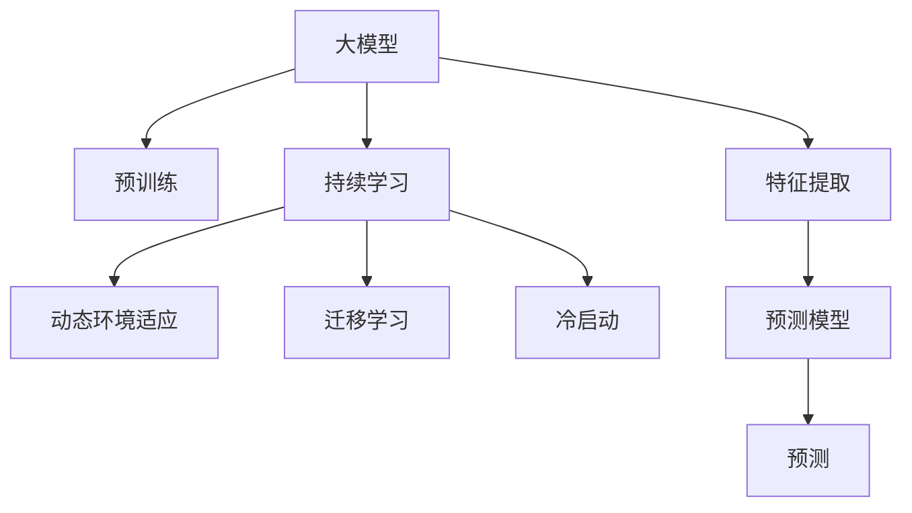

                 

# 电商行业中的持续学习：大模型在动态环境适应中的应用

> 关键词：持续学习,大模型,动态环境,电商行业,电商客户行为预测

## 1. 背景介绍

### 1.1 问题由来
在电商行业，客户行为预测（Customer Behavior Prediction）是企业决策支持系统（Decision Support System, DSS）的重要组成部分，其目的是预测客户的购买行为，从而提高销售额、提升客户满意度。传统的客户行为预测方法依赖于手工特征工程和统计模型，需要大量人工干预，且无法捕捉到客户行为动态变化的特点。而随着大模型和持续学习技术的进步，电商行业开始探索利用这些前沿技术来提高客户行为预测的准确性和动态适应能力。

### 1.2 问题核心关键点
现代电商行业中，客户行为预测面临以下关键问题：

- **数据量庞大且分布广泛**：电商平台拥有海量的交易数据和用户行为数据，但这些数据分布在不同地区、不同时间段，且数据质量参差不齐。
- **数据维度高**：涉及客户的基本信息、历史行为、交易记录等，需要处理多种不同类型的数据。
- **行为动态性**：客户行为受季节、节假日、促销活动等多种动态因素影响，需要实时更新的模型。
- **冷启动问题**：新用户或新商品未与模型充分交互，预测准确度低。

基于大模型和持续学习的客户行为预测方法，能够动态适应数据变化和行为动态性，同时解决冷启动问题，提高预测准确度和实时性。

### 1.3 问题研究意义
研究基于大模型的持续学习方法，对于提升电商企业的客户行为预测能力，优化库存管理，个性化推荐，精准营销等都有重要意义：

- **减少人工干预**：大模型能够自动从数据中学习特征，减少手工特征工程的工作量。
- **动态适应**：大模型能够实时更新知识，动态适应电商市场的变化。
- **提升预测精度**：通过不断学习新数据，大模型可以逐步提高预测的准确度。
- **解决冷启动问题**：新用户或新商品的预测可以通过迁移学习来解决，提高模型的实时性。
- **支撑实时决策**：实时学习能更好地支持企业快速决策，提高市场响应速度。

## 2. 核心概念与联系

### 2.1 核心概念概述

为更好地理解基于大模型的持续学习方法，本节将介绍几个密切相关的核心概念：

- **大模型**：以Transformer为代表的深度学习模型，通过在大规模无标签数据上进行预训练，学习到通用的语言或特征表示。
- **持续学习**：模型在应用过程中，能够不断地从新数据中学习，更新知识，避免过拟合和遗忘。
- **迁移学习**：将一个领域学到的知识迁移到另一个领域的学习方法，如通过大模型的预训练和微调进行迁移。
- **冷启动**：新用户或新商品缺乏足够数据，无法进行准确预测的问题。
- **动态环境**：客户行为受多种动态因素影响，模型需要动态适应。

这些核心概念之间的逻辑关系可以通过以下Mermaid流程图来展示：



这个流程图展示了大模型、持续学习与迁移学习、冷启动、动态环境适应等概念之间的关系：

1. 大模型通过预训练获得基础能力。
2. 持续学习使得模型能够不断从新数据中学习，更新知识。
3. 迁移学习是连接预训练模型与特定任务的关键，可以通过微调进行知识迁移。
4. 冷启动问题通过迁移学习来解决，使得模型能够适应新用户或新商品。
5. 动态环境适应通过持续学习实现，使得模型能够实时更新，动态适应变化。

这些概念共同构成了大模型在电商行业中应用的框架，使其能够更好地适应动态环境，解决冷启动问题，提高预测精度。

## 3. 核心算法原理 & 具体操作步骤
### 3.1 算法原理概述

基于大模型的持续学习方法，其核心思想是：利用大模型的强大表征能力，通过实时更新模型参数，动态适应电商客户行为的动态变化，提升预测模型的实时性和适应性。该方法可以分为以下几个步骤：

1. **数据收集与预处理**：从电商平台中收集客户交易和行为数据，并进行清洗、标准化等预处理。
2. **特征提取与模型初始化**：利用大模型的预训练表示作为初始化特征提取器，对新数据进行特征提取。
3. **模型训练与更新**：使用收集到的新数据对模型进行训练，更新模型参数，以动态适应客户行为的动态变化。
4. **迁移学习与优化**：在新客户或新商品缺乏足够数据的情况下，通过迁移学习利用已有的知识进行预测，同时优化模型。

### 3.2 算法步骤详解

以下详细介绍基于大模型的持续学习在电商客户行为预测中的应用。

**Step 1: 数据收集与预处理**

电商平台每天都会产生大量的交易和行为数据。这些数据需要经过清洗和预处理，以确保数据质量。常见的预处理步骤包括：

- 去除无效数据：如缺失值、异常值等。
- 数据标准化：将数据转换为标准格式，如将日期、时间等转换为易于处理的形式。
- 特征选择与编码：选择对预测有用的特征，并进行编码处理。
- 数据划分：将数据划分为训练集、验证集和测试集。

**Step 2: 特征提取与模型初始化**

电商数据通常包含多种类型的数据，如文本、时间戳、数值等。大模型能够处理不同类型的数据，但其输入格式需要进行标准化。常用的预训练模型如BERT、GPT等，其输出为向量表示，可以直接作为输入特征。

1. 选择预训练模型：如BERT、GPT等，其输出为向量表示，可以直接作为输入特征。
2. 初始化模型：将模型作为特征提取器，对电商数据进行预处理，提取特征表示。

**Step 3: 模型训练与更新**

实时更新模型参数，动态适应客户行为的动态变化。该步骤具体如下：

1. 选择优化器：如AdamW、SGD等，设置学习率、批大小等参数。
2. 定义损失函数：如交叉熵、均方误差等，衡量预测值与真实值之间的差异。
3. 定义训练循环：按批次对新数据进行迭代，更新模型参数。
4. 实时监控模型性能：在每个epoch后，监控模型在验证集上的性能，决定是否触发Early Stopping。

**Step 4: 迁移学习与优化**

在新客户或新商品缺乏足够数据的情况下，可以通过迁移学习来提高预测精度。具体步骤如下：

1. 数据增强：对少量样本进行数据增强，如回译、近义词替换等。
2. 迁移学习：利用已有模型的知识，通过微调提高模型在新样本上的性能。
3. 模型优化：利用已有的知识进行模型优化，提升模型在新数据上的表现。

### 3.3 算法优缺点

基于大模型的持续学习方法具有以下优点：

- **动态适应性强**：能够实时更新，动态适应电商市场的变化。
- **预测精度高**：通过持续学习，模型可以不断优化，提高预测精度。
- **冷启动效果好**：通过迁移学习，解决新用户或新商品的预测问题。
- **特征提取能力强**：大模型能够处理多种类型的数据，提取有用的特征。

同时，该方法也存在一定的局限性：

- **计算资源需求高**：实时更新模型参数需要较高的计算资源。
- **模型复杂度较高**：模型结构复杂，训练和推理开销较大。
- **数据依赖性强**：数据质量对模型的影响较大，需要高质量的数据。

尽管存在这些局限性，但就目前而言，基于大模型的持续学习方法是电商客户行为预测中的主流方法。未来相关研究的重点在于如何进一步优化计算资源使用，提升模型效率，同时提高数据处理能力和模型鲁棒性。

### 3.4 算法应用领域

基于大模型的持续学习在电商行业已经得到了广泛的应用，涵盖了客户行为预测、个性化推荐、库存管理、营销策略优化等诸多领域，成为电商企业决策支持系统的重要组成部分。

具体应用场景包括：

1. **客户行为预测**：预测客户的购买行为、退货行为、流失行为等，帮助企业优化库存管理。
2. **个性化推荐**：基于客户行为预测结果，推荐个性化的商品或服务，提高客户满意度。
3. **库存管理**：预测商品的销售趋势，优化库存水平，降低库存成本。
4. **营销策略优化**：通过预测客户行为，制定更加精准的营销策略，提升营销效果。
5. **客户细分**：根据客户行为预测结果，对客户进行细分，实现更加精准的客户管理。

除了上述这些经典应用外，持续学习方法也被创新性地应用到更多场景中，如实时预警、广告投放优化、价格策略调整等，为电商企业带来了更精准、高效的决策支持。

## 4. 数学模型和公式 & 详细讲解  
### 4.1 数学模型构建

本节将使用数学语言对基于大模型的持续学习在电商客户行为预测中的应用进行更加严格的刻画。

记电商客户行为预测的数据集为 $D=\{(x_i,y_i)\}_{i=1}^N, x_i \in \mathcal{X}, y_i \in \mathcal{Y}$。其中 $x_i$ 为电商客户的输入特征，如历史行为、商品信息、时间戳等；$y_i$ 为输出标签，如是否购买、是否退货等。

定义模型 $M_{\theta}$ 在输入 $x$ 上的预测结果为 $\hat{y}=M_{\theta}(x)$，其中 $\theta$ 为模型参数。

假设客户行为预测的任务为二分类问题，则模型的损失函数定义为：

$$
\ell(M_{\theta}(x),y) = -[y\log M_{\theta}(x) + (1-y)\log(1-M_{\theta}(x))]
$$

将其代入经验风险公式，得：

$$
\mathcal{L}(\theta) = -\frac{1}{N}\sum_{i=1}^N [y_i\log M_{\theta}(x_i)+(1-y_i)\log(1-M_{\theta}(x_i))]
$$

实时更新的优化目标是最小化经验风险，即找到最优参数：

$$
\theta^* = \mathop{\arg\min}_{\theta} \mathcal{L}(\theta)
$$

在实践中，我们通常使用基于梯度的优化算法（如AdamW、SGD等）来近似求解上述最优化问题。设 $\eta$ 为学习率，$\lambda$ 为正则化系数，则参数的更新公式为：

$$
\theta \leftarrow \theta - \eta \nabla_{\theta}\mathcal{L}(\theta) - \eta\lambda\theta
$$

其中 $\nabla_{\theta}\mathcal{L}(\theta)$ 为损失函数对参数 $\theta$ 的梯度，可通过反向传播算法高效计算。

### 4.2 公式推导过程

以下我们以二分类任务为例，推导交叉熵损失函数及其梯度的计算公式。

假设模型 $M_{\theta}$ 在输入 $x$ 上的输出为 $\hat{y}=M_{\theta}(x) \in [0,1]$，表示样本属于正类的概率。真实标签 $y \in \{0,1\}$。则二分类交叉熵损失函数定义为：

$$
\ell(M_{\theta}(x),y) = -[y\log \hat{y} + (1-y)\log (1-\hat{y})]
$$

将其代入经验风险公式，得：

$$
\mathcal{L}(\theta) = -\frac{1}{N}\sum_{i=1}^N [y_i\log M_{\theta}(x_i)+(1-y_i)\log(1-M_{\theta}(x_i))]
$$

根据链式法则，损失函数对参数 $\theta_k$ 的梯度为：

$$
\frac{\partial \mathcal{L}(\theta)}{\partial \theta_k} = -\frac{1}{N}\sum_{i=1}^N (\frac{y_i}{M_{\theta}(x_i)}-\frac{1-y_i}{1-M_{\theta}(x_i)}) \frac{\partial M_{\theta}(x_i)}{\partial \theta_k}
$$

其中 $\frac{\partial M_{\theta}(x_i)}{\partial \theta_k}$ 可进一步递归展开，利用自动微分技术完成计算。

在得到损失函数的梯度后，即可带入参数更新公式，完成模型的迭代优化。重复上述过程直至收敛，最终得到适应实时动态环境的模型参数 $\theta^*$。

## 5. 项目实践：代码实例和详细解释说明
### 5.1 开发环境搭建

在进行持续学习实践前，我们需要准备好开发环境。以下是使用Python进行PyTorch开发的环境配置流程：

1. 安装Anaconda：从官网下载并安装Anaconda，用于创建独立的Python环境。

2. 创建并激活虚拟环境：
```bash
conda create -n pytorch-env python=3.8 
conda activate pytorch-env
```

3. 安装PyTorch：根据CUDA版本，从官网获取对应的安装命令。例如：
```bash
conda install pytorch torchvision torchaudio cudatoolkit=11.1 -c pytorch -c conda-forge
```

4. 安装Transformers库：
```bash
pip install transformers
```

5. 安装各类工具包：
```bash
pip install numpy pandas scikit-learn matplotlib tqdm jupyter notebook ipython
```

完成上述步骤后，即可在`pytorch-env`环境中开始持续学习实践。

### 5.2 源代码详细实现

这里我们以客户行为预测为例，给出使用Transformers库对BERT模型进行持续学习的PyTorch代码实现。

首先，定义客户行为预测任务的数据处理函数：

```python
from transformers import BertTokenizer
from torch.utils.data import Dataset
import torch

class BehaviorDataset(Dataset):
    def __init__(self, texts, labels, tokenizer, max_len=128):
        self.texts = texts
        self.labels = labels
        self.tokenizer = tokenizer
        self.max_len = max_len
        
    def __len__(self):
        return len(self.texts)
    
    def __getitem__(self, item):
        text = self.texts[item]
        label = self.labels[item]
        
        encoding = self.tokenizer(text, return_tensors='pt', max_length=self.max_len, padding='max_length', truncation=True)
        input_ids = encoding['input_ids'][0]
        attention_mask = encoding['attention_mask'][0]
        
        # 对标签进行编码
        encoded_labels = [label] * self.max_len
        labels = torch.tensor(encoded_labels, dtype=torch.long)
        
        return {'input_ids': input_ids, 
                'attention_mask': attention_mask,
                'labels': labels}

# 创建dataset
tokenizer = BertTokenizer.from_pretrained('bert-base-cased')

train_dataset = BehaviorDataset(train_texts, train_labels, tokenizer)
dev_dataset = BehaviorDataset(dev_texts, dev_labels, tokenizer)
test_dataset = BehaviorDataset(test_texts, test_labels, tokenizer)
```

然后，定义模型和优化器：

```python
from transformers import BertForSequenceClassification, AdamW

model = BertForSequenceClassification.from_pretrained('bert-base-cased', num_labels=2)

optimizer = AdamW(model.parameters(), lr=2e-5)
```

接着，定义训练和评估函数：

```python
from torch.utils.data import DataLoader
from tqdm import tqdm
from sklearn.metrics import classification_report

device = torch.device('cuda') if torch.cuda.is_available() else torch.device('cpu')
model.to(device)

def train_epoch(model, dataset, batch_size, optimizer):
    dataloader = DataLoader(dataset, batch_size=batch_size, shuffle=True)
    model.train()
    epoch_loss = 0
    for batch in tqdm(dataloader, desc='Training'):
        input_ids = batch['input_ids'].to(device)
        attention_mask = batch['attention_mask'].to(device)
        labels = batch['labels'].to(device)
        model.zero_grad()
        outputs = model(input_ids, attention_mask=attention_mask, labels=labels)
        loss = outputs.loss
        epoch_loss += loss.item()
        loss.backward()
        optimizer.step()
    return epoch_loss / len(dataloader)

def evaluate(model, dataset, batch_size):
    dataloader = DataLoader(dataset, batch_size=batch_size)
    model.eval()
    preds, labels = [], []
    with torch.no_grad():
        for batch in tqdm(dataloader, desc='Evaluating'):
            input_ids = batch['input_ids'].to(device)
            attention_mask = batch['attention_mask'].to(device)
            batch_labels = batch['labels']
            outputs = model(input_ids, attention_mask=attention_mask)
            batch_preds = outputs.logits.argmax(dim=2).to('cpu').tolist()
            batch_labels = batch_labels.to('cpu').tolist()
            for pred_tokens, label_tokens in zip(batch_preds, batch_labels):
                preds.append(pred_tokens[:len(label_tokens)])
                labels.append(label_tokens)
                
    print(classification_report(labels, preds))
```

最后，启动训练流程并在测试集上评估：

```python
epochs = 5
batch_size = 16

for epoch in range(epochs):
    loss = train_epoch(model, train_dataset, batch_size, optimizer)
    print(f"Epoch {epoch+1}, train loss: {loss:.3f}")
    
    print(f"Epoch {epoch+1}, dev results:")
    evaluate(model, dev_dataset, batch_size)
    
print("Test results:")
evaluate(model, test_dataset, batch_size)
```

以上就是使用PyTorch对BERT进行客户行为预测任务的持续学习的完整代码实现。可以看到，得益于Transformers库的强大封装，我们可以用相对简洁的代码完成BERT模型的加载和持续学习。

### 5.3 代码解读与分析

让我们再详细解读一下关键代码的实现细节：

**BehaviorDataset类**：
- `__init__`方法：初始化文本、标签、分词器等关键组件。
- `__len__`方法：返回数据集的样本数量。
- `__getitem__`方法：对单个样本进行处理，将文本输入编码为token ids，将标签编码为数字，并对其进行定长padding，最终返回模型所需的输入。

**标签与id的映射**：
- 定义了标签与数字id之间的映射关系，用于将token-wise的预测结果解码回真实的标签。

**训练和评估函数**：
- 使用PyTorch的DataLoader对数据集进行批次化加载，供模型训练和推理使用。
- 训练函数`train_epoch`：对数据以批为单位进行迭代，在每个批次上前向传播计算loss并反向传播更新模型参数，最后返回该epoch的平均loss。
- 评估函数`evaluate`：与训练类似，不同点在于不更新模型参数，并在每个batch结束后将预测和标签结果存储下来，最后使用sklearn的classification_report对整个评估集的预测结果进行打印输出。

**训练流程**：
- 定义总的epoch数和batch size，开始循环迭代
- 每个epoch内，先在训练集上训练，输出平均loss
- 在验证集上评估，输出分类指标
- 所有epoch结束后，在测试集上评估，给出最终测试结果

可以看到，PyTorch配合Transformers库使得BERT持续学习的代码实现变得简洁高效。开发者可以将更多精力放在数据处理、模型改进等高层逻辑上，而不必过多关注底层的实现细节。

当然，工业级的系统实现还需考虑更多因素，如模型的保存和部署、超参数的自动搜索、更灵活的任务适配层等。但核心的持续学习范式基本与此类似。

## 6. 实际应用场景
### 6.1 电商客户行为预测

基于大模型持续学习的客户行为预测，可以应用于电商平台的各类决策支持系统中。例如：

- **库存管理**：预测商品的销售趋势，优化库存水平，避免缺货或过剩。
- **个性化推荐**：根据客户的历史行为预测其可能感兴趣的商品，提高推荐系统的个性化程度。
- **营销策略优化**：通过客户行为预测，制定更精准的营销策略，提升广告点击率。
- **客户细分**：根据客户行为预测结果，对客户进行细分，实现更加精准的客户管理。

除了上述这些经典应用外，客户行为预测方法也被创新性地应用到更多场景中，如价格优化、广告投放、促销活动设计等，为电商企业带来了更精准、高效的决策支持。

### 6.2 未来应用展望

随着大模型和持续学习技术的不断发展，基于大模型的持续学习方法将在电商行业中得到更广泛的应用，为电商企业带来更多的商业价值。

在智慧零售领域，客户行为预测将帮助零售企业实现智能化的库存管理、个性化推荐、营销策略优化等，提升零售效率和用户体验。

在智能制造领域，通过客户行为预测，制造企业可以更准确地预测市场需求，优化生产计划，减少资源浪费。

在智慧旅游领域，旅游企业可以利用客户行为预测，优化旅游产品设计、提升用户体验，实现更精准的市场营销。

此外，在金融、医疗、教育等更多领域，基于大模型的持续学习将能够带来更多创新应用，推动人工智能技术在各行各业的发展。

## 7. 工具和资源推荐
### 7.1 学习资源推荐

为了帮助开发者系统掌握大模型持续学习的方法，这里推荐一些优质的学习资源：

1. 《Transformer从原理到实践》系列博文：由大模型技术专家撰写，深入浅出地介绍了Transformer原理、BERT模型、持续学习技术等前沿话题。

2. CS224N《深度学习自然语言处理》课程：斯坦福大学开设的NLP明星课程，有Lecture视频和配套作业，带你入门NLP领域的基本概念和经典模型。

3. 《Natural Language Processing with Transformers》书籍：Transformers库的作者所著，全面介绍了如何使用Transformers库进行NLP任务开发，包括持续学习在内的诸多范式。

4. HuggingFace官方文档：Transformers库的官方文档，提供了海量预训练模型和完整的持续学习样例代码，是上手实践的必备资料。

5. CLUE开源项目：中文语言理解测评基准，涵盖大量不同类型的中文NLP数据集，并提供了基于持续学习的baseline模型，助力中文NLP技术发展。

通过对这些资源的学习实践，相信你一定能够快速掌握大模型持续学习的精髓，并用于解决实际的NLP问题。

### 7.2 开发工具推荐

高效的开发离不开优秀的工具支持。以下是几款用于大模型持续学习开发的常用工具：

1. PyTorch：基于Python的开源深度学习框架，灵活动态的计算图，适合快速迭代研究。大部分预训练语言模型都有PyTorch版本的实现。

2. TensorFlow：由Google主导开发的开源深度学习框架，生产部署方便，适合大规模工程应用。同样有丰富的预训练语言模型资源。

3. Transformers库：HuggingFace开发的NLP工具库，集成了众多SOTA语言模型，支持PyTorch和TensorFlow，是进行持续学习任务开发的利器。

4. Weights & Biases：模型训练的实验跟踪工具，可以记录和可视化模型训练过程中的各项指标，方便对比和调优。与主流深度学习框架无缝集成。

5. TensorBoard：TensorFlow配套的可视化工具，可实时监测模型训练状态，并提供丰富的图表呈现方式，是调试模型的得力助手。

6. Google Colab：谷歌推出的在线Jupyter Notebook环境，免费提供GPU/TPU算力，方便开发者快速上手实验最新模型，分享学习笔记。

合理利用这些工具，可以显著提升大模型持续学习的开发效率，加快创新迭代的步伐。

### 7.3 相关论文推荐

大模型和持续学习的发展源于学界的持续研究。以下是几篇奠基性的相关论文，推荐阅读：

1. Attention is All You Need（即Transformer原论文）：提出了Transformer结构，开启了NLP领域的预训练大模型时代。

2. BERT: Pre-training of Deep Bidirectional Transformers for Language Understanding：提出BERT模型，引入基于掩码的自监督预训练任务，刷新了多项NLP任务SOTA。

3. Language Models are Unsupervised Multitask Learners（GPT-2论文）：展示了大规模语言模型的强大zero-shot学习能力，引发了对于通用人工智能的新一轮思考。

4. Continuous Learning with Very Large Neural Networks：提出VNN模型，通过连续学习实现大规模神经网络的鲁棒性和泛化能力。

5. Continuous Learning in Neural Networks with Chunked Data Flow（ChunkNet）：提出ChunkNet模型，利用分块数据流实现高效的持续学习。

这些论文代表了大模型和持续学习技术的发展脉络。通过学习这些前沿成果，可以帮助研究者把握学科前进方向，激发更多的创新灵感。

## 8. 总结：未来发展趋势与挑战

### 8.1 总结

本文对基于大模型的持续学习在电商行业中的应用进行了全面系统的介绍。首先阐述了客户行为预测在电商行业中的重要性，明确了持续学习在动态环境适应中的独特价值。其次，从原理到实践，详细讲解了持续学习在大模型中的实现方法和步骤，给出了完整的代码实现。同时，本文还广泛探讨了持续学习方法在电商行业的实际应用，展示了持续学习范式的巨大潜力。

通过本文的系统梳理，可以看到，基于大模型的持续学习方法正在成为电商行业中的重要范式，极大地提高了客户行为预测的动态适应能力和实时性。得益于大模型的强大表征能力，持续学习可以不断更新模型，动态适应电商市场的变化，解决冷启动问题，提高预测精度。未来，随着持续学习技术的不断成熟，客户行为预测将能够更好地支撑电商企业的决策支持，提高运营效率和用户体验。

### 8.2 未来发展趋势

展望未来，大模型持续学习方法将呈现以下几个发展趋势：

1. **计算资源需求降低**：随着硬件技术的发展，持续学习将不再受限于计算资源，更多企业将能够轻松应用。
2. **模型效率提升**：通过优化模型结构和计算图，持续学习的计算效率将显著提升，更易于实时部署。
3. **数据管理优化**：针对海量数据管理，持续学习将发展出更加高效的数据处理和存储方法。
4. **模型鲁棒性增强**：通过引入对抗训练和数据增强等技术，持续学习模型将具备更强的鲁棒性，适应更多的动态变化。
5. **迁移学习多样化**：除了传统的微调外，迁移学习的技术手段将更加多样化，适用于更多类型的冷启动问题。
6. **多模态融合**：将视觉、语音、文本等多种模态数据进行融合，提升客户行为预测的准确性。

这些趋势凸显了大模型持续学习技术的广阔前景。这些方向的探索发展，必将进一步提升电商行业中的决策支持能力，提升运营效率和客户满意度。

### 8.3 面临的挑战

尽管大模型持续学习技术已经取得了瞩目成就，但在迈向更加智能化、普适化应用的过程中，它仍面临着诸多挑战：

1. **计算资源限制**：持续学习的计算资源需求较高，如何优化计算效率，降低硬件成本，仍是主要挑战之一。
2. **模型复杂度**：大模型的复杂度较高，推理和训练开销较大，如何优化模型结构，提高效率，仍需进一步研究。
3. **数据质量问题**：电商数据存在噪声和不一致性，如何保证数据质量，提高模型鲁棒性，仍需进一步研究。
4. **实时性要求高**：电商企业对实时性要求较高，如何提高持续学习的实时性，提升决策效率，仍需进一步研究。
5. **跨领域迁移能力不足**：不同领域的数据特点不同，如何将知识跨领域迁移，仍需进一步研究。

尽管存在这些挑战，但就目前而言，基于大模型的持续学习方法仍是电商行业中的主流方法。未来相关研究的重点在于如何进一步优化计算资源使用，提升模型效率，同时提高数据处理能力和模型鲁棒性。

### 8.4 研究展望

面对大模型持续学习所面临的挑战，未来的研究需要在以下几个方面寻求新的突破：

1. **引入自监督学习**：利用自监督学习任务，提高模型的表征能力，降低对标注数据的依赖。
2. **探索半监督学习**：结合少量标注数据和大量未标注数据，提高模型的泛化能力和鲁棒性。
3. **发展增量学习**：通过增量学习实现模型的持续更新，降低计算资源消耗。
4. **引入对抗训练**：通过对抗训练提高模型的鲁棒性，应对动态环境中的挑战。
5. **发展跨领域迁移方法**：通过跨领域迁移方法，提高模型的泛化能力和鲁棒性。

这些研究方向的探索，必将引领大模型持续学习技术迈向更高的台阶，为构建安全、可靠、可解释、可控的智能系统铺平道路。面向未来，大模型持续学习技术还需要与其他人工智能技术进行更深入的融合，如知识表示、因果推理、强化学习等，多路径协同发力，共同推动自然语言理解和智能交互系统的进步。只有勇于创新、敢于突破，才能不断拓展语言模型的边界，让智能技术更好地造福人类社会。

## 9. 附录：常见问题与解答

**Q1：大模型持续学习是否适用于所有电商应用场景？**

A: 大模型持续学习在大多数电商应用场景中都能取得不错的效果，特别是对于数据量较大的任务。但对于一些特定领域，如冷启动问题较为严重的场景，可能需要进一步优化数据增强和迁移学习方法。

**Q2：大模型持续学习在实际部署中需要注意哪些问题？**

A: 将持续学习模型转化为实际应用，还需要考虑以下因素：
1. 模型裁剪：去除不必要的层和参数，减小模型尺寸，加快推理速度。
2. 量化加速：将浮点模型转为定点模型，压缩存储空间，提高计算效率。
3. 服务化封装：将模型封装为标准化服务接口，便于集成调用。
4. 弹性伸缩：根据请求流量动态调整资源配置，平衡服务质量和成本。
5. 监控告警：实时采集系统指标，设置异常告警阈值，确保服务稳定性。

大模型持续学习为电商企业带来了更精准、高效的决策支持，但如何将强大的性能转化为稳定、高效、安全的业务价值，还需要工程实践的不断打磨。唯有从数据、算法、工程、业务等多个维度协同发力，才能真正实现人工智能技术在垂直行业的规模化落地。总之，持续学习需要开发者根据具体任务，不断迭代和优化模型、数据和算法，方能得到理想的效果。

---

作者：禅与计算机程序设计艺术 / Zen and the Art of Computer Programming

