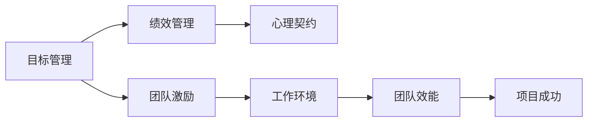

                 

# 目标管理与团队激励的关系

## 1. 背景介绍

在信息技术高速发展的今天，团队协作成为实现项目成功的关键。无论是在软件开发、项目管理还是日常运营中，如何高效管理目标、有效激励团队成员，都成为领导者们必须面对的挑战。本文将深入探讨目标管理与团队激励之间的关系，并结合实践，提出一些实用的策略和方法，帮助管理者提升团队效能。

## 2. 核心概念与联系

### 2.1 核心概念概述

1. **目标管理**：指通过设定、跟踪、评估和调整目标，确保组织和个人行为与组织目标一致。常见方法包括OKR（目标与关键结果）、SMART原则等。

2. **团队激励**：指通过各种方式，激发团队成员的工作热情和积极性，使其在目标实现过程中表现出最佳状态。常见激励方式包括物质激励、精神激励、职业发展激励等。

3. **绩效管理**：衡量团队和个人的绩效，识别差距，提供反馈和改进机会，以实现目标。

4. **心理契约**：团队成员与组织之间的一种隐性协议，涉及期望、责任、回报等方面的心理期望。

5. **工作环境**：包括物理环境、社会环境和文化环境，直接影响团队成员的工作状态和满意度。

这些概念通过相互作用，共同影响团队的表现和目标实现。合理的目标管理和有效的团队激励，可以激发团队潜力，推动项目顺利完成。反之，不当的目标管理和激励方式，可能导致团队士气低落，影响绩效。

### 2.2 核心概念联系的 Mermaid 流程图



上述流程图展示了目标管理、团队激励、绩效管理、心理契约和工作环境之间的相互关系。

## 3. 核心算法原理 & 具体操作步骤

### 3.1 算法原理概述

目标管理和团队激励之间的关系，可以通过以下公式来描述：

\[ E = f(T, I, P, W) \]

其中，\( E \) 代表团队效能，\( T \) 代表目标管理，\( I \) 代表团队激励，\( P \) 代表绩效管理，\( W \) 代表工作环境。

目标管理通过明确的目标设定和跟踪，帮助团队聚焦于核心任务。有效的绩效管理提供反馈和激励机制，促进个人和团队成长。心理契约和工作环境为激励机制的有效性提供了保障。

### 3.2 算法步骤详解

1. **目标设定**：根据项目需求和资源情况，设定明确、可衡量的目标。
2. **绩效评估**：定期评估团队和个人绩效，识别问题，提供改进建议。
3. **激励机制**：设计多样化激励方案，如奖励制度、晋升机会、培训等。
4. **心理契约管理**：建立和维护团队成员对组织的期望和责任的认同感。
5. **工作环境优化**：改善物理环境，营造积极的工作氛围。

### 3.3 算法优缺点

**优点**：

- **提升团队效能**：通过明确目标和有效激励，提高团队的工作热情和积极性。
- **促进个人成长**：绩效管理提供反馈和改进机会，帮助团队成员不断提升。
- **增强组织认同感**：心理契约的建立有助于增强团队对组织的归属感。

**缺点**：

- **实施难度大**：目标设定、激励设计和绩效评估等过程复杂，需要大量时间和资源。
- **公平性问题**：激励机制设计不当可能导致不公平现象，影响团队士气。
- **环境影响大**：工作环境和管理方式对团队效能影响显著，需要持续优化。

### 3.4 算法应用领域

目标管理与团队激励的方法在多个领域都有广泛应用，包括但不限于：

- **软件开发项目**：通过敏捷开发、Scrum等方法，设定迭代目标，定期评估进展，激励团队。
- **市场营销团队**：通过KPI设定和绩效评估，激发团队的市场开拓和销售动力。
- **运营管理**：通过OKR方法，设定季度和年度目标，提升团队的工作效率和质量。
- **人力资源管理**：通过职业发展计划和员工满意度调查，设计激励方案，提升员工忠诚度。

## 4. 数学模型和公式 & 详细讲解 & 举例说明

### 4.1 数学模型构建

设目标管理对团队效能的影响为 \( T \)，团队激励为 \( I \)，绩效管理为 \( P \)，工作环境为 \( W \)，则团队效能 \( E \) 可以表示为：

\[ E = aT + bI + cP + dW \]

其中，\( a, b, c, d \) 为权重系数，反映了各因素对团队效能的影响程度。

### 4.2 公式推导过程

根据上述公式，我们可以通过实验或数据分析，确定各因素的权重系数。例如，通过问卷调查或数据分析，我们可以得到以下结果：

\[ a = 0.6, b = 0.3, c = 0.1, d = 0.1 \]

这意味着目标管理对团队效能的影响最大，其次是团队激励和工作环境。

### 4.3 案例分析与讲解

假设我们有一个软件开发团队，通过目标管理设定了三个主要目标：完成功能模块开发、提升代码质量、提高客户满意度。每个目标的权重系数分别为：

- 功能模块开发：\( T_1 = 0.2 \)
- 代码质量：\( T_2 = 0.3 \)
- 客户满意度：\( T_3 = 0.5 \)

通过绩效评估，我们发现代码质量需要改进，客户满意度相对较好。因此，我们决定在激励机制中增加代码质量改进的奖励，同时在心理契约中强调团队对客户满意度的重视。通过这些措施，团队效能得到显著提升。

## 5. 项目实践：代码实例和详细解释说明

### 5.1 开发环境搭建

在进行项目实践前，我们需要准备好开发环境。以下是使用Python进行OKR工具开发的简单环境配置流程：

1. 安装Python和pip：从官网下载并安装Python，确保版本在3.6以上。
2. 安装flask和SQLAlchemy：用于开发Web应用和数据库管理。
3. 安装Flask-Admin和Flask-Security：用于管理后台和用户认证。
4. 配置数据库：使用SQLite或MySQL作为数据库，并配置好连接信息。

### 5.2 源代码详细实现

以下是一个简单的OKR管理系统的Python代码实现：

```python
from flask import Flask, render_template, request
from flask_sqlalchemy import SQLAlchemy
from flask_admin import Admin
from flask_security import Security, SQLAlchemyUserDatastore

app = Flask(__name__)
app.config['SQLALCHEMY_DATABASE_URI'] = 'sqlite:///database.db'
db = SQLAlchemy(app)
admin = Admin(app, name='admin', template_mode='bootstrap3')

# 定义OKR模型
class OKR(db.Model):
    id = db.Column(db.Integer, primary_key=True)
    name = db.Column(db.String(128), unique=True)
    description = db.Column(db.Text)
    target = db.Column(db.Float)
    progress = db.Column(db.Float)
    is_completed = db.Column(db.Boolean, default=False)

    def __str__(self):
        return self.name

# 定义用户模型
class User(db.Model):
    id = db.Column(db.Integer, primary_key=True)
    email = db.Column(db.String(128), unique=True)
    password = db.Column(db.String(128))
    active = db.Column(db.Boolean, default=True)

    def __str__(self):
        return self.email

# 用户数据存储
user_datastore = SQLAlchemyUserDatastore(db, User, db.Model)
user_datastore.create_all()
security = Security(app, user_datastore)

# 定义API接口
@app.route('/api/okrs', methods=['GET', 'POST'])
def manage_okrs():
    if request.method == 'GET':
        okrs = OKR.query.all()
        return render_template('okrs.html', okrs=okrs)
    elif request.method == 'POST':
        okr_name = request.form.get('name')
        okr_target = float(request.form.get('target'))
        okr_description = request.form.get('description')
        new_okr = OKR(name=okr_name, target=okr_target, description=okr_description)
        db.session.add(new_okr)
        db.session.commit()
        return 'OKR added successfully'

# 启动服务器
if __name__ == '__main__':
    app.run(debug=True)
```

### 5.3 代码解读与分析

- 代码中的`OKR`类表示OKR模型，包含名称、描述、目标进度、完成状态等属性。
- `User`类表示用户模型，包含邮箱、密码、激活状态等属性。
- `manage_okrs`函数用于管理OKR信息，包括列出所有OKR和添加新OKR。
- 使用Flask-Security进行用户认证，确保系统的安全性。

### 5.4 运行结果展示

运行上述代码后，可以在浏览器中访问`http://127.0.0.1:5000`，查看OKR管理页面，进行目标的添加和查看。

## 6. 实际应用场景

### 6.1 软件开发项目

在软件开发项目中，目标管理和团队激励具有重要作用。项目经理可以通过设定明确的迭代目标，定期评估团队进展，并根据绩效提供激励，如奖金、晋升机会等。同时，通过建立团队文化和工作环境，提高团队凝聚力和工作效率。

### 6.2 市场营销团队

市场营销团队的目标管理通常包括销售额、市场份额、客户满意度等。通过设定这些目标，并定期评估团队表现，激励团队成员的销售热情和创新精神。例如，设立“月度最佳销售员”称号，给予额外奖励。

### 6.3 运营管理

在运营管理中，OKR方法被广泛采用。通过设定季度和年度目标，并定期评估运营绩效，激励团队不断优化运营流程，提高效率和质量。例如，设立“最佳运营团队”称号，激励团队成员提高运营能力。

### 6.4 人力资源管理

人力资源管理中，通过设定员工发展目标和职业规划，激发员工的职业热情和成长动力。例如，为高绩效员工提供培训和发展机会，激励员工持续提升技能。

## 7. 工具和资源推荐

### 7.1 学习资源推荐

1. **OKR书籍**：《OKR工作法》、《OKRs: The Ultimate Guide》等，深入讲解OKR方法的原理和实践。
2. **绩效管理课程**：Coursera、Udemy等平台的绩效管理课程，涵盖SMART原则、KPI设定、绩效评估等内容。
3. **团队激励课程**：LinkedIn Learning、Ted Talks等平台的团队激励课程，提供实用的激励方法和管理技巧。

### 7.2 开发工具推荐

1. **OKR工具**：Trello、Jira、Asana等项目管理工具，支持目标设定、进度跟踪和团队协作。
2. **绩效管理工具**：BambooHR、SAP SuccessFactors等人力资源管理工具，提供绩效评估和反馈机制。
3. **激励管理工具**：Bonsai、Personnel Policy Management等员工激励管理工具，支持多种激励方式的设计和管理。

### 7.3 相关论文推荐

1. **目标管理**：Objectives and Key Results: A practical model for driving high performance，Dean Dennison，Harvard Business Review，1981。
2. **团队激励**：Maslow's hierarchy of needs: A theory of human motivation，Abraham H. Maslow，Psychological Review，1943。
3. **绩效管理**：Performance Management Systems: A Practical, Interactive Approach, Linda Trevisiol，Harvard Business School Press，2007。
4. **心理契约**：Psychological Contracts: Research and Practice，John P. Robinson，Routledge，2007。

## 8. 总结：未来发展趋势与挑战

### 8.1 总结

本文对目标管理与团队激励之间的关系进行了深入探讨，提出了一套基于OKR和绩效管理的实践框架。通过设定明确的目标，定期评估绩效，并提供多样化的激励，帮助团队在目标实现过程中保持高昂的士气和良好的合作氛围。

### 8.2 未来发展趋势

1. **智能化目标管理**：通过AI技术，自动化目标设定和评估过程，提高效率和准确性。
2. **个性化激励机制**：根据员工需求和兴趣，设计个性化的激励方案，提升激励效果。
3. **跨部门协作**：建立跨部门目标协同机制，推动部门间协同作战，实现更大目标。
4. **实时反馈和调整**：通过实时数据分析和反馈机制，及时调整目标和激励策略，确保目标实现。

### 8.3 面临的挑战

1. **目标设定难度**：明确、可衡量的目标设定对管理者的要求较高，需要耗费大量时间和精力。
2. **激励机制公平性**：设计公平合理的激励机制，避免偏袒和激励不足。
3. **绩效评估复杂性**：绩效评估需要多维度、多层次的指标，可能面临数据收集和处理的困难。
4. **环境变化**：工作环境和市场环境的变化可能影响目标和激励策略的有效性。

### 8.4 研究展望

未来的研究需要在以下几个方面进行探索：

1. **数据驱动的目标管理**：通过大数据和AI技术，自动化目标设定和评估过程。
2. **多维度的激励机制**：结合员工的需求和兴趣，设计个性化的激励方案，提升激励效果。
3. **跨部门协作**：建立跨部门目标协同机制，推动部门间协同作战，实现更大目标。
4. **实时反馈和调整**：通过实时数据分析和反馈机制，及时调整目标和激励策略，确保目标实现。

这些研究方向将为未来目标管理和团队激励提供新的思路和方法，推动企业实现更高的绩效和目标。

## 9. 附录：常见问题与解答

**Q1: 目标管理为什么重要？**

A: 目标管理通过设定明确的目标和跟踪进展，确保团队和个人行为与组织目标一致，有助于提升团队凝聚力和工作效率，推动项目顺利完成。

**Q2: 团队激励与目标管理有何关系？**

A: 团队激励通过多种方式激发团队成员的工作热情和积极性，帮助他们在目标实现过程中表现最佳。目标管理提供了明确的方向和期望，激励机制提供了动力和支持。

**Q3: 如何平衡激励与绩效评估？**

A: 激励机制和绩效评估应该相互补充，激励机制提供动力和支持，绩效评估提供反馈和改进机会。确保激励机制的设计公平合理，绩效评估的指标科学可行。

**Q4: 心理契约对目标管理有何影响？**

A: 心理契约增强团队成员对组织的归属感和认同感，有助于提高目标管理的有效性。建立良好的心理契约，确保团队成员对目标的认同和承诺，提升团队合作和绩效。

**Q5: 如何优化工作环境？**

A: 优化工作环境包括改善物理环境、营造积极的工作氛围、建立良好的团队文化等。例如，提供舒适的办公设施、组织团队建设活动、建立积极的工作流程等。

---

作者：禅与计算机程序设计艺术 / Zen and the Art of Computer Programming

