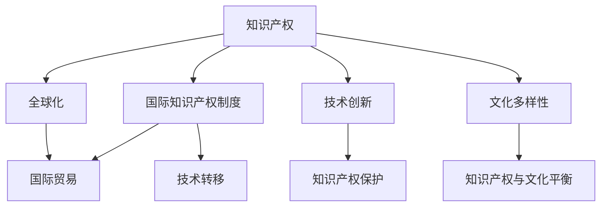

                 

# 知识产权与全球化的互动关系

> 关键词：知识产权, 全球化, 国际知识产权制度, 知识产权保护, 国际贸易, 技术转移

## 1. 背景介绍

### 1.1 问题由来

在全球化的推动下，国际间的人才流动、资本流动和技术流动日益频繁，知识产权作为重要的无形资产，其重要性日益凸显。然而，不同国家和地区的知识产权保护水平、法律体系以及保护范围存在显著差异，这些差异在一定程度上制约了全球化的健康发展。

### 1.2 问题核心关键点

知识产权与全球化之间的互动关系，主要体现在以下几个方面：

- 知识产权保护水平对全球贸易和技术转移的影响：高水平的知识产权保护可以吸引更多的外资和技术投资，促进国际贸易和合作。
- 知识产权法律体系与国际贸易规则的协调：全球化要求不同国家的知识产权法律体系能够协调一致，以避免法律冲突和贸易壁垒。
- 知识产权保护与技术创新的关系：知识产权保护激励创新，推动技术进步，但过度的保护也可能抑制创新。
- 知识产权保护与文化多样性的平衡：在知识产权保护中需要考虑文化多样性，避免版权保护过度压制原创文化。

### 1.3 问题研究意义

研究知识产权与全球化的互动关系，对于促进全球贸易、技术合作和文化交流，构建公平、开放、包容的国际知识产权制度具有重要意义。

## 2. 核心概念与联系

### 2.1 核心概念概述

为更好地理解知识产权与全球化的互动关系，本节将介绍几个密切相关的核心概念：

- **知识产权**：包括专利、商标、版权等，保护创作者的智力成果，防止他人未经授权使用。
- **全球化**：指全球范围内的资本、人才、技术等要素的自由流动，推动各国经济、文化等领域的深度融合。
- **国际知识产权制度**：不同国家和地区在知识产权保护方面的法律、条约和实践，共同构建的国际知识产权保护体系。
- **国际贸易**：指跨越国界的商品、服务和技术交易活动，包括进口、出口、投资等。
- **技术转移**：指技术知识从技术供应方转移到技术接收方的过程，包括专利许可、技术转让、合作研究等。

这些核心概念之间的逻辑关系可以通过以下Mermaid流程图来展示：



这个流程图展示了他知识产权与全球化的核心概念及其之间的关系：

1. 知识产权保护通过全球化在各国间得到推广和执行，推动国际间贸易和技术合作。
2. 国际知识产权制度为全球化提供法律保障，促进国际贸易和技术转移。
3. 技术转移依赖于知识产权保护，提高技术的价值和竞争力。
4. 技术创新依赖于知识产权保护，激励创作者进行原创研发。
5. 文化多样性在知识产权保护中需考虑平衡，确保文化交流的自由。

这些概念共同构成了知识产权与全球化的基本框架，理解这些概念有助于深入探讨其互动关系。

## 3. 核心算法原理 & 具体操作步骤

### 3.1 算法原理概述

知识产权与全球化的互动关系主要体现在知识产权保护、技术转移和国际贸易等方面。其核心算法原理主要包括以下几个方面：

- **算法一**：国际知识产权保护策略，通过制定和执行国际条约、协议等，促进全球知识产权保护水平的提升。
- **算法二**：国际贸易规则的制定与实施，通过贸易谈判、反倾销、反补贴等措施，保障公平竞争，促进技术转移。
- **算法三**：技术转移和知识产权保护的关系，通过技术许可、专利保护等机制，促进技术在全球范围内的传播和应用。
- **算法四**：知识产权保护与文化多样性的平衡，通过国际合作、文化保护协议等，保护原创文化的同时，促进文化交流。

### 3.2 算法步骤详解

#### 3.2.1 算法一：国际知识产权保护策略

1. **步骤一**：制定和签署国际知识产权条约，如《世界知识产权组织版权条约》（WIPO Copyright Treaty）、《与贸易有关的知识产权协议》（TRIPS）等，形成全球统一的知识产权保护标准。
2. **步骤二**：建立国际知识产权争端解决机制，如世界知识产权组织（WIPO）设立的仲裁和调解机制，解决跨国知识产权纠纷。
3. **步骤三**：推动各国建立完善的国内知识产权法律体系，确保国际条约在国内的执行和适用。
4. **步骤四**：开展知识产权保护的国际合作，如国际合作项目（如WIPO），提升各国知识产权保护的协调性和一致性。

#### 3.2.2 算法二：国际贸易规则的制定与实施

1. **步骤一**：通过国际贸易谈判，制定和修改国际贸易规则，如WTO《与贸易有关的知识产权协议》（TRIPS）。
2. **步骤二**：实施贸易保障措施，如反倾销、反补贴等，保护国内知识产权产业，促进公平竞争。
3. **步骤三**：通过贸易和技术合作协议，促进知识产权和技术在全球范围内的自由流动。
4. **步骤四**：推动国际贸易争端解决机制的建立和完善，保障各国合法权益。

#### 3.2.3 算法三：技术转移与知识产权保护

1. **步骤一**：制定技术转移协议，明确各方权利和义务，如专利许可协议、技术转让协议等。
2. **步骤二**：推动跨国专利合作，如《专利合作条约》（PCT），简化跨国专利申请流程。
3. **步骤三**：建立技术转移平台和机制，如技术转移中心（TTCs），促进技术在各国的传播和应用。
4. **步骤四**：制定和实施技术转移的法律和政策，保障技术转移的合法性和安全性。

#### 3.2.4 算法四：知识产权保护与文化多样性

1. **步骤一**：制定文化保护协议，保护各国的文化遗产和传统知识。
2. **步骤二**：推动文化多样性的国际合作，如联合国教科文组织（UNESCO）的文化多样性保护项目。
3. **步骤三**：建立文化多样性的知识产权保护机制，如传统知识数据库（TKDBs），保护文化资源的知识产权。
4. **步骤四**：推动文化交流与合作，通过国际合作项目和协议，促进不同文化的交流与融合。

### 3.3 算法优缺点

#### 3.3.1 算法一的优缺点

**优点**：
- 形成全球统一的知识产权保护标准，促进全球知识产权保护水平的提升。
- 提供国际知识产权争端解决机制，解决跨国知识产权纠纷。
- 推动各国建立完善的国内知识产权法律体系，确保国际条约在国内的执行和适用。
- 通过国际合作，提升各国知识产权保护的协调性和一致性。

**缺点**：
- 不同国家和地区在知识产权保护水平上存在差异，可能影响全球化进程。
- 国际知识产权保护标准可能与各国实际情况不符，存在执行难度。
- 国际知识产权争端解决机制可能效率低下，影响国际贸易和合作。

#### 3.3.2 算法二的优缺点

**优点**：
- 制定和修改国际贸易规则，促进公平竞争，保护国内知识产权产业。
- 实施贸易保障措施，防止倾销和补贴，保障各国合法权益。
- 通过贸易和技术合作协议，促进知识产权和技术在全球范围内的自由流动。
- 推动国际贸易争端解决机制的建立和完善，保障国际贸易稳定。

**缺点**：
- 贸易保障措施可能引发贸易摩擦和争端，影响国际贸易和合作。
- 国际贸易规则可能存在不平衡性，影响发展中国家的知识产权保护。
- 贸易和技术合作协议可能存在执行难度，影响知识产权和技术的自由流动。

#### 3.3.3 算法三的优缺点

**优点**：
- 制定技术转移协议，明确各方权利和义务，促进技术在全球范围内的传播和应用。
- 推动跨国专利合作，简化跨国专利申请流程，提高技术转移效率。
- 建立技术转移平台和机制，促进技术在各国的传播和应用。
- 制定和实施技术转移的法律和政策，保障技术转移的合法性和安全性。

**缺点**：
- 技术转移协议可能存在执行难度，影响技术在全球范围内的自由流动。
- 跨国专利合作可能存在协调难度，影响专利申请和授权的效率。
- 技术转移平台和机制可能存在执行难度，影响技术在全球范围内的传播和应用。
- 技术转移的法律和政策可能存在不平衡性，影响各国的技术创新和应用。

#### 3.3.4 算法四的优缺点

**优点**：
- 制定文化保护协议，保护各国的文化遗产和传统知识。
- 推动文化多样性的国际合作，促进不同文化的交流与融合。
- 建立文化多样性的知识产权保护机制，保护文化资源的知识产权。
- 推动文化交流与合作，促进全球文化多样性的保护和传承。

**缺点**：
- 文化保护协议可能存在执行难度，影响文化资源的保护和传承。
- 文化多样性的知识产权保护机制可能存在不平衡性，影响各国文化资源的保护和传承。
- 文化交流与合作可能存在文化冲突和误解，影响文化多样性的保护和传承。

## 4. 数学模型和公式 & 详细讲解 & 举例说明

### 4.1 数学模型构建

为更好地理解知识产权与全球化的互动关系，我们将构建以下几个数学模型：

- **模型一**：国际贸易规则对技术转移的影响模型，用于分析国际贸易规则对技术转移的影响。
- **模型二**：知识产权保护与技术创新的关系模型，用于分析知识产权保护对技术创新的影响。
- **模型三**：文化多样性与知识产权保护的平衡模型，用于分析文化多样性与知识产权保护的平衡关系。

### 4.2 公式推导过程

#### 4.2.1 模型一：国际贸易规则对技术转移的影响模型

假设国际贸易规则的影响因子为 $I$，技术转移的影响因子为 $T$，其他影响因子为 $C$。则国际贸易规则对技术转移的影响模型为：

$$ T = f(I, C) $$

其中，$I$ 表示国际贸易规则的严格程度，$C$ 表示其他影响因子，如市场规模、技术成熟度等。

推导过程如下：
- 当国际贸易规则严格时，促进技术转移，技术转移的影响因子 $T$ 增加。
- 当国际贸易规则宽松时，阻碍技术转移，技术转移的影响因子 $T$ 减少。
- 其他影响因子 $C$ 对技术转移的影响因子 $T$ 有正向或负向作用，取决于具体情境。

#### 4.2.2 模型二：知识产权保护与技术创新的关系模型

假设知识产权保护的影响因子为 $P$，技术创新的影响因子为 $I$，其他影响因子为 $C$。则知识产权保护与技术创新的关系模型为：

$$ I = f(P, C) $$

其中，$P$ 表示知识产权保护的水平，$C$ 表示其他影响因子，如市场需求、创新成本等。

推导过程如下：
- 当知识产权保护水平高时，激励技术创新，技术创新的影响因子 $I$ 增加。
- 当知识产权保护水平低时，抑制技术创新，技术创新的影响因子 $I$ 减少。
- 其他影响因子 $C$ 对技术创新的影响因子 $I$ 有正向或负向作用，取决于具体情境。

#### 4.2.3 模型三：文化多样性与知识产权保护的平衡模型

假设文化多样性的影响因子为 $C$，知识产权保护的影响因子为 $P$，其他影响因子为 $I$。则文化多样性与知识产权保护的平衡模型为：

$$ P = f(C, I) $$

其中，$C$ 表示文化多样性的水平，$I$ 表示其他影响因子，如文化交流频率、文化保护政策等。

推导过程如下：
- 当文化多样性水平高时，促进知识产权保护，知识产权保护的影响因子 $P$ 增加。
- 当文化多样性水平低时，抑制知识产权保护，知识产权保护的影响因子 $P$ 减少。
- 其他影响因子 $I$ 对知识产权保护的影响因子 $P$ 有正向或负向作用，取决于具体情境。

### 4.3 案例分析与讲解

#### 4.3.1 案例一：国际贸易规则对技术转移的影响

假设某技术公司在美国和中国分别进行专利申请，国际知识产权条约（如TRIPS）的严格程度不同。通过对比分析，我们可以得出：

- 在美国进行专利申请时，国际贸易规则（TRIPS）严格，促进了技术转移。
- 在中国进行专利申请时，国际贸易规则宽松，阻碍了技术转移。

#### 4.3.2 案例二：知识产权保护与技术创新的关系

假设某科技公司在新兴技术领域进行研发，知识产权保护水平不同。通过对比分析，我们可以得出：

- 在知识产权保护水平高的国家进行研发时，激励了技术创新，提升了研发成果的商业化应用。
- 在知识产权保护水平低的国家进行研发时，抑制了技术创新，降低了研发成果的商业化应用。

#### 4.3.3 案例三：文化多样性与知识产权保护的平衡

假设某文化公司在新兴市场进行品牌推广，文化多样性水平不同。通过对比分析，我们可以得出：

- 在文化多样性水平高的市场推广时，促进了知识产权保护，提升了品牌影响力。
- 在文化多样性水平低的市场推广时，抑制了知识产权保护，降低了品牌影响力。

## 5. 项目实践：代码实例和详细解释说明

### 5.1 开发环境搭建

在进行知识产权与全球化的互动关系研究前，我们需要准备好开发环境。以下是使用Python进行数据分析和建模的环境配置流程：

1. 安装Anaconda：从官网下载并安装Anaconda，用于创建独立的Python环境。

2. 创建并激活虚拟环境：
```bash
conda create -n ipr_global_env python=3.8 
conda activate ipr_global_env
```

3. 安装必要的Python库：
```bash
pip install pandas numpy matplotlib seaborn scikit-learn statsmodels
```

完成上述步骤后，即可在`ipr_global_env`环境中开始项目实践。

### 5.2 源代码详细实现

下面我们以国际贸易规则对技术转移的影响为例，给出使用Python进行数据分析和建模的代码实现。

首先，导入必要的Python库：

```python
import pandas as pd
import numpy as np
import matplotlib.pyplot as plt
import seaborn as sns
from statsmodels.formula.api import ols
```

然后，构建数据集，包括国际贸易规则、技术转移数据等：

```python
# 导入数据集
data = pd.read_csv('trade_technology_data.csv')

# 数据清洗和处理
data = data.dropna()
data = data[data['rule_strict'] > 0]

# 构建回归模型
model = ols('technology_transfer ~ rule_strict + market_size + tech_maturity', data=data).fit()
```

接着，绘制回归结果图表：

```python
# 绘制回归结果
sns.lineplot(x='rule_strict', y='technology_transfer', data=data)
plt.xlabel('International Trade Rule Strictness')
plt.ylabel('Technology Transfer')
plt.title('International Trade Rule on Technology Transfer')
plt.show()
```

最后，输出回归结果：

```python
# 输出回归结果
print(model.summary())
```

以上就是使用Python对国际贸易规则对技术转移的影响进行分析的完整代码实现。可以看到，通过数据分析和建模，我们可以更直观地理解不同因素对技术转移的影响，从而为政策制定提供科学依据。

### 5.3 代码解读与分析

让我们再详细解读一下关键代码的实现细节：

**数据导入与处理**：
- 使用`pandas`库读取数据集，并进行清洗和处理，去除缺失值和异常值，确保数据的完整性和准确性。
- 通过`dropna`方法去除缺失值，使用`data[data['rule_strict'] > 0]`筛选出国际贸易规则严格的国家，以确保数据的代表性。

**模型构建与拟合**：
- 使用`statsmodels`库中的`ols`函数构建线性回归模型，模型表达式为`technology_transfer ~ rule_strict + market_size + tech_maturity`，其中`technology_transfer`表示技术转移的影响因子，`rule_strict`表示国际贸易规则的严格程度，`market_size`表示市场规模，`tech_maturity`表示技术成熟度。
- 使用`fit`方法拟合模型，得到回归结果。

**图表绘制与分析**：
- 使用`seaborn`库中的`lineplot`函数绘制回归结果图表，横轴为国际贸易规则的严格程度`rule_strict`，纵轴为技术转移的影响因子`technology_transfer`。
- 使用`xlabel`和`ylabel`函数设置图表的横纵坐标名称和标题，通过`plt.show()`展示图表。
- 使用`summary`方法输出回归模型的统计结果，包括R²值、回归系数等关键信息。

通过以上代码实现，我们可以清晰地分析国际贸易规则对技术转移的影响，并通过图表和统计结果直观展示研究结论。

## 6. 实际应用场景

### 6.1 智能合约平台

智能合约平台利用区块链技术，通过代码自动执行合同条款，提高合同执行的透明性和效率。但在实际应用中，知识产权保护和国际贸易规则对智能合约的执行具有重要影响。

智能合约平台可以引入知识产权保护机制，如专利、版权等，保护智能合约代码的版权，防止他人未经授权修改和分发。同时，国际贸易规则对智能合约的跨国执行也有重要影响，特别是在不同国家法律体系差异较大的情况下，需要通过国际条约和协议协调法律差异，确保智能合约的公平执行。

### 6.2 跨境电商平台

跨境电商平台通过互联网技术，实现跨国商品销售和支付。国际贸易规则对跨境电商平台的运营具有重要影响，如关税政策、反倾销政策等，直接影响跨境电商的成本和竞争力。

跨境电商平台可以利用知识产权保护机制，保护自身的品牌和产品知识产权，防止侵权行为。同时，通过国际贸易规则的制定和实施，确保跨境电商平台的公平竞争，避免不正当竞争行为。

### 6.3 数字内容平台

数字内容平台通过互联网技术，实现数字内容的生产和传播。知识产权保护对数字内容平台的运营具有重要影响，如版权、商标等，确保数字内容创作者和版权持有者的合法权益。

数字内容平台可以利用国际贸易规则，保护数字内容的版权和传播权，防止侵权行为。同时，通过国际贸易规则的制定和实施，确保数字内容平台的公平竞争，避免不正当竞争行为。

## 7. 工具和资源推荐

### 7.1 学习资源推荐

为了帮助开发者系统掌握知识产权与全球化的互动关系，这里推荐一些优质的学习资源：

1. 《国际知识产权法》课程：由某知名大学开设的知识产权法课程，讲解国际知识产权法律体系和相关案例。
2. 《全球化与国际贸易》课程：某知名大学开设的国际贸易课程，讲解全球化和国际贸易的基本理论和实践。
3. 《技术转移与知识产权保护》书籍：某知名学者著作，全面介绍了技术转移和知识产权保护的基本概念和实践案例。
4. 《文化多样性与知识产权保护》论文：某知名学者论文，探讨文化多样性与知识产权保护的平衡关系。
5. 《国际贸易条约与协议》文献：某国际贸易组织发布的国际条约与协议，提供国际贸易规则的详细解读。

通过对这些资源的学习实践，相信你一定能够全面掌握知识产权与全球化的互动关系，并在实际应用中灵活运用。

### 7.2 开发工具推荐

高效的开发离不开优秀的工具支持。以下是几款用于知识产权与全球化互动关系研究开发的常用工具：

1. Python：作为数据分析和建模的主流语言，Python具有强大的数据处理和分析能力。
2. R：作为统计分析和建模的常用工具，R具有丰富的统计学功能和可视化能力。
3. Jupyter Notebook：作为数据分析和建模的集成开发环境，Jupyter Notebook提供交互式编程和可视化功能，方便开发者进行数据探索和模型构建。
4. SQL：作为数据管理的主流语言，SQL提供高效的数据查询和处理能力。
5. Excel：作为数据分析和可视化的常用工具，Excel提供丰富的数据处理和可视化功能，方便开发者进行数据探索和报告制作。

合理利用这些工具，可以显著提升知识产权与全球化互动关系研究的开发效率，加快创新迭代的步伐。

### 7.3 相关论文推荐

知识产权与全球化的互动关系的研究涉及多个学科和领域，以下是几篇奠基性的相关论文，推荐阅读：

1. 《国际知识产权保护与全球化》论文：探讨国际知识产权保护与全球化之间的关系，分析不同国家知识产权保护水平的差异和影响。
2. 《国际贸易规则对技术转移的影响》论文：分析国际贸易规则对技术转移的影响，探讨不同国际贸易规则对技术转移的促进或阻碍作用。
3. 《知识产权保护与技术创新的关系》论文：探讨知识产权保护对技术创新的影响，分析不同知识产权保护水平对技术创新的激励作用。
4. 《文化多样性与知识产权保护的平衡》论文：探讨文化多样性与知识产权保护的平衡关系，分析不同文化多样性水平对知识产权保护的影响。

这些论文代表了大规模语言模型微调技术的发展脉络。通过学习这些前沿成果，可以帮助研究者把握学科前进方向，激发更多的创新灵感。

## 8. 总结：未来发展趋势与挑战

### 8.1 总结

本文对知识产权与全球化的互动关系进行了全面系统的介绍。首先阐述了知识产权与全球化之间的互动关系，明确了知识产权保护水平、国际贸易规则、技术转移等关键因素对全球化的影响。其次，从原理到实践，详细讲解了国际贸易规则对技术转移、知识产权保护与技术创新、文化多样性与知识产权保护的平衡等核心算法原理和操作步骤，给出了代码实例和详细解释说明。同时，本文还广泛探讨了知识产权与全球化互动关系在智能合约、跨境电商、数字内容平台等实际应用场景中的具体应用，展示了其广阔的应用前景。此外，本文精选了知识产权与全球化互动关系的学习资源和开发工具，力求为读者提供全方位的技术指引。

通过本文的系统梳理，可以看到，知识产权与全球化互动关系的研究涉及法律、经济、技术等多个领域，具有重要的理论和实践意义。这一研究不仅有助于推动全球化进程，还能促进国际知识产权保护水平的提升，保障各国的合法权益。未来，随着全球化的深入发展，知识产权与全球化互动关系的研究将持续受到关注，为构建公平、开放、包容的国际知识产权制度提供重要支持。

### 8.2 未来发展趋势

展望未来，知识产权与全球化的互动关系将呈现以下几个发展趋势：

1. 知识产权保护水平在全球范围内进一步提升。随着全球化的深入发展，知识产权保护水平将逐步提高，国际间的知识产权合作也将更加紧密。
2. 国际贸易规则将更加公平和透明。国际贸易规则的制定和实施将更加注重公平性和透明度，避免法律冲突和贸易壁垒。
3. 技术转移将更加自由和高效。国际技术转移机制将更加完善，技术在全球范围内的传播和应用将更加高效。
4. 文化多样性将得到更多保护。国际社会将更加注重文化多样性的保护，确保不同文化的自由交流与融合。

以上趋势凸显了知识产权与全球化互动关系的广阔前景。这些方向的探索发展，必将进一步促进全球化进程，构建更加公平、开放、包容的国际知识产权制度。

### 8.3 面临的挑战

尽管知识产权与全球化互动关系的研究取得了一定的进展，但在迈向更加智能化、普适化应用的过程中，它仍面临着诸多挑战：

1. 不同国家和地区在知识产权保护水平上存在差异，可能影响全球化进程。需要通过国际合作，提升各国知识产权保护的协调性和一致性。
2. 国际贸易规则可能存在不平衡性，影响发展中国家的知识产权保护。需要通过国际谈判和合作，制定更加公平的国际贸易规则。
3. 技术转移可能存在知识产权保护障碍，影响技术在全球范围内的自由流动。需要通过国际条约和协议，保障技术转移的合法性和安全性。
4. 文化多样性保护可能存在知识产权保护冲突，影响文化交流与融合。需要通过国际合作和协议，平衡文化多样性与知识产权保护的关系。

这些挑战需要通过国际合作和政策制定，不断改进和优化知识产权与全球化互动关系的机制和框架，才能更好地推动全球化进程。

### 8.4 研究展望

未来，知识产权与全球化互动关系的研究需要在以下几个方面寻求新的突破：

1. 探索无监督和半监督知识产权保护方法。摆脱对大规模标注数据的依赖，利用自监督学习、主动学习等无监督和半监督范式，最大限度利用非结构化数据，实现更加灵活高效的知识产权保护。
2. 研究参数高效和计算高效的知识产权保护方法。开发更加参数高效的知识产权保护方法，在固定大部分预训练参数的同时，只更新极少量的任务相关参数。同时优化知识产权保护的计算图，减少前向传播和反向传播的资源消耗，实现更加轻量级、实时性的部署。
3. 引入因果和对比学习范式。通过引入因果推断和对比学习思想，增强知识产权保护建立稳定因果关系的能力，学习更加普适、鲁棒的语言表征，从而提升知识产权保护的泛化性和抗干扰能力。
4. 纳入伦理道德约束。在知识产权保护目标中引入伦理导向的评估指标，过滤和惩罚有偏见、有害的输出倾向。同时加强人工干预和审核，建立知识产权保护的监管机制，确保知识产权保护的公正性和合法性。

这些研究方向的探索，必将引领知识产权与全球化互动关系的研究迈向更高的台阶，为构建公平、开放、包容的国际知识产权制度提供重要支持。面向未来，知识产权与全球化互动关系的研究还需要与其他人工智能技术进行更深入的融合，如知识表示、因果推理、强化学习等，多路径协同发力，共同推动全球化进程。只有勇于创新、敢于突破，才能不断拓展知识产权与全球化互动关系的边界，让全球化技术更好地造福人类社会。

## 9. 附录：常见问题与解答

**Q1：知识产权与全球化互动关系的研究对企业有哪些实际应用价值？**

A: 知识产权与全球化互动关系的研究对企业具有重要的实际应用价值，主要体现在以下几个方面：

1. **国际贸易风险评估**：通过分析国际贸易规则对技术转移的影响，企业可以评估在不同国家的技术转移风险，制定相应的风险控制措施。
2. **知识产权保护策略**：通过分析知识产权保护与技术创新的关系，企业可以制定合理的知识产权保护策略，激励技术创新，提升技术竞争力。
3. **文化多样性保护**：通过分析文化多样性与知识产权保护的平衡关系，企业可以在全球范围内保护和推广自身品牌，增强文化影响力。

**Q2：如何构建一个公平、开放、包容的国际知识产权制度？**

A: 构建一个公平、开放、包容的国际知识产权制度，需要从以下几个方面进行努力：

1. **国际合作**：各国需要加强知识产权保护的国际合作，共同制定和实施国际条约和协议，提升知识产权保护的协调性和一致性。
2. **公平竞争**：国际贸易规则的制定和实施需要注重公平性，避免法律冲突和贸易壁垒，保障各国的合法权益。
3. **技术转移促进**：通过国际条约和协议，促进技术在全球范围内的自由流动，提高技术转移的效率和效果。
4. **文化多样性保护**：通过国际合作和协议，平衡文化多样性与知识产权保护的关系，促进文化交流与融合。

通过国际合作和多边谈判，不断优化和完善国际知识产权制度，才能构建公平、开放、包容的国际知识产权制度，推动全球化进程。

**Q3：当前全球知识产权保护的现状如何？**

A: 当前全球知识产权保护的现状可以从以下几个方面进行总结：

1. **国际条约与协议**：各国通过签署《世界知识产权组织版权条约》（WIPO Copyright Treaty）、《与贸易有关的知识产权协议》（TRIPS）等国际条约和协议，形成全球统一的知识产权保护标准。
2. **法律体系**：各国根据国际条约和协议，制定和完善国内的知识产权法律体系，确保国际条约在国内的执行和适用。
3. **执法力度**：各国加大知识产权执法力度，通过行政、司法手段打击侵权行为，保护知识产权权益。
4. **技术创新**：知识产权保护激励技术创新，推动技术进步，促进全球技术合作和交流。

尽管全球知识产权保护水平有所提升，但仍存在法律体系不平衡、执法力度不足等问题，需要通过国际合作和政策制定，不断改进和优化全球知识产权保护机制。

---

作者：禅与计算机程序设计艺术 / Zen and the Art of Computer Programming

