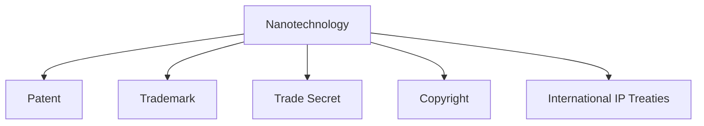

                 

# 知识产权与纳米技术的保护挑战

## 1. 背景介绍

随着纳米技术的快速发展，越来越多的创新产品和服务从实验室走向市场。然而，知识产权的保护问题成为了一个重要的议题。纳米技术因其微小尺度和独特性质，具有不同于传统技术的新特性，带来了复杂的知识产权保护挑战。

### 1.1 问题由来

纳米技术的特殊性导致其在知识产权保护方面面临独特挑战。首先，纳米材料往往具有多重属性，不易被简单地归类为传统意义上的产品、工艺或设计。其次，纳米技术的发展迅速，新的技术和应用不断涌现，传统法律难以及时跟上。此外，纳米材料的使用还可能涉及交叉领域的知识产权问题，例如材料科学、生物医学、环境保护等。

### 1.2 问题核心关键点

知识产权保护面临的挑战主要包括：
- **专利范围界定**：纳米材料的多重属性使得专利申请难以清晰界定。
- **商业秘密保护**：纳米技术涉及的复杂知识可能难以完全公开。
- **交叉领域法律适用**：纳米技术涉及多个领域，需综合多个法律体系。
- **国际协调**：不同国家对纳米技术知识产权保护的法律规定各异，国际协调困难。

## 2. 核心概念与联系

### 2.1 核心概念概述

为更好地理解纳米技术在知识产权保护中的挑战，本节将介绍几个密切相关的核心概念：

- **纳米技术(Nanotechnology)**：指在原子和分子水平上操控和操作物质的技术，通常涉及1至100纳米尺度的材料和设备。

- **知识产权(Intellectual Property, IP)**：指对创新成果的保护，包括专利、商标、版权、商业秘密等。

- **专利(Patent)**：授予发明者在一定期限内对其发明的专有权，通常用于保护技术创新。

- **商标(Trademark)**：保护企业标志、商誉等识别性标志，确保消费者能区分商品和服务来源。

- **商业秘密(Trade Secret)**：保护企业未公开的重要商业信息，避免被竞争对手获取。

- **版权(Copyright)**：保护作品的独创性表达，包括文学、音乐、艺术作品等。

- **国际知识产权条约(TRIPS)**：世界贸易组织下的一项协议，规范知识产权的国际保护。

这些核心概念之间的逻辑关系可以通过以下Mermaid流程图来展示：



这个流程图展示了大语言模型的核心概念及其之间的关系：

1. 纳米技术通过专利、商标、商业秘密、版权等形式进行知识产权保护。
2. 国际知识产权条约规范了纳米技术的国际保护。

## 3. 核心算法原理 & 具体操作步骤

### 3.1 算法原理概述

纳米技术的知识产权保护，涉及复杂的法律和政策问题。其核心在于：如何界定专利的范围，保护商业秘密，解决跨领域法律适用问题，以及进行国际协调。这些问题的解决，需要结合专利法、商标法、商业秘密保护法、版权法以及国际条约的框架。

### 3.2 算法步骤详解

纳米技术知识产权保护的主要步骤包括：

**Step 1: 收集和准备专利信息**
- 收集专利申请的原始文件，包括说明书、权利要求、附图等。
- 对专利申请进行初步分析，明确发明的技术要点和创新点。

**Step 2: 确定专利范围**
- 根据专利法，评估发明的新颖性、创造性和实用性。
- 确定专利的保护范围，确保不侵犯他人专利。

**Step 3: 申请商标**
- 选择适合的商标，进行注册和申请。
- 确保商标具有区分性和显著性，避免与已有商标冲突。

**Step 4: 保护商业秘密**
- 制定商业秘密保护策略，确定需要保密的信息类型。
- 建立保密协议和访问控制机制，防止信息泄露。

**Step 5: 申请版权**
- 对作品进行版权登记，获得版权保护。
- 确保作品的使用符合版权法的要求。

**Step 6: 国际协调**
- 研究并遵守相关国际知识产权条约，如TRIPS协议。
- 在多国申请专利和商标，确保全球保护。

**Step 7: 维护和更新**
- 定期检查专利、商标、商业秘密和版权的有效期。
- 必要时进行专利和商标的续展或更新。

### 3.3 算法优缺点

纳米技术知识产权保护的优点包括：
- **全面保护**：通过专利、商标、商业秘密、版权等形式，全方位保护创新成果。
- **国际化保护**：通过国际条约，确保在全球范围内的知识产权保护。

缺点包括：
- **复杂性高**：涉及多个法律体系，执行难度大。
- **成本高**：申请和维护知识产权的成本较高。
- **法律漏洞**：现有法律框架难以完全覆盖纳米技术的复杂特性。

### 3.4 算法应用领域

纳米技术知识产权保护的应用领域广泛，包括但不限于：

- **生物医学**：纳米药物、诊断工具等。
- **环境保护**：纳米传感器、纳米过滤材料等。
- **材料科学**：纳米材料、纳米器件等。
- **能源**：纳米电池、纳米催化剂等。
- **电子**：纳米电子器件、纳米电子材料等。

## 4. 数学模型和公式 & 详细讲解 & 举例说明

### 4.1 数学模型构建

纳米技术知识产权保护的数学模型较为抽象，主要涉及法律条文的数学表达和应用。以下是几个关键模型的概述：

- **专利保护范围模型**：
  - 模型定义：基于权利要求书，定义专利保护的具体范围。
  - 数学表达：$A=\bigcup_{i=1}^n \{x_i \mid x_i \in R^d\}$，其中 $A$ 表示专利保护范围，$x_i$ 表示权利要求书中的具体描述，$R^d$ 表示描述空间，$d$ 表示描述维度。

- **商标相似性模型**：
  - 模型定义：衡量两个商标在消费者眼中的相似性。
  - 数学表达：$S(C_1, C_2) = \frac{\sum_{i=1}^m D(C_1_i, C_2_i)}{m}$，其中 $S$ 表示相似性得分，$C_1, C_2$ 分别表示两个商标，$m$ 表示比较特征的数量，$D$ 表示特征之间的距离度量。

- **商业秘密保护模型**：
  - 模型定义：确定需要保密的信息类型和范围。
  - 数学表达：$S(E) = \sum_{i=1}^k E_i \times W_i$，其中 $S$ 表示保护成本，$E_i$ 表示信息的重要度，$W_i$ 表示信息泄露的风险权重。

### 4.2 公式推导过程

以专利保护范围模型为例，其推导过程如下：

- **权利要求解析**：将权利要求书拆分为具体描述 $x_i$，每个描述代表专利保护的一个方面。
- **范围定义**：定义专利保护范围 $A$ 为所有具体描述的并集。
- **数学表达**：使用集合表示法表达专利保护范围 $A$。

### 4.3 案例分析与讲解

以纳米药物的知识产权保护为例，分析专利、商标、商业秘密、版权的多重应用。

- **专利**：通过详细的权利要求，定义纳米药物的化学结构、制备方法、用途等。
- **商标**：为品牌药物设计独特的商标，确保市场区分性。
- **商业秘密**：保护药物的配方和生产工艺，避免被竞争对手获取。
- **版权**：对药物的说明书、临床研究报告等进行版权登记，确保学术和商业作品的原创性。

## 5. 项目实践：代码实例和详细解释说明

### 5.1 开发环境搭建

在进行纳米技术知识产权保护的软件开发前，我们需要准备好开发环境。以下是使用Python进行开发的环境配置流程：

1. 安装Anaconda：从官网下载并安装Anaconda，用于创建独立的Python环境。

2. 创建并激活虚拟环境：
```bash
conda create -n nanotech-env python=3.8 
conda activate nanotech-env
```

3. 安装必要的库：
```bash
conda install pandas numpy matplotlib scikit-learn
```

4. 下载数据集：
```bash
wget https://example.com/data/nanotech-dataset.zip
unzip nanotech-dataset.zip
```

完成上述步骤后，即可在`nanotech-env`环境中开始实践。

### 5.2 源代码详细实现

以下是一个简单的Python代码示例，用于分析纳米材料的专利保护范围：

```python
import pandas as pd
import numpy as np

# 加载专利数据集
df = pd.read_csv('patents.csv')

# 计算专利保护范围
def calculate_patent_range(row):
    descriptions = row['description'].split(',')
    return set(descriptions)

df['protection_range'] = df['description'].apply(calculate_patent_range)

# 打印保护范围示例
print(df.iloc[0]['protection_range'])
```

### 5.3 代码解读与分析

在上述代码中，我们首先使用Pandas加载专利数据集。然后定义了一个函数`calculate_patent_range`，用于解析每个专利的权利要求描述，将其拆分为多个描述项，并返回一个描述项集合，表示专利的保护范围。最后，我们计算了所有专利的保护范围，并打印出一个示例。

## 6. 实际应用场景

### 6.1 案例分析

以纳米材料为例，分析其知识产权保护的具体应用场景：

**案例1: 纳米颗粒的专利申请**
- **背景**：一家公司发明了一种新型纳米颗粒，可以用于改进电池性能。
- **解决方案**：
  - **专利申请**：申请专利，详细描述纳米颗粒的化学组成、制备方法、性能测试数据等。
  - **商标注册**：为产品设计独特的商标，确保市场区分性。
  - **商业秘密保护**：对配方和生产工艺进行保密，避免泄露。
  - **版权登记**：对说明书、测试报告等作品进行版权登记，确保原创性。

**案例2: 纳米传感器**
- **背景**：一家公司研发了一种基于纳米技术的传感器，用于检测环境污染物。
- **解决方案**：
  - **专利申请**：申请专利，涵盖传感器的设计、材料、工作原理等。
  - **商标注册**：为产品设计商标，确保市场识别性。
  - **商业秘密保护**：保护传感器的制造工艺和电路设计，避免被竞争对手获取。
  - **版权登记**：对产品说明书、技术手册等进行版权登记。

**案例3: 纳米药物**
- **背景**：一家公司开发了一种新型纳米药物，用于治疗特定疾病。
- **解决方案**：
  - **专利申请**：申请专利，详细描述药物的化学结构、制备方法、临床效果等。
  - **商标注册**：为产品设计商标，确保市场识别性。
  - **商业秘密保护**：保护药物的配方和生产工艺，避免泄露。
  - **版权登记**：对药物说明书、临床研究报告等进行版权登记，确保原创性。

### 6.2 未来应用展望

未来，纳米技术的知识产权保护将面临更多挑战，包括：

- **交叉领域合作**：纳米技术涉及多个学科，需要跨领域的合作和法律协调。
- **国际标准制定**：制定统一的纳米技术国际标准，确保全球一致的知识产权保护。
- **技术进步跟踪**：快速跟踪纳米技术的最新进展，及时更新知识产权保护策略。
- **道德和伦理考量**：在保护知识产权的同时，关注纳米技术可能带来的道德和伦理问题。

## 7. 工具和资源推荐

### 7.1 学习资源推荐

为了帮助开发者系统掌握纳米技术知识产权保护的理论基础和实践技巧，这里推荐一些优质的学习资源：

1. **专利法在线课程**：Coursera上提供的专利法课程，系统讲解专利法的基本原理和应用。

2. **商标法基础**：商标局官方网站提供的基础知识学习材料，帮助理解商标法和商标注册流程。

3. **商业秘密保护指南**：企业咨询机构发布的商业秘密保护指南，提供实际操作的建议。

4. **版权法教材**：《版权法》教材，详细讲解版权法的基本概念和应用。

5. **国际知识产权条约**：世界贸易组织官方网站上的TRIPS协议，了解国际知识产权保护的法律框架。

### 7.2 开发工具推荐

高效的开发离不开优秀的工具支持。以下是几款用于纳米技术知识产权保护开发的常用工具：

1. **法律文档管理系统**：如Lawson等工具，用于管理和检索法律文档，方便查找相关信息。

2. **数据分析工具**：如Jupyter Notebook、Python等工具，用于分析和处理专利、商标、商业秘密等数据。

3. **文档管理系统**：如SharePoint、Dropbox等工具，用于管理和共享法律文档，确保团队协作效率。

4. **自动化工具**：如Pandoc、LaTeX等工具，用于自动化文档生成和管理。

5. **法律模拟工具**：如Hypertext、MapGIS等工具，用于模拟法律判决和法律场景。

### 7.3 相关论文推荐

纳米技术知识产权保护的研究源于学界的持续研究。以下是几篇奠基性的相关论文，推荐阅读：

1. **专利法与纳米技术**：研究纳米技术在专利法中的适用性和挑战。

2. **纳米技术下的商标法**：探讨纳米技术对商标法的影响和应对策略。

3. **商业秘密保护与纳米技术**：分析纳米技术对商业秘密保护的影响和策略。

4. **版权法与纳米技术**：研究纳米技术在版权法中的适用性和挑战。

5. **纳米技术下的国际知识产权条约**：分析TRIPS协议对纳米技术知识产权保护的影响。

## 8. 总结：未来发展趋势与挑战

### 8.1 总结

本文对纳米技术在知识产权保护中的挑战进行了全面系统的介绍。首先阐述了纳米技术的发展现状和知识产权保护的需求，明确了知识产权保护在纳米技术发展中的重要作用。其次，从原理到实践，详细讲解了知识产权保护的法律框架和技术方法，给出了具体的代码实例和案例分析。最后，本文探讨了纳米技术知识产权保护的未来发展趋势和面临的挑战，提供了系统的学习资源和工具推荐。

通过本文的系统梳理，可以看到，纳米技术知识产权保护的技术与法律交织，涉及多学科的交叉和复杂的应用场景。尽管存在诸多挑战，但通过不断的研究和实践，纳米技术知识产权保护的前景仍然广阔，为纳米技术的创新和发展提供了坚实的法律保障。

### 8.2 未来发展趋势

展望未来，纳米技术知识产权保护将呈现以下几个发展趋势：

1. **法律体系的完善**：随着纳米技术的发展，现有的法律体系将不断完善，以应对新的法律需求。

2. **国际合作加强**：国际间将加强合作，制定统一的知识产权保护标准，确保全球一致的法律框架。

3. **技术评估工具的开发**：开发更加智能化的法律评估工具，提高法律分析和应用效率。

4. **数据驱动的法律研究**：利用大数据和人工智能技术，进行知识产权保护的法律研究和数据分析。

5. **伦理和道德考量**：在保护知识产权的同时，关注纳米技术可能带来的伦理和道德问题，确保技术的可持续发展。

6. **教育和培训**：加强对法律从业人员和企业的教育和培训，提升其知识产权保护意识和能力。

以上趋势凸显了纳米技术知识产权保护技术的广阔前景。这些方向的探索发展，将进一步提升知识产权保护的水平，为纳米技术的创新和发展提供坚实的法律保障。

### 8.3 面临的挑战

尽管纳米技术知识产权保护技术已经取得了一定的成果，但在迈向更加智能化、普适化应用的过程中，它仍面临着诸多挑战：

1. **法律适用性**：现有法律框架难以完全覆盖纳米技术的复杂特性，需要进一步完善。

2. **数据收集和分析**：纳米技术涉及大量数据，如何高效收集和分析数据是关键问题。

3. **技术评估难度**：纳米技术的多样性和复杂性增加了技术评估的难度，需要多学科协作。

4. **法律协调**：不同国家和地区对知识产权保护的法律规定各异，国际协调困难。

5. **成本问题**：知识产权保护涉及大量法律程序，成本较高，需要企业和社会共同承担。

6. **伦理和道德问题**：纳米技术的应用可能带来新的伦理和道德问题，需要慎重考虑。

这些挑战需要法律、技术、经济和社会等多方面的共同努力，才能有效解决。唯有如此，才能确保纳米技术知识产权保护的有效性和公正性。

### 8.4 研究展望

未来，纳米技术知识产权保护的研究需要从以下几个方面进行深入探索：

1. **法律框架的创新**：研究纳米技术特有的法律问题，提出新的法律框架和保护策略。

2. **多学科融合**：加强法律与科技、经济、伦理等多学科的融合，提供更全面的知识产权保护解决方案。

3. **自动化和智能化**：开发更加智能化的法律评估和保护工具，提高法律应用效率。

4. **数据驱动的保护**：利用大数据和人工智能技术，进行知识产权保护的数据驱动研究和应用。

5. **跨文化沟通**：加强不同国家和地区的知识产权保护法律沟通，推动国际合作。

这些研究方向的探索，将推动纳米技术知识产权保护技术的不断进步，为纳米技术的创新和发展提供坚实的法律保障。

## 9. 附录：常见问题与解答

**Q1: 纳米技术的多重属性如何界定？**

A: 纳米技术的多重属性通常需要综合考虑其物理、化学、生物等多个方面的特性。在专利申请中，通常需要详细描述这些特性，并在权利要求中明确其应用场景和保护范围。

**Q2: 如何保护纳米技术的多重属性？**

A: 在专利申请中，需要明确界定每个属性的具体描述，并在权利要求中详细说明其应用场景和保护范围。同时，可以通过多项专利申请，分别保护纳米技术的不同属性。

**Q3: 纳米技术保护成本如何计算？**

A: 纳米技术保护成本的计算通常需要综合考虑技术的复杂度、市场需求、法律费用等多个因素。可以建立保护成本模型，根据各项参数进行计算。

**Q4: 如何应对纳米技术的多重保护需求？**

A: 可以通过多项专利申请、商标注册、商业秘密保护和版权登记等多种方式，综合保护纳米技术的多重属性。在实际操作中，需要根据具体情况，灵活选择保护方式。

**Q5: 纳米技术知识产权保护的国际协调困难如何应对？**

A: 可以通过多边谈判、国际条约等方式，推动国际知识产权保护的协调和统一。同时，加强与国际组织和跨国企业的合作，共同解决跨国知识产权保护问题。

---

作者：禅与计算机程序设计艺术 / Zen and the Art of Computer Programming

