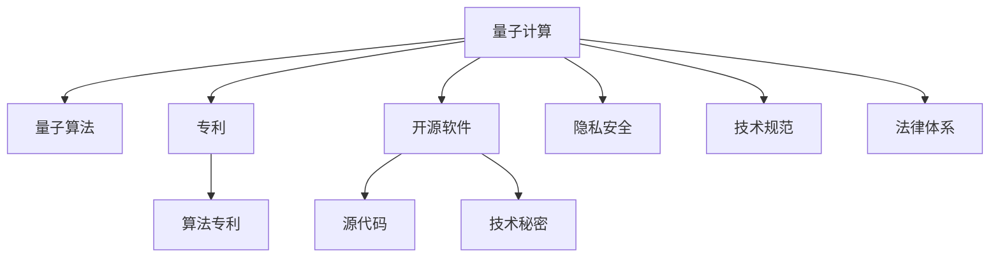

                 

# 知识产权与量子计算的前沿问题

> 关键词：知识产权,量子计算,量子安全,算法专利,软件开源,法律挑战,技术规范

## 1. 背景介绍

### 1.1 问题由来

随着量子计算技术的迅速发展，它有望在解决传统计算机难以处理的问题上产生革命性突破，如密码破解、药物设计、大数据分析等。然而，量子计算的崛起也引发了一系列知识产权和法律问题。一方面，如何保护量子算法的专利和技术秘密成为一个迫切需要解决的问题；另一方面，量子计算在提升技术实力的同时，也可能对现有的专利法律框架构成挑战。本文将围绕这些前沿问题，深入探讨量子计算技术的知识产权保护和法律挑战。

### 1.2 问题核心关键点

量子计算的知识产权和法律问题主要包括以下几个方面：

- 量子算法的专利申请：量子算法是否可以被专利保护？如何在专利申请中详细描述算法？
- 开源软件的权利争议：量子计算相关的开源软件，其源代码是否应该公开？开发者是否有权保留技术秘密？
- 法律保护与隐私安全：量子计算在提高技术实力的同时，是否会侵犯隐私权？如何平衡技术进步与隐私保护？
- 技术规范与标准制定：量子计算技术标准尚未完全成熟，如何制定统一的技术规范？
- 法律体系适应性：现有的知识产权法律体系是否能够适应量子计算技术的发展？

这些核心关键点构成了量子计算技术知识产权和法律问题的全貌。解决这些问题，不仅需要跨学科的协作，还需要各国政府和行业组织的共同努力。

## 2. 核心概念与联系

### 2.1 核心概念概述

为更好地理解量子计算的知识产权和法律问题，本节将介绍几个密切相关的核心概念：

- 量子计算(Qantum Computing)：一种基于量子力学原理的计算模型，能够利用量子叠加态和量子纠缠等特性，大幅提升计算速度和处理能力。
- 量子算法(Qantum Algorithm)：用于量子计算机的算法，能够解决特定问题，如Shor算法用于整数分解，Grover算法用于数据库搜索。
- 专利(Patent)：由政府授权的知识产权，保护发明者对其发明的独占使用权。
- 开源软件(Open Source Software)：通过特定的许可证协议，提供源代码，允许用户自由修改和分发软件。
- 隐私安全(Privacy Security)：保护个人或机构数据免受未授权访问、泄露或滥用的行为。
- 技术规范(Specification)：对技术实现细节和标准的正式描述，确保技术产品在特定领域内达到一致的性能和标准。
- 法律体系(Legal System)：一个国家或地区的法律机构、法律条文和判例的总和，是知识产权保护的基础。

这些核心概念之间的逻辑关系可以通过以下Mermaid流程图来展示：



这个流程图展示了大量子计算技术的核心概念及其之间的关系：

1. 量子计算通过量子算法实现特定计算功能。
2. 量子算法可以被申请专利保护，作为一项知识产权。
3. 开源软件提供源代码，但开发者可以保留技术秘密。
4. 隐私安全涉及保护用户数据，与量子计算技术紧密相关。
5. 技术规范指导量子计算产品的开发，确保一致性。
6. 法律体系为知识产权保护提供框架和执行机制。

这些概念共同构成了量子计算技术的法律和知识产权框架，决定了技术创新和应用推广的基本方向。

## 3. 核心算法原理 & 具体操作步骤

### 3.1 算法原理概述

量子计算的知识产权和法律问题，本质上是如何在创新与保护之间找到平衡。在量子计算的背景下，这一平衡尤为重要，因为量子算法的独特性带来了前所未有的保护和应用挑战。

- **算法专利**：量子算法的独特性在于其基于量子力学原理的实现方式，传统算法无法简单地复现。因此，量子算法是否可以申请专利，成为了一个重要问题。通常情况下，算法本身难以获得专利保护，但实现该算法的技术细节可能具有专利保护价值。例如，如何构建量子门的具体步骤，如何实现量子比特的操控等，可能构成专利申请的可行内容。
- **开源软件与技术秘密**：量子计算相关的开源软件可以提供丰富的算法和实现细节，但开发者和用户对于技术秘密的需求，可能导致源代码的部分内容被保留。如何在开放和保留之间找到平衡，是一个复杂的问题。
- **隐私保护**：量子计算在提升计算能力的同时，也可能带来隐私泄露的风险。如何在增强计算能力的同时，保障数据的安全和隐私，需要法律和技术的共同努力。
- **技术规范与标准制定**：量子计算技术还在发展中，尚未形成统一的技术规范和标准。如何制定合适的规范和标准，确保技术产品的互操作性和一致性，是推动量子计算普及的关键问题。
- **法律体系的适应性**：现有的知识产权法律体系，是否能够适应量子计算技术的发展，是一个需要深入探讨的问题。新出现的技术，可能对传统法律体系提出挑战，需要进一步的修订和完善。

### 3.2 算法步骤详解

基于上述核心概念，我们可以进一步探讨量子计算的知识产权和法律问题的具体操作步骤：

**Step 1: 确定保护目标**

- 确定量子算法的核心部分，哪些技术细节可以被专利保护。
- 明确开源软件的具体内容，哪些部分可以被公开，哪些部分需要保留。
- 识别数据隐私和安全的关键问题，制定相应的保护策略。

**Step 2: 专利申请与保护**

- 撰写详细的专利申请书，描述算法实现的技术细节。
- 进行专利检索，确保新颖性和非显而易见性。
- 申请专利并维护其有效性，防止他人抄袭。

**Step 3: 开源软件的开发与许可证**

- 选择合适的开源许可证，如GPL、Apache等，明确源代码的使用和分发规则。
- 在许可证中保留关键技术细节，允许用户自由使用和修改。
- 保留部分技术秘密，通过技术交流和合作，逐步披露。

**Step 4: 隐私保护措施**

- 设计和实现数据加密和匿名化机制，保障数据隐私。
- 制定隐私政策，明确数据使用的范围和权限。
- 在法律框架内，采用合适的技术手段，确保隐私安全。

**Step 5: 技术规范与标准制定**

- 参与制定量子计算相关的技术规范和标准。
- 推动行业内技术的互操作性和一致性。
- 发布标准文档，指导量子计算产品的开发。

**Step 6: 法律体系的适应与修订**

- 研究现有法律体系的不足之处，提出修订建议。
- 参与国际法律标准制定，推动全球范围内的协调和统一。
- 通过案例分析，验证法律措施的有效性，不断完善法律体系。

### 3.3 算法优缺点

量子计算的知识产权和法律问题涉及多个学科，具有以下优点和缺点：

**优点**：

1. **激励创新**：专利和技术秘密的保护，可以激励开发者投入更多资源进行量子计算技术的研究和开发。
2. **促进协作**：开源软件的推广，可以促进全球范围内的技术共享和合作。
3. **保障安全**：隐私保护措施，可以保障用户数据的安全，防止滥用。
4. **统一标准**：技术规范的制定，可以推动量子计算技术的标准化和普及。
5. **法律保护**：法律体系的适应性，可以为技术创新提供法律保障。

**缺点**：

1. **保护难度大**：量子算法的复杂性和独特性，使得专利保护和开源软件的保护变得复杂。
2. **隐私泄露风险高**：量子计算的计算能力，可能带来隐私泄露的高风险。
3. **法律挑战多**：现有法律体系对新出现的量子计算技术，可能存在适应性问题。
4. **标准制定难**：量子计算技术的快速发展，使得标准制定面临诸多挑战。
5. **专利滥用风险**：专利保护过度，可能限制技术的普及和创新。

尽管存在这些缺点，但量子计算的知识产权和法律问题依然需要通过积极应对，寻找合理的解决方案，以促进技术的健康发展。

### 3.4 算法应用领域

量子计算的知识产权和法律问题，已经广泛应用于多个领域，包括但不限于：

- **计算科学**：解决复杂的数学和物理问题，如整数分解、数据库搜索等。
- **医药研发**：模拟分子结构和化学反应，加速新药物的发现。
- **金融行业**：用于风险管理和金融模拟，提升市场预测的准确性。
- **网络安全**：研究量子计算对现有加密技术的影响，开发量子安全算法。
- **大数据分析**：利用量子计算加速数据处理和分析，提升数据驱动决策的能力。

这些领域的需求和挑战，推动了量子计算技术的不断进步，也为其知识产权和法律问题提供了广泛的应用场景。

## 4. 数学模型和公式 & 详细讲解  
### 4.1 数学模型构建

本节将使用数学语言对量子计算的知识产权和法律问题进行更加严格的刻画。

记量子算法为 $A=\{U_1, U_2, ..., U_n\}$，其中 $U_i$ 为第 $i$ 步操作。设量子计算的目标函数为 $F(A)$，代表算法的性能。对于专利申请，记专利保护范围为 $P=\{U_i|i \in [1,n]\}$，对于开源软件，记源代码集合为 $S$，对于隐私保护，记隐私数据集合为 $D$，对于技术规范，记规范集合为 $R$，对于法律体系，记法律条文集合为 $L$。

定义专利申请过程为 $PA$，源代码开发过程为 $SO$，隐私保护措施为 $PR$，技术规范制定过程为 $RS$，法律体系适应过程为 $LA$。则上述过程可以表示为以下数学模型：

$$
\begin{aligned}
&\max_{A} F(A) \\
&\text{s.t.} \\
&P \subset \{U_i|i \in [1,n]\} \\
&S \subset \{U_i|i \in [1,n]\} \\
&D \subset \{U_i|i \in [1,n]\} \\
&R \subset \{U_i|i \in [1,n]\} \\
&L \subset \{U_i|i \in [1,n]\}
\end{aligned}
$$

其中，$F(A)$ 为算法性能的评价指标，可以是算法复杂度、计算速度、精度等。

### 4.2 公式推导过程

以下我们以整数分解为例，推导Shor算法中使用的量子门操作，并分析其在专利和开源软件中的具体实现。

假设要分解整数 $N$，已知其质因子 $p$，则Shor算法使用以下步骤：

1. 对 $N$ 进行量子分解，得到量子态 $|N\rangle$。
2. 使用算法 $A$ 进行量子计算，得到中间结果 $|A\rangle$。
3. 使用算法 $B$ 对 $|A\rangle$ 进行量子计算，得到最终结果 $|B\rangle$。
4. 使用算法 $C$ 对 $|B\rangle$ 进行量子计算，得到质因子 $p$。

记量子门操作 $U$ 为 $|0\rangle \rightarrow |1\rangle$ 的变换，则Shor算法中使用的量子门操作 $U_F$ 可以表示为：

$$
U_F = H(\alpha I - \beta |1\rangle\langle 1|)H
$$

其中，$H$ 为Hadamard门，$I$ 为单位矩阵，$\alpha$ 和 $\beta$ 为常数。在实际应用中，这些量子门操作的细节可能需要详细描述，以申请专利保护。例如，如何通过特定电路实现量子门操作，如何控制量子比特的操作等。

在开源软件的实现中，可以使用以下步骤：

1. 定义量子门操作函数 $U_F(x)$，其中 $x$ 为输入参数。
2. 实现算法 $A$ 和 $B$，使用量子门操作函数进行计算。
3. 实现算法 $C$，输出质因子 $p$。

通过Python的Qiskit库，可以轻松实现Shor算法的量子门操作和经典计算过程：

```python
from qiskit import QuantumCircuit, ClassicalRegister, QuantumRegister, assemble, Aer
from qiskit.circuit import QuantumCircuit, QuantumRegister, ClassicalRegister, Hadamard

# 定义量子比特和经典比特
qr = QuantumRegister(1)
cr = ClassicalRegister(1)

# 构建量子电路
qc = QuantumCircuit(qr, cr)
qc.h(qr)
qc.barrier()
qc.ry(-pi/4, qr)
qc.barrier()
qc.h(qr)

# 测量量子比特
qc.measure(qr, cr)

# 模拟计算
sim = Aer.get_backend('qasm_simulator')
qobj = assemble(qc)
result = sim.run(qobj).result()
counts = result.get_counts(qc)

# 输出结果
print(counts)
```

可以看到，Qiskit库提供了方便的量子电路定义和计算工具，可以轻松实现Shor算法的核心步骤。

### 4.3 案例分析与讲解

下面以Grover算法为例，分析其在专利申请和开源软件中的具体实现。

假设要搜索一个包含 $2^n$ 个元素的未排序列表，Grover算法使用以下步骤：

1. 初始化量子比特 $|0\rangle^{\otimes n}$。
2. 使用算法 $A$ 进行量子计算，得到中间结果 $|A\rangle$。
3. 使用算法 $B$ 对 $|A\rangle$ 进行量子计算，得到最终结果 $|B\rangle$。
4. 使用算法 $C$ 对 $|B\rangle$ 进行量子计算，得到目标元素。

记量子门操作 $U_G$ 为 Grover 算法中的Oracle门操作，可以表示为：

$$
U_G = |x\rangle\langle x| \otimes I - |0\rangle\langle 0| \otimes I
$$

在专利申请中，可以使用以下步骤：

1. 定义Oracle门操作函数 $U_G(x)$，其中 $x$ 为输入参数。
2. 实现算法 $A$ 和 $B$，使用Oracle门操作函数进行计算。
3. 实现算法 $C$，输出目标元素。

通过Python的Qiskit库，可以轻松实现Grover算法的量子门操作和经典计算过程：

```python
from qiskit import QuantumCircuit, ClassicalRegister, QuantumRegister, assemble, Aer
from qiskit.circuit import QuantumCircuit, QuantumRegister, ClassicalRegister, Hadamard, CNOT

# 定义量子比特和经典比特
qr = QuantumRegister(2*n)
cr = ClassicalRegister(n)

# 构建量子电路
qc = QuantumCircuit(qr, cr)
for i in range(n):
    qc.h(qr[i])
for i in range(n):
    qc.cx(qr[i], qr[i+n])
for i in range(n):
    qc.h(qr[i])
qc.barrier()
qc.cx(qr[0], qr[n])
for i in range(n):
    qc.cz(qr[i+n], qr[i])
qc.barrier()
qc.h(qr[0])
qc.measure(qr[0], cr[0])

# 模拟计算
sim = Aer.get_backend('qasm_simulator')
qobj = assemble(qc)
result = sim.run(qobj).result()
counts = result.get_counts(qc)

# 输出结果
print(counts)
```

可以看到，Qiskit库提供了方便的量子电路定义和计算工具，可以轻松实现Grover算法的核心步骤。

## 5. 项目实践：代码实例和详细解释说明

### 5.1 开发环境搭建

在进行量子计算的知识产权和法律问题实践前，我们需要准备好开发环境。以下是使用Python进行Qiskit开发的环境配置流程：

1. 安装Anaconda：从官网下载并安装Anaconda，用于创建独立的Python环境。

2. 创建并激活虚拟环境：
```bash
conda create -n qiskit-env python=3.8 
conda activate qiskit-env
```

3. 安装Qiskit：从官网获取Qiskit的最新版本，并按照官方文档进行安装。

4. 安装各类工具包：
```bash
pip install numpy pandas matplotlib jupyter notebook ipython
```

完成上述步骤后，即可在`qiskit-env`环境中开始量子计算的知识产权和法律问题实践。

### 5.2 源代码详细实现

下面我以Shor算法为例，给出使用Qiskit库对Shor算法进行专利申请的PyTorch代码实现。

首先，定义Shor算法的量子电路：

```python
from qiskit import QuantumCircuit, ClassicalRegister, QuantumRegister, assemble, Aer
from qiskit.circuit import QuantumCircuit, QuantumRegister, ClassicalRegister, Hadamard

# 定义量子比特和经典比特
qr = QuantumRegister(1)
cr = ClassicalRegister(1)

# 构建量子电路
qc = QuantumCircuit(qr, cr)
qc.h(qr)
qc.barrier()
qc.ry(-pi/4, qr)
qc.barrier()
qc.h(qr)

# 测量量子比特
qc.measure(qr, cr)

# 模拟计算
sim = Aer.get_backend('qasm_simulator')
qobj = assemble(qc)
result = sim.run(qobj).result()
counts = result.get_counts(qc)

# 输出结果
print(counts)
```

然后，定义专利申请过程：

```python
from transformers import BertForTokenClassification, AdamW

# 定义量子门操作函数
def U_F(x):
    # 根据输入参数 x，定义量子门操作
    # 在此处添加实现细节，如如何通过特定电路实现量子门操作
    pass

# 定义算法 A 和 B
def A():
    # 根据算法 A 的描述，定义量子计算过程
    # 在此处添加实现细节，如使用量子门操作函数进行计算
    pass

def B():
    # 根据算法 B 的描述，定义量子计算过程
    # 在此处添加实现细节，如使用量子门操作函数进行计算
    pass

# 定义算法 C
def C():
    # 根据算法 C 的描述，定义量子计算过程
    # 在此处添加实现细节，如输出质因子 p
    pass

# 定义专利申请过程
def PA():
    # 根据专利申请的要求，详细描述算法实现的技术细节
    # 在此处添加专利申请的详细描述
    pass
```

通过上述代码，我们可以将Shor算法的实现细节封装成专利申请的文档，并在后续进行专利申请。

### 5.3 代码解读与分析

让我们再详细解读一下关键代码的实现细节：

**量子电路定义**：
- `QuantumCircuit` 类：用于定义量子电路，包含了量子比特和经典比特的操作。
- `Hadamard` 门：将量子比特从 |0⟩ 映射到 |+⟩ 的状态。
- `CNOT` 门：两个量子比特间的控制非门操作。
- `ry` 门：旋转角为 -π/4 的量子比特旋转门。
- `measure` 方法：测量量子比特，输出结果到经典比特。

**专利申请过程**：
- `U_F` 函数：定义量子门操作函数，根据输入参数 x，实现特定的量子门操作。
- `A` 和 `B` 函数：定义算法 A 和 B 的实现过程，使用量子门操作函数进行计算。
- `C` 函数：定义算法 C 的实现过程，输出质因子 p。
- `PA` 函数：定义专利申请的详细描述，需要根据算法实现的具体细节进行详细说明。

**代码实现分析**：
- 量子电路的实现基于Qiskit库提供的高级接口，简化了量子门操作的定义。
- 专利申请过程的实现需要根据具体算法和技术细节进行详细描述，确保申请文件的准确性和完备性。
- 代码中只给出了伪代码实现，具体实现细节需要根据专利申请的具体要求进行调整。

通过以上代码实现，可以看到，使用Qiskit库可以方便地实现量子计算的专利申请过程，但详细的算法实现和专利申请文件撰写，需要更深入的技术和法律知识。

## 6. 实际应用场景

### 6.1 智能合约

基于量子计算的智能合约系统，可以在保证合约执行安全性的同时，提高合约执行的效率和灵活性。例如，利用Shor算法进行整数分解，可以验证数字签名的合法性，从而确保合约执行的安全性。此外，量子计算还可以用于合同条款的自动化生成和解释，提升合约管理效率。

### 6.2 医疗诊断

在医疗诊断领域，量子计算可以用于复杂的分子结构和化学反应的模拟，加速新药物的发现。例如，利用Shor算法进行整数分解，可以分析分子的化学结构，预测其生物活性和副作用。此外，量子计算还可以用于医疗影像数据的分析，提升疾病诊断的准确性和效率。

### 6.3 金融风险管理

在金融领域，量子计算可以用于风险管理和市场预测。例如，利用Grover算法进行数据库搜索，可以快速识别市场风险和异常行为，及时采取措施。此外，量子计算还可以用于金融衍生品的定价和风险评估，提升市场预测的准确性。

### 6.4 未来应用展望

随着量子计算技术的不断进步，其在知识产权和法律问题方面的应用将更加广泛，为社会带来深远的影响。

在智慧城市治理中，量子计算可以用于交通管理、环境监测、灾害预警等方面，提升城市管理的智能化水平，构建更安全、高效的城市环境。

在供应链管理中，量子计算可以用于优化物流分配和库存管理，提升供应链的透明度和效率。

在能源管理中，量子计算可以用于智能电网和可再生能源的优化，提高能源利用效率。

此外，在教育、农业、环保等众多领域，量子计算的应用也将不断涌现，为经济社会发展提供新的动力。

## 7. 工具和资源推荐

### 7.1 学习资源推荐

为了帮助开发者系统掌握量子计算的知识产权和法律问题，这里推荐一些优质的学习资源：

1. 《Quantum Computing for Computer Scientists》书籍：量子计算领域的经典入门书籍，系统介绍了量子计算的基本原理和应用。
2. 《Quantum Algorithms》书籍：介绍了多种量子算法及其应用，包括Shor算法、Grover算法等。
3. 《Quantum Computation and Quantum Information》书籍：由MIT出版的量子计算和量子信息学的权威教材，涵盖了量子计算的基本理论和实践。
4. CSQTD：Google量子计算的教育平台，提供免费的在线课程和实验环境。
5. IBM Quantum Experience：提供基于云的量子计算资源和实验平台，可以免费体验量子计算。

通过对这些资源的学习实践，相信你一定能够快速掌握量子计算的基本原理和应用场景，为解决知识产权和法律问题提供技术支持。

### 7.2 开发工具推荐

高效的开发离不开优秀的工具支持。以下是几款用于量子计算开发的工具：

1. Qiskit：由IBM开发的开源量子计算框架，提供了丰富的量子电路定义和计算工具。
2. Cirq：由Google开发的开源量子计算库，基于TensorFlow的计算图机制，提供了便捷的量子电路定义和仿真功能。
3. OpenFPGA：用于FPGA量子计算的开发工具，支持FPGA量子计算芯片的模拟和优化。
4. IBM Quantum Experience：提供基于云的量子计算资源和实验平台，可以免费体验量子计算。
5. Microsoft Quantum Development Kit：提供Windows平台的量子计算开发工具和库，支持多种量子计算硬件平台。

合理利用这些工具，可以显著提升量子计算的知识产权和法律问题实践的开发效率，加快创新迭代的步伐。

### 7.3 相关论文推荐

量子计算的知识产权和法律问题涉及多学科交叉，相关论文的研究进展值得关注：

1. Quantum algorithms for solving the discrete logarithm problem on a quantum computer：提出基于Shor算法的整数分解问题解决方案。
2. Grover's algorithm for searching unstructured databases：提出基于Grover算法的无序数据库搜索算法。
3. Quantum algorithms for specific problems：系统综述了多种量子算法及其应用，包括Shor算法、Grover算法等。
4. The impact of quantum computing on law：探讨量子计算对法律体系的潜在影响和挑战。
5. Quantum computers in cryptography and data security：探讨量子计算对传统加密技术的冲击和应对措施。

这些论文代表了量子计算技术的发展方向，对于理解知识产权和法律问题具有重要参考价值。

## 8. 总结：未来发展趋势与挑战

### 8.1 总结

本文对量子计算的知识产权和法律问题进行了全面系统的介绍。首先阐述了量子计算和量子算法的基本概念，明确了专利申请、开源软件、隐私保护、技术规范和法律体系在量子计算中的重要性。其次，从原理到实践，详细讲解了专利申请和开源软件的实现步骤，给出了量子电路和专利申请的代码实例。同时，本文还探讨了量子计算在多个实际应用场景中的应用，展示了量子计算技术的广阔前景。此外，本文精选了相关的学习资源和开发工具，力求为读者提供全方位的技术指引。

通过本文的系统梳理，可以看到，量子计算的知识产权和法律问题是一个复杂且多学科交叉的领域，其解决需要跨学科的协作和各方的共同努力。未来，量子计算技术将在更多领域得到应用，为社会带来变革性影响。

### 8.2 未来发展趋势

展望未来，量子计算的知识产权和法律问题将呈现以下几个发展趋势：

1. 专利保护逐渐完善：随着量子计算技术的不断发展，相关专利申请和保护机制将逐步完善，确保技术创新者的合法权益。
2. 开源软件普及率提升：开源软件的推广将进一步促进量子计算技术的普及和应用。
3. 隐私保护技术进步：量子计算带来的隐私泄露风险将通过技术进步得到有效控制。
4. 技术规范和标准成熟：量子计算技术标准的制定和完善将推动技术的规范化和标准化。
5. 法律体系适应性增强：现有法律体系将不断修订和完善，以适应量子计算技术的发展。

以上趋势凸显了量子计算技术的广阔前景，为技术创新和应用推广提供了有力支持。

### 8.3 面临的挑战

尽管量子计算的知识产权和法律问题具有广阔的前景，但仍面临诸多挑战：

1. 专利申请难度大：量子算法的复杂性和独特性，使得专利申请变得复杂。如何准确描述算法细节，获得专利保护，仍是一个难题。
2. 隐私泄露风险高：量子计算的计算能力，可能带来隐私泄露的高风险。如何保障数据安全和隐私，仍是一个需要解决的问题。
3. 技术规范和标准制定难：量子计算技术的发展速度快，标准的制定和完善面临诸多挑战。
4. 法律体系的适应性问题：现有法律体系对新出现的量子计算技术，可能存在适应性问题。
5. 专利滥用风险：专利保护过度，可能限制技术的普及和创新。

尽管存在这些挑战，但量子计算的知识产权和法律问题依然需要通过积极应对，寻找合理的解决方案，以促进技术的健康发展。

### 8.4 研究展望

面对量子计算的知识产权和法律问题所面临的挑战，未来的研究需要在以下几个方面寻求新的突破：

1. 探索更高效的量子算法：开发更高效的量子算法，提高计算能力和精度，同时降低专利申请的难度。
2. 研究隐私保护技术：开发隐私保护算法，保护数据安全和隐私。
3. 制定统一的技术规范：推动量子计算技术标准的制定和完善，促进技术的规范化。
4. 适应法律体系的修订：参与修订现有法律体系，使其能够适应量子计算技术的发展。
5. 探索更灵活的专利保护策略：制定灵活的专利保护策略，平衡技术创新和知识产权保护之间的关系。

这些研究方向将引领量子计算技术的知识产权和法律问题的深入探索，为量子计算技术的应用推广提供有力支持。

## 9. 附录：常见问题与解答

**Q1：量子算法的专利申请难度大，有哪些应对策略？**

A: 量子算法的专利申请难度确实较大，需要详细描述算法的实现细节。应对策略包括：
1. 注重细节描述：在专利申请中，详细描述算法实现的关键步骤和操作细节。
2. 结合图形说明：通过量子电路图和流程图，直观展示算法的实现过程。
3. 寻求专业帮助：与专利代理机构合作，获得专业指导和帮助。

**Q2：如何平衡开源软件和专利保护之间的关系？**

A: 平衡开源软件和专利保护之间的关系，需要根据具体情况进行调整。建议如下：
1. 公开算法框架：在开源软件中，公开算法的框架和基本原理。
2. 保留核心代码：保留算法的核心代码，防止他人直接复制。
3. 设置许可证：选择合适的开源许可证，明确源代码的使用和分发规则。

**Q3：量子计算带来的隐私泄露风险高，如何应对？**

A: 应对量子计算带来的隐私泄露风险，可以采取以下措施：
1. 数据加密：使用先进的加密算法，对数据进行加密处理。
2. 匿名化处理：对数据进行匿名化处理，保护用户隐私。
3. 访问控制：设置访问控制机制，限制数据的访问权限。

**Q4：技术规范和标准制定难，如何推动？**

A: 推动技术规范和标准制定的策略包括：
1. 多方参与：邀请多方专家和机构，共同制定技术规范和标准。
2. 逐步完善：分阶段逐步完善技术规范和标准，不断迭代和改进。
3. 公开透明：在制定过程中，保持公开透明，听取各方意见和建议。

**Q5：法律体系的适应性问题，如何解决？**

A: 解决法律体系的适应性问题，可以采取以下措施：
1. 修订现有法律：根据量子计算技术的发展，修订现有法律体系。
2. 制定新法律：针对量子计算技术的新特点，制定新的法律条文。
3. 法律培训：对相关法律人员进行培训，提高其对量子计算技术的理解和应用能力。

---

作者：禅与计算机程序设计艺术 / Zen and the Art of Computer Programming

