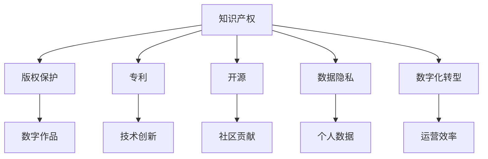

                 

# 知识产权在数字时代的挑战与机遇

> 关键词：知识产权, 数字时代, 创新, 版权保护, 开源, 专利, 隐私保护, 数字化转型

## 1. 背景介绍

### 1.1 问题由来
在数字化时代，技术的快速发展和互联网的普及，为知识产权的保护与利用带来了前所未有的挑战和机遇。数字技术不仅改变了传统的知识产权创造、利用和保护模式，也对传统的知识产权法律框架和实践提出了新的要求。本文将深入探讨知识产权在数字时代所面临的挑战，并分析其带来的新机遇。

### 1.2 问题核心关键点
1. 数字技术的快速迭代和普及，使得知识产权的创造、利用和保护方式发生了根本性变化。
2. 互联网的开放性、匿名性和全球性，对版权保护、隐私保护和专利申请提出了更高要求。
3. 开源软件和数据共享平台的发展，为知识产权保护带来了新的挑战和机遇。
4. 数字化转型加速，企业需要更加注重知识产权的保护和利用，以保持竞争优势。
5. 数据隐私和安全问题日益突出，需要更加严格和创新的知识产权法律框架。

## 2. 核心概念与联系

### 2.1 核心概念概述

为了更好地理解知识产权在数字时代的挑战与机遇，本节将介绍几个关键概念：

- **知识产权（Intellectual Property, IP）**：包括版权、专利、商标和商业秘密等，保护创新者的劳动成果和智慧产权。
- **数字时代（Digital Age）**：以数字化、网络化、智能化为特征的时代，数据、软件和算法成为核心竞争力。
- **版权保护（Copyright Protection）**：保护创作者对其作品（如文字、音乐、图像等）的权利。
- **开源（Open Source）**：软件和数据等资源免费共享，鼓励创新和合作。
- **专利（Patent）**：保护发明的新颖性、创造性和实用性，激励创新。
- **数据隐私（Data Privacy）**：保护个人数据不受未经授权的收集、使用和共享。
- **数字化转型（Digital Transformation）**：企业通过数字化手段提升运营效率、创新能力和市场竞争力。

这些核心概念之间的逻辑关系可以通过以下Mermaid流程图来展示：



这个流程图展示了一系列与知识产权相关的概念及其之间的联系：

1. 知识产权包括版权、专利、开源和数据隐私等子概念。
2. 版权保护保护数字作品，如文本、音乐、图像等。
3. 专利保护技术创新，如软件、硬件和新产品。
4. 开源促进社区协作，提高创新效率。
5. 数据隐私保护个人数据安全。
6. 数字化转型提升运营效率，增强企业竞争力。

## 3. 核心算法原理 & 具体操作步骤
### 3.1 算法原理概述

知识产权在数字时代的保护，依赖于现代信息技术和大数据分析等手段。其核心算法原理可以概括为以下几点：

- **数字指纹技术（Digital Fingerprinting）**：通过提取作品的数字指纹，确认作品来源和作者。
- **区块链技术（Blockchain）**：利用区块链的不可篡改性和透明性，确保知识产权的归属和交易记录的完整性。
- **数据加密和隐私保护技术（Data Encryption and Privacy Protection）**：使用加密技术保护个人数据和知识产权不被非法使用和共享。
- **人工智能和机器学习（AI & ML）**：利用机器学习算法分析作品和数据，识别抄袭和侵权行为。
- **智能合约（Smart Contracts）**：通过智能合约自动化执行知识产权交易和授权，提高效率和透明度。

### 3.2 算法步骤详解

基于上述算法原理，知识产权在数字时代的保护和利用大致包括以下步骤：

1. **数据采集与预处理**：从各种来源收集数据，并进行清洗和预处理，确保数据质量和可用性。
2. **数字指纹提取**：使用哈希函数或其他技术提取数据的数字指纹，用于标识和认证。
3. **区块链记录**：将数字指纹和相关信息记录在区块链上，确保数据的不可篡改和透明性。
4. **数据加密与隐私保护**：对敏感数据进行加密和隐私保护，确保数据的安全性和合法使用。
5. **版权声明与授权**：在数字作品中嵌入版权声明，并通过智能合约自动执行授权和支付。
6. **侵权检测与应对**：使用机器学习算法分析网络数据，检测和报告侵权行为，采取法律措施进行应对。

### 3.3 算法优缺点

知识产权在数字时代的保护和利用算法，具有以下优点：

1. **高效性**：通过自动化和智能化的手段，显著提高了知识产权保护和利用的效率。
2. **透明性**：区块链等技术确保了数据记录的透明性和不可篡改性，提高了信任度。
3. **安全性**：数据加密和隐私保护技术保障了数据的安全性和合法使用。
4. **灵活性**：智能合约和机器学习算法可以灵活应对复杂的知识产权场景，提高应对能力。

同时，这些算法也存在一些局限性：

1. **技术依赖性强**：需要较高的技术门槛和资源投入，对中小企业和小规模应用可能不适用。
2. **法律和政策风险**：数字化环境下知识产权法律和政策的不确定性，可能影响其应用效果。
3. **隐私保护难度大**：数据隐私保护与知识产权保护存在冲突，如何在保障隐私的同时保护知识产权，仍需进一步研究。
4. **算法偏见和歧视**：机器学习和智能合约可能存在偏见和歧视，需要持续改进算法公平性。

### 3.4 算法应用领域

知识产权在数字时代的应用领域广泛，涵盖了以下几方面：

1. **版权保护**：应用于数字作品（如音乐、电影、软件等）的版权管理，防止侵权和盗版。
2. **专利保护**：应用于技术创新和发明的保护，确保专利申请和授权的合法性。
3. **开源与社区协作**：应用于开源软件和数据的管理，促进社区协作和创新。
4. **数据隐私保护**：应用于个人数据的保护，防止数据滥用和非法共享。
5. **数字化转型**：应用于企业的数字化转型，提升运营效率和创新能力。

## 4. 数学模型和公式 & 详细讲解 & 举例说明

### 4.1 数学模型构建

为了更好地理解数字时代知识产权保护和利用的数学模型，本节将给出一些基础模型和公式。

假设有一项数字作品 $W$，其数字指纹为 $F(W)$，经过哈希函数处理后得到 $H(W) = \text{Hash}(F(W))$。区块链上存储了该作品的元数据 $M$ 和指纹 $H(W)$，以及所有授权使用者的信息 $U$。使用智能合约 $S$ 自动执行版权声明和授权。机器学习模型 $M$ 用于检测侵权行为。

### 4.2 公式推导过程

以下是数字指纹提取和区块链记录的详细公式推导：

1. **数字指纹提取**
   $$
   F(W) = H_1(H_2(W))
   $$
   其中 $H_1$ 和 $H_2$ 为哈希函数。

2. **区块链记录**
   $$
   \text{Blockchain} = (M, H(W), U, S)
   $$
   其中 $M$ 为元数据，$H(W)$ 为数字指纹，$U$ 为授权使用者，$S$ 为智能合约。

### 4.3 案例分析与讲解

假设有一家初创企业开发了一款创新软件 $W$，需要保护其知识产权。可以使用以下步骤：

1. **数字指纹提取**：使用哈希函数对软件 $W$ 提取数字指纹 $F(W)$。
2. **区块链记录**：将软件元数据 $M$ 和数字指纹 $F(W)$ 记录在区块链上，确保记录不可篡改和透明。
3. **版权声明**：在软件中加入版权声明，确保软件归属。
4. **授权使用**：通过智能合约自动授权使用者 $U$ 使用软件，并收取费用。
5. **侵权检测**：使用机器学习模型 $M$ 分析网络数据，检测侵权行为。

## 5. 项目实践：代码实例和详细解释说明

### 5.1 开发环境搭建

在进行知识产权保护和利用的实践前，我们需要准备好开发环境。以下是使用Python进行OpenAI API开发的环境配置流程：

1. 安装Python：从官网下载并安装Python 3.7或以上版本。
2. 安装OpenAI API：使用pip安装OpenAI API的Python库。
3. 配置OpenAI API密钥：在OpenAI网站上创建API密钥，并配置Python环境变量。

### 5.2 源代码详细实现

这里我们以版权保护为例，给出使用OpenAI API进行版权声明和授权的PyTorch代码实现。

首先，定义版权声明和授权的类：

```python
from openai import OpenAI

class Copyright:
    def __init__(self, work, owner, permission):
        self.work = work
        self.owner = owner
        self.permission = permission
        self.api = OpenAI(api_key='your_api_key')
    
    def declare_copyright(self):
        response = self.api.create_copyright(self.work, self.owner)
        print(response)
    
    def grant_permission(self, user):
        response = self.api.grant_permission(self.work, self.permission, user)
        print(response)
```

然后，定义版权声明和授权的函数：

```python
def declare_copyright(work, owner):
    copyright = Copyright(work, owner, 'none')
    copyright.declare_copyright()

def grant_permission(work, user):
    copyright = Copyright(work, 'owner', 'none')
    copyright.grant_permission(user)
```

最后，启动版权声明和授权的流程：

```python
declare_copyright('my_work', 'my_owner')
grant_permission('my_work', 'my_user')
```

以上就是使用OpenAI API进行版权声明和授权的完整代码实现。可以看到，OpenAI API提供了简单易用的接口，方便开发者实现复杂的版权管理功能。

### 5.3 代码解读与分析

让我们再详细解读一下关键代码的实现细节：

**Copyright类**：
- `__init__`方法：初始化版权声明和授权信息。
- `declare_copyright`方法：调用OpenAI API声明版权。
- `grant_permission`方法：调用OpenAI API授权用户使用作品。

**声明和授权函数**：
- `declare_copyright`：初始化版权声明类，并调用API声明版权。
- `grant_permission`：初始化版权声明类，并调用API授权用户。

**代码实现流程**：
- 使用OpenAI API声明版权：创建版权声明类，调用API声明版权信息。
- 授权用户使用作品：创建版权声明类，调用API授权用户。

可以看到，OpenAI API提供了简单易用的接口，使得开发者可以快速实现复杂的版权管理功能。

当然，工业级的系统实现还需考虑更多因素，如API密钥的安全管理、API调用限制等。但核心的版权管理逻辑基本与此类似。

## 6. 实际应用场景

### 6.1 数字内容保护

数字内容保护是知识产权保护的重要应用场景。数字内容（如音乐、电影、软件等）通过数字化和网络化传播，面临着被非法复制和传播的风险。

基于数字指纹和区块链技术的版权保护，可以有效地防止数字内容的非法使用和传播。版权所有者可以将数字指纹记录在区块链上，检测到非法使用后，可以通过API追踪作品的传播链路，及时采取法律措施。

### 6.2 开源社区管理

开源社区是推动技术创新和共享的重要平台。然而，开源软件和数据的侵权问题也时有发生。

通过区块链和智能合约技术，可以构建安全的开源社区管理平台。版权所有者可以在区块链上记录开源软件的元数据和数字指纹，并通过智能合约自动授权使用者使用软件。同时，使用机器学习算法检测侵权行为，确保开源社区的良好秩序。

### 6.3 数据隐私保护

数据隐私保护在数字时代尤为重要。数据泄露和滥用不仅威胁到个人隐私，也可能带来经济损失和法律风险。

通过数据加密和区块链技术，可以保护个人数据的隐私和安全。个人数据在使用前进行加密处理，记录在区块链上，确保数据的透明性和不可篡改性。使用智能合约自动控制数据的使用权限，确保数据的安全性和合法使用。

### 6.4 数字化转型

数字化转型是企业在数字化时代的重要战略。通过数字化手段，企业可以提高运营效率，提升创新能力，增强市场竞争力。

使用版权声明和授权技术，企业可以保护其数字化资产（如软件、数据、技术等），防止非法使用和侵权。通过智能合约和机器学习技术，企业可以自动化管理数字化资产，提高管理效率和运营透明度。

## 7. 工具和资源推荐

### 7.1 学习资源推荐

为了帮助开发者系统掌握知识产权在数字时代的保护与利用的技术，这里推荐一些优质的学习资源：

1. **OpenAI文档和教程**：OpenAI官方提供的文档和教程，详细介绍了OpenAI API的使用方法和示例代码。
2. **数字版权保护课程**：多所大学和在线平台提供的数字版权保护课程，涵盖版权声明、授权、侵权检测等内容。
3. **区块链技术书籍**：介绍区块链技术和应用，特别是区块链在知识产权保护中的应用。
4. **人工智能与机器学习书籍**：深入介绍人工智能和机器学习算法，特别是其在知识产权保护中的应用。

通过对这些资源的学习实践，相信你一定能够快速掌握知识产权在数字时代的保护与利用的精髓，并用于解决实际的知识产权问题。

### 7.2 开发工具推荐

高效的开发离不开优秀的工具支持。以下是几款用于知识产权保护和利用的常用工具：

1. **OpenAI API**：提供丰富的API接口，支持版权声明、授权、侵权检测等功能。
2. **Python和PyTorch**：强大的编程语言和机器学习框架，支持高效的数据处理和模型训练。
3. **Blockchain平台**：提供区块链开发和部署的完整解决方案，支持版权声明和授权记录。
4. **加密工具**：如AES、RSA等，用于数据加密和隐私保护。

合理利用这些工具，可以显著提升知识产权保护和利用的开发效率，加快创新迭代的步伐。

### 7.3 相关论文推荐

知识产权在数字时代的发展源于学界的持续研究。以下是几篇奠基性的相关论文，推荐阅读：

1. **Copyright in the Digital Age**：研究数字时代版权保护的挑战和机遇。
2. **Blockchain and Intellectual Property Rights**：探讨区块链在知识产权保护中的应用。
3. **Open Source and Community Intellectual Property Rights**：分析开源社区的知识产权管理。
4. **Data Privacy and Intellectual Property Rights**：研究数据隐私与知识产权的冲突与协调。
5. **Intellectual Property Rights in the Digital Transformation**：探讨数字化转型对知识产权的影响。

这些论文代表了大数据时代知识产权保护的研究方向，通过学习这些前沿成果，可以帮助研究者把握学科前进方向，激发更多的创新灵感。

## 8. 总结：未来发展趋势与挑战

### 8.1 总结

本文对知识产权在数字时代的保护与利用的技术和应用进行了全面系统的介绍。首先阐述了知识产权在数字时代所面临的挑战和机遇，明确了数字化环境下知识产权保护的重要性和必要性。其次，从原理到实践，详细讲解了数字指纹、区块链、数据加密、智能合约和机器学习等核心技术的应用，给出了知识产权保护和利用的完整代码实例。同时，本文还广泛探讨了知识产权保护在数字内容保护、开源社区管理、数据隐私保护和数字化转型等实际应用场景中的应用前景，展示了知识产权保护技术的广阔前景。此外，本文精选了知识产权保护的各类学习资源，力求为读者提供全方位的技术指引。

通过本文的系统梳理，可以看到，知识产权保护在数字时代正面临着前所未有的机遇和挑战。数字化技术的发展，为知识产权保护提供了新的手段和思路，但也带来了新的问题和挑战。未来，伴随技术的不断进步和法律的持续完善，知识产权保护必将在数字化时代大放异彩，为构建安全、可靠、可控的智能社会做出重要贡献。

### 8.2 未来发展趋势

展望未来，知识产权保护技术将呈现以下几个发展趋势：

1. **技术手段多样化**：结合区块链、人工智能、机器学习等多种技术手段，提高知识产权保护的效率和安全性。
2. **法律和政策创新**：随着数字化进程的加速，知识产权法律和政策也将不断创新，适应新的技术环境和应用场景。
3. **国际化保护**：数字化技术的全球化应用，需要全球范围的知识产权保护和合作。
4. **社区协作与共享**：开源社区和创新平台的崛起，需要更灵活、开放的知识产权保护机制。
5. **跨界融合**：知识产权保护与其他技术的融合，如区块链、人工智能、物联网等，将带来更多新的应用场景。

以上趋势凸显了知识产权保护技术的广阔前景。这些方向的探索发展，必将进一步提升知识产权保护的水平，为构建安全、可靠、可控的智能社会提供坚实基础。

### 8.3 面临的挑战

尽管知识产权保护技术已经取得了显著进展，但在迈向更加智能化、普适化应用的过程中，它仍面临着诸多挑战：

1. **技术复杂度高**：数字时代知识产权保护涉及多种复杂技术，需要较高的技术门槛和资源投入。
2. **法律和政策不确定性**：数字化环境下知识产权法律和政策的不确定性，可能影响其应用效果。
3. **隐私保护难度大**：数据隐私保护与知识产权保护存在冲突，如何在保障隐私的同时保护知识产权，仍需进一步研究。
4. **算法偏见和歧视**：机器学习和智能合约可能存在偏见和歧视，需要持续改进算法公平性。
5. **国际化和合作**：全球范围的知识产权保护需要国际化和跨界合作，面临诸多挑战和困难。

正视知识产权保护面临的这些挑战，积极应对并寻求突破，将是大数据时代知识产权保护技术走向成熟的必由之路。相信随着学界和产业界的共同努力，这些挑战终将一一被克服，知识产权保护必将在数字化时代大放异彩，为构建安全、可靠、可控的智能社会做出重要贡献。

### 8.4 研究展望

面对知识产权保护所面临的种种挑战，未来的研究需要在以下几个方面寻求新的突破：

1. **技术手段的创新**：开发更加高效、安全、灵活的知识产权保护技术，如分布式账本技术、零知识证明等。
2. **法律和政策的创新**：研究数字化环境下知识产权法律和政策的创新，保障知识产权保护的公平性和合理性。
3. **跨界合作的推动**：促进国际化和跨界合作，构建全球范围的知识产权保护框架。
4. **伦理和道德的考量**：研究知识产权保护的伦理和道德问题，确保技术的合法性和公正性。
5. **人工智能和机器学习的公平性**：研究算法偏见和歧视问题，提高知识产权保护技术的公平性和透明性。

这些研究方向的探索，必将引领知识产权保护技术迈向更高的台阶，为构建安全、可靠、可控的智能社会做出重要贡献。面向未来，知识产权保护技术还需要与其他技术进行更深入的融合，如区块链、人工智能、物联网等，多路径协同发力，共同推动知识产权保护技术的发展。

## 9. 附录：常见问题与解答

**Q1：知识产权在数字时代是否容易被侵犯？**

A: 数字时代的确存在更多侵权风险。网络环境具有开放性、匿名性和全球性，使得侵权行为更加隐蔽和难以追查。然而，通过数字指纹、区块链、智能合约等技术手段，可以有效保护知识产权。

**Q2：如何进行数字内容的版权声明和授权？**

A: 使用OpenAI等API平台，可以方便地进行数字内容的版权声明和授权。具体流程包括注册API密钥、创建版权声明和授权对象，并调用API进行声明和授权操作。

**Q3：如何在保护数据隐私的同时保护知识产权？**

A: 数据加密和隐私保护技术可以有效保护个人数据，同时区块链和智能合约可以确保知识产权的归属和授权。数据在传输和存储时进行加密处理，记录在区块链上，确保数据的透明性和不可篡改性。

**Q4：数字时代如何应对知识产权侵权？**

A: 通过数字指纹和区块链技术，可以追踪和定位侵权行为。使用智能合约和机器学习技术，可以自动化检测和应对侵权行为。同时，通过法律手段和国际合作，及时采取措施，保护知识产权。

**Q5：什么是知识产权保护的未来方向？**

A: 未来方向包括技术手段的创新、法律和政策的创新、国际化和合作、伦理和道德的考量以及人工智能和机器学习的公平性。只有不断创新和优化，才能有效应对数字化时代的知识产权挑战。

---

作者：禅与计算机程序设计艺术 / Zen and the Art of Computer Programming

