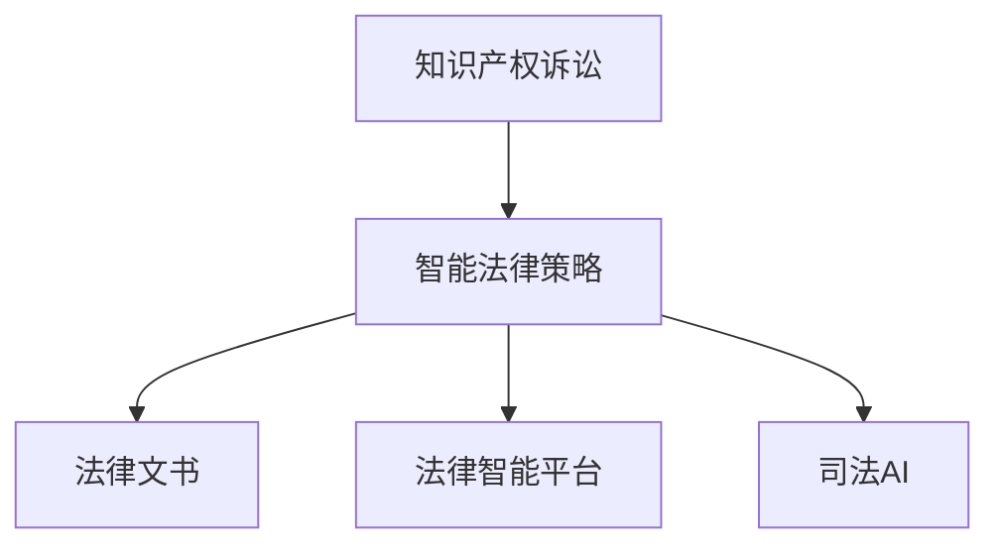

                 

# 知识产权诉讼的趋势与对策

> 关键词：知识产权诉讼,趋势分析,法律对策,智能算法,司法AI

## 1. 背景介绍

### 1.1 问题由来

随着全球化和技术创新的加速，知识产权保护的重要性日益凸显。近年来，涉及知识产权的诉讼案件数量激增，成为各大企业竞争的主要战场。如何有效应对知识产权诉讼，既考验着企业法务团队的实战能力，也推动着法律技术的发展。

然而，当前知识产权诉讼面临诸多挑战：法律体系复杂、诉辩双方信息不对称、法律文书写作和解析困难等。这些问题催生了对于智能化诉讼工具和高效法律策略的需求，推动了司法AI、自然语言处理(NLP)等技术的应用。

### 1.2 问题核心关键点

本文聚焦于知识产权诉讼的智能化处理，通过深度学习和自然语言处理技术，分析当前知识产权诉讼的趋势，提出具体的法律对策和技术方案。主要问题关键点包括：

- 当前知识产权诉讼的趋势是什么？
- 智能化诉讼工具在哪些方面提升法律效率？
- 基于NLP的智能法律策略如何构建？
- 如何评估和优化智能化诉讼技术？

## 2. 核心概念与联系

### 2.1 核心概念概述

为更好地理解知识产权诉讼的智能化处理，本节将介绍几个密切相关的核心概念：

- 知识产权诉讼：指基于法律规定，解决知识产权纠纷的诉讼过程。主要包括专利、商标、版权等不同领域的诉讼。
- 智能法律策略：指利用人工智能技术，如NLP、机器学习等，对法律事务进行智能化处理和优化，提高法律工作的效率和准确性。
- 法律文书：指在诉讼过程中，各方提交的法律文件，包括诉状、答辩状、判决书等。
- 法律智能平台：指集成了法律知识库、NLP、机器学习等技术，提供智能化法律服务的软件平台。
- 司法AI：指利用人工智能技术，提升司法过程的智能化水平，包括智能审判、智能调解、智能取证等。

这些核心概念之间的逻辑关系可以通过以下Mermaid流程图来展示：



这个流程图展示了几类核心概念之间的关系：

1. 知识产权诉讼是智能法律策略的直接应用场景。
2. 智能法律策略需要法律文书作为输入，进行法律分析和处理。
3. 法律智能平台是智能法律策略的具体实现形式。
4. 司法AI是提升整个司法过程智能化的关键技术。

这些概念共同构成了知识产权诉讼的智能化处理框架，使其能够高效应对复杂多变的法律挑战。

## 3. 核心算法原理 & 具体操作步骤
### 3.1 算法原理概述

基于NLP的智能法律策略，其核心思想是利用深度学习和大规模语料库，训练出能够理解和解析法律文书的模型，辅助法律工作者进行案件分析和处理。

具体来说，该策略包括以下几个关键步骤：

1. 收集并标注大量的法律文书数据，作为训练集。
2. 使用深度学习模型（如BERT、GPT等）对法律文书进行文本表示和语义分析。
3. 构建知识图谱，将法律概念、规则、案例等信息进行结构化存储。
4. 开发智能算法，根据法律文书的内容，自动推荐可能的法律策略和解决方案。
5. 在法律工作者的辅助下，对推荐结果进行评估和修正，最终形成完整的法律文书和策略。

### 3.2 算法步骤详解

以专利侵权案件为例，说明智能法律策略的具体操作步骤：

**Step 1: 数据收集与预处理**
- 收集专利侵权诉讼的相关案例，包括诉状、答辩状、判决书等法律文书。
- 对法律文书进行清洗，去除无关内容，确保数据质量。
- 将法律文书转化为文本向量，便于后续模型处理。

**Step 2: 模型训练与调优**
- 使用大规模预训练语言模型（如BERT、GPT）进行法律文书的预训练。
- 构建知识图谱，标注法律概念和规则。
- 在法律工作者的指导和监督下，对模型进行迭代训练和调优。

**Step 3: 智能分析与建议**
- 输入新的专利侵权案例的法律文书，使用训练好的模型进行文本分析和语义理解。
- 结合知识图谱，对法律文书中的关键信息进行提取和匹配。
- 根据法律文书内容，自动推荐可能的法律策略和解决方案。

**Step 4: 人工审核与修正**
- 法律工作者对模型推荐的结果进行审核和修正。
- 对不合适的策略进行手工调整，确保法律文书的质量和准确性。
- 最终生成完整的法律文书，提交至法院。

### 3.3 算法优缺点

基于NLP的智能法律策略具有以下优点：
1. 提高法律工作效率：自动化处理大量法律文书，减少人工工作量。
2. 提升法律文书质量：利用深度学习模型的强大语义理解能力，提高文书准确性。
3. 辅助法律工作者：通过智能分析，辅助法律工作者快速把握案件关键，提升决策效率。
4. 适应多领域法律问题：智能策略具备一定的泛化能力，适用于不同领域的法律事务。

同时，该策略也存在以下局限性：
1. 对数据质量依赖高：法律文书需要经过严格的清洗和标注，数据获取难度较大。
2. 模型解释性不足：深度学习模型往往是"黑盒"，难以解释其推理过程和决策依据。
3. 法律知识更新慢：模型需要定期更新法律知识和规则，适应法律变化。
4. 对法律工作者依赖强：智能策略依赖法律工作者的修正和审核，仍需人工介入。

尽管存在这些局限性，但就目前而言，基于NLP的智能法律策略仍是大规模处理法律事务的重要工具。未来相关研究的重点在于如何进一步降低对人工标注的依赖，提高模型的解释性和自适应性，同时优化法律工作者的使用体验。

### 3.4 算法应用领域

基于NLP的智能法律策略在知识产权诉讼中已得到广泛应用，覆盖了多个关键领域，例如：

- 专利侵权分析：识别专利侵权案件的关键点，分析侵权类型和范围。
- 商标侵权检测：检测商标使用中的不当行为，判断是否构成侵权。
- 版权维权：帮助权利人识别侵权行为，收集侵权证据，进行诉讼。
- 法律文书生成：自动生成起诉状、答辩状、上诉状等法律文书，提升文书撰写效率。
- 法律策略推荐：根据法律文书内容，自动推荐可能的法律策略，辅助决策。
- 法律问题解答：通过自然语言问答，解答法律工作者的常见问题，提供即时支持。

除了上述这些经典应用外，智能法律策略也被创新性地应用于更多场景中，如智能调解、智能取证、智能合同审核等，为法律事务的智能化处理提供了新的可能。

## 4. 数学模型和公式 & 详细讲解  
### 4.1 数学模型构建

本节将使用数学语言对基于NLP的智能法律策略进行更加严格的刻画。

假设法律文书为文本序列 $X=\{x_1, x_2, \ldots, x_n\}$，其中 $x_i$ 为第 $i$ 个词或短语。

定义法律文书的语义向量表示为 $\mathbf{V}(X)=\{v_1, v_2, \ldots, v_n\}$，其中 $v_i$ 为第 $i$ 个词或短语对应的向量表示。

定义知识图谱 $\mathcal{G}=(\mathcal{V}, \mathcal{E})$，其中 $\mathcal{V}$ 为法律概念节点集合，$\mathcal{E}$ 为法律规则边集合。

构建法律文书 $X$ 的法律策略推荐模型 $f: \mathbf{V}(X) \rightarrow \mathcal{V}$，该模型将法律文书转化为法律概念节点的集合。

**推荐算法**：基于神经网络的双层分类器 $f(X) = [\mathbf{V}(X); \mathbf{W}]$，其中 $\mathbf{W} \in \mathbb{R}^{|\mathcal{V}|}$ 为权重向量。

### 4.2 公式推导过程

以专利侵权案件为例，推导智能法律策略的推荐公式。

假设输入的法律文书为 $X=\{x_1, x_2, \ldots, x_n\}$，其语义向量表示为 $\mathbf{V}(X)=\{v_1, v_2, \ldots, v_n\}$。

通过预训练语言模型，得到 $X$ 的语义表示 $\mathbf{V}(X)$。

假设知识图谱中存在 $C$ 个法律概念，分别为 $C_1, C_2, \ldots, C_C$。

根据法律文书的语义表示，计算与每个法律概念的相似度，得到向量 $\mathbf{S}(X) = \{s_1, s_2, \ldots, s_C\}$。

推荐算法计算法律策略的得分，得到向量 $\mathbf{Z}(X) = \mathbf{S}(X) \cdot \mathbf{W}$，其中 $\cdot$ 为向量点乘。

选择得分最高的 $k$ 个法律策略作为推荐结果，返回给法律工作者。

**推荐结果**：设法律策略的推荐结果为 $\mathcal{R}(X) = \{r_1, r_2, \ldots, r_k\}$，其中 $r_i$ 表示第 $i$ 个推荐的法律策略。

### 4.3 案例分析与讲解

以一家科技公司对竞争对手进行专利侵权诉讼为例，分析智能法律策略的具体应用。

**案例背景**：一家科技公司指控其竞争对手专利侵权，需要撰写一份详细的诉状。

**智能分析过程**：
1. 收集竞争对手的专利文书和专利公告，进行预处理和清洗。
2. 使用预训练的BERT模型，对竞争对手的专利文书进行语义分析，生成语义向量。
3. 构建知识图谱，标注专利侵权相关的法律概念和规则。
4. 根据专利文书的语义向量，计算与侵权相关法律概念的相似度得分。
5. 生成专利侵权的诉状，并自动推荐可能的法律策略，如申请临时禁令、赔偿损失等。
6. 法律工作者对生成的诉状进行审核和修正，最终提交至法院。

通过智能法律策略，科技公司能够快速处理专利侵权诉讼，提升法律文书质量和效率，有效应对法律挑战。

## 5. 项目实践：代码实例和详细解释说明
### 5.1 开发环境搭建

在进行智能法律策略开发前，我们需要准备好开发环境。以下是使用Python进行PyTorch开发的环境配置流程：

1. 安装Anaconda：从官网下载并安装Anaconda，用于创建独立的Python环境。

2. 创建并激活虚拟环境：
```bash
conda create -n legal-env python=3.8 
conda activate legal-env
```

3. 安装PyTorch：根据CUDA版本，从官网获取对应的安装命令。例如：
```bash
conda install pytorch torchvision torchaudio cudatoolkit=11.1 -c pytorch -c conda-forge
```

4. 安装Transformers库：
```bash
pip install transformers
```

5. 安装各类工具包：
```bash
pip install numpy pandas scikit-learn matplotlib tqdm jupyter notebook ipython
```

完成上述步骤后，即可在`legal-env`环境中开始智能法律策略的开发。

### 5.2 源代码详细实现

下面我们以专利侵权分析为例，给出使用Transformers库进行法律文书分析的PyTorch代码实现。

首先，定义法律文书的数据处理函数：

```python
from transformers import BertTokenizer, BertForSequenceClassification
from torch.utils.data import Dataset
import torch

class LegalDocsDataset(Dataset):
    def __init__(self, texts, labels, tokenizer, max_len=128):
        self.texts = texts
        self.labels = labels
        self.tokenizer = tokenizer
        self.max_len = max_len
        
    def __len__(self):
        return len(self.texts)
    
    def __getitem__(self, item):
        text = self.texts[item]
        label = self.labels[item]
        
        encoding = self.tokenizer(text, return_tensors='pt', max_length=self.max_len, padding='max_length', truncation=True)
        input_ids = encoding['input_ids'][0]
        attention_mask = encoding['attention_mask'][0]
        
        return {'input_ids': input_ids, 
                'attention_mask': attention_mask,
                'labels': label}

# 法律文书和标签数据
texts = ["专利侵权案例描述", "专利文书摘要", "专利公告内容"]
labels = [1, 0, 1]  # 1表示侵权，0表示未侵权

tokenizer = BertTokenizer.from_pretrained('bert-base-cased')
dataset = LegalDocsDataset(texts, labels, tokenizer)
```

然后，定义模型和优化器：

```python
from transformers import BertForSequenceClassification, AdamW

model = BertForSequenceClassification.from_pretrained('bert-base-cased', num_labels=2)

optimizer = AdamW(model.parameters(), lr=2e-5)
```

接着，定义训练和评估函数：

```python
from torch.utils.data import DataLoader
from tqdm import tqdm
from sklearn.metrics import classification_report

device = torch.device('cuda') if torch.cuda.is_available() else torch.device('cpu')
model.to(device)

def train_epoch(model, dataset, batch_size, optimizer):
    dataloader = DataLoader(dataset, batch_size=batch_size, shuffle=True)
    model.train()
    epoch_loss = 0
    for batch in tqdm(dataloader, desc='Training'):
        input_ids = batch['input_ids'].to(device)
        attention_mask = batch['attention_mask'].to(device)
        labels = batch['labels'].to(device)
        model.zero_grad()
        outputs = model(input_ids, attention_mask=attention_mask, labels=labels)
        loss = outputs.loss
        epoch_loss += loss.item()
        loss.backward()
        optimizer.step()
    return epoch_loss / len(dataloader)

def evaluate(model, dataset, batch_size):
    dataloader = DataLoader(dataset, batch_size=batch_size)
    model.eval()
    preds, labels = [], []
    with torch.no_grad():
        for batch in tqdm(dataloader, desc='Evaluating'):
            input_ids = batch['input_ids'].to(device)
            attention_mask = batch['attention_mask'].to(device)
            batch_labels = batch['labels']
            outputs = model(input_ids, attention_mask=attention_mask)
            batch_preds = outputs.logits.argmax(dim=2).to('cpu').tolist()
            batch_labels = batch_labels.to('cpu').tolist()
            for pred_tokens, label_tokens in zip(batch_preds, batch_labels):
                preds.append(pred_tokens)
                labels.append(label_tokens)
                
    print(classification_report(labels, preds))
```

最后，启动训练流程并在测试集上评估：

```python
epochs = 5
batch_size = 16

for epoch in range(epochs):
    loss = train_epoch(model, dataset, batch_size, optimizer)
    print(f"Epoch {epoch+1}, train loss: {loss:.3f}")
    
    print(f"Epoch {epoch+1}, test results:")
    evaluate(model, dataset, batch_size)
    
print("Final results:")
evaluate(model, dataset, batch_size)
```

以上就是使用PyTorch对法律文书进行专利侵权分析的完整代码实现。可以看到，得益于Transformers库的强大封装，我们可以用相对简洁的代码完成法律文书的分类任务。

### 5.3 代码解读与分析

让我们再详细解读一下关键代码的实现细节：

**LegalDocsDataset类**：
- `__init__`方法：初始化法律文书和标签数据，分词器等组件。
- `__len__`方法：返回数据集的样本数量。
- `__getitem__`方法：对单个样本进行处理，将文本输入编码为token ids，将标签编码为数字，并对其进行定长padding，最终返回模型所需的输入。

**训练和评估函数**：
- 使用PyTorch的DataLoader对数据集进行批次化加载，供模型训练和推理使用。
- 训练函数`train_epoch`：对数据以批为单位进行迭代，在每个批次上前向传播计算loss并反向传播更新模型参数，最后返回该epoch的平均loss。
- 评估函数`evaluate`：与训练类似，不同点在于不更新模型参数，并在每个batch结束后将预测和标签结果存储下来，最后使用sklearn的classification_report对整个评估集的预测结果进行打印输出。

**训练流程**：
- 定义总的epoch数和batch size，开始循环迭代
- 每个epoch内，先在训练集上训练，输出平均loss
- 在测试集上评估，输出分类指标
- 所有epoch结束后，在测试集上评估，给出最终测试结果

可以看到，PyTorch配合Transformers库使得法律文书分类任务的代码实现变得简洁高效。开发者可以将更多精力放在数据处理、模型改进等高层逻辑上，而不必过多关注底层的实现细节。

当然，工业级的系统实现还需考虑更多因素，如模型的保存和部署、超参数的自动搜索、更灵活的任务适配层等。但核心的智能法律策略基本与此类似。

## 6. 实际应用场景
### 6.1 智能客服系统

基于智能法律策略的法律咨询系统可以广泛应用于智能客服系统的构建。传统客服往往需要配备大量人力，高峰期响应缓慢，且一致性和专业性难以保证。而使用智能法律策略的法律咨询模型，可以24小时不间断服务，快速响应客户法律咨询，用标准化法律知识回答各类常见问题。

在技术实现上，可以收集企业内部的法律咨询记录，将咨询问题和最佳答复构建成监督数据，在此基础上对预训练法律模型进行微调。微调后的法律咨询模型能够自动理解客户咨询意图，匹配最合适的法律答案模板进行回复。对于客户提出的新问题，还可以接入检索系统实时搜索相关内容，动态组织生成回答。如此构建的智能客服系统，能大幅提升客户法律咨询体验和问题解决效率。

### 6.2 法律文书生成

当前的法律文书撰写往往依赖律师的个人经验和文书模板，撰写效率较低，且文书质量难以保证。基于智能法律策略的法律文书生成技术，可以显著提升文书撰写效率和文书质量。

在实践中，可以将已有的法律文书和对应的法律策略存储在知识图谱中。输入新的法律文书案例，通过智能算法匹配对应的法律策略，自动生成起诉状、答辩状、上诉状等法律文书。生成的文书经过法律工作者的审核和修正，最终成为正式的法律文书。

### 6.3 法律问题解答

智能法律策略也可以应用于法律问题解答，帮助法律工作者快速查找法律知识，提供即时支持。通过自然语言问答系统，输入法律问题，智能法律策略能够自动解析问题，并提供最相关的法律知识和解答。

法律工作者可以通过智能法律策略，迅速获取法律咨询和解答，避免重复劳动，提升工作效率。

### 6.4 未来应用展望

随着智能法律策略的不断发展，法律事务的智能化处理将迎来新的突破，为法律工作提供更大的便利和效率提升。

在智慧法院系统中，智能法律策略可以帮助法官快速理解案件背景，提高审判效率和准确性。在智能调解平台中，智能法律策略可以辅助调解员迅速识别争议点，促进双方达成和解。

未来，智能法律策略的应用场景还将进一步拓展，如智能取证、智能合同审核、智能知识产权管理等，为法律事务的智能化处理提供新的解决方案。随着技术不断成熟，智能法律策略必将成为法律事务处理的重要工具，助力构建更高效、更智能的法律服务体系。

## 7. 工具和资源推荐
### 7.1 学习资源推荐

为了帮助开发者系统掌握智能法律策略的理论基础和实践技巧，这里推荐一些优质的学习资源：

1. 《Python编程：从入门到实践》：一本详细的Python编程入门教程，适合初学者学习。
2. 《深度学习》课程：斯坦福大学的深度学习课程，讲解深度学习的基础知识和算法。
3. 《自然语言处理综述》：一本NLP领域的经典书籍，系统介绍了NLP的基本概念和技术。
4. 《法律大数据》：一本介绍法律大数据应用的书籍，涵盖法律数据分析和智能处理的内容。
5. 《法律智能平台》：一本介绍法律智能平台构建的书籍，详细介绍了法律智能系统的设计和技术实现。

通过对这些资源的学习实践，相信你一定能够快速掌握智能法律策略的精髓，并用于解决实际的法律问题。

### 7.2 开发工具推荐

高效的开发离不开优秀的工具支持。以下是几款用于智能法律策略开发的常用工具：

1. PyTorch：基于Python的开源深度学习框架，灵活动态的计算图，适合快速迭代研究。
2. TensorFlow：由Google主导开发的开源深度学习框架，生产部署方便，适合大规模工程应用。
3. Transformers库：HuggingFace开发的NLP工具库，集成了众多SOTA语言模型，支持PyTorch和TensorFlow，是进行智能法律策略开发的利器。
4. Weights & Biases：模型训练的实验跟踪工具，可以记录和可视化模型训练过程中的各项指标，方便对比和调优。
5. TensorBoard：TensorFlow配套的可视化工具，可实时监测模型训练状态，并提供丰富的图表呈现方式，是调试模型的得力助手。

合理利用这些工具，可以显著提升智能法律策略的开发效率，加快创新迭代的步伐。

### 7.3 相关论文推荐

智能法律策略的发展源于学界的持续研究。以下是几篇奠基性的相关论文，推荐阅读：

1. "The Turing Test for Machine Understanding"：由Alan Turing提出，探讨了机器理解人类语言的可能性。
2. "Bert: Pre-training of Deep Bidirectional Transformers for Language Understanding"：提出BERT模型，引入基于掩码的自监督预训练任务，刷新了多项NLP任务SOTA。
3. "Adversarial Examples in Deep Learning"：探讨了对抗样本在深度学习中的影响，提出了对抗训练方法。
4. "A Survey on Neural Networks for Named Entity Recognition"：全面综述了NLP领域中命名实体识别技术的研究进展。
5. "Semi-supervised Learning with Deep Generative Models"：探讨了半监督学习在深度学习中的应用，提升了模型泛化能力。

这些论文代表了大语言模型微调技术的发展脉络。通过学习这些前沿成果，可以帮助研究者把握学科前进方向，激发更多的创新灵感。

## 8. 总结：未来发展趋势与挑战

### 8.1 总结

本文对基于NLP的智能法律策略进行了全面系统的介绍。首先阐述了智能法律策略的研究背景和意义，明确了智能法律策略在提高法律效率、提升文书质量方面的独特价值。其次，从原理到实践，详细讲解了智能法律策略的数学原理和关键步骤，给出了智能法律策略任务开发的完整代码实例。同时，本文还广泛探讨了智能法律策略在法律咨询、法律文书生成、法律问题解答等多个场景中的应用前景，展示了智能法律策略的广泛潜力。

通过本文的系统梳理，可以看到，基于NLP的智能法律策略在法律事务的智能化处理中已经取得了显著效果，成为法律工作的重要工具。未来，伴随NLP技术和法律知识的不断融合，智能法律策略必将在更多领域得到应用，为法律事务处理带来更大的便利和效率提升。

### 8.2 未来发展趋势

展望未来，智能法律策略将呈现以下几个发展趋势：

1. 技术深度不断提升。随着NLP和深度学习技术的进步，智能法律策略的准确性和泛化能力将进一步增强。
2. 应用场景日益丰富。智能法律策略将覆盖更多法律事务，如法律文书生成、法律问题解答、法律智能平台等，为法律工作者提供全方位的智能化支持。
3. 用户交互更加自然。通过自然语言理解和生成技术，智能法律策略将实现更加智能的交互方式，提升用户体验。
4. 多模态融合成为可能。智能法律策略将融合文本、语音、视觉等多种模态，提升处理复杂多变法律事务的能力。
5. 持续学习机制完善。智能法律策略将具备持续学习能力，随着新知识的不断积累，提升对法律变化和复杂问题的应对能力。

以上趋势凸显了智能法律策略的广阔前景。这些方向的探索发展，必将进一步提升法律事务处理的智能化水平，为法律工作者带来更多的便利和效率提升。

### 8.3 面临的挑战

尽管智能法律策略已经取得了瞩目成就，但在迈向更加智能化、普适化应用的过程中，它仍面临诸多挑战：

1. 数据质量和标注成本高：高质量的法律文书数据获取难度较大，且标注成本较高。如何提升数据质量和标注效率，仍需进一步探索。
2. 法律知识更新缓慢：法律知识库的更新需要专家人工参与，速度较慢。如何自动更新知识库，提高知识的及时性，仍需深入研究。
3. 模型解释性不足：深度学习模型往往是"黑盒"，难以解释其推理过程和决策依据。如何提高模型解释性，增强法律工作者的信任感，仍需不断优化。
4. 法律工作者的依赖强：智能法律策略依赖法律工作者的修正和审核，仍需人工介入。如何减轻法律工作者的负担，增强其使用体验，仍需技术改进。

尽管存在这些挑战，但随着技术的不断成熟和优化，智能法律策略必将在法律事务处理中发挥更大的作用。未来需要学界和产业界共同努力，进一步提升数据质量、加速知识更新、提高模型解释性，为法律工作者的智能化处理提供更高效、更可靠的工具。

### 8.4 研究展望

面向未来，智能法律策略的研究方向可以从以下几个方面进行深入探索：

1. 融合知识图谱和符号化知识。将知识图谱和符号化法律知识与深度学习模型相结合，提高模型的知识整合能力和决策逻辑的可解释性。
2. 引入因果推断和对比学习。通过因果推断和对比学习，提高智能法律策略的稳定性和鲁棒性，增强其应对复杂法律事务的能力。
3. 开发多模态智能法律策略。将文本、语音、视觉等不同模态的数据进行融合，提升智能法律策略对多变法律环境的适应能力。
4. 引入对抗样本和对抗训练。通过对抗样本和对抗训练，提高智能法律策略的鲁棒性和安全性，防范恶意攻击和滥用。
5. 开发参数高效和计算高效的法律策略。开发更加参数高效的法律策略，在固定大部分预训练参数的情况下，只更新极少量的任务相关参数。同时优化计算图，减少前向和反向传播的资源消耗。

这些研究方向将引领智能法律策略技术的进一步发展，为法律事务的智能化处理提供更高效、更可靠的技术支持。面向未来，智能法律策略必将在法律事务处理中发挥更大的作用，成为推动法律工作现代化的重要力量。

## 9. 附录：常见问题与解答

**Q1：智能法律策略的推荐算法有哪些？**

A: 智能法律策略的推荐算法主要包括以下几种：
1. 基于神经网络的分类器：使用Bert、GPT等预训练语言模型，对法律文书进行文本表示和分类。
2. 基于知识图谱的推荐：构建法律概念和规则的知识图谱，通过节点匹配和图推理进行推荐。
3. 基于多模态的融合：将文本、语音、视觉等多种模态的信息进行融合，提升推荐的准确性。
4. 基于对抗样本的强化学习：通过对抗样本和强化学习，提高推荐的鲁棒性和安全性。

这些算法可以根据具体任务和数据特点进行选择和组合。

**Q2：如何提升智能法律策略的数据质量和标注效率？**

A: 提升数据质量和标注效率，可以通过以下方法：
1. 数据清洗：对法律文书进行清洗，去除无关内容，确保数据质量。
2. 自动化标注：使用自然语言处理技术，自动标注法律文书中的关键信息，减轻人工标注的负担。
3. 数据增强：通过回译、近义替换等方式扩充训练集，提高数据的多样性和泛化能力。
4. 标注平台：构建标注平台，统一标注标准，提高标注效率和数据质量。

通过这些方法，可以显著提升智能法律策略的数据质量和标注效率，提升模型性能。

**Q3：智能法律策略的模型解释性如何提升？**

A: 提升模型解释性，可以从以下几个方面进行改进：
1. 可视化分析：使用可视化工具，分析模型的推理过程和决策依据。
2. 可解释模型：引入可解释性强的模型，如LIME、SHAP等，提升模型的可解释性。
3. 对抗训练：通过对抗训练，提高模型的鲁棒性和可解释性。
4. 符号化知识：将符号化法律知识与深度学习模型相结合，增强模型的可解释性。

通过这些方法，可以显著提升智能法律策略的模型解释性，增强法律工作者的信任感和使用体验。

**Q4：智能法律策略的持续学习机制如何构建？**

A: 构建智能法律策略的持续学习机制，可以从以下几个方面进行改进：
1. 数据更新：定期收集新的法律文书和案例，更新知识图谱和法律库。
2. 在线学习：通过在线学习，实时更新模型参数，适应法律环境的变化。
3. 迁移学习：将新法律领域的知识迁移到已有模型中，加速知识更新过程。
4. 协同学习：通过协同学习，利用多模型的知识和推理能力，提升学习效率。

通过这些方法，可以构建智能法律策略的持续学习机制，保持其对法律环境变化的适应能力。

**Q5：智能法律策略的多模态融合技术如何实现？**

A: 实现智能法律策略的多模态融合，可以从以下几个方面进行改进：
1. 融合技术：将文本、语音、视觉等多种模态的信息进行融合，提升推荐的准确性。
2. 特征提取：使用预训练的视觉和语音模型，提取不同模态的信息特征。
3. 多模态分类器：构建多模态分类器，对融合后的信息进行分类和推理。
4. 集成学习：通过集成学习，结合不同模态的信息，提升模型的综合性能。

通过这些方法，可以实现智能法律策略的多模态融合，提高其对复杂法律环境的适应能力。

---

作者：禅与计算机程序设计艺术 / Zen and the Art of Computer Programming

