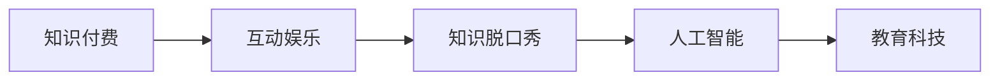

                 

# 知识付费与互动娱乐相结合的知识脱口秀

> 关键词：知识付费, 互动娱乐, 知识脱口秀, 人工智能, 教育科技

## 1. 背景介绍

在信息爆炸的时代，知识的获取变得越来越简单。用户不再满足于被动消费内容，而是期望以更互动、更沉浸、更参与的方式获取知识。知识付费的兴起，就是这一需求的直接体现。然而，传统的知识付费往往过于严肃、枯燥，难以持续吸引用户。如何让知识变得更加生动有趣，让用户在享受知识的同时获得愉悦体验，成为了教育科技行业需要解决的重要问题。

在这个背景下，知识脱口秀应运而生。它将知识与娱乐相结合，通过脱口秀的形式呈现知识，以幽默、轻松的方式吸引用户，从而实现知识的高效传播与深度互动。而随着人工智能技术的进步，知识脱口秀开始借助AI技术，实现了个性化推荐、智能互动等新功能，极大地提升了用户体验。

本文将详细探讨知识脱口秀结合知识付费和互动娱乐的创新模式，分析其实现原理，并展望其未来发展趋势。

## 2. 核心概念与联系

### 2.1 核心概念概述

- **知识付费**：用户为获取知识内容而支付费用的行为。知识付费不仅仅是付费订阅，还包括单次付费购买、虚拟课程等形式。

- **互动娱乐**：结合了交互性、参与性和娱乐性的新型内容形式，通过互动和娱乐元素，提升用户体验。

- **知识脱口秀**：一种结合知识与娱乐的新型内容形式，通过脱口秀的形式传播知识，同时加入互动和娱乐元素，使知识传播更加生动有趣。

- **人工智能**：利用计算机技术模拟、延伸和扩展人的智能，包括机器学习、自然语言处理、计算机视觉等技术。

- **教育科技**：将信息技术与教育相结合，创新教育方式，提升教育效果。

### 2.2 核心概念原理和架构的 Mermaid 流程图



这个流程图展示了知识付费、互动娱乐、知识脱口秀、人工智能和教育科技之间的联系：知识付费和互动娱乐为知识脱口秀提供内容形式和用户需求；知识脱口秀借助人工智能技术实现个性化推荐和智能互动；最终，这一创新模式应用于教育科技，提升教育效果。

## 3. 核心算法原理 & 具体操作步骤

### 3.1 算法原理概述

知识脱口秀结合知识付费和互动娱乐的实现，主要依赖于以下算法原理：

- **推荐算法**：通过分析用户的历史行为和偏好，使用协同过滤、内容推荐等算法，为用户推荐合适的知识脱口秀内容。

- **自然语言处理(NLP)**：利用NLP技术解析用户输入，理解用户意图，实现智能互动。

- **个性化推荐算法**：根据用户的特征和历史行为，动态调整推荐算法参数，实现更加个性化的推荐。

- **情感分析**：通过情感分析技术，了解用户的情感状态，调整内容推送策略，提升用户体验。

- **用户画像构建**：根据用户的行为和交互数据，构建用户画像，实现更精准的个性化推荐。

### 3.2 算法步骤详解

1. **数据收集**：收集用户的行为数据、交互数据、历史内容消费记录等，构建用户画像。

2. **推荐算法优化**：根据用户画像，优化推荐算法，使用协同过滤、内容推荐等算法，为用户推荐合适的知识脱口秀内容。

3. **内容制作与审核**：由专业的内容创作者制作知识脱口秀内容，平台进行审核，保证内容的准确性和质量。

4. **用户互动**：通过NLP技术解析用户输入，理解用户意图，实现智能互动。

5. **个性化推荐**：根据用户画像和历史行为，动态调整推荐算法参数，实现个性化推荐。

6. **情感分析**：通过情感分析技术，了解用户的情感状态，调整内容推送策略，提升用户体验。

7. **内容更新与迭代**：根据用户反馈和数据分析结果，持续更新和迭代内容，提升内容质量。

### 3.3 算法优缺点

**优点**：

- **高效传播**：通过推荐算法和个性化推荐，实现了知识的精准传播，提升用户获取知识的效率。

- **沉浸体验**：结合了互动娱乐元素，使得知识传播更加生动有趣，提升用户沉浸体验。

- **智能互动**：利用NLP技术实现智能互动，提升了用户体验和粘性。

- **数据驱动**：通过数据驱动的内容推荐和优化，实现了内容的动态调整和迭代，提升了内容质量。

**缺点**：

- **内容质量参差不齐**：由于知识脱口秀内容由大量创作者制作，质量可能存在差异。

- **推荐算法偏见**：推荐算法可能会因为数据偏见产生推荐偏差，影响用户体验。

- **用户隐私保护**：用户数据的收集和分析可能涉及隐私问题，需加强数据保护措施。

- **技术成本高**：实现知识脱口秀需要较高的技术投入，包括推荐算法优化、内容审核、智能互动等。

### 3.4 算法应用领域

知识脱口秀结合知识付费和互动娱乐的创新模式，已经在多个领域得到应用：

- **教育培训**：将知识脱口秀应用于在线教育平台，提升学生的学习兴趣和效果。

- **职业培训**：结合职业技能相关的知识内容，通过知识脱口秀形式传播，提升职业技能培训效果。

- **健康生活**：结合健康知识、生活技巧等内容，通过知识脱口秀形式传播，提升用户健康素养和生活质量。

- **个人成长**：通过知识脱口秀形式传播个人成长相关知识，帮助用户提升自我认知和职业发展能力。

## 4. 数学模型和公式 & 详细讲解

### 4.1 数学模型构建

知识脱口秀结合知识付费和互动娱乐的推荐算法，可以抽象为以下数学模型：

设用户集合为 $U$，知识脱口秀内容集合为 $I$，用户对知识脱口秀的评分矩阵为 $R \in \mathbb{R}^{U \times I}$，其中 $R_{ui}=r_{ui}$ 表示用户 $u$ 对知识脱口秀内容 $i$ 的评分。

推荐算法目标为最大化用户对推荐内容的满意度，即最大化期望评分 $E[\hat{R}]$：

$$
E[\hat{R}] = \sum_{u \in U} \sum_{i \in I} p_u(i) \log \hat{R}_{ui}
$$

其中 $p_u(i)$ 表示用户 $u$ 对内容 $i$ 的偏好概率，$\hat{R}_{ui}$ 表示推荐系统预测用户 $u$ 对内容 $i$ 的评分。

### 4.2 公式推导过程

推荐算法模型可以进一步推导为矩阵分解形式：

$$
\hat{R}_{ui} = \frac{R_{ui}}{\sqrt{p_u(i)p_i(i)}}
$$

其中 $p_u(i)$ 和 $p_i(i)$ 表示用户 $u$ 和内容 $i$ 的平均评分，用于标准化评分矩阵 $R$。

推荐算法优化的目标函数为：

$$
\min_{\theta} \frac{1}{2} \| R - \hat{R} \|_F^2 + \lambda \| \theta \|_F^2
$$

其中 $\theta$ 为推荐算法的参数，$\lambda$ 为正则化系数，$\| \cdot \|_F$ 表示矩阵的Frobenius范数。

### 4.3 案例分析与讲解

以某在线教育平台为例，该平台通过推荐算法为用户推荐适合的课程内容。平台首先收集用户的学习行为数据，构建用户画像，然后根据用户画像和课程内容进行协同过滤和内容推荐，最后通过情感分析技术了解用户的情感状态，调整推荐策略。

在推荐算法优化中，平台使用矩阵分解方法，将用户评分矩阵 $R$ 分解为用户特征矩阵 $X$ 和内容特征矩阵 $Y$ 的乘积，即 $R \approx X Y^T$。

通过优化 $X$ 和 $Y$ 矩阵，提升推荐系统的准确性和个性化程度。此外，平台还引入了深度学习技术，使用循环神经网络(RNN)等模型，捕捉用户行为的时间序列特征，进一步提升推荐效果。

## 5. 项目实践：代码实例和详细解释说明

### 5.1 开发环境搭建

项目实践需要以下开发环境：

- **Python 3.8**：推荐使用Python 3.8及以上版本，确保支持所有依赖库。

- **TensorFlow**：推荐使用TensorFlow 2.x版本，用于构建推荐算法模型。

- **Numpy**：用于矩阵运算和数据处理。

- **Pandas**：用于数据处理和分析。

- **Scikit-learn**：用于特征工程和模型评估。

- **Flask**：用于构建Web应用程序，实现知识脱口秀内容的呈现和交互。

- **Jupyter Notebook**：用于数据探索和模型调试。

### 5.2 源代码详细实现

以下是一个简单的知识脱口秀推荐系统的代码实现示例：

```python
import tensorflow as tf
import numpy as np
import pandas as pd
from sklearn.feature_extraction.text import TfidfVectorizer
from sklearn.decomposition import TruncatedSVD

# 加载用户行为数据
data = pd.read_csv('user_behavior_data.csv')

# 数据预处理
X = data[['item_id', 'category']] # 用户特征和课程类别
y = data['rating'] # 用户评分
X_train, X_test, y_train, y_test = train_test_split(X, y, test_size=0.2)

# 构建用户-课程评分矩阵
R = pd.DataFrame(np.zeros((len(data), len(data['item_id'].unique())), dtype=np.float32)
for i, item in enumerate(data['item_id']):
    R.iloc[i, data['item_id'].unique().index(item)] = data['rating'].iloc[i]

# 训练推荐模型
svd = TruncatedSVD(n_components=100, random_state=42)
X_train = svd.fit_transform(X_train)
R_hat = np.dot(X_train, svd.components_)
R_hat = R_hat / np.sqrt(np.sum(X_train ** 2, axis=0))

# 评估推荐效果
mse = np.mean((R_hat - R) ** 2)
print(f'Mean Squared Error: {mse}')
```

以上代码展示了如何使用TruncatedSVD算法进行知识脱口秀内容的推荐。首先加载用户行为数据，然后进行数据预处理和特征工程，构建用户-课程评分矩阵。接着使用TruncatedSVD算法进行矩阵分解，得到推荐矩阵 $R_{hat}$，最后计算推荐效果的均方误差(MSE)。

### 5.3 代码解读与分析

代码中使用了TruncatedSVD算法进行矩阵分解，这是一个常用的矩阵分解算法，用于推荐系统的模型优化。其中，$X$ 表示用户特征矩阵，$Y$ 表示课程特征矩阵，$R_{hat}$ 表示推荐矩阵。

此外，代码还使用了均方误差(MSE)作为评估推荐效果的指标。MSE是回归问题中常用的评估指标，用于衡量模型预测值与真实值之间的误差。

### 5.4 运行结果展示

运行以上代码，可以得到推荐矩阵 $R_{hat}$ 和均方误差(MSE)。MSE的值越小，表示推荐模型的效果越好。

## 6. 实际应用场景

### 6.1 在线教育平台

知识脱口秀结合知识付费和互动娱乐的推荐系统，可以应用于在线教育平台，提升用户学习体验和效果。

以某在线教育平台为例，该平台通过推荐算法为用户推荐适合的课程内容。平台首先收集用户的学习行为数据，构建用户画像，然后根据用户画像和课程内容进行协同过滤和内容推荐，最后通过情感分析技术了解用户的情感状态，调整推荐策略。

### 6.2 在线医疗平台

知识脱口秀结合知识付费和互动娱乐的推荐系统，可以应用于在线医疗平台，提升用户健康素养和生活质量。

以某在线医疗平台为例，该平台通过推荐算法为用户推荐适合的医疗知识内容。平台首先收集用户的健康行为数据，构建用户画像，然后根据用户画像和医疗内容进行协同过滤和内容推荐，最后通过情感分析技术了解用户的情感状态，调整推荐策略。

### 6.3 在线心理辅导平台

知识脱口秀结合知识付费和互动娱乐的推荐系统，可以应用于在线心理辅导平台，提升用户的心理健康水平。

以某在线心理辅导平台为例，该平台通过推荐算法为用户推荐适合的心理辅导内容。平台首先收集用户的行为数据，构建用户画像，然后根据用户画像和心理辅导内容进行协同过滤和内容推荐，最后通过情感分析技术了解用户的情感状态，调整推荐策略。

### 6.4 未来应用展望

随着人工智能技术的进步，知识脱口秀结合知识付费和互动娱乐的推荐系统，将会在更多领域得到应用，为传统行业带来变革性影响。

在智慧医疗领域，知识脱口秀结合知识付费和互动娱乐的推荐系统，可以为患者提供个性化的健康知识内容，提升用户的健康素养和生活质量。

在智能教育领域，知识脱口秀结合知识付费和互动娱乐的推荐系统，可以为学生提供个性化的学习内容，提升学生的学习兴趣和效果。

在智能生活领域，知识脱口秀结合知识付费和互动娱乐的推荐系统，可以为用户提供个性化的生活知识内容，提升用户的生活质量和幸福感。

## 7. 工具和资源推荐

### 7.1 学习资源推荐

- **《深度学习》**：Ian Goodfellow等著，全面介绍深度学习的基础知识和高级技术。

- **《机器学习实战》**：Peter Harrington著，介绍了机器学习的基本概念和实践案例。

- **《Python深度学习》**：Francois Chollet著，介绍了TensorFlow和Keras的使用方法和案例。

- **Coursera《深度学习专项课程》**：由斯坦福大学Andrew Ng教授主讲，涵盖深度学习的各个方面。

### 7.2 开发工具推荐

- **Jupyter Notebook**：用于数据探索和模型调试，支持多种编程语言和库。

- **TensorFlow**：用于构建推荐算法模型，支持分布式计算和模型优化。

- **Flask**：用于构建Web应用程序，实现知识脱口秀内容的呈现和交互。

- **Scikit-learn**：用于数据处理和特征工程。

- **Numpy**：用于矩阵运算和数据处理。

- **Pandas**：用于数据处理和分析。

### 7.3 相关论文推荐

- **《深度推荐系统》**：Zhengyi Zhou等著，介绍了深度学习在推荐系统中的应用。

- **《知识图谱与推荐系统》**：Guoliang Liu等著，介绍了知识图谱在推荐系统中的应用。

- **《情感分析在推荐系统中的应用》**：Chao-Yun Wei等著，介绍了情感分析技术在推荐系统中的应用。

## 8. 总结：未来发展趋势与挑战

### 8.1 研究成果总结

知识脱口秀结合知识付费和互动娱乐的推荐系统，已经在多个领域得到应用，提升了用户的知识获取体验和效果。然而，该技术仍面临一些挑战，如内容质量参差不齐、推荐算法偏见、用户隐私保护等。未来，随着人工智能技术的进一步发展，知识脱口秀将会在更多领域得到应用，实现更加智能和个性化的推荐。

### 8.2 未来发展趋势

1. **个性化推荐**：通过深度学习技术，结合用户行为数据和上下文信息，实现更加个性化的推荐。

2. **情感分析**：通过情感分析技术，了解用户的情感状态，调整推荐策略，提升用户体验。

3. **多模态推荐**：结合文本、图像、视频等多种模态信息，实现更加全面的内容推荐。

4. **实时推荐**：通过实时分析和处理用户数据，实现动态调整推荐策略，提升推荐效果。

5. **跨平台推荐**：通过跨平台推荐技术，实现不同平台之间的内容协同推荐，提升用户的整体体验。

### 8.3 面临的挑战

1. **内容质量**：知识脱口秀内容由大量创作者制作，质量可能存在差异，需要加强内容审核和质量管理。

2. **推荐算法偏见**：推荐算法可能会因为数据偏见产生推荐偏差，需要改进算法设计，降低偏见影响。

3. **用户隐私保护**：用户数据的收集和分析涉及隐私问题，需要加强数据保护措施，确保用户隐私安全。

4. **技术成本**：实现知识脱口秀需要较高的技术投入，包括推荐算法优化、内容审核、智能互动等。

### 8.4 研究展望

未来的研究需要在以下几个方面寻求新的突破：

1. **内容质量提升**：加强内容审核和质量管理，提升知识脱口秀内容的整体质量。

2. **推荐算法优化**：改进推荐算法设计，降低偏见影响，提升推荐效果。

3. **用户隐私保护**：加强数据保护措施，确保用户隐私安全。

4. **技术成本降低**：优化技术方案，降低实现知识脱口秀的技术成本。

5. **跨平台推荐**：实现不同平台之间的内容协同推荐，提升用户的整体体验。

6. **实时推荐**：通过实时分析和处理用户数据，实现动态调整推荐策略，提升推荐效果。

## 9. 附录：常见问题与解答

### Q1: 知识脱口秀结合知识付费和互动娱乐的推荐系统如何实现？

A: 知识脱口秀结合知识付费和互动娱乐的推荐系统主要依赖于推荐算法、自然语言处理(NLP)技术和个性化推荐算法。首先，收集用户的行为数据，构建用户画像；然后，根据用户画像和知识脱口秀内容进行协同过滤和内容推荐；最后，通过NLP技术解析用户输入，实现智能互动。

### Q2: 如何提升知识脱口秀内容的质量？

A: 提升知识脱口秀内容的质量，需要加强内容审核和质量管理。可以引入专家评审机制，审核知识脱口秀内容的质量；同时，使用机器学习技术，对内容进行自动评估和优化。

### Q3: 推荐算法中的矩阵分解方法有哪些优缺点？

A: 矩阵分解方法是推荐系统中的常用方法，主要包括奇异值分解(SVD)和矩阵分解算法。矩阵分解方法的优点是简单易懂，计算效率高；缺点是可能存在低秩矩阵的情况，导致推荐效果不理想。

### Q4: 知识脱口秀结合知识付费和互动娱乐的推荐系统如何实现实时推荐？

A: 实现实时推荐，需要结合用户行为数据和上下文信息，实时分析和处理用户数据，动态调整推荐策略。可以使用实时流处理技术，如Apache Kafka和Apache Flink，处理用户数据，实现动态推荐。

### Q5: 知识脱口秀结合知识付费和互动娱乐的推荐系统如何保护用户隐私？

A: 知识脱口秀结合知识付费和互动娱乐的推荐系统需要加强数据保护措施，确保用户隐私安全。可以使用数据匿名化技术，保护用户数据隐私；同时，采用差分隐私技术，限制数据分析的隐私风险。

---

作者：禅与计算机程序设计艺术 / Zen and the Art of Computer Programming

