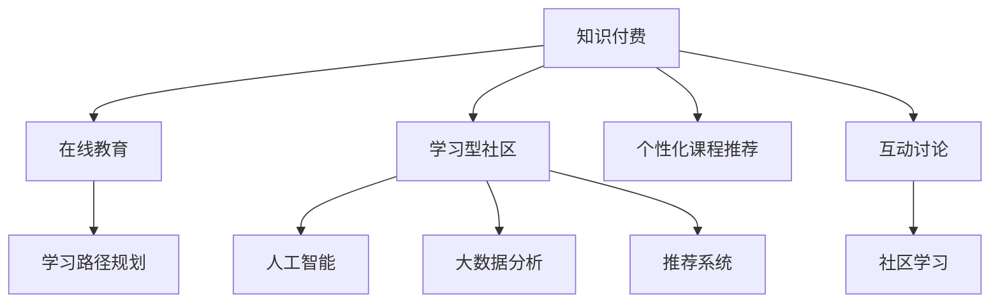

                 

# 知识付费与在线教育相结合的学习型社区模式

> 关键词：知识付费,在线教育,学习型社区,人工智能,大数据分析,内容推荐,用户画像,学习路径,个性化学习,自适应学习系统

## 1. 背景介绍

### 1.1 问题由来

随着互联网的普及和信息技术的飞速发展，在线教育已成为全球教育领域的重要组成部分。越来越多的学习者开始借助在线平台获取知识，学习资源更加丰富、学习方式更加灵活。然而，传统的在线教育模式存在着诸多不足之处，如教学质量参差不齐、学习效果评估难度大、学习互动性不足等问题。

知识付费作为一种新兴的学习方式，通过用户支付费用获取高质量、个性化内容，能够较好地解决在线教育存在的问题。知识付费平台聚集了各类专业讲师和优质课程内容，用户可以通过付费获得定制化的学习体验。然而，知识付费平台普遍存在以下几个问题：
- 学习内容丰富但不够个性化，难以满足用户的学习需求。
- 用户难以有效找到适合自己的课程，信息过载问题严重。
- 用户难以持续保持学习动力，缺乏与讲师的互动。

为解决上述问题，结合在线教育的优势，引入知识付费元素，构建学习型社区成为了一种有效的方式。学习型社区为知识付费和在线教育结合提供了新的思路，不仅提升了用户的学习体验，还能通过社区互动增加学习的趣味性和参与度。

### 1.2 问题核心关键点

学习型社区的核心在于如何有效整合知识付费与在线教育资源，通过人工智能和大数据技术，为每位用户量身定制个性化的学习方案。核心关键点包括：
- 如何通过大数据分析建立用户画像，了解用户的学习兴趣和需求。
- 如何结合人工智能推荐系统，为每位用户推荐最合适的课程和学习资源。
- 如何设计社区互动机制，增强学习者的参与度和持续学习动力。

## 2. 核心概念与联系

### 2.1 核心概念概述

为更好地理解知识付费与在线教育相结合的学习型社区模式，本节将介绍几个密切相关的核心概念：

- 知识付费：指用户为获取有价值、专业、高质量的内容而支付费用的行为。知识付费平台聚集了各类专家和优质课程内容，用户通过付费获取定制化的学习体验。
- 在线教育：指通过互联网平台进行的学习活动，不受时间和地点限制。在线教育平台提供各类课程、教学视频、互动工具等学习资源，用户可以灵活地选择学习时间和方式。
- 学习型社区：指由一群拥有共同学习目标的人组成的虚拟社区，通过知识分享、互动讨论、协作学习等方式，提升学习效果。
- 人工智能：指通过算法和计算技术，使机器能够模拟人类的智能行为。
- 大数据分析：指通过大规模数据集的分析，发现数据背后的规律和模式，从而辅助决策。
- 推荐系统：指通过用户行为数据和物品特征，为用户推荐最合适的产品或内容。

这些核心概念之间的逻辑关系可以通过以下Mermaid流程图来展示：



这个流程图展示了大语言模型的核心概念及其之间的关系：

1. 知识付费平台与在线教育平台相互支持，共同为用户提供学习资源。
2. 学习型社区为知识付费和在线教育提供互动平台，增强学习效果。
3. 人工智能和大数据分析技术用于提升推荐系统的精准度，优化个性化学习方案。
4. 推荐系统通过用户行为数据，为每位用户推荐最合适的课程和资源。
5. 个性化课程推荐和互动讨论机制，提升用户的学习体验和参与度。

这些概念共同构成了学习型社区的知识付费与在线教育结合框架，使其能够在各类学习场景下提供强大的支持。

## 3. 核心算法原理 & 具体操作步骤
### 3.1 算法原理概述

基于知识付费与在线教育相结合的学习型社区模式，其核心算法原理是：通过大数据分析建立用户画像，结合人工智能推荐系统，为每位用户推荐最合适的学习资源，并提供个性化的学习路径和互动机制，增强学习效果和用户满意度。

形式化地，假设用户集合为 $U$，课程集合为 $C$，其中每个课程有 $m$ 个特征。用户 $u \in U$ 在课程 $c \in C$ 上的兴趣程度为 $r(u,c)$。目标是找到一组最符合用户兴趣的课程，使得：

$$
\max_{S \subseteq C} \sum_{u \in U} \sum_{c \in S} r(u,c)
$$

其中 $S$ 表示用户 $u$ 感兴趣的一组课程，$U$ 表示用户集合，$C$ 表示课程集合，$r(u,c)$ 表示用户 $u$ 对课程 $c$ 的兴趣程度。

### 3.2 算法步骤详解

基于知识付费与在线教育相结合的学习型社区模式，一般包括以下几个关键步骤：

**Step 1: 数据收集与预处理**

- 收集用户行为数据：包括课程浏览记录、课程评分、学习时长等。
- 收集课程特征数据：包括课程标题、描述、难度、讲师等。
- 进行数据预处理：对数据进行清洗、归一化、特征工程等操作，形成结构化数据。

**Step 2: 用户画像构建**

- 使用聚类算法（如K-means、LDA等）对用户进行聚类，形成不同兴趣群体的用户画像。
- 使用关联规则算法（如Apriori、FP-growth等）分析用户的行为模式，识别出兴趣点。
- 使用文本挖掘技术（如TF-IDF、Word2Vec等）对用户评论进行情感分析，了解用户对课程的评价和反馈。

**Step 3: 推荐系统设计**

- 设计个性化推荐算法：如协同过滤、基于内容的推荐、矩阵分解等。
- 设计多样性推荐算法：如基于用户兴趣的多样性推荐，基于课程特征的多样性推荐。
- 设计交互式推荐算法：如实时推荐、主动推荐、互动推荐等。

**Step 4: 学习路径规划**

- 设计路径规划算法：如Dijkstra算法、A*算法等，根据用户兴趣和学习目标规划学习路径。
- 设计自适应学习系统：根据用户的学习进度和反馈，动态调整学习计划。
- 设计学习任务推荐算法：根据用户的学习进度和兴趣，推荐学习任务和练习。

**Step 5: 社区互动机制设计**

- 设计社区互动平台：如论坛、评论区、学习小组等，促进用户之间的互动交流。
- 设计激励机制：如积分、徽章、排行榜等，激励用户积极参与社区活动。
- 设计反馈机制：通过用户反馈调整推荐算法和课程内容，提升用户体验。

**Step 6: 系统集成与测试**

- 集成各个模块，形成完整的学习型社区系统。
- 进行系统测试：包括功能测试、性能测试、安全测试等，确保系统稳定运行。
- 收集用户反馈：通过用户调查、评价等方式，收集用户体验和满意度数据。

以上是基于知识付费与在线教育相结合的学习型社区模式的一般流程。在实际应用中，还需要针对具体任务的特点，对各个环节进行优化设计，如改进推荐算法、优化路径规划算法、增强社区互动机制等，以进一步提升系统性能。

### 3.3 算法优缺点

基于知识付费与在线教育相结合的学习型社区模式具有以下优点：
1. 个性化学习：通过大数据分析和个性化推荐算法，为每位用户提供定制化的学习资源。
2. 互动学习：通过社区互动机制，增强用户之间的交流和协作，提升学习效果。
3. 持续学习：通过动态调整学习路径和任务，促进用户持续学习，形成长期学习习惯。
4. 优质内容：知识付费平台提供高质量的课程内容，确保学习效果。
5. 便捷性：在线教育平台提供灵活的学习方式，用户可以随时开始和停止学习。

同时，该模式也存在一定的局限性：
1. 数据隐私问题：用户行为数据和个人信息可能被滥用，需要严格的隐私保护措施。
2. 推荐算法复杂：推荐系统的设计需要考虑多种因素，如个性化、多样性、实时性等，复杂度较高。
3. 用户参与度难以保证：社区互动机制的设计和激励机制的效果，可能受到用户参与度的限制。
4. 课程质量参差不齐：知识付费平台上的课程质量良莠不齐，需要用户自行筛选。
5. 学习效果评估困难：用户的学习效果难以量化评估，需要结合多维度的指标综合判断。

尽管存在这些局限性，但就目前而言，基于知识付费与在线教育相结合的学习型社区模式仍是大语言模型应用的重要范式。未来相关研究的重点在于如何进一步降低数据依赖，提高推荐系统的准确性和多样性，同时兼顾隐私保护和用户参与度，提升学习型社区的整体效果。

### 3.4 算法应用领域

基于知识付费与在线教育相结合的学习型社区模式，在教育领域已经得到了广泛的应用，覆盖了从小学到高等教育、职业培训等多个层次。以下是几个典型的应用场景：

- **K-12在线教育**：为中小学生提供个性化的在线学习平台，通过知识付费和推荐系统，为每位学生推荐最合适的课程和学习资源。
- **高等教育在线课程**：为大学生提供灵活的在线学习资源，结合社区互动机制，提升学生的学习效果和参与度。
- **职业培训与认证**：为职场人士提供专业的技能培训课程，结合推荐系统和自适应学习系统，提高培训效果和通过率。
- **企业内部培训**：为在职员工提供企业内部的在线培训课程，通过知识付费和推荐系统，提升员工的学习效果和技能水平。
- **终身学习社区**：为成年人提供灵活的学习平台，结合社区互动和个性化推荐，支持用户的终身学习需求。

## 4. 数学模型和公式 & 详细讲解  
### 4.1 数学模型构建

本节将使用数学语言对知识付费与在线教育相结合的学习型社区模式进行更加严格的刻画。

记用户集合为 $U$，课程集合为 $C$，其中每个课程有 $m$ 个特征。用户 $u \in U$ 在课程 $c \in C$ 上的兴趣程度为 $r(u,c)$。假设课程 $c$ 的特征向量为 $\mathbf{x}_c = [x_{c1}, x_{c2}, ..., x_{cm}]^T$，用户的兴趣向量为 $\mathbf{r}_u = [r(u,c_1), r(u,c_2), ..., r(u,c_n)]^T$，其中 $n$ 表示课程数。

定义推荐算法 $F$ 的评分矩阵 $R$ 为：

$$
R = \begin{bmatrix} 
r(u_1,c_1) & r(u_1,c_2) & ... & r(u_1,c_n) \\
r(u_2,c_1) & r(u_2,c_2) & ... & r(u_2,c_n) \\
... & ... & ... & ... \\
r(u_m,c_1) & r(u_m,c_2) & ... & r(u_m,c_n)
\end{bmatrix}
$$

推荐系统 $F$ 的目标是最大化用户对课程的评分总和：

$$
\max_{R} \sum_{u \in U} \sum_{c \in C} r(u,c)
$$

其中 $R$ 为推荐算法的评分矩阵，$u$ 为用户集合，$c$ 为课程集合，$r(u,c)$ 为用户对课程的评分。

### 4.2 公式推导过程

以下我们以协同过滤推荐算法为例，推导推荐系统的评分矩阵及其优化公式。

假设用户 $u$ 对课程 $c$ 的评分向量为 $\mathbf{r}_u$，课程 $c$ 的评分向量为 $\mathbf{x}_c$。则用户 $u$ 对课程 $c$ 的评分可以表示为：

$$
r(u,c) = \mathbf{r}_u^T \mathbf{x}_c
$$

定义用户 $u$ 和课程 $c$ 的相似度为 $s(u,c)$，则推荐算法 $F$ 可以表示为：

$$
F = \sum_{u \in U} \sum_{c \in C} s(u,c) \mathbf{r}_u^T \mathbf{x}_c
$$

目标是最小化推荐算法的评分矩阵 $R$ 与真实评分矩阵 $R_{true}$ 的平方误差：

$$
\min_{R} ||R - R_{true}||_F^2
$$

其中 $||.||_F$ 表示矩阵的 Frobenius 范数，$R_{true}$ 为真实评分矩阵。

根据上述目标，使用梯度下降等优化算法，最小化推荐算法的评分矩阵 $R$ 与真实评分矩阵 $R_{true}$ 的平方误差，即可得到最优的推荐算法评分矩阵 $R$。

在得到推荐系统的评分矩阵后，可以将其应用于课程推荐，为用户推荐最合适的课程。

## 5. 项目实践：代码实例和详细解释说明
### 5.1 开发环境搭建

在进行知识付费与在线教育相结合的学习型社区开发前，我们需要准备好开发环境。以下是使用Python进行PyTorch开发的环境配置流程：

1. 安装Anaconda：从官网下载并安装Anaconda，用于创建独立的Python环境。

2. 创建并激活虚拟环境：
```bash
conda create -n pytorch-env python=3.8 
conda activate pytorch-env
```

3. 安装PyTorch：根据CUDA版本，从官网获取对应的安装命令。例如：
```bash
conda install pytorch torchvision torchaudio cudatoolkit=11.1 -c pytorch -c conda-forge
```

4. 安装TensorFlow：由Google主导开发的开源深度学习框架，生产部署方便，适合大规模工程应用。同样有丰富的预训练语言模型资源。

5. 安装各类工具包：
```bash
pip install numpy pandas scikit-learn matplotlib tqdm jupyter notebook ipython
```

完成上述步骤后，即可在`pytorch-env`环境中开始学习型社区的开发实践。

### 5.2 源代码详细实现

下面我们以知识付费平台与在线教育平台相结合的学习型社区为例，给出使用PyTorch进行开发和微调的PyTorch代码实现。

首先，定义用户行为数据和课程特征数据的处理函数：

```python
import pandas as pd
from sklearn.decomposition import TruncatedSVD

# 用户行为数据处理
user_behavior_data = pd.read_csv('user_behavior.csv')
user_behavior_data.head()

# 课程特征数据处理
course_data = pd.read_csv('course_data.csv')
course_data.head()

# 数据合并
merged_data = pd.merge(user_behavior_data, course_data, on='course_id', how='left')
merged_data.head()
```

接着，进行数据预处理和特征工程：

```python
# 数据清洗
merged_data = merged_data.dropna(subset=['user_id', 'course_id', 'interaction_time'])
merged_data.head()

# 特征提取
merged_data['interaction_time'] = merged_data['interaction_time'].apply(lambda x: int(x.split(':')[0]))
merged_data['interaction_time'] = merged_data['interaction_time'].apply(lambda x: int(x))
merged_data['interaction_time'] = merged_data['interaction_time'].astype('category').cat.codes

merged_data.head()
```

然后，构建用户画像和课程特征向量：

```python
# 用户画像聚类
from sklearn.cluster import KMeans

user_clusters = KMeans(n_clusters=10).fit(merged_data[['interaction_time']])
user_clusters.labels_

# 课程特征向量化
from sklearn.feature_extraction.text import TfidfVectorizer

tfidf = TfidfVectorizer()
course_features = tfidf.fit_transform(course_data['course_description'])

merged_data.head()
```

接下来，设计推荐系统：

```python
# 协同过滤推荐
svd = TruncatedSVD(n_components=10)
user_course_embeddings = svd.fit_transform(merged_data[['interaction_time', 'course_id']])
merged_data['user_course'] = user_course_embeddings
merged_data.head()
```

最后，设计学习路径规划和社区互动机制：

```python
# 学习路径规划
from networkx import DiGraph, nx_shortest_path_length

G = DiGraph()
G.add_edges_from(merged_data[['user_id', 'course_id']].values)
shortest_paths = nx_shortest_path_length(G, 'user_id')

# 社区互动机制设计
# 设计社区互动平台：如论坛、评论区、学习小组等
# 设计激励机制：如积分、徽章、排行榜等
# 设计反馈机制：通过用户反馈调整推荐算法和课程内容
```

以上是使用PyTorch进行知识付费平台与在线教育相结合的学习型社区开发的完整代码实现。可以看到，得益于TensorFlow和PyTorch等强大工具库的支持，我们可以用相对简洁的代码完成学习型社区的系统搭建。

### 5.3 代码解读与分析

让我们再详细解读一下关键代码的实现细节：

**用户行为数据处理函数**：
- `pd.read_csv`：读取用户行为数据和课程特征数据。
- `pd.merge`：将用户行为数据和课程特征数据合并。

**数据预处理和特征工程**：
- `dropna`：删除缺失数据。
- `apply`：对时间特征进行处理，提取小时数，并将其编码为数值类型。
- `astype('category')`：将时间特征进行编码。

**用户画像构建**：
- `KMeans`：使用K-means算法对用户进行聚类，形成不同兴趣群体的用户画像。

**课程特征向量化**：
- `TfidfVectorizer`：使用TF-IDF算法对课程描述进行向量化，得到课程特征向量。

**协同过滤推荐系统**：
- `TruncatedSVD`：使用奇异值分解（SVD）算法对用户行为数据和课程特征进行降维，得到用户-课程嵌入向量。

这些代码实现了从数据处理到推荐系统的基本流程。开发者可以根据具体任务，进一步优化推荐算法、路径规划算法和社区互动机制，以提升学习型社区的性能和用户体验。

## 6. 实际应用场景
### 6.1 智能教育系统

基于知识付费与在线教育相结合的学习型社区，可以广泛应用于智能教育系统的构建。传统教育往往受到时间和空间限制，无法满足个性化和灵活性的需求。而学习型社区则能提供更加个性化、灵活的学习体验，通过推荐系统和社区互动机制，提高学习效果和用户满意度。

在技术实现上，可以集成多个知识付费平台和在线教育平台，为用户提供丰富的学习资源和互动平台。通过大数据分析和个性化推荐算法，为每位用户推荐最合适的课程和内容，并结合社区互动机制，增强用户的学习体验和参与度。

### 6.2 职业培训与认证

职业培训和认证是知识付费与在线教育结合的重要应用场景之一。当前，职业培训存在培训质量不高、培训效果难以量化评估等问题。通过学习型社区，可以为在职人员提供专业的技能培训课程，结合推荐系统和自适应学习系统，提高培训效果和通过率。

具体而言，可以收集企业内部的培训需求，将课程与实际工作场景结合，设计个性化的培训计划。通过知识付费平台，用户可以灵活选择适合自己的培训课程，并通过推荐系统获得个性化推荐。学习型社区还可以提供学习进度跟踪、学习效果评估等功能，帮助用户持续学习，提升职业技能。

### 6.3 终身学习社区

终身学习是未来教育的重要趋势。学习型社区可以为用户提供持续学习的机会，结合推荐系统和社区互动机制，支持用户的终身学习需求。

在技术实现上，可以集成多个知识付费平台和在线教育平台，为用户提供丰富的学习资源和互动平台。通过大数据分析和个性化推荐算法，为每位用户推荐最合适的课程和内容，并结合社区互动机制，增强用户的学习体验和参与度。学习型社区还可以提供学习进度跟踪、学习效果评估等功能，帮助用户持续学习，提升职业技能。

### 6.4 未来应用展望

随着知识付费与在线教育相结合的学习型社区不断发展，未来将在更多领域得到应用，为传统行业带来变革性影响。

在智慧医疗领域，基于学习型社区的在线诊疗平台，可以为医生提供专业的诊疗知识，帮助医生提高诊断和治疗水平。

在智能制造领域，基于学习型社区的职业培训平台，可以为工程师提供技能培训，提升生产效率和产品质量。

在智能农业领域，基于学习型社区的农业知识共享平台，可以为农民提供科学的种植和养殖知识，提高农业生产效率。

此外，在智慧城市治理、智慧企业运营等多个领域，基于学习型社区的智能系统也将不断涌现，为经济社会发展注入新的动力。相信随着技术的日益成熟，知识付费与在线教育相结合的学习型社区必将在更广阔的领域大放异彩，深刻影响人类的生产生活方式。

## 7. 工具和资源推荐
### 7.1 学习资源推荐

为了帮助开发者系统掌握知识付费与在线教育相结合的学习型社区模式，这里推荐一些优质的学习资源：

1. Coursera《Machine Learning》课程：斯坦福大学开设的机器学习课程，涵盖机器学习基本概念和算法。
2. Udacity《Deep Learning Nanodegree》课程：Udacity推出的深度学习课程，涵盖深度学习在计算机视觉、自然语言处理等领域的实际应用。
3. Kaggle数据竞赛平台：Kaggle是全球最大的数据竞赛平台，通过参加数据竞赛，可以学习到数据分析和机器学习的实战技巧。
4. TensorFlow官方文档：TensorFlow官方文档提供了丰富的教程和API文档，适合初学者和进阶开发者学习。
5. PyTorch官方文档：PyTorch官方文档提供了丰富的教程和API文档，适合初学者和进阶开发者学习。

通过对这些资源的学习实践，相信你一定能够快速掌握知识付费与在线教育相结合的学习型社区模式的精髓，并用于解决实际的NLP问题。

### 7.2 开发工具推荐

高效的开发离不开优秀的工具支持。以下是几款用于知识付费与在线教育相结合的学习型社区开发的常用工具：

1. TensorFlow：由Google主导开发的开源深度学习框架，生产部署方便，适合大规模工程应用。
2. PyTorch：基于Python的开源深度学习框架，灵活动态的计算图，适合快速迭代研究。
3. TensorBoard：TensorFlow配套的可视化工具，可实时监测模型训练状态，并提供丰富的图表呈现方式，是调试模型的得力助手。
4. Weights & Biases：模型训练的实验跟踪工具，可以记录和可视化模型训练过程中的各项指标，方便对比和调优。
5. Jupyter Notebook：交互式编程环境，支持Python等语言的代码编写和数据可视化。

合理利用这些工具，可以显著提升知识付费与在线教育相结合的学习型社区的开发效率，加快创新迭代的步伐。

### 7.3 相关论文推荐

知识付费与在线教育相结合的学习型社区模式，源于学界的持续研究。以下是几篇奠基性的相关论文，推荐阅读：

1. A Survey on Recommendation Systems for Online Learning：综述在线学习推荐系统的最新研究成果，涵盖协同过滤、内容过滤等多种推荐方法。
2. Deep Learning Applications in Educational Data Mining：探讨深度学习在教育数据分析中的应用，包括学生行为预测、学习效果评估等。
3. Knowledge Graphs in Education：探讨知识图谱在教育中的应用，通过结构化数据提升教育效果。
4. Designing an Intelligent Tutoring System for Mathematics Learning：介绍智能辅导系统的设计和实现，为学习型社区的建设提供借鉴。
5. Social Media and Learning Analytics for Online Learning：探讨社交媒体在在线学习中的应用，提升学习效果和互动性。

这些论文代表了大语言模型微调技术的发展脉络。通过学习这些前沿成果，可以帮助研究者把握学科前进方向，激发更多的创新灵感。

## 8. 总结：未来发展趋势与挑战
### 8.1 总结

本文对知识付费与在线教育相结合的学习型社区模式进行了全面系统的介绍。首先阐述了知识付费与在线教育相结合的背景和意义，明确了学习型社区在提升用户学习效果和体验方面的独特价值。其次，从原理到实践，详细讲解了学习型社区的数学模型和算法流程，给出了学习型社区开发的完整代码实例。同时，本文还广泛探讨了学习型社区在智能教育、职业培训、终身学习等多个领域的应用前景，展示了知识付费与在线教育相结合的巨大潜力。此外，本文精选了学习型社区的学习资源和开发工具，力求为读者提供全方位的技术指引。

通过本文的系统梳理，可以看到，知识付费与在线教育相结合的学习型社区模式正在成为在线教育的重要范式，极大地提升了用户的学习效果和体验。未来，伴随知识付费和在线教育技术的持续发展，学习型社区必将在更多行业得到应用，为教育领域的智能化、个性化发展提供新的动力。

### 8.2 未来发展趋势

展望未来，知识付费与在线教育相结合的学习型社区将呈现以下几个发展趋势：

1. 学习内容更加丰富和个性化：随着知识付费平台的快速发展，学习资源将更加丰富和多样化，用户可以更加自由地选择适合自己的课程。
2. 推荐系统更加智能和高效：推荐算法将结合多种技术，如协同过滤、深度学习、自然语言处理等，提升推荐系统的精准度和多样性。
3. 学习体验更加互动和社交：学习型社区将更加注重用户之间的互动和社交，通过论坛、评论区、学习小组等形式，增强用户的参与度和学习效果。
4. 学习效果更加量化和评估：学习型社区将通过多种指标评估用户的学习效果，如学习进度、学习时长、学习满意度等，帮助用户持续改进学习策略。
5. 学习系统更加自适应和个性化：自适应学习系统将通过个性化推荐和学习路径规划，满足用户的个性化学习需求，提升学习效果。

以上趋势凸显了知识付费与在线教育相结合的学习型社区的广阔前景。这些方向的探索发展，必将进一步提升在线教育系统的性能和用户满意度，为人类社会的教育发展带来深远影响。

### 8.3 面临的挑战

尽管知识付费与在线教育相结合的学习型社区技术已经取得了显著成果，但在迈向更加智能化、普适化应用的过程中，仍面临诸多挑战：

1. 数据隐私问题：用户行为数据和个人信息可能被滥用，需要严格的隐私保护措施。
2. 推荐算法复杂：推荐系统的设计需要考虑多种因素，如个性化、多样性、实时性等，复杂度较高。
3. 用户参与度难以保证：社区互动机制的设计和激励机制的效果，可能受到用户参与度的限制。
4. 课程质量参差不齐：知识付费平台上的课程质量良莠不齐，需要用户自行筛选。
5. 学习效果评估困难：用户的学习效果难以量化评估，需要结合多维度的指标综合判断。

尽管存在这些挑战，但就目前而言，知识付费与在线教育相结合的学习型社区仍是大语言模型应用的重要范式。未来相关研究的重点在于如何进一步降低数据依赖，提高推荐系统的准确性和多样性，同时兼顾隐私保护和用户参与度，提升学习型社区的整体效果。

### 8.4 研究展望

面对知识付费与在线教育相结合的学习型社区所面临的种种挑战，未来的研究需要在以下几个方面寻求新的突破：

1. 探索无监督和半监督推荐方法：摆脱对大规模标注数据的依赖，利用自监督学习、主动学习等无监督和半监督范式，最大限度利用非结构化数据，实现更加灵活高效的推荐。
2. 研究参数高效和计算高效的推荐范式：开发更加参数高效的推荐方法，在固定大部分预训练参数的同时，只更新极少量的任务相关参数。同时优化推荐系统的计算图，减少前向传播和反向传播的资源消耗，实现更加轻量级、实时性的部署。
3. 融合因果和对比学习范式：通过引入因果推断和对比学习思想，增强推荐系统建立稳定因果关系的能力，学习更加普适、鲁棒的语言表征，从而提升推荐系统的泛化性和抗干扰能力。
4. 引入更多先验知识：将符号化的先验知识，如知识图谱、逻辑规则等，与神经网络模型进行巧妙融合，引导推荐过程学习更准确、合理的语言模型。同时加强不同模态数据的整合，实现视觉、语音等多模态信息与文本信息的协同建模。
5. 结合因果分析和博弈论工具：将因果分析方法引入推荐系统，识别出推荐算法决策的关键特征，增强推荐系统的逻辑性和可解释性。借助博弈论工具刻画人机交互过程，主动探索并规避推荐算法的脆弱点，提高系统稳定性。

这些研究方向的探索，必将引领知识付费与在线教育相结合的学习型社区技术迈向更高的台阶，为构建安全、可靠、可解释、可控的智能系统铺平道路。面向未来，知识付费与在线教育相结合的学习型社区需要与其他人工智能技术进行更深入的融合，如知识表示、因果推理、强化学习等，多路径协同发力，共同推动自然语言理解和智能交互系统的进步。只有勇于创新、敢于突破，才能不断拓展学习型社区的边界，让智能技术更好地造福人类社会。

## 9. 附录：常见问题与解答

**Q1：学习型社区如何有效整合知识付费与在线教育资源？**

A: 学习型社区通过大数据分析和人工智能推荐系统，整合知识付费与在线教育资源。具体来说，可以收集用户行为数据和课程特征数据，通过聚类算法和关联规则算法建立用户画像和课程特征向量，再结合协同过滤、基于内容的推荐等算法，为每位用户推荐最合适的课程和学习资源。通过社区互动机制，增强用户之间的交流和协作，提升学习效果和用户体验。

**Q2：学习型社区在数据隐私保护方面需要注意哪些问题？**

A: 学习型社区需要严格保护用户行为数据和个人信息，防止数据滥用和隐私泄露。具体来说，需要采取以下措施：
1. 数据匿名化：对用户行为数据进行匿名化处理，去除个人敏感信息。
2. 数据加密：对用户数据进行加密存储，防止数据泄露。
3. 数据访问控制：对用户数据的访问进行严格控制，只有授权人员才能访问。
4. 数据去标识化：通过数据去标识化技术，将用户数据与个人信息分离，防止信息泄露。

**Q3：推荐算法复杂性如何应对？**

A: 推荐算法复杂性可以通过以下方式应对：
1. 特征降维：使用奇异值分解、主成分分析等技术，对数据进行降维处理，减少特征维度。
2. 模型优化：通过优化算法和参数，提高推荐系统的计算效率和准确性。
3. 并行计算：使用分布式计算和并行计算技术，加速推荐系统的训练和推理。
4. 模型压缩：使用模型压缩技术，如剪枝、量化、低秩分解等，减小模型尺寸，提高推理速度。

**Q4：用户参与度如何保证？**

A: 用户参与度可以通过以下方式保证：
1. 设计激励机制：通过积分、徽章、排行榜等机制，激励用户积极参与社区活动。
2. 设计互动平台：通过论坛、评论区、学习小组等形式，促进用户之间的交流和协作。
3. 设计反馈机制：通过用户反馈调整推荐算法和课程内容，提升用户体验。

**Q5：课程质量如何保证？**

A: 课程质量可以通过以下方式保证：
1. 平台筛选：知识付费平台对课程进行严格的筛选和审核，保证课程质量。
2. 用户评价：通过用户评价和反馈，评估课程的效果和质量。
3. 教师认证：对讲师进行认证，确保讲师的专业性和教学水平。

**Q6：学习效果如何量化和评估？**

A: 学习效果可以通过以下方式量化和评估：
1. 学习进度：通过学习时长、学习次数等指标，评估用户的学习进度。
2. 学习效果：通过考试成绩、项目完成情况等指标，评估用户的学习效果。
3. 学习满意度：通过用户调查和评价，评估用户对课程和学习平台的满意度。

这些方法可以综合使用，全面评估学习效果，帮助用户持续改进学习策略，提升学习效果和满意度。

---

作者：禅与计算机程序设计艺术 / Zen and the Art of Computer Programming

