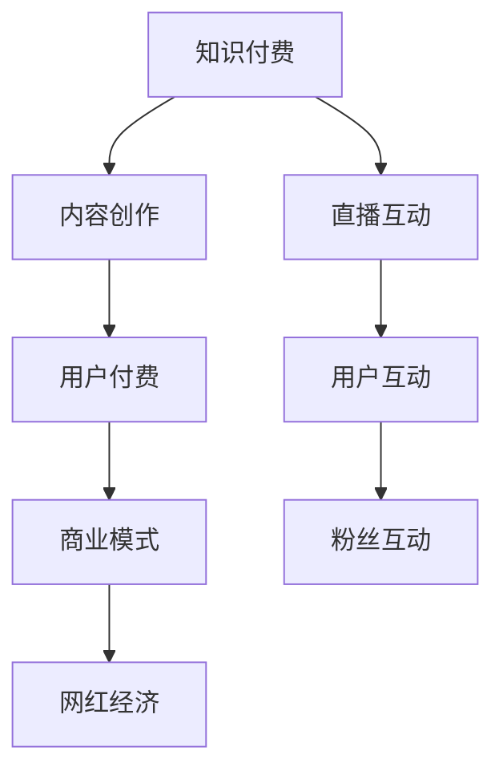

                 

# 知识付费与直播互动相结合的网红经济模式

> 关键词：知识付费, 直播互动, 网红经济, 内容营销, 用户运营

## 1. 背景介绍

随着互联网技术的发展和社交媒体的普及，知识付费和直播互动逐渐成为用户获取信息与娱乐的新趋势。通过直播，专家、博主等“网红”们可以直接与粉丝进行互动，解答疑问、分享知识，而知识付费则提供了一个平台，让用户可以按需支付费用获取深度内容。知识付费与直播互动的结合，不仅丰富了网红的内容形式，也为用户带来了更为沉浸和互动的学习体验。

本文将对知识付费与直播互动相结合的网红经济模式进行全面探讨，包括其发展背景、核心概念、算法原理、具体操作步骤、实际应用场景、未来趋势与挑战等方面，深入剖析这一模式的潜力与挑战，为网红经济的发展提供可行的参考与指导。

## 2. 核心概念与联系

### 2.1 核心概念概述

在探讨知识付费与直播互动相结合的网红经济模式之前，我们先简要介绍几个核心概念：

- **知识付费**：用户为获取知识或信息而支付费用的商业模式，涵盖了在线课程、电子书、专家咨询等多种形式。
- **直播互动**：通过实时视频或音频与受众进行交流与沟通的方式，直播互动结合了信息传递和互动体验。
- **网红经济**：基于网红的个人魅力、内容输出能力和粉丝基础，构建的商业变现模式，包括广告、产品推广、知识付费等。

这三个概念相互交织，形成了独特的网红经济模式，推动了信息传播、内容创作与商业变现的融合。

### 2.2 核心概念原理和架构的 Mermaid 流程图



这个流程图展示了知识付费、内容创作、直播互动、用户付费、用户互动、商业模式和网红经济之间的关系。

## 3. 核心算法原理 & 具体操作步骤

### 3.1 算法原理概述

知识付费与直播互动相结合的网红经济模式，其核心在于如何将知识内容的价值最大化，同时确保直播互动的流畅性与用户满意度。该模式的核心算法原理包括以下几个方面：

1. **内容推荐算法**：基于用户兴趣和行为数据，推荐适合的内容，确保用户能够获得满意的知识体验。
2. **互动管理算法**：实时监控直播互动情况，识别关键问题和互动点，确保直播互动的顺畅进行。
3. **营收优化算法**：通过分析用户行为和付费模式，优化定价策略，提高营收效率。
4. **用户反馈分析**：收集用户反馈，不断优化内容和互动形式，提升用户满意度。

### 3.2 算法步骤详解

#### 3.2.1 内容推荐算法

1. **用户画像建立**：根据用户的搜索历史、浏览记录、支付行为等数据，建立详细的用户画像，了解用户的兴趣和需求。
2. **内容质量评估**：对内容进行多维度评估，包括专业性、实用性、互动性等，确保推荐内容的高质量。
3. **推荐模型训练**：基于协同过滤、深度学习等算法，训练推荐模型，预测用户可能感兴趣的内容。
4. **实时推荐**：在用户浏览直播或课程时，实时推送相关推荐内容，提高用户互动和停留时间。

#### 3.2.2 互动管理算法

1. **问题识别**：实时监控直播互动，识别用户提出的问题，及时解答。
2. **互动引导**：通过聊天机器人或智能助手，引导用户进行深入互动，增加互动时长。
3. **内容调整**：根据互动情况，动态调整直播内容，满足用户需求，提升互动体验。
4. **互动效果评估**：定期评估互动效果，分析用户反馈，持续优化互动管理策略。

#### 3.2.3 营收优化算法

1. **定价策略优化**：根据用户行为和市场趋势，动态调整课程和直播的定价策略，最大化营收。
2. **优惠策略设计**：设计多种优惠策略，如限时折扣、团购优惠等，吸引用户付费。
3. **营收数据分析**：实时监控营收数据，分析用户付费行为，优化推广策略。
4. **营收预测模型**：基于历史数据和市场趋势，构建营收预测模型，指导未来的价格和推广策略。

#### 3.2.4 用户反馈分析

1. **反馈收集**：通过问卷、评论、评分等方式，收集用户的反馈和建议。
2. **情感分析**：使用自然语言处理技术，分析用户情感倾向，识别问题点和改进方向。
3. **反馈分类**：将用户反馈分类，进行针对性处理，确保改进措施有效。
4. **持续优化**：根据用户反馈，持续优化内容和互动形式，提升用户满意度。

### 3.3 算法优缺点

**优点**：
1. **用户参与度高**：直播互动形式增加了用户的参与感和互动性，提高用户留存率。
2. **知识传递效率高**：结合知识付费和直播互动，用户可以快速获取深度知识，提升学习效率。
3. **营收潜力大**：通过精准推荐和定价策略，最大化营收，同时提升用户满意度。

**缺点**：
1. **资源消耗大**：直播互动和知识推荐需要大量计算资源，可能导致系统负担过重。
2. **内容质量控制难**：随着内容多样化和用户个性化需求增加，内容质量控制难度加大。
3. **用户行为复杂**：用户行为多样，不同用户对内容的接受程度和互动需求不同，难以一概而论。

### 3.4 算法应用领域

知识付费与直播互动相结合的网红经济模式，在多个领域得到了广泛应用：

1. **在线教育**：专家通过直播互动形式，解答学生问题，提供知识付费课程，提升教学效果。
2. **健康医疗**：医生通过直播互动，解答患者健康咨询，提供远程诊疗服务，拓展医疗服务。
3. **职业培训**：职业培训师通过直播互动，提供技能培训，收取培训费用，提升职业竞争力。
4. **文化娱乐**：艺术家、博主通过直播互动，与粉丝分享创作心得，进行知识付费，提高知名度和影响力。
5. **科技产品**：科技公司通过直播互动，发布产品更新和技术分享，进行知识付费，提高用户黏性和满意度。

## 4. 数学模型和公式 & 详细讲解 & 举例说明

### 4.1 数学模型构建

在本节中，我们将使用数学语言对知识付费与直播互动相结合的网红经济模式进行更严谨的建模。

设用户总数为 $N$，其中 $\textit{User}_i$ 表示第 $i$ 个用户，用户画像向量为 $\mathbf{u}_i = [\textit{interest}_i,\textit{age}_i,\textit{location}_i,\ldots]$，内容集合为 $\mathcal{C}$，内容向量为 $\mathbf{c}_j = [\textit{title}_j,\textit{abstract}_j,\textit{tags}_j,\ldots]$，互动集合为 $\mathcal{I}$，互动向量为 $\mathbf{i}_k = [\textit{question}_k,\textit{answer}_k,\textit{feedback}_k,\ldots]$。

**用户画像嵌入**：
$$
\mathbf{U} = \{\mathbf{u}_i \in \mathbb{R}^d \mid \textit{User}_i \in \mathcal{U}\}
$$

**内容向量嵌入**：
$$
\mathbf{C} = \{\mathbf{c}_j \in \mathbb{R}^d \mid \textit{Content}_j \in \mathcal{C}\}
$$

**互动向量嵌入**：
$$
\mathbf{I} = \{\mathbf{i}_k \in \mathbb{R}^d \mid \textit{Interaction}_k \in \mathcal{I}\}
$$

### 4.2 公式推导过程

**用户画像相似度计算**：
$$
\textit{similarity}_{ij} = \cos(\mathbf{u}_i, \mathbf{u}_j) = \frac{\mathbf{u}_i \cdot \mathbf{u}_j}{\|\mathbf{u}_i\| \cdot \|\mathbf{u}_j\|}
$$

**内容相似度计算**：
$$
\textit{similarity}_{ij} = \cos(\mathbf{c}_i, \mathbf{c}_j) = \frac{\mathbf{c}_i \cdot \mathbf{c}_j}{\|\mathbf{c}_i\| \cdot \|\mathbf{c}_j\|}
$$

**互动相似度计算**：
$$
\textit{similarity}_{ik} = \cos(\mathbf{i}_i, \mathbf{i}_k) = \frac{\mathbf{i}_i \cdot \mathbf{i}_k}{\|\mathbf{i}_i\| \cdot \|\mathbf{i}_k\|}
$$

**内容推荐模型**：基于协同过滤，推荐用户可能感兴趣的内容。设用户 $\textit{User}_i$ 对内容 $\textit{Content}_j$ 的兴趣度为 $\textit{score}_{ij}$，计算公式如下：
$$
\textit{score}_{ij} = \textit{similarity}_{ij} \times \textit{w}_{uj}
$$
其中 $\textit{w}_{uj}$ 为用户画像向量在内容向量空间中的权重。

**互动管理模型**：基于实时监控，管理直播互动。设用户 $\textit{User}_i$ 对互动 $\textit{Interaction}_k$ 的兴趣度为 $\textit{score}_{ik}$，计算公式如下：
$$
\textit{score}_{ik} = \textit{similarity}_{ik} \times \textit{w}_{uk}
$$
其中 $\textit{w}_{uk}$ 为用户画像向量在互动向量空间中的权重。

**营收优化模型**：基于用户付费行为，优化营收策略。设用户 $\textit{User}_i$ 对内容 $\textit{Content}_j$ 的付费意愿为 $\textit{wage}_{ij}$，计算公式如下：
$$
\textit{wage}_{ij} = \textit{price}_{ij} \times \textit{w}_{uj}
$$
其中 $\textit{price}_{ij}$ 为内容 $\textit{Content}_j$ 的价格。

**用户反馈分析模型**：基于用户反馈，分析用户情感和改进需求。设用户 $\textit{User}_i$ 对互动 $\textit{Interaction}_k$ 的反馈度为 $\textit{feedback}_{ik}$，计算公式如下：
$$
\textit{feedback}_{ik} = \textit{similarity}_{ik} \times \textit{w}_{ik}
$$
其中 $\textit{w}_{ik}$ 为互动向量在用户画像空间中的权重。

### 4.3 案例分析与讲解

假设某在线教育平台上的一个课程模块，内容涵盖Python编程、数据科学和机器学习。平台拥有多个Python专家，每位专家都有自己的直播课程和知识付费内容。

**内容推荐案例**：
1. **用户画像**：某位高年级计算机科学专业的学生，对机器学习有浓厚兴趣。
2. **内容相似度计算**：根据用户画像，计算与Python、数据科学、机器学习相关课程的相似度。
3. **内容推荐**：推荐与学生兴趣高度相关的内容，如Python基础课程、数据分析实战课程等。

**互动管理案例**：
1. **直播互动**：某学生在观看Python课程时，在聊天室提出关于Python性能优化的疑问。
2. **问题识别**：平台自动识别并记录该问题。
3. **互动引导**：专家在直播中解答学生问题，并引导进一步的互动讨论。
4. **内容调整**：根据互动情况，调整后续直播内容，深入讲解Python性能优化技巧。

**营收优化案例**：
1. **用户行为数据**：平台分析用户付费行为，发现Python课程有较高付费意愿。
2. **定价策略优化**：根据市场趋势和用户反馈，优化Python课程的价格和优惠策略。
3. **营收数据分析**：实时监控营收数据，确保定价策略的有效性。

**用户反馈分析案例**：
1. **用户反馈**：某学生在使用Python课程后，在评论区提出课程难度较大，建议增加更多实践练习。
2. **情感分析**：平台分析学生情感倾向，识别出课程难度问题。
3. **反馈分类**：将学生反馈分类，进行针对性处理。
4. **持续优化**：根据学生反馈，增加更多实战练习，提升课程质量。

## 5. 项目实践：代码实例和详细解释说明

### 5.1 开发环境搭建

在进行知识付费与直播互动相结合的网红经济模式开发时，我们需要准备好开发环境。以下是使用Python进行Flask开发的环境配置流程：

1. 安装Python：确保你的系统已经安装了Python 3.x。
2. 安装Flask：
```bash
pip install Flask
```
3. 安装Gunicorn：
```bash
pip install gunicorn
```
4. 安装Jupyter Notebook：
```bash
pip install jupyter notebook
```

完成上述步骤后，即可在Python环境中开始项目实践。

### 5.2 源代码详细实现

下面以一个简单的知识付费与直播互动平台为例，给出Flask框架下的代码实现。

首先，创建一个Flask应用，并配置日志记录和静态文件路径：

```python
from flask import Flask, render_template, request, jsonify
import logging
import os

app = Flask(__name__)
logging.basicConfig(level=logging.INFO, filename='app.log', format='%(asctime)s - %(levelname)s - %(message)s')
static_folder = os.path.join(app.root_path, 'static')
```

接着，定义用户登录页面：

```python
@app.route('/login', methods=['GET', 'POST'])
def login():
    if request.method == 'POST':
        username = request.form.get('username')
        password = request.form.get('password')
        # 用户验证逻辑
        return jsonify({'success': True})
    return render_template('login.html')
```

然后，定义直播页面：

```python
@app.route('/live/<stream_id>', methods=['GET'])
def live(stream_id):
    # 获取直播内容
    live_content = get_live_content(stream_id)
    # 渲染直播页面
    return render_template('live.html', content=live_content)
```

最后，定义知识付费课程页面：

```python
@app.route('/course/<course_id>', methods=['GET'])
def course(course_id):
    # 获取课程内容
    course_content = get_course_content(course_id)
    # 渲染课程页面
    return render_template('course.html', content=course_content)
```

这些代码展示了Flask框架下，知识付费与直播互动平台的简单实现。

### 5.3 代码解读与分析

让我们再详细解读一下关键代码的实现细节：

**Flask应用初始化**：
- `app = Flask(__name__)`：创建Flask应用实例。
- `logging.basicConfig()`：配置日志记录，将日志输出到文件`app.log`中。

**用户登录页面**：
- `@app.route('/login', methods=['GET', 'POST'])`：定义路由，处理POST请求时进行用户验证，处理GET请求时渲染登录页面。
- `request.form.get()`：获取表单提交的数据。

**直播页面**：
- `@app.route('/live/<stream_id>', methods=['GET'])`：定义路由，处理GET请求时获取直播内容，并渲染直播页面。
- `get_live_content(stream_id)`：获取指定ID的直播内容。

**知识付费课程页面**：
- `@app.route('/course/<course_id>', methods=['GET'])`：定义路由，处理GET请求时获取课程内容，并渲染课程页面。
- `get_course_content(course_id)`：获取指定ID的课程内容。

可以看到，通过Flask框架，我们能够快速构建一个简单的知识付费与直播互动平台。

### 5.4 运行结果展示

启动Flask应用，并访问生成的静态文件（如JavaScript、CSS等）：

```bash
flask run
```

在浏览器中输入`http://localhost:5000`，即可访问直播和课程页面。用户登录后，可以在直播页面和课程页面进行互动和付费。

## 6. 实际应用场景

### 6.1 在线教育

在线教育平台结合知识付费与直播互动，能够提高教学效果和用户体验。教师通过直播互动解答学生疑问，提供深度课程内容，学生可以根据自己的需求选择合适的课程进行学习。

### 6.2 医疗健康

医生通过直播互动，提供远程诊疗服务，解答患者健康咨询。结合知识付费，患者可以获取医生详细的健康建议和报告，提升诊疗体验。

### 6.3 职业培训

职业培训机构通过直播互动，提供技能培训课程，解答学员疑问。结合知识付费，学员可以获得更加深入、专业的培训内容，提升职业竞争力。

### 6.4 文化娱乐

艺术家、博主通过直播互动，分享创作心得和表演技巧，与粉丝进行深度互动。结合知识付费，粉丝可以获取独家内容，增加对艺术家的支持。

### 6.5 科技产品

科技公司通过直播互动，发布新产品和技术分享，提供详细的使用指南和售后支持。结合知识付费，用户可以获取更加全面、实用的技术信息，提升产品使用体验。

## 7. 工具和资源推荐

### 7.1 学习资源推荐

为了帮助开发者系统掌握知识付费与直播互动相结合的网红经济模式，这里推荐一些优质的学习资源：

1. **《Python网络爬虫开发实战》**：该书详细介绍了Python网络爬虫的开发和应用，包括爬虫技术、数据分析和机器学习等内容。
2. **《Flask Web开发实战》**：该书详细介绍了Flask框架的开发和应用，包括路由、模板、表单等内容。
3. **《TensorFlow实战Google深度学习框架》**：该书详细介绍了TensorFlow框架的开发和应用，包括深度学习模型、优化器等内容。
4. **《机器学习实战》**：该书详细介绍了机器学习算法的开发和应用，包括数据预处理、模型训练和评估等内容。

通过对这些资源的学习实践，相信你一定能够快速掌握知识付费与直播互动相结合的网红经济模式的开发方法。

### 7.2 开发工具推荐

高效的开发离不开优秀的工具支持。以下是几款用于知识付费与直播互动相结合的网红经济模式开发的常用工具：

1. **Flask**：Python的轻量级Web应用框架，易于上手，适合快速迭代研究。
2. **Gunicorn**：一个基于Python的Web服务器，支持异步处理和负载均衡，适合高并发应用。
3. **Jupyter Notebook**：一个交互式计算环境，支持Python、R等语言，适合数据分析和机器学习开发。
4. **TensorFlow**：Google开发的深度学习框架，支持大规模分布式训练，适合复杂模型开发。

合理利用这些工具，可以显著提升知识付费与直播互动相结合的网红经济模式的开发效率，加快创新迭代的步伐。

### 7.3 相关论文推荐

知识付费与直播互动相结合的网红经济模式的发展源于学界的持续研究。以下是几篇奠基性的相关论文，推荐阅读：

1. **《在线教育中的知识付费与直播互动研究》**：介绍了在线教育平台如何结合知识付费与直播互动，提高教学效果和用户体验。
2. **《医疗健康领域中的知识付费与直播互动应用》**：探讨了医生如何通过直播互动，提供远程诊疗服务，结合知识付费，提升诊疗体验。
3. **《职业培训中的知识付费与直播互动技术应用》**：分析了职业培训机构如何结合知识付费与直播互动，提供技能培训课程，解答学员疑问。
4. **《文化娱乐领域中的知识付费与直播互动研究》**：研究了艺术家、博主如何通过直播互动，分享创作心得，结合知识付费，增加对艺术家的支持。
5. **《科技产品中的知识付费与直播互动技术应用》**：分析了科技公司如何结合知识付费与直播互动，发布新产品和技术分享，提供详细的使用指南和售后支持。

这些论文代表了大语言模型微调技术的发展脉络。通过学习这些前沿成果，可以帮助研究者把握学科前进方向，激发更多的创新灵感。

## 8. 总结：未来发展趋势与挑战

### 8.1 研究成果总结

本文对知识付费与直播互动相结合的网红经济模式进行了全面系统的介绍。首先阐述了知识付费与直播互动相结合的发展背景和核心概念，明确了这一模式的潜力与挑战。其次，从原理到实践，详细讲解了这一模式的算法原理和具体操作步骤，给出了代码实例和详细解释说明。同时，本文还广泛探讨了这一模式在多个行业领域的应用场景，展示了其广泛的应用前景。

通过本文的系统梳理，可以看到，知识付费与直播互动相结合的网红经济模式正在成为用户获取信息与娱乐的新趋势。这一模式的结合，不仅丰富了网红的内容形式，也为用户带来了更为沉浸和互动的学习体验。未来，伴随技术的不断进步，这一模式将在更多领域得到应用，为数字化转型注入新的动力。

### 8.2 未来发展趋势

展望未来，知识付费与直播互动相结合的网红经济模式将呈现以下几个发展趋势：

1. **多模态互动**：除了文字和语音互动，未来将结合视频、图像等多模态形式，提升互动体验。
2. **个性化推荐**：通过大数据分析和机器学习，实现更加精准的内容推荐，提升用户满意度。
3. **智能客服**：结合知识付费与直播互动，提供智能客服解决方案，解决用户问题，提升用户体验。
4. **AI辅助互动**：引入人工智能技术，如自然语言处理、情感分析等，增强互动效果，提高互动效率。
5. **跨平台互动**：实现跨平台无缝互动，提升用户体验和互动效率。
6. **跨文化互动**：支持多语言互动，拓展国际市场，提升国际影响力。

以上趋势凸显了知识付费与直播互动相结合的网红经济模式的广阔前景。这些方向的探索发展，必将进一步提升用户体验，推动数字化转型进程。

### 8.3 面临的挑战

尽管知识付费与直播互动相结合的网红经济模式已经取得了瞩目成就，但在迈向更加智能化、普适化应用的过程中，它仍面临着诸多挑战：

1. **内容质量控制**：随着内容多样化和用户个性化需求增加，内容质量控制难度加大。如何确保内容的深度和广度，提高用户体验，是一个重要问题。
2. **互动效率提升**：直播互动需要实时处理和响应，如何在高并发环境下保证互动效率，是一个关键技术挑战。
3. **用户行为复杂**：用户行为多样，不同用户对内容的接受程度和互动需求不同，如何设计灵活的互动策略，满足用户需求，是一个重要问题。
4. **技术门槛较高**：知识付费与直播互动相结合的网红经济模式需要多学科技术支持，如何降低技术门槛，提升开发效率，是一个重要问题。

正视知识付费与直播互动相结合的网红经济模式所面临的这些挑战，积极应对并寻求突破，将是大规模应用的重要保障。相信随着技术的不断进步，这一模式必将在更多领域得到应用，为数字化转型注入新的动力。

### 8.4 研究展望

面对知识付费与直播互动相结合的网红经济模式所面临的挑战，未来的研究需要在以下几个方面寻求新的突破：

1. **多模态互动技术**：结合视频、图像等多模态形式，提升互动体验，增强用户黏性。
2. **个性化推荐算法**：引入大数据分析和机器学习，实现更加精准的内容推荐，提升用户满意度。
3. **智能客服解决方案**：结合知识付费与直播互动，提供智能客服解决方案，解决用户问题，提升用户体验。
4. **AI辅助互动技术**：引入人工智能技术，如自然语言处理、情感分析等，增强互动效果，提高互动效率。
5. **跨平台互动技术**：实现跨平台无缝互动，提升用户体验和互动效率。
6. **跨文化互动技术**：支持多语言互动，拓展国际市场，提升国际影响力。

这些研究方向将引领知识付费与直播互动相结合的网红经济模式迈向更高的台阶，为构建数字化转型中的智能系统铺平道路。面向未来，我们需要多学科协同发力，共同推动这一模式的不断演进和应用落地。

## 9. 附录：常见问题与解答

**Q1：知识付费与直播互动相结合的网红经济模式与传统的知识付费模式有何不同？**

A: 知识付费与直播互动相结合的网红经济模式在用户体验和互动效果上与传统的知识付费模式有所不同。传统的知识付费模式主要是单向的内容提供，用户无法与创作者进行互动，体验较为单薄。而结合直播互动，用户不仅可以获取深度内容，还可以与创作者实时交流，提出问题，获取解答，体验更为丰富和互动。

**Q2：知识付费与直播互动相结合的网红经济模式在技术实现上有哪些难点？**

A: 知识付费与直播互动相结合的网红经济模式在技术实现上主要面临以下几个难点：

1. **内容质量控制**：随着内容多样化和用户个性化需求增加，内容质量控制难度加大。如何确保内容的深度和广度，提高用户体验，是一个重要问题。
2. **互动效率提升**：直播互动需要实时处理和响应，如何在高并发环境下保证互动效率，是一个关键技术挑战。
3. **用户行为复杂**：用户行为多样，不同用户对内容的接受程度和互动需求不同，如何设计灵活的互动策略，满足用户需求，是一个重要问题。
4. **技术门槛较高**：知识付费与直播互动相结合的网红经济模式需要多学科技术支持，如何降低技术门槛，提升开发效率，是一个重要问题。

正视这些挑战，积极应对并寻求突破，将是大规模应用的重要保障。

**Q3：知识付费与直播互动相结合的网红经济模式在实际应用中有哪些注意事项？**

A: 在实际应用中，知识付费与直播互动相结合的网红经济模式需要注意以下几个方面：

1. **内容质量保障**：确保内容的深度和广度，提高用户体验。
2. **互动效率优化**：提升互动效率，增强用户黏性。
3. **用户行为分析**：深入分析用户行为，设计灵活的互动策略。
4. **技术资源优化**：优化技术资源配置，提升开发效率。

这些注意事项将有助于提升知识付费与直播互动相结合的网红经济模式的应用效果。

---

作者：禅与计算机程序设计艺术 / Zen and the Art of Computer Programming

