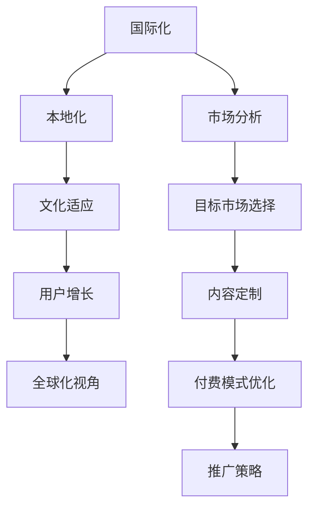

                 

# 知识付费产品的国际化策略

> 关键词：国际化、知识付费、产品策略、用户体验、市场分析、文化适应、用户增长

## 1. 背景介绍

在数字化转型的浪潮下，知识付费产品作为教育与信息获取的重要渠道，已成为众多用户日常生活的一部分。无论是学术研究、职业培训、文化娱乐，还是技能学习、生活指导，用户都能在知识付费平台上获取高质量的内容资源。然而，全球化视野下，知识付费产品如何跨越语言和文化的边界，拓展国际市场，是一个亟需解决的问题。

### 1.1 全球知识付费市场现状

当前，知识付费市场主要集中在北美、欧洲和亚太地区。北美地区以Udemy、Coursera、Khan Academy等为代表，用户对高质量在线教育内容的接受度高，付费意愿强。欧洲地区以Udacity、FutureLearn等为代表，用户对在线课程的兴趣广泛，且对教育的重视程度高。亚太地区则以中国、印度等为代表，市场规模庞大，用户对在线教育和信息服务的支付意愿日益提升。

然而，尽管市场需求旺盛，知识付费产品的国际化进程依然面临诸多挑战，如语言和文化障碍、内容质量参差不齐、付费模式单一等。如何有效应对这些挑战，实现国际化战略，是知识付费产品面临的核心问题。

### 1.2 国际化战略的重要性

知识付费产品的国际化不仅能够拓宽市场空间，提升用户基数，还可以增强品牌影响力，提高市场竞争力。国际化不仅能带来新的商业机会，还能通过不同文化背景的用户互动，促进内容的创新和改进，最终实现业务的可持续增长。

## 2. 核心概念与联系

### 2.1 核心概念概述

为更好地理解知识付费产品的国际化策略，本节将介绍几个关键概念：

- **国际化（Internationalization）**：指将产品及其服务拓展到不同国家和地区的市场，提供符合当地用户需求和文化习惯的解决方案。
- **本地化（Localization）**：指将国际化的产品和服务进一步定制化，以适应特定地区的语言、文化、法律、政策等方面的差异。
- **全球化视角（Global Mindset）**：指从全球视角出发，洞察市场趋势，制定统一的战略和标准，确保产品和服务在全球范围内的一致性和竞争力。
- **文化适应（Cultural Adaptation）**：指在保持品牌和产品核心价值的同时，尊重并融入当地文化习俗，以建立更深层次的用户连接。
- **用户增长（User Growth）**：指通过有效的市场推广和用户体验优化，吸引并留住更多用户，实现用户规模的持续增长。

这些概念之间相互联系，共同构成了知识付费产品国际化的完整框架。

### 2.2 核心概念原理和架构的 Mermaid 流程图



该流程图展示了知识付费产品国际化的关键步骤及其相互关系：

1. **国际化**：从全球视角出发，分析市场机会。
2. **本地化**：针对特定市场，进行文化适应和定制。
3. **文化适应**：尊重并融入当地文化习俗，提升用户接受度。
4. **用户增长**：通过市场推广和用户体验优化，实现用户规模增长。
5. **全球化视角**：确保产品的一致性和竞争力，实现品牌全球化。
6. **市场分析**：选择合适的目标市场，制定针对性策略。
7. **内容定制**：根据目标市场需求，定制内容形式和主题。
8. **付费模式优化**：调整付费模式，满足不同地区用户的支付习惯。
9. **推广策略**：制定有效的市场推广计划，吸引用户。

## 3. 核心算法原理 & 具体操作步骤

### 3.1 算法原理概述

知识付费产品的国际化，本质上是基于市场数据分析和用户行为研究，对产品进行定制化调整和优化，以适应不同市场和文化环境的过程。

形式化地，假设知识付费平台为 $M$，目标市场为 $T$，用户群体为 $U$，平台的内容为 $C$，付费模式为 $P$，市场推广策略为 $A$，本地化定制为 $L$。国际化过程的目标是找到最优解 $M_{\theta}$，使得：

$$
\theta = \mathop{\arg\min}_{\theta} \mathcal{L}(M_{\theta},T,U,C,P,A,L)
$$

其中 $\mathcal{L}$ 为目标市场用户对平台满意度的损失函数，可以表示为用户反馈、内容质量、付费转化率、用户留存率等指标的综合度量。

### 3.2 算法步骤详解

基于市场数据分析和用户行为研究的国际化过程，一般包括以下几个关键步骤：

**Step 1: 市场分析与目标市场选择**
- 收集和分析全球各地区的市场数据，包括用户规模、增长率、市场趋势等。
- 确定具有潜力的目标市场，如亚洲、非洲、欧洲等，以及在这些地区的主要用户群体和消费习惯。

**Step 2: 本地化定制**
- 根据目标市场的需求和习惯，对平台的内容进行定制化调整，包括课程设置、语言选择、文化适应等。
- 调整付费模式，如推出适应不同市场的订阅包、按需购买等选项。

**Step 3: 文化适应**
- 尊重并融入当地文化习俗，调整平台的设计元素、互动方式、内容主题等，以提升用户接受度。
- 开展本地化测试，收集用户反馈，持续优化产品体验。

**Step 4: 推广策略**
- 制定有效的市场推广计划，如SEO优化、社交媒体营销、内容合作等。
- 根据目标市场特点，选择合适的渠道和策略，如参加行业展会、与当地教育机构合作等。

**Step 5: 用户增长**
- 通过市场推广吸引新用户，并通过提供优质的内容和个性化推荐，提升用户满意度和留存率。
- 收集用户反馈，持续优化产品功能和用户体验，实现用户增长和转化。

### 3.3 算法优缺点

知识付费产品国际化的算法具有以下优点：
1. 全球视野：从全球视角出发，捕捉市场机会，提升品牌影响力。
2. 本地化定制：通过本地化定制，提升用户接受度和满意度。
3. 多样化推广：采用多渠道、多策略的推广方法，覆盖更广泛的用户群体。
4. 持续优化：通过用户反馈和市场分析，持续优化产品和服务，提升用户留存率。

同时，该算法也存在一定的局限性：
1. 文化和语言差异：不同地区的文化和语言差异可能影响内容的传播效果。
2. 法规和政策限制：各国法规和政策的不同，可能限制平台的运营和推广策略。
3. 资源投入大：国际化过程中需要进行大量本地化定制和市场推广，投入成本较高。
4. 数据隐私问题：不同地区对数据隐私的法规要求不同，需确保合规。

### 3.4 算法应用领域

知识付费产品的国际化算法在多个领域中具有广泛的应用：

- **教育培训**：通过本地化定制和推广策略，拓展在线教育市场，提升教育资源全球化配置效率。
- **职业技能**：为全球职业人士提供标准化和本地化的职业技能培训，助力职业发展。
- **文化娱乐**：通过内容定制和本地化推广，向全球用户提供丰富多彩的文化娱乐内容。
- **健康与生活**：提供全球健康和生活指导，提升用户生活质量。

## 4. 数学模型和公式 & 详细讲解 & 举例说明

### 4.1 数学模型构建

基于市场数据分析和用户行为研究的国际化算法，可以构建如下数学模型：

假设知识付费平台的目标市场为 $T$，用户群体为 $U$，内容为 $C$，付费模式为 $P$，推广策略为 $A$，本地化定制为 $L$。设市场规模为 $S_T$，用户数为 $U_T$，内容质量为 $Q_C$，付费转化率为 $R_P$，用户留存率为 $R_U$。则目标市场的用户满意度损失函数为：

$$
\mathcal{L} = \alpha \times S_T^{-1} \times (1 - U_T \times R_U + \beta \times Q_C^{-1} \times (1 - R_P) + \gamma \times P \times A^{-1} \times L)
$$

其中 $\alpha$ 和 $\beta$ 为权重系数，用于平衡不同指标的重要性。

### 4.2 公式推导过程

以付费转化率为例，推导过程如下：

假设知识付费平台的目标市场为 $T$，用户群体为 $U$，内容为 $C$，付费模式为 $P$。设内容质量为 $Q_C$，付费转化率为 $R_P$。则目标市场的付费转化率损失函数为：

$$
\mathcal{L}_P = \frac{1 - R_P}{R_P}
$$

根据定义，付费转化率 $R_P$ 可以表示为：

$$
R_P = \frac{U_{Paid}}{U_{Total}}
$$

其中 $U_{Paid}$ 为目标市场付费用户数，$U_{Total}$ 为目标市场总用户数。

将 $R_P$ 的表达式代入 $\mathcal{L}_P$，得：

$$
\mathcal{L}_P = \frac{U_{Total} - U_{Paid}}{U_{Total}}
$$

为了最小化损失函数 $\mathcal{L}_P$，需要通过优化付费模式、调整内容质量等手段，提升用户付费意愿，增加付费用户数 $U_{Paid}$。

### 4.3 案例分析与讲解

以Coursera平台为例，分析其国际化策略：

- **市场分析**：Coursera通过市场调研，确定了北美、欧洲和亚太地区为主要目标市场，分析了各地区的用户规模、增长率、教育需求等数据。
- **本地化定制**：Coursera针对不同市场推出本地化的课程设置，如中文课程、亚洲市场特有的课程，同时支持多语言界面和字幕。
- **文化适应**：Coursera尊重并融入各地区的文化习俗，调整课程内容和互动方式，提升用户接受度。
- **推广策略**：Coursera采用多渠道推广策略，如SEO优化、社交媒体营销、内容合作等，覆盖更广泛的用户群体。
- **用户增长**：Coursera通过提供优质的内容和个性化推荐，提升用户满意度和留存率，实现用户规模增长。

## 5. 项目实践：代码实例和详细解释说明

### 5.1 开发环境搭建

在进行国际化策略实践前，我们需要准备好开发环境。以下是使用Python进行Flask开发的环境配置流程：

1. 安装Python：从官网下载并安装Python，推荐使用3.8版本。
2. 安装Flask：
```bash
pip install Flask
```

3. 创建虚拟环境：
```bash
python3 -m venv myenv
source myenv/bin/activate
```

4. 安装Flask扩展：
```bash
pip install flask localization
```

完成上述步骤后，即可在`myenv`环境中开始国际化策略实践。

### 5.2 源代码详细实现

以下是Flask应用中实现国际化策略的示例代码：

```python
from flask import Flask, render_template, request
from flask_localization import Localization

app = Flask(__name__)
app.config['BABEL_DEFAULT_LOCALE'] = 'en'
app.config['BABEL_LOCALES'] = ['en', 'zh']
localization = Localization(app)

@app.route('/')
def index():
    return render_template('index.html', message=localization.get_text('message'))

@app.route('/set_language', methods=['POST'])
def set_language():
    language = request.form['language']
    app.config['BABEL_DEFAULT_LOCALE'] = language
    return 'Language set to {}'.format(language)

if __name__ == '__main__':
    app.run(debug=True)
```

上述代码实现了一个简单的Flask应用，支持用户设置语言。

### 5.3 代码解读与分析

让我们再详细解读一下关键代码的实现细节：

- `Localization`类：用于Flask应用国际化功能，设置默认语言和支持语言列表。
- `get_text`方法：用于获取指定语言环境下的文本，支持多语言翻译。
- `set_language`路由：处理用户设置语言的请求，更新应用配置。

在Flask应用中，通过`BABEL_DEFAULT_LOCALE`和`BABEL_LOCALES`参数，可以轻松实现多语言支持。在模板中使用`get_text`方法，可以方便地将文本内容根据用户语言环境动态显示。

当然，实际应用中还需要考虑更多因素，如数据库本地化、API接口国际化等。Flask提供的扩展模块如`Flask-RESTful`、`Flask-SQLAlchemy`等，可以进一步简化国际化开发的复杂性。

## 6. 实际应用场景

### 6.1 教育培训

知识付费产品的国际化策略在教育培训领域有着广泛的应用。Coursera、Udemy等平台通过本地化课程、多语言支持等措施，拓展了全球教育市场，为全球用户提供了高质量的在线教育资源。

- **本地化课程**：针对不同地区推出本地化的课程，如中文、西班牙语等，提升用户接受度。
- **多语言支持**：提供多语言界面和字幕，消除语言障碍。
- **全球推广**：通过社交媒体、搜索引擎优化等手段，吸引全球用户。
- **文化适应**：调整课程内容和互动方式，尊重当地文化习俗。

### 6.2 职业技能

在线职业技能培训平台如LinkedIn Learning、Udacity等，通过国际化策略，帮助全球职业人士提升职业技能，实现职业发展。

- **本地化内容**：根据不同地区职业需求，推出本地化的职业技能课程。
- **多渠道推广**：通过LinkedIn、Twitter等社交媒体渠道，覆盖全球职业人士。
- **文化适应**：调整课程内容，融入当地企业文化和习俗。
- **个性化推荐**：通过用户行为分析，提供个性化课程推荐，提升用户满意度。

### 6.3 文化娱乐

知识付费产品的国际化策略在文化娱乐领域也具有重要应用。Netflix、Spotify等平台通过本地化内容、多语言支持等措施，拓展了全球文化娱乐市场。

- **本地化内容**：根据不同地区文化偏好，推出本地化的文化娱乐内容。
- **多语言支持**：提供多语言界面和字幕，消除语言障碍。
- **全球推广**：通过社交媒体、搜索引擎优化等手段，吸引全球用户。
- **文化适应**：调整内容风格，尊重当地文化习俗。

## 7. 工具和资源推荐

### 7.1 学习资源推荐

为了帮助开发者系统掌握知识付费产品的国际化策略，这里推荐一些优质的学习资源：

1. **Flask官方文档**：Flask作为Python Web应用开发的经典框架，提供了丰富的国际化功能，官方文档详细介绍了如何使用`Flask-Localization`等扩展模块。
2. **Coursera官方博客**：Coursera作为全球领先的在线教育平台，其官方博客分享了诸多国际化策略的经验和案例，值得深入学习。
3. **Udemy课程**：Udemy提供了大量关于Web开发、多语言支持、国际化策略的课程，可以帮助开发者系统掌握相关知识。
4. **Google翻译API**：Google翻译API提供了多语言的翻译服务，可以方便地在应用中集成多语言支持。

通过这些资源的学习实践，相信你一定能够快速掌握知识付费产品国际化的精髓，并用于解决实际的国际化问题。

### 7.2 开发工具推荐

高效的开发离不开优秀的工具支持。以下是几款用于知识付费产品国际化的常用工具：

1. **Flask**：Python Web应用开发的经典框架，提供了丰富的国际化功能，支持多语言、本地化扩展。
2. **SQLAlchemy**：Python ORM库，支持多语言数据库访问，便于进行数据库本地化。
3. **PyOpenGL**：Python OpenGL库，支持多平台、多语言的图形界面开发，便于进行国际化界面的定制。
4. **Flask-RESTful**：Flask的RESTful扩展，支持多语言API接口设计，便于进行国际化API开发。
5. **Google翻译API**：提供多语言的翻译服务，便于在应用中集成多语言支持。

合理利用这些工具，可以显著提升知识付费产品国际化的开发效率，加快创新迭代的步伐。

### 7.3 相关论文推荐

知识付费产品国际化的研究源于学界的持续研究。以下是几篇奠基性的相关论文，推荐阅读：

1. **《Internationalization of Web Applications》**：探讨了Web应用的国际化实现方法，提供了丰富的案例和实践经验。
2. **《Localization Strategies for Global Web Applications》**：分析了全球Web应用的本地化策略，提出了多种适应不同市场的解决方案。
3. **《Globalization and Localization of Software: A Survey》**：综述了软件国际化与本地化的最新研究进展，提供了丰富的文献参考。
4. **《Multi-language Support in Online Education Platforms》**：分析了在线教育平台的国际化策略，探讨了多语言支持和本地化定制的方法。

这些论文代表了大语言模型微调技术的发展脉络。通过学习这些前沿成果，可以帮助研究者把握学科前进方向，激发更多的创新灵感。

## 8. 总结：未来发展趋势与挑战

### 8.1 总结

本文对知识付费产品的国际化策略进行了全面系统的介绍。首先阐述了国际化策略的研究背景和意义，明确了国际化在拓展市场空间、提升品牌影响力方面的独特价值。其次，从原理到实践，详细讲解了国际化的数学原理和关键步骤，给出了国际化任务开发的完整代码实例。同时，本文还广泛探讨了国际化策略在教育培训、职业技能、文化娱乐等多个领域的应用前景，展示了国际化的巨大潜力。此外，本文精选了国际化策略的相关资源，力求为读者提供全方位的技术指引。

通过本文的系统梳理，可以看到，知识付费产品的国际化策略正在成为Web开发的重要范式，极大地拓展了Web应用的国际市场，催生了更多的落地场景。受益于国际化策略的不断优化，知识付费产品必将在全球市场中取得更大的成功。

### 8.2 未来发展趋势

展望未来，知识付费产品的国际化策略将呈现以下几个发展趋势：

1. **个性化体验**：通过数据分析和用户行为研究，提供更个性化的用户体验，提升用户满意度。
2. **多渠道推广**：采用多渠道、多策略的市场推广方式，覆盖更广泛的用户群体。
3. **文化融合**：进一步融入当地文化习俗，提升用户接受度和忠诚度。
4. **技术创新**：利用AI、大数据等技术，优化国际化策略，提升平台竞争力。
5. **可持续发展**：通过本地化内容制作和资源配置，降低国际化成本，实现可持续发展。

这些趋势凸显了知识付费产品国际化的广阔前景。这些方向的探索发展，必将进一步提升Web应用的国际化水平，为全球用户提供更好的服务体验。

### 8.3 面临的挑战

尽管知识付费产品国际化策略已经取得了显著成果，但在迈向更加智能化、普适化应用的过程中，仍面临诸多挑战：

1. **文化和语言障碍**：不同地区的文化和语言差异，可能影响内容的传播效果。
2. **法规和政策限制**：各国法规和政策的不同，可能限制平台的运营和推广策略。
3. **数据隐私问题**：不同地区对数据隐私的法规要求不同，需确保合规。
4. **市场竞争**：全球市场竞争激烈，需持续创新和优化，保持竞争优势。
5. **技术难题**：多语言支持和本地化定制，需解决复杂的技术问题。

这些挑战需要开发者在国际化过程中综合考虑，采取科学合理的策略，确保国际化策略的成功实施。

### 8.4 研究展望

面对知识付费产品国际化所面临的种种挑战，未来的研究需要在以下几个方面寻求新的突破：

1. **多语言翻译技术**：进一步提升翻译质量，消除语言障碍，提升用户体验。
2. **本地化算法优化**：优化本地化算法，提升本地化效果，满足不同市场的用户需求。
3. **用户行为分析**：利用数据分析技术，深入了解用户行为，提供个性化服务。
4. **法规合规**：确保国际化策略的合规性，保护用户隐私和数据安全。
5. **技术创新**：探索新技术，提升平台智能化水平，优化国际化策略。

这些研究方向的探索，必将引领知识付费产品国际化策略迈向更高的台阶，为全球用户提供更加优质的服务体验。面向未来，知识付费产品国际化策略还需要与其他互联网技术进行更深入的融合，如社交媒体、大数据分析、人工智能等，多路径协同发力，共同推动知识付费产品的国际化进程。

## 9. 附录：常见问题与解答

**Q1：如何进行多语言支持？**

A: 通过使用Flask等Web框架的国际化扩展模块，如`Flask-Localization`，可以方便地在应用中集成多语言支持。具体实现步骤如下：

1. 在应用中初始化`Localization`类，设置默认语言和支持语言列表。
2. 在模板中使用`get_text`方法，根据用户语言环境动态显示文本内容。
3. 在API接口中使用`Flask-RESTful`扩展，支持多语言API接口设计。
4. 通过Google翻译API等第三方服务，进行多语言翻译和支持。

**Q2：如何选择目标市场？**

A: 通过市场调研和数据分析，选择合适的目标市场。具体步骤包括：

1. 收集全球各地区的市场数据，如用户规模、增长率、教育需求等。
2. 确定具有潜力的目标市场，如亚洲、非洲、欧洲等。
3. 分析目标市场的需求和习惯，调整内容定制和推广策略。
4. 持续监测市场变化，及时调整国际化策略。

**Q3：如何进行文化适应？**

A: 尊重并融入当地文化习俗，调整平台的设计元素、互动方式、内容主题等，以提升用户接受度。具体措施包括：

1. 进行本地化测试，收集用户反馈，持续优化产品体验。
2. 调整课程内容和互动方式，融入当地企业文化和习俗。
3. 使用本地化的视觉设计元素，如图标、颜色、排版等。
4. 提供多语言界面和字幕，消除语言障碍。

这些措施将有助于提升用户接受度，增强平台的用户粘性。

**Q4：如何进行推广策略？**

A: 制定有效的市场推广计划，如SEO优化、社交媒体营销、内容合作等。具体措施包括：

1. 通过Google Ads、Facebook Ads等广告平台，进行全球推广。
2. 利用搜索引擎优化（SEO）技术，提升网站搜索排名。
3. 通过社交媒体平台，如LinkedIn、Twitter等，进行市场推广。
4. 与当地教育机构、媒体合作，推广平台内容。

这些措施将有助于吸引全球用户，提升平台影响力。

**Q5：如何进行本地化定制？**

A: 根据目标市场的需求和习惯，对平台的内容进行定制化调整，包括课程设置、语言选择等。具体措施包括：

1. 推出本地化的课程设置，如中文、西班牙语等，提升用户接受度。
2. 提供多语言界面和字幕，消除语言障碍。
3. 调整课程内容和互动方式，融入当地企业文化和习俗。
4. 提供个性化课程推荐，提升用户满意度。

这些措施将有助于提升平台的内容质量，满足不同市场的用户需求。

---

作者：禅与计算机程序设计艺术 / Zen and the Art of Computer Programming

