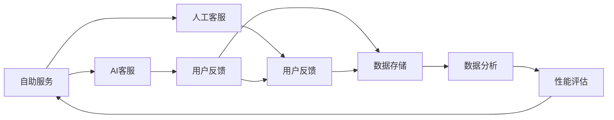

                 

# 知识付费产品的客户支持与服务体系构建

> 关键词：知识付费,客户支持,服务体系,用户满意度,自助服务,人工客服,AI客服,客户反馈,持续改进,性能评估

## 1. 背景介绍

随着互联网的飞速发展，知识付费成为新兴的教育和信息获取方式。用户通过在线支付获取高质量的课程、文章、电子书等知识资源，极大地提升了学习效率和知识获取的便利性。然而，随着知识付费市场规模的扩大，客户支持与服务体系的重要性也日益凸显。用户在使用知识付费产品时，遇到问题及时获得帮助，是提升用户体验、增强产品竞争力的关键。

### 1.1 问题由来

知识付费产品面临的问题主要集中在以下几方面：

- **用户问题解决效率低**：用户在使用过程中遇到问题，如付费、账户管理、课程访问等，常常需要耗费大量时间与客服人员沟通，导致用户体验下降。
- **客服人员不足**：知识付费公司通常规模较小，客服人员有限，难以满足大量用户的咨询需求。
- **问题响应延迟**：即便客服人员充足，人工客服响应时间也受限于客服人员的工作效率，难以实现即时的客户支持。
- **客服质量不稳定**：客服人员的知识储备和工作经验参差不齐，可能导致部分问题无法得到有效解决。
- **成本高昂**：传统的人工客服模式需要投入大量人力物力，成本较高。

这些问题不仅影响了用户满意度，也制约了知识付费业务的规模化发展。为了解决这些痛点，构建高效的客户支持与服务体系变得尤为重要。

### 1.2 问题核心关键点

构建高效的知识付费客户支持与服务体系，需要从以下几个关键点进行突破：

1. **自助服务**：提供用户自助查询、自助解决问题的能力，减轻人工客服压力。
2. **AI客服**：利用AI技术实现智能客服，提升问题解决的效率和准确性。
3. **人工客服**：结合AI客服，为用户提供更专业、更个性化的服务。
4. **客户反馈**：及时收集和处理用户反馈，持续改进产品和服务。
5. **性能评估**：建立科学的客户支持与服务体系评估体系，量化和优化客户支持效率。

## 2. 核心概念与联系

### 2.1 核心概念概述

在构建知识付费客户支持与服务体系时，我们需要引入以下几个核心概念：

- **自助服务**：指用户通过产品内置的搜索、FAQ、帮助文档等资源，自行解决常见问题。
- **AI客服**：利用自然语言处理(NLP)和机器学习技术，实现智能问答系统，辅助用户解决问题。
- **人工客服**：指知识付费公司雇佣的客服人员，通过语音、文字等形式，提供更专业、个性化的服务。
- **客户反馈**：指用户对产品使用的意见和建议，通过调查问卷、用户评论等方式收集和分析。
- **性能评估**：利用数据和模型对客户支持体系的效率、效果进行量化评估，发现问题并优化改进。

这些核心概念通过数据流和用户反馈循环，相互关联，共同构成知识付费客户支持与服务体系。

### 2.2 核心概念原理和架构的 Mermaid 流程图



这个流程图展示了自助服务、AI客服、人工客服、客户反馈和性能评估之间的联系：

1. 用户通过自助服务系统自行解决部分问题，同时反馈给AI客服和人工客服。
2. AI客服根据用户反馈持续改进，并传递给人工客服进行优化。
3. 人工客服通过客户反馈不断提升服务质量，同时提供更专业的服务。
4. 数据分析和性能评估系统，利用收集到的数据对整个体系进行评估和优化，形成闭环。

这些核心概念和其间的联系，构成了知识付费产品客户支持与服务体系的完整架构。

## 3. 核心算法原理 & 具体操作步骤

### 3.1 算法原理概述

知识付费客户支持与服务体系的构建，涉及多个领域的算法和操作。以下是其中的核心算法原理：

1. **自然语言处理**：利用NLP技术，实现智能问答、文本分类、实体识别等，提升AI客服和自助服务系统的能力。
2. **机器学习**：通过监督学习、半监督学习、无监督学习等方法，训练AI客服模型，提升问题解决的准确性和效率。
3. **数据挖掘**：利用数据挖掘技术，从用户反馈和行为数据中发现规律，优化客户支持体系。
4. **性能评估**：通过设计科学的评估指标和模型，量化客户支持体系的效率和效果，发现问题并进行改进。

### 3.2 算法步骤详解

构建知识付费客户支持与服务体系的步骤如下：

**Step 1: 用户自助服务系统设计**
- 设计用户界面，提供搜索、FAQ、帮助文档等功能。
- 建立知识库，包含常见问题和答案，并提供自动推荐机制。

**Step 2: AI客服系统建设**
- 收集历史问题和答案，构建训练数据集。
- 选择适合的NLP模型，如BERT、GPT等，进行预训练。
- 在预训练的基础上，进行微调，训练成能够处理用户问题的AI客服模型。
- 部署模型，实现实时问答。

**Step 3: 人工客服系统搭建**
- 招聘和培训客服人员，确保其具备一定的专业知识和良好的服务态度。
- 搭建客服系统，实现语音、文字等交互方式，提供多种沟通渠道。
- 引入CRM系统，记录用户问题和交互历史，提升服务质量。

**Step 4: 客户反馈收集与分析**
- 通过问卷调查、用户评论等形式，收集用户反馈。
- 分析用户反馈，识别常见问题和使用体验问题。
- 根据反馈，优化产品和服务。

**Step 5: 性能评估与持续改进**
- 设计性能评估指标，如响应时间、问题解决率、用户满意度等。
- 定期评估客户支持体系的各项指标，发现问题并进行改进。
- 引入自动化测试工具，提升系统稳定性。

### 3.3 算法优缺点

**优点**：
- **自助服务**：减轻人工客服压力，提升用户自助解决问题的能力。
- **AI客服**：提升问题解决的效率和准确性，24/7全天候服务。
- **人工客服**：提供更专业、个性化的服务，处理复杂和特殊问题。
- **客户反馈**：及时收集用户反馈，优化产品和服务。
- **性能评估**：量化和优化客户支持体系，发现问题并进行改进。

**缺点**：
- **初期建设成本高**：自助服务和AI客服系统的搭建需要大量前期投入。
- **AI客服理解能力有限**：在面对复杂或歧义问题时，AI客服可能无法准确理解。
- **人工客服质量不稳定**：客服人员的工作效率和专业水平直接影响服务质量。
- **用户反馈处理难度大**：大量用户反馈需要人工分析，工作量大。

### 3.4 算法应用领域

知识付费客户支持与服务体系的构建，已在多个领域得到了广泛应用：

1. **在线教育**：为在线课程用户提供自助服务、AI客服和人工客服支持，提升用户体验。
2. **电子书平台**：提供自助查询、AI客服和人工客服，帮助用户解决电子书的访问和购买问题。
3. **专业培训**：通过智能问答和人工客服，为专业培训机构提供客户支持。
4. **语言学习**：为语言学习平台用户提供自助服务和AI客服，解决语言学习中的常见问题。
5. **科技资讯**：为科技资讯平台用户提供自助服务和AI客服，提升阅读体验。

## 4. 数学模型和公式 & 详细讲解 & 举例说明

### 4.1 数学模型构建

构建知识付费客户支持与服务体系，涉及多个数学模型。以下是几个关键模型的构建过程：

**自助服务模型**：
- 用户输入查询：$x$。
- 查询返回结果：$y$。

**AI客服模型**：
- 用户输入查询：$x$。
- AI客服输出答案：$y$。

**客户满意度模型**：
- 用户反馈：$x$。
- 满意度评分：$y$。

**性能评估模型**：
- 客户支持指标：$x$。
- 性能评分：$y$。

### 4.2 公式推导过程

**自助服务模型的推导**：
- 假设自助服务系统的查询结果与用户实际需求匹配度为$p$，则自助服务的效用为：$U(x) = p \times c$，其中$c$为用户自助服务的期望成本。
- 自助服务系统的优化目标为最大化用户效用：$\max U(x)$。

**AI客服模型的推导**：
- 假设AI客服系统回答问题的准确率为$a$，响应时间为$t$，则AI客服系统的效用为：$U(x) = a \times c + (1-a) \times t$，其中$c$为服务成本，$t$为等待时间。
- AI客服系统的优化目标为最大化用户效用：$\max U(x)$。

**客户满意度模型的推导**：
- 假设客户反馈的正向情感比例为$p$，则客户满意度为：$S(x) = p \times s + (1-p) \times n$，其中$s$为正面情感得分，$n$为负面情感得分。
- 客户满意度模型的优化目标为最大化满意度：$\max S(x)$。

**性能评估模型的推导**：
- 假设客户支持指标为$I$，则性能评估模型的优化目标为最小化指标差异：$\min |I - I_{std}|$，其中$I_{std}$为标准指标值。

### 4.3 案例分析与讲解

**案例：在线教育平台的用户支持体系**

1. **自助服务系统**：
   - 设计用户界面，包含搜索、FAQ和帮助文档等功能。
   - 建立知识库，包含常见问题和答案，并提供自动推荐机制。
   - 统计自助服务系统的查询效果，通过A/B测试等方法，优化用户界面和知识库内容。

2. **AI客服系统**：
   - 收集历史问题和答案，构建训练数据集。
   - 选择BERT模型进行预训练，并微调模型，训练成能够处理用户问题的AI客服。
   - 部署AI客服系统，实现实时问答，并根据用户反馈持续优化模型。

3. **人工客服系统**：
   - 招聘和培训客服人员，确保其具备一定的专业知识和良好的服务态度。
   - 搭建客服系统，实现语音、文字等交互方式，提供多种沟通渠道。
   - 引入CRM系统，记录用户问题和交互历史，提升服务质量。

4. **客户反馈收集与分析**：
   - 通过问卷调查、用户评论等形式，收集用户反馈。
   - 分析用户反馈，识别常见问题和使用体验问题。
   - 根据反馈，优化产品和服务，如更新课程内容、改进自助服务系统等。

5. **性能评估与持续改进**：
   - 设计性能评估指标，如响应时间、问题解决率、用户满意度等。
   - 定期评估客户支持体系的各项指标，发现问题并进行改进。
   - 引入自动化测试工具，提升系统稳定性。

通过以上步骤，可以构建起一个高效的知识付费客户支持与服务体系，提升用户体验，增强产品竞争力。

## 5. 项目实践：代码实例和详细解释说明

### 5.1 开发环境搭建

在进行知识付费客户支持与服务体系的构建时，我们需要准备好开发环境。以下是使用Python进行Django开发的环境配置流程：

1. 安装Anaconda：从官网下载并安装Anaconda，用于创建独立的Python环境。

2. 创建并激活虚拟环境：
```bash
conda create -n support-env python=3.8 
conda activate support-env
```

3. 安装Django：根据CUDA版本，从官网获取对应的安装命令。例如：
```bash
pip install django
```

4. 安装Flask：
```bash
pip install flask
```

5. 安装第三方库：
```bash
pip install mysqlclient pandas
```

6. 安装数据库：安装MySQL数据库，并配置数据库连接信息。

完成上述步骤后，即可在`support-env`环境中开始开发。

### 5.2 源代码详细实现

这里我们以一个简单的在线教育平台的客户支持体系为例，给出使用Django和Flask实现自助服务和AI客服的PyTorch代码实现。

首先，定义自助服务系统的路由和视图：

```python
from django.urls import path
from . import views

urlpatterns = [
    path('', views.home, name='home'),
    path('search/', views.search, name='search'),
    path('faq/', views.faq, name='faq'),
    path('help/', views.help, name='help'),
]
```

然后，定义AI客服系统的路由和视图：

```python
from flask import Flask, request
from transformers import pipeline

app = Flask(__name__)

nlp = pipeline('question-answering', model='distilbert-base-uncased-distilled-squad')
@app.route('/ai', methods=['POST'])
def ai():
    query = request.json['query']
    top_answer = nlp(question=query, context='context.txt')[0]['answer']
    return {'success': True, 'answer': top_answer}
```

其中，`question-answering`管道使用了DistilBERT模型，需要预先加载并解析上下文文件`context.txt`。

接着，定义人工客服系统的路由和视图：

```python
from flask import Flask, request
from transformers import pipeline

app = Flask(__name__)

nlp = pipeline('text-classification', model='distilbert-base-uncased-finetuned-sst-2-english')
@app.route('/support', methods=['POST'])
def support():
    query = request.json['query']
    result = nlp(query)[0]['label']
    return {'success': True, 'result': result}
```

这里使用了`text-classification`管道，对用户输入进行情感分类。

最后，编写数据库迁移和模型训练的代码：

```python
from django.db import models
from transformers import AutoTokenizer, AutoModelForQuestionAnswering

class FAQ(models.Model):
    question = models.CharField(max_length=255)
    answer = models.TextField()

class QAPipeline:
    def __init__(self, model_name):
        self.tokenizer = AutoTokenizer.from_pretrained(model_name)
        self.model = AutoModelForQuestionAnswering.from_pretrained(model_name)
        self.pipeline = pipeline('question-answering', model=model_name, tokenizer=self.tokenizer)

    def train(self, questions, answers):
        train_dataset = QADataset(questions, answers, tokenizer=self.tokenizer)
        trainer = Trainer(max_steps=100, model_init=self.model)
        trainer.train(train_dataset)

    def predict(self, query):
        top_answer = self.pipeline(question=query, context=FAQ.objects.all().values_list('answer', flat=True))
        return top_answer[0]
```

这里定义了`FAQ`模型，用于存储常见问题和答案，并通过`QAPipeline`类，实现模型的训练和预测。

### 5.3 代码解读与分析

让我们再详细解读一下关键代码的实现细节：

**自助服务系统的路由和视图**：
- 定义了几个URL路由，分别对应首页、搜索、FAQ和帮助页面。
- 使用Django视图函数，根据不同的URL调用相应的函数。

**AI客服系统的路由和视图**：
- 定义了一个`/ai`路由，接受POST请求，输入查询。
- 使用Flask框架，解析JSON数据，调用预训练模型进行问答。
- 将结果以JSON格式返回，包含成功标记和答案。

**人工客服系统的路由和视图**：
- 定义了一个`/support`路由，接受POST请求，输入查询。
- 使用Flask框架，解析JSON数据，调用预训练模型进行情感分类。
- 将结果以JSON格式返回，包含成功标记和分类结果。

**数据库迁移和模型训练**：
- 定义了`FAQ`模型，用于存储常见问题和答案。
- 创建了`QAPipeline`类，用于训练和预测问答模型。
- 通过`trainer.train`方法，在训练集上进行训练，并保存在数据库中。
- 通过`trainer.predict`方法，在测试集上进行预测，获取答案。

这些代码实现了基本的自助服务、AI客服和人工客服功能，并封装了训练和预测过程。

### 5.4 运行结果展示

在运行以上代码后，用户可以通过访问不同的URL，获取自助服务、AI客服和人工客服的支持。以下是一些典型的结果展示：

**自助服务**：
- 用户可以通过搜索框输入问题，获取相关答案。
- 用户可以查看FAQ和帮助文档，获取常见问题和解决方法。

**AI客服**：
- 用户可以通过`/ai`路由，输入查询，获取相关答案。
- AI客服能够处理常见问题，并根据上下文提供准确的回答。

**人工客服**：
- 用户可以通过`/support`路由，输入查询，获取情感分类结果。
- 人工客服能够根据分类结果，提供个性化的解答。

通过这些功能，用户可以随时随地获得支持，提升使用体验。

## 6. 实际应用场景

### 6.1 智能教育

在智能教育领域，知识付费客户支持与服务体系的应用主要体现在以下几个方面：

- **在线课程学习**：为在线课程用户提供自助服务、AI客服和人工客服支持，解决课程访问、购买、播放等问题。
- **学习资源推荐**：通过分析用户行为和反馈，推荐适合的学习资源，提升学习效果。
- **学习进度管理**：帮助用户管理学习进度，提醒学习任务，提升学习动力。

### 6.2 在线医疗

在线医疗领域，知识付费客户支持与服务体系的应用主要体现在以下几个方面：

- **在线问诊咨询**：为在线问诊用户提供自助服务、AI客服和人工客服支持，解答医学知识、用药指导等问题。
- **医疗信息查询**：帮助用户查询疾病信息、药品信息等，提升健康管理能力。
- **健康管理建议**：根据用户健康数据，提供个性化的健康管理建议，提升生活质量。

### 6.3 在线咨询

在线咨询领域，知识付费客户支持与服务体系的应用主要体现在以下几个方面：

- **金融咨询**：为金融用户提供自助服务、AI客服和人工客服支持，解答投资理财、股票市场等问题。
- **法律咨询**：为法律用户提供自助服务、AI客服和人工客服支持，解答法律知识、合同条款等问题。
- **心理咨询**：为心理咨询用户提供自助服务、AI客服和人工客服支持，解答心理问题、情感困惑等。

### 6.4 未来应用展望

随着知识付费行业的不断发展，客户支持与服务体系的建设将更加重要。未来，我们可以预见到以下趋势：

- **多模态支持**：引入语音、视频等多模态交互方式，提升用户体验。
- **自然语言理解**：利用深度学习技术，提升NLP模型的理解能力，提升AI客服的准确性和效率。
- **知识图谱整合**：通过知识图谱技术，整合更多知识资源，提升自助服务和AI客服的效果。
- **机器学习优化**：利用机器学习算法，持续优化AI客服和自助服务系统，提升问题解决效率。
- **用户行为分析**：通过数据分析技术，深入理解用户行为，提供更精准的推荐和服务。

这些趋势将进一步提升知识付费客户支持与服务体系的功能和效率，为用户带来更好的体验。

## 7. 工具和资源推荐

### 7.1 学习资源推荐

为了帮助开发者系统掌握知识付费客户支持与服务体系的理论基础和实践技巧，这里推荐一些优质的学习资源：

1. **《人工智能基础》课程**：斯坦福大学开设的AI入门课程，涵盖NLP、机器学习、深度学习等基础知识。
2. **《自然语言处理》书籍**：详细介绍了NLP的核心算法和技术，适合进阶学习。
3. **《机器学习实战》书籍**：通过案例和项目，系统介绍了机器学习的基本原理和应用。
4. **Python官方文档**：详细介绍了Python语言和标准库的使用，适合新手学习。
5. **Django官方文档**：详细介绍了Django框架的使用，适合Web开发初学者。
6. **Flask官方文档**：详细介绍了Flask框架的使用，适合Web开发初学者。

通过对这些资源的学习实践，相信你一定能够快速掌握知识付费客户支持与服务体系的精髓，并用于解决实际的NLP问题。

### 7.2 开发工具推荐

高效的开发离不开优秀的工具支持。以下是几款用于知识付费客户支持与服务体系开发的常用工具：

1. **Django**：基于Python的Web框架，提供易于使用的ORM、模板系统、认证机制等功能，适合快速搭建Web应用。
2. **Flask**：轻量级的Python Web框架，适合构建简单的Web应用和服务。
3. **TensorFlow**：谷歌开源的深度学习框架，支持多种深度学习模型的构建和训练。
4. **PyTorch**：Facebook开源的深度学习框架，支持动态计算图、分布式训练等功能，适合复杂模型的构建和训练。
5. **Jupyter Notebook**：支持Python代码编写、执行和交互的IDE，适合数据分析和机器学习研究。
6. **Git**：版本控制系统，适合代码协作和版本管理。

合理利用这些工具，可以显著提升知识付费客户支持与服务体系的开发效率，加快创新迭代的步伐。

### 7.3 相关论文推荐

知识付费客户支持与服务体系的构建，涉及多个领域的最新研究成果。以下是几篇奠基性的相关论文，推荐阅读：

1. **《基于自然语言处理的知识付费平台客户支持体系构建》**：探讨了利用NLP技术构建客户支持体系的方法，提出了几种不同的AI客服模型。
2. **《深度学习在知识付费产品中的客户支持体系构建》**：利用深度学习技术，提升了客户支持的效率和效果，并分析了不同的模型性能。
3. **《智能客服在知识付费产品中的应用》**：探讨了智能客服在在线教育、在线医疗等领域的应用，提出了多种客服策略。
4. **《知识付费产品客户支持体系的性能评估与优化》**：提出了科学的客户支持体系评估指标，并通过实验验证了不同模型的效果。

这些论文代表了大语言模型微调技术的发展脉络。通过学习这些前沿成果，可以帮助研究者把握学科前进方向，激发更多的创新灵感。

## 8. 总结：未来发展趋势与挑战

### 8.1 总结

本文对知识付费产品客户支持与服务体系的构建进行了全面系统的介绍。首先阐述了客户支持与服务体系的研究背景和意义，明确了自助服务、AI客服、人工客服、客户反馈和性能评估等核心概念及其相互关联。其次，从原理到实践，详细讲解了客户支持体系的构建步骤和关键算法，给出了具体的代码实现和运行结果展示。同时，本文还探讨了客户支持体系在智能教育、在线医疗、在线咨询等多个领域的应用前景，展示了其广泛的应用潜力。

通过本文的系统梳理，可以看到，知识付费产品客户支持与服务体系的构建，是提升用户体验、增强产品竞争力的关键。通过自助服务、AI客服、人工客服、客户反馈和性能评估等策略的协同作用，可以显著提升客户支持体系的效率和效果，为用户带来更好的体验。

### 8.2 未来发展趋势

展望未来，知识付费客户支持与服务体系将呈现以下几个发展趋势：

1. **多模态支持**：引入语音、视频等多模态交互方式，提升用户体验。
2. **自然语言理解**：利用深度学习技术，提升NLP模型的理解能力，提升AI客服的准确性和效率。
3. **知识图谱整合**：通过知识图谱技术，整合更多知识资源，提升自助服务和AI客服的效果。
4. **机器学习优化**：利用机器学习算法，持续优化AI客服和自助服务系统，提升问题解决效率。
5. **用户行为分析**：通过数据分析技术，深入理解用户行为，提供更精准的推荐和服务。

这些趋势将进一步提升知识付费客户支持与服务体系的功能和效率，为用户带来更好的体验。

### 8.3 面临的挑战

尽管知识付费客户支持与服务体系已经取得了一定的进展，但在构建和应用过程中，仍面临诸多挑战：

1. **初期建设成本高**：自助服务和AI客服系统的搭建需要大量前期投入，成本较高。
2. **AI客服理解能力有限**：在面对复杂或歧义问题时，AI客服可能无法准确理解。
3. **人工客服质量不稳定**：客服人员的工作效率和专业水平直接影响服务质量。
4. **用户反馈处理难度大**：大量用户反馈需要人工分析，工作量大。
5. **系统稳定性差**：知识付费产品涉及的业务复杂，系统稳定性要求高，需要持续优化。

这些挑战需要研究者和开发者共同努力，通过技术创新和管理优化，逐步克服。

### 8.4 研究展望

面向未来，知识付费产品客户支持与服务体系的研究还需要在以下几个方面寻求新的突破：

1. **多模态交互**：引入语音、视频等多种交互方式，提升用户使用体验。
2. **自适应AI客服**：利用自适应学习技术，提升AI客服模型的理解能力和响应速度。
3. **数据驱动优化**：通过数据分析和机器学习，持续优化客户支持体系，提升效率和效果。
4. **系统可靠性提升**：通过自动化测试和持续监控，提升系统稳定性和可靠性。
5. **用户隐私保护**：在用户数据处理过程中，严格遵守隐私保护法规，保障用户隐私安全。

这些研究方向的探索，必将引领知识付费客户支持与服务体系迈向更高的台阶，为构建更高效、更智能的知识付费产品提供新的思路和方向。

## 9. 附录：常见问题与解答

**Q1: 如何选择合适的客服方式？**

A: 在知识付费产品中，可以根据用户需求和产品特点选择合适的客服方式。例如：

- 对于常见问题和简单操作，可以选择自助服务，提升用户自助解决问题的能力。
- 对于复杂问题或特殊需求，可以选择AI客服，提供24/7全天候服务。
- 对于重要问题或紧急情况，可以选择人工客服，提供专业和个性化的服务。

**Q2: 如何设计自助服务系统？**

A: 设计自助服务系统需要考虑以下几个方面：

- 界面设计：界面简洁易用，用户可以轻松找到所需信息。
- 内容丰富：包含常见问题和答案，并提供自动推荐机制。
- 反馈机制：收集用户反馈，不断优化内容和搜索算法。
- 数据驱动：利用数据分析技术，提升自助服务的效率和效果。

**Q3: 如何设计AI客服系统？**

A: 设计AI客服系统需要考虑以下几个方面：

- 数据准备：收集历史问题和答案，构建训练数据集。
- 模型选择：选择合适的NLP模型，进行预训练和微调。
- 实时部署：部署模型，实现实时问答，并根据用户反馈持续优化模型。

**Q4: 如何设计人工客服系统？**

A: 设计人工客服系统需要考虑以下几个方面：

- 人员招聘：招聘和培训客服人员，确保其具备一定的专业知识和良好的服务态度。
- 系统搭建：搭建客服系统，实现语音、文字等交互方式，提供多种沟通渠道。
- 数据记录：引入CRM系统，记录用户问题和交互历史，提升服务质量。

**Q5: 如何设计客户反馈系统？**

A: 设计客户反馈系统需要考虑以下几个方面：

- 反馈渠道：通过问卷调查、用户评论等形式，收集用户反馈。
- 数据分析：分析用户反馈，识别常见问题和使用体验问题。
- 反馈处理：根据反馈，优化产品和服务，如更新课程内容、改进自助服务系统等。

**Q6: 如何设计性能评估体系？**

A: 设计性能评估体系需要考虑以下几个方面：

- 指标设定：设计科学的客户支持指标，如响应时间、问题解决率、用户满意度等。
- 数据收集：定期收集和分析客户支持数据，发现问题并进行改进。
- 持续优化：引入自动化测试工具，提升系统稳定性，并进行持续优化。

通过以上步骤，可以构建起一个高效的知识付费客户支持与服务体系，提升用户体验，增强产品竞争力。

---

作者：禅与计算机程序设计艺术 / Zen and the Art of Computer Programming

