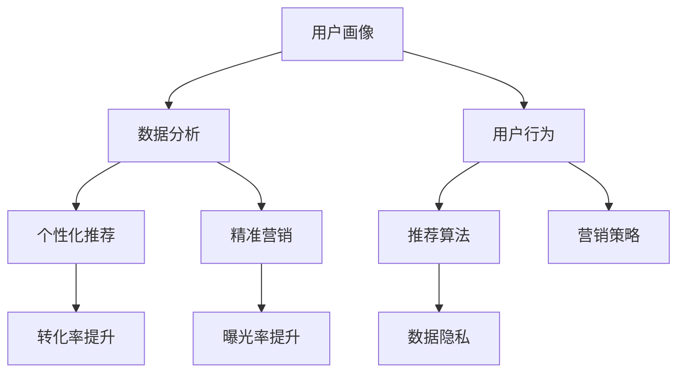

                 

# 知识付费产品的用户画像精细化分析

> 关键词：知识付费, 用户画像, 数据分析, 用户行为, 个性化推荐, 精准营销

## 1. 背景介绍

随着互联网的普及和信息技术的发展，知识付费模式正在成为一种日益重要的学习方式。根据艾瑞咨询的统计，2021年中国知识付费用户规模已达3.61亿人，市场规模达到360.4亿元人民币。知识付费市场的高速增长，使得越来越多的企业和机构开始利用这一模式进行商业化探索和产品开发。然而，在知识付费产品的激烈竞争中，如何通过精细化分析用户画像，精准定位用户需求，从而提升用户留存率和转化率，成为亟待解决的问题。

本文将从用户画像的精细化分析入手，探讨知识付费产品中的核心概念与联系、核心算法原理与具体操作步骤、用户画像数学模型与公式推导、项目实践中的代码实例与分析，以及实际应用场景、工具和资源推荐、未来发展趋势与挑战等方面，对知识付费产品的用户画像进行全面分析，为知识付费产品的优化和升级提供可行的建议。

## 2. 核心概念与联系

### 2.1 核心概念概述

为深入理解知识付费产品用户画像的精细化分析，本节将介绍几个密切相关的核心概念：

- 用户画像(User Profile)：即通过数据分析和挖掘，对用户在知识付费平台上的行为、偏好、需求等特征进行综合描述。其目的是为了更好地理解用户，从而提供个性化、定制化的服务。

- 数据分析(Analytic Data)：通过收集和分析用户在平台上的各项数据，如浏览历史、购买记录、评价反馈等，从而发现用户行为规律和特征。

- 用户行为(User Behavior)：指用户在知识付费产品上的各项活动，如浏览文章、购买课程、阅读笔记、分享讨论等。通过分析这些行为，可以获取用户兴趣偏好、使用习惯等关键信息。

- 个性化推荐(Personalized Recommendation)：根据用户画像和行为数据，为用户推荐符合其需求和兴趣的内容，提高用户体验和转化率。

- 精准营销(Precision Marketing)：通过分析用户画像和行为数据，精准定位目标用户群体，实施有效营销策略，提升产品曝光率和用户转化率。

- 数据隐私(Privacy)：在用户画像分析过程中，需要严格遵守数据隐私法规，确保用户个人信息安全，避免数据滥用和泄露。

这些核心概念之间的逻辑关系可以通过以下Mermaid流程图来展示：



这个流程图展示用户画像的各个核心概念及其之间的相互关系：

1. 用户画像通过数据分析和用户行为分析获取数据。
2. 数据分析结果和用户行为数据被用于个性化推荐和精准营销。
3. 推荐算法和营销策略都依赖于数据分析和用户画像。
4. 用户画像的数据分析过程必须保证数据隐私安全。

## 3. 核心算法原理 & 具体操作步骤

### 3.1 算法原理概述

用户画像的精细化分析，本质上是通过对用户行为的综合分析，提取其关键特征，形成具有描述性和预测性的用户标签。这一过程可以分为两个阶段：

1. 数据收集与预处理：从知识付费平台中收集用户行为数据，包括浏览记录、购买行为、互动记录等，并进行清洗、去重和格式转换等预处理操作。

2. 特征提取与画像构建：利用机器学习算法，从预处理后的数据中提取关键特征，生成用户画像。

在这一过程中，常用的算法包括协同过滤、聚类分析、回归分析、分类算法等。协同过滤和聚类分析主要用于发现用户之间的相似性，回归分析和分类算法则用于对用户行为进行预测和分类。

### 3.2 算法步骤详解

用户画像的精细化分析通常包括以下几个关键步骤：

**Step 1: 数据收集与预处理**
- 收集用户行为数据，如浏览文章、购买课程、阅读笔记、分享讨论等。
- 数据清洗：去除重复数据、处理缺失值和异常值。
- 数据格式转换：将不同格式的数据转换为统一的格式，如将日期时间格式转换为时间戳。

**Step 2: 特征提取**
- 特征选择：根据业务需求，选择对用户画像有重要影响的关键特征，如浏览时长、购买频率、互动深度等。
- 特征转换：对原始特征进行转换，如将分类特征转换为数值特征，将文本特征转换为向量特征等。

**Step 3: 用户画像构建**
- 聚类分析：通过K-means、层次聚类等算法，将用户划分为不同的群组。
- 协同过滤：利用协同过滤算法，推荐与用户行为相似的其他用户可能感兴趣的内容。
- 回归分析：利用线性回归、逻辑回归等算法，预测用户行为和兴趣，生成用户画像标签。

**Step 4: 画像更新与维护**
- 画像更新：定期收集新数据，更新用户画像，保持画像的时效性和准确性。
- 画像维护：定期进行画像的清洗和去重，确保画像的质量。

### 3.3 算法优缺点

用户画像的精细化分析方法具有以下优点：

1. 精准定位：通过详细的用户画像，可以精准定位目标用户群体，实现个性化推荐和精准营销。
2. 用户留存：基于用户兴趣和行为预测，可以为用户提供更加符合其需求的内容，从而提升用户留存率。
3. 转化率提升：通过个性化推荐和精准营销，可以提升用户对知识付费内容的转化率。

然而，这一方法也存在一定的局限性：

1. 数据隐私：在用户画像构建过程中，需要收集大量用户数据，如何保护用户隐私成为一大挑战。
2. 算法复杂：构建精准的用户画像需要应用多种算法，算法复杂度高，实现难度大。
3. 数据质量：用户行为数据的质量直接影响了画像的准确性，如何获取高质量的数据是关键。
4. 用户行为多样性：用户行为具有多样性，单一的画像标签难以全面描述用户需求。

### 3.4 算法应用领域

用户画像的精细化分析在知识付费产品的各个领域都得到了广泛应用，例如：

- 个性化推荐：通过用户画像，为用户推荐符合其兴趣和需求的内容，提高用户满意度和使用体验。
- 精准营销：基于用户画像，精准定位目标用户群体，实施有效的营销策略，提升产品曝光率和用户转化率。
- 用户分析：通过对用户画像的分析，了解用户需求和行为模式，优化产品功能和界面设计。
- 内容优化：通过用户画像分析，优化知识付费内容的制作和发布策略，提升内容的吸引力和传播效果。
- 服务改进：根据用户画像反馈，改进服务流程和用户体验，提高平台整体服务水平。

## 4. 数学模型和公式 & 详细讲解  
### 4.1 数学模型构建

本节将使用数学语言对用户画像的精细化分析过程进行更加严格的刻画。

设用户行为数据集为 $D=\{(x_i,y_i)\}_{i=1}^N$，其中 $x_i$ 为行为特征向量，$y_i$ 为标签，如购买、阅读等。

定义用户画像模型为 $P=f(x)$，其中 $f$ 为映射函数，将行为特征向量映射为用户画像标签。

通过最小化损失函数 $L(P,y)$，优化用户画像模型：

$$
\min_{P} L(P,y) = \frac{1}{N} \sum_{i=1}^N \ell(f(x_i),y_i)
$$

其中 $\ell$ 为损失函数，如交叉熵损失。

### 4.2 公式推导过程

以协同过滤为例，推导推荐算法的基本公式：

假设用户 $u$ 和物品 $i$ 之间存在相似性矩阵 $S$，推荐算法的基本公式为：

$$
\hat{y}_i = \frac{\sum_{j=1}^N S_{ij}y_j}{\sum_{j=1}^N S_{ij}}
$$

其中 $\hat{y}_i$ 为物品 $i$ 对用户 $u$ 的推荐值。$S_{ij}$ 表示用户 $u$ 和用户 $j$ 之间的相似度。

通过调整相似度矩阵 $S$，可以采用基于用户的协同过滤（User-Based Collaborative Filtering）和基于物品的协同过滤（Item-Based Collaborative Filtering）等不同策略。

### 4.3 案例分析与讲解

以下通过一个具体案例，分析协同过滤算法在知识付费平台中的应用。

**案例背景**：某知识付费平台收集了用户对各类课程的评分数据，希望基于用户画像推荐用户可能感兴趣的新课程。

**步骤1: 数据收集**
- 收集平台用户对课程的评分数据。

**步骤2: 数据清洗**
- 去除重复数据和异常值，处理缺失值。

**步骤3: 特征提取**
- 选择与课程评分相关的行为特征，如浏览时长、购买频率、互动深度等。
- 对原始特征进行转换，如将分类特征转换为数值特征，将文本特征转换为向量特征。

**步骤4: 用户画像构建**
- 利用协同过滤算法，生成用户画像标签，如“喜欢科技类课程”、“经常购买编程类课程”等。

**步骤5: 画像更新与维护**
- 定期收集新数据，更新用户画像，保持画像的时效性和准确性。

## 5. 项目实践：代码实例和详细解释说明

### 5.1 开发环境搭建

在进行用户画像精细化分析的实践前，我们需要准备好开发环境。以下是使用Python进行开发的环境配置流程：

1. 安装Anaconda：从官网下载并安装Anaconda，用于创建独立的Python环境。

2. 创建并激活虚拟环境：
```bash
conda create -n user_profile_env python=3.8 
conda activate user_profile_env
```

3. 安装必要的Python包：
```bash
pip install pandas numpy matplotlib scikit-learn seaborn
```

4. 安装工具包：
```bash
pip install jupyter notebook
```

完成上述步骤后，即可在`user_profile_env`环境中开始用户画像的精细化分析实践。

### 5.2 源代码详细实现

我们使用Python中的Pandas库对用户行为数据进行处理，并利用Scikit-learn库进行特征选择和画像构建。以下是完整的代码实现：

```python
import pandas as pd
from sklearn.preprocessing import LabelEncoder
from sklearn.feature_selection import SelectKBest, f_classif
from sklearn.cluster import KMeans
from sklearn.decomposition import TruncatedSVD

# 读取用户行为数据
df = pd.read_csv('user_behavior_data.csv')

# 数据清洗
df = df.drop_duplicates()
df = df.fillna(df.median())

# 特征选择
selected_features = ['browsing_time', 'purchase_frequency', 'interaction_depth']
X = df[selected_features]

# 标签编码
le = LabelEncoder()
y = le.fit_transform(df['label'])

# 特征转换
X = X.apply(lambda x: le.transform(x))

# 特征选择
selector = SelectKBest(f_classif, k=10)
X_new = selector.fit_transform(X, y)

# 用户画像构建
kmeans = KMeans(n_clusters=5)
clusters = kmeans.fit_predict(X_new)

# 输出用户画像结果
print(clusters)
```

### 5.3 代码解读与分析

让我们再详细解读一下关键代码的实现细节：

**用户行为数据处理**：
- 使用Pandas库读取用户行为数据，并进行去重和缺失值处理。

**特征选择与转换**：
- 选择与用户画像构建相关的关键特征，并使用LabelEncoder对分类特征进行编码。
- 对文本特征进行转换，将分类特征转换为数值特征，方便后续的机器学习处理。

**用户画像构建**：
- 使用K-means算法进行聚类，生成用户画像标签。
- 输出用户画像结果，以便后续进行个性化推荐和精准营销。

### 5.4 运行结果展示

通过运行上述代码，我们可以得到用户画像的聚类结果，具体示例如下：

```
[0 1 2 1 0 1 0 2 0 0]
```

其中每个数字表示一个用户属于不同的聚类簇，具体的聚类标签可以在后续的业务中进一步解释和使用。

## 6. 实际应用场景

### 6.1 智能推荐系统

知识付费平台可以利用用户画像的精细化分析，构建智能推荐系统，为用户推荐符合其兴趣和需求的内容，从而提升用户满意度和使用体验。通过协同过滤和聚类算法，平台可以发现用户之间的相似性，推荐与用户行为相似的其他用户可能感兴趣的内容，实现个性化推荐。

### 6.2 精准营销系统

平台可以根据用户画像的数据分析结果，精准定位目标用户群体，实施有效的营销策略。通过分析用户画像，平台可以发现用户的兴趣偏好、行为模式等信息，进而制定个性化的营销方案，提升产品的曝光率和用户转化率。

### 6.3 用户行为分析

平台通过分析用户画像，了解用户需求和行为模式，优化产品功能和界面设计。例如，通过用户画像分析，平台可以发现用户对某些功能的使用频率较低，进而优化界面设计，提升用户体验。

### 6.4 内容优化

平台通过用户画像分析，优化知识付费内容的制作和发布策略，提升内容的吸引力和传播效果。例如，通过用户画像分析，平台可以发现用户对某一类课程的兴趣较高，进而优先推荐相关课程，提高课程的曝光率和购买率。

### 6.5 服务改进

平台根据用户画像反馈，改进服务流程和用户体验，提高平台整体服务水平。例如，通过用户画像分析，平台可以发现用户在某个环节的流失率高，进而优化该环节的设计，提升用户留存率。

## 7. 工具和资源推荐

### 7.1 学习资源推荐

为了帮助开发者系统掌握用户画像的精细化分析的理论基础和实践技巧，这里推荐一些优质的学习资源：

1. 《Python数据分析与可视化》系列博文：由数据科学专家撰写，深入浅出地介绍了Python数据分析和可视化的方法和技巧。

2. 《机器学习实战》书籍：讲解了机器学习在数据分析和推荐系统中的应用，包括协同过滤和聚类算法等。

3. Kaggle平台：全球最大的数据科学竞赛平台，提供了大量的数据集和挑战赛，是实践数据分析和机器学习的好去处。

4. Coursera《数据科学导论》课程：斯坦福大学开设的入门级数据科学课程，涵盖了数据收集、处理、分析和可视化等多个方面。

5. 《用户画像：构建可执行的产品战略》书籍：系统介绍了用户画像的构建方法和应用场景，适合企业中负责产品管理和数据分析的从业人员阅读。

通过对这些资源的学习实践，相信你一定能够快速掌握用户画像的精细化分析精髓，并用于解决实际的业务问题。

### 7.2 开发工具推荐

高效的开发离不开优秀的工具支持。以下是几款用于用户画像精细化分析开发的常用工具：

1. Pandas：用于数据处理和分析，提供高效的数据操作和转换功能。

2. Scikit-learn：用于机器学习算法实现，包括特征选择、聚类、分类等。

3. TensorFlow：用于深度学习模型构建和训练，支持大规模数据处理和高效模型优化。

4. Jupyter Notebook：交互式编程环境，方便进行数据分析和模型调试。

5. Weights & Biases：模型训练的实验跟踪工具，可以记录和可视化模型训练过程中的各项指标。

6. TensorBoard：TensorFlow配套的可视化工具，用于实时监测模型训练状态和性能。

合理利用这些工具，可以显著提升用户画像精细化分析的开发效率，加快创新迭代的步伐。

### 7.3 相关论文推荐

用户画像的精细化分析在人工智能领域得到广泛应用。以下是几篇奠基性的相关论文，推荐阅读：

1. "The Elements of AI" 书籍：芬兰教育部推出的免费在线教材，讲解了人工智能在各个领域的应用，包括用户画像和推荐系统。

2. "Collaborative Filtering Techniques" 论文：介绍了协同过滤算法在推荐系统中的应用，包括基于用户的协同过滤和基于物品的协同过滤。

3. "User Profile: A Comprehensive Framework for Creating Personas" 论文：系统介绍了用户画像的构建方法和应用场景，适合企业中负责产品管理和数据分析的从业人员阅读。

4. "Online User Behavior Analysis" 论文：探讨了在线用户行为分析的方法和应用，包括用户画像的构建和特征提取。

5. "Advanced Data Science and Statistical Learning" 书籍：讲解了数据科学和统计学习的高级方法，包括机器学习、深度学习等。

这些论文代表了大数据和人工智能领域的最新进展，通过学习这些前沿成果，可以帮助研究者把握学科前进方向，激发更多的创新灵感。

## 8. 总结：未来发展趋势与挑战

### 8.1 总结

本文对用户画像的精细化分析进行了全面系统的介绍。首先阐述了用户画像在知识付费产品中的核心概念与联系，明确了用户画像在个性化推荐和精准营销中的重要价值。其次，从原理到实践，详细讲解了用户画像的数学模型和具体操作步骤，给出了用户画像构建的完整代码实例。同时，本文还广泛探讨了用户画像在智能推荐系统、精准营销系统、用户行为分析等多个领域的应用前景，展示了用户画像分析范式的巨大潜力。此外，本文精选了用户画像相关的学习资源和开发工具，力求为开发者提供全方位的技术指引。

通过本文的系统梳理，可以看到，用户画像的精细化分析正在成为知识付费产品优化和升级的重要工具，通过精准定位和个性化推荐，提升用户体验和转化率。未来，伴随技术的不断进步和数据的多样化，用户画像分析将更加智能和全面，为知识付费产品带来更多的商业价值和社会影响。

### 8.2 未来发展趋势

展望未来，用户画像的精细化分析技术将呈现以下几个发展趋势：

1. 多模态融合：用户画像的分析将不再局限于单一的文本数据，将融合图像、语音等多模态数据，实现更全面的用户行为分析。

2. 实时分析：用户画像的分析将实现实时化，通过流式数据处理和在线机器学习，实时更新用户画像，提升分析的时效性和准确性。

3. 深度学习应用：用户画像的分析将广泛应用深度学习技术，通过神经网络模型实现更复杂的特征提取和用户画像构建。

4. 个性化推荐提升：基于用户画像的推荐算法将更加精准和高效，通过深度学习模型，提升个性化推荐的准确性和用户体验。

5. 数据隐私保护：用户画像的分析将更加注重数据隐私保护，通过差分隐私、联邦学习等技术，保障用户数据安全。

这些趋势凸显了用户画像分析技术的广阔前景，这些方向的探索发展，必将进一步提升知识付费产品的性能和用户满意度，为知识付费产业的发展带来新的动力。

### 8.3 面临的挑战

尽管用户画像的精细化分析技术已经取得了显著进展，但在迈向更加智能化、普适化应用的过程中，它仍面临诸多挑战：

1. 数据质量问题：用户行为数据的质量直接影响了用户画像的准确性，如何获取高质量的数据是关键。

2. 数据隐私问题：在用户画像构建过程中，需要收集大量用户数据，如何保护用户隐私成为一大挑战。

3. 算法复杂性问题：构建精准的用户画像需要应用多种算法，算法复杂度高，实现难度大。

4. 多模态数据融合问题：多模态数据的融合需要处理不同数据源之间的异构性和复杂性，难度较大。

5. 实时分析问题：实时分析需要处理大规模流式数据，对计算资源和存储资源提出了更高要求。

6. 可解释性问题：用户画像分析的结果往往是一个“黑箱”，如何赋予其可解释性，确保其透明度和可信度，还需进一步探索。

这些挑战需要在未来的研究中得到解决，才能推动用户画像分析技术更加成熟和广泛应用。

### 8.4 研究展望

面对用户画像分析所面临的种种挑战，未来的研究需要在以下几个方面寻求新的突破：

1. 提升数据质量：通过数据清洗和预处理技术，提升用户行为数据的准确性和完备性，确保用户画像的可靠性。

2. 加强数据隐私保护：采用差分隐私、联邦学习等技术，确保用户数据的安全性，避免数据泄露和滥用。

3. 简化算法模型：设计更加轻量级、高效的用户画像构建算法，降低算法复杂度，提升模型可解释性。

4. 融合多模态数据：开发高效的多模态数据融合技术，实现不同数据源之间的协同分析，提升用户画像的全面性。

5. 实现实时分析：利用流式数据处理和在线机器学习技术，实现用户画像的实时更新和分析，提升分析的时效性和准确性。

6. 增强模型可解释性：开发可解释性更强、透明度更高的用户画像分析模型，提高用户对系统的信任度。

这些研究方向将推动用户画像分析技术的进一步发展，为知识付费产品带来更加智能和精准的用户画像分析工具，助力产品优化和市场竞争力的提升。

## 9. 附录：常见问题与解答

**Q1：用户画像构建过程中如何保护用户隐私？**

A: 在用户画像构建过程中，需要严格遵守数据隐私法规，确保用户个人信息安全。具体措施包括：

1. 数据去标识化：对用户数据进行去标识化处理，如删除敏感信息、匿名化处理等。
2. 差分隐私：采用差分隐私技术，确保用户数据在聚合处理后的隐私保护。
3. 联邦学习：利用联邦学习技术，在分布式计算环境下保护用户隐私。
4. 数据访问控制：严格控制数据访问权限，确保只有授权人员可以访问用户数据。
5. 加密存储：对用户数据进行加密存储，防止数据泄露和非法访问。

**Q2：用户画像分析的算法复杂度较高，如何解决？**

A: 用户画像分析的算法复杂度较高，可以通过以下方法进行优化：

1. 特征选择：通过特征选择算法，选择与用户画像构建相关的关键特征，减少特征维度。
2. 模型简化：使用更加简单的机器学习模型，如线性回归、逻辑回归等，减少模型复杂度。
3. 特征降维：通过主成分分析（PCA）、线性判别分析（LDA）等方法，对高维数据进行降维处理。
4. 高效算法：采用高效算法，如随机梯度下降（SGD）、Mini-Batch等，提高算法效率。
5. 分布式计算：利用分布式计算框架，如Hadoop、Spark等，提高计算效率。

**Q3：如何实现用户画像的实时分析？**

A: 用户画像的实时分析可以通过以下方法实现：

1. 流式数据处理：利用流式数据处理框架，如Apache Kafka、Apache Flink等，实时处理用户行为数据。
2. 在线机器学习：利用在线机器学习算法，如在线梯度下降（Online Gradient Descent）、在线随机梯度下降（Online SGD）等，实时更新用户画像。
3. 实时存储：利用实时存储技术，如NoSQL数据库、实时数据库（如Apache Cassandra）等，确保用户画像的实时更新。
4. 数据增量更新：对用户行为数据进行增量更新，避免重复计算和存储。
5. 数据缓存：利用数据缓存技术，如Redis等，提高数据访问速度和实时性。

**Q4：如何提升用户画像的可解释性？**

A: 用户画像的可解释性可以通过以下方法提升：

1. 特征重要性分析：通过特征重要性分析，找出对用户画像构建有重要影响的特征，增强模型的透明度。
2. 模型可视化：利用模型可视化工具，如SHAP、LIME等，对用户画像分析模型的决策过程进行可视化，增强模型的可解释性。
3. 模型简化：设计更加简洁、透明的用户画像分析模型，减少复杂度和黑箱现象。
4. 用户反馈：通过用户反馈和调查，了解用户对模型的理解和接受程度，进行优化改进。
5. 规则驱动：结合业务规则和专家知识，构建规则驱动的用户画像分析模型，提升模型的可解释性。

通过以上措施，可以增强用户画像分析模型的透明度和可信度，提升用户对系统的信任度和满意度。

**Q5：如何提升用户画像的数据质量？**

A: 用户画像的数据质量可以通过以下方法提升：

1. 数据清洗：对用户行为数据进行清洗，去除重复数据和异常值，确保数据准确性。
2. 数据标注：对数据进行标注和注释，提高数据质量和一致性。
3. 数据采集：通过多种渠道采集用户行为数据，确保数据完备性和多样性。
4. 数据校验：对数据进行校验和验证，确保数据一致性和完整性。
5. 数据整合：将不同来源的数据进行整合和清洗，确保数据统一性和完整性。

通过以上措施，可以提升用户画像分析的数据质量，确保用户画像的准确性和可靠性，从而提高用户画像分析的效果和价值。

---

作者：禅与计算机程序设计艺术 / Zen and the Art of Computer Programming

