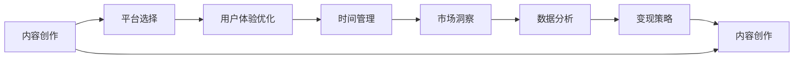

                 

# 知识付费内容创作：程序员的非代码技能培养

> 关键词：知识付费, 内容创作, 程序员, 非代码技能, 沟通能力, 时间管理, 数字营销, 自媒体运营, 影响力建设, 变现策略

## 1. 背景介绍

### 1.1 问题由来

随着互联网和数字化技术的发展，程序员的技术能力已经不再是唯一的核心竞争力。越来越多的企业和组织认识到，非代码技能（如沟通能力、团队协作、项目管理、商业意识等）在推动企业创新和成长中的重要性。而知识付费的兴起，为程序员提供了展示这些非代码技能的平台。通过制作高质量的知识付费内容，程序员不仅能够提升自身的职业素养，还能开辟新的收入渠道。

然而，知识付费领域的竞争日益激烈，内容质量、用户体验和变现能力成为区分优劣的关键。面对这一挑战，许多程序员陷入了困惑：如何在繁忙的日常开发工作之余，有效提升自身在非代码技能方面的能力，并将其转化为具有商业价值的知识付费内容？

### 1.2 问题核心关键点

知识付费内容创作的核心在于：如何将丰富的非代码技能知识和实际工作经验，转化为有价值、有吸引力、可变现的内容形式。这不仅涉及到内容策划、制作、推广的各个环节，还需要在时间管理、市场营销、平台选择等方面进行综合考虑。以下是关键的几点：

1. **内容定位与差异化**：明确自身非代码技能的优势和兴趣点，确定内容创作的细分领域，确保与已有市场中的内容产生差异，避免同质化竞争。
2. **用户体验优化**：注重内容的可读性、互动性和可操作性，提供丰富的图文、视频、音频等多种格式，提升用户体验，增加用户粘性。
3. **变现策略多样化**：探索不同的变现方式，如订阅、课程销售、付费文章、咨询等，满足不同用户的需求和支付习惯。
4. **时间管理与效率提升**：在确保高质量内容输出的同时，合理安排时间和资源，提升创作效率。
5. **市场洞察与数据分析**：关注市场趋势和用户反馈，通过数据分析不断优化内容和运营策略，提高内容的市场竞争力。

### 1.3 问题研究意义

知识付费内容创作对于程序员的成长和企业的发展具有重要意义：

1. **提升个人品牌价值**：通过高质量的知识付费内容，程序员可以展示自己的专业知识和综合素质，提升个人品牌影响力，吸引更多关注和合作机会。
2. **增强团队协作能力**：良好的非代码技能可以帮助程序员更好地与团队成员、客户和合作伙伴进行沟通和协作，推动项目的顺利进行。
3. **拓宽职业发展路径**：掌握内容创作和营销技巧，可以帮助程序员在职业转型、创业等方面获得更多可能性。
4. **驱动企业创新**：通过培养具备复合能力的程序员，企业可以加速产品创新和业务模式的升级，提高市场竞争力。
5. **促进知识共享**：知识付费平台提供了知识传播的全新渠道，帮助更多的人获得专业知识和技能，促进技术知识的普及和应用。

## 2. 核心概念与联系

### 2.1 核心概念概述

在进行知识付费内容创作的过程中，涉及多个核心概念，它们之间有着紧密的联系：

- **内容创作**：指根据目标受众和市场定位，策划、制作、发布知识内容的过程。内容可以是技术教程、行业分析、软技能提升等。
- **平台选择**：指选择适合内容发布和运营的知识付费平台，如知乎、得到、B站、微信公众号等。不同的平台具有不同的用户群体、内容形式和盈利模式。
- **用户体验**：指内容呈现和交互的形式、风格和体验，通过优化内容质量、互动性和可操作性，提高用户满意度和忠诚度。
- **时间管理**：指合理规划和安排内容创作与发布的时间，确保高效产出，同时避免过劳和质量下降。
- **市场洞察**：指通过分析市场趋势、用户反馈和竞争态势，调整内容和运营策略，提高市场适应性和竞争力。
- **数据分析**：指通过统计和分析用户数据，评估内容效果和运营表现，为后续创作提供数据支持。
- **变现策略**：指探索和实施有效的内容变现方式，如付费订阅、课程销售、广告收入、品牌合作等，实现商业价值。

这些概念共同构成了知识付费内容创作的完整框架，每一步都需要精心设计和执行，才能最终实现内容价值最大化。

### 2.2 核心概念原理和架构的 Mermaid 流程图

此图展示了知识付费内容创作过程中各关键概念之间的联系和循环。内容创作和变现策略之间形成闭环，确保内容价值被最大化，同时也为下一次内容创作提供反馈和改进。

## 3. 核心算法原理 & 具体操作步骤

### 3.1 算法原理概述

知识付费内容创作本质上是一个系统化的过程，涉及内容策划、制作、发布、推广和变现等多个环节。其核心算法原理在于：

1. **内容价值定位**：基于自身的非代码技能和行业经验，定位内容的主题、形式和受众，确保内容的独特性和实用性。
2. **用户体验优化**：采用多渠道、多媒体的形式，提供高质量、易理解、互动性强的内容，提升用户满意度和粘性。
3. **时间管理与排程**：通过合理规划和排程，确保内容创作的高效产出，避免过度疲劳和质量下降。
4. **市场数据分析**：利用数据分析工具和技术，实时监测和评估内容表现，指导内容的优化和调整。
5. **变现模式选择**：根据内容类型和受众需求，选择合适的变现方式，如订阅、课程、广告、合作等，实现内容价值的最大化。

### 3.2 算法步骤详解

以下是对知识付费内容创作具体步骤的详细介绍：

**Step 1: 确定内容定位**

1. **分析自身优势**：梳理自身的非代码技能和行业经验，确定最具优势和兴趣的领域。
2. **市场调研**：通过调查市场和用户需求，确定目标受众和潜在市场。
3. **竞争分析**：分析已有内容供应商，找出市场缺口和差异化机会。

**Step 2: 内容策划与制作**

1. **内容规划**：根据目标受众和市场调研结果，制定内容规划，确定内容主题、形式、周期和更新频率。
2. **素材准备**：收集和整理相关素材，如案例分析、行业报告、工具技巧等。
3. **内容制作**：根据内容规划和素材准备，制作文字内容、视频内容、音频内容等。
4. **内容优化**：通过测试和反馈，优化内容的格式、结构、语言和视觉元素，提升用户体验。

**Step 3: 平台选择与发布**

1. **平台评估**：根据内容类型和受众特点，选择合适的知识付费平台，如知乎、得到、B站、微信公众号等。
2. **账号准备**：创建和完善账号信息，设置个人或品牌简介，提升账号的权威性和可信度。
3. **内容发布**：将制作好的内容发布到平台上，并设置标题、摘要、关键字等元数据，提高内容的可见性和搜索排名。

**Step 4: 市场推广与用户互动**

1. **推广策略**：通过社交媒体、邮件营销、社区推广等方式，提高内容的曝光度和关注度。
2. **用户互动**：积极回应用户的评论和反馈，建立良好的互动关系，增加用户粘性和参与度。
3. **内容更新**：根据用户反馈和市场变化，及时更新和优化内容，保持内容的吸引力和竞争力。

**Step 5: 数据分析与反馈**

1. **数据收集**：通过平台提供的数据分析工具，收集和分析用户的行为数据，如阅读量、互动量、付费量等。
2. **效果评估**：评估内容的市场表现和用户反馈，识别内容和运营中的问题和机会。
3. **优化调整**：根据数据分析结果，优化内容和运营策略，提高内容的变现能力和用户体验。

**Step 6: 变现策略实施**

1. **变现渠道**：根据内容类型和受众需求，选择合适的变现方式，如订阅服务、课程销售、广告收入、品牌合作等。
2. **收益分配**：制定合理的收益分配方案，确保自身和平台的利益平衡。
3. **反馈与改进**：根据变现结果和用户反馈，持续改进内容和运营策略，提升变现效果。

### 3.3 算法优缺点

**优点**：

1. **多渠道变现**：内容创作与运营可以结合多个变现渠道，如订阅、课程、广告、合作等，拓宽收入来源。
2. **灵活高效**：通过合理规划和排程，可以在保证内容质量的前提下，高效产出和发布内容。
3. **用户体验优化**：采用多渠道、多媒体的形式，提升内容的可读性、互动性和可操作性，增加用户粘性。
4. **数据分析驱动**：通过数据分析工具和技术，实时监测和评估内容表现，指导内容的优化和调整。

**缺点**：

1. **时间管理难度大**：内容创作和运营需要投入大量时间和精力，难以在繁忙的工作中平衡。
2. **市场竞争激烈**：知识付费领域竞争激烈，需要不断创新和优化内容，才能保持竞争力和市场份额。
3. **变现模式复杂**：选择合适的变现方式需要综合考虑内容类型、受众需求、平台特点等多方面因素，有一定复杂性。
4. **内容质量要求高**：高质量的内容是吸引用户和实现变现的基础，需要投入大量时间和资源进行制作和优化。

### 3.4 算法应用领域

知识付费内容创作在多个领域都有广泛应用，主要包括：

- **技术培训与知识传播**：如编程技巧、开发工具、架构设计等，通过高质量的技术内容吸引和留存技术爱好者。
- **行业分析与趋势解读**：如IT、金融、医疗、教育等行业分析，帮助用户理解行业动态和未来趋势。
- **软技能提升与职业发展**：如时间管理、沟通技巧、团队协作、商业意识等，提升用户的职业素养和综合素质。
- **创业指导与创新分享**：如创业经验、创新案例、产品设计等，为创业者提供灵感和指导。
- **生活方式与个人成长**：如健康生活、阅读推荐、心理调适等，提升用户的生活质量和幸福感。

## 4. 数学模型和公式 & 详细讲解

### 4.1 数学模型构建

假设知识付费内容创作过程中的关键指标为 $C$，包括内容价值、用户体验、时间管理、市场洞察、数据分析和变现策略。用数学模型表示为：

$$
C = f(U, T, M, D, A, V)
$$

其中：
- $U$ 为用户体验优化，
- $T$ 为时间管理与排程，
- $M$ 为市场洞察，
- $D$ 为数据分析，
- $V$ 为变现策略。

### 4.2 公式推导过程

基于上述模型，我们可以通过以下步骤进行公式推导：

1. **用户体验优化**：
$$
U = k_1 \times \text{内容质量} + k_2 \times \text{互动性} + k_3 \times \text{可操作性}
$$
其中 $k_1$、$k_2$、$k_3$ 为权系数。

2. **时间管理与排程**：
$$
T = k_4 \times \text{内容更新频率} + k_5 \times \text{时间分配合理性} + k_6 \times \text{生产效率}
$$
其中 $k_4$、$k_5$、$k_6$ 为权系数。

3. **市场洞察**：
$$
M = k_7 \times \text{市场调研} + k_8 \times \text{竞争分析} + k_9 \times \text{用户反馈}
$$
其中 $k_7$、$k_8$、$k_9$ 为权系数。

4. **数据分析**：
$$
D = k_{10} \times \text{数据收集} + k_{11} \times \text{效果评估} + k_{12} \times \text{优化调整}
$$
其中 $k_{10}$、$k_{11}$、$k_{12}$ 为权系数。

5. **变现策略**：
$$
V = k_{13} \times \text{变现渠道} + k_{14} \times \text{收益分配} + k_{15} \times \text{反馈改进}
$$
其中 $k_{13}$、$k_{14}$、$k_{15}$ 为权系数。

综合上述公式，我们可以得到知识付费内容创作的总模型：

$$
C = k_1 \times U + k_2 \times T + k_3 \times M + k_4 \times D + k_5 \times V
$$

### 4.3 案例分析与讲解

以一个面向技术开发者的知识付费平台为例，其内容创作流程如下：

1. **内容定位**：
   - 确定主题：如“Python高级编程技巧”。
   - 分析受众：技术开发人员，特别是有经验的中级和高级开发者。
   - 市场调研：分析同类内容的竞争情况，确定差异化定位。

2. **内容策划与制作**：
   - 制定内容规划：如每月发布5篇文章，每周更新视频教程。
   - 素材准备：收集和整理Python编程技巧、实战案例、工具推荐等素材。
   - 内容制作：制作高质量的文章、视频、音频内容，确保内容的原创性和实用性。

3. **平台选择与发布**：
   - 平台评估：选择知乎、得到等知识付费平台，根据受众特点进行发布。
   - 账号准备：完善账号信息，提升账号的可信度和权威性。
   - 内容发布：设置标题、摘要、关键字等元数据，提高内容的可见性和搜索排名。

4. **市场推广与用户互动**：
   - 推广策略：通过社交媒体、邮件营销、社区推广等方式提高内容的曝光度。
   - 用户互动：积极回应用户的评论和反馈，建立良好的互动关系。
   - 内容更新：根据用户反馈和市场变化，及时更新和优化内容。

5. **数据分析与反馈**：
   - 数据收集：通过平台提供的数据分析工具，收集和分析用户的行为数据。
   - 效果评估：评估内容的市场表现和用户反馈，识别问题和机会。
   - 优化调整：根据数据分析结果，优化内容和运营策略。

6. **变现策略实施**：
   - 变现渠道：选择订阅服务、课程销售、广告收入、品牌合作等变现方式。
   - 收益分配：制定合理的收益分配方案，确保自身和平台的利益平衡。
   - 反馈与改进：根据变现结果和用户反馈，持续改进内容和运营策略。

## 5. 项目实践：代码实例和详细解释说明

### 5.1 开发环境搭建

1. **选择开发平台**：
   - 选择知乎、得到、B站、微信公众号等知识付费平台作为内容发布和运营的渠道。
   - 注册并完善账号信息，设置个人或品牌简介。

2. **安装相关工具**：
   - 安装Python、Markdown、Git等开发工具，确保内容的生产效率。
   - 安装数据分析工具，如Google Analytics、Hotjar等，进行用户行为分析。

3. **代码版本控制**：
   - 使用Git进行代码版本控制，确保内容的迭代更新和历史记录清晰。

### 5.2 源代码详细实现

以下是一个基于知乎平台的知识付费内容创作的代码实现示例：

1. **文章创作和发布**：
   - 使用Markdown格式编写文章，确保内容的可读性和易理解性。
   - 使用GitHub进行版本控制，记录每一次内容的更新和迭代。
   - 使用知乎的API将文章发布到平台上。

2. **视频教程制作和发布**：
   - 使用视频编辑软件，如Adobe Premiere Pro、Final Cut Pro等，制作高质量的视频教程。
   - 使用YouTube等视频平台进行发布，并设置视频的元数据。
   - 使用知乎的API将视频链接发布到平台上。

3. **音频内容制作和发布**：
   - 使用录音软件，如Audacity、GarageBand等，制作高质量的音频内容。
   - 使用Spotify等音频平台进行发布，并设置音频的元数据。
   - 使用知乎的API将音频链接发布到平台上。

4. **用户互动和反馈**：
   - 使用知乎的评论系统，积极回应用户的评论和反馈。
   - 使用Google Forms等工具，收集用户的反馈意见，进行数据分析。
   - 根据用户反馈，及时优化和更新内容。

### 5.3 代码解读与分析

**文章创作和发布**：
- 使用Markdown格式编写的文章，具有良好的结构化和可读性。
- 使用Git进行版本控制，确保每一次内容的更新和迭代记录清晰，便于回溯和优化。
- 使用知乎的API进行文章发布，方便快捷，易于扩展和集成。

**视频教程制作和发布**：
- 使用视频编辑软件制作的教程，确保高质量的音视频效果。
- 使用YouTube等平台进行视频发布，提高内容的曝光度和可访问性。
- 使用知乎的API进行视频链接发布，实现内容的多渠道分发和展示。

**音频内容制作和发布**：
- 使用录音软件制作的音频内容，确保高质量的音质和内容完整性。
- 使用Spotify等音频平台进行音频发布，方便用户随时随地收听。
- 使用知乎的API进行音频链接发布，实现内容的多渠道分发和展示。

**用户互动和反馈**：
- 使用知乎的评论系统，积极回应用户的评论和反馈，建立良好的互动关系。
- 使用Google Forms等工具收集用户反馈意见，进行数据分析。
- 根据用户反馈，及时优化和更新内容，确保内容的高质量和市场竞争力。

### 5.4 运行结果展示

运行上述代码后，用户可以在知乎平台上看到发布的内容，包括文章、视频、音频等。通过知乎的评论系统，用户可以与创作者进行互动，提供反馈和建议。创作者根据用户的反馈，进行内容的优化和调整，提升内容的市场表现和用户满意度。

## 6. 实际应用场景

### 6.1 智能客服系统

智能客服系统通过知识付费内容创作，可以将客服人员的专业知识和经验转化为高质量的知识内容，帮助更多用户解决问题。例如，某电商平台可以邀请客服人员制作“常见问题解答”、“用户投诉处理”等内容，提升用户的满意度和服务质量。

### 6.2 金融舆情监测

金融机构可以通过知识付费内容创作，发布市场分析、投资策略、风险预警等内容，帮助投资者理解和应对金融市场的变化。例如，某基金公司可以邀请分析师制作“市场趋势解读”、“投资案例分析”等内容，提升用户对市场的理解力和投资能力。

### 6.3 个性化推荐系统

个性化推荐系统通过知识付费内容创作，可以为用户提供更加精准和个性化的推荐。例如，某在线教育平台可以邀请专家制作“学科知识梳理”、“学习技巧分享”等内容，帮助用户提升学习效果。

### 6.4 未来应用展望

未来，知识付费内容创作将在更多领域得到应用，为传统行业带来变革性影响。

在智慧医疗领域，通过知识付费内容创作，医疗专家可以发布健康知识、疾病预防、治疗指南等内容，提升公众的健康意识和自我保健能力。

在智能教育领域，知识付费内容创作可以帮助教师和教育机构制作高质量的课程和教材，提升教学质量和学生的学习效果。

在智慧城市治理中，通过知识付费内容创作，城市管理者可以发布城市规划、公共服务、交通管理等内容，提高城市管理的自动化和智能化水平，构建更安全、高效的未来城市。

此外，在企业生产、社会治理、文娱传媒等众多领域，知识付费内容创作也将不断涌现，为传统行业带来新的技术和解决方案。相信随着知识付费平台的不断发展和创新，知识付费内容创作将成为推动人类认知智能进步的重要力量。

## 7. 工具和资源推荐

### 7.1 学习资源推荐

为了帮助开发者系统掌握知识付费内容创作的理论基础和实践技巧，这里推荐一些优质的学习资源：

1. **《知识付费与内容营销》书籍**：系统讲解知识付费的商业模式、内容创作和运营技巧，适合初学者入门。
2. **《内容创作者指南》课程**：由知名内容创作者提供实战经验和案例分析，帮助创作者提升创作技能。
3. **Coursera和Udemy上的相关课程**：提供高质量的课程内容，涵盖知识付费的各个环节，从内容策划到变现策略。
4. **知乎、得到等平台的博客和文章**：汇集了大量优秀的知识付费内容，可以作为学习的参考和灵感来源。

### 7.2 开发工具推荐

高效的开发离不开优秀的工具支持。以下是几款用于知识付费内容创作的常用工具：

1. **Markdown编辑器**：如Typora、Sublime Text等，提供高质量的文本编辑和格式支持，提高内容的可读性和可操作性。
2. **视频编辑软件**：如Adobe Premiere Pro、Final Cut Pro等，制作高质量的视频教程，提升内容的表现力和吸引力。
3. **音频编辑软件**：如Audacity、GarageBand等，制作高质量的音频内容，提升内容的可听性和实用性。
4. **项目管理工具**：如Trello、Asana等，帮助创作者进行内容策划和任务排程，提高创作效率。
5. **数据分析工具**：如Google Analytics、Hotjar等，帮助创作者进行用户行为分析和内容优化。

### 7.3 相关论文推荐

知识付费内容创作的研究涉及多个领域，以下是几篇奠基性的相关论文，推荐阅读：

1. **《知识付费：互联网时代的内容变现》**：探讨知识付费的商业模式、用户需求和市场潜力。
2. **《内容创作与用户互动：影响内容变现的关键因素》**：分析内容质量、互动性、变现策略等因素对内容变现的影响。
3. **《知识付费平台的市场竞争分析》**：研究知识付费平台的市场竞争态势和用户行为模式。
4. **《用户生成内容的质量控制与评价指标》**：提出用户生成内容的质量控制和评价指标，提升内容的可靠性和价值。

## 8. 总结：未来发展趋势与挑战

### 8.1 研究成果总结

本文对知识付费内容创作的理论基础和实践技巧进行了全面系统的介绍。通过详细的案例分析和代码实现，帮助读者掌握从内容策划到变现策略的全流程。文章还探讨了知识付费内容创作在多个领域的应用前景，提出了未来发展的趋势和方向。

### 8.2 未来发展趋势

展望未来，知识付费内容创作将呈现以下几个发展趋势：

1. **内容多样化**：知识付费内容将更加多样化，涵盖技术、商业、生活、文化等多个领域，满足用户多样化的需求。
2. **互动性增强**：通过直播、视频互动等形式，增强创作者与用户之间的互动，提升内容的吸引力和粘性。
3. **个性化定制**：根据用户的行为数据和偏好，提供个性化的内容推荐和定制化服务，提升用户体验。
4. **跨平台分发**：通过多平台分发和推广，扩大内容的覆盖面和影响力。
5. **技术与内容的融合**：结合人工智能、大数据等技术，提升内容的智能化水平和市场竞争力。

### 8.3 面临的挑战

尽管知识付费内容创作已经取得了显著进展，但在迈向成熟的路上仍面临诸多挑战：

1. **内容质量控制**：如何确保内容的高质量和真实性，避免低质量、不准确的内容对用户造成误导。
2. **用户粘性提升**：如何增强用户的参与度和粘性，避免用户流失和内容更新频率过低。
3. **变现模式的探索**：如何探索和实施新的变现模式，提高内容的商业价值。
4. **市场竞争的应对**：如何在激烈的竞争中保持优势，提升内容的市场竞争力。
5. **技术创新与结合**：如何结合新技术，提升内容的表现力和吸引力。

### 8.4 研究展望

未来的知识付费内容创作需要在以下几个方面寻求新的突破：

1. **内容创作的自动化**：探索自动生成高质量内容的技术和工具，提高创作效率。
2. **用户体验的提升**：结合人工智能、大数据等技术，提升内容的智能化水平和用户粘性。
3. **变现模式的创新**：探索新的内容变现方式，如用户订阅、社区付费、知识共享等，拓宽收入来源。
4. **技术与内容的融合**：结合人工智能、大数据等技术，提升内容的智能化水平和市场竞争力。

这些研究方向和创新思路，将推动知识付费内容创作迈向更高的台阶，为知识付费领域带来新的发展机遇。相信随着技术的发展和市场的成熟，知识付费内容创作将为更多的创作者和用户带来价值和机遇。

## 9. 附录：常见问题与解答

**Q1：知识付费内容创作需要哪些关键技能？**

A: 知识付费内容创作需要以下关键技能：
- **内容策划**：确定内容主题和受众，制定内容规划和更新频率。
- **素材准备**：收集和整理相关素材，确保内容的原创性和实用性。
- **内容制作**：制作高质量的文章、视频、音频等内容，确保内容的可读性和吸引力。
- **平台运营**：选择适合的内容发布平台，进行账号准备和内容发布。
- **市场推广**：通过社交媒体、邮件营销、社区推广等方式提高内容的曝光度和关注度。
- **用户互动**：积极回应用户的评论和反馈，建立良好的互动关系。
- **数据分析**：通过数据分析工具和技术，评估内容效果和用户反馈，进行优化调整。

**Q2：如何提高知识付费内容的变现能力？**

A: 提高知识付费内容的变现能力可以从以下几个方面入手：
- **精准定位**：根据自身优势和市场调研结果，精准定位内容的主题和受众。
- **内容质量**：确保内容的高质量和实用性，提升用户的满意度和粘性。
- **多渠道分发**：通过多个平台进行内容分发和推广，扩大覆盖面和影响力。
- **互动性增强**：通过直播、视频互动等形式，增强创作者与用户之间的互动，提升内容的吸引力和粘性。
- **个性化定制**：根据用户的行为数据和偏好，提供个性化的内容推荐和定制化服务，提升用户体验。
- **变现模式创新**：探索新的内容变现方式，如用户订阅、社区付费、知识共享等，拓宽收入来源。

**Q3：知识付费内容创作过程中需要注意哪些问题？**

A: 知识付费内容创作过程中需要注意以下几个问题：
- **时间管理**：合理规划和排程，确保内容创作的高效产出，避免过度疲劳和质量下降。
- **内容质量控制**：确保内容的高质量和真实性，避免低质量、不准确的内容对用户造成误导。
- **用户粘性提升**：增强用户的参与度和粘性，避免用户流失和内容更新频率过低。
- **变现模式的探索**：探索和实施新的变现模式，提高内容的商业价值。
- **市场竞争的应对**：如何在激烈的竞争中保持优势，提升内容的市场竞争力。

**Q4：知识付费内容创作对个人职业发展的意义是什么？**

A: 知识付费内容创作对个人职业发展有以下几个重要意义：
- **提升个人品牌价值**：通过高质量的知识付费内容，展示自己的专业知识和综合素质，提升个人品牌影响力。
- **增强团队协作能力**：良好的非代码技能可以帮助创作者更好地与团队成员、客户和合作伙伴进行沟通和协作。
- **拓宽职业转型路径**：掌握内容创作和营销技巧，可以帮助创作者在职业转型、创业等方面获得更多可能性。
- **驱动企业创新**：通过培养具备复合能力的创作者，企业可以加速产品创新和业务模式的升级，提高市场竞争力。

**Q5：知识付费内容创作对企业的发展有哪些帮助？**

A: 知识付费内容创作对企业的发展有以下几个重要帮助：
- **提升员工技能**：通过内容创作和运营，提升员工的沟通能力、项目管理、商业意识等非代码技能。
- **增强品牌影响**：高质量的知识付费内容可以提升企业的品牌价值和市场声誉。
- **推动业务创新**：通过内容创作和运营，推动企业的产品创新和业务模式升级，提高市场竞争力。
- **增强用户粘性**：通过优质的内容和服务，增强用户对企业的粘性和忠诚度，提升用户留存率和转化率。

---

作者：禅与计算机程序设计艺术 / Zen and the Art of Computer Programming

