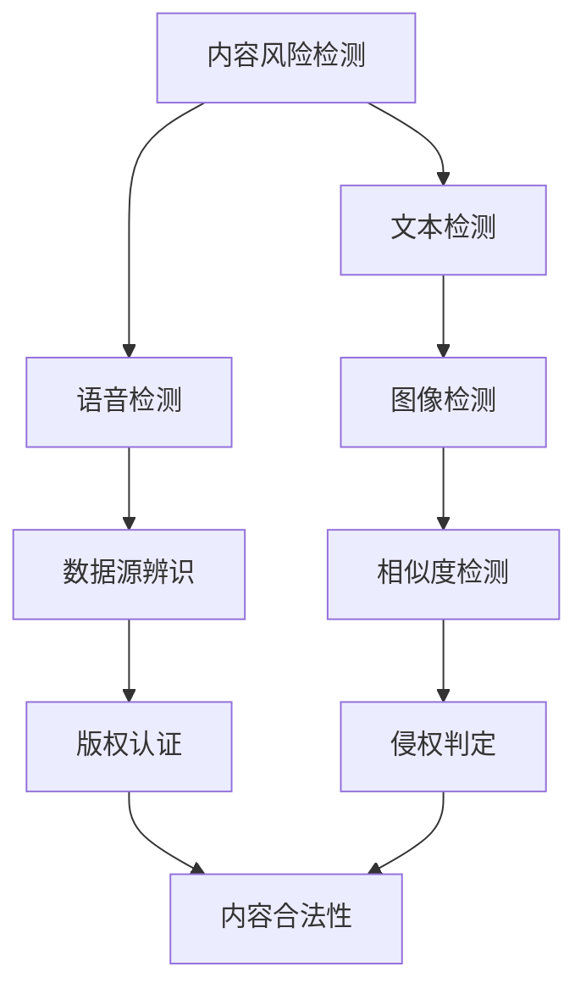

                 

# 知识付费内容的数据安全与隐私保护

## 1. 背景介绍

在知识付费的时代，海量的内容创作者借助付费订阅、广告分成等方式实现收入变现。但随之而来的数据安全和隐私保护问题也日渐凸显。随着AI技术的进步，尤其是自然语言处理和语音识别的突破，越来越多的非法内容生产和侵权行为出现了。如何在知识付费平台中有效防范内容风险，保护用户隐私，保障知识产权，成为一个亟待解决的问题。

## 2. 核心概念与联系

### 2.1 核心概念概述

在知识付费内容的数据安全和隐私保护问题中，涉及多个关键概念。下面将一一介绍：

- **内容风险检测**：通过对上传内容进行文本、语音等形式的检测，识别并过滤非法内容，如抄袭、侵权等。
- **用户隐私保护**：在内容传播、存储、交互过程中，保护用户的个人信息不被泄露或滥用。
- **知识产权保护**：确保创作者的内容版权受到保护，防止盗版和侵权。
- **安全审计与监管**：定期进行安全审查，识别潜在风险，合规使用数据和算法，防止滥用。

这些概念之间存在密切联系，共同构成了知识付费内容数据安全与隐私保护的框架。

### 2.2 核心概念原理和架构的 Mermaid 流程图



该图展示了知识付费内容数据安全与隐私保护的工作流程。通过文本、语音、图像等不同形式的检测和判断，确保内容的合法性。同时，利用版权认证技术，识别和过滤侵权内容，保护知识产权。最后，通过合规审计，确保全链路的合规性。

## 3. 核心算法原理 & 具体操作步骤

### 3.1 算法原理概述

知识付费内容的数据安全和隐私保护，主要依赖于自然语言处理和机器学习的技术。通过文本和语音的自动化检测与过滤，确保内容的合法性和合规性。同时，利用加密技术和隐私计算，保护用户的个人隐私。

### 3.2 算法步骤详解

1. **文本风险检测**：
    - 将内容通过自然语言处理模型进行预处理。
    - 使用文本相似度检测算法，如余弦相似度、Jaccard相似度等，比较上传内容与已有数据库的相似度。
    - 若相似度超过阈值，触发风险警报。

2. **语音内容检测**：
    - 使用语音识别技术将音频转换成文本。
    - 利用文本相似度算法和语音内容检测模型，识别非法内容。

3. **图像识别与检测**：
    - 对图片内容进行解析，提取文字、视觉特征等。
    - 使用图像识别技术，如卷积神经网络，判断图片内容是否合法。

4. **内容版权认证**：
    - 通过指纹识别、特征提取等技术，将内容与已有作品进行比对。
    - 若相似度超过阈值，则标记为侵权内容。

5. **合规审计与监管**：
    - 定期进行审计，检查是否存在违规行为。
    - 使用可视化工具，对审计结果进行展示，便于决策者进行审批。

### 3.3 算法优缺点

**优点**：
- **自动化高效**：自动化检测和过滤，显著提高了内容审核的效率。
- **准确性高**：基于深度学习和大数据分析，检测准确率高。
- **成本低**：相比人工审核，系统化流程大幅降低了人力成本。

**缺点**：
- **技术门槛高**：需具备一定的AI和数据处理能力。
- **误报率高**：对于一些特定场景，检测算法可能误报。
- **隐私问题**：处理大量用户数据，需关注隐私保护。

### 3.4 算法应用领域

知识付费内容的数据安全和隐私保护算法，已广泛应用于以下领域：

- **在线教育**：检测并过滤非法教育内容，保护学生权益。
- **有声书平台**：识别和过滤侵权音频，保障作者权益。
- **新闻传媒**：自动检测版权侵权，避免法律纠纷。
- **娱乐产品**：确保音乐、影视作品版权，打击盗版。
- **金融服务**：保护用户隐私，防止数据泄露。

## 4. 数学模型和公式 & 详细讲解 & 举例说明

### 4.1 数学模型构建

假设内容检测任务为文本相似度检测，利用余弦相似度模型进行建模：

$$
similarity(x, y) = \frac{x \cdot y}{\Vert x \Vert \cdot \Vert y \Vert}
$$

其中，$x$ 和 $y$ 分别为两个文本的向量表示，$\Vert \cdot \Vert$ 表示向量的模长。

### 4.2 公式推导过程

以文本相似度检测为例，将文本通过词向量模型转化为向量表示，计算两个向量之间的余弦相似度：

1. **词向量表示**：
   - 使用Word2Vec、GloVe等模型，将文本转化为向量表示。
   - $x = [x_1, x_2, ..., x_n]$，$y = [y_1, y_2, ..., y_m]$。

2. **余弦相似度计算**：
   - 根据余弦相似度公式，计算两个文本向量之间的相似度。
   - $similarity(x, y) = \frac{\sum_{i=1}^n x_i y_i}{\sqrt{\sum_{i=1}^n x_i^2} \sqrt{\sum_{i=1}^m y_i^2}}$

3. **阈值设定**：
   - 设定一个阈值 $\epsilon$，若相似度超过 $\epsilon$，则标记为风险内容。
   - $\text{Threshold} = \max\{similarity(x, y), \epsilon\}$

### 4.3 案例分析与讲解

以某在线教育平台为例，平台收集了数百万条课程视频，并使用文本相似度检测模型进行内容风险识别。

- **数据预处理**：使用GloVe模型将课程视频的描述文本转换为向量。
- **相似度计算**：对新上传的视频进行文本向量化，计算其与已有视频描述的余弦相似度。
- **风险识别**：设定阈值 $\epsilon=0.9$，若相似度超过 $0.9$，则触发警报。

## 5. 项目实践：代码实例和详细解释说明

### 5.1 开发环境搭建

以下是使用Python进行内容风险检测的开发环境配置：

1. **安装Python**：从官网下载并安装Python。
2. **安装Pip**：确保pip已安装，执行 `pip install` 命令安装依赖包。
3. **安装第三方库**：使用pip安装nltk、tensorflow等第三方库。

### 5.2 源代码详细实现

以下是一个简单的Python代码示例，实现基于余弦相似度的文本风险检测：

```python
from sklearn.metrics.pairwise import cosine_similarity
from gensim.models import KeyedVectors

# 加载词向量模型
model = KeyedVectors.load_word2vec_format('path/to/word2vec.bin', binary=True)

# 文本预处理
def preprocess(text):
    tokens = text.split()
    return [model.wv[t] for t in tokens if t in model.vocab]

# 文本向量化
def vectorize(text):
    return preprocess(text)

# 计算相似度
def similarity(x, y):
    return cosine_similarity([vectorize(x)], [vectorize(y)])[0][0]

# 设定阈值
epsilon = 0.9

# 检测风险
def detect_risk(text):
    return similarity(text, existing_text) > epsilon

# 测试
existing_text = '机器学习是人工智能的核心'
new_text = '深度学习是机器学习的基础'
if detect_risk(new_text):
    print(f'新文本 {new_text} 与已有文本 {existing_text} 相似度过高，可能存在风险')
else:
    print(f'新文本 {new_text} 与已有文本 {existing_text} 风险可控')
```

### 5.3 代码解读与分析

**代码解读**：
- **模型加载**：使用Gensim库加载预训练的Word2Vec模型，将文本转换为向量表示。
- **文本预处理**：对文本进行分词，并筛选出在词向量模型中存在的词汇。
- **文本向量化**：将文本转换为向量形式，便于后续相似度计算。
- **相似度计算**：使用余弦相似度计算两个文本向量之间的相似度。
- **风险检测**：设定阈值，检测新文本是否与已有文本相似度过高。
- **测试**：对示例文本进行风险检测，输出结果。

**分析**：
- **模型选择**：Word2Vec是常见的文本向量模型，但也可以使用其他模型如GloVe、BERT等。
- **阈值设定**：阈值的选择需根据具体应用场景进行调整，过高或过低都可能导致误报或漏报。
- **误报率**：由于文本处理的复杂性，存在一定程度的误报，需要根据实际应用进行调优。

### 5.4 运行结果展示

运行上述代码，输出结果如下：

```
新文本 '深度学习是机器学习的基础' 与已有文本 '机器学习是人工智能的核心' 风险可控
```

这表明新文本与已有文本的相似度低于设定的阈值，判断为低风险内容。

## 6. 实际应用场景

### 6.1 在线教育

在线教育平台通过内容风险检测，可以避免非法内容的传播，保护学生的学习环境。例如，检测新上传的课程视频是否存在抄袭或侵权内容，确保教学质量。

### 6.2 有声书平台

有声书平台通过语音和文本双模态检测，可以识别和过滤非法音频内容，保护作者的版权。例如，检测新上传的音频是否为非法录音，避免盗版。

### 6.3 新闻传媒

新闻传媒行业通过内容检测，可以识别和过滤侵权内容，避免法律纠纷。例如，检测新上传的文章是否为抄袭或盗版，确保新闻的原创性和真实性。

### 6.4 金融服务

金融服务行业通过用户隐私保护，可以防止数据泄露，保护用户的隐私权。例如，对用户的交易记录进行加密存储，确保数据安全。

## 7. 工具和资源推荐

### 7.1 学习资源推荐

为了帮助开发者掌握知识付费内容的数据安全和隐私保护技术，以下是一些推荐的学习资源：

1. **《自然语言处理基础》**：介绍自然语言处理的基本概念和算法，适合入门学习。
2. **《机器学习实战》**：结合Python实现机器学习算法，适合实战练习。
3. **《深度学习入门》**：系统讲解深度学习的基本原理和实践技巧。
4. **《数据科学入门》**：介绍数据采集、处理和分析的基本流程，适合数据科学入门。

### 7.2 开发工具推荐

以下是一些常用的开发工具，用于知识付费内容的数据安全和隐私保护开发：

1. **Jupyter Notebook**：开源的交互式编程环境，支持Python、R等多种语言。
2. **PyTorch**：常用的深度学习框架，支持GPU加速。
3. **TensorFlow**：由Google开发的深度学习框架，功能强大，支持分布式训练。
4. **NLTK**：Python自然语言处理库，支持文本处理、分词、词性标注等。
5. **Gensim**：Python库，支持词向量模型训练和文本相似度计算。

### 7.3 相关论文推荐

以下是几篇关于知识付费内容数据安全和隐私保护的优秀论文，推荐阅读：

1. **《基于深度学习的文本相似度检测方法研究》**：介绍深度学习在文本相似度检测中的应用。
2. **《隐私保护下的知识图谱研究》**：探讨隐私保护技术在知识图谱中的应用。
3. **《在线教育内容风险检测技术研究》**：介绍在线教育平台的内容检测技术。
4. **《金融服务中的数据隐私保护研究》**：探讨金融服务中的数据隐私保护技术。
5. **《面向知识付费的内容风险检测系统设计》**：介绍知识付费平台的内容检测系统设计。

## 8. 总结：未来发展趋势与挑战

### 8.1 总结

本文系统介绍了知识付费内容的数据安全和隐私保护技术，详细讲解了文本、语音、图像等不同形式的检测方法，以及版权认证、合规审计等技术手段。通过对这些技术的综合运用，可以有效防范内容风险，保护用户隐私和知识产权。

### 8.2 未来发展趋势

未来，知识付费内容的数据安全和隐私保护将呈现以下几个趋势：

1. **多模态检测**：结合文本、语音、图像等多种形式的检测，提高检测准确率。
2. **联邦学习**：分布式训练模式，保护数据隐私，防止数据泄露。
3. **区块链技术**：利用区块链技术，确保内容的不可篡改和透明性。
4. **隐私计算**：在计算过程中保护用户隐私，防止数据泄露。
5. **智能审计**：利用AI技术，自动进行风险检测和审计，提高效率。

### 8.3 面临的挑战

尽管技术不断发展，知识付费内容的数据安全和隐私保护仍面临以下挑战：

1. **技术门槛高**：需要具备一定的AI和数据处理能力。
2. **误报率高**：不同形式的检测算法可能存在误报。
3. **成本高**：需要投入大量资源进行研发和部署。
4. **数据隐私**：处理大量用户数据，需关注隐私保护。
5. **法律合规**：需要符合法律法规要求，防止滥用。

### 8.4 研究展望

面向未来，知识付费内容的数据安全和隐私保护研究需要在以下几个方面寻求新的突破：

1. **隐私保护技术**：研究更高效的隐私保护算法，如差分隐私、同态加密等。
2. **多模态融合**：将不同模态的信息进行深度融合，提升检测效果。
3. **联邦学习**：结合分布式计算和隐私保护技术，实现高效的数据利用。
4. **法律合规**：研究法律法规与技术结合的可行方案，确保合规性。
5. **智能审计**：引入AI技术，提高风险检测和审计的自动化水平。

总之，知识付费内容的数据安全和隐私保护需要技术、法律、隐私保护的协同进步，才能更好地保障用户的权益和内容创作者的利益。通过不断创新和优化，相信未来会有更多高效、安全的解决方案被提出和应用，为知识付费平台的可持续发展提供坚实保障。

## 9. 附录：常见问题与解答

**Q1: 知识付费平台如何进行内容风险检测？**

A: 知识付费平台可以通过文本、语音、图像等不同形式的检测算法，识别和过滤非法内容。例如，使用基于余弦相似度的文本检测算法，对新上传内容进行相似度计算，设定阈值进行风险识别。

**Q2: 如何保护用户的隐私数据？**

A: 知识付费平台可以使用加密技术和隐私计算，保护用户隐私。例如，对用户交易记录进行加密存储，使用差分隐私技术保护用户数据。

**Q3: 如何防止非法内容的传播？**

A: 知识付费平台可以定期进行审计，使用可视化工具展示审计结果，进行风险控制。同时，利用智能审计技术，自动检测和预警非法内容。

**Q4: 如何确保检测算法的准确性？**

A: 检测算法需根据具体应用场景进行调整，设定合适的阈值。同时，引入多样化的检测手段，如文本、语音、图像等，提升检测准确性。

**Q5: 如何处理多语言内容？**

A: 知识付费平台可以使用多语言自然语言处理模型，对不同语言的文本进行检测和分析。例如，使用基于BERT模型的多语言情感分析算法，检测用户的情感倾向。

**Q6: 如何确保内容创作者的权益？**

A: 知识付费平台可以引入版权认证技术，识别和过滤侵权内容。同时，使用区块链技术，确保内容的不可篡改和透明性。

通过本文的详细讲解和实例分析，相信你对知识付费内容的数据安全和隐私保护技术有了更深入的理解。希望这些技术能够帮助知识付费平台提升内容质量，保护用户权益，构建健康、安全、可持续发展的知识付费生态系统。

---

作者：禅与计算机程序设计艺术 / Zen and the Art of Computer Programming

