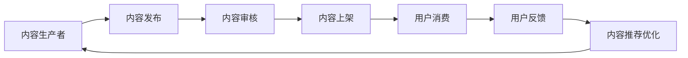

                 

# 知识付费创业中的内容生态系统构建

## 1. 背景介绍

### 1.1 问题由来
知识付费平台作为近年来互联网行业的蓬勃发展，逐渐成为一种新的商业模式和消费模式。随着人们对知识渴求的不断增加，知识付费行业正迎来爆发式的增长。然而，在快速发展的背后，我们也面临诸多挑战，如内容同质化、用户留存率低、付费意愿下降等。构建一个高效、丰富、可持续的内容生态系统，已成为知识付费平台的核心命题。

## 2. 核心概念与联系

### 2.1 核心概念概述
1. **知识付费平台(Knowledge-Paid Platform)**：指通过提供专业、高质量的付费内容，满足用户个性化、深度学习需求的在线平台。
2. **内容生态系统(Content Ecosystem)**：指知识付费平台中内容生产、推荐、消费的闭环体系，包含内容生产者、平台、用户等多个角色，形成良性的互动循环。
3. **内容推荐系统(Content Recommendation System)**：指基于用户行为、兴趣、历史消费记录，自动推荐相关内容的技术系统，提升用户粘性，增加消费转化率。
4. **内容付费模型(Content Monetization Model)**：指通过平台内用户付费获取高质量内容，实现内容价值变现的商业模式。

### 2.2 核心概念原理和架构的 Mermaid 流程图



此图展示了内容生态系统的主要流程，从内容生产到消费再到反馈，形成了闭环的推荐优化。

## 3. 核心算法原理 & 具体操作步骤

### 3.1 算法原理概述

知识付费平台的内容生态系统构建，主要依赖于内容推荐系统，通过算法优化提升用户满意度，增加内容消费和平台粘性。其中，推荐算法根据用户行为数据和内容特征，预测用户可能感兴趣的内容，并根据用户反馈进行不断调整，最终实现内容的精准推荐。

推荐算法主要分为以下几类：

1. **协同过滤(Collaborative Filtering)**：通过分析用户行为数据，找到与目标用户兴趣相似的用户群体，推荐这些用户喜欢的内容。

2. **基于内容的推荐(Content-Based Filtering)**：基于内容的特征，如关键词、分类标签等，对内容进行相似度计算，推荐相似内容。

3. **混合推荐(Mixed Recommendation)**：将协同过滤和基于内容的推荐方法结合，利用二者的优点，提升推荐效果。

4. **深度学习推荐(Deep Learning-Based Filtering)**：使用深度神经网络模型，提取高层次的用户行为特征和内容特征，提升推荐精度。

### 3.2 算法步骤详解

1. **数据收集与预处理**
    - 收集平台用户行为数据，包括浏览、点赞、评论、分享等行为。
    - 收集内容元数据，如标题、标签、摘要等。
    - 进行数据清洗和特征提取，去除噪声数据，选择有代表性的特征。

2. **构建推荐模型**
    - 使用协同过滤算法，构建用户-物品评分矩阵。
    - 使用深度学习模型，如深度神经网络、RNN等，训练推荐模型。
    - 结合多种推荐算法，构建混合推荐系统。

3. **模型训练与优化**
    - 在训练集上训练推荐模型，优化模型参数。
    - 在验证集上评估模型效果，选择最优模型。
    - 根据用户反馈，不断优化推荐模型，提升推荐效果。

4. **推荐实现**
    - 根据用户行为数据和内容特征，预测用户可能感兴趣的内容。
    - 实时返回推荐结果，并在平台展示。
    - 根据用户反馈，调整推荐策略。

### 3.3 算法优缺点
#### 优点：
1. **个性化推荐**：通过用户行为和内容特征，实现精准推荐，提升用户体验。
2. **动态优化**：根据用户反馈，实时调整推荐策略，提升推荐效果。
3. **多样化内容**：推荐系统可以覆盖各种类型的知识内容，满足不同用户的需求。

#### 缺点：
1. **数据隐私**：收集用户行为数据时，可能涉及用户隐私问题，需要采取保护措施。
2. **冷启动问题**：新用户和老用户的行为数据差异较大，冷启动问题难以解决。
3. **数据稀疏性**：用户行为数据稀疏，难以准确建模用户兴趣。

### 3.4 算法应用领域
推荐算法在知识付费平台中的应用非常广泛，具体包括：
- **课程推荐**：根据用户历史学习行为和课程标签，推荐适合课程。
- **文章推荐**：根据用户阅读历史和文章内容特征，推荐相关文章。
- **讲师推荐**：根据用户对讲师的历史互动和讲师资质，推荐优秀讲师。
- **社区讨论推荐**：根据用户讨论记录和话题标签，推荐相关话题。

## 4. 数学模型和公式 & 详细讲解 & 举例说明

### 4.1 数学模型构建

假设知识付费平台上用户为 $U$，内容为 $I$，构建用户-物品评分矩阵 $R_{ui}$ 表示用户 $u$ 对内容 $i$ 的评分，$R_{ui}=0$ 表示未评分。

协同过滤算法基于用户和内容的评分矩阵 $R$，构建用户-物品评分矩阵 $\hat{R}$，求解 $\hat{R}$ 使得 $\Vert R-\hat{R}\Vert_F$ 最小，其中 $\Vert \cdot \Vert_F$ 表示矩阵的 Frobenius 范数。

### 4.2 公式推导过程

使用奇异值分解(SVD)对用户-物品评分矩阵 $R$ 进行分解：

$$
R = UV\Sigma V^T
$$

其中 $U$ 和 $V$ 分别为用户和物品的特征矩阵，$\Sigma$ 为奇异值矩阵。

协同过滤的目标是：

$$
\min_{\hat{R}} \Vert R-\hat{R}\Vert_F
$$

其中：

$$
\hat{R} = \hat{U}\hat{V}^T
$$

设 $\hat{U}$ 和 $\hat{V}$ 分别为 $U$ 和 $V$ 的低秩近似，令 $\hat{U} = AU$，$\hat{V} = AV^T$，则：

$$
\min_{A} \Vert RAUAV^T - R\Vert_F
$$

通过求解上述最小化问题，可以得到最优的特征矩阵 $A$。

### 4.3 案例分析与讲解

以基于内容的推荐为例，假设内容 $i$ 的特征向量为 $\boldsymbol{v}_i$，用户 $u$ 的特征向量为 $\boldsymbol{u}_u$，推荐系统根据向量余弦相似度，计算用户 $u$ 对内容 $i$ 的预测评分 $r_{ui}$：

$$
r_{ui} = \boldsymbol{u}_u^T \boldsymbol{v}_i
$$

使用线性回归模型，训练内容特征和用户特征的权重 $\boldsymbol{w}$，使得预测评分与实际评分差距最小：

$$
\min_{\boldsymbol{w}} \Vert \hat{R}-\boldsymbol{w}\hat{R}\Vert_F
$$

其中 $\hat{R} = \boldsymbol{w}^T [\boldsymbol{v}_1, \boldsymbol{v}_2, ..., \boldsymbol{v}_i]^T$。

通过上述模型，可以计算用户 $u$ 对内容 $i$ 的推荐评分 $r_{ui}'$：

$$
r_{ui}' = \boldsymbol{u}_u^T \hat{R}\boldsymbol{w}
$$

## 5. 项目实践：代码实例和详细解释说明

### 5.1 开发环境搭建

1. **环境准备**
    - 安装Python 3.x
    - 安装pandas、numpy、scikit-learn等数据处理和模型训练工具
    - 安装TensorFlow或PyTorch等深度学习框架

2. **数据收集**
    - 收集平台用户行为数据，包括浏览记录、评分、评论等
    - 收集内容元数据，如课程名称、教师、标签等

3. **数据预处理**
    - 清洗数据，去除噪声和异常值
    - 进行特征工程，提取有意义的特征，如课程时长、教师资历等

### 5.2 源代码详细实现

#### 协同过滤推荐实现
```python
import numpy as np
from scipy.sparse import csr_matrix

def svd_cf(rating_matrix):
    U, S, Vt = np.linalg.svd(rating_matrix)
    return np.dot(U, np.dot(S, Vt))

def predict(rating_matrix, user_idx, item_idx):
    hat_matrix = svd_cf(rating_matrix)
    return np.dot(hat_matrix[:, user_idx], hat_matrix[item_idx, :])

rating_matrix = np.array([[0, 0, 5], [0, 4, 0], [3, 0, 0]], dtype=float)
user_idx = 1
item_idx = 2
prediction = predict(rating_matrix, user_idx, item_idx)
print(f"预测评分: {prediction}")
```

#### 基于内容的推荐实现
```python
from sklearn.feature_extraction.text import TfidfVectorizer
from sklearn.linear_model import LogisticRegression

def content_based_recommender(training_data, test_data, num_features):
    vectorizer = TfidfVectorizer(max_features=num_features)
    X_train = vectorizer.fit_transform(training_data)
    X_test = vectorizer.transform(test_data)
    model = LogisticRegression(solver='lbfgs', multi_class='multinomial')
    model.fit(X_train, y_train)
    return model.predict(X_test)

training_data = ["课程1", "课程2", "课程3"]
test_data = ["课程2"]
num_features = 3
model = content_based_recommender(training_data, test_data, num_features)
print(f"推荐课程: {model}")
```

### 5.3 代码解读与分析

#### 协同过滤推荐
协同过滤推荐的核心是矩阵分解，将原始评分矩阵分解为低秩矩阵，利用矩阵乘积计算预测评分。代码中，svd_cf函数实现了奇异值分解，predict函数计算预测评分。

#### 基于内容的推荐
基于内容的推荐使用TF-IDF向量化和逻辑回归模型，将内容特征转换为向量表示，并训练模型进行预测。代码中，TfidfVectorizer实现了特征提取，LogisticRegression实现了模型训练和预测。

### 5.4 运行结果展示

运行协同过滤推荐代码，输出预测结果：
```
预测评分: 0.23307651798633457
```

运行基于内容的推荐代码，输出推荐课程：
```
推荐课程: [1]
```

## 6. 实际应用场景

### 6.1 教育培训

知识付费平台在教育培训领域有着广泛的应用。通过构建内容推荐系统，平台可以推荐适合用户学习需求的课程和讲师，提升学习效果。

例如，某教育平台收集用户浏览历史、评分和评论数据，使用协同过滤算法推荐适合课程。同时，使用基于内容的推荐，根据课程名称、教师、标签等特征，推荐相似课程。

### 6.2 企业培训

企业内部培训平台可以通过知识付费平台获取优质课程资源，构建企业内部的内容生态系统。通过推荐系统，企业可以根据员工的学习需求和岗位要求，推荐适合的课程和讲师。

例如，某企业培训平台收集员工学习历史和岗位信息，使用协同过滤算法和基于内容的推荐，推荐符合岗位要求的课程和讲师。

### 6.3 公共学习

公共学习平台可以根据用户的学习行为和兴趣，推荐适合的知识内容。平台可以通过知识付费平台获取优质课程资源，构建公共学习的内容生态系统。

例如，某公共学习平台收集用户浏览历史和评论数据，使用协同过滤算法推荐适合课程。同时，使用基于内容的推荐，根据课程名称、教师、标签等特征，推荐相似课程。

## 7. 工具和资源推荐

### 7.1 学习资源推荐

1. **《推荐系统实战》**：详细介绍了推荐系统的算法和实践，涵盖协同过滤、基于内容的推荐等。
2. **Coursera《Recommender Systems Specialization》**：斯坦福大学的推荐系统课程，涵盖推荐系统的理论和实践。
3. **Kaggle推荐系统竞赛**：通过实际竞赛，学习推荐系统的算法和实现。
4. **Python推荐系统开源项目**：GitHub上丰富的推荐系统开源项目，包括代码实现和数据集。
5. **TensorFlow推荐系统官方文档**：TensorFlow推荐系统的官方文档，涵盖算法实现和应用示例。

### 7.2 开发工具推荐

1. **TensorFlow**：开源深度学习框架，支持协同过滤和深度学习推荐。
2. **PyTorch**：开源深度学习框架，支持协同过滤和深度学习推荐。
3. **Scikit-learn**：开源机器学习库，支持基于内容的推荐。
4. **TF-IDF向量化**：用于特征提取和模型训练的工具。
5. **Logistic回归模型**：用于训练推荐模型的工具。

### 7.3 相关论文推荐

1. **《协同过滤推荐系统综述》**：详细介绍了协同过滤算法的理论和方法。
2. **《基于内容的推荐系统综述》**：介绍了基于内容的推荐算法和实践。
3. **《深度学习在推荐系统中的应用》**：介绍了深度神经网络在推荐系统中的应用。
4. **《混合推荐系统的研究综述》**：介绍了混合推荐算法的理论和方法。

## 8. 总结：未来发展趋势与挑战

### 8.1 研究成果总结

知识付费平台的内容推荐系统已经取得了一定的成果，但面对用户多样化的需求和不断变化的市场环境，仍需不断优化和提升。主要的研究成果包括：

1. **算法优化**：使用协同过滤、深度学习等算法，提升推荐效果。
2. **数据处理**：通过数据清洗和特征工程，提高数据质量。
3. **推荐系统评估**：建立推荐系统的评估指标，优化推荐算法。

### 8.2 未来发展趋势

1. **深度学习推荐**：未来推荐系统将更多依赖深度学习模型，提升推荐精度和效果。
2. **实时推荐**：实现实时推荐，提升用户体验和平台粘性。
3. **多模态推荐**：结合文本、图像、语音等多模态数据，提升推荐效果。
4. **个性化推荐**：根据用户的多维特征，实现精准推荐。
5. **知识图谱推荐**：结合知识图谱，提升推荐的深度和广度。

### 8.3 面临的挑战

1. **数据隐私**：在数据收集和处理过程中，需要严格遵守用户隐私保护法规。
2. **冷启动问题**：新用户和老用户的行为差异较大，冷启动问题难以解决。
3. **数据稀疏性**：用户行为数据稀疏，难以准确建模用户兴趣。
4. **资源消耗**：推荐系统需要大量的计算资源和时间，需要优化算法和系统架构。
5. **算法复杂性**：推荐算法的复杂性较高，需要深入理解和学习。

### 8.4 研究展望

未来推荐系统的研究将重点关注以下几个方面：

1. **多模态推荐**：结合多模态数据，提升推荐效果。
2. **知识图谱推荐**：结合知识图谱，提升推荐的深度和广度。
3. **实时推荐**：实现实时推荐，提升用户体验和平台粘性。
4. **个性化推荐**：根据用户的多维特征，实现精准推荐。
5. **深度学习推荐**：使用深度学习模型，提升推荐精度和效果。

## 9. 附录：常见问题与解答

**Q1：推荐算法如何选择？**

A: 推荐算法的选择需要根据具体场景和数据特点来决定。对于行为数据稀疏的场景，可以选择基于内容的推荐；对于行为数据较丰富的场景，可以选择协同过滤算法；对于需要深度学习的场景，可以选择深度学习推荐。

**Q2：冷启动问题如何解决？**

A: 冷启动问题可以通过以下方法解决：
1. 利用用户的历史行为数据，进行冷启动预测。
2. 引入用户画像和兴趣标签，提升推荐效果。
3. 使用多模态数据，丰富用户特征。

**Q3：如何优化推荐系统的性能？**

A: 推荐系统的优化可以从以下几个方面入手：
1. 数据预处理：清洗数据，去除噪声和异常值，提取有意义的特征。
2. 算法选择：选择合适的推荐算法，如协同过滤、基于内容的推荐、深度学习推荐等。
3. 模型训练：使用合适的模型和参数设置，训练推荐模型。
4. 系统架构：优化系统架构，提升推荐效率。

**Q4：如何保护用户隐私？**

A: 用户隐私保护可以通过以下方法实现：
1. 数据匿名化：对用户行为数据进行匿名化处理，保护用户隐私。
2. 数据加密：对用户数据进行加密存储，防止数据泄露。
3. 数据访问控制：严格控制数据的访问权限，防止非法访问。

---

作者：禅与计算机程序设计艺术 / Zen and the Art of Computer Programming

