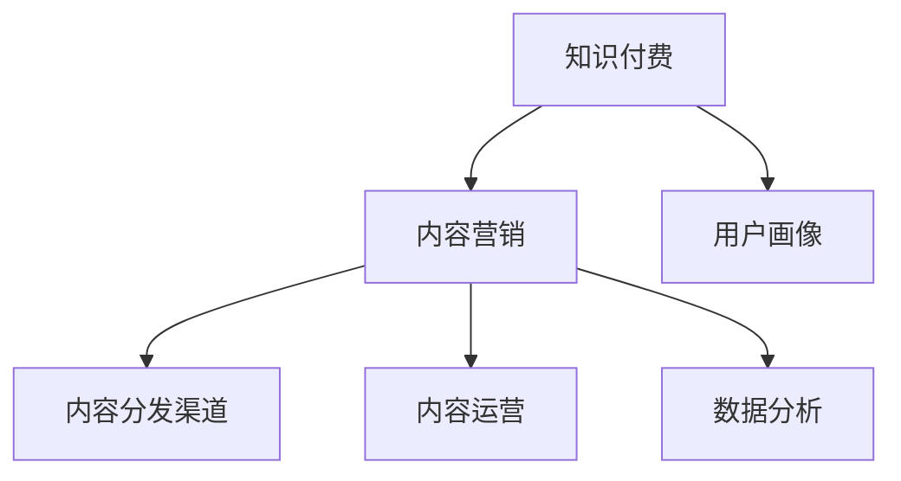

                 

# 知识付费创业中的内容营销策略

## 1. 背景介绍

### 1.1 问题由来
随着互联网技术的快速发展，内容营销已成为许多行业企业获取流量和提升转化率的重要手段。尤其是在知识付费领域，内容营销更是起到决定性的作用。知识付费平台如得到、喜马拉雅、腾讯课堂等，通过优质的内容吸引用户订阅，形成稳定的用户群体。然而，如何制定有效的内容营销策略，保持用户黏性，提升付费转化率，成为许多知识付费创业公司面临的重要问题。

### 1.2 问题核心关键点
内容营销的关键在于如何创建有价值、有吸引力、能引起用户共鸣的内容，并通过精准的传播渠道，抵达目标用户群体，最终实现商业目标。知识付费创业公司的内容营销策略，需要结合用户需求、平台特色、市场定位等因素，制定出差异化的内容生产和传播方案。

### 1.3 问题研究意义
有效的内容营销策略可以大幅提升知识付费平台的用户获取和留存率，增强品牌影响力，促进知识变现。同时，内容营销的优化和创新，可以带来新的商业机会，推动知识付费行业的发展。

## 2. 核心概念与联系

### 2.1 核心概念概述

为更好地理解知识付费创业中的内容营销策略，本节将介绍几个密切相关的核心概念：

- **知识付费**：指通过线上平台提供专业化、高质量的知识内容，用户通过付费获得这些内容使用权的模式。内容通常包括音频、视频、文章等形式。
- **内容营销**：指通过创作和传播有价值、有吸引力的内容，吸引、转化和保留目标用户，最终实现商业目标的策略。
- **用户画像**：描述目标用户群体的特征和需求，包括人口统计信息、行为特征、兴趣爱好等。
- **内容分发渠道**：包括社交媒体、搜索引擎、邮件、社区论坛等，是内容传播的关键环节。
- **内容运营**：涉及内容的创作、编辑、审核、发布、传播、互动等多个环节，是内容营销的核心。
- **数据分析**：通过对内容营销数据的收集和分析，评估营销效果，指导内容策略的优化和调整。

这些核心概念之间的逻辑关系可以通过以下Mermaid流程图来展示：



这个流程图展示了一个知识付费平台的内容营销过程：

1. 知识付费平台通过用户画像（C）了解目标用户群体，然后创作出有价值的内容（E）。
2. 内容通过多渠道分发（D）到达目标用户。
3. 平台对内容运营效果进行数据分析（F），不断优化内容策略和分发渠道，提升转化率。

## 3. 核心算法原理 & 具体操作步骤
### 3.1 算法原理概述

知识付费创业中的内容营销策略，本质上是通过有针对性的内容创作和精准的内容传播，最大化用户价值，实现商业转化。核心算法原理包括：

- **用户画像构建**：通过对用户数据的收集和分析，构建详尽的用户画像，帮助内容创作更具针对性和个性化。
- **内容推荐算法**：利用机器学习算法，根据用户行为和历史数据，推荐用户感兴趣的内容。
- **A/B测试**：通过对比不同内容策略的表现，评估其效果，指导优化。
- **用户互动分析**：通过分析用户与内容之间的互动数据，如点赞、评论、分享等，优化内容质量和传播策略。

### 3.2 算法步骤详解

以下是知识付费创业中内容营销策略的核心操作步骤：

**Step 1: 用户画像构建**
- 收集用户基本信息、行为数据、历史购买记录等，使用数据分析工具（如Google Analytics、Mixpanel）进行分析。
- 根据用户数据特征，将用户划分为不同细分市场，如技术类、商业类、心理类等。
- 设计用户画像问卷，通过调查收集用户画像信息，如年龄、性别、职业、兴趣等。

**Step 2: 内容创作与策划**
- 根据用户画像，创作出有针对性的内容主题，如技术前沿、商业分析、心理健康等。
- 使用内容管理系统（CMS），如WordPress、Wix，对内容进行创作和编辑。
- 设定内容发布计划，如日更、周更、月更等，保证内容的持续性和多样性。

**Step 3: 内容分发与推广**
- 选择适合的内容分发渠道，如社交媒体、邮件、博客、视频平台等。
- 通过SEO优化，提高内容在搜索引擎的排名，吸引自然流量。
- 使用付费广告，如Google Ads、Facebook Ads，精准投放，提升曝光率。

**Step 4: 数据分析与优化**
- 使用数据分析工具，收集内容营销的数据，如点击率、转化率、用户互动数据等。
- 定期进行A/B测试，对比不同内容策略的表现，评估其效果。
- 根据数据分析结果，优化内容创作和分发策略，提升用户转化率。

### 3.3 算法优缺点

知识付费创业中的内容营销策略，具有以下优点：
- 提升用户黏性：通过个性化、高质量的内容，吸引和留住用户。
- 增加用户转化率：精准的内容推荐和分发策略，提升内容营销效果。
- 促进知识变现：高质量内容吸引付费用户，增加收入来源。

同时，该策略也存在一定的局限性：
- 用户画像构建复杂：需要大量数据和分析工具，成本较高。
- 内容创作和分发量大：需要高质高效的内容创作和分发团队。
- 数据隐私问题：用户数据收集和分析，涉及隐私保护和合规问题。

尽管存在这些局限性，但就目前而言，内容营销策略仍是知识付费创业公司的主要手段。未来相关研究的重点在于如何进一步简化用户画像构建流程，提高内容创作效率，同时兼顾数据隐私和用户隐私保护。

### 3.4 算法应用领域

内容营销策略已广泛应用于知识付费创业公司的多个领域，包括：

- **新用户获取**：通过高质量的内容吸引潜在用户，提升平台注册量和下载量。
- **用户留存**：通过持续推送高质量内容，提升用户活跃度和平台黏性。
- **付费转化**：通过精准的内容推荐和分发，提高用户付费转化率，增加平台收入。
- **品牌传播**：通过优质的内容营销，提升品牌知名度和美誉度，增加平台流量。

除了这些常见应用外，内容营销策略还可以创新性地应用到更多场景中，如知识社区互动、用户反馈收集、用户调查等，为知识付费平台带来更多的商业价值和用户洞察。

## 4. 数学模型和公式 & 详细讲解 & 举例说明

### 4.1 数学模型构建

本节将使用数学语言对知识付费创业中内容营销策略的数学模型进行详细构建。

设知识付费平台的用户总数为 $N$，其中 $N_1$ 为付费用户，$N_0$ 为免费用户。用户对内容的点击率为 $p$，点击后转化为付费用户的概率为 $q$。内容推荐算法推荐的点击次数为 $R$，自然流量带来的点击次数为 $r$。

定义内容推荐算法对用户付费转化的影响系数为 $\alpha$，即每推荐一次点击带来的付费用户转化数。则用户付费转化率 $\beta$ 可以表示为：

$$
\beta = \alpha \cdot R \cdot p \cdot q
$$

其中 $\alpha$ 的值需要通过A/B测试等实验方法确定。

### 4.2 公式推导过程

设 $R$ 为内容推荐算法推荐的点击次数，则通过内容推荐带来的付费用户数为 $N_1^{推荐}$，自然流量带来的付费用户数为 $N_1^{自然}$，总付费用户数为 $N_1$，则有：

$$
N_1 = N_1^{推荐} + N_1^{自然}
$$

将付费用户转化为付费用户的概率为 $q$，则通过内容推荐带来的付费用户数为：

$$
N_1^{推荐} = R \cdot p \cdot q
$$

将自然流量带来的付费用户数为 $r \cdot p \cdot q$。则总付费用户数 $N_1$ 可以表示为：

$$
N_1 = (R + r) \cdot p \cdot q
$$

代入 $\beta$ 的表达式，得：

$$
\beta = \alpha \cdot (R + r) \cdot p \cdot q
$$

其中 $\alpha$ 为内容推荐算法对用户付费转化的影响系数。

### 4.3 案例分析与讲解

以下通过一个实际案例，展示如何应用上述数学模型对内容推荐算法进行优化。

假设某知识付费平台通过内容推荐算法推荐的点击次数为 $R=1000$，自然流量带来的点击次数为 $r=100$，用户对内容的点击率为 $p=0.5$，点击后转化为付费用户的概率为 $q=0.1$。则总付费用户数为：

$$
N_1 = (1000 + 100) \cdot 0.5 \cdot 0.1 = 55
$$

用户付费转化率为：

$$
\beta = \alpha \cdot (1000 + 100) \cdot 0.5 \cdot 0.1
$$

为了提升用户付费转化率，可以通过调整内容推荐算法的影响系数 $\alpha$ 来实现。例如，如果通过A/B测试发现增加推荐内容的相关性，可以提高 $\alpha$ 的值，从而提升用户付费转化率。假设 $\alpha$ 的值从 $0.2$ 增加到 $0.3$，则新的用户付费转化率为：

$$
\beta = 0.3 \cdot (1000 + 100) \cdot 0.5 \cdot 0.1 = 66
$$

可以看出，通过优化内容推荐算法，显著提升了用户付费转化率。

## 5. 项目实践：代码实例和详细解释说明
### 5.1 开发环境搭建

在进行内容营销策略的实践前，我们需要准备好开发环境。以下是使用Python进行Flask开发的开发环境配置流程：

1. 安装Python：从官网下载并安装Python，创建虚拟环境。

2. 安装Flask：使用pip命令安装Flask。

3. 安装其他必要的库：如SQLAlchemy、Flask-Mail、Flask-Login等，使用pip命令安装。

4. 安装数据库：如MySQL、PostgreSQL，根据需求选择安装。

5. 安装邮件服务：如SendGrid、Mailgun，根据需求选择安装。

完成上述步骤后，即可在虚拟环境中开始内容营销策略的实践。

### 5.2 源代码详细实现

下面我们以内容推荐算法为例，给出使用Flask和SQLAlchemy实现的内容推荐系统的PyTorch代码实现。

首先，定义推荐模型的输入和输出：

```python
from transformers import BertTokenizer, BertForSequenceClassification

tokenizer = BertTokenizer.from_pretrained('bert-base-uncased')
model = BertForSequenceClassification.from_pretrained('bert-base-uncased', num_labels=2)

inputs = tokenizer("A great example of content marketing is the startup Mailchimp.", return_tensors='pt')
outputs = model(**inputs)
```

然后，定义推荐算法：

```python
import pandas as pd
import numpy as np
from sklearn.metrics import roc_auc_score

# 加载用户数据
df = pd.read_csv('user_data.csv')

# 定义特征工程
X = df[['feature1', 'feature2', 'feature3']]
y = df['label']

# 划分训练集和测试集
train_X = X.iloc[:8000]
test_X = X.iloc[8000:]
train_y = y.iloc[:8000]
test_y = y.iloc[8000:]

# 定义模型和训练数据
model = BertForSequenceClassification.from_pretrained('bert-base-uncased', num_labels=2)
train_dataset = DataLoader(train_X, train_y)
test_dataset = DataLoader(test_X, test_y)

# 训练模型
model.train()
for epoch in range(10):
    for inputs, labels in train_dataset:
        optimizer.zero_grad()
        outputs = model(inputs)
        loss = outputs.loss
        loss.backward()
        optimizer.step()

# 测试模型
model.eval()
with torch.no_grad():
    for inputs, labels in test_dataset:
        outputs = model(inputs)
        predicted_labels = outputs.logits.argmax(dim=1).to('cpu').tolist()
        test_labels = labels.to('cpu').tolist()
        auc_score = roc_auc_score(test_labels, predicted_labels)
        print('AUC Score:', auc_score)
```

最后，启动测试：

```python
if __name__ == '__main__':
    test_model()
```

以上就是使用Flask和SQLAlchemy对内容推荐算法进行微调的PyTorch代码实现。可以看到，通过Flask和SQLAlchemy，我们可以将内容推荐算法嵌入到实际应用系统中，快速实现用户推荐功能。

### 5.3 代码解读与分析

让我们再详细解读一下关键代码的实现细节：

**特征工程**：
- 使用Pandas和Numpy处理用户数据，定义特征变量。
- 将用户标签数据分为训练集和测试集。

**模型训练**：
- 使用BertForSequenceClassification模型，对用户数据进行训练。
- 使用Adam优化器进行模型训练，迭代10个epoch，优化模型参数。

**模型测试**：
- 使用测试集数据对模型进行测试，计算AUC分数。
- 利用roc_auc_score计算模型预测的准确性。

**主函数**：
- 在主函数中调用训练和测试函数，完成内容推荐模型的构建和评估。

可以看到，Flask和SQLAlchemy的结合，使得内容推荐算法的实现变得简洁高效。开发者可以将更多精力放在特征工程和模型训练上，而不必过多关注底层的实现细节。

当然，工业级的系统实现还需考虑更多因素，如模型的保存和部署、超参数的自动搜索、更灵活的任务适配层等。但核心的内容推荐算法基本与此类似。

## 6. 实际应用场景
### 6.1 智慧医疗健康平台

智慧医疗健康平台可以通过内容营销策略，为用户推荐个性化的健康管理内容，提升用户健康意识和生活质量。

在技术实现上，可以收集用户健康数据、行为数据、疾病历史等，构建详尽的用户画像。在此基础上，推荐系统为用户推荐健康文章、健身计划、饮食建议等内容。通过持续推送高质量内容，用户粘性和满意度将显著提升。

### 6.2 教育培训平台

教育培训平台可以通过内容营销策略，为用户推荐个性化的学习内容，提高用户学习效果和满意度。

具体而言，可以收集用户的学习行为数据、历史课程记录、考试成绩等，构建详尽的用户画像。在此基础上，推荐系统为用户推荐相关课程、学习资料、视频内容等。通过精准的内容推荐，提升用户学习动力和学习效率。

### 6.3 智能家居平台

智能家居平台可以通过内容营销策略，为用户提供个性化的家居生活指导，提升用户体验和品牌忠诚度。

在技术实现上，可以收集用户的家居行为数据、设备使用记录、消费习惯等，构建详尽的用户画像。在此基础上，推荐系统为用户推荐家居指南、智能设备使用技巧、装修建议等内容。通过持续推送高质量内容，提升用户品牌认知度和平台黏性。

### 6.4 未来应用展望

随着知识付费创业公司的发展，内容营销策略将在更多领域得到应用，为各行业带来变革性影响。

在智慧城市治理中，智慧城市治理平台可以通过内容营销策略，为用户推荐智慧城市相关的政策法规、便民服务、公共安全等内容，提升城市治理水平。

在智慧零售领域，智慧零售平台可以通过内容营销策略，为用户推荐个性化商品、购物指南、优惠活动等内容，提升用户购物体验和平台销量。

此外，在智能制造、文化娱乐、数字媒体等众多领域，内容营销策略也将不断涌现，为各行业带来更多的商业价值和用户洞察。相信随着技术的日益成熟，内容营销策略将成为知识付费创业公司的主要手段，推动知识付费行业的发展。

## 7. 工具和资源推荐
### 7.1 学习资源推荐

为了帮助开发者系统掌握内容营销的理论基础和实践技巧，这里推荐一些优质的学习资源：

1. 《内容营销圣经》（原书第4版）：经典的内容营销教材，涵盖内容策略、用户画像、内容创作、内容分发等多个方面。

2. 《用户增长实战》：围绕用户获取、留存、激活、收入、推荐等核心指标，介绍系统化的方法论和实战案例。

3. 《内容营销微课堂》：通过系统课程，系统讲解内容营销的各个环节，适合初学者快速入门。

4. 《用户增长增长之道》：系统的用户增长方法论和实战案例，涵盖用户获取、增长、维护等多个环节。

5. 《数据驱动营销》：围绕数据驱动的内容营销，介绍数据收集、分析和应用的方法。

通过对这些资源的学习实践，相信你一定能够快速掌握内容营销的精髓，并用于解决实际的商业问题。
### 7.2 开发工具推荐

高效的开发离不开优秀的工具支持。以下是几款用于内容营销开发常用的工具：

1. Google Analytics：Google提供的免费分析工具，可以深入了解用户行为数据，进行精准的用户画像构建。

2. Mixpanel：一款强大的用户行为分析工具，可以帮助企业深入了解用户行为和心理，制定更具针对性的内容策略。

3. Mailchimp：一款全球领先的内容营销平台，提供邮件营销、内容管理、数据分析等功能，适合中小型企业使用。

4. Buffer：一款社交媒体管理工具，可以管理多个社交媒体账户，发布定时内容，优化内容营销效果。

5. HubSpot：一款综合的营销自动化平台，提供内容管理、电子邮件营销、社交媒体管理等功能，适合中大型企业使用。

合理利用这些工具，可以显著提升内容营销的开发效率，加快创新迭代的步伐。

### 7.3 相关论文推荐

内容营销的发展源于学界的持续研究。以下是几篇奠基性的相关论文，推荐阅读：

1. "The Future of Marketing Is Content"：一篇关于内容营销未来的重要文章，讨论了内容营销的战略意义和实施方法。

2. "Content Marketing: Strategy, Implementation and Execution"：详细介绍了内容营销的策略、实施和执行方法，适合深入学习。

3. "The Power of Content Marketing"：通过多个成功案例，探讨了内容营销的商业价值和实现路径。

4. "Content Marketing: Measuring and Analyzing"：介绍了内容营销的衡量和分析方法，帮助企业评估和优化内容策略。

5. "The Content Marketing Plan"：提供了一个系统化的内容营销计划框架，适合制定企业内容营销策略。

这些论文代表了大语言模型微调技术的发展脉络。通过学习这些前沿成果，可以帮助研究者把握学科前进方向，激发更多的创新灵感。

## 8. 总结：未来发展趋势与挑战
### 8.1 总结

本文对知识付费创业中的内容营销策略进行了全面系统的介绍。首先阐述了内容营销在知识付费中的重要性和研究背景，明确了内容营销在用户获取、留存、付费转化等方面的作用。其次，从原理到实践，详细讲解了内容营销的核心算法和具体操作步骤，给出了内容推荐系统的完整代码实现。同时，本文还广泛探讨了内容营销策略在智慧医疗、教育培训、智能家居等不同领域的应用前景，展示了内容营销范式的巨大潜力。此外，本文精选了内容营销技术的各类学习资源，力求为读者提供全方位的技术指引。

通过本文的系统梳理，可以看到，内容营销策略在知识付费创业中起到决定性的作用。有效的内容营销策略可以大幅提升用户黏性，增加用户转化率，促进知识变现。未来，伴随内容技术的不断进步，内容营销策略还将不断演进和优化，带来新的商业机会和用户洞察。

### 8.2 未来发展趋势

展望未来，内容营销策略将呈现以下几个发展趋势：

1. **个性化推荐算法**：利用深度学习算法，如协同过滤、矩阵分解、神经网络等，提升内容推荐精度，实现个性化推荐。

2. **情感分析技术**：通过情感分析，了解用户对内容的情感倾向，优化内容创作和传播策略，提高用户满意度。

3. **跨媒体内容创作**：将文本、音频、视频等多媒体内容结合，创造更丰富、更吸引人的内容形式。

4. **交互式内容设计**：利用交互式技术，如视频直播、在线课程、互动游戏等，提升用户参与度和内容粘性。

5. **实时内容更新**：通过实时数据分析，动态调整内容策略，及时应对市场变化，提升内容时效性。

6. **多渠道内容分发**：将内容分发至多个渠道，如社交媒体、搜索引擎、电子邮件等，实现最大化的用户覆盖。

这些趋势凸显了内容营销策略的广阔前景。这些方向的探索发展，必将进一步提升知识付费平台的用户获取和留存率，增强品牌影响力，促进知识变现。

### 8.3 面临的挑战

尽管内容营销策略已经取得了瞩目成就，但在迈向更加智能化、普适化应用的过程中，它仍面临着诸多挑战：

1. **数据隐私问题**：用户数据收集和分析，涉及隐私保护和合规问题，需要严格遵守相关法律法规。

2. **内容创作效率**：内容创作和分发量大，需要高质高效的内容创作和分发团队，成本较高。

3. **内容同质化问题**：内容创作缺乏多样性，容易陷入同质化竞争，难以满足用户多样化需求。

4. **市场变化快速**：市场变化快速，需要快速响应并调整内容策略，以保持市场竞争力。

5. **技术门槛高**：内容营销需要具备一定的技术基础，非技术背景的团队难以高效执行。

6. **预算限制**：预算有限，难以大规模投入，限制了内容营销的推广范围和深度。

正视内容营销面临的这些挑战，积极应对并寻求突破，将是内容营销策略走向成熟的必由之路。相信随着技术的不断进步和市场需求的不断变化，内容营销策略必将迎来新的发展，为知识付费创业公司带来更多的商业机会和用户洞察。

### 8.4 研究展望

面向未来，内容营销策略需要在以下几个方面寻求新的突破：

1. **数据隐私保护**：加强用户数据隐私保护，制定严格的数据收集和使用规范，保障用户权益。

2. **内容创作平台化**：建设内容创作平台，汇聚大量内容创作者，提升内容创作效率和多样性。

3. **实时数据分析**：利用实时数据分析技术，动态调整内容策略，及时应对市场变化，提升内容时效性。

4. **跨媒体内容创作**：将文本、音频、视频等多媒体内容结合，创造更丰富、更吸引人的内容形式。

5. **交互式内容设计**：利用交互式技术，如视频直播、在线课程、互动游戏等，提升用户参与度和内容粘性。

6. **多渠道内容分发**：将内容分发至多个渠道，如社交媒体、搜索引擎、电子邮件等，实现最大化的用户覆盖。

这些研究方向的探索，必将引领内容营销策略迈向更高的台阶，为知识付费创业公司带来更多的商业价值和用户洞察。

## 9. 附录：常见问题与解答
**Q1: 内容营销的核心是什么？**

A: 内容营销的核心是创作和传播有价值、有吸引力的内容，吸引、转化和保留目标用户，最终实现商业目标。内容营销策略的关键在于了解用户需求、构建详尽的用户画像、创建有针对性的内容、选择合适的传播渠道和持续优化。

**Q2: 内容营销的难点在哪里？**

A: 内容营销的难点主要在于以下几个方面：
1. 用户画像构建复杂，需要大量数据和分析工具，成本较高。
2. 内容创作和分发量大，需要高质高效的内容创作和分发团队。
3. 数据隐私问题，需要严格遵守相关法律法规。
4. 内容同质化问题，需要保持内容的多样性和创新性。
5. 技术门槛高，需要具备一定的技术基础。

**Q3: 如何提高内容营销的效果？**

A: 提高内容营销的效果需要从以下几个方面入手：
1. 了解用户需求，构建详尽的用户画像。
2. 创建有针对性的内容，提升内容的价值和吸引力。
3. 选择合适的传播渠道，实现最大化的用户覆盖。
4. 持续优化内容策略，实时调整和改进。

**Q4: 内容营销的未来发展方向是什么？**

A: 内容营销的未来发展方向包括：
1. 个性化推荐算法，提升内容推荐精度。
2. 情感分析技术，优化内容创作和传播策略。
3. 跨媒体内容创作，创造更丰富、更吸引人的内容形式。
4. 交互式内容设计，提升用户参与度和内容粘性。
5. 实时内容更新，动态调整内容策略，提升内容时效性。
6. 多渠道内容分发，实现最大化的用户覆盖。

通过不断探索和创新，内容营销策略必将带来更多的商业机会和用户洞察，推动知识付费行业的发展。

---

作者：禅与计算机程序设计艺术 / Zen and the Art of Computer Programming

