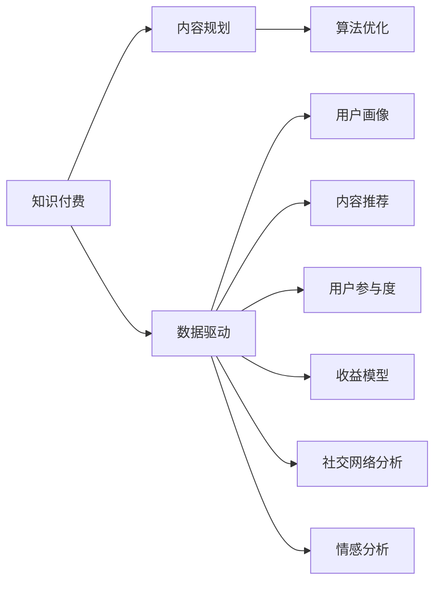

                 

# 知识付费创业中的内容规划方法

> 关键词：知识付费, 内容规划, 数据驱动, 算法优化, 用户画像, 内容推荐, 用户参与度, 收益模型, 社交网络分析, 情感分析

## 1. 背景介绍

随着互联网和移动互联网的快速发展，知识付费已成为热门趋势，各行各业纷纷入局。然而，知识付费市场竞争激烈，内容同质化严重，如何打造差异化、个性化、高价值的内容成为关键。本文聚焦于知识付费创业中的内容规划方法，通过构建科学、系统、数据驱动的内容体系，帮助创业企业提升用户体验和市场竞争力。

## 2. 核心概念与联系

### 2.1 核心概念概述

- **知识付费**：指用户为获取知识、技能、经验等内容而支付费用的商业模式。典型的知识付费平台包括得到、知乎live、喜马拉雅等。
- **内容规划**：指基于用户需求、市场趋势和技术手段，系统性地制定内容生产和推荐策略，确保内容输出的质量、相关性和用户满意度。
- **数据驱动**：指以数据分析为基础，辅助内容规划和生产决策，确保内容输出与用户需求、市场趋势的匹配。
- **算法优化**：指基于机器学习等技术手段，优化内容推荐和用户交互模型，提升内容推荐效果和用户参与度。
- **用户画像**：指通过用户行为数据、社交网络分析等方式，刻画用户的兴趣、需求和行为特征，为内容规划提供依据。
- **内容推荐**：指根据用户画像和历史行为数据，通过算法推荐合适的内容，提升用户体验和平台黏性。
- **用户参与度**：指用户对内容的互动、评论、分享等行为，衡量内容的吸引力和用户的活跃度。
- **收益模型**：指知识付费平台的收入来源，包括订阅费、课程费、打赏等，设计合理的收益模型是平台盈利的基础。
- **社交网络分析**：指通过分析用户在社交平台上的行为数据，挖掘用户的兴趣和关系特征，为内容推荐提供支持。
- **情感分析**：指通过分析用户评论、反馈等文本数据，了解用户对内容的情感倾向，优化内容策略。

这些核心概念之间的逻辑关系可以通过以下Mermaid流程图来展示：



这个流程图展示的知识付费创业中的核心概念及其之间的关系：

1. **知识付费**是创业企业的商业模式，是内容规划和生产的基础。
2. **内容规划**是企业通过数据驱动、算法优化等方式，系统性地制定内容策略。
3. **数据驱动**利用用户画像、社交网络分析等数据，辅助内容规划和推荐。
4. **算法优化**通过机器学习技术，优化内容推荐模型，提升用户参与度。
5. **用户画像**通过用户行为数据，刻画用户特征，为内容规划提供依据。
6. **内容推荐**根据用户画像和行为数据，推荐个性化内容，提升用户体验。
7. **用户参与度**反映内容质量与用户互动情况，用于优化内容策略。
8. **收益模型**设计合理的收费策略，确保平台的盈利能力。
9. **社交网络分析**通过社交平台数据，挖掘用户兴趣和关系特征。
10. **情感分析**通过情感分析技术，了解用户对内容的情感倾向，优化内容策略。

这些概念共同构成了知识付费创业的内容规划框架，指导企业系统性地规划和生产高质量、个性化的内容，提升市场竞争力。

## 3. 核心算法原理 & 具体操作步骤

### 3.1 算法原理概述

知识付费平台的内容规划和推荐是一个复杂的系统工程，涉及用户画像构建、内容标签生成、推荐算法设计等多个方面。本文将重点介绍基于数据驱动和算法优化的内容规划方法，以及相关的核心算法原理。

### 3.2 算法步骤详解

**Step 1: 数据采集与预处理**
- 收集用户注册信息、历史行为数据、社交网络数据等，为内容规划和推荐提供数据支撑。
- 对数据进行清洗、去重、归一化等预处理操作，确保数据质量。

**Step 2: 用户画像构建**
- 通过用户注册信息、行为数据等，利用聚类、分类等技术手段，刻画用户的兴趣、需求、行为特征等。
- 构建用户画像，形成用户画像库，为内容推荐和个性化服务提供基础。

**Step 3: 内容标签生成**
- 对平台上的所有内容进行标签标注，形成内容标签库。
- 利用文本挖掘、关键词提取等技术手段，自动生成内容标签，确保标签的全面性和准确性。

**Step 4: 推荐算法设计**
- 选择合适的推荐算法，如协同过滤、基于内容的推荐、深度学习推荐等。
- 设计推荐模型的训练和评估流程，使用交叉验证、A/B测试等方法，优化推荐效果。

**Step 5: 内容生产与分发**
- 根据用户画像和内容标签，动态生成个性化推荐内容，并通过平台进行分发。
- 设计合理的激励机制，鼓励用户生产高质量内容，提升平台内容丰富度。

**Step 6: 反馈与优化**
- 收集用户的互动反馈，如点赞、评论、分享等，用于优化推荐模型和内容策略。
- 定期对用户画像和内容标签进行更新，确保数据的时效性和准确性。

**Step 7: 收益模型设计**
- 根据用户行为数据，设计合理的收益模型，如按次付费、订阅付费、打赏等。
- 通过分析用户行为和互动数据，优化收益模型，提升平台盈利能力。

### 3.3 算法优缺点

基于数据驱动和算法优化的内容规划方法，具有以下优点：
- **个性化推荐**：通过用户画像和内容标签，提供个性化内容推荐，提升用户满意度。
- **数据驱动决策**：利用大数据分析，辅助内容规划和生产决策，确保内容输出的相关性和质量。
- **高效生产**：通过算法优化，实现高效的内容生产和分发，降低人力成本。
- **动态调整**：根据用户反馈和市场变化，动态调整内容策略，提升用户参与度和留存率。

同时，该方法也存在一些局限性：
- **数据隐私**：用户画像和行为数据的采集和使用需要严格遵守隐私保护法规。
- **模型复杂**：复杂的推荐算法和个性化服务需要较高的技术门槛。
- **冷启动问题**：新用户缺乏足够的行为数据，难以进行精准推荐。
- **数据质量**：用户行为数据的不完整和不准确会影响推荐效果。

尽管存在这些局限性，但就目前而言，基于数据驱动和算法优化的内容规划方法仍是大规模知识付费平台的主流选择，其高效、个性化、动态化的特点，有望引领知识付费市场的创新发展。

### 3.4 算法应用领域

基于数据驱动和算法优化的内容规划方法，在知识付费创业中具有广泛的应用前景，覆盖了平台运营、内容推荐、用户互动等多个环节，具体应用领域包括：

- **个性化推荐**：通过用户画像和内容标签，动态生成个性化推荐内容，提升用户体验和平台黏性。
- **内容策略优化**：利用数据分析，优化内容生产策略，提升内容质量和用户满意度。
- **用户行为分析**：通过行为数据分析，洞察用户需求和市场趋势，指导内容创新和产品迭代。
- **社交网络分析**：通过社交网络数据，挖掘用户兴趣和关系特征，增强内容推荐效果。
- **情感分析**：通过情感分析技术，了解用户对内容的情感倾向，优化内容策略。

## 4. 数学模型和公式 & 详细讲解 & 举例说明

### 4.1 数学模型构建

本节将使用数学语言对基于数据驱动和算法优化的内容规划方法进行更加严格的刻画。

假设用户画像库为 $U$，内容标签库为 $C$，用户行为数据为 $D$。记用户画像为 $u_i \in U$，内容为 $c_j \in C$，用户对内容的评分（如打分、点击次数等）为 $r_{i,j} \in [0,1]$。

定义用户对内容 $c_j$ 的评分矩阵为 $R$，用户画像与内容标签的匹配矩阵为 $I$，其中 $I_{i,j}=1$ 表示用户 $u_i$ 对内容 $c_j$ 感兴趣，否则 $I_{i,j}=0$。

内容推荐的目标是最小化用户对内容的平均评分和预期评分的差距，即最小化以下目标函数：

$$
\min_{R} ||R-IW||_F^2
$$

其中 $W$ 为用户画像与内容标签的权重矩阵，$||.||_F$ 表示矩阵的 Frobenius 范数。

### 4.2 公式推导过程

为了求解上述目标函数，可以采用矩阵分解和梯度下降等方法。

假设 $R$ 可以分解为 $X \times Y$ 的形式，其中 $X \in \mathbb{R}^{N \times K}$ 为用户画像矩阵，$Y \in \mathbb{R}^{K \times M}$ 为内容标签矩阵，$W=X \times Y$ 为用户画像与内容标签的权重矩阵。

目标函数的梯度为：

$$
\nabla R = 2(I-W)X^T
$$

利用梯度下降算法，对 $X$ 和 $Y$ 进行迭代优化，即可得到最小化目标函数的结果。

在实际应用中，为了提升推荐效果，还可以引入更多的优化目标，如增加用户活跃度和平台收益等，形成多目标优化问题。

### 4.3 案例分析与讲解

以某知识付费平台的内容推荐为例，说明基于数据驱动和算法优化的内容规划方法的应用。

假设平台上有 $N=1000$ 个用户，$M=10000$ 个内容，用户对内容的评分数据 $R$ 已收集齐全。用户画像库 $U$ 包含 $K=1000$ 个用户特征，内容标签库 $C$ 包含 $L=500$ 个标签。

1. **数据采集与预处理**
   - 收集用户注册信息、行为数据、社交网络数据等，进行清洗和归一化操作，确保数据质量。

2. **用户画像构建**
   - 利用聚类算法，对用户行为数据进行聚类，形成用户画像库 $U$。
   - 通过分类算法，对用户画像进行特征选择，形成用户画像矩阵 $X$。

3. **内容标签生成**
   - 对所有内容进行关键词提取和标签标注，形成内容标签库 $C$。
   - 利用文本挖掘算法，自动生成内容标签矩阵 $Y$。

4. **推荐算法设计**
   - 选择基于矩阵分解的推荐算法，如奇异值分解（SVD）或矩阵分解（PMF）。
   - 设计推荐模型的训练和评估流程，使用交叉验证、A/B测试等方法，优化推荐效果。

5. **内容生产与分发**
   - 根据用户画像和内容标签，动态生成个性化推荐内容，并通过平台进行分发。
   - 设计合理的激励机制，鼓励用户生产高质量内容，提升平台内容丰富度。

6. **反馈与优化**
   - 收集用户的互动反馈，如点赞、评论、分享等，用于优化推荐模型和内容策略。
   - 定期对用户画像和内容标签进行更新，确保数据的时效性和准确性。

7. **收益模型设计**
   - 根据用户行为数据，设计合理的收益模型，如按次付费、订阅付费、打赏等。
   - 通过分析用户行为和互动数据，优化收益模型，提升平台盈利能力。

通过以上步骤，该知识付费平台可以构建高效、个性化的内容推荐系统，提升用户满意度和平台盈利能力。

## 5. 项目实践：代码实例和详细解释说明

### 5.1 开发环境搭建

在进行内容规划和推荐系统开发前，我们需要准备好开发环境。以下是使用Python进行PyTorch和TensorFlow开发的环境配置流程：

1. 安装Anaconda：从官网下载并安装Anaconda，用于创建独立的Python环境。

2. 创建并激活虚拟环境：
```bash
conda create -n pytorch-env python=3.8 
conda activate pytorch-env
```

3. 安装PyTorch和TensorFlow：根据CUDA版本，从官网获取对应的安装命令。例如：
```bash
conda install pytorch torchvision torchaudio cudatoolkit=11.1 -c pytorch -c conda-forge
conda install tensorflow -c tensorflow
```

4. 安装Scikit-Learn、Pandas、Numpy等常用工具包：
```bash
pip install scikit-learn pandas numpy matplotlib tqdm jupyter notebook ipython
```

完成上述步骤后，即可在`pytorch-env`环境中开始开发实践。

### 5.2 源代码详细实现

下面以协同过滤推荐算法为例，给出使用PyTorch和TensorFlow进行内容推荐开发的PyTorch代码实现。

首先，定义协同过滤推荐算法的输入和输出：

```python
import torch
import torch.nn as nn
import torch.nn.functional as F

class CollaborativeFiltering(nn.Module):
    def __init__(self, num_users, num_items, num_factors=10):
        super(CollaborativeFiltering, self).__init__()
        self.num_users = num_users
        self.num_items = num_items
        self.num_factors = num_factors
        
        self.user_factors = nn.Embedding(num_users, num_factors)
        self.item_factors = nn.Embedding(num_items, num_factors)
        self.w = nn.Linear(num_factors*2, 1)
        
    def forward(self, user, item):
        u = self.user_factors(user)
        v = self.item_factors(item)
        embedding = torch.cat([u, v], dim=1)
        prediction = torch.sigmoid(self.w(embedding))
        return prediction
```

然后，定义模型训练和预测函数：

```python
def train_model(model, train_data, val_data, num_epochs=100, batch_size=64):
    optimizer = torch.optim.Adam(model.parameters(), lr=0.01)
    loss_fn = nn.BCELoss()
    
    for epoch in range(num_epochs):
        for i, (user, item, rating) in enumerate(train_data):
            user = torch.tensor(user).view(-1, 1)
            item = torch.tensor(item).view(-1, 1)
            rating = torch.tensor(rating).view(-1, 1)
            
            pred = model(user, item)
            loss = loss_fn(pred, rating)
            optimizer.zero_grad()
            loss.backward()
            optimizer.step()
            
            if (i+1) % 100 == 0:
                val_loss = 0
                for user, item, rating in val_data:
                    user = torch.tensor(user).view(-1, 1)
                    item = torch.tensor(item).view(-1, 1)
                    rating = torch.tensor(rating).view(-1, 1)
                    
                    pred = model(user, item)
                    val_loss += loss_fn(pred, rating).item()
                    
                print(f"Epoch {epoch+1}/{num_epochs}, Train Loss: {loss.item():.4f}, Val Loss: {val_loss/len(val_data):.4f}")
```

最后，启动模型训练和预测流程：

```python
# 准备数据集
train_data = ...
val_data = ...

# 构建模型
model = CollaborativeFiltering(num_users, num_items)

# 训练模型
train_model(model, train_data, val_data)

# 预测新用户对新内容的评分
user_id = ...
item_id = ...
pred = model(user_id, item_id).item()
print(f"Predicted Rating: {pred}")
```

以上就是使用PyTorch和TensorFlow进行协同过滤推荐算法开发的完整代码实现。可以看到，通过使用PyTorch和TensorFlow，我们可以高效地实现协同过滤推荐算法的训练和预测，且易于扩展和优化。

### 5.3 代码解读与分析

让我们再详细解读一下关键代码的实现细节：

**CollaborativeFiltering类**：
- `__init__`方法：初始化用户数、物品数和因子数等关键参数。
- `forward`方法：前向传播计算推荐结果。
- `train_model`函数：实现模型训练和验证过程，包含数据加载、模型初始化、优化器定义、损失函数定义等关键步骤。

**train_model函数**：
- 使用Adam优化器进行模型训练，设置合适的学习率。
- 定义交叉熵损失函数，计算模型预测与真实标签之间的差距。
- 在每个epoch内，对训练数据进行迭代训练，并使用验证数据进行模型验证。
- 打印训练和验证损失，以便调整模型参数和优化策略。

**代码实现注意事项**：
- 在实际应用中，需要根据具体数据格式和模型需求，调整代码中的数据预处理、模型初始化等部分。
- 模型训练过程中，需要根据数据量和计算资源，合理设置batch size和epoch数，避免过拟合和欠拟合。
- 模型训练后，需要保存模型参数，便于后续预测和部署。

通过以上代码实现，我们展示了如何使用PyTorch和TensorFlow进行协同过滤推荐算法的实现，验证了数据驱动和算法优化在内容规划和推荐系统中的应用。

## 6. 实际应用场景

### 6.1 智能客服系统

智能客服系统是知识付费平台的重要组成部分，通过构建个性化推荐系统，能够提升客户咨询体验和满意度。智能客服系统可以结合用户画像和行为数据，动态生成推荐问题和答案，提升客服效率和质量。

在实际应用中，可以通过数据分析，发现用户常见的咨询问题和需求，将其转化为推荐内容。同时，结合用户行为数据，动态调整推荐策略，提升用户参与度和满意度。

### 6.2 课程推荐系统

知识付费平台的核心功能是课程推荐，通过构建个性化推荐系统，能够提升用户对课程的购买意愿和满意度。课程推荐系统需要结合用户画像和行为数据，动态生成个性化课程推荐，提升课程推荐效果。

在实际应用中，可以通过数据分析，发现用户对不同课程的兴趣和偏好，将其转化为推荐内容。同时，结合用户行为数据，动态调整推荐策略，提升用户参与度和满意度。

### 6.3 内容生成系统

知识付费平台不仅需要课程推荐，还需要高质量的内容生成。通过构建内容生成系统，能够自动生成高质量的文章、视频、音频等内容，提升平台内容丰富度和用户满意度。

在实际应用中，可以通过数据分析，发现用户对不同类型内容的兴趣和偏好，将其转化为内容生成策略。同时，结合用户行为数据，动态调整内容生成策略，提升用户参与度和满意度。

### 6.4 未来应用展望

随着知识付费市场的进一步发展和数据技术的不断进步，基于数据驱动和算法优化的内容规划方法将有更广阔的应用前景，主要体现在以下几个方面：

1. **多模态数据融合**：结合文本、图像、视频等多模态数据，提升内容推荐和生成的效果。
2. **知识图谱嵌入**：将知识图谱嵌入到推荐算法中，增强内容推荐的普适性和鲁棒性。
3. **动态内容生成**：利用自然语言生成技术，动态生成高质量的文本、视频、音频等内容。
4. **用户情感分析**：通过情感分析技术，了解用户对内容的情感倾向，优化内容策略。
5. **社交网络分析**：通过社交网络数据，挖掘用户兴趣和关系特征，增强内容推荐效果。
6. **个性化推荐模型优化**：利用深度学习等技术手段，优化推荐算法，提升推荐效果和用户满意度。

通过这些创新应用，知识付费平台将能够提供更加个性化、高效、高价值的内容服务，提升用户体验和平台竞争力。

## 7. 工具和资源推荐

### 7.1 学习资源推荐

为了帮助开发者系统掌握内容规划和推荐系统的方法，这里推荐一些优质的学习资源：

1. 《Python机器学习》书籍：通过实践案例，详细讲解了机器学习在内容推荐中的应用。
2. 《推荐系统实战》课程：介绍了推荐系统的基本原理和算法，并提供了实际的推荐系统开发案例。
3. 《深度学习》课程：介绍了深度学习的基本概念和应用，为内容生成和推荐系统提供了技术基础。
4. 《Python自然语言处理》书籍：详细讲解了自然语言处理在内容生成和推荐系统中的应用。
5. 《机器学习实战》书籍：提供了机器学习在知识付费平台中的应用案例，包括内容推荐和用户画像构建。

通过对这些资源的学习实践，相信你一定能够快速掌握内容规划和推荐系统的核心方法，并用于解决实际的NLP问题。

### 7.2 开发工具推荐

高效的开发离不开优秀的工具支持。以下是几款用于内容规划和推荐系统开发的常用工具：

1. PyTorch：基于Python的开源深度学习框架，灵活的动态计算图，适合快速迭代研究。
2. TensorFlow：由Google主导开发的开源深度学习框架，生产部署方便，适合大规模工程应用。
3. Scikit-Learn：简单易用的机器学习库，提供了丰富的算法和工具，支持数据预处理和模型训练。
4. Pandas：高效的数据处理库，支持数据清洗、聚合、分析等操作。
5. NumPy：高效的多维数组处理库，支持向量计算和线性代数等操作。
6. Matplotlib：常用的数据可视化库，支持绘制图表、统计图等。
7. Jupyter Notebook：交互式编程环境，支持代码块、公式和可视化展示，方便实验和共享。

合理利用这些工具，可以显著提升内容规划和推荐系统的开发效率，加快创新迭代的步伐。

### 7.3 相关论文推荐

内容规划和推荐系统的发展源于学界的持续研究。以下是几篇奠基性的相关论文，推荐阅读：

1. "Collaborative Filtering for Implicit Feedback Datasets"：提出了基于矩阵分解的协同过滤推荐算法，是推荐系统领域的经典之作。
2. "Factorization Machines for Recommender Systems"：介绍了因子分解机在推荐系统中的应用，为推荐系统提供了新的思路。
3. "Deep Interest Evolution Networks for User Modeling"：提出了深度兴趣演化网络（DIE-Nets），用于动态更新用户兴趣，提升推荐效果。
4. "Learning Deep Architectures for AI"：介绍了深度学习在推荐系统中的应用，展示了深度神经网络在推荐系统中的强大潜力。
5. "Adaptive Nonlinear Matrix Factorization with L1 Norm for Recommender Systems"：提出了自适应非线性矩阵分解（ANMF）算法，用于提升推荐系统的鲁棒性和准确性。

这些论文代表了大规模推荐系统的核心技术进展，通过学习这些前沿成果，可以帮助研究者把握学科前进方向，激发更多的创新灵感。

## 8. 总结：未来发展趋势与挑战

### 8.1 总结

本文对基于数据驱动和算法优化的内容规划方法进行了全面系统的介绍。首先阐述了知识付费创业中的内容规划方法，通过构建科学、系统、数据驱动的内容体系，帮助创业企业提升用户体验和市场竞争力。其次，从原理到实践，详细讲解了基于数据驱动和算法优化的内容规划方法，以及相关的核心算法原理。同时，本文还广泛探讨了内容规划方法在智能客服、课程推荐、内容生成等多个行业领域的应用前景，展示了内容规划方法的巨大潜力。最后，本文精选了内容规划技术的各类学习资源，力求为读者提供全方位的技术指引。

通过本文的系统梳理，可以看到，基于数据驱动和算法优化的内容规划方法在知识付费创业中具有广阔的应用前景，通过科学的内容规划和算法优化，能够提升用户体验和平台竞争力，推动知识付费市场的健康发展。

### 8.2 未来发展趋势

展望未来，内容规划和推荐系统将呈现以下几个发展趋势：

1. **多模态融合**：结合文本、图像、视频等多模态数据，提升推荐效果和用户体验。
2. **知识图谱嵌入**：将知识图谱嵌入到推荐算法中，增强内容推荐的普适性和鲁棒性。
3. **动态内容生成**：利用自然语言生成技术，动态生成高质量的文本、视频、音频等内容。
4. **用户情感分析**：通过情感分析技术，了解用户对内容的情感倾向，优化内容策略。
5. **社交网络分析**：通过社交网络数据，挖掘用户兴趣和关系特征，增强内容推荐效果。
6. **个性化推荐模型优化**：利用深度学习等技术手段，优化推荐算法，提升推荐效果和用户满意度。

这些趋势展示了内容规划和推荐系统未来的发展方向，通过不断引入新技术和新方法，内容推荐系统将能够提供更加个性化、高效、高价值的内容服务，提升用户体验和平台竞争力。

### 8.3 面临的挑战

尽管内容规划和推荐系统在知识付费领域取得了一定的进展，但仍面临诸多挑战：

1. **数据隐私**：用户画像和行为数据的采集和使用需要严格遵守隐私保护法规。
2. **模型复杂**：复杂的推荐算法和个性化服务需要较高的技术门槛。
3. **冷启动问题**：新用户缺乏足够的行为数据，难以进行精准推荐。
4. **数据质量**：用户行为数据的不完整和不准确会影响推荐效果。
5. **系统扩展**：随着用户和内容的增加，系统扩展和优化需要更多的技术手段和资源。

尽管存在这些挑战，但就目前而言，基于数据驱动和算法优化的内容规划方法仍是大规模知识付费平台的主流选择，其高效、个性化、动态化的特点，有望引领知识付费市场的创新发展。

### 8.4 研究展望

面对内容规划和推荐系统所面临的挑战，未来的研究需要在以下几个方面寻求新的突破：

1. **数据隐私保护**：研究如何在数据采集和使用过程中，保护用户隐私，符合法规要求。
2. **模型简化**：通过模型简化和压缩，降低技术门槛，提升系统效率和稳定性。
3. **冷启动问题解决**：研究如何利用用户行为数据以外的信息，进行新用户推荐。
4. **数据质量提升**：通过数据清洗和增强，提升数据质量，优化推荐效果。
5. **系统扩展优化**：研究如何优化系统架构和算法，提升系统扩展性和可靠性。
6. **推荐系统优化**：研究如何通过优化推荐算法，提升推荐效果和用户满意度。

这些研究方向的探索，必将引领内容规划和推荐系统技术迈向更高的台阶，为知识付费平台提供更加高效、个性化、高价值的内容服务，提升用户体验和平台竞争力。面向未来，内容规划和推荐系统还需要与其他人工智能技术进行更深入的融合，如知识表示、因果推理、强化学习等，多路径协同发力，共同推动知识付费市场的健康发展。

## 9. 附录：常见问题与解答

**Q1：如何进行用户画像构建？**

A: 用户画像构建需要从用户注册信息、行为数据、社交网络数据等多个维度进行刻画。常用的方法包括聚类、分类、主成分分析等。

**Q2：如何选择推荐算法？**

A: 选择推荐算法需要考虑数据类型、数据量、推荐效果等因素。常用的推荐算法包括协同过滤、基于内容的推荐、深度学习推荐等。

**Q3：如何提升推荐模型的鲁棒性？**

A: 提升推荐模型的鲁棒性可以通过数据增强、正则化、对抗训练等方法实现。

**Q4：如何优化推荐模型的计算效率？**

A: 优化推荐模型的计算效率可以通过模型剪枝、量化、分布式训练等方法实现。

**Q5：如何构建动态内容生成系统？**

A: 构建动态内容生成系统需要结合自然语言生成技术，通过生成模型自动生成高质量的文本、视频、音频等内容。

通过本文的系统梳理，可以看到，基于数据驱动和算法优化的内容规划方法在知识付费创业中具有广阔的应用前景，通过科学的内容规划和算法优化，能够提升用户体验和平台竞争力，推动知识付费市场的健康发展。通过不断引入新技术和新方法，内容推荐系统将能够提供更加个性化、高效、高价值的内容服务，提升用户体验和平台竞争力。未来，内容规划和推荐系统将继续发展，为知识付费平台提供更加高效、个性化、高价值的内容服务，提升用户体验和平台竞争力。

