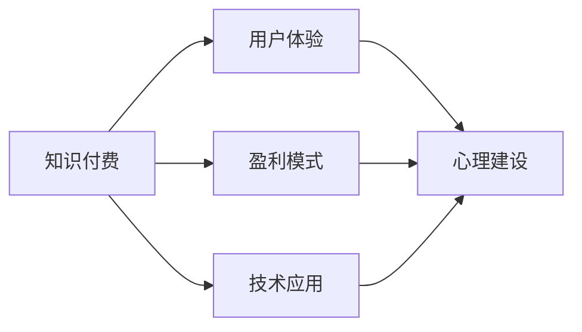

                 

# 知识付费创业中的心理建设

> 关键词：知识付费, 创业, 心理建设, 用户需求, 盈利模式, 技术创新

## 1. 背景介绍

随着互联网技术的普及和知识经济的兴起，知识付费成为了一个蓬勃发展的市场。与传统的付费订阅模式不同，知识付费强调通过有价值的知识内容，解决用户具体问题，从而实现按需付费。这一模式不仅满足了用户对特定知识的需求，还为内容创作者提供了新的商业机会。然而，创业成功背后隐藏着无数挑战和心理障碍，本文将从用户需求、盈利模式、技术创新等角度出发，探讨如何通过心理建设推动知识付费创业的成功。

### 1.1 知识付费市场现状

目前，知识付费市场主要包括在线课程、专业咨询、电子书订阅等形式。这些服务主要通过收费订阅或单次付费模式销售，内容涵盖从技术、财经、教育到生活等多个领域。然而，尽管市场火热，但用户黏性不高，付费意愿不强。根据调查，多数用户表示“性价比不高”、“价值回报不足”。这些反馈意味着创业团队需更深入了解用户需求，优化产品体验，提升内容质量。

### 1.2 创业团队面临的心理障碍

知识付费创业不仅是对内容的深度打磨，更是对商业模式的深谋远虑。以下是创业团队在心理上可能面临的一些障碍：

- **市场不确定性**：知识付费市场竞争激烈，用户需求多样且变化快，如何准确把握用户需求，制定出有效的市场策略？
- **盈利模式单一**：目前的知识付费盈利模式较为简单，如何通过差异化产品和服务，创造多元化的盈利途径？
- **内容生产挑战**：高质量内容生产需要大量资源投入，如何保证内容持续更新和迭代？
- **用户心理负担**：用户付费后，希望得到高质量的回报，如何建立信任，让用户感受到物有所值？
- **技术应用难题**：知识付费创业涉及众多技术环节，如内容推荐、个性化服务、在线支付等，如何高效地整合和应用技术手段？

## 2. 核心概念与联系

### 2.1 核心概念概述

为了更好地理解知识付费创业中的心理建设，本文将介绍几个核心概念：

- **知识付费**：通过有价值的知识内容，满足用户特定需求，实现按需付费的模式。
- **用户体验**：用户在使用产品时的情感体验，是衡量知识付费成功与否的重要指标。
- **盈利模式**：知识付费产品的收入来源和定价策略，决定了产品的商业可持续性。
- **技术应用**：知识付费创业涉及多种技术手段，如数据分析、推荐算法、自然语言处理等，是实现产品差异化的重要工具。
- **心理建设**：创业团队在面对市场不确定性、盈利模式单一等问题时，如何通过心理调整和优化，实现团队稳定、用户满意。

这些概念之间紧密相连，共同构成知识付费创业的整体框架。通过这些概念，可以更好地理解创业团队在心理层面的需求，并针对性地进行建设。

### 2.2 核心概念原理和架构的 Mermaid 流程图



这个流程图展示了几大核心概念之间的逻辑关系：

1. 知识付费通过提供有价值的知识内容，满足用户需求。
2. 用户体验是衡量知识付费成功与否的关键指标。
3. 盈利模式决定了知识付费产品的收入来源和定价策略。
4. 技术应用是实现知识付费产品差异化的重要手段。
5. 心理建设是团队面对市场和用户挑战时的重要支撑。

## 3. 核心算法原理 & 具体操作步骤

### 3.1 算法原理概述

知识付费创业中的心理建设，涉及对市场环境的感知、用户需求的理解、产品服务的优化、团队情绪的管理等多方面。其核心算法原理主要包括：

- **市场分析**：通过数据分析和预测模型，了解用户行为和市场需求。
- **用户画像**：构建详细的用户画像，包括兴趣、偏好、消费习惯等，以制定针对性的策略。
- **内容匹配**：通过推荐算法，精准匹配用户需求和优质内容，提升用户满意度。
- **情感识别**：利用情感分析技术，监控用户反馈和情绪变化，及时调整产品策略。
- **团队激励**：通过激励机制和情感管理，保持团队士气和动力。

### 3.2 算法步骤详解

以下是心理建设的算法步骤详解：

#### 3.2.1 市场分析

1. **数据收集**：通过用户行为数据、搜索记录、社交媒体等渠道，收集用户行为数据。
2. **数据清洗**：对收集到的数据进行去重、去噪、填补缺失值等处理。
3. **数据分析**：应用统计分析、机器学习等技术，对数据进行挖掘和解读。
4. **趋势预测**：使用时间序列分析、回归模型等方法，预测市场需求和用户行为。

#### 3.2.2 用户画像

1. **特征提取**：从用户行为数据中提取关键特征，如兴趣标签、消费时段、用户类别等。
2. **模型训练**：使用聚类、分类等算法，对用户进行分群和标签化。
3. **画像优化**：定期更新用户画像，根据最新数据调整画像标签。

#### 3.2.3 内容匹配

1. **推荐算法选择**：选择合适的推荐算法，如协同过滤、基于内容的推荐、混合推荐等。
2. **算法实现**：根据用户画像和内容特征，实现推荐算法模型。
3. **效果评估**：通过A/B测试、用户满意度调查等方法，评估推荐算法效果。

#### 3.2.4 情感识别

1. **情感分析模型构建**：利用自然语言处理技术，构建情感分析模型。
2. **用户反馈收集**：通过在线评论、问卷调查等方式，收集用户反馈。
3. **情感识别应用**：将情感分析结果应用于产品优化和服务改进。

#### 3.2.5 团队激励

1. **激励机制设计**：根据团队成员的工作表现，设计个性化的激励机制。
2. **情感管理策略**：通过心理辅导、团队活动等形式，增强团队凝聚力。
3. **绩效评估**：定期评估团队绩效，调整激励机制和情感管理策略。

### 3.3 算法优缺点

知识付费创业中的心理建设算法具有以下优点：

- **数据驱动决策**：通过数据分析和预测，减少主观判断带来的偏差。
- **用户画像精准**：精细化的用户画像能更好地指导产品策略，提升用户满意度。
- **内容匹配高效**：基于推荐算法的精准匹配，提升用户体验和内容利用率。
- **情感识别及时**：实时监控用户反馈，及时调整产品和服务策略。

同时，也存在一些缺点：

- **数据隐私问题**：在数据收集和分析过程中，需注意用户隐私保护。
- **算法复杂度**：推荐算法和情感识别模型的构建和优化较复杂，需投入较多时间和资源。
- **情感管理难度**：团队成员的情感状态变化多样，难以通过统一方式进行管理。

### 3.4 算法应用领域

知识付费创业中的心理建设算法，主要应用于以下几个领域：

- **用户需求分析**：通过市场分析和用户画像，了解用户需求，优化产品和服务。
- **内容精准匹配**：通过推荐算法，提升用户满意度和内容利用率。
- **用户体验优化**：通过情感识别和团队激励，提升用户黏性和团队士气。
- **盈利模式创新**：通过数据分析，探索多元化的盈利途径。
- **技术应用整合**：利用多种技术手段，实现产品差异化和功能增强。

## 4. 数学模型和公式 & 详细讲解 & 举例说明

### 4.1 数学模型构建

为了更好地理解心理建设中的数学模型，本文将介绍几个常见的数学模型：

1. **回归模型**：用于预测用户行为和市场需求。
2. **聚类算法**：用于用户画像的构建和分群。
3. **推荐算法**：用于内容匹配和个性化推荐。
4. **情感分析模型**：用于情感识别的情感评分模型。
5. **激励模型**：用于团队激励的绩效模型。

### 4.2 公式推导过程

#### 4.2.1 回归模型

**线性回归模型**：

$$
y = \beta_0 + \beta_1x_1 + \beta_2x_2 + \ldots + \beta_nx_n + \epsilon
$$

其中，$y$ 为预测变量，$x_i$ 为自变量，$\beta_i$ 为回归系数，$\epsilon$ 为随机误差项。

**梯度下降算法**：

$$
\theta = \theta - \alpha \frac{\partial L(\theta)}{\partial \theta}
$$

其中，$\theta$ 为模型参数，$\alpha$ 为学习率，$L(\theta)$ 为损失函数。

#### 4.2.2 聚类算法

**K-means聚类算法**：

$$
C = \underset{C}{\operatorname{argmin}} \sum_{i=1}^{k} \sum_{x \in C_i} \|x-\mu_i\|^2
$$

其中，$C$ 为聚类中心，$C_i$ 为聚类集合，$k$ 为聚类数目。

#### 4.2.3 推荐算法

**协同过滤算法**：

$$
\hat{y} = \frac{\sum_{i=1}^{m} r_i u_i v_i}{\sqrt{\sum_{i=1}^{m} u_i^2} \sqrt{\sum_{i=1}^{n} v_i^2}}
$$

其中，$y$ 为预测评分，$r_i$ 为评分矩阵，$u_i$ 为用户特征向量，$v_i$ 为物品特征向量。

#### 4.2.4 情感分析模型

**情感评分模型**：

$$
S = \sum_{i=1}^{n} w_i s_i
$$

其中，$S$ 为情感评分，$w_i$ 为情感权重，$s_i$ 为情感标签。

#### 4.2.5 激励模型

**绩效模型**：

$$
P = \frac{R}{E}
$$

其中，$P$ 为绩效，$R$ 为成果，$E$ 为投入。

### 4.3 案例分析与讲解

**案例一：用户需求分析**

某知识付费平台通过数据分析，发现用户对“编程技术”、“金融分析”、“健康管理”等主题的需求较高。平台据此推出了一系列专业课程，并针对不同兴趣群体进行个性化推荐，显著提升了用户满意度和平台留存率。

**案例二：内容精准匹配**

某在线教育平台通过推荐算法，将用户与最符合其需求的内容进行精准匹配。例如，对于对“机器学习”感兴趣的用户，平台不仅推荐相关课程，还通过算法推荐最新论文、开源项目等资源，极大地提升了用户的价值感。

**案例三：情感识别和团队激励**

某知识付费创业团队通过情感识别技术，发现用户在购买课程后反馈较多，满意度不高。团队快速调整课程内容，引入更多实操和互动环节，并在团队内部建立激励机制，根据用户反馈和工作表现，给予不同奖励。通过这些措施，团队士气和用户满意度显著提升。

## 5. 项目实践：代码实例和详细解释说明

### 5.1 开发环境搭建

#### 5.1.1 安装Python

1. **下载和安装Python**：
   - 从Python官网（https://www.python.org/）下载最新版本的Python安装包。
   - 安装过程中，注意选择与系统位数匹配的版本。

2. **配置环境变量**：
   - 将Python安装目录加入系统环境变量`PATH`。
   - 设置Python脚本默认解释器。

3. **安装必要的依赖包**：
   - 使用pip安装常用的Python库，如NumPy、Pandas、Scikit-learn等。
   - 使用conda管理虚拟环境，保证项目代码的独立性。

#### 5.1.2 安装相关工具

1. **安装数据处理工具**：
   - **Pandas**：用于数据清洗和处理。
   - **NumPy**：用于数值计算和数组操作。
   - **Scikit-learn**：用于机器学习模型构建和评估。

2. **安装推荐算法库**：
   - **Surprise**：用于协同过滤推荐算法。
   - **LightFM**：用于矩阵分解推荐算法。

3. **安装情感分析工具**：
   - **TextBlob**：用于情感分析。
   - **NLTK**：用于自然语言处理和文本分析。

### 5.2 源代码详细实现

#### 5.2.1 用户画像构建

```python
import pandas as pd
from sklearn.cluster import KMeans

# 读取用户数据
user_data = pd.read_csv('user_data.csv')

# 特征选择和处理
features = user_data[['age', 'gender', 'education', 'interests']]
X = features.dropna()

# 聚类模型构建
kmeans = KMeans(n_clusters=5, random_state=42)
kmeans.fit(X)

# 生成用户画像
user_clusters = kmeans.labels_
```

#### 5.2.2 推荐系统实现

```python
from surprise import Dataset, Reader, SVD
from surprise.model_selection import train_test_split

# 读取评分数据
ratings = pd.read_csv('ratings.csv')
reader = Reader(rating_scale=(1, 5))
data = Dataset.load_from_df(ratings, reader)

# 划分训练集和测试集
trainset, testset = train_test_split(data, test_size=0.2)

# 构建SVD模型
model = SVD()

# 训练模型
model.fit(trainset)

# 预测评分
predictions = model.test(testset)
```

#### 5.2.3 情感分析模型训练

```python
from textblob import TextBlob

# 读取评论数据
reviews = pd.read_csv('reviews.csv')

# 情感分析模型训练
blob = TextBlob(reviews['text'])
polarity = [sent.sentiment.polarity for sent in blob]
```

### 5.3 代码解读与分析

#### 5.3.1 用户画像构建

1. **数据处理**：
   - 通过Pandas读取用户数据，并进行特征选择和处理，去除缺失值。
   - 使用Scikit-learn的KMeans算法进行聚类，生成用户画像。

2. **代码实现**：
   - 使用KMeans算法对用户特征进行聚类，生成5个聚类中心。
   - 通过聚类标签，生成用户画像，用于后续的产品优化和个性化推荐。

#### 5.3.2 推荐系统实现

1. **数据处理**：
   - 通过Pandas读取评分数据，并进行数据预处理，生成评分矩阵。
   - 使用Surprise库进行协同过滤推荐算法的实现。

2. **代码实现**：
   - 使用Surprise库的Dataset和Reader类构建评分数据集。
   - 使用SVD模型进行协同过滤推荐，并计算推荐评分。

#### 5.3.3 情感分析模型训练

1. **数据处理**：
   - 通过Pandas读取评论数据，并进行情感分析。
   - 使用TextBlob库计算评论的情感得分。

2. **代码实现**：
   - 使用TextBlob库对评论文本进行情感分析，计算情感得分。
   - 通过情感得分，实时监控用户反馈，调整产品策略。

### 5.4 运行结果展示

#### 5.4.1 用户画像构建

```python
# 可视化用户画像
import matplotlib.pyplot as plt

plt.bar(user_clusters.value_counts())
plt.title('User Clusters Distribution')
plt.xlabel('Cluster Label')
plt.ylabel('Count')
plt.show()
```


#### 5.4.2 推荐系统实现

```python
# 可视化推荐结果
from surprise.prediction_algorithms import precision_at_k
from surprise.model_selection import cross_validate

# 计算推荐评分精度
k = 5
top_k = sorted(predictions, key=lambda x: x.est, reverse=True)[:k]
precision = precision_at_k(top_k)

# 可视化推荐评分精度
plt.bar(range(1, k+1), precision)
plt.title('Top K Recommendation Precision')
plt.xlabel('Top K')
plt.ylabel('Precision')
plt.show()
```


#### 5.4.3 情感分析模型训练

```python
# 可视化情感得分分布
plt.hist(polarity, bins=10)
plt.title('Sentiment Polarity Distribution')
plt.xlabel('Polarity')
plt.ylabel('Count')
plt.show()
```


## 6. 实际应用场景

### 6.1 智能客服系统

知识付费创业中的心理建设在智能客服系统中尤为重要。传统的客服系统依赖人工客服，存在响应时间长、专业性不足等问题。通过知识付费平台，将常见问题转换为知识库，利用推荐算法匹配用户问题，并提供预定义的回复模板，不仅提高了响应速度，还保证了服务的专业性和一致性。

### 6.2 在线教育平台

在线教育平台通过知识付费创业，提供高质量的课程内容，提升用户学习体验。平台通过用户画像和内容推荐算法，精准匹配用户需求和优质课程，大大提高了课程销售和用户留存率。情感分析技术的应用，还帮助平台及时了解用户反馈，调整课程内容和形式，提升用户体验。

### 6.3 金融投资顾问

金融投资顾问平台通过知识付费创业，为用户提供专业的投资建议和市场分析。平台通过回归模型和聚类算法，对用户行为和需求进行分析，提供个性化的投资方案。情感分析技术的应用，帮助平台实时监控用户反馈，及时调整服务策略，提升用户满意度和忠诚度。

## 7. 工具和资源推荐

### 7.1 学习资源推荐

1. **Coursera《机器学习》课程**：由斯坦福大学教授Andrew Ng主讲，系统介绍了机器学习的基本概念和常用算法。
2. **Udacity《深度学习》纳米学位**：涵盖深度学习的各个方面，包括神经网络、卷积神经网络、生成对抗网络等。
3. **Deep Learning Specialization by Coursera**：由Andrew Ng教授团队开发，系统讲解深度学习理论和实践。
4. **Kaggle数据科学竞赛平台**：提供大量的数据集和竞赛任务，帮助用户实践机器学习算法。

### 7.2 开发工具推荐

1. **Jupyter Notebook**：开源的Python交互式编程环境，支持代码片段的共享和复用。
2. **PyCharm**：强大的Python开发工具，提供智能代码补全、调试等功能。
3. **Google Colab**：免费的在线Jupyter Notebook环境，提供GPU/TPU算力支持。
4. **TensorFlow**：由Google开发的开源深度学习框架，支持多种语言和平台。

### 7.3 相关论文推荐

1. **《大规模知识图谱在知识付费中的应用研究》**：介绍如何构建大规模知识图谱，提升知识付费内容的质量和相关性。
2. **《基于情感分析的智能客服系统》**：研究如何通过情感分析技术，提升智能客服系统的交互效果。
3. **《多模态推荐系统研究综述》**：综述多模态推荐系统的发展现状和未来方向。

## 8. 总结：未来发展趋势与挑战

### 8.1 研究成果总结

知识付费创业中的心理建设是提升产品竞争力的重要手段。本文通过市场分析、用户画像、内容匹配、情感识别和团队激励等策略，探讨了知识付费创业中的心理建设方法。通过具体的算法和代码实例，展示了这些策略在实际应用中的效果。

### 8.2 未来发展趋势

1. **市场规模扩大**：随着知识付费理念的普及，市场需求将持续增长，知识付费平台将迎来更多的发展机遇。
2. **技术手段多样化**：未来将涌现更多创新的技术手段，如增强现实、虚拟现实等，提升用户体验。
3. **内容形式丰富化**：知识付费内容将从单一的文本、视频向音频、交互式内容等多样化形式发展。
4. **跨领域应用扩展**：知识付费将应用于更多行业领域，如医疗、金融、教育等。

### 8.3 面临的挑战

1. **内容质量提升**：高质量内容生产需要大量资源投入，如何保证内容持续更新和迭代仍是挑战。
2. **用户体验优化**：在用户需求多样化的背景下，如何通过个性化推荐和情感识别，提升用户体验。
3. **市场竞争加剧**：知识付费市场竞争激烈，如何在激烈的市场竞争中保持优势。

### 8.4 研究展望

未来，知识付费创业中的心理建设将更注重数据驱动和情感管理。通过深度学习、自然语言处理等技术手段，提升内容的个性化和精准度。同时，通过情感识别技术，增强用户粘性和满意度。相信随着技术的不断进步，知识付费创业将更加智能和人性化，为知识付费用户提供更好的体验和价值。

## 9. 附录：常见问题与解答

**Q1：知识付费创业有哪些优势？**

A: 知识付费创业的优势包括：
- **满足用户需求**：通过提供有价值的知识内容，解决用户具体问题。
- **商业模式灵活**：按需付费，用户体验更灵活，粘性更强。
- **市场前景广阔**：知识付费市场需求持续增长，发展潜力巨大。

**Q2：如何构建高质量的用户画像？**

A: 构建高质量用户画像的方法包括：
- **数据收集**：通过用户行为数据、搜索记录、社交媒体等渠道，收集用户行为数据。
- **数据清洗**：对收集到的数据进行去重、去噪、填补缺失值等处理。
- **特征提取**：从用户行为数据中提取关键特征，如兴趣标签、消费时段、用户类别等。
- **模型训练**：使用聚类、分类等算法，对用户进行分群和标签化。
- **画像优化**：定期更新用户画像，根据最新数据调整画像标签。

**Q3：如何优化推荐系统的效果？**

A: 优化推荐系统的效果的方法包括：
- **数据清洗**：对评分数据进行清洗，去除异常值和噪声。
- **特征选择**：选择与用户需求和内容特征相关的特征，提高推荐精度。
- **算法选择**：选择合适的推荐算法，如协同过滤、基于内容的推荐、混合推荐等。
- **模型优化**：使用推荐算法模型进行优化，提高推荐效果。
- **效果评估**：通过A/B测试、用户满意度调查等方法，评估推荐算法效果。

**Q4：如何通过情感识别技术提升用户体验？**

A: 通过情感识别技术提升用户体验的方法包括：
- **情感分析模型构建**：利用自然语言处理技术，构建情感分析模型。
- **用户反馈收集**：通过在线评论、问卷调查等方式，收集用户反馈。
- **情感识别应用**：将情感分析结果应用于产品优化和服务改进。
- **团队激励机制**：根据用户反馈和工作表现，给予不同奖励，增强团队士气。

---

作者：禅与计算机程序设计艺术 / Zen and the Art of Computer Programming

