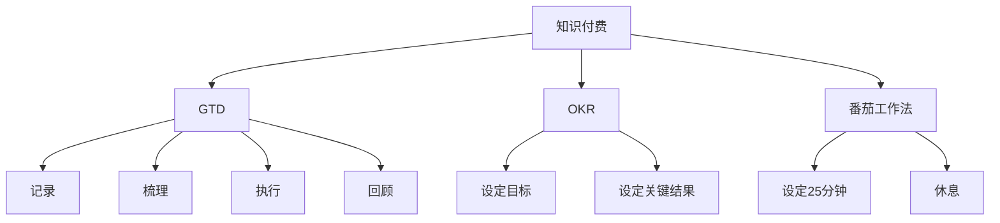

                 

# 知识付费创业中的时间管理技巧

## 1. 背景介绍

在知识付费的时代，创业者的竞争已经从产品竞争转为时间竞争。如何在有限的时间内创造出更多的价值，是每个创业者都必须面对的问题。本文将深入探讨知识付费创业中的时间管理技巧，通过理论分析与实际案例相结合的方式，帮助创业者最大化利用时间，提升生产力，实现高效创业。

## 2. 核心概念与联系

### 2.1 核心概念概述

**知识付费**：指用户为获取知识或技能而支付费用的商业模式。它将传统的信息传播方式转化为商品交易，用户通过付费获取专业知识、技能或资讯，以满足自身成长和需求。

**时间管理**：指通过有效计划和安排时间，以提高生产力和工作效率，达成既定目标的过程。时间管理是创业成功的重要因素之一，有效的管理时间可以优化工作流程，提高工作质量，降低压力。

**GTD（Getting Things Done）**：一种时间管理方法，通过记录、梳理、执行、回顾等步骤，帮助人们高效处理工作和生活任务。

**OKR（Objectives and Key Results）**：一种目标管理方法，通过设定明确的目标和关键结果，引导团队和个人聚焦重要事项，提升执行效率。

**番茄工作法**：一种时间管理技术，通过设定固定时间的工作阶段（通常为25分钟），集中精力完成任务，配以短暂休息，以提升工作专注度和效率。

### 2.2 核心概念原理和架构的 Mermaid 流程图



## 3. 核心算法原理 & 具体操作步骤

### 3.1 算法原理概述

知识付费创业中的时间管理技巧，基于以下基本原理：

1. **GTD**：记录所有任务，按优先级和上下文分类，明确每项任务的执行时间和地点，确保任务不遗漏，同时避免过度分散注意力。

2. **OKR**：设定具体、可量化的目标和关键结果，聚焦于核心任务，提升工作效率和质量。

3. **番茄工作法**：通过固定时间的工作阶段和短暂休息，增强工作专注度和效率，避免疲劳。

4. **优先级管理**：识别和优先处理高价值、高紧急的任务，避免陷入低效的琐碎工作。

5. **时间块划分**：将时间划分为固定的工作块和休息块，确保高效的工作和充足的休息。

### 3.2 算法步骤详解

**Step 1: 记录与梳理任务**

1. **使用GTD工具**：如Trello、Todoist、Notion等，记录所有需要完成的任务。将任务分为项目、子项目、待办事项等不同层级。

2. **按优先级排序**：使用重要紧急矩阵（Eisenhower Box）对任务进行优先级排序，优先处理高优先级任务。

3. **按上下文分类**：将任务按执行时间和地点分类，确保每项任务都有明确的工作环境。

**Step 2: 设定目标与关键结果**

1. **设定OKR目标**：明确当前季度的主要目标和关键结果，如增加用户量、提高课程质量等。

2. **分解目标**：将OKR目标分解为可量化的子目标，设定具体的时间节点和预期成果。

3. **评估与调整**：定期回顾目标完成情况，及时调整策略，确保目标达成。

**Step 3: 执行任务**

1. **使用番茄工作法**：将工作时间分为25分钟的番茄时间和5分钟的休息时间，每4个番茄时间后休息更长时间（如15-30分钟）。

2. **集中注意力**：在番茄时间内，关闭所有可能分散注意力的工具和应用，专注于当前任务。

3. **及时调整**：在执行过程中，及时调整计划，确保任务按时完成。

**Step 4: 回顾与优化**

1. **定期回顾**：每周或每月进行回顾，总结完成任务的效率和质量，评估时间管理策略的有效性。

2. **优化流程**：根据回顾结果，优化GTD流程、OKR设定、番茄工作法使用等，提升时间管理能力。

### 3.3 算法优缺点

**优点**：

1. **提高效率**：通过系统化的时间管理，减少时间浪费，提升工作效率。

2. **增强专注**：番茄工作法帮助集中注意力，减少分心，提升任务完成质量。

3. **明确目标**：OKR设定明确的目标和关键结果，聚焦核心任务，提高工作成效。

4. **灵活调整**：GTD和OKR方法可以根据实际情况灵活调整，适应各种工作场景。

**缺点**：

1. **初期难度大**：初次实施可能需要较长时间适应，初期可能会遇到效率下降的问题。

2. **依赖工具**：需要依赖专业的GTD工具和番茄工作法计时器，增加工具使用成本。

3. **过度僵化**：过度依赖时间管理方法可能导致灵活性不足，无法应对突发情况。

### 3.4 算法应用领域

知识付费创业中的时间管理技巧，广泛应用于以下领域：

1. **内容创作**：优化内容创作流程，提升写作、录制、编辑等环节的效率，确保内容质量。

2. **用户运营**：通过时间管理提升用户互动、课程推广、用户反馈等运营环节的效率，增强用户体验。

3. **团队协作**：确保团队成员高效协作，避免沟通不畅和资源浪费，提升团队整体生产力。

## 4. 数学模型和公式 & 详细讲解 & 举例说明

### 4.1 数学模型构建

设创业时间为 $T$，每天可工作时间为 $W$，每项任务需要的时间为 $t_i$，任务优先级为 $p_i$，采用GTD、OKR、番茄工作法的效率分别为 $g$、$o$、$t$。

任务完成时间模型为：

$$
\text{完成时间} = \sum_{i=1}^n p_i t_i
$$

每天有效工作时间模型为：

$$
\text{有效工作时间} = W \times t
$$

每周任务完成效率模型为：

$$
\text{周任务完成效率} = \frac{\text{完成时间}}{\text{有效工作时间}}
$$

### 4.2 公式推导过程

1. **GTD任务管理模型**：

   根据GTD方法，任务按优先级和上下文分类，优先处理高优先级任务。设每天处理 $n$ 项任务，处理时间分别为 $t_1, t_2, ..., t_n$。优先级分别为 $p_1, p_2, ..., p_n$，则：

   $$
   \text{GTD完成时间} = \sum_{i=1}^n p_i t_i
   $$

2. **OKR目标设定模型**：

   设每周目标数为 $m$，每个目标的关键结果为 $k$，每个关键结果所需时间为 $k_i$，则：

   $$
   \text{OKR完成时间} = \sum_{i=1}^m k_i
   $$

3. **番茄工作法时间管理模型**：

   设每天番茄工作周期为 $T_c = 25$ 分钟，休息时间为 $R_c = 5$ 分钟，每个番茄周期内的任务数为 $n_c$，则：

   $$
   \text{番茄工作法完成时间} = T_c \times n_c
   $$

### 4.3 案例分析与讲解

**案例1: 内容创作**

1. **GTD应用**：记录所有文章创作任务，按优先级排序，按上下文分类，如周二上午9点-12点专注于写作，下午2点-4点专注于编辑。

2. **OKR应用**：设每月增加5篇文章，每篇文章1000字，共需要50小时完成。每周设定完成2篇文章的目标。

3. **番茄工作法应用**：每篇文章分5个番茄周期，每个周期25分钟，共完成1000字。每4个番茄周期后休息15分钟。

**案例2: 用户运营**

1. **GTD应用**：记录所有用户互动任务，如回复评论、处理反馈、发布新内容等，按优先级排序，按上下文分类。

2. **OKR应用**：设每月提高用户活跃度10%，关键结果为增加5000用户、提升用户留存率5%等。

3. **番茄工作法应用**：将用户互动任务分解为小块，如回复评论5分钟、处理反馈10分钟等，每个番茄周期内完成1-2个小任务。

## 5. 项目实践：代码实例和详细解释说明

### 5.1 开发环境搭建

1. **安装GTD工具**：如Trello、Todoist、Notion等，按照官方文档进行安装配置。

2. **安装OKR管理工具**：如Stripe OKR、Aclassmethod等，按照官方文档进行安装配置。

3. **安装番茄工作法计时器**：如Pomodone、Forest等，按照官方文档进行安装配置。

### 5.2 源代码详细实现

**代码示例（伪代码）**：

```python
# 定义GTD任务列表
tasks = [
    {"task": "内容创作", "priority": 5, "context": "周二上午9点-12点"},
    {"task": "用户运营", "priority": 3, "context": "周二下午2点-4点"},
    # 其他任务...
]

# 计算GTD总时间
gtd_total_time = 0
for task in tasks:
    gtd_total_time += task["priority"] * task["time"]

# 设定OKR目标和关键结果
okr_goals = [
    {"goal": "增加用户量", "key_results": ["每月增加5000用户", "提升用户留存率5%"]},
    # 其他目标...
]

# 计算OKR总时间
okr_total_time = 0
for goal in okr_goals:
    for result in goal["key_results"]:
        okr_total_time += result["time"]

# 番茄工作法计时
tomato_cycle = 25
tomato_break = 5
tomato_periods = gtd_total_time // tomato_cycle + 1
tomato_rest_periods = tomato_periods // 4
total_tomato_time = tomato_cycle * tomato_periods
total_tomato_break_time = tomato_break * tomato_rest_periods

# 输出结果
print(f"GTD总时间: {gtd_total_time}小时")
print(f"OKR总时间: {okr_total_time}小时")
print(f"番茄工作法总时间: {total_tomato_time}小时")
print(f"番茄工作法休息时间: {total_tomato_break_time}小时")
```

### 5.3 代码解读与分析

1. **任务列表**：记录所有任务，按优先级和上下文分类，确保每项任务都有明确的工作环境和优先级。

2. **OKR设定**：设定具体、可量化的目标和关键结果，确保每个目标有明确的时间节点和预期成果。

3. **番茄工作法计时**：将工作时间分为25分钟的番茄时间和5分钟的休息时间，每4个番茄周期后休息更长时间，确保高效的工作和充足的休息。

4. **输出结果**：计算GTD总时间、OKR总时间和番茄工作法总时间，评估时间管理策略的有效性。

### 5.4 运行结果展示

通过上述代码，可以输出GTD总时间、OKR总时间和番茄工作法总时间，帮助创业者评估时间管理策略的有效性，并进行优化调整。

## 6. 实际应用场景

### 6.1 内容创作

1. **GTD应用**：记录所有文章创作任务，按优先级排序，按上下文分类，确保每项任务都有明确的工作环境和优先级。

2. **OKR应用**：设每月增加5篇文章，每篇文章1000字，共需要50小时完成。每周设定完成2篇文章的目标。

3. **番茄工作法应用**：每篇文章分5个番茄周期，每个周期25分钟，共完成1000字。每4个番茄周期后休息15分钟。

### 6.2 用户运营

1. **GTD应用**：记录所有用户互动任务，如回复评论、处理反馈、发布新内容等，按优先级排序，按上下文分类。

2. **OKR应用**：设每月提高用户活跃度10%，关键结果为增加5000用户、提升用户留存率5%等。

3. **番茄工作法应用**：将用户互动任务分解为小块，如回复评论5分钟、处理反馈10分钟等，每个番茄周期内完成1-2个小任务。

### 6.3 团队协作

1. **GTD应用**：记录所有团队任务，按优先级排序，按上下文分类，确保每项任务都有明确的工作环境和优先级。

2. **OKR应用**：设每月提升团队效率10%，关键结果为减少会议时间、提高代码质量等。

3. **番茄工作法应用**：将团队任务分解为小块，如代码审查5分钟、问题解决10分钟等，每个番茄周期内完成1-2个小任务。

## 7. 工具和资源推荐

### 7.1 学习资源推荐

1. **《Getting Things Done》**：David Allen所著，系统介绍了GTD方法的原理和实践步骤，适合想要系统掌握时间管理技巧的创业者。

2. **《OKR管理：打造高绩效组织》**：Andy Grove所著，介绍了OKR方法的基本原理和实施步骤，适合想要提升团队目标管理能力的创业者。

3. **《番茄工作法》**：Francesco Cirillo所著，介绍了番茄工作法的原理和应用技巧，适合想要提升工作效率的创业者。

### 7.2 开发工具推荐

1. **Trello**：任务管理工具，适合记录和分类GTD任务，提供可视化的任务板和优先级排序功能。

2. **Todoist**：任务管理工具，适合记录和分类GTD任务，提供优先级、上下文、截止日期等管理功能。

3. **Notion**：任务管理工具，适合记录和分类GTD任务，提供任务追踪、笔记记录、协作编辑等功能。

### 7.3 相关论文推荐

1. **《Knowledge Sharing and Trading as an Informational Market》**：Stuart Fleming等，探讨知识共享和交易的经济模型，适合理解知识付费的经济学基础。

2. **《The Impact of Online Education Platforms on Learning and Teaching》**：José Antonio Fernández-González等，探讨在线教育平台对学习和教学的影响，适合理解知识付费的用户需求。

3. **《The Economics of Knowledge Sharing》**：Lars Svendsen等，探讨知识共享的经济模型，适合理解知识付费的市场行为。

## 8. 总结：未来发展趋势与挑战

### 8.1 研究成果总结

知识付费创业中的时间管理技巧，通过GTD、OKR、番茄工作法等方法，帮助创业者系统化地管理时间，提高工作效率，提升生产力。这些方法已经被广泛应用于各个行业，帮助创业者实现高效创业。

### 8.2 未来发展趋势

1. **自动化管理工具**：随着AI技术的发展，未来可能会出现自动化的GTD、OKR和番茄工作法管理工具，帮助创业者更加高效地进行时间管理。

2. **跨平台集成**：未来的时间管理工具将更加注重跨平台集成，无论在PC端、移动端还是Web端，都能无缝切换，提高使用便捷性。

3. **个性化优化**：未来的时间管理工具将更加注重个性化优化，根据用户的工作习惯和历史数据，提供定制化的管理建议。

### 8.3 面临的挑战

1. **工具依赖**：过度依赖工具可能影响创业者的主观能动性，需要在工具使用和主观能动性之间找到平衡。

2. **数据隐私**：使用工具管理时间可能涉及数据的隐私和安全问题，需要在工具使用过程中注重数据保护。

3. **过度优化**：过度依赖工具可能导致过度优化，忽视了创业过程中的灵活性和随机性，需要在工具使用和灵活性之间找到平衡。

### 8.4 研究展望

未来的时间管理工具，将更加注重个性化、自动化和跨平台集成，帮助创业者更加高效地进行时间管理。同时，工具使用过程中需要注意数据隐私和主观能动性的平衡，确保工具的使用能够真正帮助创业者实现高效创业。

## 9. 附录：常见问题与解答

**Q1：如何选择合适的GTD工具？**

A: 选择GTD工具需要考虑以下几个因素：
1. **功能全面性**：选择功能全面、支持多种任务类型的工具，如Trello、Todoist等。
2. **使用便捷性**：选择界面友好、使用便捷的工具，如Notion、Trello等。
3. **数据安全**：选择数据安全、支持云同步的工具，如Notion、Trello等。

**Q2：如何使用OKR设定目标？**

A: 使用OKR设定目标需要遵循以下几个步骤：
1. **设定明确目标**：目标应具体、可量化，如“增加用户量”、“提升客户满意度”等。
2. **分解关键结果**：将目标分解为可量化的关键结果，如“每月增加5000用户”、“提升客户满意度10%”等。
3. **设定时间节点**：设定每个关键结果的时间节点，如“3个月内完成”等。
4. **定期回顾**：定期回顾目标和关键结果的完成情况，及时调整策略。

**Q3：如何高效使用番茄工作法？**

A: 高效使用番茄工作法需要遵循以下几个步骤：
1. **设定固定时间**：设定固定的番茄时间和休息时间，如25分钟工作、5分钟休息。
2. **关闭干扰源**：在工作时间内关闭所有可能分散注意力的工具和应用，确保集中注意力。
3. **休息时放松**：在休息时间内进行放松活动，如伸展、走动、深呼吸等，恢复精力。
4. **定期回顾**：定期回顾使用番茄工作法的效果，及时调整策略，确保高效工作。

**Q4：如何在时间管理中保持灵活性？**

A: 在时间管理中保持灵活性需要遵循以下几个原则：
1. **优先处理高价值任务**：识别和优先处理高价值、高紧急的任务，避免陷入低效的琐碎工作。
2. **定期回顾**：定期回顾时间管理策略的有效性，及时调整计划，确保适应变化。
3. **保留部分自由时间**：保留部分自由时间，用于处理突发事件和灵活应对变化。

**Q5：如何在时间管理中保持动力？**

A: 在时间管理中保持动力需要遵循以下几个原则：
1. **设定明确目标**：设定具体、可量化的目标，增强动力和方向感。
2. **定期奖励自己**：在达成目标后，及时给予自己奖励，如休息、娱乐等，增强动力。
3. **寻找志同道合者**：与志同道合者一起工作和学习，互相激励，增强动力。

---

作者：禅与计算机程序设计艺术 / Zen and the Art of Computer Programming

