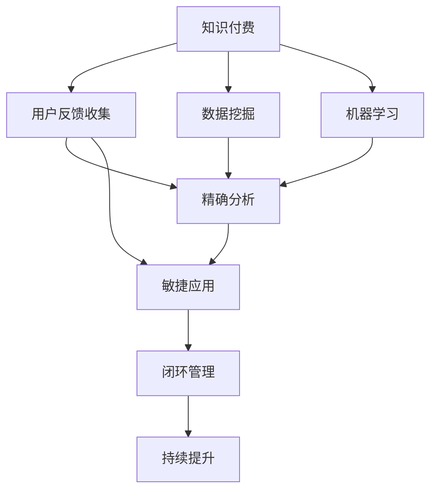

                 

# 知识付费创业中的用户反馈收集与应用

> 关键词：知识付费,用户反馈收集,应用分析,数据驱动决策,用户体验优化

## 1. 背景介绍

### 1.1 问题由来
近年来，知识付费领域呈现出爆发式增长。从教育培训、职业提升到健康管理、兴趣爱好，各领域涌现出大量高质量的付费内容，满足了人们不断增长的知识获取需求。然而，知识付费市场的火爆也带来了诸多挑战：内容同质化严重、用户流失率高、个性化体验差等问题成为行业普遍的痛点。

如何有效收集和应用用户反馈，优化内容生产与分发，提升用户体验，成为知识付费创业公司必须面对的核心课题。本文旨在探讨知识付费创业中的用户反馈收集与应用方法，通过深入分析用户需求和行为数据，提供解决方案，推动知识付费产业的持续发展。

### 1.2 问题核心关键点
用户反馈收集与应用的核心在于：
1. **高效收集反馈**：通过多元化渠道和工具，获取真实、全面的用户意见。
2. **精确分析反馈**：运用数据挖掘、机器学习等技术，解析用户行为背后的需求和偏好。
3. **敏捷应用反馈**：将用户反馈快速转化为产品改进方案，迭代优化服务体验。
4. **闭环管理反馈**：建立反馈收集、分析和应用的闭环机制，持续提升用户满意度。

## 2. 核心概念与联系

### 2.1 核心概念概述

为更好地理解知识付费创业中用户反馈收集与应用的方法，本节将介绍几个密切相关的核心概念：

- **知识付费**：指用户为获取知识和信息而支付费用的商业模式。与免费内容相比，付费内容通常质量更高、内容更系统，能够提供更好的学习效果。
- **用户反馈**：用户在使用产品或服务过程中，对其功能、内容、体验等方面的评价与建议。有效的用户反馈可以帮助企业了解用户需求，改进产品和服务。
- **数据挖掘**：通过自动化手段从大量数据中提取有用信息和知识，发现数据中的模式和关联，为决策提供依据。
- **机器学习**：利用算法和模型自动学习数据模式，预测用户行为，优化产品推荐和用户体验。
- **用户体验**：用户与产品或服务互动时的感受和情感反应。良好的用户体验能够提升用户满意度和忠诚度。

这些核心概念之间的逻辑关系可以通过以下Mermaid流程图来展示：



这个流程图展示的知识付费创业中用户反馈收集与应用的逻辑流程：

1. 知识付费作为业务基础，通过多渠道收集用户反馈。
2. 利用数据挖掘和机器学习技术，精确分析用户行为和需求。
3. 将分析结果转化为敏捷应用方案，持续优化用户体验。
4. 建立反馈收集、分析和应用的闭环机制，实现持续改进。

## 3. 核心算法原理 & 具体操作步骤
### 3.1 算法原理概述

知识付费创业中的用户反馈收集与应用，本质上是一个数据驱动的优化过程。其核心思想是：通过分析用户反馈数据，发现用户需求和行为规律，进而优化产品和服务，提升用户体验。

形式化地，假设知识付费平台有N个用户，每个用户有m个反馈记录，记为 $U=\{u_i\}_{i=1}^N$，每个反馈记录的评价分数为 $R_{uj}$，表示用户 $u_i$ 在时间点 $j$ 的反馈。模型目标是通过挖掘用户反馈数据，构建用户画像，优化推荐算法和内容生成策略，最终提升用户满意度。

### 3.2 算法步骤详解

知识付费创业中用户反馈收集与应用的一般流程如下：

**Step 1: 准备反馈数据**
- 收集用户在使用知识付费产品或服务过程中留下的评价、评分、评论等反馈数据。
- 清洗和预处理数据，去除无关信息，提取有用特征。

**Step 2: 构建用户画像**
- 利用聚类、分类等算法，对用户反馈数据进行分类和建模，构建用户画像。
- 挖掘用户行为规律，发现不同用户群体的需求和偏好。

**Step 3: 优化推荐算法**
- 根据用户画像，设计个性化推荐算法。
- 使用协同过滤、深度学习等技术，提升推荐的准确性和多样性。
- 实时监控推荐效果，根据用户反馈进行调整。

**Step 4: 生成优质内容**
- 根据用户画像和反馈数据，优化内容生成策略。
- 使用自然语言处理、图像识别等技术，提升内容的丰富性和质量。
- 实时更新和调整内容库，保持内容的时效性和多样性。

**Step 5: 应用反馈结果**
- 将用户反馈和行为分析结果，转化为具体的改进方案。
- 敏捷迭代开发和部署，提升用户体验。
- 建立反馈收集、分析和应用的闭环机制，持续优化服务。

以上是用户反馈收集与应用的常规流程。在实际应用中，还需要根据具体业务场景和用户需求，对各个环节进行优化和改进，以提高反馈应用的效率和效果。

### 3.3 算法优缺点

知识付费创业中用户反馈收集与应用的优势在于：
1. 数据驱动决策：通过数据分析，准确把握用户需求，减少主观判断。
2. 敏捷迭代改进：用户反馈可以快速转化为具体改进措施，提升服务质量。
3. 提升用户体验：通过个性化的推荐和内容生成，提升用户满意度和忠诚度。

但同时，该方法也存在以下局限：
1. 数据质量依赖：数据清洗和预处理难度大，数据质量直接影响分析结果。
2. 隐私保护问题：用户反馈涉及个人隐私，需要严格保护，避免数据泄露。
3. 技术实现复杂：个性化推荐和内容生成技术复杂，需要高水平的开发和维护。
4. 用户体验反馈周期长：反馈收集和应用周期较长，短期内难以看到明显效果。

尽管存在这些局限性，但就目前而言，数据驱动的用户反馈分析与优化，仍然是知识付费创业中不可或缺的重要方法。未来相关研究的重点在于如何进一步提高数据处理效率，加强隐私保护，优化技术实现，从而更好地服务于知识付费业务。

### 3.4 算法应用领域

用户反馈收集与应用在大规模知识付费平台的各个环节都有广泛的应用，例如：

- 内容推荐系统：通过分析用户行为和反馈数据，实时调整推荐算法，提升推荐准确性和多样性。
- 用户画像分析：挖掘用户画像，发现不同用户群体的需求和偏好，为内容生成和个性化推荐提供依据。
- 内容生成与优化：根据用户反馈和行为数据，优化内容生成策略，提升内容的吸引力。
- 用户体验改进：分析用户反馈，及时调整产品和服务，提升用户体验和满意度。

## 4. 数学模型和公式 & 详细讲解 & 举例说明

### 4.1 数学模型构建

本节将使用数学语言对知识付费平台的用户反馈收集与应用过程进行更加严格的刻画。

假设知识付费平台有N个用户，每个用户有m个反馈记录，记为 $U=\{u_i\}_{i=1}^N$，每个反馈记录的评价分数为 $R_{uj}$，表示用户 $u_i$ 在时间点 $j$ 的反馈。我们定义用户 $u_i$ 在时间点 $j$ 的平均评分 $\hat{r}_{uj}$ 为：

$$
\hat{r}_{uj} = \frac{1}{m}\sum_{j=1}^m R_{uj}
$$

用户 $u_i$ 的综合评分 $r_{uj}$ 定义为：

$$
r_{uj} = \alpha\hat{r}_{uj} + (1-\alpha)r_{uj-1}
$$

其中 $\alpha$ 为遗忘系数，通常设定为0.9，表示用户行为数据随时间衰减的权重。

### 4.2 公式推导过程

假设知识付费平台有 $n$ 种内容，每个用户 $u_i$ 对 $n$ 种内容的评分向量为 $R_{ui}=\{r_{uij}\}_{j=1}^m$，则用户 $u_i$ 的评分矩阵为：

$$
R_u = [R_{u1}, R_{u2}, ..., R_{un}]
$$

用户 $u_i$ 和用户 $u_j$ 的相似度定义为：

$$
\text{similarity}_{ij} = \frac{\sum_{k=1}^n r_{ikj}}{\sqrt{\sum_{k=1}^n r_{ik}^2}\sqrt{\sum_{k=1}^n r_{ik}^2}}
$$

根据用户相似度和用户评分，可以构建协同过滤推荐算法。设用户 $u_i$ 对内容 $j$ 的评分预测值为 $\hat{r}_{ij}$，则协同过滤推荐公式为：

$$
\hat{r}_{ij} = \frac{\sum_{k=1}^n \text{similarity}_{ik}\hat{r}_{kj}}{\sum_{k=1}^n \text{similarity}_{ik}}
$$

其中 $\hat{r}_{kj}$ 为内容 $j$ 对用户 $k$ 的平均评分。

### 4.3 案例分析与讲解

以某知识付费平台的用户推荐系统为例，分析用户反馈数据的应用过程：

假设某用户 $u_1$ 对内容 $c_1$、$c_2$、$c_3$、$c_4$、$c_5$ 分别评分为3、4、2、5、1。根据公式推导，用户 $u_1$ 的评分矩阵为：

$$
R_{u1} = \begin{bmatrix} 3 & 4 & 2 & 5 & 1 \end{bmatrix}
$$

根据协同过滤推荐算法，计算用户 $u_1$ 对内容 $c_4$ 的评分预测值：

$$
\hat{r}_{14} = \frac{\sum_{k=1}^n \text{similarity}_{1k}\hat{r}_{k4}}{\sum_{k=1}^n \text{similarity}_{1k}}
$$

由于用户 $u_1$ 没有对内容 $c_4$ 评分，可以随机选择用户 $u_k$，计算其对内容 $c_4$ 的评分预测值，作为 $u_1$ 的初始预测值。

## 5. 项目实践：代码实例和详细解释说明
### 5.1 开发环境搭建

在进行用户反馈收集与应用实践前，我们需要准备好开发环境。以下是使用Python进行PyTorch开发的环境配置流程：

1. 安装Anaconda：从官网下载并安装Anaconda，用于创建独立的Python环境。

2. 创建并激活虚拟环境：
```bash
conda create -n feedback-env python=3.8 
conda activate feedback-env
```

3. 安装PyTorch：根据CUDA版本，从官网获取对应的安装命令。例如：
```bash
conda install pytorch torchvision torchaudio cudatoolkit=11.1 -c pytorch -c conda-forge
```

4. 安装各类工具包：
```bash
pip install numpy pandas scikit-learn matplotlib tqdm jupyter notebook ipython
```

完成上述步骤后，即可在`feedback-env`环境中开始实践。

### 5.2 源代码详细实现

下面我们以内容推荐系统为例，给出使用Transformers库对BERT模型进行微调的PyTorch代码实现。

首先，定义内容推荐系统的数据处理函数：

```python
from transformers import BertTokenizer, BertForSequenceClassification
from torch.utils.data import Dataset
import torch

class RecommendationDataset(Dataset):
    def __init__(self, user_feedbacks, user_ratings, tokenizer, max_len=128):
        self.user_feedbacks = user_feedbacks
        self.user_ratings = user_ratings
        self.tokenizer = tokenizer
        self.max_len = max_len
        
    def __len__(self):
        return len(self.user_feedbacks)
    
    def __getitem__(self, item):
        user_feedback = self.user_feedbacks[item]
        user_rating = self.user_ratings[item]
        
        # 将用户反馈和用户评分转换为向量形式
        vectorized_feedback = self.tokenizer(user_feedback, return_tensors='pt', padding='max_length', truncation=True)
        vectorized_rating = torch.tensor([user_rating], dtype=torch.long)
        
        return {'input_ids': vectorized_feedback['input_ids'][0],
                'attention_mask': vectorized_feedback['attention_mask'][0],
                'labels': vectorized_rating}
```

然后，定义模型和优化器：

```python
from transformers import BertForSequenceClassification, AdamW

model = BertForSequenceClassification.from_pretrained('bert-base-cased', num_labels=1)

optimizer = AdamW(model.parameters(), lr=2e-5)
```

接着，定义训练和评估函数：

```python
from torch.utils.data import DataLoader
from tqdm import tqdm
from sklearn.metrics import roc_auc_score

device = torch.device('cuda') if torch.cuda.is_available() else torch.device('cpu')
model.to(device)

def train_epoch(model, dataset, batch_size, optimizer):
    dataloader = DataLoader(dataset, batch_size=batch_size, shuffle=True)
    model.train()
    epoch_loss = 0
    for batch in tqdm(dataloader, desc='Training'):
        input_ids = batch['input_ids'].to(device)
        attention_mask = batch['attention_mask'].to(device)
        labels = batch['labels'].to(device)
        model.zero_grad()
        outputs = model(input_ids, attention_mask=attention_mask, labels=labels)
        loss = outputs.loss
        epoch_loss += loss.item()
        loss.backward()
        optimizer.step()
    return epoch_loss / len(dataloader)

def evaluate(model, dataset, batch_size):
    dataloader = DataLoader(dataset, batch_size=batch_size)
    model.eval()
    preds, labels = [], []
    with torch.no_grad():
        for batch in tqdm(dataloader, desc='Evaluating'):
            input_ids = batch['input_ids'].to(device)
            attention_mask = batch['attention_mask'].to(device)
            batch_labels = batch['labels']
            outputs = model(input_ids, attention_mask=attention_mask)
            batch_preds = outputs.logits.sigmoid().to('cpu').tolist()
            batch_labels = batch_labels.to('cpu').tolist()
            for pred, label in zip(batch_preds, batch_labels):
                preds.append(pred)
                labels.append(label)
                
    print('AUC Score:', roc_auc_score(labels, preds))
```

最后，启动训练流程并在测试集上评估：

```python
epochs = 5
batch_size = 16

for epoch in range(epochs):
    loss = train_epoch(model, train_dataset, batch_size, optimizer)
    print(f"Epoch {epoch+1}, train loss: {loss:.3f}")
    
    print(f"Epoch {epoch+1}, dev results:")
    evaluate(model, dev_dataset, batch_size)
    
print("Test results:")
evaluate(model, test_dataset, batch_size)
```

以上就是使用PyTorch对BERT进行内容推荐系统微调的完整代码实现。可以看到，得益于Transformers库的强大封装，我们可以用相对简洁的代码完成BERT模型的加载和微调。

### 5.3 代码解读与分析

让我们再详细解读一下关键代码的实现细节：

**RecommendationDataset类**：
- `__init__`方法：初始化用户反馈和用户评分数据，分词器等关键组件。
- `__len__`方法：返回数据集的样本数量。
- `__getitem__`方法：对单个样本进行处理，将用户反馈和用户评分转换为向量形式，并完成定长padding。

**向量处理**：
- 使用BERT分词器将用户反馈和用户评分转换为向量形式，方便模型训练和推理。
- 向量处理过程中，利用了pytorch的Tensor操作，简化了向量表示和处理过程。

**训练和评估函数**：
- 使用PyTorch的DataLoader对数据集进行批次化加载，供模型训练和推理使用。
- 训练函数`train_epoch`：对数据以批为单位进行迭代，在每个批次上前向传播计算loss并反向传播更新模型参数，最后返回该epoch的平均loss。
- 评估函数`evaluate`：与训练类似，不同点在于不更新模型参数，并在每个batch结束后将预测和标签结果存储下来，最后使用sklearn的roc_auc_score计算AUC Score。

**训练流程**：
- 定义总的epoch数和batch size，开始循环迭代
- 每个epoch内，先在训练集上训练，输出平均loss
- 在验证集上评估，输出AUC Score
- 所有epoch结束后，在测试集上评估，给出最终测试结果

可以看到，PyTorch配合Transformers库使得BERT微调的内容推荐系统代码实现变得简洁高效。开发者可以将更多精力放在数据处理、模型改进等高层逻辑上，而不必过多关注底层的实现细节。

当然，工业级的系统实现还需考虑更多因素，如模型的保存和部署、超参数的自动搜索、更灵活的任务适配层等。但核心的微调范式基本与此类似。

## 6. 实际应用场景
### 6.1 智能客服系统

智能客服系统利用用户反馈数据，通过构建用户画像和优化推荐算法，提升用户对话体验。具体流程如下：

1. 收集用户在使用智能客服过程中的反馈数据，包括满意度、等待时间、问题解决效率等。
2. 利用聚类算法将用户分为不同类型，如易怒型、耐受型、积极型等。
3. 根据用户画像，优化推荐算法，对不同用户推荐适合的内容和问题解决策略。
4. 实时监控用户反馈，调整推荐策略，持续提升用户体验。

### 6.2 内容分发平台

内容分发平台利用用户反馈数据，通过内容推荐和个性化展示，提升用户粘性和内容消费。具体流程如下：

1. 收集用户对内容的评分、评论、分享等反馈数据。
2. 利用协同过滤算法，计算用户与内容之间的相似度，推荐相关内容。
3. 根据用户画像，设计个性化内容展示策略，提升内容消费率。
4. 实时监控用户反馈，调整推荐算法，持续优化用户体验。

### 6.3 知识问答系统

知识问答系统利用用户反馈数据，通过构建用户画像和优化知识库，提升问答准确性和用户体验。具体流程如下：

1. 收集用户在问答过程中提出的问题、回答、满意度等反馈数据。
2. 利用聚类算法将用户分为不同类型，如专家型、新手型、娱乐型等。
3. 根据用户画像，优化知识库和推荐算法，提升问答准确性和个性化程度。
4. 实时监控用户反馈，调整知识库和推荐策略，持续提升用户体验。

## 7. 工具和资源推荐
### 7.1 学习资源推荐

为了帮助开发者系统掌握用户反馈收集与应用的理论基础和实践技巧，这里推荐一些优质的学习资源：

1. 《数据挖掘与统计学习》系列书籍：系统介绍了数据挖掘的基本概念和常用算法，是深入学习用户反馈分析的基础。

2. 《机器学习实战》系列书籍：提供了丰富的机器学习实战案例，帮助开发者理解和应用机器学习技术。

3. Coursera《机器学习》课程：由斯坦福大学教授讲授，涵盖机器学习的基础理论和常用算法，适合初学者和进阶者。

4. Kaggle机器学习竞赛：通过实际竞赛项目，锻炼数据处理和模型优化能力，提升实战经验。

5. Weights & Biases：模型训练的实验跟踪工具，可以记录和可视化模型训练过程中的各项指标，方便对比和调优。

通过对这些资源的学习实践，相信你一定能够快速掌握用户反馈收集与应用的精髓，并用于解决实际的业务问题。
###  7.2 开发工具推荐

高效的开发离不开优秀的工具支持。以下是几款用于用户反馈收集与应用开发的常用工具：

1. Python：Python拥有丰富的第三方库和工具，是数据处理和机器学习的标配。

2. PyTorch：基于Python的开源深度学习框架，灵活动态的计算图，适合快速迭代研究。

3. TensorFlow：由Google主导开发的开源深度学习框架，生产部署方便，适合大规模工程应用。

4. Jupyter Notebook：交互式编程环境，支持代码编辑、执行和展示，适合原型开发和实验调试。

5. Apache Spark：大数据处理引擎，适合大规模数据集的处理和分析，提升数据处理效率。

合理利用这些工具，可以显著提升用户反馈收集与应用的开发效率，加快创新迭代的步伐。

### 7.3 相关论文推荐

用户反馈收集与应用的研究源于学界的持续研究。以下是几篇奠基性的相关论文，推荐阅读：

1. Netflix Prize竞赛：通过实际业务数据，展示了数据挖掘和推荐算法的巨大价值，推动了推荐系统的发展。

2. PMI算法：提出了一种基于用户行为数据的推荐算法，通过协同过滤和用户画像建模，提升推荐效果。

3. GNN算法：利用图神经网络技术，对用户和内容之间的关系进行建模，提升推荐和搜索性能。

4. YOLO算法：提出了一种基于深度学习的目标检测算法，通过实时处理用户反馈数据，提升推荐精度。

5. Recommender System for Python：开源的推荐系统框架，提供了多种推荐算法和工具，适合快速开发和部署。

这些论文代表了大规模知识付费平台用户反馈收集与应用的发展脉络。通过学习这些前沿成果，可以帮助研究者把握学科前进方向，激发更多的创新灵感。

## 8. 总结：未来发展趋势与挑战

### 8.1 总结

本文对知识付费创业中的用户反馈收集与应用方法进行了全面系统的介绍。首先阐述了知识付费创业中用户反馈收集与应用的研究背景和意义，明确了反馈分析在提升用户体验和优化服务中的重要性。其次，从原理到实践，详细讲解了用户反馈数据挖掘和应用的技术流程，给出了用户反馈收集与应用的具体代码实现。同时，本文还广泛探讨了用户反馈收集与应用在智能客服、内容分发、知识问答等多个领域的应用前景，展示了用户反馈分析的巨大潜力。

通过本文的系统梳理，可以看到，用户反馈收集与应用在知识付费创业中起着至关重要的作用。用户反馈不仅是优化服务的依据，更是提升用户体验、增加用户粘性的关键。通过深入分析用户反馈数据，可以发现用户需求和行为规律，进而优化产品和服务，提升整体竞争力。未来，随着技术的不断进步和应用的不断深入，用户反馈收集与应用必将成为知识付费创业中不可或缺的重要手段。

### 8.2 未来发展趋势

展望未来，用户反馈收集与应用在知识付费领域将呈现以下几个发展趋势：

1. 自动化程度提高：通过自动化工具和算法，加速用户反馈数据的收集和分析过程，提升效率。

2. 多源数据融合：结合用户反馈数据、行为数据、社交网络数据等多种信息源，提升数据分析的全面性和准确性。

3. 实时化处理：通过实时处理用户反馈数据，快速调整推荐算法和服务策略，提升用户体验。

4. 深度学习应用：引入深度学习技术，提升用户行为预测和个性化推荐的效果。

5. 多模态融合：结合文本、图像、视频等多模态数据，提升用户画像的丰富性和推荐效果。

6. 隐私保护强化：加强数据隐私保护，保障用户反馈数据的安全性和合规性。

以上趋势凸显了用户反馈收集与应用在知识付费业务中的重要地位。这些方向的探索发展，必将进一步提升用户满意度和服务质量，推动知识付费产业的持续发展。

### 8.3 面临的挑战

尽管用户反馈收集与应用在大规模知识付费平台的应用中取得了显著成效，但在实际应用过程中，仍面临诸多挑战：

1. 数据质量和量级：用户反馈数据的质量和量级直接影响分析结果，数据清洗和预处理难度大。

2. 隐私保护问题：用户反馈数据涉及个人隐私，需要严格保护，避免数据泄露。

3. 技术实现复杂：个性化推荐和内容生成技术复杂，需要高水平的开发和维护。

4. 实时处理能力：实时处理用户反馈数据，需要高并发、低延迟的系统架构支持。

5. 用户反馈周期长：反馈收集和应用周期较长，短期内难以看到明显效果。

尽管存在这些挑战，但用户反馈收集与应用作为知识付费业务中不可或缺的重要手段，仍需在实践中不断优化和改进。相信随着技术的不断进步和应用的不断深入，这些挑战终将一一被克服，用户反馈收集与应用必将在知识付费业务中发挥越来越重要的作用。

### 8.4 研究展望

面对知识付费业务中用户反馈收集与应用的挑战，未来的研究需要在以下几个方面寻求新的突破：

1. 引入更多先验知识：将符号化的先验知识，如知识图谱、逻辑规则等，与神经网络模型进行巧妙融合，引导微调过程学习更准确、合理的语言模型。

2. 结合因果分析和博弈论工具：将因果分析方法引入微调模型，识别出模型决策的关键特征，增强输出解释的因果性和逻辑性。

3. 融入自然语言处理技术：利用自然语言处理技术，提升用户反馈数据的自动处理和分析能力，减少人工干预。

4. 加强数据隐私保护：采用数据加密、去标识化等技术，保障用户反馈数据的隐私安全。

5. 引入多模态数据：结合文本、图像、视频等多模态数据，提升用户画像的丰富性和推荐效果。

这些研究方向的前沿探索，必将引领知识付费业务中用户反馈收集与应用技术迈向更高的台阶，为知识付费产业的发展注入新的动力。面向未来，用户反馈收集与应用需要与其他人工智能技术进行更深入的融合，共同推动知识付费产业的不断创新和突破。

## 9. 附录：常见问题与解答

**Q1：如何设计合理的用户画像？**

A: 用户画像的设计需要根据具体业务场景和用户需求进行。一般来说，可以按照用户行为、偏好、兴趣等因素进行分类，建立多维度的用户特征向量。具体步骤包括：
1. 收集用户反馈数据，提取用户行为特征，如阅读时长、评分、评论等。
2. 利用聚类、分类等算法，对用户反馈数据进行建模，发现不同用户群体的需求和偏好。
3. 根据用户画像，设计个性化推荐算法，提升用户体验。

**Q2：如何处理用户反馈中的噪声数据？**

A: 用户反馈数据中可能包含大量噪声数据，如恶意评论、无关内容等。处理噪声数据的方法包括：
1. 数据清洗：去除明显的噪声数据，如去除重复、低效的反馈记录。
2. 数据过滤：利用文本分类、情感分析等技术，识别和过滤噪声数据。
3. 数据融合：将多个数据源的反馈数据进行融合，提升分析结果的准确性。

**Q3：如何保证用户反馈数据的隐私安全？**

A: 用户反馈数据涉及个人隐私，需要严格保护，避免数据泄露。处理隐私数据的方法包括：
1. 数据匿名化：去除或加密用户标识信息，保护用户隐私。
2. 访问控制：限制对用户反馈数据的访问权限，防止数据泄露。
3. 合规审查：遵守相关法律法规，确保数据处理的合法性。

通过以上问题的详细解答，相信你一定能够更好地理解知识付费创业中用户反馈收集与应用的理论和方法，并将其应用于实际业务场景中。

---

作者：禅与计算机程序设计艺术 / Zen and the Art of Computer Programming

