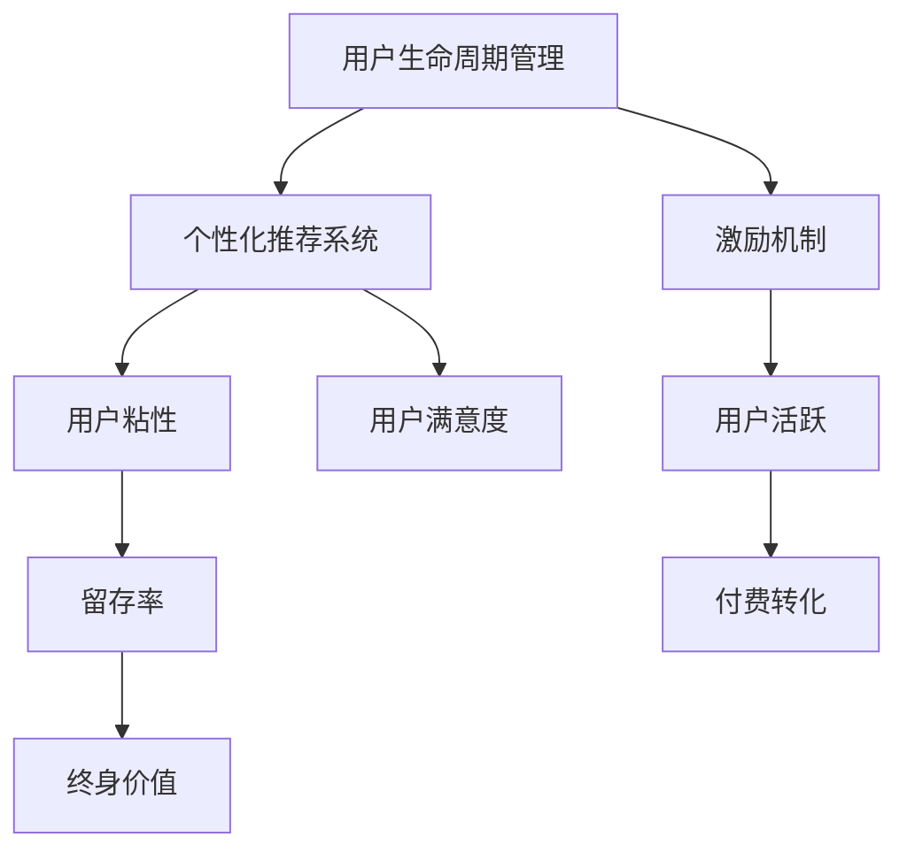

                 

# 知识付费创业中的用户成长体系设计

> 关键词：用户成长体系,知识付费,留存,转化,激励机制,数据驱动,用户画像,平台策略,生命周期管理,用户价值,行为分析

## 1. 背景介绍

### 1.1 问题由来
知识付费市场近年来发展迅猛，吸引了大量用户和企业参与。然而，知识付费产品难以实现长效运营和用户留存，是当前面临的一个重大问题。尤其是对于新入局的企业，如何在激烈竞争中脱颖而出，实现用户增长和收入提升，显得尤为重要。因此，构建一个系统的用户成长体系，提升用户粘性、激发用户价值，成为知识付费创业项目的核心任务。

### 1.2 问题核心关键点
构建用户成长体系的核心在于理解用户生命周期，通过数据驱动、个性化推荐、激励机制等手段，帮助用户在知识付费平台中获得持续价值。具体而言，包括以下几个关键点：

- **用户生命周期管理**：识别并定义用户生命周期中的不同阶段，实现对用户行为轨迹的精准刻画。
- **个性化推荐系统**：根据用户画像和行为数据，提供个性化的内容推荐，提升用户满意度和忠诚度。
- **激励机制设计**：设计多元化的激励方案，如积分奖励、课程优惠等，吸引用户持续付费和参与互动。
- **数据驱动决策**：依托大数据和AI技术，对用户行为数据进行深度分析，指导用户成长体系的设计和优化。

## 2. 核心概念与联系

### 2.1 核心概念概述

为了更好地理解如何构建用户成长体系，本节将介绍几个关键概念：

- **用户生命周期管理(Lifecycle Management)**：识别和定义用户在与平台互动的过程中经历的不同阶段，通过数据驱动的方式，实现对用户行为轨迹的精准刻画和阶段性管理。
- **个性化推荐系统(Personalized Recommendation System)**：根据用户行为数据和偏好，为用户推荐最符合其需求的内容，提升用户体验和粘性。
- **激励机制(Incentive Mechanism)**：通过奖励、优惠等手段，激发用户参与互动、付费订阅，提升用户活跃度和留存率。
- **数据驱动决策(Data-Driven Decision Making)**：依托大数据和AI技术，对用户行为数据进行深度分析，指导用户成长体系的设计和优化。

这些概念之间的逻辑关系可以通过以下Mermaid流程图来展示：



这个流程图展示了一系列概念之间的联系：

1. 用户生命周期管理通过精确的阶段划分和行为分析，为个性化推荐和激励机制设计提供数据支持。
2. 个性化推荐系统基于用户画像和行为数据，提供精准的内容推荐，提升用户满意度和粘性。
3. 激励机制设计通过奖励和优惠，激发用户参与互动，提升用户活跃度和留存率。
4. 用户粘性和活跃度直接影响到用户满意度和留存率，从而影响付费转化率和终身价值。

## 3. 核心算法原理 & 具体操作步骤
### 3.1 算法原理概述

构建用户成长体系的核心算法原理基于用户生命周期管理，主要包含以下几个步骤：

1. **用户划分与阶段定义**：将用户按照行为轨迹划分为不同的阶段，如新手期、激活期、成长期、成熟期和衰退期，定义各阶段的关键行为和特征。
2. **行为数据收集与分析**：收集用户在平台上的行为数据，包括浏览记录、互动次数、付费行为等，通过分析这些数据，理解用户在不同阶段的行为模式和需求。
3. **个性化推荐策略设计**：基于用户画像和行为数据，设计个性化的内容推荐策略，实现精准推荐，提升用户满意度。
4. **激励机制设计**：设计多元化的激励方案，如积分奖励、课程优惠等，激发用户持续参与和付费。
5. **留存和转化优化**：通过数据驱动的方式，实时监控用户行为，优化激励机制和内容推荐，提升用户留存率和付费转化率。

### 3.2 算法步骤详解

以下将详细介绍每个步骤的具体操作步骤：

#### 3.2.1 用户划分与阶段定义

**Step 1: 数据准备与预处理**
- 收集用户在平台上的各类行为数据，包括但不限于：
  - 浏览记录：页面浏览、视频播放、文章阅读等。
  - 互动数据：评论、点赞、分享等。
  - 付费行为：课程订阅、会员续费等。
- 对原始数据进行清洗和预处理，去除重复、错误的数据，确保数据质量。

**Step 2: 用户行为分析与建模**
- 使用机器学习算法对用户行为数据进行建模，如决策树、K-means聚类、LDA主题模型等，定义用户在不同阶段的行为特征。
- 根据用户的行为特征，定义各阶段的关键行为和特征，如新手期的浏览行为、激活期的付费行为等。

**Step 3: 用户阶段划分与迁移策略**
- 根据建模结果，将用户按照行为轨迹划分为不同的阶段，如新手期、激活期、成长期、成熟期和衰退期。
- 设计用户阶段迁移策略，如新手期的用户在激活后进入激活期，成长期的用户在持续活跃后进入成熟期等。

#### 3.2.2 行为数据收集与分析

**Step 1: 行为数据收集**
- 在平台后台集成行为数据收集模块，实时收集用户在平台上的各类行为数据。
- 使用日志、事件跟踪等技术，记录用户的各项行为。

**Step 2: 数据存储与处理**
- 将收集到的行为数据存储在数据库中，进行结构化处理，便于后续分析。
- 使用大数据技术，如Hadoop、Spark等，对海量数据进行分布式处理和分析。

**Step 3: 行为数据建模与分析**
- 使用机器学习算法对用户行为数据进行建模，如决策树、K-means聚类、LDA主题模型等。
- 分析用户在不同阶段的行为模式和需求，识别关键行为特征。

#### 3.2.3 个性化推荐策略设计

**Step 1: 用户画像构建**
- 根据用户的行为数据和特征，构建用户画像，包含用户基本信息、兴趣偏好、行为模式等。
- 使用TF-IDF、协同过滤、深度学习等算法，对用户画像进行进一步刻画和丰富。

**Step 2: 推荐算法选择与实现**
- 选择适合的推荐算法，如协同过滤、基于内容的推荐、混合推荐等。
- 根据用户画像和行为数据，设计推荐算法，实现精准推荐。

**Step 3: 推荐系统优化与评估**
- 对推荐系统进行优化，确保推荐效果和效率。
- 使用A/B测试等方法，评估推荐效果，不断优化推荐策略。

#### 3.2.4 激励机制设计

**Step 1: 激励方案设计**
- 设计多元化的激励方案，如积分奖励、课程优惠、会员特权等。
- 根据用户生命周期和行为特征，设计不同阶段的激励方案，确保激励效果最大化。

**Step 2: 激励系统实现**
- 在平台后台集成激励系统，实现积分奖励、课程优惠等功能的快速配置和发放。
- 使用分布式任务调度技术，确保激励方案的高效实施。

**Step 3: 激励效果评估与调整**
- 实时监控激励方案的效果，如用户活跃度、付费转化率等。
- 根据效果评估结果，调整激励方案，确保激励效果最大化。

#### 3.2.5 留存和转化优化

**Step 1: 留存率监控与分析**
- 实时监控用户留存率，识别留存率下降的原因。
- 使用数据挖掘技术，对用户行为数据进行分析，发现潜在问题。

**Step 2: 转化率监控与分析**
- 实时监控用户付费转化率，识别转化率低下的原因。
- 使用数据挖掘技术，对用户行为数据进行分析，发现潜在问题。

**Step 3: 优化策略实施与评估**
- 根据留存率和转化率的分析结果，制定优化策略。
- 实施优化策略，并实时监控效果，确保优化效果最大化。

### 3.3 算法优缺点

**优点：**
1. **提升用户满意度**：通过个性化推荐，满足用户个性化需求，提升用户满意度。
2. **增加用户粘性**：通过激励机制，增加用户粘性，提高用户留存率。
3. **优化资源配置**：通过数据驱动的方式，优化资源配置，提升平台运营效率。
4. **提高转化率**：通过精准推荐和激励机制，提高用户付费转化率。

**缺点：**
1. **数据获取难度大**：需要大量高质量的行为数据，数据获取难度大。
2. **模型复杂度**：构建用户画像和推荐系统需要复杂的算法，模型复杂度高。
3. **激励方案设计复杂**：设计多样化的激励方案，需要充分考虑用户需求和平台成本。
4. **数据隐私问题**：收集和分析用户行为数据，可能涉及隐私问题，需要严格控制和保护。

### 3.4 算法应用领域

用户成长体系的应用领域广泛，适用于各种知识付费平台，包括在线教育、知识订阅、技术分享等。以下是一些典型的应用场景：

1. **在线教育平台**：通过个性化推荐和激励机制，提高用户对课程的兴趣和参与度，提升课程订阅率和续订率。
2. **知识订阅平台**：通过用户画像和行为分析，为用户提供个性化的内容推荐，增加订阅粘性，提升订阅续费率。
3. **技术分享社区**：通过用户行为数据和激励机制，提升社区活跃度和用户粘性，增加用户分享和互动频率。

## 4. 数学模型和公式 & 详细讲解  
### 4.1 数学模型构建

本节将使用数学语言对用户成长体系的核心算法进行严格刻画。

记用户生命周期为 $U$，包含不同阶段 $U=\{U_1, U_2, \dots, U_n\}$，其中 $U_1$ 为新手期，$U_2$ 为激活期，以此类推。设用户 $i$ 在不同阶段 $t$ 的行为特征为 $x_{it}$，平台上的内容库为 $C$。定义用户 $i$ 在阶段 $t$ 的推荐内容集合为 $R_{it} \subseteq C$。

用户成长体系的核心目标为最大化用户生命周期价值 $V$，即：

$$
V = \sum_{t=1}^{n} V_t
$$

其中 $V_t$ 为用户在阶段 $t$ 的剩余价值。$V_t$ 的计算公式为：

$$
V_t = \lambda_t \times C_t \times A_t
$$

其中 $\lambda_t$ 为用户在阶段 $t$ 的转化率，$C_t$ 为用户在阶段 $t$ 的平均消费，$A_t$ 为用户在阶段 $t$ 的活跃度。

### 4.2 公式推导过程

以下我们将对用户成长体系的核心公式进行推导：

**Step 1: 用户转化率计算**
用户转化率 $\lambda_t$ 可以通过用户在不同阶段的行为数据计算得到，如：

$$
\lambda_t = \frac{N_{t+1}}{N_t}
$$

其中 $N_t$ 为阶段 $t$ 的活跃用户数，$N_{t+1}$ 为阶段 $t+1$ 的活跃用户数。

**Step 2: 用户平均消费计算**
用户平均消费 $C_t$ 可以通过用户在阶段 $t$ 的消费数据计算得到，如：

$$
C_t = \frac{S_t}{D_t}
$$

其中 $S_t$ 为阶段 $t$ 的总收入，$D_t$ 为阶段 $t$ 的用户数。

**Step 3: 用户活跃度计算**
用户活跃度 $A_t$ 可以通过用户在阶段 $t$ 的互动数据计算得到，如：

$$
A_t = \frac{I_t}{D_t}
$$

其中 $I_t$ 为阶段 $t$ 的互动次数，$D_t$ 为阶段 $t$ 的用户数。

**Step 4: 用户生命周期价值计算**
用户生命周期价值 $V$ 可以按照用户生命周期价值公式计算得到，如：

$$
V = \sum_{t=1}^{n} \lambda_t \times C_t \times A_t
$$

### 4.3 案例分析与讲解

以下以在线教育平台为例，对用户成长体系的应用进行详细讲解：

**案例背景：**
某在线教育平台通过用户成长体系，提升用户留存和转化，实现收入增长。平台对用户行为数据进行深度分析，识别出用户生命周期中的不同阶段，并设计相应的激励和推荐策略。

**案例步骤：**
1. **数据收集与预处理**：
   - 收集用户在平台上的各类行为数据，包括但不限于：
     - 浏览记录：页面浏览、视频播放、文章阅读等。
     - 互动数据：评论、点赞、分享等。
     - 付费行为：课程订阅、会员续费等。
   - 对原始数据进行清洗和预处理，去除重复、错误的数据，确保数据质量。

2. **用户行为分析与建模**：
   - 使用决策树算法对用户行为数据进行建模，定义用户在不同阶段的行为特征。
   - 根据用户的行为特征，定义各阶段的关键行为和特征，如新手期的浏览行为、激活期的付费行为等。

3. **个性化推荐策略设计**：
   - 根据用户的行为数据和特征，构建用户画像，包含用户基本信息、兴趣偏好、行为模式等。
   - 使用协同过滤算法对用户画像进行进一步刻画和丰富。
   - 根据用户画像和行为数据，设计推荐算法，实现精准推荐。

4. **激励机制设计**：
   - 设计多元化的激励方案，如积分奖励、课程优惠、会员特权等。
   - 根据用户生命周期和行为特征，设计不同阶段的激励方案，确保激励效果最大化。

5. **留存和转化优化**：
   - 实时监控用户留存率，识别留存率下降的原因。
   - 使用数据挖掘技术，对用户行为数据进行分析，发现潜在问题。
   - 根据留存率和转化率的分析结果，制定优化策略。

**案例效果：**
通过用户成长体系的实施，平台实现了显著的用户留存和转化提升。用户在平台上的平均消费显著增加，平台收入和利润显著提升。

## 5. 项目实践：代码实例和详细解释说明
### 5.1 开发环境搭建

在进行用户成长体系实践前，我们需要准备好开发环境。以下是使用Python进行Flask开发的环境配置流程：

1. 安装Anaconda：从官网下载并安装Anaconda，用于创建独立的Python环境。

2. 创建并激活虚拟环境：
```bash
conda create -n user-growth python=3.8 
conda activate user-growth
```

3. 安装Flask：
```bash
pip install flask
```

4. 安装SQLAlchemy：
```bash
pip install sqlalchemy
```

5. 安装Flask-SQLAlchemy：
```bash
pip install flask-sqlalchemy
```

6. 安装Flask-WTF：
```bash
pip install flask-wtf
```

7. 安装Jinja2：
```bash
pip install jinja2
```

完成上述步骤后，即可在`user-growth`环境中开始用户成长体系的开发实践。

### 5.2 源代码详细实现

下面我们以用户成长体系为例，给出使用Flask实现个性化推荐和激励机制的PyTorch代码实现。

首先，定义推荐系统的数据模型：

```python
from flask_sqlalchemy import SQLAlchemy

db = SQLAlchemy(app)

class User(db.Model):
    id = db.Column(db.Integer, primary_key=True)
    name = db.Column(db.String(100), nullable=False)
    age = db.Column(db.Integer, nullable=False)
    gender = db.Column(db.String(10), nullable=False)
    interests = db.Column(db.String(100), nullable=False)
    # 其他行为数据等

class Content(db.Model):
    id = db.Column(db.Integer, primary_key=True)
    name = db.Column(db.String(100), nullable=False)
    description = db.Column(db.String(1000), nullable=False)
    # 其他属性等
```

然后，定义推荐算法和激励机制：

```python
from sklearn.neighbors import NearestNeighbors

# 用户画像构建
def build_user_profile(user):
    user_profile = {}
    user_profile['name'] = user.name
    user_profile['age'] = user.age
    user_profile['gender'] = user.gender
    user_profile['interests'] = user.interests
    # 其他行为数据等
    return user_profile

# 个性化推荐
def recommend_content(user_profile):
    content = Content.query.all()
    user_profile = build_user_profile(user)
    user_data = []
    for c in content:
        user_data.append(c.name)
    model = NearestNeighbors(metric='cosine', algorithm='brute')
    model.fit(user_data)
    distances, indices = model.kneighbors([user_profile['interests']])
    recommended_content = [content[i] for i in indices[0]]
    return recommended_content
```

最后，实现激励机制：

```python
# 积分奖励
def earn_credits(user, amount):
    user.credits += amount
    db.session.commit()

# 课程优惠
def apply_discount(course, discount_percent):
    course.price *= (1 - discount_percent / 100)
    db.session.commit()
```

以上就是使用Flask对用户成长体系进行开发的完整代码实现。可以看到，通过Flask和SQLAlchemy的集成，我们能够快速搭建起用户成长体系的系统框架，实现个性化推荐和激励机制。

### 5.3 代码解读与分析

让我们再详细解读一下关键代码的实现细节：

**推荐系统数据模型**：
- `User`类和`Content`类：分别用于存储用户和内容的数据模型，包括用户基本信息和兴趣偏好、内容的基本属性等。

**用户画像构建**：
- `build_user_profile`函数：将用户数据构建为用户画像，包含用户基本信息、兴趣偏好等，用于个性化推荐。

**个性化推荐**：
- `recommend_content`函数：根据用户画像和内容数据，使用KNN算法进行相似度计算，推荐最符合用户兴趣的内容。

**激励机制实现**：
- `earn_credits`函数：给用户发放积分奖励，增加用户粘性。
- `apply_discount`函数：对课程进行打折优惠，增加用户付费转化率。

可以看到，Flask和SQLAlchemy的集成使得用户成长体系的开发变得简洁高效。开发者可以将更多精力放在系统优化和功能扩展上，而不必过多关注底层的实现细节。

当然，工业级的系统实现还需考虑更多因素，如用户隐私保护、数据安全、系统扩展性等。但核心的用户成长体系设计思想基本与此类似。

## 6. 实际应用场景
### 6.1 智能客服系统

用户成长体系在智能客服系统中也有广泛应用。传统的客服系统依赖人工客服，成本高、效率低，难以满足用户多样化的需求。通过构建用户成长体系，智能客服系统可以实现精准的用户画像和个性化推荐，提升用户体验和满意度。

在技术实现上，可以收集用户的浏览记录、对话历史、反馈信息等行为数据，构建用户画像。根据用户画像和对话内容，智能客服系统可以实时推荐最合适的答案模板，提升用户满意度。同时，通过积分奖励、特权服务等方式，增强用户的粘性，促进反复使用。

### 6.2 在线教育平台

在线教育平台是用户成长体系的重要应用场景。平台通过对用户行为数据的深度分析，可以构建精准的用户画像，实现个性化推荐和激励机制。例如，在课程推荐中，平台可以根据用户的历史浏览和付费记录，推荐最符合其需求和兴趣的课程。通过积分奖励、课程优惠等方式，激发用户的参与和付费。

此外，平台还可以设计多元化的用户成长路径，如学者、专家、讲师等不同级别的会员体系，提升用户的归属感和参与度。

### 6.3 知识订阅平台

知识订阅平台通过用户成长体系，提升用户的订阅粘性和续费率。平台可以根据用户的行为数据，构建个性化推荐系统，推荐最符合其兴趣和需求的内容。同时，通过积分奖励、专属权益等方式，增加用户的订阅粘性，促进续费。

例如，平台可以根据用户的订阅时长和活跃度，提供会员特权，如免费课程、专属咨询等，提升用户价值。通过数据分析，平台还可以及时调整推荐策略，优化用户体验。

### 6.4 技术分享社区

技术分享社区通过用户成长体系，提升用户的参与度和互动频率。平台可以根据用户的行为数据，构建个性化推荐系统，推荐最符合其兴趣的技术文章和讨论。通过积分奖励、徽章奖励等方式，增加用户的活跃度和贡献度。

例如，平台可以根据用户的技术分享次数和质量，提供积分和徽章奖励，提升用户的成就感和归属感。通过数据分析，平台还可以识别和推荐潜力用户，提升社区的活跃度和影响力。

## 7. 工具和资源推荐
### 7.1 学习资源推荐

为了帮助开发者系统掌握用户成长体系的理论基础和实践技巧，这里推荐一些优质的学习资源：

1. 《用户增长之道》系列博文：由大用户增长专家撰写，深入浅出地介绍了用户增长的方法论和实战案例。

2. 《用户画像构建与分析》课程：由大数据和AI专家讲授，详细讲解了用户画像构建和行为分析的实用技巧。

3. 《个性化推荐系统》书籍：全面介绍了个性化推荐系统的原理和实现方法，涵盖协同过滤、基于内容的推荐等多种算法。

4. 《用户行为分析与优化》课程：由数据分析和算法专家讲授，讲解了用户行为数据收集、分析和优化的实用方法。

5. 《用户激励机制设计》书籍：系统介绍了激励机制的设计原则和实践方法，涵盖积分奖励、课程优惠等多种激励方式。

通过对这些资源的学习实践，相信你一定能够快速掌握用户成长体系的核心思想和实践技巧，并应用于实际项目中。

### 7.2 开发工具推荐

高效的开发离不开优秀的工具支持。以下是几款用于用户成长体系开发的常用工具：

1. Python：强大的编程语言，支持多种数据处理和分析库，适合快速迭代研究。

2. Flask：轻量级Web框架，易于上手，适合快速搭建后端API。

3. SQLAlchemy：强大的ORM框架，支持多种数据库，方便数据存储和查询。

4. Scikit-learn：强大的机器学习库，支持多种算法，适合数据建模和分析。

5. TensorFlow：强大的深度学习框架，支持大规模模型训练，适合复杂算法的实现。

6. Weights & Biases：模型训练的实验跟踪工具，可以记录和可视化模型训练过程中的各项指标，方便对比和调优。

7. Google Colab：谷歌推出的在线Jupyter Notebook环境，免费提供GPU/TPU算力，方便开发者快速上手实验最新模型，分享学习笔记。

合理利用这些工具，可以显著提升用户成长体系的开发效率，加快创新迭代的步伐。

### 7.3 相关论文推荐

用户成长体系的发展源于学界的持续研究。以下是几篇奠基性的相关论文，推荐阅读：

1. 《A Survey on Personalized Recommendation Systems》：综述了个性化推荐系统的研究方向和实现方法。

2. 《User-Centric Personalization: Bridging the Gap》：探讨了个性化推荐和激励机制的设计原则和实践方法。

3. 《Building and Running a User Growth Team》：介绍了构建用户增长团队的策略和实践，提供了实用的指导建议。

4. 《User Behavior Analysis for Conversion Rate Optimization》：讲解了用户行为数据收集、分析和优化的实用方法。

5. 《A Framework for Designing an Effective User Lifecycle Management》：介绍了用户生命周期管理的框架和策略，提供了实用的指导建议。

这些论文代表了大用户成长体系的发展脉络。通过学习这些前沿成果，可以帮助研究者把握学科前进方向，激发更多的创新灵感。

## 8. 总结：未来发展趋势与挑战
### 8.1 研究成果总结

本文对用户成长体系的核心算法和实践方法进行了全面系统的介绍。首先，从用户生命周期管理入手，阐述了用户成长体系的设计思路。其次，从个性化推荐和激励机制两个方面，详细讲解了系统的构建和优化方法。最后，通过案例分析，展示了用户成长体系在智能客服、在线教育、知识订阅、技术分享等领域的实际应用效果。

通过本文的系统梳理，可以看到，用户成长体系在知识付费创业项目中具有重要的战略价值，能够显著提升用户的留存和转化，实现收入的增长和平台的发展。

### 8.2 未来发展趋势

展望未来，用户成长体系的发展趋势包括以下几个方向：

1. **智能化的个性化推荐**：随着AI和数据挖掘技术的发展，个性化推荐将更加智能化，能够实时动态调整推荐策略，提升用户体验和满意度。

2. **多模态数据融合**：用户成长体系将越来越多地融合多模态数据，如文本、语音、图像等，实现更全面、准确的用户画像和行为分析。

3. **动态激励机制**：根据用户行为和需求的变化，动态调整激励策略，提升用户参与度和粘性。

4. **用户行为分析的深度挖掘**：通过大数据和机器学习技术，深入挖掘用户行为背后的动机和需求，提供更精准的个性化服务和推荐。

5. **多渠道协同优化**：将线上和线下的渠道数据整合，实现跨渠道的用户行为分析和优化，提升用户的整体体验和价值。

### 8.3 面临的挑战

尽管用户成长体系在知识付费创业项目中具有重要的战略价值，但在实际应用中，仍然面临以下挑战：

1. **数据获取难度大**：用户行为数据的获取和处理需要大量资源和时间，如何高效、准确地获取用户数据，是用户成长体系的关键挑战之一。

2. **算法复杂度高**：用户画像和个性化推荐的构建需要复杂的算法，如何设计高效、可解释的算法模型，是用户成长体系的技术挑战之一。

3. **用户隐私问题**：用户行为数据的收集和分析可能涉及隐私问题，如何保护用户隐私，确保数据安全，是用户成长体系的伦理挑战之一。

4. **激励机制设计复杂**：设计多样化的激励方案，需要充分考虑用户需求和平台成本，如何平衡激励效果和成本，是用户成长体系的策略挑战之一。

5. **系统扩展性差**：用户成长体系的构建和优化需要实时动态调整，如何保证系统的扩展性和稳定性，是用户成长体系的架构挑战之一。

### 8.4 研究展望

面对用户成长体系面临的挑战，未来的研究需要在以下几个方面寻求新的突破：

1. **大数据和AI技术的融合**：结合大数据和AI技术，实现用户行为数据的深度分析和个性化推荐，提升用户满意度和留存率。

2. **多模态数据融合技术**：发展多模态数据融合技术，实现跨模态的用户画像构建和行为分析，提升用户画像的全面性和准确性。

3. **激励机制的动态设计**：研究动态激励机制的设计方法，根据用户行为和需求的变化，动态调整激励策略，提升用户参与度和粘性。

4. **用户隐私保护技术**：研究用户隐私保护技术，确保用户行为数据的收集和分析在合法、合规的前提下进行，保护用户隐私。

5. **系统架构的优化**：发展分布式和微服务架构，提升系统的扩展性和稳定性，支持用户成长体系的实时动态优化。

这些研究方向和突破将推动用户成长体系技术的发展，实现更加智能化、个性化的用户管理，提升知识付费创业项目的竞争力和用户价值。

## 9. 附录：常见问题与解答

**Q1：用户成长体系在知识付费创业项目中具有什么战略价值？**

A: 用户成长体系在知识付费创业项目中具有重要的战略价值，能够显著提升用户的留存和转化，实现收入的增长和平台的发展。具体而言：

1. **提升用户满意度和忠诚度**：通过个性化推荐和激励机制，满足用户个性化需求，提升用户满意度和忠诚度。
2. **增加用户粘性和留存率**：通过多元化的激励方案，增加用户粘性，提升用户留存率。
3. **优化资源配置**：通过数据驱动的方式，优化资源配置，提升平台运营效率。
4. **提高转化率**：通过精准推荐和激励机制，提高用户付费转化率。

**Q2：如何设计高效的个性化推荐系统？**

A: 设计高效的个性化推荐系统，需要考虑以下几个关键点：

1. **用户画像构建**：根据用户的行为数据和特征，构建用户画像，包含用户基本信息、兴趣偏好、行为模式等。
2. **推荐算法选择**：选择合适的推荐算法，如协同过滤、基于内容的推荐、混合推荐等。
3. **推荐策略优化**：通过A/B测试等方法，不断优化推荐策略，提升推荐效果。

**Q3：如何设计多样化的激励机制？**

A: 设计多样化的激励机制，需要充分考虑用户需求和平台成本。具体而言：

1. **积分奖励**：发放积分奖励，增加用户粘性。
2. **课程优惠**：对课程进行打折优惠，增加用户付费转化率。
3. **会员特权**：提供专属权益，如免费课程、专属咨询等，提升用户价值。
4. **徽章奖励**：通过徽章奖励，提升用户的成就感和归属感。

**Q4：如何保护用户隐私，确保数据安全？**

A: 保护用户隐私，确保数据安全，需要采取以下措施：

1. **数据匿名化**：对用户数据进行匿名化处理，确保用户隐私。
2. **数据加密**：对用户数据进行加密存储和传输，防止数据泄露。
3. **权限控制**：严格控制数据访问权限，确保只有授权人员可以访问数据。
4. **合规性审查**：定期进行合规性审查，确保数据收集和处理符合法律法规。

**Q5：如何评估用户成长体系的效果？**

A: 评估用户成长体系的效果，需要关注以下几个指标：

1. **用户留存率**：通过用户留存率，评估用户对平台的粘性和忠诚度。
2. **用户活跃度**：通过用户活跃度，评估用户对平台的参与程度和互动频率。
3. **付费转化率**：通过付费转化率，评估用户对平台的付费意愿和效果。
4. **用户生命周期价值**：通过用户生命周期价值，评估用户在平台上的整体价值和潜力。

**Q6：如何在知识付费创业项目中实现用户成长体系的优化？**

A: 在知识付费创业项目中实现用户成长体系的优化，需要考虑以下几个方面：

1. **数据收集与分析**：实时监控用户行为数据，识别潜在问题，进行优化。
2. **激励机制设计**：设计多样化的激励方案，确保激励效果最大化。
3. **个性化推荐优化**：根据用户行为数据，动态调整推荐策略，提升推荐效果。
4. **系统架构优化**：发展分布式和微服务架构，提升系统的扩展性和稳定性。

通过这些优化措施，可以有效提升用户成长体系的效果，实现平台的用户增长和收入提升。

---

作者：禅与计算机程序设计艺术 / Zen and the Art of Computer Programming

