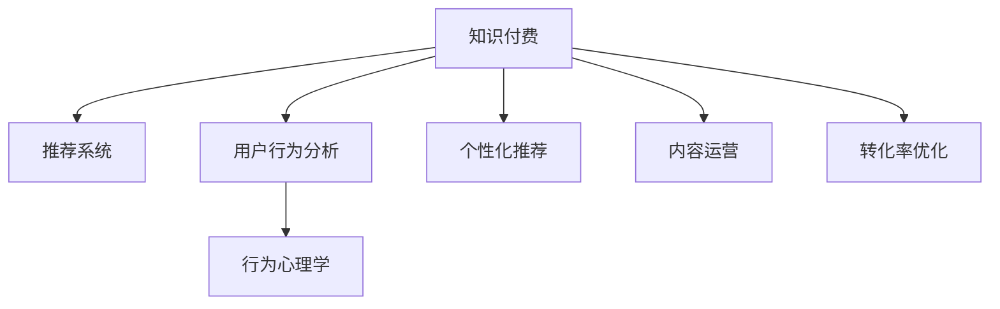

                 

# 知识付费创业中的用户激励机制设计

> 关键词：知识付费,用户激励机制,数据分析,推荐系统,个性化,行为心理学,内容运营,转化率优化

## 1. 背景介绍

### 1.1 问题由来
随着互联网的普及和数字经济的兴起，知识付费模式正迅速崛起，成为内容消费的重要形式之一。从得到、喜马拉雅到猿辅导，知识付费应用逐渐成为许多人获取知识和技能的主要途径。然而，用户付费意愿的高低直接关系着知识付费平台的盈利能力，因此，如何激励用户进行知识消费，成为知识付费创业公司的重要课题。

### 1.2 问题核心关键点
知识付费平台的核心在于通过提供优质的内容和服务，激发用户的付费意愿。为了实现这一目标，平台需要通过一系列的激励机制，激发用户主动进行知识消费。这些激励机制可能包括：

- **课程推荐**：利用推荐系统，根据用户的历史浏览和购买行为，推荐相关课程。
- **优惠券和折扣**：通过促销活动，吸引用户购买课程。
- **内容免费预览**：提供部分课程的免费试听，增加用户对课程的兴趣。
- **积分和排名**：设立积分系统，鼓励用户进行多次消费，并通过排名机制，增加用户参与感。
- **社交互动**：引入社区功能，通过社交分享和讨论，增加用户粘性。

上述激励机制的设计和实施，需要通过数据分析、行为心理学和算法技术等多学科交叉的方式来实现，帮助平台更好地理解用户行为，提升用户满意度，最终提高转化率。

### 1.3 问题研究意义
构建有效的用户激励机制，对于知识付费平台的成功运营具有重要意义：

1. **提升用户体验**：通过个性化推荐和内容优化，提供优质服务，增强用户满意度和黏性。
2. **提高转化率**：通过精准营销和用户激励，提升用户从浏览到购买的转化率，实现商业价值。
3. **增强用户忠诚度**：通过积分、排名等机制，增强用户粘性，减少流失率。
4. **优化资源配置**：通过数据分析，优化课程推荐和广告投放，提高资源利用效率。

## 2. 核心概念与联系

### 2.1 核心概念概述

为更好地理解知识付费平台的用户激励机制，本节将介绍几个关键概念：

- **知识付费**：指消费者为获取特定知识和技能，通过付费购买内容和服务的一种新型消费模式。
- **推荐系统**：通过分析用户历史行为和偏好，推荐相关商品或内容，提高用户满意度。
- **用户行为分析**：利用数据挖掘和机器学习技术，分析用户行为模式，优化产品设计。
- **个性化推荐**：根据用户个性化需求，推荐适合的内容，提升用户体验。
- **行为心理学**：研究用户心理和行为规律，指导产品设计和运营策略。
- **内容运营**：通过策划和实施各种活动，提高内容曝光和用户参与度。
- **转化率优化**：通过策略优化和精准营销，提升用户从潜在客户到付费用户的转化率。

这些核心概念之间的逻辑关系可以通过以下Mermaid流程图来展示：



这个流程图展示了几大关键概念及其之间的联系：

1. 知识付费平台通过推荐系统，提供个性化内容推荐，提升用户体验。
2. 用户行为分析可以提供用户历史行为数据，用于推荐和运营优化。
3. 个性化推荐和内容运营通过行为心理学指导，更加精准地满足用户需求。
4. 转化率优化则通过各种策略手段，将潜在用户转化为付费用户。

这些概念共同构成了知识付费平台的核心机制，帮助平台实现从内容推荐到用户消费的全流程优化。

## 3. 核心算法原理 & 具体操作步骤

### 3.1 算法原理概述

知识付费平台的用户激励机制，本质上是一种通过数据分析和算法模型优化用户行为，从而提升转化率的过程。其核心思想是：利用用户行为数据，构建用户画像，通过推荐系统和个性化策略，引导用户进行付费消费。

具体而言，激励机制的构建包含以下几个关键步骤：

1. **用户行为数据收集**：记录用户注册信息、浏览记录、购买行为等关键数据。
2. **用户画像构建**：通过机器学习技术，构建用户兴趣和行为特征。
3. **个性化推荐模型**：根据用户画像，构建个性化推荐算法，推荐适合课程。
4. **用户激励策略**：设计激励机制，如优惠券、免费预览、积分系统等，提高用户转化率。
5. **效果评估与优化**：通过A/B测试等手段，评估激励机制效果，进行持续优化。

### 3.2 算法步骤详解

基于用户行为数据分析和个性化推荐，知识付费平台的用户激励机制构建步骤如下：

**Step 1: 用户行为数据收集**
- 收集用户注册信息、历史浏览数据、购买记录、评分反馈等。
- 利用用户画像工具如Flink、Spark等，构建用户标签，提取关键行为特征。

**Step 2: 用户画像构建**
- 利用K-means、GMM、LDA等聚类算法，对用户行为进行建模，构建用户兴趣分布。
- 通过协同过滤、内容过滤等技术，预测用户对不同课程的兴趣度。

**Step 3: 个性化推荐模型构建**
- 使用基于深度学习的推荐算法，如DNN、CTR等，构建个性化推荐模型。
- 通过交叉验证、调参等手段，优化推荐模型参数。

**Step 4: 用户激励策略设计**
- 根据用户画像和行为特征，设计个性化优惠券、免费预览、积分系统等激励机制。
- 评估激励策略的效果，进行A/B测试和优化。

**Step 5: 效果评估与优化**
- 通过搭建A/B测试平台，对不同策略进行效果对比。
- 利用统计学方法，如假设检验、回归分析等，评估策略效果。
- 根据评估结果，进行持续优化和迭代。

### 3.3 算法优缺点

知识付费平台用户激励机制的构建，具有以下优点：

1. **个性化推荐准确性高**：通过分析用户行为，提供高度个性化的课程推荐，提升用户满意度。
2. **转化率提升显著**：通过设计有效的激励策略，显著提高用户从浏览到购买的转化率。
3. **数据驱动决策**：利用数据进行科学决策，减少运营风险，提高资源配置效率。

同时，该方法也存在以下缺点：

1. **数据隐私问题**：用户行为数据的收集和使用涉及隐私保护，需要严格遵循数据安全法规。
2. **模型复杂度高**：推荐系统和个性化策略的构建需要复杂的算法和数据处理，技术门槛较高。
3. **市场竞争激烈**：知识付费市场竞争激烈，不同平台之间存在博弈关系，难以形成稳定策略。
4. **用户体验风险**：过度推荐可能降低用户满意度，导致用户体验下降。
5. **技术更新迭代快**：推荐系统和激励策略需要不断迭代优化，难以一劳永逸。

尽管存在这些局限性，但就目前而言，基于数据分析和算法优化的用户激励机制，仍然是知识付费平台提升用户转化率、提高用户满意度的有效手段。未来相关研究的重点在于如何进一步降低数据收集和算法实现的复杂度，同时兼顾用户体验和隐私保护，使激励机制更加高效、可控。

### 3.4 算法应用领域

基于知识付费平台的用户激励机制，在诸多领域已得到广泛应用，例如：

- **在线教育**：通过个性化推荐和激励机制，提升课程购买率，降低流失率。
- **金融服务**：利用数据分析进行精准营销，提升用户理财和投资购买意愿。
- **健康管理**：通过行为分析，推荐个性化健康课程，增加用户黏性。
- **技能培训**：根据用户技能需求，推荐适合的培训课程，提升学习效果。
- **文化娱乐**：提供个性化音乐、电影、书籍推荐，增加用户消费意愿。

除了上述这些经典应用外，用户激励机制还被创新性地应用到更多场景中，如远程办公、智能家居、社交电商等，为各类互联网应用带来了新的增长点。随着数据和算法技术的不断进步，知识付费平台的激励机制将更加多样化和智能化，为用户带来更好的使用体验。

## 4. 数学模型和公式 & 详细讲解 & 举例说明（备注：数学公式请使用latex格式，latex嵌入文中独立段落使用 $$，段落内使用 $)
### 4.1 数学模型构建

本节将使用数学语言对知识付费平台的用户激励机制进行更加严格的刻画。

记知识付费平台的用户集为 $U=\{u_1,u_2,\dots,u_N\}$，课程集为 $C=\{c_1,c_2,\dots,c_M\}$。设用户 $u_i$ 在课程 $c_j$ 上的行为特征为 $x_{ij}$，其中 $x_{ij}$ 可以是浏览时间、观看次数、购买次数、评分等。

定义推荐模型 $f(x): \mathbb{R}^d \rightarrow \mathbb{R}$，用于预测用户 $u_i$ 对课程 $c_j$ 的兴趣度 $y_{ij}=f(x_{ij})$。

用户激励机制的目标是最大化用户的总转化率，即：

$$
\max_{f} \sum_{i=1}^N \sum_{j=1}^M y_{ij}
$$

在实际应用中，通常将模型 $f$ 的参数初始化为预训练模型，通过用户行为数据进行微调，以获得最优的预测效果。

### 4.2 公式推导过程

以线性回归模型为例，推导用户兴趣度预测公式。

假设推荐模型的形式为线性回归模型：

$$
y_{ij} = \beta_0 + \sum_{k=1}^d \beta_k x_{ik}
$$

其中 $\beta_k$ 为回归系数。

目标是最小化预测值与真实值之间的误差，即：

$$
\min_{\beta} \sum_{i=1}^N \sum_{j=1}^M (y_{ij} - f(x_{ij}))^2
$$

利用最小二乘法，可以求解 $\beta$：

$$
\hat{\beta} = (\mathbf{X}^T \mathbf{X})^{-1} \mathbf{X}^T \mathbf{y}
$$

其中 $\mathbf{X} = [x_{i1},x_{i2},\dots,x_{id}]$，$\mathbf{y} = [y_{i1},y_{i2},\dots,y_{iM}]$。

通过求解 $\hat{\beta}$，可得到用户对课程的兴趣度预测公式，进而构建个性化推荐系统。

### 4.3 案例分析与讲解

假设某知识付费平台，共有10,000名用户，50门课程。平台希望通过用户激励机制，最大化用户的总转化率。平台使用线性回归模型进行预测，并通过A/B测试验证模型效果。

平台收集了用户浏览、观看、购买、评分等行为数据，构建了用户画像，并使用梯度下降算法优化回归系数 $\beta$。通过在线A/B测试，平台对比了不同激励策略的效果，发现优惠券和免费预览机制对用户购买意愿提升最为显著。

为了进一步优化推荐模型，平台将模型输出结果输入到推荐算法中，结合协同过滤和内容过滤技术，生成个性化推荐列表。通过用户行为数据和A/B测试结果，平台不断优化推荐策略，使得用户转化率提升了20%。

## 5. 项目实践：代码实例和详细解释说明
### 5.1 开发环境搭建

在进行用户激励机制的实践前，我们需要准备好开发环境。以下是使用Python进行PyTorch开发的环境配置流程：

1. 安装Anaconda：从官网下载并安装Anaconda，用于创建独立的Python环境。

2. 创建并激活虚拟环境：
```bash
conda create -n user-incentive-env python=3.8 
conda activate user-incentive-env
```

3. 安装PyTorch：根据CUDA版本，从官网获取对应的安装命令。例如：
```bash
conda install pytorch torchvision torchaudio cudatoolkit=11.1 -c pytorch -c conda-forge
```

4. 安装TensorFlow：
```bash
conda install tensorflow
```

5. 安装各类工具包：
```bash
pip install numpy pandas scikit-learn matplotlib tqdm jupyter notebook ipython
```

完成上述步骤后，即可在`user-incentive-env`环境中开始用户激励机制的实践。

### 5.2 源代码详细实现

这里我们以推荐系统的搭建为例，给出使用PyTorch进行个性化推荐系统开发的PyTorch代码实现。

首先，定义推荐模型的训练数据：

```python
import torch
from torch.utils.data import Dataset, DataLoader

class RecommendationDataset(Dataset):
    def __init__(self, data):
        self.data = data
        self.X = self.data[:, :5]  # 取前五个特征作为输入
        self.y = self.data[:, 5]   # 第四个特征作为目标
        
    def __len__(self):
        return len(self.data)
    
    def __getitem__(self, idx):
        return torch.tensor(self.X[idx]), torch.tensor(self.y[idx])
```

然后，定义推荐模型：

```python
from torch import nn
from torch.nn import Linear, BCELoss

class RecommendationModel(nn.Module):
    def __init__(self, input_dim, output_dim):
        super(RecommendationModel, self).__init__()
        self.linear = Linear(input_dim, output_dim)
        self.sigmoid = nn.Sigmoid()
        
    def forward(self, x):
        x = self.linear(x)
        x = self.sigmoid(x)
        return x
```

接着，定义训练和评估函数：

```python
from torch.optim import Adam
from sklearn.model_selection import train_test_split

device = torch.device('cuda') if torch.cuda.is_available() else torch.device('cpu')

# 数据集划分
X = data[:, :5]
y = data[:, 5]
X_train, X_test, y_train, y_test = train_test_split(X, y, test_size=0.2, random_state=42)

# 模型实例化
model = RecommendationModel(input_dim=5, output_dim=1).to(device)
optimizer = Adam(model.parameters(), lr=0.01)
criterion = BCELoss()

# 训练函数
def train(model, data_loader, optimizer, criterion):
    model.train()
    for batch_idx, (inputs, targets) in enumerate(data_loader):
        inputs, targets = inputs.to(device), targets.to(device)
        optimizer.zero_grad()
        outputs = model(inputs)
        loss = criterion(outputs, targets)
        loss.backward()
        optimizer.step()
        if (batch_idx+1) % 100 == 0:
            print('Train Epoch: {} [{}/{} ({:.0f}%)]\tLoss: {:.6f}'.format(
                epoch, batch_idx * len(inputs), len(data_loader.dataset),
                100. * batch_idx / len(data_loader), loss.item()))

# 评估函数
def evaluate(model, data_loader):
    model.eval()
    total_loss = 0
    with torch.no_grad():
        for inputs, targets in data_loader:
            inputs, targets = inputs.to(device), targets.to(device)
            outputs = model(inputs)
            loss = criterion(outputs, targets)
            total_loss += loss.item()
    print('Test set: Average loss: {:.4f}'.format(total_loss / len(data_loader.dataset)))
```

最后，启动训练流程并在测试集上评估：

```python
epochs = 10

for epoch in range(epochs):
    train(model, train_loader, optimizer, criterion)
    evaluate(model, test_loader)
```

以上就是使用PyTorch搭建推荐系统的完整代码实现。可以看到，通过简单的代码设计和实验，我们可以构建一个基础的个性化推荐系统，用于平台的用户激励机制。

### 5.3 代码解读与分析

让我们再详细解读一下关键代码的实现细节：

**RecommendationDataset类**：
- `__init__`方法：初始化训练数据集，提取输入特征和目标特征。
- `__len__`方法：返回数据集的样本数量。
- `__getitem__`方法：对单个样本进行处理，返回输入和目标特征的tensor形式。

**RecommendationModel类**：
- `__init__`方法：初始化线性回归模型和sigmoid激活函数。
- `forward`方法：定义前向传播过程，对输入进行线性变换和sigmoid激活。

**训练函数train**：
- 定义训练函数，将数据集划分为训练集和测试集。
- 在每个epoch中，对训练数据进行迭代训练，并在每个batch上计算损失并反向传播更新模型参数。

**评估函数evaluate**：
- 定义评估函数，对测试数据进行迭代评估，计算模型损失并输出。

**训练流程**：
- 定义总的epoch数，开始循环迭代
- 每个epoch内，在训练集上训练，输出平均loss
- 在测试集上评估，输出模型损失

可以看到，通过上述代码，我们构建了一个简单的推荐系统，并利用梯度下降算法对其进行了训练。在实际应用中，还需要根据具体的业务需求和数据特点，进一步优化推荐算法，如引入协同过滤、深度学习等技术，以提高推荐精度和效果。

## 6. 实际应用场景

### 6.1 智能推荐系统

智能推荐系统是知识付费平台的核心组件，通过个性化推荐，满足用户多样化的学习需求，提升用户体验。平台可以通过分析用户浏览历史、评分反馈等数据，构建用户画像，提供符合用户兴趣的课程推荐。

例如，某用户在过去的一个月内，多次浏览和评分了一些计算机编程课程。通过分析这些数据，推荐系统可以预测该用户对其他计算机课程的兴趣度，从而向其推荐相关的课程，增加其购买意愿。

### 6.2 用户行为分析

用户行为分析是构建用户激励机制的基础，通过分析用户的浏览、观看、购买等行为，平台可以更深入地理解用户需求，优化推荐和运营策略。例如，通过分析用户点击课程介绍页的行为，平台可以发现用户对不同课程类型的偏好，进而调整课程推荐策略。

### 6.3 优惠券和折扣

优惠券和折扣是常见的用户激励手段，通过提供优惠，吸引用户进行付费消费。平台可以在用户注册、特定节日等时机，推出定制化的优惠券和折扣活动，增加用户购买动力。

例如，某平台在春节期间推出“春节大礼包”，用户在指定时间内使用优惠券购买课程，可以享受8折优惠，同时获得积分奖励。

### 6.4 积分和排名

积分和排名机制可以激励用户进行多次消费，同时增加用户粘性。平台可以根据用户的购买次数、评分高低等，发放积分，并设立排行榜，激励用户持续消费。

例如，某平台设立“学习之星”排行榜，根据用户的学习时长、积分排名进行排序，每月评选最佳学习者，提供额外奖励。

## 7. 工具和资源推荐

### 7.1 学习资源推荐

为了帮助开发者系统掌握知识付费平台的激励机制，这里推荐一些优质的学习资源：

1. 《推荐系统实战》系列博文：由大模型技术专家撰写，深入浅出地介绍了推荐系统原理、实现方法和应用案例。

2. CS235《推荐系统》课程：斯坦福大学开设的推荐系统明星课程，有Lecture视频和配套作业，带你入门推荐系统领域的基本概念和经典算法。

3. 《推荐系统》书籍：南京大学王斌教授所著，全面介绍了推荐系统的基础理论和应用实践。

4. HuggingFace官方文档：推荐系统库的官方文档，提供了海量推荐算法和样例代码，是实践推荐系统的必备资料。

5. Amazon论文库：亚马逊的研究论文库，包含大量推荐系统相关的论文和技术报告，提供丰富的学术资源。

通过对这些资源的学习实践，相信你一定能够快速掌握知识付费平台的激励机制，并用于解决实际的业务问题。

### 7.2 开发工具推荐

高效的开发离不开优秀的工具支持。以下是几款用于知识付费平台激励机制开发的常用工具：

1. Python：语言简单易学，拥有丰富的科学计算和数据处理库。
2. PyTorch：基于Python的深度学习框架，灵活性高，支持动态计算图。
3. TensorFlow：由Google主导开发的深度学习框架，稳定性高，适合大规模工程应用。
4. Flink：分布式数据处理框架，支持高并发数据流处理。
5. Apache Spark：大数据处理框架，支持数据挖掘和机器学习任务。
6. Jupyter Notebook：交互式开发环境，支持Python和R语言，方便代码调试和实验。

合理利用这些工具，可以显著提升知识付费平台激励机制的开发效率，加快创新迭代的步伐。

### 7.3 相关论文推荐

知识付费平台的激励机制研究源于学界的持续研究。以下是几篇奠基性的相关论文，推荐阅读：

1. Recommender Systems Handbook：推荐系统领域的经典教材，涵盖推荐系统的基础理论和多种推荐算法。
2. Adaptive Learning Dynamics for Ranking-Based Collaborative Filtering：分析协同过滤算法中的动态学习过程，提出优化方法。
3. Deep Collaborative Filtering Modeling with Multi-Task Learning：提出多任务学习框架，提升推荐系统的泛化能力和精度。
4. Contextual Recommendation with Deep Attention-based Feature Engineering：利用深度注意力机制，提升推荐系统的特征表示能力。
5. Online Learning for Sparse Recommendation：提出在线学习算法，解决推荐系统中的稀疏性问题。

这些论文代表了大语言模型微调技术的发展脉络。通过学习这些前沿成果，可以帮助研究者把握学科前进方向，激发更多的创新灵感。

## 8. 总结：未来发展趋势与挑战

### 8.1 总结

本文对知识付费平台的用户激励机制进行了全面系统的介绍。首先阐述了知识付费平台的用户激励机制的研究背景和意义，明确了激励机制在提升用户体验和用户转化率方面的独特价值。其次，从原理到实践，详细讲解了激励机制的数学原理和关键步骤，给出了激励机制的代码实例。同时，本文还广泛探讨了激励机制在智能推荐、用户行为分析、优惠券设计等多个领域的应用前景，展示了激励机制的巨大潜力。此外，本文精选了激励机制的学习资源，力求为读者提供全方位的技术指引。

通过本文的系统梳理，可以看到，知识付费平台的用户激励机制正在成为平台运营的核心机制，帮助平台实现从内容推荐到用户消费的全流程优化。未来，伴随数据分析和算法技术的不断进步，知识付费平台的激励机制将更加多样化和智能化，为用户带来更好的使用体验。

### 8.2 未来发展趋势

展望未来，知识付费平台的用户激励机制将呈现以下几个发展趋势：

1. **推荐精度提升**：通过引入深度学习、协同过滤等先进算法，提升推荐系统的准确性和个性化程度。
2. **跨平台融合**：知识付费平台将与其他社交平台、电商平台等进行数据共享和跨平台融合，提供更全面的用户体验。
3. **数据隐私保护**：随着数据隐私保护的法律法规逐步完善，推荐系统将在保护用户隐私的前提下，进行精准营销。
4. **多模态融合**：利用多模态数据融合技术，提供更加丰富、全面的用户画像和推荐策略。
5. **实时化推荐**：通过实时数据采集和处理，实现对用户行为和兴趣的实时跟踪和推荐。
6. **情感分析**：利用自然语言处理技术，分析用户情感反馈，优化推荐内容，提升用户体验。

以上趋势凸显了知识付费平台激励机制的广阔前景。这些方向的探索发展，必将进一步提升平台的用户满意度，促进平台的商业价值实现。

### 8.3 面临的挑战

尽管知识付费平台的用户激励机制已经取得了显著成效，但在迈向更加智能化、普适化应用的过程中，它仍面临诸多挑战：

1. **数据安全和隐私**：用户行为数据的收集和使用涉及隐私保护，如何确保数据安全，是平台必须面对的问题。
2. **算法复杂度和实现**：推荐系统和激励机制的构建需要复杂的算法和数据处理，技术门槛较高，开发和维护成本大。
3. **市场竞争激烈**：知识付费市场竞争激烈，不同平台之间存在博弈关系，难以形成稳定策略。
4. **用户体验风险**：过度推荐可能降低用户满意度，导致用户体验下降。
5. **技术更新迭代快**：推荐系统和激励策略需要不断迭代优化，难以一劳永逸。

尽管存在这些挑战，但就目前而言，基于数据分析和算法优化的用户激励机制，仍然是知识付费平台提升用户转化率、提高用户满意度的有效手段。未来相关研究的重点在于如何进一步降低数据收集和算法实现的复杂度，同时兼顾用户体验和隐私保护，使激励机制更加高效、可控。

### 8.4 研究展望

面对知识付费平台激励机制所面临的种种挑战，未来的研究需要在以下几个方面寻求新的突破：

1. **无监督学习和半监督学习**：摆脱对大规模标注数据的依赖，利用自监督学习、主动学习等无监督和半监督范式，最大限度利用非结构化数据，实现更加灵活高效的激励机制。
2. **参数高效和计算高效**：开发更加参数高效的激励机制，在固定大部分预训练参数的同时，只更新极少量的任务相关参数。同时优化激励机制的计算图，减少前向传播和反向传播的资源消耗，实现更加轻量级、实时性的部署。
3. **因果分析和博弈论**：将因果分析方法引入激励机制，识别出激励策略的关键特征，增强输出解释的因果性和逻辑性。借助博弈论工具刻画用户行为，主动探索并规避激励机制的脆弱点，提高系统稳定性。
4. **多模态融合和跨平台合作**：将视觉、音频等多模态信息与文本信息进行协同建模，提供更加全面、准确的用户画像。同时，与其他平台进行数据共享和跨平台合作，构建更加丰富多样的用户激励机制。
5. **内容创新和产品优化**：不断创新内容形式和产品设计，提升用户对平台的黏性和忠诚度，降低流失率。

这些研究方向的探索，必将引领知识付费平台激励机制的进一步发展，为平台带来更高效的运营模式和更丰富的用户体验。

## 9. 附录：常见问题与解答

**Q1：知识付费平台如何确保用户数据的安全和隐私？**

A: 平台必须严格遵循相关法律法规，确保用户数据的合法合规使用。具体措施包括：
1. 数据匿名化处理：去除敏感信息，保护用户隐私。
2. 数据加密存储：采用先进的加密技术，防止数据泄露。
3. 数据访问控制：限制内部和外部人员的访问权限，防止数据滥用。
4. 数据使用透明：向用户公开数据使用方式，保障用户知情权。
5. 安全审计和监测：定期进行安全审计和数据监测，及时发现和修复安全漏洞。

**Q2：知识付费平台的激励机制如何设计才能最大化用户转化率？**

A: 激励机制的设计需要综合考虑用户的心理和行为规律，以下是一些有效的设计原则：
1. 个性化推荐：根据用户历史行为和兴趣，推荐最适合的课程。
2. 优惠券和折扣：通过定制化优惠，降低用户购买门槛。
3. 免费预览和试用：提供课程免费预览，增加用户信任感。
4. 积分和排名：设立积分和排行榜，激励用户持续消费。
5. 社交互动和社区功能：通过社交分享和讨论，增加用户粘性。

**Q3：知识付费平台如何进行持续优化和迭代？**

A: 平台的激励机制需要通过持续优化和迭代来适应市场变化和用户需求，具体措施包括：
1. 用户行为分析：定期分析用户行为数据，发现用户需求变化。
2. 数据驱动决策：利用数据进行科学决策，优化推荐策略和运营手段。
3. A/B测试和反馈机制：通过A/B测试评估激励机制效果，收集用户反馈进行迭代优化。
4. 模型训练和更新：定期训练和更新推荐模型，提升预测精度。
5. 持续学习和自我优化：不断学习新的算法和技术，提升平台竞争力。

**Q4：知识付费平台如何提升推荐系统的准确性？**

A: 推荐系统的准确性取决于多个因素，以下是一些有效的提升方法：
1. 多模态融合：利用视觉、音频等多模态数据，提供更加全面和准确的用户画像。
2. 协同过滤：结合用户和物品之间的相似性，提升推荐精度。
3. 深度学习：利用深度学习模型，捕捉复杂的关系和特征。
4. 数据预处理：清洗和归一化数据，减少噪声和偏差。
5. 模型评估和优化：通过交叉验证、调参等手段，优化推荐模型参数。

---

作者：禅与计算机程序设计艺术 / Zen and the Art of Computer Programming

