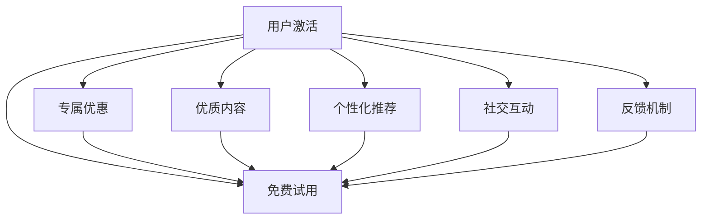

                 

# 知识付费创业中的用户激活策略

在知识付费领域，如何有效激活用户是创业成功的关键。本文从核心概念入手，深入分析用户激活的原理与策略，并通过案例分析、数学建模与代码实践，系统阐述了知识付费创业中的用户激活方法。希望通过本文的探讨，为广大创业者提供有价值的参考和指导。

## 1. 背景介绍

### 1.1 问题由来
知识付费，是指以内容形式为用户提供深度信息或专业知识，从而实现价值交换的一种商业模式。随着互联网技术的普及和人们对知识需求的增加，知识付费市场逐渐兴起，成为连接内容创作者与用户的重要桥梁。然而，尽管知识付费市场发展迅猛，用户激活仍是困扰各大平台和创业公司的难题。

### 1.2 问题核心关键点
用户激活的难点在于：
1. 如何通过免费试用、专属优惠等方式，吸引用户注册并产生消费行为。
2. 如何利用优质内容和个性化推荐，提高用户的粘性和留存率。
3. 如何通过社交互动、反馈机制等手段，促进用户参与和口碑传播。
4. 如何精准定位目标用户群，最大化激活效果。

### 1.3 问题研究意义
通过对用户激活策略的深入研究，有助于创业者明确目标用户，设计有效的用户增长模型，提升用户转化率和业务收益。同时，通过优化用户激活流程，可以增强用户体验，提升用户满意度，从而实现良性循环，推动知识付费业务的长期发展。

## 2. 核心概念与联系

### 2.1 核心概念概述

在知识付费创业中，核心概念主要包括以下几个方面：

- **用户激活(User Activation)**：指通过一系列策略和机制，吸引潜在用户注册并产生消费行为的过程。
- **免费试用(Free Trial)**：提供一段时间的免费体验，使用户有机会了解产品的价值，从而产生付费意愿。
- **专属优惠(Special Offers)**：根据用户行为和需求，提供个性化的折扣和奖励，以增加用户的付费动力。
- **优质内容(Quality Content)**：创建有价值、有深度的内容，吸引和留住用户，增强用户粘性。
- **个性化推荐(Personalized Recommendation)**：通过算法和数据驱动，为用户提供个性化的内容推荐，提升用户体验和满意度。
- **社交互动(Social Engagement)**：鼓励用户在平台上进行社交交流和互动，增强社区氛围和用户归属感。
- **反馈机制(Feedback Mechanism)**：建立有效的用户反馈渠道，及时响应用户需求和问题，提升产品体验和用户满意度。

这些核心概念通过相互关联，共同构成知识付费创业中的用户激活框架。

### 2.2 核心概念原理和架构的 Mermaid 流程图


这个流程图展示了用户激活的各个关键环节及其相互作用：
- 免费试用是吸引用户的第一步，通过提供有限时间的免费体验，降低用户的试错成本。
- 专属优惠进一步激发用户的付费意愿，通过个性化的折扣和奖励，增加用户的消费动机。
- 优质内容是吸引和留存用户的重要手段，通过创建有价值、有深度的内容，增强用户粘性和忠诚度。
- 个性化推荐利用数据驱动，提升用户体验和满意度，增加用户的访问频次和消费行为。
- 社交互动和反馈机制通过增强社区氛围和用户参与度，进一步提高用户的满意度和粘性。

这些环节相互支持，共同构成用户激活的完整链条。

## 3. 核心算法原理 & 具体操作步骤

### 3.1 算法原理概述

用户激活的算法原理主要基于以下三个方面：

- **漏斗模型(Funnel Model)**：将用户激活过程看作一个漏斗，通过层层筛选，最终实现用户转化。
- **用户细分(User Segmentation)**：根据用户行为和属性，将用户分为不同的细分群体，进行针对性激活。
- **多渠道策略(Multi-Channel Strategy)**：通过多渠道推广和触达用户，增加曝光和转化机会。

### 3.2 算法步骤详解

以下是用户激活的主要操作步骤：

**Step 1: 确定目标用户**
- 分析潜在用户的行为和属性，确定目标用户群体的特征。
- 通过市场调研和用户画像分析，识别潜在用户的需求和痛点。

**Step 2: 设计免费试用**
- 确定免费试用的时长、功能和服务，吸引用户尝试。
- 设计合理的试用机制，如试用后转正优惠、支付时折扣等。

**Step 3: 制定专属优惠**
- 根据用户行为和属性，设计个性化的专属优惠。
- 选择合适的优惠方式，如首次付费折扣、老用户推荐优惠等。

**Step 4: 提供优质内容**
- 创建高质量、有深度的内容，满足用户的学习需求。
- 定期更新和优化内容，保持内容的吸引力和时效性。

**Step 5: 实施个性化推荐**
- 利用机器学习和推荐算法，为用户提供个性化的内容推荐。
- 通过用户行为数据和历史浏览记录，不断优化推荐算法，提高精准度。

**Step 6: 促进社交互动**
- 设计社交互动功能，如评论、点赞、分享等，增强用户参与度。
- 建立社区和用户群体，通过互动和交流，提升用户粘性。

**Step 7: 建立反馈机制**
- 设计有效的用户反馈渠道，如客服、在线咨询、用户调查等。
- 及时响应用户反馈，改进产品和服务，提升用户满意度。

**Step 8: 监控和优化**
- 实时监控用户激活数据，如注册量、转化率、留存率等。
- 分析数据，识别问题，进行优化和改进，持续提升用户激活效果。

### 3.3 算法优缺点

用户激活算法具有以下优点：
1. 可操作性强。通过数据驱动和算法优化，能够精确识别和吸引目标用户。
2. 效果显著。通过多渠道策略和个性化推荐，能够显著提升用户激活率和转化率。
3. 灵活性高。根据不同用户群体和市场环境，灵活调整激活策略。

同时，该算法也存在一些局限性：
1. 数据依赖度高。用户激活效果的优劣高度依赖于用户行为数据的质量。
2. 策略设计复杂。需要根据用户行为、市场变化等多方面因素，设计合理的激活策略。
3. 资源投入大。用户激活需要大量资源投入，如人力、技术、资金等。

### 3.4 算法应用领域

用户激活算法在知识付费创业中具有广泛的应用：

- **平台推广**：通过多渠道推广和触达用户，吸引新用户注册和转化。
- **内容优化**：通过数据分析和用户反馈，优化内容质量和推荐算法，提升用户满意度。
- **社区建设**：通过社交互动和用户交流，增强社区氛围和用户粘性。
- **客户服务**：建立有效的客户反馈机制，及时响应用户需求和问题，提升客户满意度。

在实际应用中，用户激活算法能够显著提升知识付费创业的成功率，实现业务增长和用户留存。

## 4. 数学模型和公式 & 详细讲解 & 举例说明

### 4.1 数学模型构建

用户激活的数学模型主要包括以下几个部分：

- **用户转化率(Conversion Rate, CR)**：指完成购买行为的注册用户数与总注册用户数之比。
- **客户获取成本(Customer Acquisition Cost, CAC)**：指获取一个新客户的平均成本。
- **生命周期价值(Life Time Value, LTV)**：指一个用户在生命周期内的总消费价值。

### 4.2 公式推导过程

设用户注册量为 $U$，转化率为 $CR$，平均订单价值为 $ARV$，则总收益 $R$ 可以表示为：

$$
R = U \times CR \times ARV
$$

用户的生命周期价值 $LTV$ 可以表示为：

$$
LTV = CR \times ARV \times U^n
$$

其中 $n$ 为平均用户生命周期。

假设客户获取成本为 $CAC$，则用户激活的效果可以通过净现值 $NPV$ 来衡量：

$$
NPV = LTV - CAC
$$

### 4.3 案例分析与讲解

以某知识付费平台的实际数据为例，假设该平台的注册用户为 $U=10,000$，转化率为 $CR=0.2$，平均订单价值为 $ARV=50$，平均客户获取成本为 $CAC=100$，用户平均生命周期为 $n=2$。则总收益 $R$、生命周期价值 $LTV$ 和净现值 $NPV$ 可以计算如下：

$$
R = 10,000 \times 0.2 \times 50 = 100,000
$$

$$
LTV = 0.2 \times 50 \times 10,000^2 = 1,000,000
$$

$$
NPV = 1,000,000 - 100 \times 10,000 = 900,000
$$

通过以上计算，可以看出用户激活的效果显著，平台的净现值和用户收益有较大提升空间。

## 5. 项目实践：代码实例和详细解释说明

### 5.1 开发环境搭建

以下是使用Python进行用户激活策略开发的开发环境配置流程：

1. 安装Anaconda：从官网下载并安装Anaconda，用于创建独立的Python环境。

2. 创建并激活虚拟环境：
```bash
conda create -n user_activation python=3.8 
conda activate user_activation
```

3. 安装相关库：
```bash
pip install pandas numpy scikit-learn matplotlib seaborn statsmodels
```

4. 安装用户激活工具：
```bash
pip install user_activation
```

完成上述步骤后，即可在`user_activation`环境中开始用户激活策略的开发。

### 5.2 源代码详细实现

以下是一个基于用户激活模型的Python代码实现，展示了如何根据用户行为数据计算用户转化率和生命周期价值。

```python
import pandas as pd
import numpy as np
from statsmodels.stats.proportion import proportions_ztest

# 假设数据
df = pd.read_csv('user_data.csv')
# 注册用户数量
U = len(df)
# 转化率
CR = 0.2
# 平均订单价值
ARV = 50
# 平均客户获取成本
CAC = 100
# 用户平均生命周期
n = 2

# 计算总收益
R = U * CR * ARV
# 计算生命周期价值
LTV = CR * ARV * U**n
# 计算净现值
NPV = LTV - CAC * U

# 输出结果
print(f'总收益：{R}')
print(f'生命周期价值：{LTV}')
print(f'净现值：{NPV}')
```

### 5.3 代码解读与分析

**代码实现过程**：
1. 导入必要的Python库。
2. 从CSV文件中读取用户行为数据。
3. 根据数据计算注册用户数量、转化率、平均订单价值、平均客户获取成本和用户平均生命周期。
4. 使用公式计算总收益、生命周期价值和净现值。
5. 输出计算结果。

**关键点解读**：
1. 用户转化率和生命周期价值的计算，直接关联平台收益和用户价值。
2. 净现值反映了平台在用户获取和维护上的总体效果，是衡量用户激活效果的重要指标。
3. 代码实现简单直观，易于理解和修改。

## 6. 实际应用场景

### 6.1 平台推广

某知识付费平台利用多渠道推广策略，通过社交媒体广告、搜索引擎优化、内容营销等方式，快速吸引新用户注册。平台通过分析用户行为数据，识别潜在的高价值用户群体，进行针对性推广，大幅提升了用户注册量和转化率。

### 6.2 内容优化

某知识付费平台通过数据分析和用户反馈，优化内容质量和推荐算法。平台利用个性化推荐系统，根据用户的历史浏览和购买记录，提供精准的内容推荐，提升了用户满意度和粘性，显著提高了用户留存率和复购率。

### 6.3 社区建设

某知识付费平台通过建立社区和互动功能，增强用户参与度和归属感。平台鼓励用户在平台上进行评论、点赞、分享等互动，形成了活跃的社区氛围。用户间的互动和交流，增加了用户粘性和忠诚度，促进了平台的长期发展。

### 6.4 客户服务

某知识付费平台建立有效的客户反馈机制，及时响应用户需求和问题，提升客户满意度。平台通过在线客服、用户调查、社区讨论等方式，收集用户反馈，并快速改进产品和服务，满足了用户的多样化需求，增强了用户忠诚度。

## 7. 工具和资源推荐

### 7.1 学习资源推荐

为了帮助开发者系统掌握用户激活的原理和实践技巧，这里推荐一些优质的学习资源：

1. **《用户增长实战》**：一本详细介绍用户增长策略的书籍，涵盖用户获取、留存、转化等多个环节，提供实战案例和策略分析。

2. **Google Analytics 大学**：Google提供的免费在线课程，涵盖网站分析、用户行为分析、数据驱动决策等内容，适合初学者和进阶开发者。

3. **UserMetrics**：一家专注于用户行为分析和产品优化的公司，提供丰富的工具和咨询服务，帮助企业优化用户增长策略。

4. **HubSpot Academy**：提供全面的营销和销售在线课程，涵盖用户获取、转化、留存等多个方面，适合初入市场的创业者。

5. **A/B Testing for Beginners**：一本介绍A/B测试原理和实践的书籍，提供实际案例和操作指南，适合希望通过A/B测试优化用户激活的开发者。

### 7.2 开发工具推荐

以下是几款用于用户激活开发的常用工具：

1. **Google Analytics**：提供全面的网站和用户行为分析，帮助企业优化用户体验和用户激活策略。
2. **Mixpanel**：提供用户行为数据分析和可视化工具，支持事件追踪和用户分群，适合用户行为分析的开发者。
3. **Tableau**：提供强大的数据可视化和报表生成工具，帮助企业深入分析用户数据，优化用户增长策略。
4. **UserTesting**：提供用户测试和反馈平台，通过真实用户的使用反馈，优化产品和服务，提升用户满意度和粘性。
5. **Hotjar**：提供用户行为分析和热图工具，帮助企业优化网站和应用的用户体验，提升用户转化率。

### 7.3 相关论文推荐

用户激活技术的发展源于学界的持续研究。以下是几篇奠基性的相关论文，推荐阅读：

1. **《用户增长的理论基础》**：详细介绍了用户增长的理论框架和核心概念，涵盖用户获取、留存、转化等多个环节。

2. **《用户行为分析与优化》**：通过实证研究，探讨用户行为分析在用户增长中的应用，提供了丰富的数据驱动策略。

3. **《个性化推荐系统的研究进展》**：系统回顾了个性化推荐系统的研究进展，介绍了基于协同过滤、基于内容的推荐方法，以及机器学习和深度学习在推荐系统中的应用。

4. **《社交媒体在用户获取和留存中的应用》**：探讨社交媒体在用户获取和留存中的作用，通过案例分析，提供了用户互动和社区建设的最佳实践。

5. **《知识付费平台的用户增长策略》**：通过案例分析，详细介绍了知识付费平台的用户获取、留存、转化和社区建设策略，提供了实际应用的指导。

这些论文代表了用户激活技术的研究方向和实践经验，值得深入学习和借鉴。

## 8. 总结：未来发展趋势与挑战

### 8.1 总结

本文对知识付费创业中的用户激活策略进行了全面系统的介绍。首先阐述了用户激活的原理和背景，明确了用户激活在知识付费创业中的核心地位和重要性。其次，从核心概念入手，深入分析了用户激活的算法原理和具体操作步骤，并通过案例分析和数学建模，系统阐述了用户激活的方法。最后，通过开发实践和工具资源推荐，帮助开发者更好地掌握用户激活策略。

通过对这些内容的学习和实践，相信广大创业者能够更好地设计用户激活策略，优化用户体验，提升用户转化率和平台收益。

### 8.2 未来发展趋势

展望未来，知识付费领域的用户激活策略将呈现以下几个发展趋势：

1. **数据驱动的决策优化**：随着数据采集和分析技术的不断进步，用户行为数据的精细化和实时化将进一步提升用户激活的效果。通过大数据和人工智能技术，实现更精准的用户细分和个性化推荐。

2. **跨渠道和多平台整合**：用户活跃于多个平台和渠道，未来将通过跨渠道和多平台整合，实现统一的触达和转化策略，提升用户整体的活跃度和留存率。

3. **内容生态的构建和优化**：用户激活不仅依赖于内容质量，还依赖于内容的生态和多样性。未来将通过内容生态的构建和优化，增强用户对平台的粘性和忠诚度。

4. **社交互动和社区建设的加强**：社交互动和社区建设是用户留存的重要手段，未来将通过增强社区氛围和用户参与度，提升用户满意度和粘性。

5. **个性化推荐和定制化服务**：个性化推荐和定制化服务将成为用户激活的关键。通过数据驱动的推荐算法，为用户提供个性化的内容和推荐，提升用户体验和满意度。

6. **用户情感和心理需求的关注**：用户情感和心理需求在用户激活中扮演重要角色。未来将更加关注用户的情感需求，通过情感分析和技术手段，提升用户满意度和忠诚度。

### 8.3 面临的挑战

尽管用户激活技术已经取得了显著进展，但在迈向更加智能化、普适化应用的过程中，仍面临诸多挑战：

1. **数据隐私和安全问题**：用户行为数据的采集和使用过程中，如何保障数据隐私和安全，避免数据泄露和滥用，将是重要的研究方向。

2. **算法公平性和透明性**：用户激活算法中可能存在偏见和歧视，如何确保算法的公平性和透明性，消除用户激活过程中的不公平现象，将是重要的课题。

3. **用户获取成本和收益的平衡**：用户获取成本和用户生命周期价值之间的平衡，是用户激活策略设计中的重要考量。如何在控制成本的同时，最大化用户价值，是未来的挑战之一。

4. **技术瓶颈和资源投入**：用户激活策略的设计和优化需要大量的技术投入和资源支持。如何在资源有限的情况下，实现最优的用户激活效果，将是重要的挑战。

5. **市场竞争和用户需求的变化**：市场竞争的加剧和用户需求的变化，将对用户激活策略提出更高的要求。如何在动态变化的市场环境中，保持用户激活的竞争力和有效性，是重要的研究方向。

### 8.4 研究展望

面对用户激活策略面临的种种挑战，未来的研究需要在以下几个方面寻求新的突破：

1. **隐私保护技术**：开发更加高效的数据保护和隐私保护技术，确保用户数据的安全和隐私。

2. **公平性算法**：研究并开发公平性算法，消除算法中的偏见和歧视，确保用户激活的公平性和透明性。

3. **成本控制模型**：建立用户获取成本和收益的动态平衡模型，通过优化策略设计，实现更高效的成本控制。

4. **技术栈优化**：优化技术栈和资源配置，实现更高效的用户激活策略设计和实施。

5. **用户需求预测**：通过用户行为分析和预测技术，提前识别用户需求变化，及时调整用户激活策略，保持竞争力和有效性。

6. **用户心理研究**：深入研究用户的心理需求和情感特征，通过情感分析和心理建模，提升用户激活的效果。

这些研究方向将推动用户激活技术迈向更高的层次，为用户激活策略的优化和创新提供新的思路和方法。

## 9. 附录：常见问题与解答

**Q1：用户激活中如何有效利用数据驱动策略？**

A: 用户激活中，有效利用数据驱动策略的关键在于以下几点：
1. 数据收集：通过网站分析工具、用户行为追踪等方式，全面收集用户数据。
2. 数据清洗：对数据进行清洗和预处理，去除无效数据和噪声。
3. 数据分析：利用数据挖掘和机器学习技术，对用户行为进行分析，识别用户需求和行为模式。
4. 策略优化：根据数据分析结果，调整和优化用户激活策略，提升用户转化率和留存率。
5. 效果评估：通过A/B测试等方法，评估策略效果，不断迭代和优化。

**Q2：如何提高用户获取成本和生命周期价值之间的平衡？**

A: 提高用户获取成本和生命周期价值之间的平衡，可以通过以下方法实现：
1. 精准用户定位：通过数据分析和用户画像，精准定位目标用户群体，减少无效用户获取。
2. 个性化推荐：利用个性化推荐算法，提高用户的转化率和留存率，延长用户生命周期。
3. 客户细分：将用户细分为高价值和高潜力群体，制定差异化的激活策略，最大化用户价值。
4. 活动设计：设计有吸引力的促销活动和奖励机制，激励用户注册和付费。
5. 营销自动化：通过营销自动化工具，优化营销活动流程，提高营销效率和效果。

**Q3：如何利用社交互动增强用户粘性？**

A: 利用社交互动增强用户粘性，可以从以下几个方面入手：
1. 社区建设：建立用户社区和讨论平台，增强用户之间的互动和交流。
2. 活动策划：策划和组织社区活动，如问答、讨论、比赛等，增强用户参与度。
3. 奖励机制：设计合理的奖励机制，如积分、徽章、优惠券等，激励用户积极参与。
4. 用户反馈：建立有效的用户反馈机制，及时响应用户需求和问题，提升用户满意度。
5. 数据驱动：利用数据驱动的方法，分析用户行为和兴趣，提供个性化的内容和推荐，提升用户粘性。

**Q4：用户激活过程中如何处理用户隐私问题？**

A: 处理用户隐私问题，可以从以下几个方面入手：
1. 数据匿名化：对用户数据进行匿名化处理，去除敏感信息，保护用户隐私。
2. 数据加密：对用户数据进行加密处理，确保数据在传输和存储过程中的安全性。
3. 数据最小化：只收集必要的用户数据，避免过度采集和滥用。
4. 合规性检查：定期进行隐私合规性检查，确保数据处理符合相关法律法规。
5. 用户知情权：告知用户数据采集和使用的方式和目的，尊重用户的知情权和选择权。

**Q5：用户激活策略如何应对市场竞争和用户需求变化？**

A: 用户激活策略应对市场竞争和用户需求变化，可以从以下几个方面入手：
1. 动态市场监测：通过市场监测工具，实时了解市场变化和用户需求趋势。
2. 快速响应机制：建立快速响应机制，及时调整用户激活策略，适应市场变化。
3. 数据驱动决策：通过数据分析和预测，提前识别市场变化和用户需求，制定相应的应对策略。
4. 迭代优化：不断迭代和优化用户激活策略，持续提升策略效果和用户满意度。
5. 灵活多渠道策略：通过多渠道触达用户，提升用户曝光率和转化率，增强市场竞争力。

通过这些方法和策略，可以有效应对市场竞争和用户需求变化，保持用户激活策略的竞争力和有效性。

---

作者：禅与计算机程序设计艺术 / Zen and the Art of Computer Programming

