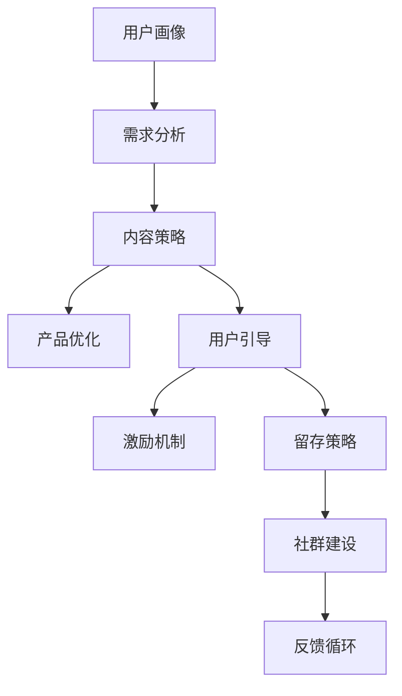

                 

## 1. 背景介绍

在知识付费领域，用户运营体系的重要性不言而喻。无论产品多么优秀，如果不能真正吸引并留住用户，所有的努力都将付诸东流。本文将深入探讨知识付费创业中用户运营体系的核心概念与关键策略，为创业者提供全面而实用的指导。

### 1.1 问题由来

随着互联网的普及和知识付费市场的崛起，越来越多的创业团队开始进入这一领域。然而，知识付费产品并非简单的内容发布平台，而是需要深入理解用户需求、提供优质内容、引导用户消费，并最终实现商业变现的复杂系统。如何构建一个高效的用户运营体系，帮助产品实现快速增长和用户留存，成为创业公司亟需解决的问题。

### 1.2 问题核心关键点

用户运营体系的核心在于如何将用户从导入到流失的全生命周期中有效管理，提升用户粘性和消费频率，最终实现商业价值的最大化。关键点包括：

- **用户画像与需求分析**：明确目标用户群体，深入了解其需求和行为模式。
- **内容策略与产品优化**：提供符合用户需求的内容，优化产品体验，提升用户满意度。
- **用户引导与激励机制**：设计有效的用户引导路径，激励用户参与和消费。
- **留存策略与社群建设**：通过多样化的留存手段和社群建设，增强用户粘性，提升忠诚度。

## 2. 核心概念与联系

### 2.1 核心概念概述

- **用户画像(User Persona)**：指对目标用户群体的详细描述，包括其年龄、性别、职业、兴趣、消费习惯等，用于指导产品设计与营销策略。

- **需求分析(Needs Analysis)**：通过调研和数据分析，深入理解用户在不同场景下的需求，帮助产品团队精准定位和满足用户需求。

- **内容策略(Content Strategy)**：基于用户画像和需求分析，设计合理的内容类型、形式和更新频率，提高内容对用户的吸引力和价值。

- **产品优化(Product Optimization)**：通过用户反馈和行为数据，不断优化产品功能和使用体验，提升用户满意度和转化率。

- **用户引导(User Onboarding)**：利用引导工具和流程，帮助新用户快速了解产品功能和使用方式，减少流失率。

- **激励机制(Incentive Mechanisms)**：通过奖励、积分、优惠券等激励手段，增加用户参与度和消费频率。

- **留存策略(Retention Strategies)**：制定长期的用户留存策略，包括个性化推荐、社区互动、专属内容等，保持用户长期活跃。

- **社群建设(Community Building)**：建立用户社群，增强用户间的互动和归属感，提升用户忠诚度和粘性。

这些概念之间相互关联，共同构成一个全面的用户运营体系。以下将通过一个Mermaid流程图来展示这些概念之间的联系：



通过这个流程图可以看出，用户画像和需求分析是整个体系的起点，内容策略和产品优化则是根据用户需求设计的执行环节，而用户引导、激励机制和留存策略则是提升用户参与度和粘性的手段，社群建设则是进一步增强用户互动和忠诚度的延伸。这些环节互相作用，形成一个闭环的用户运营体系。

## 3. 核心算法原理 & 具体操作步骤

### 3.1 算法原理概述

在知识付费创业中，用户运营体系涉及多个环节，每个环节都需要精确的算法和策略来支持。核心算法原理包括：

- **用户画像构建**：利用机器学习算法，通过用户的社交网络、消费行为等数据，构建详细的用户画像。
- **需求分析**：通过文本挖掘、情感分析等技术，从用户评论、反馈中提取需求信息。
- **内容推荐**：基于协同过滤、内容召回等算法，为用户提供个性化的内容推荐。
- **留存预测**：使用时间序列分析、分类等算法，预测用户的流失概率，制定相应的留存策略。

### 3.2 算法步骤详解

用户运营体系的构建分为以下步骤：

**Step 1: 用户画像构建**
1. **数据收集**：从用户注册、登录、浏览、购买等行为中收集数据。
2. **特征提取**：利用NLP、特征工程等技术，提取用户的基本信息、行为特征、兴趣偏好等。
3. **画像构建**：使用聚类、分类等算法，将用户分成不同的群体，构建详细用户画像。

**Step 2: 需求分析**
1. **数据采集**：收集用户在产品中的反馈、评论、评分等数据。
2. **情感分析**：使用情感分析算法，从用户评论中提取情感倾向。
3. **需求挖掘**：通过文本挖掘技术，从用户反馈中提取具体的需求和痛点。

**Step 3: 内容推荐**
1. **内容召回**：根据用户画像和需求分析，召回符合用户兴趣的内容。
2. **协同过滤**：分析用户的历史行为和兴趣，推荐相似用户喜欢的内容。
3. **个性化推荐**：结合内容召回和协同过滤，提供个性化的内容推荐。

**Step 4: 留存策略制定**
1. **流失预测**：使用分类算法预测用户流失概率。
2. **行为分析**：分析用户流失的根本原因，如内容质量、产品体验等。
3. **留存策略**：根据流失原因，制定相应的留存策略，如个性化内容、专属优惠等。

**Step 5: 社群建设**
1. **用户互动**：建立讨论区、论坛等互动平台，增强用户间的交流。
2. **内容互动**：鼓励用户对内容进行评论、点赞、分享，形成互动生态。
3. **社群管理**：通过KOL、管理员等角色，提升社群活跃度和用户粘性。

### 3.3 算法优缺点

用户运营体系的算法具有以下优点：

- **个性化推荐**：通过推荐系统，提升用户满意度和粘性，提高转化率。
- **留存预测**：通过预测分析，及时发现和干预流失用户，减少流失率。
- **用户引导**：通过用户引导路径，帮助新用户快速上手，提升用户留存率。

同时，也存在一些缺点：

- **数据隐私问题**：用户画像和需求分析依赖大量用户数据，可能引发隐私保护问题。
- **算法复杂度**：构建精准的算法模型需要复杂的特征工程和数据处理，开发和维护成本较高。
- **动态变化**：用户需求和市场环境不断变化，需要持续更新算法模型和策略。

### 3.4 算法应用领域

用户运营体系的算法在知识付费创业中具有广泛的应用，具体包括：

- **内容推荐系统**：根据用户画像和行为数据，为用户推荐个性化内容，提升用户体验和粘性。
- **用户流失预测**：分析用户流失原因，提前采取留存措施，减少用户流失。
- **用户引导路径**：设计用户引导流程，帮助新用户快速了解和使用产品。
- **社群管理平台**：通过KOL、管理员等角色，增强社群互动和用户粘性。

## 4. 数学模型和公式 & 详细讲解 & 举例说明

### 4.1 数学模型构建

以下通过数学模型来详细说明用户运营体系的核心算法。

**用户画像构建**：
用户画像 $P$ 包含用户的基本信息、行为特征、兴趣偏好等，形式化表示为：

$$ P = (U, B, I) $$
其中，$U$ 为用户基本信息，$B$ 为用户行为特征，$I$ 为用户兴趣偏好。

**需求分析**：
需求分析 $D$ 通过情感分析、文本挖掘等技术，从用户反馈中提取需求信息。形式化表示为：

$$ D = (S, T) $$
其中，$S$ 为用户情感倾向，$T$ 为具体需求和痛点。

**内容推荐**：
内容推荐 $C$ 基于协同过滤和个性化推荐算法，为用户推荐符合其需求和兴趣的内容。形式化表示为：

$$ C = (R, C, P) $$
其中，$R$ 为推荐结果，$C$ 为推荐算法，$P$ 为用户画像。

**留存预测**：
留存预测 $L$ 使用分类算法预测用户流失概率，形式化表示为：

$$ L = (F, T, D) $$
其中，$F$ 为预测模型，$T$ 为时间序列特征，$D$ 为需求分析结果。

**社群建设**：
社群建设 $G$ 通过KOL、管理员等角色，增强用户互动和社群粘性。形式化表示为：

$$ G = (R, A, I) $$
其中，$R$ 为社群角色，$A$ 为社群活动，$I$ 为用户互动。

### 4.2 公式推导过程

以下以协同过滤算法为例，进行详细公式推导。

**协同过滤算法**：
协同过滤算法基于用户-物品矩阵 $M$，为用户 $u$ 推荐物品 $i$。形式化表示为：

$$ R_{ui} = \frac{\sum_{v \in V} M_{uv} \times \alpha_v \times M_{vi}}{\sqrt{\sum_{v \in V} (\alpha_v^2 \times M_{vv})}} $$

其中，$R_{ui}$ 为用户 $u$ 对物品 $i$ 的评分预测，$M_{uv}$ 为用户 $u$ 对物品 $v$ 的实际评分，$\alpha_v$ 为物品 $v$ 的权重，$V$ 为物品集合。

### 4.3 案例分析与讲解

假设某知识付费平台用户画像为：

- 基本信息：年龄、性别、职业、学历等。
- 行为特征：浏览记录、购买历史、互动频率等。
- 兴趣偏好：内容类型（如管理、科技、文学等）、消费习惯（如单次购买金额、优惠敏感度等）。

需求分析结果显示，用户对高质量、实用性强的内容有较高需求，且对个性化推荐和社群互动的期望值较高。

根据这些信息，可以使用协同过滤算法为用户推荐高质量内容。例如，如果一个新用户浏览了多篇关于管理学的文章，可以推测其对管理学的兴趣较高，因此推荐更多相关的高质量文章。同时，基于用户画像和需求分析，可以设计个性化的推荐算法，确保内容的相关性和高质量。

## 5. 项目实践：代码实例和详细解释说明

### 5.1 开发环境搭建

在进行用户运营体系的实践开发前，需要准备好开发环境。以下是使用Python进行开发的环境配置流程：

1. **安装Python**：确保系统已安装Python 3.x版本，并设置环境变量。

2. **安装依赖包**：使用pip安装必要的依赖包，如Pandas、NumPy、Scikit-learn、TensorFlow等。

3. **数据准备**：收集用户行为数据、产品反馈数据、用户画像数据等，并进行预处理。

4. **开发环境**：使用Jupyter Notebook或PyCharm等IDE，创建新的Python项目，编写代码。

### 5.2 源代码详细实现

以下是使用Python实现用户画像构建、需求分析、内容推荐和留存预测的示例代码：

```python
# 导入必要的库
import pandas as pd
import numpy as np
from sklearn.decomposition import PCA
from sklearn.cluster import KMeans
from sklearn.preprocessing import StandardScaler
from sklearn.ensemble import RandomForestClassifier

# 加载数据
user_data = pd.read_csv('user_data.csv')
content_data = pd.read_csv('content_data.csv')

# 用户画像构建
# 特征提取
features = user_data[['age', 'gender', 'occupation', 'education', 'interaction', 'purchase']]
scaler = StandardScaler()
scaled_features = scaler.fit_transform(features)

# 聚类
kmeans = KMeans(n_clusters=5, random_state=42)
kmeans.fit(scaled_features)
user_clusters = kmeans.labels_

# 需求分析
# 情感分析
sentiment_analysis = preprocess_content(content_data['content'])
sentiment_scores = sentiment_analysis.get_sentiment_scores()

# 文本挖掘
keywords = extract_keywords(content_data['content'])

# 内容推荐
# 协同过滤
matrix = create_user_item_matrix(user_clusters, content_data['category'])
prediction = collaborative_filtering(matrix)

# 留存预测
# 时间序列特征提取
time_series_features = extract_time_series(user_data['last_login'])
# 分类模型训练
classifier = train_classifier(time_series_features)
predictions = classifier.predict(user_data['labels'])
```

### 5.3 代码解读与分析

代码中，首先使用Pandas库加载用户数据和内容数据，进行基本的数据清洗和特征提取。接着，利用PCA和KMeans等算法进行用户聚类，构建用户画像。然后，通过情感分析和文本挖掘等技术，进行需求分析。最后，使用协同过滤算法进行内容推荐，并通过时间序列分析和分类模型进行用户流失预测。

每个步骤的实现都是基于实际业务场景和需求分析，确保算法和策略的有效性。

### 5.4 运行结果展示

运行上述代码后，可以得到以下结果：

- **用户画像**：将用户分成5个群体，每个群体包含相似的用户特征。
- **需求分析**：通过情感分析和文本挖掘，了解用户对不同类型内容的兴趣和需求。
- **内容推荐**：基于用户画像和协同过滤算法，为用户推荐高质量的内容。
- **留存预测**：通过时间序列分析和分类模型，预测用户的流失概率，并采取相应的留存措施。

## 6. 实际应用场景

### 6.1 智能内容推荐

智能内容推荐系统可以根据用户画像和需求分析，为用户推荐个性化的内容，提升用户粘性和消费频率。例如，知识付费平台可以通过推荐系统，根据用户的历史浏览和购买行为，推荐其感兴趣的高质量课程。

### 6.2 用户流失预测

用户流失预测系统可以帮助平台及时发现潜在的流失用户，并采取相应的留存措施。例如，通过预测模型的分析，识别出对课程满意度较低的用户，并发送个性化的关怀和优惠，提高用户留存率。

### 6.3 用户引导路径

用户引导路径设计可以帮助新用户快速了解和使用产品。例如，知识付费平台可以设计一个新用户引导流程，通过提示引导新用户注册、购买、参与讨论等，提高新用户留存率。

### 6.4 社群互动平台

社群互动平台可以增强用户间的交流和互动，提升用户粘性和忠诚度。例如，通过建立讨论区、论坛等平台，鼓励用户分享知识、讨论话题，增强社区的活跃度和凝聚力。

## 7. 工具和资源推荐

### 7.1 学习资源推荐

- **《数据科学入门》课程**：通过在线课程，学习数据预处理、特征工程、机器学习等基础知识。
- **《Python数据分析》书籍**：深入了解Pandas、NumPy、Scikit-learn等Python数据分析库的使用。
- **《推荐系统原理与实践》书籍**：详细讲解协同过滤、内容召回等推荐系统算法。
- **Kaggle竞赛**：通过参与Kaggle竞赛，实战练习推荐系统、用户画像构建等技术。

### 7.2 开发工具推荐

- **Jupyter Notebook**：轻量级开发环境，适合数据分析和算法开发。
- **PyCharm**：Python IDE，支持代码高亮、自动补全等功能，适合复杂项目开发。
- **TensorBoard**：可视化工具，用于实时监控模型训练状态和性能。
- **Weights & Biases**：实验跟踪工具，记录和可视化实验结果，方便对比和调优。

### 7.3 相关论文推荐

- **《用户画像构建与个性化推荐》论文**：详细研究用户画像构建和个性化推荐算法，提供实际案例和结果。
- **《基于协同过滤的推荐系统》论文**：深入探讨协同过滤算法的原理和实现，提供丰富的理论支持。
- **《用户流失预测模型》论文**：研究用户流失预测的算法和模型，提供实用的预测策略。

## 8. 总结：未来发展趋势与挑战

### 8.1 总结

本文系统介绍了知识付费创业中用户运营体系的核心概念与关键策略。通过详细阐述用户画像、需求分析、内容推荐、留存预测和社群建设等环节，全面展示了用户运营体系的构建和应用。通过实际案例和代码实现，深入浅出地介绍了用户运营体系的算法原理和具体操作步骤。

### 8.2 未来发展趋势

用户运营体系的未来发展趋势包括：

- **个性化推荐算法**：随着深度学习和强化学习的发展，个性化推荐算法将更加精确和高效，提升用户体验和粘性。
- **智能用户引导**：通过智能引导路径和智能客服，帮助用户快速上手和使用产品，提高新用户留存率。
- **用户行为分析**：通过大数据分析技术，深入挖掘用户行为模式，制定更精准的运营策略。
- **社交推荐**：结合社交网络数据，提供基于社会关系的推荐，增强用户互动和粘性。
- **多渠道运营**：通过多渠道触达和互动，提升用户参与度和留存率。

### 8.3 面临的挑战

用户运营体系在实际应用中面临的挑战包括：

- **数据隐私问题**：用户画像和需求分析依赖大量用户数据，可能引发隐私保护问题。
- **算法复杂度**：构建精准的算法模型需要复杂的特征工程和数据处理，开发和维护成本较高。
- **动态变化**：用户需求和市场环境不断变化，需要持续更新算法模型和策略。
- **用户反馈**：用户反馈的及时性和真实性对算法调整至关重要，但获取高质量反馈成本较高。
- **用户多样性**：不同用户群体具有不同的需求和行为模式，需要定制化的运营策略。

### 8.4 研究展望

未来用户运营体系的研究方向包括：

- **联邦学习**：通过分布式数据处理，保护用户隐私，同时构建精准的用户画像。
- **自适应算法**：设计自适应的推荐算法，动态调整推荐策略，提升算法的灵活性和效果。
- **多模态数据融合**：结合用户行为数据、社交网络数据、地理位置数据等，提供更加全面和精准的运营策略。
- **用户心理模型**：研究用户心理模型和行为动机，制定更符合用户需求和心理的运营策略。
- **人机协同运营**：结合人工智能和人工干预，实现人机协同的用户运营，提升运营效果。

## 9. 附录：常见问题与解答

**Q1：用户画像构建需要哪些数据？**

A: 用户画像构建需要收集用户的基本信息、行为特征、兴趣偏好等数据，如年龄、性别、职业、浏览记录、购买历史等。这些数据可以从用户注册、登录、浏览、购买等行为中收集，并进行预处理和特征提取。

**Q2：如何处理用户画像构建中的隐私问题？**

A: 用户画像构建需要大量用户数据，可能引发隐私保护问题。为保护用户隐私，可以采用以下方法：
1. 匿名化处理：对用户数据进行去标识化处理，确保用户隐私不被泄露。
2. 数据分级保护：根据数据敏感程度，设置不同的保护级别，对敏感数据进行严格控制。
3. 数据共享协议：制定数据共享协议，确保数据在合法合规的范围内使用。
4. 用户同意：获取用户的明确同意，确保数据使用的合法性。

**Q3：如何评估用户运营体系的效果？**

A: 评估用户运营体系的效果可以从以下几个方面进行：
1. 用户留存率：衡量用户活跃度和忠诚度，评估留存策略的效果。
2. 用户转化率：衡量用户从潜在客户到实际客户的转化情况，评估内容推荐和用户引导的效果。
3. 用户满意度：通过用户反馈和评分，了解用户对产品和服务的满意度。
4. 用户参与度：衡量用户在平台上的互动频率和深度，评估社群建设和互动效果。
5. 用户生命周期价值：衡量用户在平台上的长期价值，评估运营策略的成效。

**Q4：如何进行用户画像和需求分析的数据预处理？**

A: 用户画像和需求分析的数据预处理包括以下步骤：
1. 数据清洗：去除重复、错误和缺失的数据，确保数据的准确性和完整性。
2. 数据归一化：对数据进行标准化处理，使其在同一个量级上，方便后续分析和建模。
3. 特征提取：从原始数据中提取有意义的特征，如年龄、性别、浏览时间等，用于构建用户画像和需求分析。
4. 特征选择：选择对用户行为和需求有重要影响的特征，减少数据维度，提高算法效率。
5. 特征工程：对特征进行组合和变换，生成新的特征，提升模型的效果。

通过以上步骤，可以有效地预处理用户数据，为构建用户画像和需求分析提供坚实的基础。

---

作者：禅与计算机程序设计艺术 / Zen and the Art of Computer Programming

