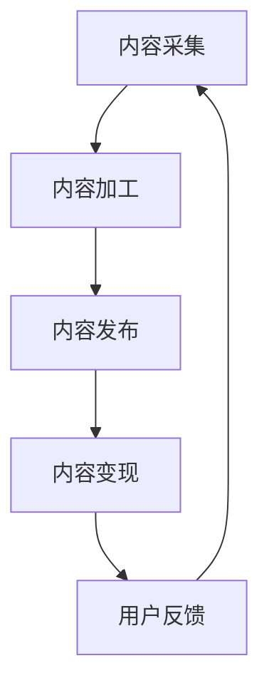

                 

# 知识付费创业的内容产品化策略

## 1. 背景介绍

### 1.1 问题由来

在知识经济时代，内容消费逐渐成为人们日常生活的核心需求。知识付费平台的兴起，使优质内容变得更加有偿，成为互联网生态中不可忽视的一环。如何有效管理并商业化这些内容，成为了创业者面临的首要问题。特别是对于创业初期内容产品化的过程，从内容采集、加工、发布到变现，每一个环节都至关重要。本文将从内容产品化的角度，探讨知识付费创业的策略和实施路径。

### 1.2 问题核心关键点

内容产品化是大数据时代知识付费创业的重要环节。核心关键点主要包括：

- **内容采集**：快速高效地从海量数据中筛选和获取高质量的源内容。
- **内容加工**：进行内容整理、编辑、翻译、音频录制等工作，确保内容高质量。
- **内容发布**：选择合适的发布平台，制定合适的发布策略，提高内容曝光率。
- **内容变现**：通过订阅、广告、增值服务等方式实现内容的商业价值。

内容产品化的成功，不仅能提升用户的订阅率和满意度，还能有效降低平台的运营成本，实现可持续发展。

## 2. 核心概念与联系

### 2.1 核心概念概述

为更好地理解内容产品化的策略和实施路径，本节将介绍几个关键概念：

- **知识付费平台**：通过将优质的教育、行业资讯等知识内容进行打包，实现内容变现的企业或平台。
- **内容采集**：从书籍、论文、专业网站等渠道收集内容，确保内容源的多样性和丰富性。
- **内容加工**：包括内容编辑、校对、翻译、音频录制等工作，确保内容的质量和格式标准化。
- **内容发布**：选择合适的平台（如付费订阅、知识社区、线下课程等）发布内容，并进行营销推广。
- **内容变现**：通过广告、会员订阅、增值服务等方式，实现内容商业价值的最大化。
- **用户反馈**：收集用户的反馈信息，持续优化内容产品。

这些概念之间存在密切的联系。内容采集是内容加工的基础，内容加工是内容发布的前提，内容发布是内容变现的渠道，而用户反馈则不断推动内容产品化的迭代和优化。

### 2.2 核心概念原理和架构的 Mermaid 流程图



该图展示了内容产品化流程的基本架构，从内容采集开始，依次进行内容加工、内容发布、内容变现，并不断接收用户反馈，形成一个持续迭代的过程。

## 3. 核心算法原理 & 具体操作步骤

### 3.1 算法原理概述

内容产品化本质上是一个多步骤的优化过程，涉及数据处理、内容管理、用户互动等多个环节。其核心算法原理主要包括：

- **内容选择算法**：基于用户兴趣和内容特征，选择最适合用户的内容。
- **内容推荐算法**：根据用户行为和内容特征，推荐相关内容，提高用户粘性。
- **内容质量评估算法**：对内容进行质量评估，筛选出优质内容。
- **用户反馈分析算法**：分析用户反馈，改进内容质量和发布策略。

### 3.2 算法步骤详解

#### 3.2.1 内容采集

**步骤1：确定内容采集渠道**
- 通过爬虫、API接口等方式，从专业网站、电子书籍、学术论文等渠道收集内容。
- 与内容供应商合作，获取付费订阅内容或专业讲座内容。

**步骤2：内容筛选**
- 使用自然语言处理技术，进行文本分类、关键词提取、情感分析等，筛选出高质量内容。
- 进行内容冗余度检测，去除重复和低价值内容。

**步骤3：内容存储与管理**
- 建立内容存储库，对内容进行分类、索引和元数据标注。
- 使用内容管理系统(CMS)，方便内容管理、编辑和发布。

#### 3.2.2 内容加工

**步骤1：内容编辑**
- 对原始内容进行编辑，去除错误、冗余信息，进行语法和风格润色。
- 加入引言、注释、参考文献等内容，提升内容可读性。

**步骤2：内容翻译**
- 将部分内容翻译成不同语言，扩大内容覆盖面，吸引更多国际用户。
- 使用自动翻译工具，提高翻译效率，降低成本。

**步骤3：内容格式转换**
- 将内容转换为标准格式，如PDF、EPUB等，便于用户阅读和存储。
- 进行音频录制和编辑，生成高质量的有声读物。

#### 3.2.3 内容发布

**步骤1：选择合适的发布平台**
- 在知识社区（如知乎、豆瓣）发布内容，进行免费分享。
- 通过付费订阅平台（如喜马拉雅、得到）发布内容，实现盈利。
- 举办线下讲座和工作坊，直接与用户互动。

**步骤2：内容策划与推广**
- 制定内容发布计划，进行时间线的排期。
- 通过社交媒体、邮件列表等方式进行内容推广，提高曝光率。

**步骤3：内容监测与优化**
- 监测内容表现，关注订阅率、点击率、用户反馈等关键指标。
- 根据反馈，优化内容质量和发布策略。

#### 3.2.4 内容变现

**步骤1：制定变现策略**
- 通过订阅费、单次购买、付费下载等方式进行盈利。
- 通过广告分成、赞助合作、增值服务等方式增加收入。

**步骤2：价格与包年策略**
- 设计合理的价格体系，满足不同层次用户需求。
- 推出包年订阅、限时优惠、免费试用等策略，提高用户转化率。

**步骤3：用户激励与反馈**
- 通过积分、优惠券等方式，激励用户订阅和购买。
- 定期收集用户反馈，优化内容和服务。

### 3.3 算法优缺点

内容产品化的算法主要优点包括：

- **高效性**：通过自动化处理，大幅提高内容处理效率。
- **精准性**：基于用户行为和内容特征的推荐算法，能够准确推送相关内容。
- **覆盖面广**：内容加工和翻译能够扩大内容的覆盖面，吸引更多用户。

但同时，也存在一些缺点：

- **成本高**：内容采集、加工和翻译都需要大量人力和资源投入。
- **用户体验有限**：自动推荐和翻译可能无法完全满足用户的需求，影响用户体验。
- **灵活性差**：算法可能过于依赖历史数据，难以应对新兴内容的快速变化。

### 3.4 算法应用领域

内容产品化算法广泛适用于各种知识付费平台，如在线教育、行业资讯、专业技能培训等。主要应用领域包括：

- **在线教育**：制作和发布在线课程、专题讲座、电子书等内容，实现知识变现。
- **行业资讯**：发布行业报告、专业文章、市场分析等内容，为行业从业者提供价值信息。
- **专业技能培训**：提供各类专业技能培训课程和教程，帮助用户提升职业技能。
- **健康生活**：提供健康饮食、运动健身、心理健康等内容，满足用户健康生活需求。

## 4. 数学模型和公式 & 详细讲解 & 举例说明

### 4.1 数学模型构建

内容推荐算法基于协同过滤（Collaborative Filtering）和深度学习（Deep Learning）等技术，构建推荐模型。主要模型包括：

- **协同过滤模型**：基于用户行为和物品特征，进行内容推荐。
- **矩阵分解模型**：对用户-物品评分矩阵进行分解，找到隐含的用户兴趣和物品特征。
- **深度学习模型**：如CTR模型、RNN、LSTM等，对用户行为和内容特征进行建模。

### 4.2 公式推导过程

以协同过滤模型为例，假设用户集为 $U$，物品集为 $I$，用户对物品的评分矩阵为 $R$。协同过滤模型的目标是找到低秩矩阵 $X \in \mathbb{R}^{m \times n}$ 和 $Y \in \mathbb{R}^{n \times k}$，使得：

$$
R \approx XY^T
$$

其中 $m$ 为用户数，$n$ 为物品数，$k$ 为隐含特征维度。矩阵 $X$ 和 $Y$ 分别表示用户和物品的隐含特征，可通过奇异值分解(SVD)求解。具体推导过程如下：

1. 构建用户-物品评分矩阵 $R$：
$$
R = \begin{bmatrix}
r_{11} & r_{12} & \ldots & r_{1n} \\
r_{21} & r_{22} & \ldots & r_{2n} \\
\vdots & \vdots & \ddots & \vdots \\
r_{m1} & r_{m2} & \ldots & r_{mn}
\end{bmatrix}
$$

2. 进行奇异值分解：
$$
R = U\Sigma V^T
$$

3. 低秩矩阵分解：
$$
R \approx X Y^T = U\Sigma V^T
$$

其中 $X = U \Sigma^{1/2}$，$Y = V \Sigma^{1/2}$，$\Sigma^{1/2}$ 为 $\Sigma$ 的对角矩阵平方根。

### 4.3 案例分析与讲解

以知乎为例，利用协同过滤模型进行内容推荐。知乎的用户和内容标签形成了一个庞大的用户-物品评分矩阵，每个用户对不同内容进行评分，形成评分矩阵 $R$。通过矩阵分解模型，对 $R$ 进行奇异值分解，得到用户隐含特征矩阵 $X$ 和内容隐含特征矩阵 $Y$。根据用户和内容的隐含特征，计算用户对未评分内容 $i$ 的预测评分 $\hat{r}_{ui}$：

$$
\hat{r}_{ui} = \sum_{j=1}^k X_{uj} Y_{ji}
$$

其中 $X_{uj}$ 和 $Y_{ji}$ 分别为用户 $u$ 和物品 $i$ 在隐含特征 $j$ 上的值。最终，根据预测评分和实际评分之间的差异，进行排序推荐。

## 5. 项目实践：代码实例和详细解释说明

### 5.1 开发环境搭建

在进行内容产品化实践前，我们需要准备好开发环境。以下是使用Python进行Django开发的环境配置流程：

1. 安装Anaconda：从官网下载并安装Anaconda，用于创建独立的Python环境。

2. 创建并激活虚拟环境：
```bash
conda create -n django-env python=3.8 
conda activate django-env
```

3. 安装Django：
```bash
pip install django
```

4. 安装MySQL：
```bash
sudo apt-get install mysql-server
```

5. 安装MySQL连接库：
```bash
pip install mysqlclient
```

6. 安装模板库：
```bash
pip install django-templates
```

完成上述步骤后，即可在`django-env`环境中开始内容产品化系统的开发。

### 5.2 源代码详细实现

我们以知乎内容推荐系统为例，给出使用Django框架实现内容推荐的PyTorch代码实现。

首先，定义协同过滤模型的类：

```python
import torch
import numpy as np
from scipy.sparse import csr_matrix

class CollaborativeFiltering:
    def __init__(self, n_users, n_items, n_factors=100):
        self.n_users = n_users
        self.n_items = n_items
        self.n_factors = n_factors
        self.user_factors = np.random.normal(size=(n_users, n_factors))
        self.item_factors = np.random.normal(size=(n_items, n_factors))
        self.U = None
        self.V = None
        self.S = None
        
    def fit(self, R):
        self.U, self.S, self.V = np.linalg.svd(R, full_matrices=False)
        self.user_factors = np.dot(R, self.V.T)
        self.item_factors = np.dot(R.T, self.U.T)
        
    def predict(self, user, item):
        user_factors = self.user_factors[user]
        item_factors = self.item_factors[item]
        prediction = np.dot(user_factors, item_factors.T)
        return prediction.item()
```

然后，定义Django应用程序的视图和模板：

```python
from django.shortcuts import render
from .models import CollaborativeFiltering
from .recommendations import CollaborativeFiltering

def index(request):
    n_users = 10000
    n_items = 100000
    n_factors = 100
    
    model = CollaborativeFiltering(n_users, n_items, n_factors)
    model.fit(R)
    
    user = 0
    item = 0
    prediction = model.predict(user, item)
    
    return render(request, 'index.html', {'prediction': prediction})
```

最后，启动Django服务器，在浏览器中访问即可：

```bash
python manage.py runserver 8000
```

在浏览器中访问 `http://localhost:8000/`，即可看到预测评分结果。

### 5.3 代码解读与分析

这里我们详细解读一下关键代码的实现细节：

**CollaborativeFiltering类**：
- `__init__`方法：初始化用户数、物品数和隐含特征维度，并随机生成用户和物品的隐含特征矩阵。
- `fit`方法：使用奇异值分解对评分矩阵进行低秩矩阵分解，得到用户和物品的隐含特征矩阵。
- `predict`方法：根据用户和物品的隐含特征矩阵，计算预测评分。

**Django视图**：
- `index`函数：创建协同过滤模型，对评分矩阵进行低秩矩阵分解，计算预测评分。
- `render`函数：渲染HTML页面，将预测评分结果传递给客户端。

**浏览器访问**：
- 通过浏览器访问指定的URL，即可看到预测评分结果。

## 6. 实际应用场景

### 6.1 在线教育平台

在线教育平台的内容产品化主要包括以下几个步骤：

- **内容采集**：从各类公开课、学术讲座、专业书籍等渠道采集高质量内容。
- **内容加工**：进行内容编辑、翻译、格式转换等工作，确保内容高质量。
- **内容发布**：通过平台和社区发布课程、讲座、电子书等内容，并进行推广。
- **内容变现**：通过订阅费、单次购买、付费下载等方式实现盈利。

例如，Coursera平台通过在线视频课程、专业讲座等方式，向全球用户提供优质的教育资源。通过内容产品化策略，Coursera成功实现了知识变现，成为全球知名的在线教育平台。

### 6.2 行业资讯平台

行业资讯平台的内容产品化主要包括以下几个步骤：

- **内容采集**：从专业网站、研究报告、学术论文等渠道采集行业资讯内容。
- **内容加工**：进行内容整理、编辑、翻译等工作，确保内容质量和时效性。
- **内容发布**：通过平台和社区发布行业报告、新闻动态、市场分析等内容，并进行推广。
- **内容变现**：通过广告分成、赞助合作等方式实现盈利。

例如，彭博社通过全球各地的新闻发布、市场分析、行业报告等内容，向全球用户提供实时资讯。通过内容产品化策略，彭博社成功实现了内容变现，成为全球知名的财经信息平台。

### 6.3 专业技能培训平台

专业技能培训平台的内容产品化主要包括以下几个步骤：

- **内容采集**：从各类专业书籍、在线课程、专业讲座等渠道采集技能培训内容。
- **内容加工**：进行内容编辑、翻译、格式转换等工作，确保内容高质量。
- **内容发布**：通过平台和社区发布技能培训课程、在线讲座、电子书等内容，并进行推广。
- **内容变现**：通过订阅费、单次购买、付费下载等方式实现盈利。

例如，网易云课堂平台通过各类在线课程、专业讲座、电子书等方式，向全球用户提供优质的技能培训资源。通过内容产品化策略，网易云课堂成功实现了知识变现，成为全球知名的在线教育平台。

## 7. 工具和资源推荐

### 7.1 学习资源推荐

为了帮助开发者系统掌握内容产品化的理论基础和实践技巧，这里推荐一些优质的学习资源：

1. **《深度学习》书籍**：Ian Goodfellow等人所著，全面介绍了深度学习的基本概念和应用方法。
2. **《自然语言处理》课程**：斯坦福大学开设的自然语言处理课程，涵盖了文本分类、信息检索、机器翻译等NLP技术。
3. **《推荐系统》书籍**：Wu等人所著，介绍了推荐系统的基本原理和应用方法。
4. **《Python网络爬虫》书籍**：张佳玮所著，介绍了Python爬虫的实现方法和技巧。
5. **《Python Django Web开发》书籍**：刘伟所著，介绍了使用Django框架开发Web应用的方法和技巧。

通过对这些资源的学习实践，相信你一定能够快速掌握内容产品化的精髓，并用于解决实际的NLP问题。

### 7.2 开发工具推荐

高效的开发离不开优秀的工具支持。以下是几款用于内容产品化开发的常用工具：

1. **Python**：Python是一种流行的编程语言，适合开发内容产品化系统。Python语言简洁易读，生态系统丰富，适合快速迭代开发。
2. **Django框架**：Django是一个开源的Python Web框架，提供了许多内置功能，如ORM、模板引擎、管理后台等，适合快速开发Web应用。
3. **MySQL数据库**：MySQL是一种流行的关系型数据库，适合存储和处理结构化数据。
4. **PyTorch**：PyTorch是一个基于Python的深度学习框架，适合快速开发和调试机器学习模型。
5. **SciPy**：SciPy是一个Python科学计算库，提供了许多常用的科学计算函数和工具，适合数据处理和分析。

合理利用这些工具，可以显著提升内容产品化任务的开发效率，加快创新迭代的步伐。

### 7.3 相关论文推荐

内容产品化的发展源于学界的持续研究。以下是几篇奠基性的相关论文，推荐阅读：

1. **《协同过滤算法》**：Sarwar等人所著，介绍了协同过滤算法的原理和应用。
2. **《深度学习在推荐系统中的应用》**：He等人所著，介绍了深度学习在推荐系统中的应用方法。
3. **《Python网络爬虫的实现》**：《Python网络爬虫》一书中的相关章节，介绍了Python爬虫的实现方法和技巧。
4. **《Python Django Web开发的实践》**：《Python Django Web开发》一书中的相关章节，介绍了使用Django框架开发Web应用的方法和技巧。
5. **《机器学习在推荐系统中的应用》**：Wang等人所著，介绍了机器学习在推荐系统中的应用方法。

这些论文代表了大数据时代内容产品化的发展脉络。通过学习这些前沿成果，可以帮助研究者把握学科前进方向，激发更多的创新灵感。

## 8. 总结：未来发展趋势与挑战

### 8.1 总结

本文对内容产品化的算法和策略进行了全面系统的介绍。首先阐述了内容产品化的研究背景和意义，明确了内容产品化在知识付费创业中的重要地位。其次，从算法原理和操作步骤，详细讲解了内容产品化的数学模型和具体实现方法。最后，本文广泛探讨了内容产品化在在线教育、行业资讯、专业技能培训等领域的实际应用场景，展示了内容产品化的巨大潜力。通过本文的系统梳理，可以看到，内容产品化方法已经成为知识付费创业的核心手段，极大地拓展了内容的获取、加工和变现方式，为创业者带来了新的机遇和挑战。

### 8.2 未来发展趋势

展望未来，内容产品化的技术将呈现以下几个发展趋势：

1. **自动化内容处理**：随着自然语言处理技术的进步，内容采集和加工的自动化水平将不断提高，降低人工干预的成本。
2. **个性化内容推荐**：基于用户行为和内容特征的推荐算法将不断优化，提升用户粘性和满意度。
3. **多模态内容产品化**：内容产品化将从文本扩展到视频、音频、图像等多种模态，提升内容的表现力和用户互动性。
4. **社交化内容分享**：内容产品化将更注重社交化分享，通过用户生成内容（UGC）和社区互动，丰富内容的来源和形式。
5. **内容版权保护**：随着内容版权意识的提升，内容产品化将更加注重版权保护和内容分发，确保内容的合法性和知识产权。

这些趋势将进一步推动内容产品化的创新和发展，为知识付费创业带来更多的机遇和挑战。

### 8.3 面临的挑战

尽管内容产品化技术已经取得了瞩目成就，但在迈向更加智能化、普适化应用的过程中，它仍面临诸多挑战：

1. **数据质量问题**：内容采集和加工需要高质量的数据源，如何获取和筛选高质量的数据，仍是内容产品化的首要挑战。
2. **用户个性化需求**：不同用户对内容的需求千差万别，如何设计个性化推荐算法，满足不同用户需求，仍需不断探索和优化。
3. **内容版权问题**：内容产品化涉及版权问题，如何处理和保护内容版权，确保内容的合法性和知识产权，仍需法规和技术的双重保障。
4. **内容分发渠道**：内容产品化需要广泛的分发渠道，如何优化分发策略，提高内容的曝光率和转化率，仍需不断实践和改进。
5. **内容变现模式**：内容变现需要合理的模式设计，如何设计多样化的变现模式，提升内容的商业价值，仍需不断创新和探索。

### 8.4 研究展望

面对内容产品化面临的种种挑战，未来的研究需要在以下几个方面寻求新的突破：

1. **自动化内容处理**：探索无监督和半监督内容处理技术，减少对人工干预的依赖。
2. **个性化内容推荐**：引入更多先验知识，设计更加精准和鲁棒的内容推荐算法。
3. **内容版权保护**：引入区块链、加密技术等手段，保护内容版权和知识产权。
4. **多模态内容产品化**：融合视觉、听觉、触觉等多种模态，提升内容的表现力和互动性。
5. **内容分发渠道**：优化内容分发策略，通过社交媒体、直播平台等多种渠道提高内容的曝光率和转化率。

这些研究方向的探索，必将引领内容产品化技术迈向更高的台阶，为知识付费创业带来更多的机遇和挑战。相信随着学界和产业界的共同努力，内容产品化技术必将不断创新，为知识付费创业带来更多的机遇和挑战。

## 9. 附录：常见问题与解答

**Q1：如何选择合适的内容采集渠道？**

A: 选择合适的内容采集渠道，需要考虑内容的多样性和覆盖面。可以从专业网站、电子书籍、学术论文、专业讲座等渠道进行采集。

**Q2：如何进行内容加工？**

A: 内容加工包括内容编辑、翻译、格式转换等工作。可以使用自然语言处理技术进行文本清洗和编辑，使用机器翻译工具进行翻译，使用格式转换工具进行格式转换。

**Q3：如何设计个性化推荐算法？**

A: 个性化推荐算法包括协同过滤、深度学习等方法。可以基于用户行为和内容特征，进行内容推荐。

**Q4：如何进行内容发布？**

A: 选择合适的平台进行内容发布，如在线教育平台、行业资讯平台、专业技能培训平台等。进行内容推广和营销，提高内容的曝光率。

**Q5：如何进行内容变现？**

A: 内容变现包括订阅费、单次购买、付费下载等方式。可以设计合理的定价策略，提升内容的商业价值。

通过本文的系统梳理，可以看到，内容产品化方法已经成为知识付费创业的核心手段，极大地拓展了内容的获取、加工和变现方式，为创业者带来了新的机遇和挑战。相信随着技术的发展和应用的深入，内容产品化方法将在更多的领域得到应用，为知识付费创业带来更多的机遇和挑战。

