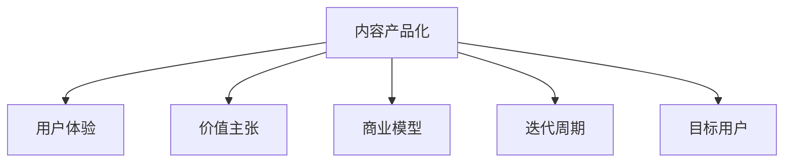

                 

# 知识付费创业的内容产品化策略

## 1. 背景介绍

### 1.1 问题由来

随着知识付费的兴起，越来越多的创作者和平台致力于提供高质量的内容产品，满足用户对知识的学习需求。然而，如何将知识内容成功转化为有市场竞争力的产品，成为了所有内容创业者必须面对的问题。特别是在激烈的市场竞争环境下，如何将内容产品化，获取目标用户的认可和付费，成为决定创业成功与否的关键因素。

### 1.2 问题核心关键点

本节将介绍几个在内容产品化过程中需要关注的几个核心关键点：

- 目标用户：清晰定义目标用户群体，了解他们的需求和痛点，制定针对性的内容策略。
- 价值定位：明确内容产品的价值主张，区分自己与竞争对手的优势。
- 产品生命周期：设计合理的产品迭代周期，不断优化产品以满足用户需求。
- 商业模型：选择合适的盈利模式，实现商业循环。
- 用户体验：优化用户体验，提升用户粘性和满意度。

这些核心关键点构成了内容产品化策略的核心框架，在后续内容中将逐一进行深入探讨。

## 2. 核心概念与联系

### 2.1 核心概念概述

为更好地理解内容产品化策略，本节将介绍几个密切相关的核心概念：

- **内容产品化**：将知识内容转化为可市场化的产品，包括但不限于课程、电子书、文章、视频等形式。
- **用户体验**：用户在使用产品时的体验和感受，包括界面设计、交互流程、内容展示等。
- **价值主张**：产品对用户的独特价值，通过清晰表达和传递差异化优势来吸引用户。
- **商业模型**：产品如何创造价值、分配价值和获取价值，如订阅模式、单次付费、广告分成等。
- **迭代周期**：产品从设计到上线，再到市场验证和优化的整个周期。
- **目标用户**：明确的目标用户群体，以及他们的行为、习惯、需求等。

这些核心概念之间的逻辑关系可以通过以下Mermaid流程图来展示：



这个流程图展示了一个产品从创意到上线、运营、优化的完整过程。

## 3. 核心算法原理 & 具体操作步骤
### 3.1 算法原理概述

内容产品化策略主要涉及以下几个步骤：

- **市场调研**：了解目标用户的需求和痛点，确定内容产品的方向和重点。
- **内容策划**：基于市场调研结果，策划具体的内容形式、主题和结构。
- **产品设计**：根据内容特点和用户需求，设计相应的产品界面和功能。
- **用户体验优化**：不断迭代产品，优化用户体验，提升用户粘性和满意度。
- **商业模型选择**：选择合适的盈利模式，确保产品的可持续运营。
- **市场验证**：通过市场反馈，验证产品的市场潜力和用户接受度。

### 3.2 算法步骤详解

#### 3.2.1 市场调研

- **需求分析**：通过问卷调查、用户访谈等方式，收集目标用户的基本信息和需求偏好。
- **竞品分析**：分析竞争对手的内容产品，了解他们的优势和不足，识别市场机会。
- **趋势分析**：关注行业趋势和热点话题，确定内容产品的热点和时效性。

#### 3.2.2 内容策划

- **主题确定**：根据调研结果，确定内容产品的主题和方向。
- **形式选择**：选择合适的形式（如视频、音频、文字等），以及相应的内容长度和结构。
- **内容创作**：组织专业团队进行内容创作，确保内容的专业性和吸引力。
- **版权管理**：确保内容的版权合法性，避免侵权风险。

#### 3.2.3 产品设计

- **界面设计**：设计直观、易用的产品界面，确保用户操作流畅。
- **功能设计**：根据内容特点，设计相应的功能模块，如搜索、收藏、评论等。
- **性能优化**：优化产品的加载速度和响应速度，确保用户体验。
- **安全设计**：确保产品安全性，防止数据泄露和攻击。

#### 3.2.4 用户体验优化

- **用户反馈**：通过用户反馈，了解用户需求和痛点，进行产品优化。
- **A/B测试**：通过A/B测试，对比不同设计方案，选择最优方案。
- **迭代改进**：根据用户反馈和市场变化，持续优化产品。

#### 3.2.5 商业模型选择

- **订阅模式**：通过订阅收费，获得持续收入。
- **单次付费**：针对特定内容，进行单次付费销售。
- **广告分成**：通过展示广告，获取流量收入。
- **会员增值**：提供高级会员服务，获取更多收入。

#### 3.2.6 市场验证

- **测试版发布**：发布测试版，收集用户反馈。
- **数据分析**：通过数据分析，评估产品的市场潜力和用户接受度。
- **优化改进**：根据市场反馈，进行产品优化。

### 3.3 算法优缺点

内容产品化策略具有以下优点：

- **高效转化**：通过精准的市场调研和内容策划，可以更高效地将知识内容转化为有市场竞争力的产品。
- **用户体验提升**：通过不断的用户体验优化，提升用户粘性和满意度，增强用户忠诚度。
- **差异化竞争**：通过明确的价值主张和优化的商业模型，可以实现差异化竞争，获得市场优势。
- **灵活迭代**：通过合理的迭代周期，不断优化产品，满足用户需求。

同时，该策略也存在一定的局限性：

- **资源投入大**：市场调研、内容创作、产品设计等环节需要大量资源投入。
- **市场风险高**：产品推出后，可能面临用户接受度低、市场竞争激烈等风险。
- **用户体验复杂**：不同的用户群体对产品有不同的需求和期望，设计复杂。
- **商业模式单一**：单一的盈利模式可能无法应对市场变化和用户需求。

尽管存在这些局限性，但内容产品化策略在大规模知识内容分发和商业化应用中，仍是最主流和有效的方法。

### 3.4 算法应用领域

内容产品化策略已经在教育、金融、健康、IT等众多领域得到广泛应用，具体应用场景包括：

- **在线教育**：通过课程、讲座、图书等形式，为用户提供系统化的知识学习服务。
- **金融理财**：提供投资理财、财务规划、税务优化等内容，帮助用户进行个人财务管理。
- **健康生活**：提供健康知识、营养食谱、运动指导等内容，促进用户健康生活。
- **职业发展**：提供职业规划、技能培训、职场技巧等内容，帮助用户提升职业竞争力。
- **IT技术**：提供编程教程、技术博客、开发工具等内容，推动技术社区发展。

除了这些传统领域，内容产品化策略在更多新兴领域也正在展现出广阔的应用前景，如智能家居、农业科技、文化娱乐等，为各行各业带来创新发展的机遇。

## 4. 数学模型和公式 & 详细讲解 & 举例说明

### 4.1 数学模型构建

为更好地进行内容产品化策略的建模，我们引入一个简化版的用户价值函数：

$$ V(u) = V_{core}(u) + V_{additional}(u) $$

其中 $V(u)$ 表示用户对内容的总体价值，$V_{core}(u)$ 表示核心价值，$V_{additional}(u)$ 表示附加价值。核心价值包括内容的专业性、深度和实用性，附加价值包括内容的交互性、易用性和娱乐性。

### 4.2 公式推导过程

假设用户对内容的需求可以用以下函数描述：

$$ D(u) = f(V(u)) $$

其中 $D(u)$ 表示用户对内容的购买意愿，$f$ 是一个映射函数，将用户价值映射为购买意愿。

为了最大化用户价值，内容创作者需要优化内容的 $V_{core}(u)$ 和 $V_{additional}(u)$。例如，通过增加内容的深度和实用性（$V_{core}(u)$），以及提高内容的交互性和娱乐性（$V_{additional}(u)$），来提升用户的购买意愿（$D(u)$）。

### 4.3 案例分析与讲解

以在线教育平台为例，内容创作者需要：

- **优化内容专业性**：聘请名师，确保内容的专业性和权威性。
- **提升内容实用性**：设计案例分析、实际应用等模块，增强内容的实用性。
- **增加内容互动性**：增加互动环节，如在线讨论、课后作业等，提升用户参与度。
- **增强内容娱乐性**：加入趣味元素，如动画、游戏等，提升用户兴趣。

通过这些措施，内容创作者可以显著提升用户价值和购买意愿，实现内容产品的高效转化。

## 5. 项目实践：代码实例和详细解释说明

### 5.1 开发环境搭建

在进行内容产品化策略的开发实践前，我们需要准备好开发环境。以下是使用Python进行Flask开发的环境配置流程：

1. 安装Python和pip：
   ```bash
   sudo apt-get update
   sudo apt-get install python3-pip python3-dev libpq-dev libffi-dev build-essential
   ```

2. 安装Flask：
   ```bash
   pip install Flask
   ```

3. 安装SQLAlchemy和WTForms：
   ```bash
   pip install sqlalchemy wtforms
   ```

4. 安装SQLite和Gunicorn：
   ```bash
   pip install sqlite3 gunicorn
   ```

完成上述步骤后，即可在开发环境中进行内容产品化策略的开发。

### 5.2 源代码详细实现

我们以在线教育平台的课程推荐系统为例，给出Flask代码实现。

首先，定义数据库连接：

```python
from sqlalchemy import create_engine
from sqlalchemy.orm import sessionmaker

engine = create_engine('sqlite:///course.db')
Session = sessionmaker(bind=engine)
```

然后，定义用户模型：

```python
from sqlalchemy import Column, Integer, String, ForeignKey
from sqlalchemy.orm import relationship
from sqlalchemy.ext.declarative import declarative_base

Base = declarative_base()

class User(Base):
    __tablename__ = 'users'
    id = Column(Integer, primary_key=True)
    name = Column(String)
    email = Column(String)
    courses = relationship('Course', back_populates='users')

    def __init__(self, name, email):
        self.name = name
        self.email = email
```

接着，定义课程模型：

```python
from sqlalchemy import Column, Integer, String, ForeignKey
from sqlalchemy.orm import relationship
from sqlalchemy.ext.declarative import declarative_base

Base = declarative_base()

class Course(Base):
    __tablename__ = 'courses'
    id = Column(Integer, primary_key=True)
    name = Column(String)
    description = Column(String)
    user_id = Column(Integer, ForeignKey('users.id'))
    user = relationship('User', back_populates='courses')

    def __init__(self, name, description):
        self.name = name
        self.description = description
```

然后，定义推荐模型：

```python
from sqlalchemy import Column, Integer, String, ForeignKey
from sqlalchemy.orm import relationship
from sqlalchemy.ext.declarative import declarative_base

Base = declarative_base()

class Recommendation(Base):
    __tablename__ = 'recommendations'
    id = Column(Integer, primary_key=True)
    user_id = Column(Integer, ForeignKey('users.id'))
    course_id = Column(Integer, ForeignKey('courses.id'))
    score = Column(Integer)

    def __init__(self, user_id, course_id, score):
        self.user_id = user_id
        self.course_id = course_id
        self.score = score
```

最后，定义Flask应用：

```python
from flask import Flask, render_template, request
from flask_sqlalchemy import SQLAlchemy
from sqlalchemy.orm import relationship

app = Flask(__name__)
app.config['SQLALCHEMY_DATABASE_URI'] = 'sqlite:///course.db'
db = SQLAlchemy(app)

@app.route('/')
def index():
    users = User.query.all()
    return render_template('index.html', users=users)

@app.route('/recommend', methods=['POST'])
def recommend():
    user_id = request.form['user_id']
    course_id = request.form['course_id']
    score = request.form['score']
    recommendation = Recommendation(user_id=user_id, course_id=course_id, score=score)
    db.session.add(recommendation)
    db.session.commit()
    return 'Recommended'

if __name__ == '__main__':
    app.run(debug=True)
```

通过上述代码，可以实现一个简单的在线教育平台课程推荐系统。用户可以在推荐页面上选择喜欢的课程进行推荐，平台将记录用户的推荐行为，用于后续推荐算法的训练和优化。

### 5.3 代码解读与分析

**代码解读**：

- **数据库连接**：使用SQLAlchemy进行数据库连接和操作。
- **用户模型**：定义用户信息，包括姓名和邮箱。
- **课程模型**：定义课程信息，包括名称和描述。
- **推荐模型**：记录用户的推荐行为，包括用户ID、课程ID和推荐分数。
- **Flask应用**：定义路由和视图函数，实现用户交互。

**分析**：

- **安全性**：用户信息需要加密存储，避免信息泄露。
- **性能优化**：使用SQLite数据库，避免复杂查询和索引操作。
- **用户体验**：推荐系统需要设计友好的用户界面，方便用户操作。
- **数据维护**：定期清理用户历史数据，防止数据积累过多，影响查询性能。

### 5.4 运行结果展示

通过上述代码，可以搭建一个简单的在线教育平台课程推荐系统。用户可以在推荐页面上选择喜欢的课程进行推荐，平台将记录用户的推荐行为，用于后续推荐算法的训练和优化。

## 6. 实际应用场景

### 6.1 在线教育平台

在线教育平台可以通过内容产品化策略，将优质的课程资源转化为有市场竞争力的产品，满足不同用户的需求。具体应用场景包括：

- **个性化推荐**：根据用户的学习行为和偏好，推荐最适合的课程。
- **课程评价**：用户可以对课程进行评价，帮助其他用户进行选择。
- **直播互动**：通过直播授课和互动环节，提升学习效果。
- **社区交流**：用户可以在社区中交流学习心得，分享资源。

### 6.2 健康管理应用

健康管理应用可以通过内容产品化策略，为用户提供系统化的健康知识，帮助用户进行健康管理。具体应用场景包括：

- **营养饮食**：提供科学的饮食建议，帮助用户制定健康饮食计划。
- **运动指导**：提供专业的运动指导，帮助用户进行科学锻炼。
- **健康监测**：通过智能穿戴设备，实时监测用户的健康数据。
- **心理疏导**：提供心理健康知识，帮助用户进行情绪管理。

### 6.3 智能家居系统

智能家居系统可以通过内容产品化策略，为用户提供智能化的家居解决方案，提升生活品质。具体应用场景包括：

- **智能安防**：通过视频监控、智能门锁等设备，提升家庭安全。
- **智能控制**：通过语音助手、智能灯光等设备，提升生活便利性。
- **家庭娱乐**：通过智能音箱、智能电视等设备，提升家庭娱乐体验。
- **环境监测**：通过智能传感器，实时监测家庭环境数据。

### 6.4 未来应用展望

随着内容产品化策略的不断发展和应用，未来在更多领域将展现出更大的潜力：

- **智慧城市**：提供智慧城市管理、智能交通、公共服务等内容，提升城市管理效率。
- **农业科技**：提供农业知识、种植指导、智能灌溉等内容，推动农业现代化。
- **文化娱乐**：提供影视、音乐、游戏等内容，丰富文化娱乐生活。
- **教育培训**：提供技能培训、职业指导、技能认证等内容，促进职业教育发展。
- **环保节能**：提供环保知识、节能建议、绿色生活等内容，推动可持续发展。

## 7. 工具和资源推荐

### 7.1 学习资源推荐

为了帮助开发者系统掌握内容产品化策略的理论基础和实践技巧，这里推荐一些优质的学习资源：

1. **《内容营销：从理论到实践》**：详细介绍了内容营销的理论基础和实际应用案例，包括内容策划、用户研究、数据驱动等。
2. **《用户体验设计：从用户需求到产品实现》**：介绍了用户体验设计的核心方法和实践技巧，包括用户研究、原型设计、交互设计等。
3. **《产品管理：从构思到上线》**：详细介绍了产品管理的全流程，包括市场调研、产品规划、产品迭代等。
4. **《增长黑客：如何利用数据驱动营销增长》**：介绍了如何通过数据驱动营销增长，包括用户增长、转化率优化等。
5. **《内容运营：如何打造优质内容生态》**：介绍了如何通过内容运营，打造优质内容生态，提升用户粘性。

通过这些资源的学习实践，相信你一定能够快速掌握内容产品化策略的精髓，并用于解决实际的业务问题。

### 7.2 开发工具推荐

高效的开发离不开优秀的工具支持。以下是几款用于内容产品化策略开发的常用工具：

1. **Jupyter Notebook**：一个强大的交互式编程环境，支持Python、R等语言，适合数据探索和算法实现。
2. **Tableau**：一个强大的数据可视化工具，支持多种数据源，适合数据分析和可视化。
3. **GitLab**：一个全功能的软件开发平台，支持版本控制、持续集成、代码审查等，适合团队协作。
4. **Trello**：一个灵活的项目管理工具，支持任务分配、进度跟踪、协作评论等功能，适合团队管理。
5. **Slack**：一个强大的即时通讯工具，支持多团队协作、文件共享、任务提醒等功能，适合团队沟通。

合理利用这些工具，可以显著提升内容产品化策略的开发效率，加快创新迭代的步伐。

### 7.3 相关论文推荐

内容产品化策略的发展源于学界的持续研究。以下是几篇奠基性的相关论文，推荐阅读：

1. **《内容运营优化：基于用户行为数据分析的方法》**：研究如何通过数据分析优化内容运营策略，提升用户粘性和满意度。
2. **《用户参与度建模：基于社会网络和行为数据的模型》**：研究如何通过社会网络和行为数据建模，提升用户参与度和内容互动性。
3. **《产品创新与用户采纳：基于用户反馈的数据分析》**：研究如何通过用户反馈数据分析，优化产品创新和用户体验。
4. **《个性化推荐系统：基于协同过滤和深度学习的方法》**：研究如何通过协同过滤和深度学习，实现个性化推荐，提升用户满意度。
5. **《内容优化：基于情感分析和用户反馈的策略》**：研究如何通过情感分析和用户反馈，优化内容策略，提升用户价值。

这些论文代表了大规模内容产品化策略的研究进展。通过学习这些前沿成果，可以帮助研究者把握学科前进方向，激发更多的创新灵感。

## 8. 总结：未来发展趋势与挑战

### 8.1 总结

本文对内容产品化策略进行了全面系统的介绍。首先阐述了内容产品化策略的背景和意义，明确了内容产品化策略在内容创业中的重要性。其次，从原理到实践，详细讲解了内容产品化策略的数学模型和核心步骤，给出了内容产品化策略的代码实例。同时，本文还广泛探讨了内容产品化策略在教育、健康、智能家居等多个领域的应用前景，展示了内容产品化策略的巨大潜力。

通过本文的系统梳理，可以看到，内容产品化策略在大规模知识内容分发和商业化应用中，仍是最主流和有效的方法。未来，伴随技术的发展和应用的深入，内容产品化策略将展现出更大的应用空间。

### 8.2 未来发展趋势

展望未来，内容产品化策略将呈现以下几个发展趋势：

1. **多渠道分发**：内容产品化策略将更注重多渠道分发，如社交媒体、视频平台、博客等，扩大内容覆盖范围。
2. **个性化推荐**：通过更加智能的推荐算法，实现个性化内容推荐，提升用户满意度和粘性。
3. **内容交互**：提升内容与用户的互动性，如实时评论、在线问答等，增强用户参与度。
4. **用户生成内容**：鼓励用户生成内容，提升内容多样性和用户粘性。
5. **数据驱动决策**：通过大数据分析，优化内容策略和用户行为，实现数据驱动决策。

以上趋势凸显了内容产品化策略的广阔前景。这些方向的探索发展，必将进一步提升内容系统的性能和应用范围，为知识传播和商业化应用带来新的机遇。

### 8.3 面临的挑战

尽管内容产品化策略已经取得了显著的成果，但在迈向更加智能化、普适化应用的过程中，它仍面临诸多挑战：

1. **资源投入大**：内容创作、用户调研、产品设计等环节需要大量资源投入。
2. **市场风险高**：产品推出后，可能面临用户接受度低、市场竞争激烈等风险。
3. **用户体验复杂**：不同的用户群体对内容有不同的需求和期望，设计复杂。
4. **数据隐私问题**：用户数据隐私保护成为关注的焦点，需要设计严密的数据保护机制。
5. **内容审核**：如何有效审核内容，防止有害信息传播，成为重要挑战。

尽管存在这些挑战，但内容产品化策略在大规模知识内容分发和商业化应用中，仍是最主流和有效的方法。未来的研究需要在数据、算法、工程、业务等多个维度协同发力，克服现有挑战，实现内容系统的可持续发展。

### 8.4 研究展望

未来的研究需要在以下几个方面寻求新的突破：

1. **数据驱动的内容创作**：通过大数据分析，优化内容创作方向和结构，提升内容质量。
2. **智能推荐系统**：引入更多智能推荐算法，提升推荐精度和多样性，增强用户满意度。
3. **多渠道分发策略**：研究如何通过多渠道分发，最大化内容覆盖范围和用户粘性。
4. **用户生成内容平台**：构建用户生成内容平台，提升内容多样性和用户粘性。
5. **内容审核机制**：研究如何构建有效的内容审核机制，防止有害信息传播。

这些研究方向的探索，必将引领内容产品化策略迈向更高的台阶，为构建人机协同的智能内容系统铺平道路。面向未来，内容产品化策略还需要与其他人工智能技术进行更深入的融合，如自然语言处理、计算机视觉等，多路径协同发力，共同推动内容系统的进步。只有勇于创新、敢于突破，才能不断拓展内容系统的边界，让内容系统更好地服务于知识传播和商业化应用。

## 9. 附录：常见问题与解答

**Q1: 内容产品化策略如何应对市场竞争？**

A: 内容产品化策略的核心在于内容价值和用户体验，通过优化这两方面，可以提升用户粘性和满意度，增强市场竞争力。具体措施包括：

- **差异化定位**：通过市场调研，明确自身的差异化优势，如专业性、实用性、娱乐性等。
- **多渠道分发**：通过多种渠道分发内容，扩大内容覆盖范围。
- **个性化推荐**：通过智能推荐算法，提升个性化内容推荐，增强用户粘性。
- **用户生成内容**：鼓励用户生成内容，提升内容多样性和用户粘性。

**Q2: 如何通过数据驱动优化内容产品？**

A: 通过数据驱动优化内容产品，需要：

- **用户行为分析**：通过用户行为数据分析，了解用户需求和痛点。
- **内容效果评估**：通过内容效果评估，优化内容策略和设计。
- **内容优化迭代**：根据用户反馈和市场变化，持续优化内容产品。
- **内容创新**：通过大数据分析，发现新的话题和趋势，推动内容创新。

**Q3: 内容产品化策略如何应对资源限制？**

A: 内容产品化策略需要：

- **资源合理分配**：合理分配资源，确保内容创作、用户调研、产品设计等环节的有效投入。
- **工具高效利用**：利用高效的开发工具，如Jupyter Notebook、Tableau等，提升开发效率。
- **技术协同**：与技术团队协同合作，共同优化内容产品。
- **外部合作**：与内容合作伙伴合作，共享资源和平台。

**Q4: 如何通过用户反馈优化内容产品？**

A: 通过用户反馈优化内容产品，需要：

- **用户调研**：通过用户调研，了解用户需求和痛点。
- **用户反馈渠道**：建立用户反馈渠道，及时获取用户反馈。
- **反馈分析**：分析用户反馈，总结问题点和优化方向。
- **反馈实施**：根据用户反馈，优化内容产品。

**Q5: 如何构建有效的用户生成内容平台？**

A: 构建用户生成内容平台，需要：

- **平台设计**：设计友好的平台界面和功能，方便用户生成内容。
- **激励机制**：建立激励机制，鼓励用户生成内容。
- **内容审核**：构建内容审核机制，防止有害信息传播。
- **社区管理**：建立社区管理机制，维护平台秩序。

通过以上措施，可以构建一个有效的用户生成内容平台，提升内容多样性和用户粘性。

---

作者：禅与计算机程序设计艺术 / Zen and the Art of Computer Programming

