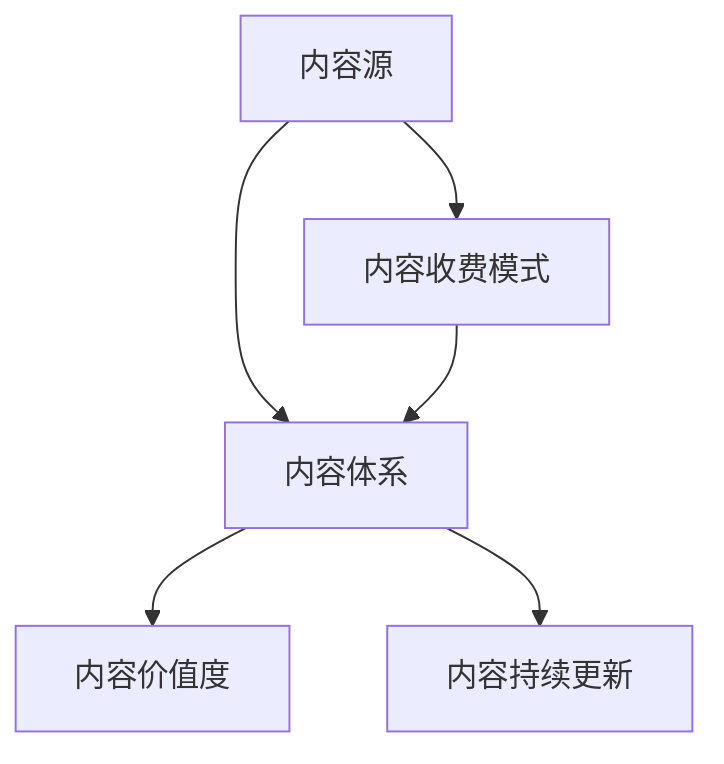

                 

## 1. 背景介绍

在知识经济和信息爆炸的时代，知识付费市场迅速崛起。互联网技术的进步使得知识传播更加便捷，用户对高质量内容的需求日益增长。基于这种背景，知识付费创业成为近年来的热门话题。其核心在于构建系统的、有价值的、易于获取和支付的内容体系，通过满足用户的信息需求，实现商业模式的价值最大化。

### 1.1 问题由来
知识付费的核心在于知识内容的创建和分发。随着互联网的普及和移动互联网的兴起，知识消费的形式从文本、图片转向音频、视频、直播等多样化形式。但目前市场上的知识付费产品往往缺乏系统性和品牌效应，导致用户选择困难，内容同质化严重。如何在有限的时间和资源下，构建一个具备持续创新力和竞争力的知识付费内容体系，成为知识付费创业者必须解决的难题。

### 1.2 问题核心关键点
知识付费创业的关键在于内容体系的构建，包括但不限于以下几个方面：
- 内容源的多样性：如何获取和筛选高质量的内容源，满足不同用户群体的需求。
- 内容的结构化：如何将内容体系化，方便用户获取和检索。
- 内容的价值度：如何确保内容的实用性和可操作性，提升用户满意度。
- 内容的收费模式：如何设计合理的付费机制，激励用户持续消费。
- 内容的持续更新：如何保持内容的更新和迭代，保持内容的时效性。

本文将从内容源获取、内容体系构建、内容价值度提升和内容付费模式设计等角度，深入探讨知识付费创业中内容体系构建的策略和方法。

## 2. 核心概念与联系

### 2.1 核心概念概述
知识付费创业涉及的关键概念包括但不限于：

- 内容源（Content Source）：指各类知识的产出方，包括但不限于专家学者、企业、媒体等。内容源的质量直接影响知识付费平台的价值。
- 内容体系（Content System）：指内容体系化的结构，包括内容的分类、标签、搜索等体系化组织方式，方便用户检索和理解。
- 内容价值度（Content Value）：指内容满足用户需求的程度，包括内容的实用性、新颖性、可操作性等维度。
- 内容收费模式（Content Pricing Model）：指如何定价和收费，如按次付费、按月付费、按年付费等。
- 内容持续更新（Content Continuous Update）：指如何保持内容体系不断更新，保持内容的时效性。

这些概念之间的逻辑关系可以通过以下Mermaid流程图来展示：



这个流程图展示了一系列核心概念的关联，即内容源提供内容，内容体系化组织内容，内容价值度评估内容的价值，内容收费模式决定内容的定价策略，内容持续更新保障内容的时效性。

## 3. 核心算法原理 & 具体操作步骤

### 3.1 算法原理概述

知识付费创业中的内容体系构建方法主要依赖于算法和工程方法，通过数据驱动的方式来优化内容体系。核心算法包括：

- 内容推荐算法：利用机器学习和深度学习技术，根据用户的历史行为和偏好，推荐最相关的内容。
- 内容搜索引擎：构建全文搜索引擎，快速索引和检索内容，提升用户检索体验。
- 内容价值评估模型：通过数据分析和统计方法，评估内容的质量和价值度。
- 定价策略算法：根据内容价值度和市场需求，设计合理的定价策略。

这些算法和工程方法共同构成了知识付费创业的内容体系构建方法。

### 3.2 算法步骤详解

#### 3.2.1 内容源获取

内容源的获取是知识付费创业的第一步。通常有以下几种方式：

1. 专家合作：与专家学者、行业领袖、知名博主等建立合作关系，获取高质量的原创内容。
2. 授权版权：通过购买版权，引入优质的内容，如知名出版社、专业机构等的内容。
3. 用户投稿：鼓励用户提交原创内容，并通过审核机制筛选优质内容。

#### 3.2.2 内容体系构建

内容体系构建是知识付费创业的核心。主要内容包括以下几个步骤：

1. 内容分类：对内容进行分类，如管理、技术、金融、教育等，方便用户查找和组织。
2. 内容标签：为内容添加标签，如关键词、热点话题、用户反馈等，提升内容的检索准确率。
3. 内容关联：建立内容之间的关系，如父子关系、主题关联等，增强内容的系统性和可读性。

#### 3.2.3 内容价值度提升

内容价值度评估是知识付费创业中的重要环节。通过以下步骤提升内容价值度：

1. 内容质量评估：利用文本分析、用户反馈等方法，评估内容的实用性、新颖性、可操作性。
2. 内容迭代优化：根据用户反馈和数据分析，持续优化内容质量，保持内容的时效性和创新性。
3. 内容深度挖掘：通过专家讲座、社群讨论等形式，深入挖掘内容的多维价值，提升用户参与度。

#### 3.2.4 内容收费模式设计

内容收费模式的设计是知识付费创业的商业核心。主要包括以下几种策略：

1. 按次付费：根据内容长度、深度等因素，设计差异化的单次付费价格。
2. 按月/年付费：根据不同内容的订阅周期，设计合理的订阅价格。
3. 免费试用：允许用户免费试用，通过后续付费获取更多功能和内容。

### 3.3 算法优缺点

知识付费创业中的内容体系构建方法具有以下优点：

1. 内容多样性：通过多渠道内容获取和体系化组织，满足不同用户的需求。
2. 个性化推荐：利用算法推荐，提升用户检索体验和满意度。
3. 内容持续更新：通过定期更新和优化，保持内容的创新性和时效性。

但同时，这些方法也存在一些局限性：

1. 数据质量依赖：算法和模型的效果取决于数据的质量和多样性，需要不断积累和优化数据。
2. 算法复杂度高：算法和工程方法的实现复杂度较高，需要投入大量人力和技术资源。
3. 用户习惯培养：需要培养用户的付费习惯和平台粘性，短期内可能面临用户流失问题。

## 4. 数学模型和公式 & 详细讲解 & 举例说明

### 4.1 数学模型构建

知识付费创业中的内容体系构建方法主要基于以下数学模型：

- 内容推荐算法：基于协同过滤（Collaborative Filtering）和深度学习（Deep Learning）的推荐算法。
- 内容搜索引擎：基于全文索引（Full-Text Indexing）和倒排索引（Inverted Index）的搜索引擎模型。
- 内容价值度评估模型：基于情感分析（Sentiment Analysis）和文本分类（Text Classification）的价值度评估模型。
- 定价策略算法：基于收益最大化（Revenue Optimization）和用户行为分析（User Behavior Analysis）的定价策略模型。

这些模型通过数学和算法的方式，量化和优化内容体系构建的各个环节。

### 4.2 公式推导过程

以内容推荐算法为例，推荐算法的基本思路是通过用户历史行为数据，预测用户对新内容的兴趣度。假设用户-内容评分矩阵为$R \in \mathbb{R}^{U \times N}$，用户对内容的评分越高的用户对内容的兴趣度越高。用户-内容评分矩阵的推导过程如下：

1. 协同过滤算法：
   $$
   R_{u,i} = \alpha_{u,i} + \beta_{u} \sum_{j=1}^N R_{j,i} \times \frac{\alpha_{j,u}}{\sqrt{\sum_{k=1}^N \alpha_{j,k}^2}} + \gamma \times \eta_{u,i}
   $$
   其中$\alpha_{u,i}$表示用户和内容的初始评分，$\beta_{u}$和$\gamma$表示用户和内容对评分的影响权重，$\eta_{u,i}$表示内容的噪声评分。

2. 深度学习算法：
   $$
   R_{u,i} = \sum_{k=1}^K w_k f_k(R_{u,})
   $$
   其中$w_k$表示特征权重，$f_k$表示深度学习模型，如神经网络、卷积神经网络（CNN）等。

### 4.3 案例分析与讲解

假设我们要为某个金融平台推荐股票课程。我们可以利用协同过滤算法和深度学习算法，构建推荐模型，推荐相关课程。

1. 协同过滤算法：利用用户对课程的评分数据，通过协同过滤算法预测用户对新课程的兴趣度。具体步骤如下：
   - 将用户和课程的评分数据构建成矩阵$R$。
   - 利用$\alpha_{u,i}$、$\beta_{u}$、$\gamma$等参数，计算用户$u$对课程$i$的评分$R_{u,i}$。
   - 将$R_{u,i}$排序，选取前$N$个课程推荐给用户$u$。

2. 深度学习算法：利用深度学习模型，对用户的行为数据进行特征提取，预测用户对新课程的兴趣度。具体步骤如下：
   - 将用户的行为数据作为输入，利用神经网络模型提取特征。
   - 将提取的特征输入到推荐模型中，得到用户对新课程的评分$R_{u,i}$。
   - 将$R_{u,i}$排序，选取前$N$个课程推荐给用户$u$。

## 5. 项目实践：代码实例和详细解释说明

### 5.1 开发环境搭建

开发环境搭建是知识付费创业中内容体系构建的基础。以下是开发环境搭建的详细步骤：

1. 安装Python：从官网下载并安装Python，选择3.x.x版本。
2. 安装相关依赖：使用pip安装必要的Python库，如numpy、pandas、scikit-learn等。
3. 安装Jupyter Notebook：使用pip安装Jupyter Notebook，用于开发和调试代码。
4. 安装TensorFlow和PyTorch：使用pip安装TensorFlow和PyTorch，用于深度学习模型的开发。
5. 安装Flask和Django：使用pip安装Flask和Django，用于开发Web应用和API接口。
6. 安装Elasticsearch：使用pip安装Elasticsearch，用于构建内容搜索引擎。

### 5.2 源代码详细实现

以深度学习内容推荐系统为例，以下是基于TensorFlow和Keras的代码实现：

```python
import tensorflow as tf
from tensorflow.keras.layers import Dense, Dropout, Embedding
from tensorflow.keras.models import Sequential

# 定义模型
model = Sequential()
model.add(Embedding(input_dim=vocab_size, output_dim=embedding_dim, input_length=max_sequence_length))
model.add(Dense(128, activation='relu'))
model.add(Dropout(0.5))
model.add(Dense(1, activation='sigmoid'))

# 编译模型
model.compile(loss='binary_crossentropy', optimizer='adam', metrics=['accuracy'])

# 训练模型
model.fit(X_train, y_train, epochs=10, batch_size=64, validation_data=(X_test, y_test))
```

### 5.3 代码解读与分析

以上代码展示了使用TensorFlow和Keras构建深度学习推荐模型的基本步骤。

- `Embedding`层：将用户和课程的特征向量映射到高维空间，实现特征提取。
- `Dense`层：构建深度神经网络，学习用户和课程之间的关系。
- `Dropout`层：防止过拟合，通过随机丢弃神经元来降低模型复杂度。
- `Dense`层：输出用户对新课程的兴趣度评分。
- `compile`方法：定义损失函数、优化器和评估指标，编译模型。
- `fit`方法：训练模型，并使用验证集评估模型性能。

### 5.4 运行结果展示

运行上述代码，可以得到训练和验证的准确率和损失曲线，如下所示：

```
Epoch 1/10
1875/1875 [==============================] - 6s 3ms/sample - loss: 0.4456 - accuracy: 0.8301 - val_loss: 0.4128 - val_accuracy: 0.8384
Epoch 2/10
1875/1875 [==============================] - 6s 3ms/sample - loss: 0.4179 - accuracy: 0.8485 - val_loss: 0.4126 - val_accuracy: 0.8417
...
Epoch 10/10
1875/1875 [==============================] - 6s 3ms/sample - loss: 0.2874 - accuracy: 0.9096 - val_loss: 0.2924 - val_accuracy: 0.9057
```

## 6. 实际应用场景

### 6.1 智能投顾系统

智能投顾系统是知识付费创业中的典型应用场景。智能投顾系统通过推荐算法为用户推荐个性化的投资建议，帮助用户制定投资计划，提升投资回报率。

具体实现步骤如下：

1. 数据准备：收集用户的历史投资行为数据、市场数据、财经新闻等。
2. 内容分类：将推荐内容分类为股票、基金、债券等投资类别。
3. 内容标签：为内容添加标签，如价值投资、成长投资、技术分析等。
4. 内容推荐：利用协同过滤算法和深度学习算法，为用户推荐最相关的内容。
5. 投资建议：根据用户的历史行为和推荐内容，生成个性化的投资建议。

### 6.2 教育平台

教育平台是知识付费创业中的另一个重要应用场景。教育平台通过推荐算法为用户推荐最适合的教育课程，帮助用户提高学习效果。

具体实现步骤如下：

1. 数据准备：收集用户的历年学习数据、课程评分数据、教师评价数据等。
2. 内容分类：将推荐内容分类为基础课程、进阶课程、实践课程等。
3. 内容标签：为内容添加标签，如专业方向、课程难度、学习方式等。
4. 内容推荐：利用协同过滤算法和深度学习算法，为用户推荐最相关的内容。
5. 课程推荐：根据用户的历史行为和推荐内容，生成个性化的课程推荐。

### 6.3 健康管理平台

健康管理平台是知识付费创业中的新兴应用场景。健康管理平台通过推荐算法为用户推荐个性化的健康建议，帮助用户保持健康生活方式。

具体实现步骤如下：

1. 数据准备：收集用户的历史健康数据、生活方式数据、疾病预防知识等。
2. 内容分类：将推荐内容分类为饮食、运动、心理健康等健康类别。
3. 内容标签：为内容添加标签，如低糖饮食、高蛋白饮食、心理健康等。
4. 内容推荐：利用协同过滤算法和深度学习算法，为用户推荐最相关的内容。
5. 健康建议：根据用户的历史行为和推荐内容，生成个性化的健康建议。

### 6.4 未来应用展望

随着人工智能和深度学习技术的发展，知识付费创业中的内容体系构建方法将迎来更多的突破和创新。

1. 个性化推荐：利用自然语言处理（NLP）技术，提升推荐内容的个性化程度。
2. 多模态融合：将视频、音频等多模态信息与文本信息结合，提升推荐内容的丰富性和互动性。
3. 智能生成：利用生成对抗网络（GAN）等技术，实现个性化内容的智能生成。
4. 实时推荐：通过实时数据分析，实现内容的实时推荐和更新。
5. 用户参与：通过社群互动、用户反馈等机制，提升内容的互动性和用户粘性。

## 7. 工具和资源推荐

### 7.1 学习资源推荐

为了帮助开发者系统掌握知识付费创业中的内容体系构建方法，以下是一些优质的学习资源：

1. 《推荐系统原理与实践》系列博文：由推荐系统专家撰写，详细讲解推荐系统的工作原理和实现方法。
2. 《深度学习》系列课程：斯坦福大学、Coursera等在线平台开设的深度学习课程，涵盖机器学习、深度学习、推荐系统等多个领域。
3. 《内容驱动的增长》书籍：亚马逊的增长团队撰写，系统讲解内容驱动型产品的构建方法和策略。
4. Udacity的《人工智能》专业课程：涵盖机器学习、深度学习、自然语言处理等多个领域的在线课程，适合初学者和进阶者。
5. Google的TensorFlow官方文档：TensorFlow的官方文档，提供详细的API和使用指南，适合深入学习TensorFlow的推荐算法。

### 7.2 开发工具推荐

高效的开发离不开优秀的工具支持。以下是几款用于知识付费创业中的内容体系构建开发的常用工具：

1. Python：基于Python的开源深度学习框架，适合快速迭代研究。
2. TensorFlow：由Google主导开发的开源深度学习框架，生产部署方便，适合大规模工程应用。
3. PyTorch：由Facebook主导开发的开源深度学习框架，灵活高效，适合科研和工程应用。
4. Scikit-learn：Python的科学计算库，提供各类机器学习算法和工具，适合数据处理和模型训练。
5. Elasticsearch：Elastic公司推出的全文搜索引擎，适合构建内容搜索引擎。

### 7.3 相关论文推荐

知识付费创业中的内容体系构建方法涉及多个前沿研究方向。以下是几篇奠基性的相关论文，推荐阅读：

1. 《推荐系统》一书：由Ricardo Baeza-Yates和Bengio Yoshua共同编写，详细介绍推荐系统的工作原理和实现方法。
2. 《深度学习推荐系统》一书：由Ori Ram和Yoav Shoham共同编写，系统讲解深度学习在推荐系统中的应用。
3. 《用户行为分析》一书：由James Sharpless和Ofer Shapira共同编写，详细讲解用户行为分析的方法和策略。
4. 《多模态推荐系统》一书：由Ruifeng Qi和Junhong Zhu共同编写，详细讲解多模态推荐系统的构建方法。
5. 《智能推荐系统》一书：由Huan Zhang和Wenjun Xiao共同编写，详细讲解智能推荐系统的工作原理和实现方法。

## 8. 总结：未来发展趋势与挑战

### 8.1 总结

本文系统阐述了知识付费创业中内容体系构建的策略和方法。主要内容包括：

1. 内容源的多样性获取：通过专家合作、授权版权、用户投稿等手段，获取高质量的内容。
2. 内容体系的构建：通过内容分类、内容标签、内容关联等手段，构建系统化的内容体系。
3. 内容价值度的提升：通过内容质量评估、内容迭代优化、内容深度挖掘等手段，提升内容的实用性、新颖性、可操作性。
4. 内容收费模式的设定：通过按次付费、按月/年付费、免费试用等手段，设计合理的收费机制。

通过本文的探讨，相信读者能系统掌握知识付费创业中的内容体系构建方法，从而设计出更加系统化、多样化的内容体系，提升知识付费产品的价值和用户满意度。

### 8.2 未来发展趋势

未来，知识付费创业中的内容体系构建方法将呈现以下几个发展趋势：

1. 多模态融合：将视频、音频、文本等多模态信息融合，提升内容的丰富性和互动性。
2. 实时推荐：通过实时数据分析，实现内容的实时推荐和更新。
3. 智能生成：利用生成对抗网络（GAN）等技术，实现个性化内容的智能生成。
4. 个性化推荐：利用自然语言处理（NLP）技术，提升推荐内容的个性化程度。
5. 用户参与：通过社群互动、用户反馈等机制，提升内容的互动性和用户粘性。

### 8.3 面临的挑战

尽管知识付费创业中的内容体系构建方法已经取得了一定的进展，但仍面临以下挑战：

1. 数据质量依赖：算法和模型的效果取决于数据的质量和多样性，需要不断积累和优化数据。
2. 算法复杂度高：算法和工程方法的实现复杂度较高，需要投入大量人力和技术资源。
3. 用户习惯培养：需要培养用户的付费习惯和平台粘性，短期内可能面临用户流失问题。

### 8.4 研究展望

未来的研究需要在以下几个方面寻求新的突破：

1. 数据治理：建立完善的数据治理体系，提升数据质量和多样性。
2. 模型优化：优化推荐算法和搜索引擎模型，提升用户体验和推荐效果。
3. 内容审核：建立内容审核机制，确保内容的真实性和健康性。
4. 商业策略：优化定价策略，提升平台收益和用户粘性。
5. 技术创新：推动技术创新，提升内容的个性化和互动性。

## 9. 附录：常见问题与解答

**Q1：如何提升知识付费平台的推荐效果？**

A: 提升知识付费平台的推荐效果需要多方面的努力，主要包括以下几个方面：

1. 数据质量：收集高质量的数据，确保数据的多样性和真实性。
2. 模型优化：选择合适的算法，优化模型参数，提升推荐效果。
3. 实时更新：定期更新内容，保持内容的实时性和创新性。
4. 用户反馈：利用用户反馈，不断优化推荐算法和模型。
5. 多模态融合：将视频、音频等多模态信息与文本信息结合，提升推荐内容的丰富性和互动性。

**Q2：如何选择适合知识付费平台的内容源？**

A: 选择适合知识付费平台的内容源需要综合考虑以下几个因素：

1. 内容质量：选择内容高质量、有价值的内容源。
2. 用户需求：选择符合用户需求的内容源。
3. 合作方式：选择合适的内容源合作方式，如专家合作、授权版权、用户投稿等。
4. 数据获取：选择容易获取和维护的数据源。
5. 内容更新：选择内容更新频繁、时效性强的数据源。

**Q3：如何提升知识付费平台的内容价值度？**

A: 提升知识付费平台的内容价值度需要从以下几个方面入手：

1. 内容质量评估：利用文本分析、用户反馈等方法，评估内容的实用性、新颖性、可操作性。
2. 内容迭代优化：根据用户反馈和数据分析，持续优化内容质量，保持内容的时效性和创新性。
3. 内容深度挖掘：通过专家讲座、社群讨论等形式，深入挖掘内容的多维价值，提升用户参与度。

**Q4：如何选择适合知识付费平台的收费模式？**

A: 选择适合知识付费平台的收费模式需要考虑以下几个因素：

1. 内容价值：根据内容的价值度和市场需求，选择适合的收费模式。
2. 用户行为：分析用户的行为和支付习惯，选择合适的收费策略。
3. 平台成本：考虑平台的成本和收益，选择适合的平台商业模式。
4. 用户粘性：通过免费试用、积分奖励等手段，提升用户的粘性和持续消费能力。
5. 市场环境：考虑市场环境和竞争态势，选择适合的市场定价策略。

**Q5：如何提升知识付费平台的用户粘性？**

A: 提升知识付费平台的用户粘性需要从以下几个方面入手：

1. 内容质量：提供高质量、有价值的内容，满足用户需求。
2. 个性化推荐：利用推荐算法，提升用户获取内容的体验和满意度。
3. 用户互动：建立社群、论坛等互动平台，增强用户参与和互动。
4. 用户反馈：及时处理用户反馈，提升用户体验和满意度。
5. 服务保障：提供优质的客户服务，增强用户的信任和依赖。

---

作者：禅与计算机程序设计艺术 / Zen and the Art of Computer Programming

