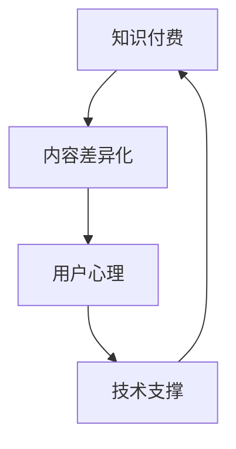

                 

# 知识付费创业的内容差异化策略

## 1. 背景介绍

### 1.1 问题由来
在知识付费领域，内容的同质化问题一直困扰着众多创业者。面对市场过饱和、内容生产者的竞争加剧，如何打造独特且有价值的差异化内容，成为了当前知识付费创业者亟需解决的核心问题。知识付费的核心在于知识输出，高质量、差异化、有深度的内容是吸引用户、提升用户留存率的关键。

### 1.2 问题核心关键点
内容差异化策略的精髓在于如何通过独特的视角、专业的方法论、深度的话题探讨等，使内容与众不同，从而在竞争激烈的市场中脱颖而出。以下是实施内容差异化策略的几个关键点：

- **定位精准**：明确内容的目标受众、市场定位及核心竞争力。
- **内容创新**：探索和开发新的内容形式、话题及表达方式，保持内容的新鲜感和趣味性。
- **专业化水平**：在某一专业领域深入挖掘，提供深度、独到见解。
- **互动与社交**：加强内容与用户的互动，构建社群，提供价值互动与社交平台。

## 2. 核心概念与联系

### 2.1 核心概念概述

为更好地理解知识付费内容差异化的策略，我们需要理解几个核心概念：

- **知识付费**：用户为获取某一领域或某类知识而支付费用的行为。涵盖线上线下的各类知识分享平台。
- **内容差异化**：通过独特的视角、形式和深度，使内容区别于其他同类内容，形成竞争优势。
- **用户心理**：理解用户的心理需求和消费动机，提升用户体验和满意度。
- **技术支撑**：利用技术手段实现内容形式的创新，如多媒体、AI等，提升内容质量和体验。

这些核心概念共同构成了知识付费创业内容差异化策略的基础框架。通过理解这些概念，我们可以更系统地进行内容差异化设计。

### 2.2 核心概念原理和架构的 Mermaid 流程图(Mermaid 流程节点中不要有括号、逗号等特殊字符)



这个流程图展示了知识付费、内容差异化、用户心理、技术支撑之间的联系和影响：

1. 知识付费是目标场景，内容差异化是实现目标的手段。
2. 内容差异化需考虑用户心理需求，即用户的兴趣、需求和期望。
3. 技术支撑是实现内容差异化的工具和方法。
4. 知识付费的效果需要基于以上三者协同作用。

## 3. 核心算法原理 & 具体操作步骤
### 3.1 算法原理概述

知识付费内容差异化的算法原理主要基于以下几个关键步骤：

1. **市场调研**：通过对目标用户群体的深入调研，了解他们的需求和偏好。
2. **内容定位**：根据调研结果，精准定位内容方向和目标受众。
3. **差异化设计**：结合用户心理和市场需求，进行内容形式的创新和深度话题探讨。
4. **技术应用**：利用最新技术手段实现内容形式的提升和互动功能的增强。
5. **持续优化**：根据用户反馈和市场变化，不断调整和优化内容策略。

### 3.2 算法步骤详解

**Step 1: 市场调研**
- 收集和分析目标用户群体的人口统计特征、消费习惯、知识需求等。
- 调研竞争对手内容特点、用户评价等，了解市场现状。

**Step 2: 内容定位**
- 基于市场调研结果，确定内容的方向和核心竞争力。
- 定义内容的类型（如音频、视频、文字、互动课程等）和传播方式（如直播、录播、图文等）。
- 设立内容标准和生产流程，保证内容的质量和连续性。

**Step 3: 差异化设计**
- 结合用户心理，设计内容话题，满足用户的深层次需求。
- 创新内容形式，如采用讲故事、纪录片、互动问答等新方式。
- 强化内容的互动性，如增加讨论区、用户评论等，构建社区感。
- 引入AI技术，实现个性化推荐和智能分发，提升用户体验。

**Step 4: 技术应用**
- 利用多媒体技术提升内容的视听体验。
- 应用AI进行内容生成和分析，如自然语言处理、机器学习等，提高内容创新效率。
- 利用大数据技术，进行用户行为分析和预测，实现精准投放。

**Step 5: 持续优化**
- 定期收集用户反馈和市场变化，调整内容策略。
- 进行内容实验和测试，不断探索和尝试新的内容形式和话题。
- 引入用户参与内容制作，提高内容的真实性和互动性。

### 3.3 算法优缺点

知识付费内容差异化的算法有以下优点：

- **提升用户体验**：通过独特和高质量的内容，提升用户满意度和留存率。
- **增强市场竞争力**：差异化内容有助于在竞争激烈的市场中脱颖而出。
- **增加用户粘性**：高质量、深度、互动性强的内容，使用户持续关注和参与。
- **技术支持**：利用最新技术手段提升内容质量和用户体验。

同时，也存在以下缺点：

- **成本投入高**：高质量内容的制作和优化需要大量的人力、物力投入。
- **内容创新困难**：持续创新和创意需要深厚的专业知识和丰富的经验积累。
- **市场风险**：用户需求的快速变化和市场竞争的激烈可能导致内容策略失灵。
- **技术门槛高**：新内容形式的开发和应用需要较高的技术支撑。

### 3.4 算法应用领域

知识付费内容差异化的算法广泛应用于以下领域：

- **教育培训**：如职业培训、在线课程等，提供专业、深度、互动性的教育内容。
- **健康医疗**：如健康管理、心理疏导、疾病预防等，提供科学、实用的健康知识。
- **个人成长**：如时间管理、情绪管理、心理调适等，提供实用的自我提升方法。
- **职场技能**：如职业规划、人际关系、工作技巧等，提供实用的职场知识和技能。

## 4. 数学模型和公式 & 详细讲解 & 举例说明

### 4.1 数学模型构建

为了更好地量化内容差异化的效果，我们可以构建以下数学模型：

假设知识付费平台的用户数为 $U$，某段时间内平台的付费用户数为 $P$，内容差异化的度量为 $D$。则内容差异化带来的收益 $R$ 可以表示为：

$$
R = f(P, D)
$$

其中，$f$ 为收益函数，包含用户数、付费用户数和内容差异化度量的综合影响。

### 4.2 公式推导过程

内容差异化的度量 $D$ 可以通过用户满意度 $S$ 和用户留存率 $R$ 来计算：

$$
D = w_1S + w_2R
$$

其中 $w_1$ 和 $w_2$ 为权重系数，表示用户满意度和留存率对内容差异化的影响程度。

用户满意度 $S$ 可以通过问卷调查、用户评论等方式进行评估，用户留存率 $R$ 可通过分析平台的用户活跃度和流失率计算得出。

### 4.3 案例分析与讲解

**案例一：某在线教育平台的用户满意度分析**
某在线教育平台收集用户满意度调查数据，构建满意度模型如下：

$$
S = \alpha x_1 + \beta x_2 + \gamma x_3
$$

其中 $x_1$、$x_2$、$x_3$ 分别代表课程质量、讲师口碑和互动效果等指标。通过调整 $\alpha$、$\beta$ 和 $\gamma$ 的系数，可以优化内容差异化的策略。

**案例二：某健康管理平台的留存率分析**
某健康管理平台通过数据分析，构建用户留存率模型如下：

$$
R = \delta x_1 + \epsilon x_2 + \zeta x_3
$$

其中 $x_1$、$x_2$、$x_3$ 分别代表健康内容的时效性、互动性和个性化推荐等因素。通过调整 $\delta$、$\epsilon$ 和 $\zeta$ 的系数，可以实现用户留存率的优化。

## 5. 项目实践：代码实例和详细解释说明

### 5.1 开发环境搭建

要进行内容差异化的项目实践，需要搭建一个包含数据收集、内容生产、分析与反馈的完整系统。以下是搭建环境的步骤：

1. 选择合适的云服务提供商，如AWS、阿里云等，搭建云服务器。
2. 安装操作系统和数据库，如Linux、MySQL等，为项目开发提供基础环境。
3. 安装Python、Flask等编程语言和框架，构建Web应用。
4. 安装数据分析工具，如Pandas、NumPy等，进行数据处理和建模。
5. 安装机器学习框架，如Scikit-Learn、TensorFlow等，进行模型训练和优化。

### 5.2 源代码详细实现

以下是使用Flask构建知识付费平台Web应用的代码示例：

```python
from flask import Flask, render_template, request

app = Flask(__name__)

@app.route('/')
def index():
    return render_template('index.html')

@app.route('/register', methods=['GET', 'POST'])
def register():
    if request.method == 'POST':
        # 处理注册逻辑
        pass
    return render_template('register.html')

@app.route('/login', methods=['GET', 'POST'])
def login():
    if request.method == 'POST':
        # 处理登录逻辑
        pass
    return render_template('login.html')

@app.route('/content')
def content():
    # 从数据库中获取内容列表
    # 处理内容展示逻辑
    pass

@app.route('/feedback', methods=['POST'])
def feedback():
    # 处理用户反馈逻辑
    pass

if __name__ == '__main__':
    app.run(debug=True)
```

### 5.3 代码解读与分析

**代码解析：**

- `Flask`：用于构建Web应用的轻量级Python框架。
- `render_template`：用于渲染HTML模板，实现页面的展示。
- `request`：用于处理HTTP请求，包括GET、POST等方法。
- `register`、`login`、`content`、`feedback`：分别处理注册、登录、内容展示和用户反馈的逻辑。

**功能实现：**

- 首页 `index` 显示平台欢迎页面。
- 注册页面 `register` 用于用户注册，处理用户提交的注册信息。
- 登录页面 `login` 用于用户登录，处理用户提交的登录信息。
- 内容展示页面 `content` 展示平台内容列表，可通过关键字搜索、分类浏览等形式。
- 反馈页面 `feedback` 收集用户对内容的反馈，进行数据统计和分析。

**性能优化：**

- 使用异步请求处理，提高用户响应速度。
- 使用缓存技术，减少数据库访问压力。
- 使用CDN加速，加快内容的加载速度。

### 5.4 运行结果展示

运行上述代码，搭建完成的知识付费平台界面示例：

- **首页**：展示平台简介和最新内容。
- **注册和登录**：引导用户注册和登录，进入个人账号页面。
- **内容展示**：展示各类内容，支持搜索和分类浏览。
- **反馈**：收集用户对内容的反馈，用于改进内容策略。

## 6. 实际应用场景

### 6.1 智能教育

智能教育领域，知识付费内容差异化可以通过以下方式实现：

- **个性化推荐**：根据用户学习历史和行为数据，进行个性化内容推荐，提升学习效果。
- **互动式学习**：采用虚拟教师、互动问答等方式，增强学习的互动性和趣味性。
- **分级教学**：提供不同难度和深度的课程，满足不同学习阶段和需求的用户。

### 6.2 职业培训

职业培训领域，知识付费内容差异化可以通过以下方式实现：

- **职业技能培训**：提供实用的职业技能培训内容，如编程、设计、营销等，满足职场需求。
- **在线考试和认证**：提供职业技能考试题库和认证服务，增强职业培训的权威性和实用性。
- **专家访谈和讲座**：邀请行业专家进行访谈和讲座，提供深入行业见解和最新趋势。

### 6.3 健康管理

健康管理领域，知识付费内容差异化可以通过以下方式实现：

- **健康知识普及**：提供科学、实用的健康知识，如饮食、运动、心理等，增强用户的健康意识。
- **在线健康咨询**：提供专家在线咨询、健康监测等服务，增强用户的健康管理体验。
- **个性化健康计划**：根据用户的健康数据和需求，提供个性化的健康管理计划。

### 6.4 未来应用展望

未来，知识付费内容差异化的应用将进一步拓展，进入更多领域，如法律咨询、职场发展、个人财务管理等。以下是对未来应用场景的展望：

- **法律咨询**：提供专业、实用的法律知识，帮助用户解决法律问题。
- **职场发展**：提供职场技能、职业规划、人际关系管理等内容，帮助用户提升职场竞争力。
- **财务管理**：提供理财知识、投资策略等内容，帮助用户实现财务自由。

## 7. 工具和资源推荐

### 7.1 学习资源推荐

以下是几项推荐的学习资源：

1. **在线课程**：如Coursera、Udemy等平台上的相关课程，涵盖知识付费和内容差异化的各种知识。
2. **专业书籍**：如《知识付费：从零到一》、《内容营销之道》等书籍，系统介绍知识付费的原理和实践。
3. **公开讲座**：如TEDx Talks、行业大会等，获取行业前沿观点和实践经验。
4. **专业社群**：如Slack、微信等平台上的相关社群，与业内专家和同行交流互动。

### 7.2 开发工具推荐

以下是几款推荐的知识付费内容差异化开发工具：

1. **云服务**：如AWS、阿里云等，提供可靠的云服务和资源。
2. **数据库**：如MySQL、PostgreSQL等，存储和管理用户数据和内容信息。
3. **编程框架**：如Flask、Django等，构建Web应用和API接口。
4. **数据分析工具**：如Pandas、NumPy等，处理和分析用户数据。
5. **机器学习框架**：如Scikit-Learn、TensorFlow等，构建和优化推荐算法。

### 7.3 相关论文推荐

以下是几篇推荐的相关论文：

1. **《内容推荐系统的协同过滤算法研究》**：探讨协同过滤算法在知识付费内容推荐中的应用。
2. **《知识付费平台的用户留存率优化研究》**：分析用户留存率的关键因素和优化策略。
3. **《在线教育平台的个性化推荐系统设计》**：介绍在线教育平台的个性化推荐系统设计和实现。
4. **《内容差异化策略在知识付费中的应用》**：讨论内容差异化策略在知识付费中的应用和效果。

## 8. 总结：未来发展趋势与挑战

### 8.1 总结

本文详细介绍了知识付费创业内容差异化的策略，包括核心概念、算法原理、操作步骤和具体实现。通过对知识付费、内容差异化、用户心理、技术支撑等核心概念的解析，读者能够系统理解内容差异化的策略，并在实际应用中灵活运用。

通过本文的系统梳理，可以看出，知识付费内容差异化策略的核心在于精准定位用户需求、创新内容形式、提高内容互动性和技术应用水平。这四个方面相辅相成，共同决定了内容差异化的效果。

### 8.2 未来发展趋势

未来，知识付费内容差异化将呈现以下几个发展趋势：

1. **多模态内容**：融合音频、视频、文字等多模态内容形式，提升用户体验和参与度。
2. **AI驱动内容**：利用AI技术进行内容生成和分析，提高内容的精准性和趣味性。
3. **个性化推荐**：基于用户行为数据和兴趣偏好，实现个性化内容推荐，提升用户留存率。
4. **实时互动**：增强内容的互动性和实时性，构建虚拟现实的学习和互动环境。
5. **跨平台协同**：实现不同平台、不同形式的内容协同和互通，提升内容覆盖面和用户粘性。

### 8.3 面临的挑战

尽管知识付费内容差异化策略具有广阔前景，但在实施过程中仍面临以下挑战：

1. **内容质量提升**：高质量内容的生产需要投入大量资源和时间，内容质量提升存在难度。
2. **用户需求多样**：不同用户的需求和偏好差异较大，内容差异化需要灵活调整。
3. **市场竞争激烈**：知识付费领域竞争激烈，需要不断创新和优化内容策略。
4. **用户反馈复杂**：用户反馈数据复杂多样，需要高效的数据分析和处理技术。
5. **技术门槛高**：多模态内容、AI技术的应用需要较高的技术支撑。

### 8.4 研究展望

针对以上挑战，未来研究需要从以下几个方面进行探索：

1. **内容生产自动化**：引入AI和自动化工具，提高内容生产的效率和质量。
2. **数据驱动决策**：建立数据驱动的内容策略，基于用户行为和反馈进行动态调整。
3. **用户参与内容创作**：引入用户生成内容，增强内容的真实性和多样性。
4. **跨领域知识融合**：将不同领域的知识与内容差异化策略进行结合，提升内容的深度和广度。
5. **社会化媒体互动**：将知识付费内容与社交媒体互动结合，增强内容的传播力和影响力。

## 9. 附录：常见问题与解答

**Q1: 如何选择合适的知识付费内容差异化策略？**

A: 选择合适的知识付费内容差异化策略需要考虑以下几个因素：

- **市场定位**：明确目标用户群体和市场需求，进行精准定位。
- **竞争优势**：结合自身的优势和资源，选择差异化策略。
- **用户反馈**：收集用户反馈和需求，动态调整内容策略。

**Q2: 如何提高知识付费内容的质量？**

A: 提高知识付费内容的质量需要从以下几个方面进行努力：

- **内容创新**：不断探索和尝试新的内容形式和话题。
- **专家引入**：邀请行业专家进行内容创作，提升内容的权威性和实用性。
- **数据分析**：利用数据分析技术，优化内容策略，提高用户满意度。
- **技术应用**：利用AI和多媒体技术，提升内容的互动性和体验感。

**Q3: 知识付费内容差异化策略需要多长时间才能见效？**

A: 知识付费内容差异化策略见效时间因内容类型、目标用户、市场需求等因素而异。一般来说，如果内容质量高、用户粘性强，效果会逐渐显现。具体见效时间可参考用户留存率、用户满意度等指标。

**Q4: 知识付费内容差异化策略是否适用于所有行业？**

A: 知识付费内容差异化策略在教育培训、健康管理、职场技能等多个行业均有应用。但需注意不同行业的需求和特点，进行针对性设计和调整。

总之，知识付费内容差异化策略是提升知识付费平台竞争力的重要手段，但需要结合具体情况灵活应用，不断优化和调整，方能在激烈的市场竞争中脱颖而出。

---

作者：禅与计算机程序设计艺术 / Zen and the Art of Computer Programming

