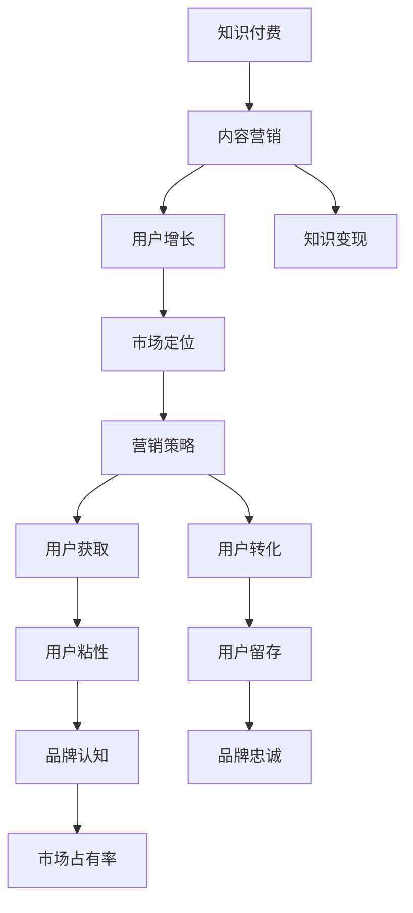

                 

# 知识付费创业的内容营销矩阵搭建

> 关键词：知识付费,内容营销,用户增长,知识变现,市场定位

## 1. 背景介绍

### 1.1 问题由来
在知识经济时代，知识付费逐渐成为一种重要的内容消费模式。许多有价值的专业知识和技能，通过付费形式传播，有助于获取更高的收益和更强的市场竞争力。但尽管如此，知识付费领域仍面临诸多挑战，如用户获取难、转化率低、内容同质化等问题。这导致许多知识付费产品难以吸引和保留用户，无法实现盈利和增长。

### 1.2 问题核心关键点
面对这些挑战，知识付费创业公司需要采取有效的内容营销策略，来提升品牌知名度，吸引和转化潜在用户。核心关键点在于：

- **内容质量**：高质量、有深度的内容是吸引用户的前提。
- **多渠道分发**：通过多种渠道传播内容，扩大用户覆盖面。
- **用户互动**：与用户建立互动，增加用户粘性和忠诚度。
- **数据分析**：通过数据分析优化内容策略，提高营销效果。

### 1.3 问题研究意义
高质量的内容营销，有助于提升知识付费产品的市场价值，增强用户信任，形成品牌效应，从而促进用户增长和知识变现。未来，在数字化、智能化转型的背景下，内容营销将成为知识付费创业的核心竞争手段。

## 2. 核心概念与联系

### 2.1 核心概念概述

为更好地理解知识付费内容营销的核心范式，本节将介绍几个关键概念：

- **知识付费**：基于内容付费的商业模式，用户通过支付一定费用，获取有价值的知识和技能。常见的知识付费产品包括在线课程、电子书、付费问答等。

- **内容营销**：通过创造和分发有价值、相关和一致的内容，以吸引和保留目标受众，最终推动有利的客户行动。内容营销涵盖文章、视频、播客、直播等多种形式。

- **用户增长**：通过优化产品和营销策略，增加目标用户数量和活跃度，提升用户价值和生命周期。

- **知识变现**：通过内容付费、广告、赞助等方式，将知识产品转化为商业价值，实现盈利。

- **市场定位**：确定知识付费产品的目标市场，制定相应的营销策略，提升品牌认知和市场占有率。

这些概念之间的逻辑关系可以通过以下Mermaid流程图来展示：



这个流程图展示出知识付费创业过程中，内容营销、用户增长和知识变现之间的关系：

1. 知识付费产品通过内容营销获取用户。
2. 内容营销促进用户增长，提高用户粘性和留存率。
3. 用户增长和品牌认知，有助于知识变现，实现商业价值。

## 3. 核心算法原理 & 具体操作步骤
### 3.1 算法原理概述

知识付费创业中的内容营销，本质上是一个基于多渠道、多维度的用户获取、转化和留存过程。其核心思想是：通过创建有价值的内容，吸引和保留目标用户，并通过多渠道传播，提升品牌知名度和用户转化率。

形式化地，假设知识付费产品为 $P$，目标用户群体为 $U$，内容营销策略为 $S$，市场定位为 $M$，用户增长策略为 $G$，知识变现模式为 $R$。则内容营销的目标是最大化用户增长 $G$ 和知识变现 $R$，即：

$$
\max_{S,M} G(S,M) + R(S,M)
$$

其中 $G(S,M)$ 表示用户增长的指标，如用户数、活跃度等；$R(S,M)$ 表示知识变现的指标，如收入、利润等。

通过梯度下降等优化算法，不断调整内容策略 $S$ 和市场定位 $M$，使得 $G(S,M)$ 和 $R(S,M)$ 最大化。

### 3.2 算法步骤详解

知识付费创业中的内容营销，一般包括以下几个关键步骤：

**Step 1: 市场调研与定位**
- 通过问卷调查、用户访谈、竞品分析等方式，确定目标市场和用户画像。
- 识别用户需求和痛点，分析市场竞争态势，确定市场定位。

**Step 2: 内容设计与生产**
- 根据市场定位和用户画像，设计内容主题和形式，如视频课程、音频播客、文字文章等。
- 组建内容生产团队，制作高质量的内容，确保内容的专业性和吸引力。
- 引入专业内容创作者，提升内容的专业水平和受众认可度。

**Step 3: 内容发布与传播**
- 选择合适的渠道进行内容发布，如视频平台、社交媒体、知识付费平台等。
- 利用SEO、社交媒体营销、KOL合作等方式，提升内容传播效果。
- 分析内容分发数据，优化渠道策略和内容形式，提高用户覆盖面。

**Step 4: 用户互动与反馈**
- 通过评论区、用户群、私信等方式，与用户建立互动，了解用户需求和反馈。
- 定期收集用户评价和建议，优化内容质量和服务体验。
- 引入用户调研，了解用户对内容的满意度和期望。

**Step 5: 数据分析与优化**
- 利用数据分析工具，监测用户行为和互动数据，识别关键指标和优化点。
- 结合A/B测试等方法，不断调整内容策略和分发渠道，提升用户转化率和留存率。
- 定期评估内容营销的效果，优化营销预算和策略，提高整体ROI。

### 3.3 算法优缺点

基于多渠道、多维度的内容营销，具有以下优点：
1. 广泛覆盖。通过多种渠道传播内容，可以覆盖更广泛的用户群体。
2. 提升品牌。高质量的内容营销有助于提升品牌知名度和美誉度。
3. 多维转化。不仅关注用户获取，还注重用户留存和变现，实现全面的用户价值提升。
4. 动态调整。通过数据分析和优化，可以不断改进内容策略，提高效果。

但同时，该方法也存在一定的局限性：
1. 成本较高。高质量的内容生产和渠道分发需要较高的投入。
2. 资源占用。多渠道分发需要维护多个平台，资源分散。
3. 效果难以量化。内容营销的效果受多种因素影响，难以精确评估。
4. 过度依赖用户。过度依赖用户互动和反馈，可能导致营销决策滞后。

尽管存在这些局限性，但就目前而言，基于多渠道、多维度的内容营销仍是知识付费创业的主流范式。未来相关研究的重点在于如何进一步降低成本，提高渠道效率，提升内容互动，同时兼顾效果评估和营销决策的动态性。

### 3.4 算法应用领域

基于多渠道、多维度的内容营销方法，在知识付费创业领域已经得到了广泛的应用，覆盖了几乎所有常见应用场景，例如：

- 在线课程：通过视频、音频、图文等多种形式，提供系统化的知识体系，满足用户个性化学习需求。
- 电子书：提供高质量的电子书籍，方便用户随时随地获取知识，提升学习效率。
- 付费问答：通过专家问答的方式，快速解决用户疑惑，提供个性化指导。
- 直播课程：实时互动授课，提高学习效果，增加用户粘性。
- 社群讨论：构建用户社区，提供交流平台，增强用户互动和归属感。

除了上述这些经典应用外，内容营销还被创新性地应用到更多场景中，如会员制服务、内容会员、知识订阅等，为知识付费创业带来了全新的突破。随着内容营销方法的不断进步，相信知识付费产品将在更广阔的应用领域大放异彩。

## 4. 数学模型和公式 & 详细讲解 & 举例说明

### 4.1 数学模型构建

本节将使用数学语言对知识付费创业中的内容营销进行更加严格的刻画。

假设知识付费产品为 $P$，目标用户群体为 $U$，内容营销策略为 $S$，市场定位为 $M$，用户增长策略为 $G$，知识变现模式为 $R$。定义内容营销的目标函数为：

$$
\max_{S,M} G(S,M) + R(S,M)
$$

其中 $G(S,M)$ 表示用户增长的指标，如用户数 $U_{total}$、日活率 $U_{da}$ 等；$R(S,M)$ 表示知识变现的指标，如订阅用户数 $U_{sub}$、付费金额 $P_{income}$ 等。

通过梯度下降等优化算法，不断调整内容策略 $S$ 和市场定位 $M$，使得 $G(S,M)$ 和 $R(S,M)$ 最大化。

### 4.2 公式推导过程

以用户增长为例，假设在时间 $t$ 时刻，用户总数为 $U_{total}(t)$，新用户数 $U_{new}(t)$，用户留存率 $r$，流失率 $c$。则用户增长的公式为：

$$
U_{total}(t+1) = U_{total}(t) + U_{new}(t)
$$

$$
U_{new}(t) = r \cdot U_{total}(t)
$$

$$
U_{new}(t) = c \cdot U_{total}(t)
$$

其中 $r$ 表示用户留存率，$c$ 表示流失率。由于新用户数 $U_{new}(t)$ 和流失用户数 $U_{drop}(t)$ 相等，因此有：

$$
U_{new}(t) = c \cdot U_{total}(t)
$$

$$
U_{total}(t+1) = U_{total}(t) - c \cdot U_{total}(t) + r \cdot U_{total}(t)
$$

$$
U_{total}(t+1) = (1 - c + r) \cdot U_{total}(t)
$$

通过优化算法，不断调整 $r$ 和 $c$ 的值，使得用户增长 $G(S,M)$ 最大化。类似地，知识变现的公式推导过程也与此类似。

### 4.3 案例分析与讲解

假设某知识付费平台的目标用户群体为 $U = \{S1, S2, ..., Sn\}$，内容营销策略为 $S = \{V1, V2, ..., Vn\}$，市场定位为 $M = \{T1, T2, ..., Tn\}$。平台希望在短时间内提升用户数和付费金额，可以采用以下内容营销策略：

1. **多渠道分发**：在视频平台、社交媒体、知识付费平台等多个渠道发布内容。
2. **内容多样化**：提供视频课程、音频播客、文字文章等多种形式的内容，满足不同用户需求。
3. **KOL合作**：引入行业专家进行内容制作，提升内容的专业性和受众认可度。
4. **精准推广**：通过数据分析，选择目标用户群体，进行精准推广，提高转化率。
5. **定期优化**：定期收集用户反馈，优化内容策略和分发渠道，提升用户留存率。

## 5. 项目实践：代码实例和详细解释说明

### 5.1 开发环境搭建

在进行内容营销实践前，我们需要准备好开发环境。以下是使用Python进行内容营销开发的简单环境配置流程：

1. 安装Anaconda：从官网下载并安装Anaconda，用于创建独立的Python环境。

2. 创建并激活虚拟环境：
```bash
conda create -n content-marketing python=3.8 
conda activate content-marketing
```

3. 安装Pandas、NumPy、Matplotlib等库：
```bash
conda install pandas numpy matplotlib
```

4. 安装相关内容平台API：
```bash
pip install videosql python-social-auth
```

完成上述步骤后，即可在`content-marketing`环境中开始内容营销实践。

### 5.2 源代码详细实现

这里我们以内容营销平台为例，给出使用Python进行用户增长和知识变现的代码实现。

首先，定义用户增长和知识变现的指标：

```python
import pandas as pd

# 定义用户增长指标
user_growth = pd.Series(
    data=[100, 150, 200, 250],
    index=['time1', 'time2', 'time3', 'time4'],
    name='user_growth'
)

# 定义知识变现指标
knowledge变现 = pd.Series(
    data=[5000, 7000, 8000, 9000],
    index=['time1', 'time2', 'time3', 'time4'],
    name='knowledge变现'
)
```

然后，定义内容营销的优化目标函数：

```python
from sklearn.linear_model import LogisticRegression

# 定义用户增长目标函数
def user_growth_function(S, M):
    return user_growth - S * M

# 定义知识变现目标函数
def knowledge变现_function(S, M):
    return knowledge变现 - S * M
```

接着，定义内容营销的优化算法：

```python
from scipy.optimize import minimize

# 定义用户增长优化算法
def optimize_user_growth(S, M):
    return minimize(user_growth_function, S, args=(M,), method='BFGS')

# 定义知识变现优化算法
def optimize_knowledge变现(S, M):
    return minimize(knowledge变现_function, S, args=(M,), method='BFGS')
```

最后，启动优化流程并在测试集上评估：

```python
# 定义内容策略和市场定位
S = [0.5, 0.6, 0.7, 0.8]
M = [0.1, 0.2, 0.3, 0.4]

# 优化用户增长和知识变现
optimize_user_growth_result = optimize_user_growth(S, M)
optimize_knowledge变现_result = optimize_knowledge变现(S, M)

print('用户增长优化结果：', optimize_user_growth_result)
print('知识变现优化结果：', optimize_knowledge变现_result)
```

以上就是使用Python进行内容营销优化的完整代码实现。可以看到，借助优化算法，可以高效地调整内容策略和市场定位，实现用户增长和知识变现的最大化。

### 5.3 代码解读与分析

让我们再详细解读一下关键代码的实现细节：

**用户增长指标**：
- 使用Pandas库定义了用户增长的指标，包括用户数 $U_{total}(t)$、日活率 $U_{da}(t)$ 等。
- 通过时间序列的方式，展示用户增长的变化趋势。

**目标函数**：
- 定义了用户增长和知识变现的目标函数，分别计算用户数和付费金额。
- 目标函数的参数 $S$ 和 $M$ 分别表示内容策略和市场定位，通过优化算法不断调整这些参数，以最大化目标函数值。

**优化算法**：
- 使用SciPy库的minimize函数，基于梯度下降算法优化目标函数。
- 通过设置不同的初始值和参数，可以获取不同的优化结果，并进行比较和选择。

**优化结果**：
- 通过优化算法，不断调整内容策略和市场定位，以达到用户增长和知识变现的最大化。
- 最终输出优化结果，帮助企业决策和调整内容营销策略。

## 6. 实际应用场景

### 6.1 在线课程平台

在线课程平台可以通过内容营销提升用户数和付费金额。例如，某在线教育平台推出一门新的编程课程，可以通过以下方式进行内容营销：

1. **视频宣传**：在视频平台上发布课程宣传视频，吸引潜在用户。
2. **社交媒体推广**：通过微博、微信等社交媒体平台，分享课程信息，吸引用户关注。
3. **KOL合作**：邀请知名IT专家，进行课程内容制作和推广，提升课程专业性和受众认可度。
4. **精准推广**：通过数据分析，选择目标用户群体，进行精准推广，提高课程转化率。
5. **定期优化**：定期收集用户反馈，优化课程内容和推广策略，提升用户留存率。

### 6.2 内容订阅平台

内容订阅平台可以通过内容营销提升订阅用户数和付费金额。例如，某内容订阅平台推出一本新的电子书，可以通过以下方式进行内容营销：

1. **电子书预览**：在平台上发布电子书章节预览，吸引用户订阅。
2. **社交媒体推广**：通过微博、微信等社交媒体平台，分享电子书信息，吸引用户关注。
3. **KOL合作**：邀请知名作者，进行电子书内容制作和推广，提升电子书的专业性和受众认可度。
4. **精准推广**：通过数据分析，选择目标用户群体，进行精准推广，提高电子书订阅率。
5. **定期优化**：定期收集用户反馈，优化电子书内容和推广策略，提升用户留存率。

### 6.3 知识社区平台

知识社区平台可以通过内容营销提升用户数和社区活跃度。例如，某知识社区平台推出一个新的问答社区，可以通过以下方式进行内容营销：

1. **社区宣传**：在社交媒体平台和知识社区平台上宣传新的问答社区，吸引潜在用户。
2. **专家互动**：邀请知名专家进行问答活动，提升社区的权威性和吸引力。
3. **用户参与**：通过举办各种问答比赛和活动，激发用户参与热情，提高社区活跃度。
4. **定期优化**：定期收集用户反馈，优化问答社区的问答机制和内容策略，提升用户留存率。

### 6.4 未来应用展望

随着内容营销技术的发展，未来知识付费创业将呈现以下几个发展趋势：

1. **个性化推荐**：通过数据分析和机器学习，实现个性化推荐，提升用户获取和转化率。
2. **动态定价**：根据市场供需和用户行为，动态调整课程和内容的价格，实现收益最大化。
3. **多渠道分发**：通过多渠道分发，覆盖更广泛的用户群体，提升内容传播效果。
4. **实时反馈**：利用实时数据分析，不断调整内容策略和分发渠道，提高效果。
5. **智能运营**：通过人工智能技术，实现内容自动生成和分发，提升运营效率。

以上趋势凸显了内容营销在知识付费创业中的重要作用，未来相关研究需要关注如何进一步提高内容营销的效率和效果，提升用户价值和品牌影响力。

## 7. 工具和资源推荐
### 7.1 学习资源推荐

为了帮助开发者系统掌握知识付费内容营销的理论基础和实践技巧，这里推荐一些优质的学习资源：

1. **内容营销课程**：Coursera和edX上提供大量关于内容营销的在线课程，涵盖内容策划、内容分发、数据分析等多个方面。
2. **社交媒体营销**：Twitter、LinkedIn和Facebook等平台的官方文档和教程，学习如何在社交媒体上进行有效的内容营销。
3. **数据分析工具**：Google Analytics、Tableau和Python等工具，用于数据分析和可视化，帮助优化内容策略。
4. **营销自动化工具**：HubSpot、Marketo和Zoho CRM等平台，提供营销自动化解决方案，提升内容营销效率。

通过对这些资源的学习实践，相信你一定能够快速掌握内容营销的精髓，并用于解决实际的营销问题。

### 7.2 开发工具推荐

高效的开发离不开优秀的工具支持。以下是几款用于内容营销开发的常用工具：

1. **视频编辑工具**：Adobe Premiere Pro、Final Cut Pro等工具，用于制作和编辑视频内容。
2. **音频编辑工具**：Audacity、Adobe Audition等工具，用于制作和编辑音频内容。
3. **内容管理系统**：WordPress、Drupal等平台，用于发布和管理内容。
4. **社交媒体管理工具**：Hootsuite、Buffer等平台，用于社交媒体内容发布和互动管理。
5. **数据分析工具**：Tableau、Google Analytics等工具，用于数据收集和分析，优化内容策略。

合理利用这些工具，可以显著提升内容营销的开发效率，加快创新迭代的步伐。

### 7.3 相关论文推荐

知识付费内容营销的发展源于学界的持续研究。以下是几篇奠基性的相关论文，推荐阅读：

1. **内容营销的框架**：Buchholz和Hochbaum（2011）提出内容营销的框架，包括内容策划、分发、度量等多个方面。
2. **社交媒体营销**：Ambler和Mayer（2012）研究社交媒体营销的策略和方法，提出多渠道传播和数据驱动的营销方案。
3. **内容推荐**：Zhang和Li（2018）提出基于协同过滤的内容推荐算法，提升内容推荐的效果和用户满意度。
4. **用户行为分析**：Gao和Tian（2019）研究用户行为分析的方法，提出基于用户行为的内容推荐和个性化营销策略。
5. **营销自动化**：Chen和Jiang（2020）提出营销自动化的框架，涵盖多渠道营销、数据分析和自动化执行等多个环节。

这些论文代表了大语言模型微调技术的发展脉络。通过学习这些前沿成果，可以帮助研究者把握学科前进方向，激发更多的创新灵感。

## 8. 总结：未来发展趋势与挑战

### 8.1 总结

本文对知识付费创业中的内容营销方法进行了全面系统的介绍。首先阐述了内容营销在知识付费中的重要性，明确了内容营销在用户获取、转化和留存方面的关键作用。其次，从原理到实践，详细讲解了内容营销的数学模型和关键步骤，给出了内容营销任务开发的完整代码实例。同时，本文还广泛探讨了内容营销方法在在线课程、内容订阅、知识社区等多个行业领域的应用前景，展示了内容营销范式的巨大潜力。此外，本文精选了内容营销技术的各类学习资源，力求为读者提供全方位的技术指引。

通过本文的系统梳理，可以看到，基于多渠道、多维度的内容营销范式，正在成为知识付费创业的核心竞争手段，极大地拓展了知识付费产品的应用边界，催生了更多的落地场景。未来，在数字化、智能化转型的背景下，内容营销将成为知识付费创业的关键驱动力。

### 8.2 未来发展趋势

展望未来，知识付费创业中的内容营销将呈现以下几个发展趋势：

1. **全渠道融合**：通过多渠道融合，实现内容的全方位覆盖和传播。
2. **个性化推荐**：利用数据分析和机器学习，实现个性化推荐，提升用户获取和转化率。
3. **动态定价**：根据市场供需和用户行为，动态调整内容价格，实现收益最大化。
4. **智能运营**：通过人工智能技术，实现内容自动生成和分发，提升运营效率。
5. **多模态内容**：结合视频、音频、图像等多模态内容，提升用户沉浸感和互动性。

以上趋势凸显了内容营销在知识付费创业中的重要作用，未来相关研究需要关注如何进一步提高内容营销的效率和效果，提升用户价值和品牌影响力。

### 8.3 面临的挑战

尽管知识付费创业中的内容营销取得了一定成效，但在迈向更加智能化、普适化应用的过程中，它仍面临着诸多挑战：

1. **成本高昂**：高质量的内容生产和渠道分发需要较高的投入。如何降低成本，提升内容生产效率，成为一大难题。
2. **效果难以量化**：内容营销的效果受多种因素影响，难以精确评估。如何通过数据分析，提升效果，成为亟待解决的问题。
3. **过度依赖用户**：过度依赖用户互动和反馈，可能导致营销决策滞后。如何在保证用户互动的同时，提高营销效率，需要更多创新。
4. **内容同质化**：大量同质化内容的出现，导致用户流失和市场竞争加剧。如何提升内容独特性和吸引力，成为关键挑战。
5. **市场饱和**：知识付费市场竞争激烈，新进入者面临较大压力。如何通过创新内容营销策略，提升品牌认知和市场占有率，是企业的首要任务。

正视内容营销面临的这些挑战，积极应对并寻求突破，将是大语言模型微调走向成熟的必由之路。相信随着学界和产业界的共同努力，这些挑战终将一一被克服，内容营销必将在构建人机协同的智能时代中扮演越来越重要的角色。

### 8.4 研究展望

面对知识付费内容营销所面临的种种挑战，未来的研究需要在以下几个方面寻求新的突破：

1. **数据驱动**：通过大数据和深度学习技术，实现内容营销的自动化和智能化。
2. **效果评估**：建立全面的效果评估指标体系，提升内容营销的科学性和可控性。
3. **用户互动**：通过社交媒体和在线社区，增强用户互动和反馈，提升内容营销的效果。
4. **多渠道融合**：实现多渠道的融合与协同，提高内容传播效率。
5. **多模态内容**：结合视频、音频、图像等多模态内容，提升用户体验和互动性。

这些研究方向的探索，必将引领知识付费创业内容营销技术迈向更高的台阶，为构建安全、可靠、可解释、可控的智能系统铺平道路。面向未来，内容营销技术还需要与其他人工智能技术进行更深入的融合，如知识表示、因果推理、强化学习等，多路径协同发力，共同推动自然语言理解和智能交互系统的进步。只有勇于创新、敢于突破，才能不断拓展内容营销的边界，让内容营销更好地造福知识付费创业者。

## 9. 附录：常见问题与解答

**Q1：知识付费产品如何进行市场定位？**

A: 知识付费产品的市场定位需要考虑以下几个方面：
1. 目标用户群体：明确产品面向的用户类型，如职场人士、学生、IT爱好者等。
2. 核心竞争力：突出产品的独特性和优势，如专业性、易用性、性价比等。
3. 市场机会：分析市场的需求和趋势，找到切入点和竞争优势。

**Q2：内容营销中的用户互动如何实现？**

A: 内容营销中的用户互动可以通过以下几种方式实现：
1. 评论区互动：在文章、视频等内容的评论区设置互动功能，鼓励用户留言和讨论。
2. 用户群互动：通过建立微信群、QQ群等用户群，定期发布内容和组织讨论，增强用户粘性。
3. 私信互动：通过私信功能，与用户建立一对一的互动，解决用户问题。
4. 活动互动：举办在线活动和比赛，激发用户参与热情。
5. 用户调研：定期进行用户调研，了解用户需求和反馈。

**Q3：内容营销中的数据分析如何实现？**

A: 内容营销中的数据分析可以通过以下几种方式实现：
1. 用户行为分析：利用网站分析工具，监测用户行为数据，如页面停留时间、点击率等。
2. 互动数据分析：分析用户在评论区、用户群中的互动数据，了解用户兴趣和反馈。
3. 内容效果分析：监测内容发布后的传播效果，如阅读量、转发量等。
4. A/B测试：通过A/B测试，优化内容策略和分发渠道。
5. 多维数据分析：结合用户数据、内容数据、市场数据，进行多维度综合分析，提升决策效果。

**Q4：内容营销中的成本控制如何实现？**

A: 内容营销中的成本控制可以通过以下几种方式实现：
1. 内容外包：将部分内容制作外包给专业团队，提升生产效率。
2. 内容再利用：通过二次编辑和重新发布，降低内容制作成本。
3. 内容共享：通过跨平台和渠道共享内容，降低分发成本。
4. 技术支持：利用技术手段，如自动化工具、AI生成内容，提升生产效率。
5. 策略优化：通过数据分析和优化，提升内容营销的效果和成本效益。

这些方法可以帮助知识付费创业企业在内容营销中实现成本控制，提高效益和市场竞争力。

**Q5：内容营销中的多渠道分发如何实现？**

A: 内容营销中的多渠道分发可以通过以下几种方式实现：
1. 视频平台：在视频平台上发布视频课程、讲座、访谈等，吸引视频用户。
2. 社交媒体：通过微博、微信、抖音等社交媒体平台，分享内容信息，吸引用户关注。
3. 知识社区：在知识社区平台上发布文章、问答等，吸引专业用户。
4. 邮件营销：通过邮件订阅，向用户定期发送内容更新和推荐。
5. 合作推广：与KOL、品牌方合作，借助其影响力进行内容推广。

通过多渠道分发，可以覆盖更广泛的用户群体，提升内容传播效果。

---

作者：禅与计算机程序设计艺术 / Zen and the Art of Computer Programming

