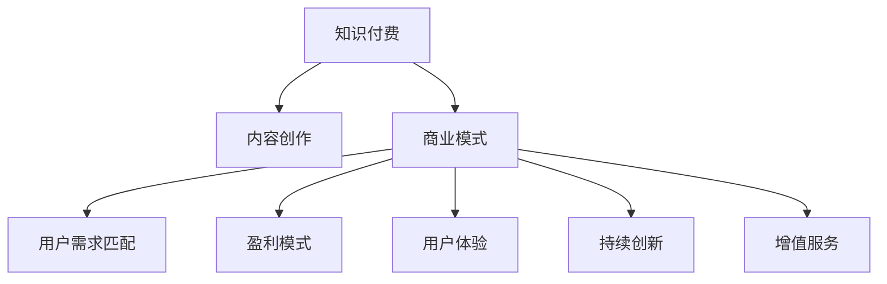

                 

# 知识付费创业的商业模式优化策略

> 关键词：知识付费, 内容创作, 商业模式, 用户需求, 盈利模式, 持续创新, 增值服务

## 1. 背景介绍

### 1.1 问题由来

随着互联网的快速发展，知识付费市场正逐渐成为互联网经济的重要组成部分。然而，相较于传统行业，知识付费市场具有较强的专业性，内容创作者需具备良好的专业知识基础，同时市场竞争激烈，价格敏感，用户忠诚度难以维护。此外，知识付费市场亦面临版权问题、内容质量不稳定、用户体验不佳等挑战。

### 1.2 问题核心关键点

知识付费商业模式的核心关键点包括：内容创作、用户需求匹配、盈利模式、用户体验、持续创新、增值服务等。如何构建合理的商业模式，实现知识付费市场的高效运作，是企业必须重点关注的课题。

### 1.3 问题研究意义

优化知识付费创业的商业模式，对于提升内容质量，降低用户获取成本，提高用户黏性，实现商业可持续化运作，具有重要意义。良好的商业模式可以吸引更多优质内容创作者，提供丰富、高质量、符合用户需求的优质内容，提升用户体验，从而实现用户和企业的双赢。

## 2. 核心概念与联系

### 2.1 核心概念概述

为更好地理解知识付费创业的商业模式优化策略，本节将介绍几个核心概念：

- **知识付费**：指用户为获取专业知识或技术而支付费用的商业模式，涵盖了订阅、按需、增值服务等多种形式。
- **内容创作**：指知识付费平台的原创内容生产，包括文章、课程、音频、视频等。
- **商业模式**：指企业实现盈利的方式，涵盖了产品设计、价值创造、市场渠道、用户需求匹配、价格体系、盈利模式等多个维度。
- **用户需求匹配**：指平台通过数据分析和用户画像技术，精准推送符合用户需求的内容。
- **盈利模式**：指知识付费平台的主要盈利方式，如订阅费、按需购买、广告、增值服务等。
- **用户体验**：指用户在使用知识付费产品时，所感受到的易用性、流畅度、内容丰富度、个性化推荐度等。
- **持续创新**：指知识付费平台不断优化内容、技术、营销策略，提升市场竞争力。
- **增值服务**：指为提升用户满意度和忠诚度，提供的补充服务，如专享课程、定制咨询、直播互动等。

这些核心概念之间的逻辑关系可以通过以下Mermaid流程图来展示：



这个流程图展示了这个商业模式的各个组成部分及其之间的关系：

1. 知识付费平台通过内容创作提供价值。
2. 商业模式设计决定平台盈利方式和用户需求匹配策略。
3. 用户需求匹配提升用户体验，吸引用户并提升留存率。
4. 盈利模式为平台提供持续运营的动力。
5. 持续创新确保平台市场竞争力。
6. 增值服务提高用户黏性。

## 3. 核心算法原理 & 具体操作步骤
### 3.1 算法原理概述

知识付费创业的商业模式优化策略，主要基于对市场环境的深入分析和数据驱动决策。其核心思想是：通过分析用户需求、内容创作和商业模式之间的交互关系，实现精准的内容推送，提升用户体验，增加用户黏性，并建立有效的盈利模式。

形式化地，假设知识付费平台用户集为 $U$，内容集为 $C$，商业模式为 $M$，用户需求为 $D$。则优化策略可以描述为：

$$
\begin{aligned}
& \min_{M, C, D} \text{Cost} \\
& \text{s.t.} \\
& C \rightarrow U \\
& M \rightarrow C \\
& D \rightarrow U \\
& D = f(C) \\
& U = g(D)
\end{aligned}
$$

其中 $\text{Cost}$ 为平台的运营成本，$f(C)$ 为内容对用户需求的影响，$g(D)$ 为用户需求对用户集的影响。优化目标为在最小运营成本下，最大化用户集和内容的匹配度，提升用户体验，同时实现商业模式的可持续发展。

### 3.2 算法步骤详解

基于知识付费创业的商业模式优化策略，主要包括以下几个关键步骤：

**Step 1: 用户需求分析**

- 收集用户行为数据，包括阅读时间、互动次数、购买历史等。
- 使用用户画像技术，如聚类、标签等方法，对用户需求进行分类和画像。

**Step 2: 内容创作与优化**

- 吸引和激励内容创作者提供高质量内容，建立有效的激励机制。
- 利用大数据和机器学习技术，分析用户行为和反馈，优化内容生产。
- 采用A/B测试等方法，不断优化内容质量，提升用户满意度。

**Step 3: 商业模式设计**

- 根据用户需求和内容特点，设计合理的定价策略和盈利模式。
- 实现多元化盈利途径，如订阅、按需、广告、增值服务等。
- 在保证盈利的同时，提供性价比高的内容，吸引用户。

**Step 4: 用户体验优化**

- 利用推荐算法和个性化技术，提供符合用户需求的精准内容。
- 提升平台界面友好度和使用便捷性，优化用户体验。
- 不断收集用户反馈，及时迭代产品，提升用户满意度。

**Step 5: 持续创新与增值服务**

- 定期发布新产品和功能，满足用户新需求。
- 提供定制化增值服务，如专享课程、咨询、直播等。
- 保持持续创新，提升平台的市场竞争力。

### 3.3 算法优缺点

知识付费创业的商业模式优化策略的优点包括：

- 精准推送内容，提升用户体验，提高用户黏性。
- 通过多元化盈利模式，实现商业可持续化。
- 不断优化内容质量和商业模式，提升市场竞争力。

同时，该策略也存在一些局限性：

- 依赖用户数据，需要较强的数据分析能力和技术实力。
- 内容创作成本高，需要持续投入和优质创作者支持。
- 用户需求多变，需快速迭代产品和策略。
- 价格敏感，定价策略需考虑用户承受能力。

尽管存在这些局限性，但就目前而言，这种策略仍是大规模知识付费平台采用的主流模式。未来相关研究的重点在于如何进一步优化用户画像技术，降低内容创作成本，同时兼顾用户满意度和商业盈利。

### 3.4 算法应用领域

基于知识付费创业的商业模式优化策略，在诸多知识付费平台和在线教育机构中均有应用，具体领域包括：

- 在线课程平台：如Coursera、Udacity等，通过订阅、按需购买等模式提供各种课程。
- 专业培训平台：如LinkedIn Learning、网易云课堂等，提供企业培训和技能提升课程。
- 知识问答社区：如知乎、Quora等，通过付费咨询和广告盈利。
- 电子书和出版平台：如Kindle、京东读书等，提供优质电子书和杂志订阅。

除了这些经典应用场景外，知识付费模式亦扩展到多个领域，如在线金融理财、心理情感咨询、生活技能培训等，为用户的知识获取和技能提升提供了新的途径。

## 4. 数学模型和公式 & 详细讲解 & 举例说明

### 4.1 数学模型构建

本节将使用数学语言对知识付费创业的商业模式优化策略进行更加严格的刻画。

假设知识付费平台的用户集为 $U$，内容集为 $C$，用户需求为 $D$，则有：

$$
U = \{u_1, u_2, \ldots, u_n\}
$$

$$
C = \{c_1, c_2, \ldots, c_m\}
$$

$$
D = \{d_1, d_2, \ldots, d_n\}
$$

用户需求 $D$ 与内容 $C$ 的关系为 $D = f(C)$，用户 $u_i$ 与需求 $d_i$ 的关系为 $u_i = g(d_i)$。

### 4.2 公式推导过程

以推荐算法为例，假设用户 $u_i$ 对内容 $c_j$ 的评分 $r_{ij}$，用户 $u_i$ 的需求 $d_i$ 与内容 $c_j$ 的匹配度 $m_{ij}$，则推荐算法可以通过如下公式计算：

$$
\begin{aligned}
& \text{Recommendation}(u_i) = \arg\max_{c_j \in C} \left\{ \sum_{i=1}^n r_{ij} \right\} \\
& \text{s.t.} \\
& r_{ij} = m_{ij} \cdot \text{Quality}(c_j)
\end{aligned}
$$

其中 $\text{Quality}(c_j)$ 为内容的质量评分，$m_{ij}$ 为内容与用户需求的匹配度。推荐算法通过最大化用户评分总和，找到最适合用户 $u_i$ 的内容。

### 4.3 案例分析与讲解

以下我们以在线课程平台的推荐系统为例，给出推荐算法的具体实现步骤。

1. **用户行为数据收集**：通过平台记录用户的学习行为，如观看时间、点赞、分享等，获取用户对不同课程的评分。

2. **用户需求分析**：利用聚类算法对用户进行分类，如兴趣类、技能提升类等。

3. **内容质量评分**：对课程内容进行评分，如专家级别、更新时间、评价等。

4. **内容与需求匹配**：利用余弦相似度等方法，计算每个课程与不同用户需求之间的匹配度。

5. **推荐算法实现**：通过上述数据，计算出每个用户对不同课程的推荐分数，选择推荐分最高的课程进行推送。

6. **效果评估**：定期收集用户反馈，评估推荐系统的效果，持续优化算法。

## 5. 项目实践：代码实例和详细解释说明
### 5.1 开发环境搭建

在进行知识付费创业的商业模式优化策略的实践前，我们需要准备好开发环境。以下是使用Python进行开发的环境配置流程：

1. 安装Python：从官网下载安装最新版本的Python。

2. 安装相关依赖库：如pandas、numpy、scikit-learn、scipy等。

3. 配置开发环境：设置项目文件夹，创建虚拟环境。

```bash
python3 -m venv env
source env/bin/activate
```

4. 安装推荐算法库：如Scikit-learn的推荐系统库。

```bash
pip install scikit-learn
```

完成上述步骤后，即可在虚拟环境中开始开发实践。

### 5.2 源代码详细实现

这里我们以推荐系统的代码实现为例，给出推荐算法的具体实现步骤。

首先，定义推荐系统的用户行为数据：

```python
import pandas as pd

# 读取用户行为数据
user_data = pd.read_csv('user_behavior.csv', sep='\t')
```

然后，进行用户需求分析和内容评分：

```python
from sklearn.cluster import KMeans
from sklearn.metrics.pairwise import cosine_similarity

# 用户需求分类
user_clusters = KMeans(n_clusters=3).fit(user_data['behaviors'].values)
user_labels = user_clusters.labels_

# 内容评分
course_quality = {'course1': 0.9, 'course2': 0.8, 'course3': 0.7}
```

接着，进行内容与用户需求匹配：

```python
# 内容与用户需求匹配度
user_course_match = pd.DataFrame(user_clusters.labels_, index=user_data.index)
match_matrix = pd.DataFrame(cosine_similarity(user_course_match, user_course_match), index=user_data.index)
```

最后，实现推荐算法：

```python
from sklearn.metrics.pairwise import pairwise_distances

# 推荐算法实现
def recommendation(user_id, courses):
    user_course_score = user_data[user_id]['behaviors'].dot(course_quality.values())
    course_similarity = pairwise_distances(match_matrix.iloc[user_id], match_matrix)
    recommendation_scores = user_course_score + course_similarity.mean(axis=1)
    return courses[recommendation_scores].index.tolist()

# 推荐用户
recommended_courses = recommendation(1, courses.index)
```

### 5.3 代码解读与分析

让我们再详细解读一下关键代码的实现细节：

**用户行为数据读取**：
- 通过Pandas库读取用户行为数据，包括用户ID、观看时间、点赞、分享等信息。

**用户需求分类**：
- 利用KMeans算法对用户进行聚类，生成用户的兴趣标签，如兴趣类、技能提升类等。

**内容评分**：
- 根据专家评价、课程更新时间等指标，对课程内容进行评分，如满分1.0。

**内容与用户需求匹配**：
- 利用余弦相似度计算用户需求与内容之间的匹配度，生成匹配矩阵。

**推荐算法实现**：
- 结合用户行为评分和内容与用户需求匹配度，计算用户对不同内容的推荐分数，选择推荐分最高的课程进行推送。

**推荐结果展示**：
- 最终输出的推荐课程列表，供用户查看和学习。

可以看到，通过Python和相关算法库，可以高效地实现知识付费平台的推荐系统，提升用户体验。

## 6. 实际应用场景
### 6.1 在线教育平台

知识付费创业的商业模式优化策略在在线教育平台中得到了广泛应用。传统教育机构面临课程设计、师资投入、学生管理等诸多挑战，而通过知识付费平台，可以降低这些成本，实现教育资源的优化配置。

在技术实现上，知识付费平台可以采用推荐算法和大数据分析，精准推送用户感兴趣的内容，提升学习效果。同时，平台还可以通过视频课程、互动讨论、作业批改等功能，丰富教学模式，提升用户满意度。

### 6.2 专业培训平台

专业培训平台如LinkedIn Learning、网易云课堂等，通过知识付费模式，为职业人士提供技能提升课程，提升其职业竞争力。

平台可以结合用户需求分析，设计针对性课程，提升用户培训效果。同时，通过线上线下结合的培训模式，提升用户参与度，提供实用的职业技能培训。

### 6.3 电子书和出版平台

电子书和出版平台如Kindle、京东读书等，通过知识付费模式，为用户提供丰富的电子书资源。

平台可以结合用户阅读偏好和行为数据，推荐适合用户阅读的书籍，提升用户阅读体验。同时，通过VIP会员、付费购买等模式，实现平台盈利。

### 6.4 未来应用展望

随着知识付费市场的不断成熟，基于知识付费创业的商业模式优化策略将在更多领域得到应用，为传统行业带来变革性影响。

在医疗健康领域，知识付费平台可以提供健康知识课程、专家咨询服务，提升大众健康素养，帮助解决健康问题。

在金融理财领域，平台可以提供金融知识课程、投资理财咨询，帮助用户掌握金融知识，提升理财能力。

在生活技能领域，平台可以提供生活技能课程、家务咨询，提升用户生活技能，丰富生活品质。

此外，在教育、文化、娱乐等诸多领域，知识付费模式也将不断拓展，为用户的知识获取和技能提升提供新的途径。相信随着知识付费技术的不断成熟，知识付费市场将迎来更加繁荣的景象。

## 7. 工具和资源推荐
### 7.1 学习资源推荐

为了帮助开发者系统掌握知识付费创业的商业模式优化策略的理论基础和实践技巧，这里推荐一些优质的学习资源：

1. **《知识付费的市场研究与商业模式分析》**：对知识付费市场的现状、发展趋势、商业模式进行系统性分析，适合行业从业者学习。

2. **《推荐系统算法与应用》**：详细讲解推荐系统的主要算法和实际应用，适合技术开发者参考。

3. **《数据驱动的商业模式优化》**：通过大数据和机器学习技术，分析用户行为，优化商业模式，适合管理者和技术人员共同学习。

4. **《内容创业的互联网思维》**：结合互联网思维，提升内容创作和用户运营能力，适合内容创作者和运营管理者参考。

5. **《用户画像技术与应用》**：介绍用户画像技术的主要方法和实际应用，适合数据分析师和产品开发者参考。

通过对这些资源的学习实践，相信你一定能够快速掌握知识付费创业的商业模式优化策略，并用于解决实际的商业模式优化问题。

### 7.2 开发工具推荐

高效的开发离不开优秀的工具支持。以下是几款用于知识付费创业开发的常用工具：

1. **Python编程语言**：作为知识付费开发的核心工具，Python具有强大的数据分析和算法实现能力，适合内容创作和算法开发。

2. **Pandas库**：用于数据处理和分析，提供高效的数据操作和统计功能，适合数据预处理和特征工程。

3. **Scikit-learn库**：提供丰富的机器学习算法和工具，适合推荐算法和用户画像分析。

4. **TensorFlow或PyTorch**：用于深度学习模型的开发和训练，适合构建复杂的推荐系统。

5. **Flask或Django框架**：用于构建Web应用，提供便捷的Web开发接口。

6. **MySQL或MongoDB数据库**：用于存储和查询用户行为数据，适合大规模数据存储和检索。

合理利用这些工具，可以显著提升知识付费创业的开发效率，加快创新迭代的步伐。

### 7.3 相关论文推荐

知识付费创业的商业模式优化策略的发展源于学界的持续研究。以下是几篇奠基性的相关论文，推荐阅读：

1. **《知识付费市场研究报告》**：通过对知识付费市场的系统研究，提出行业发展趋势和商业模式优化建议。

2. **《知识付费平台的用户行为分析与推荐算法》**：详细讲解知识付费平台的用户行为分析和推荐算法，适合技术开发者参考。

3. **《内容付费与推荐系统》**：介绍内容付费模式和推荐系统的主要技术，适合内容创作者和技术人员共同学习。

4. **《基于用户画像的内容推荐算法》**：介绍用户画像技术在推荐系统中的应用，适合数据分析师和推荐算法开发者参考。

这些论文代表了这个领域的发展脉络。通过学习这些前沿成果，可以帮助研究者把握学科前进方向，激发更多的创新灵感。

## 8. 总结：未来发展趋势与挑战
### 8.1 总结

本文对知识付费创业的商业模式优化策略进行了全面系统的介绍。首先阐述了知识付费创业在互联网经济中的重要地位，明确了商业模式优化在平台运营中的关键作用。其次，从原理到实践，详细讲解了商业模式的各个组成部分及其优化方法，给出了推荐算法的代码实现。同时，本文还广泛探讨了商业模式优化在多个行业领域的应用前景，展示了该策略的巨大潜力。此外，本文精选了商业模式优化技术的学习资源，力求为读者提供全方位的技术指引。

通过本文的系统梳理，可以看到，基于知识付费创业的商业模式优化策略在提升用户体验、实现商业可持续化、降低运营成本等方面，具有显著优势。良好的商业模式可以吸引更多优质内容创作者，提供丰富、高质量、符合用户需求的优质内容，提升用户体验，从而实现用户和企业的双赢。

### 8.2 未来发展趋势

展望未来，知识付费创业的商业模式优化策略将呈现以下几个发展趋势：

1. **数据驱动决策**：随着大数据和机器学习技术的进一步发展，知识付费平台将更加依赖数据驱动的决策，通过数据分析提升用户体验和内容质量。

2. **个性化推荐**：推荐算法将继续优化，通过更精准的用户画像和内容匹配，提供更个性化的内容推荐。

3. **多元化盈利模式**：知识付费平台将探索更多盈利模式，如增值服务、跨界合作等，提升平台盈利能力。

4. **持续创新**：通过持续创新，知识付费平台将不断提升平台竞争力，吸引更多用户和创作者。

5. **国际化拓展**：全球化市场前景广阔，知识付费平台将积极拓展国际市场，提升品牌影响力。

6. **技术融合**：知识付费平台将与其他AI技术（如自然语言处理、计算机视觉等）进行深度融合，提升平台的智能化水平。

这些趋势凸显了知识付费创业的商业模式优化策略的广阔前景。这些方向的探索发展，必将进一步提升知识付费市场的高效运作，为用户的知识获取和技能提升提供新的途径。

### 8.3 面临的挑战

尽管知识付费创业的商业模式优化策略已经取得了瞩目成就，但在迈向更加智能化、普适化应用的过程中，它仍面临诸多挑战：

1. **数据隐私和安全**：平台需要处理大量用户数据，数据隐私和安全问题凸显，需要制定严格的数据保护措施。

2. **用户留存和黏性**：如何通过优质内容和精准推荐，提升用户黏性，增加用户留存率，是知识付费平台需要持续关注的问题。

3. **内容质量控制**：内容创作者的质量控制和管理需要投入大量人力物力，如何激励优质创作者提供高质量内容，是知识付费平台面临的重要挑战。

4. **算法公平性**：推荐算法可能会存在偏见，导致部分用户被忽视，如何设计公平、公正的算法，是知识付费平台需要解决的问题。

5. **跨领域应用**：知识付费平台需要不断拓展应用场景，适应不同领域的特定需求，如何实现跨领域的无缝集成，是知识付费平台面临的挑战。

6. **内容版权问题**：知识付费平台需要处理好内容版权问题，避免版权纠纷，需要制定清晰的内容版权管理政策。

正视知识付费创业所面临的这些挑战，积极应对并寻求突破，将是大规模知识付费平台走向成熟的必由之路。相信随着学界和产业界的共同努力，这些挑战终将一一被克服，知识付费市场必将在构建人机协同的智能时代中扮演越来越重要的角色。

### 8.4 研究展望

面对知识付费创业所面临的种种挑战，未来的研究需要在以下几个方面寻求新的突破：

1. **优化用户画像技术**：通过更加精准的用户画像，提升推荐算法的效果，降低运营成本。

2. **降低内容创作成本**：探索新的内容创作激励机制，吸引更多优质创作者，降低内容创作成本。

3. **提高算法公平性**：通过公平性约束和算法优化，提升推荐算法的公平性和公正性。

4. **拓展应用场景**：积极探索跨领域应用，提升知识付费平台的通用性和适应性。

5. **增强数据安全保护**：通过数据加密、隐私保护等措施，提升数据安全水平，保障用户隐私。

6. **优化商业模式**：通过多元化盈利模式和跨界合作，提升平台的盈利能力和市场竞争力。

这些研究方向的探索，必将引领知识付费创业的商业模式优化策略迈向更高的台阶，为构建安全、可靠、可解释、可控的智能系统铺平道路。面向未来，知识付费创业的商业模式优化策略需要在数据、算法、工程、商业等多个维度协同发力，才能真正实现平台的市场化和用户价值的最大化。

## 9. 附录：常见问题与解答

**Q1：知识付费平台的盈利模式有哪些？**

A: 知识付费平台的盈利模式主要包括以下几种：
1. **订阅制**：用户按月或按年订阅平台，支付固定费用，获取平台所有内容。
2. **按需购买**：用户按需购买课程或内容，按需付费。
3. **广告分成**：平台通过引入广告，与广告主分成，增加平台收益。
4. **增值服务**：提供额外的增值服务，如专享课程、定制咨询、直播等，增加附加价值。

**Q2：如何提升知识付费平台的推荐系统效果？**

A: 提升知识付费平台的推荐系统效果，主要从以下几个方面入手：
1. **用户行为数据收集**：通过平台记录用户的学习行为，获取用户对不同课程的评分。
2. **用户需求分析**：利用聚类算法对用户进行分类，生成用户的兴趣标签。
3. **内容质量评分**：对课程内容进行评分，如专家级别、更新时间、评价等。
4. **内容与用户需求匹配**：利用余弦相似度等方法，计算每个课程与不同用户需求之间的匹配度。
5. **推荐算法实现**：结合用户行为评分和内容与用户需求匹配度，计算用户对不同内容的推荐分数，选择推荐分最高的课程进行推送。
6. **效果评估**：定期收集用户反馈，评估推荐系统的效果，持续优化算法。

**Q3：知识付费平台如何吸引优质内容创作者？**

A: 知识付费平台吸引优质内容创作者，主要从以下几个方面入手：
1. **激励机制**：设计合理的激励机制，如分成比例、版权保护、平台曝光等，激励创作者提供优质内容。
2. **平台流量**：通过高质量的内容和精准推荐，吸引更多用户，提升平台流量，吸引优质创作者入驻。
3. **平台环境**：提供良好的创作环境和用户反馈机制，提升创作者满意度和黏性。
4. **品牌效应**：通过品牌建设，提升平台影响力，吸引更多优质创作者加入。

**Q4：知识付费平台的推荐系统如何处理长尾内容？**

A: 知识付费平台的推荐系统处理长尾内容，主要从以下几个方面入手：
1. **长尾内容挖掘**：通过数据分析和用户行为监控，挖掘长尾内容，增加推荐库的内容多样性。
2. **小众用户画像**：通过用户行为和内容反馈，生成小众用户的画像，针对性地推荐长尾内容。
3. **个性化推荐**：通过个性化推荐算法，将长尾内容推荐给特定用户，提升长尾内容的曝光率和利用率。
4. **推荐多样性**：通过多样性推荐，增加长尾内容的曝光机会，提升平台的覆盖率和用户满意度。

**Q5：知识付费平台如何处理版权问题？**

A: 知识付费平台处理版权问题，主要从以下几个方面入手：
1. **内容版权管理**：建立严格的内容版权管理制度，确保内容来源合法合规。
2. **版权声明**：在平台上明确版权声明，告知用户内容版权信息，提升用户版权意识。
3. **版权保护技术**：采用版权保护技术，如水印、加密等，保护内容版权。
4. **维权机制**：建立有效的维权机制，及时处理版权纠纷，维护平台和创作者的权益。

**Q6：知识付费平台如何优化用户体验？**

A: 优化知识付费平台的用户体验，主要从以下几个方面入手：
1. **界面设计**：优化平台界面设计，提升用户使用的便捷性和流畅度。
2. **推荐算法**：通过推荐算法，提供精准的内容推荐，提升用户满意度和黏性。
3. **个性化服务**：提供个性化的学习路径和推荐，满足用户个性化需求。
4. **用户反馈**：及时收集用户反馈，持续优化平台功能和服务。

---

作者：禅与计算机程序设计艺术 / Zen and the Art of Computer Programming

