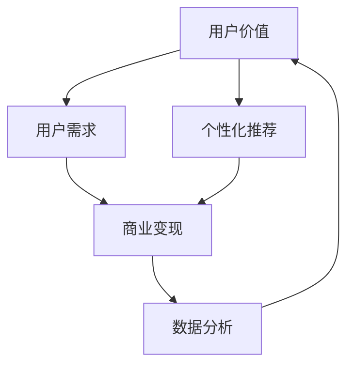

                 

## 1. 背景介绍

### 1.1 问题由来

随着知识付费的兴起，知识付费创业市场逐渐成为热门。越来越多的内容创作者希望通过知识付费产品，将自己的专业知识变现。然而，如何在知识付费创业中实现用户价值的最大化，是每一个创业者都面临的巨大挑战。

### 1.2 问题核心关键点

知识付费创业的核心在于提供用户真正有价值的内容，并通过合理的商业策略，实现商业变现。本节将详细分析知识付费创业中用户价值最大化的核心要素，以及如何通过数据分析、用户行为研究等手段，实现这一目标。

## 2. 核心概念与联系

### 2.1 核心概念概述

为了深入理解知识付费创业中用户价值最大化的实现，本节将介绍几个密切相关的核心概念：

- **用户价值**：指用户在知识付费平台上的需求满足程度和满意度，通常通过用户行为数据（如浏览时间、购买次数、评分等）来评估。
- **用户需求**：指用户期望在知识付费平台上获得的信息、知识或技能。
- **商业变现**：指知识付费创业通过用户付费、广告、会员制等商业模式，实现商业收益的过程。
- **数据分析**：指通过收集、处理和分析用户数据，发现用户行为规律和需求趋势，为商业决策提供依据。
- **个性化推荐**：指根据用户行为数据，推荐用户可能感兴趣的内容，提升用户满意度和平台黏性。

这些核心概念之间的关系可以用以下Mermaid流程图来展示：



这个流程图展示了从用户价值到商业变现的全流程，以及数据分析和个性化推荐在其中扮演的重要角色。

## 3. 核心算法原理 & 具体操作步骤

### 3.1 算法原理概述

知识付费创业中用户价值最大化的实现，本质上是一个多目标优化问题。其核心思想是：通过最大化用户需求满足度，最小化用户流失率，以实现商业变现最大化。

具体而言，可以将用户价值最大化问题表述为以下目标函数：

$$
Maximize \quad \sum_{i} (u_i - c_i)
$$

其中，$u_i$ 表示第 $i$ 个用户从平台获得的价值，$c_i$ 表示平台为满足用户需求所需的成本。目标函数的目标是最大化平台整体的净价值。

### 3.2 算法步骤详解

知识付费创业中实现用户价值最大化，需要经过以下几个关键步骤：

**Step 1: 用户需求分析**

- 通过问卷调查、用户访谈等方式，收集用户对于知识付费产品的需求，包括知识内容的质量、形式、更新频率等。
- 分析用户历史行为数据，发现用户对各类知识内容的偏好，构建用户画像。

**Step 2: 内容推荐优化**

- 根据用户画像和历史行为数据，使用协同过滤、内容推荐算法等，向用户推荐个性化内容。
- 持续迭代算法模型，通过A/B测试等方式，提升推荐准确率和用户满意度。

**Step 3: 商业策略设计**

- 设计合理的商业变现策略，包括单次付费、订阅制、会员制等。
- 结合用户行为数据和业务目标，确定定价策略、优惠活动等。

**Step 4: 数据分析与反馈**

- 通过数据收集和处理，分析用户行为数据，识别用户流失原因。
- 通过用户反馈机制，及时调整产品和服务，提升用户满意度。

### 3.3 算法优缺点

知识付费创业中实现用户价值最大化的算法具有以下优点：

- **用户需求满足度高**：通过个性化推荐和数据分析，能够更好地满足用户需求，提升用户满意度。
- **商业变现能力强**：合理的商业策略设计，可以有效提升用户付费意愿和平台收益。
- **用户体验提升快**：基于用户行为数据的快速迭代，能够迅速响应用户反馈，提升用户体验。

然而，这种算法也存在一些局限性：

- **算法复杂度高**：个性化推荐和数据分析需要大量的计算资源和复杂的算法模型，初期开发成本较高。
- **数据隐私问题**：大量用户行为数据的收集和使用，可能涉及用户隐私保护问题，需严格遵守相关法规。
- **动态变化难应对**：用户需求和行为会随时间变化，需要持续的监控和调整策略，以保证用户价值最大化。

### 3.4 算法应用领域

基于用户价值最大化的知识付费创业算法，已在多个领域得到应用，包括：

- **在线教育**：通过个性化推荐和数据分析，提升在线课程的学习效果和用户满意度。
- **职业培训**：帮助职业培训平台，根据用户需求推荐培训课程，提升学习效率和就业率。
- **健康管理**：为用户提供个性化健康建议和内容，提升健康意识和生活质量。
- **职业技能提升**：通过内容推荐和数据分析，帮助用户提升职业技能和市场竞争力。

这些应用场景展示了知识付费创业算法的多样性和灵活性，为知识付费市场提供了广泛的发展空间。

## 4. 数学模型和公式 & 详细讲解 & 举例说明

### 4.1 数学模型构建

为了更好地分析知识付费创业中用户价值最大化的实现过程，我们引入以下数学模型：

- **用户满意度函数**：用户从平台获得的价值可以表示为用户满意度的函数 $u(x)$，其中 $x$ 为平台提供的知识内容。
- **成本函数**：平台提供知识内容的成本可以表示为 $c(x)$。
- **用户流失函数**：用户流失的概率可以表示为 $p(x)$，与用户满意度相关。

### 4.2 公式推导过程

用户价值最大化问题的目标函数可以表示为：

$$
Maximize \quad \sum_{i} (u_i - c_i)
$$

其中 $u_i$ 为第 $i$ 个用户的满意度函数，$c_i$ 为第 $i$ 个用户提供知识内容的成本函数。

用户流失函数可以表示为：

$$
p_i = f(u_i, c_i)
$$

其中 $f$ 为用户的流失函数，通常为非线性函数。

通过最大化用户价值，同时最小化用户流失概率，可以得到以下目标函数：

$$
Maximize \quad \sum_{i} (u_i - c_i) \quad \text{subject to} \quad p_i \leq \epsilon
$$

其中 $\epsilon$ 为可接受的流失率。

### 4.3 案例分析与讲解

以在线教育平台为例，分析用户价值最大化的实现过程：

1. **用户需求分析**：通过问卷调查和数据分析，发现用户对于个性化课程和互动式学习的需求较高。
2. **内容推荐优化**：根据用户历史行为数据，使用协同过滤算法，向用户推荐个性化课程，同时使用A/B测试优化推荐算法。
3. **商业策略设计**：设计订阅制和单次付费相结合的商业策略，设置不同档次的课程价格，并提供优惠活动，提升用户付费意愿。
4. **数据分析与反馈**：通过分析用户流失数据和反馈，发现部分用户对课程质量不满意，及时调整课程内容，提升用户满意度。

## 5. 项目实践：代码实例和详细解释说明

### 5.1 开发环境搭建

为了实现知识付费创业中用户价值最大化的算法，需要使用Python和相关的数据分析工具。以下是搭建开发环境的步骤：

1. **安装Python**：确保Python版本为3.8以上，可以通过Anaconda或Miniconda进行安装。
2. **安装数据分析工具**：安装pandas、numpy、scikit-learn、matplotlib等数据分析工具。
3. **安装推荐算法库**：安装lightFM、Surprise等推荐算法库，用于内容推荐。

### 5.2 源代码详细实现

以下是一个基于协同过滤算法的推荐系统实现示例：

```python
import pandas as pd
from surprise import Dataset, Reader, KNNWithMeans, accuracy

# 导入数据
df = pd.read_csv('user_data.csv')

# 构建数据集
reader = Reader(rating_scale=(1, 5))
data = Dataset.load_from_df(df[['user_id', 'item_id', 'rating']], reader)

# 训练协同过滤模型
algo = KNNWithMeans(k=10, sim_options={'name': 'pearson_baseline'})
algo.fit(data.build_full_trainset())

# 推荐内容
test_user_id = 1001
test_items = list(range(100, 101))
predictions = algo.test(test_user_id, test_items)

# 计算推荐准确率
accuracy.rmse(predictions, verbose=True)
```

### 5.3 代码解读与分析

**用户数据预处理**：
- 首先，需要导入用户数据，将其转换成DataFrame格式。
- 使用Reader类构建数据集，并指定评分范围为1到5。

**协同过滤模型训练**：
- 使用KNNWithMeans算法，指定协同过滤的近邻数为10，并使用Pearson相关性作为相似度度量。
- 使用build_full_trainset方法构建完整的训练集，并调用fit方法进行模型训练。

**推荐内容生成**：
- 定义一个测试用户ID，以及待推荐的物品ID列表。
- 使用test方法生成推荐结果，该方法会返回一个预测评分列表。

**推荐准确率计算**：
- 使用rmse函数计算推荐准确率，该函数会自动生成预测结果和真实结果，并进行统计分析。

### 5.4 运行结果展示

通过上述代码，可以生成用户ID为1001的推荐结果，并计算推荐准确率。该代码仅为一个简单的示例，实际应用中需要根据具体业务需求进行更复杂的模型设计和参数调优。

## 6. 实际应用场景

### 6.1 在线教育平台

在线教育平台可以通过个性化推荐和数据分析，提升用户的学习效果和满意度。具体而言：

- **用户需求分析**：通过问卷调查和数据分析，发现用户对于个性化课程和互动式学习的需求较高。
- **内容推荐优化**：根据用户历史行为数据，使用协同过滤算法，向用户推荐个性化课程，同时使用A/B测试优化推荐算法。
- **商业策略设计**：设计订阅制和单次付费相结合的商业策略，设置不同档次的课程价格，并提供优惠活动，提升用户付费意愿。
- **数据分析与反馈**：通过分析用户流失数据和反馈，发现部分用户对课程质量不满意，及时调整课程内容，提升用户满意度。

### 6.2 职业培训平台

职业培训平台可以通过内容推荐和数据分析，帮助用户提升职业技能和市场竞争力。具体而言：

- **用户需求分析**：通过问卷调查和数据分析，发现用户对于职业技能提升和职业发展指导的需求较高。
- **内容推荐优化**：根据用户历史行为数据，使用协同过滤算法，向用户推荐个性化培训课程，同时使用A/B测试优化推荐算法。
- **商业策略设计**：设计会员制和单次付费相结合的商业策略，设置不同档次的课程价格，并提供优惠活动，提升用户付费意愿。
- **数据分析与反馈**：通过分析用户流失数据和反馈，发现部分用户对课程质量不满意，及时调整课程内容，提升用户满意度。

### 6.3 健康管理应用

健康管理应用可以通过个性化推荐和数据分析，提升用户健康意识和生活质量。具体而言：

- **用户需求分析**：通过问卷调查和数据分析，发现用户对于个性化健康建议和互动式健康管理的需求较高。
- **内容推荐优化**：根据用户历史行为数据，使用协同过滤算法，向用户推荐个性化健康建议，同时使用A/B测试优化推荐算法。
- **商业策略设计**：设计订阅制和单次付费相结合的商业策略，设置不同档次的健康管理服务，并提供优惠活动，提升用户付费意愿。
- **数据分析与反馈**：通过分析用户流失数据和反馈，发现部分用户对健康建议不满意，及时调整健康管理策略，提升用户满意度。

## 7. 工具和资源推荐

### 7.1 学习资源推荐

为了帮助开发者系统掌握知识付费创业中用户价值最大化的实现方法，这里推荐一些优质的学习资源：

1. **《推荐系统实战》**：介绍了协同过滤、矩阵分解等推荐算法的原理和实现，适合对推荐系统感兴趣的学习者。
2. **Coursera《机器学习》课程**：由斯坦福大学Andrew Ng教授主讲，涵盖了机器学习的基础知识和常用算法。
3. **Kaggle竞赛平台**：提供大量的推荐系统竞赛数据集和竞赛任务，适合通过实际项目提升推荐系统技能。
4. **GitHub推荐系统开源项目**：GitHub上有很多优秀的推荐系统开源项目，可以学习其设计思路和实现细节。
5. **《Python推荐系统开发》书籍**：详细介绍了使用Python实现推荐系统的方法和工具，适合动手实践。

通过对这些资源的学习实践，相信你一定能够快速掌握知识付费创业中用户价值最大化的精髓，并用于解决实际的商业问题。

### 7.2 开发工具推荐

高效的开发离不开优秀的工具支持。以下是几款用于知识付费创业中用户价值最大化实现开发的常用工具：

1. **Python**：Python是一种强大的编程语言，适合进行数据分析和推荐系统开发。
2. **Jupyter Notebook**：Jupyter Notebook是一种交互式编程环境，适合进行数据分析和算法验证。
3. **TensorFlow**：TensorFlow是一个流行的深度学习框架，适合进行复杂模型的训练和优化。
4. **LightFM**：LightFM是一个基于Python的推荐系统库，适合进行协同过滤和矩阵分解算法的实现。
5. **PyTorch**：PyTorch是一个灵活的深度学习框架，适合进行复杂推荐系统的实现和优化。

合理利用这些工具，可以显著提升知识付费创业中用户价值最大化实现开发的效率，加快创新迭代的步伐。

### 7.3 相关论文推荐

知识付费创业中用户价值最大化的实现研究源于学界的持续研究。以下是几篇奠基性的相关论文，推荐阅读：

1. **《推荐系统的协同过滤技术》**：介绍了协同过滤算法的原理和实现，是推荐系统领域的经典之作。
2. **《基于用户行为数据的推荐系统》**：介绍了如何通过用户行为数据构建推荐模型，提高推荐效果。
3. **《知识付费平台用户价值最大化研究》**：分析了知识付费平台中用户价值最大化的实现过程，提出了多种改进策略。
4. **《个性化推荐系统中的推荐算法》**：介绍了多种推荐算法，包括协同过滤、矩阵分解、深度学习等，适合全面了解推荐系统技术。
5. **《基于深度学习的推荐系统》**：介绍了使用深度学习实现推荐系统的最新进展，适合了解前沿技术。

这些论文代表的知识付费创业中用户价值最大化实现研究的发展脉络。通过学习这些前沿成果，可以帮助研究者把握学科前进方向，激发更多的创新灵感。

## 8. 总结：未来发展趋势与挑战

### 8.1 总结

本文对知识付费创业中用户价值最大化的实现方法进行了全面系统的介绍。首先阐述了知识付费创业的现状和挑战，明确了用户价值最大化的核心要素和实现目标。其次，从原理到实践，详细讲解了用户价值最大化的数学模型和关键步骤，给出了推荐系统实现的代码实例。同时，本文还广泛探讨了推荐系统在多个行业领域的应用前景，展示了其巨大的潜力。此外，本文精选了推荐系统的各类学习资源，力求为读者提供全方位的技术指引。

通过本文的系统梳理，可以看到，知识付费创业中用户价值最大化的实现，是一个多目标优化问题，需要综合考虑用户需求、商业策略、数据分析和个性化推荐等多个因素。合理运用推荐系统算法，可以显著提升用户满意度，实现商业变现最大化。

### 8.2 未来发展趋势

展望未来，知识付费创业中用户价值最大化的实现将呈现以下几个发展趋势：

1. **个性化推荐精度提升**：随着推荐系统算法的不断优化，个性化推荐的精度将不断提升，用户满意度将进一步提高。
2. **数据驱动决策**：通过大数据分析，平台可以更准确地了解用户需求和行为，制定更合理的商业策略，提升商业变现能力。
3. **多模态数据融合**：通过融合用户的多模态数据，如语音、图像等，可以更全面地了解用户需求，提升推荐效果。
4. **联邦学习**：通过联邦学习等技术，可以在保护用户隐私的前提下，利用分布式数据进行推荐系统训练，提升推荐系统的普适性。
5. **强化学习**：通过强化学习技术，推荐系统可以根据用户行为实时调整推荐策略，提升推荐效果。

以上趋势展示了知识付费创业中用户价值最大化实现的发展方向，为知识付费市场的进一步创新和优化提供了新的思路。

### 8.3 面临的挑战

尽管知识付费创业中用户价值最大化的实现方法已经取得了显著成效，但在迈向更加智能化、普适化应用的过程中，仍面临诸多挑战：

1. **数据隐私问题**：大量用户行为数据的收集和使用，可能涉及用户隐私保护问题，需严格遵守相关法规。
2. **模型复杂度**：推荐系统算法模型复杂度高，初期开发成本较高，需要持续优化和迭代。
3. **动态变化难以应对**：用户需求和行为会随时间变化，需要持续监控和调整策略，以保证用户价值最大化。
4. **冷启动问题**：新用户或新物品的推荐，由于缺乏足够的历史数据，推荐效果较差，需要进行冷启动优化。
5. **计算资源需求高**：推荐系统需要大量计算资源进行模型训练和推荐生成，需合理配置硬件资源。

解决这些挑战，需要多方面的努力，包括技术创新、政策支持、用户体验优化等，以确保知识付费创业中用户价值最大化实现的健康发展。

### 8.4 研究展望

面向未来，知识付费创业中用户价值最大化的研究需要在以下几个方面寻求新的突破：

1. **冷启动优化**：开发更加高效的冷启动算法，提高新用户和新物品的推荐效果。
2. **模型可解释性**：研究推荐系统的可解释性，提升用户对推荐结果的理解和信任。
3. **多模态融合**：探索多模态数据融合技术，提升推荐系统的全面性和准确性。
4. **联邦学习**：研究联邦学习技术，在保护用户隐私的前提下，利用分布式数据进行推荐系统训练。
5. **深度强化学习**：结合深度学习和强化学习技术，提升推荐系统的实时性和智能化水平。

这些研究方向的探索，必将引领知识付费创业中用户价值最大化实现技术的进一步发展，为知识付费市场的创新和优化提供新的思路。

## 9. 附录：常见问题与解答

**Q1：知识付费创业中用户价值最大化的关键要素有哪些？**

A: 知识付费创业中用户价值最大化的关键要素包括：

1. **用户需求分析**：通过问卷调查和数据分析，发现用户对于知识付费产品的需求。
2. **内容推荐优化**：根据用户历史行为数据，使用推荐算法向用户推荐个性化内容。
3. **商业策略设计**：设计合理的商业变现策略，如单次付费、订阅制等。
4. **数据分析与反馈**：通过数据收集和处理，分析用户行为数据，及时调整产品和服务，提升用户满意度。

**Q2：如何设计合理的商业策略？**

A: 设计合理的商业策略需要考虑以下因素：

1. **用户需求**：了解用户对于知识付费产品的需求和支付意愿，设计相应的付费模式。
2. **成本控制**：控制内容制作的成本和平台运营的成本，确保商业策略的可持续性。
3. **用户满意度**：通过用户行为数据和反馈，优化付费策略和推荐算法，提升用户满意度。
4. **市场竞争**：分析市场竞争环境，制定差异化的商业策略，提升竞争力。

**Q3：知识付费平台如何提升用户满意度？**

A: 知识付费平台提升用户满意度的策略包括：

1. **个性化推荐**：根据用户历史行为数据，使用推荐算法向用户推荐个性化内容，提升用户体验。
2. **内容质量控制**：确保内容的质量和实用性，提升用户对平台的信任。
3. **互动式学习**：通过互动式学习方式，提升用户的参与度和满意度。
4. **用户反馈机制**：建立用户反馈机制，及时响应用户需求和建议，提升用户满意度。

**Q4：如何应对推荐系统的冷启动问题？**

A: 应对推荐系统的冷启动问题，可以采用以下方法：

1. **新用户推荐**：通过用户画像和推荐算法，为新用户推荐一些高价值的内容，提升用户体验。
2. **物品召回**：利用协同过滤和矩阵分解等方法，为新物品增加标签和推荐，提升新物品的曝光率。
3. **社交网络**：利用用户的社交网络关系，通过朋友推荐和社交关系链推荐，提升新用户和新物品的推荐效果。
4. **先验知识**：通过领域专家的先验知识，为新用户和新物品推荐一些高价值的内容，提升推荐效果。

**Q5：如何保护用户隐私？**

A: 保护用户隐私需要采取以下措施：

1. **数据匿名化**：在收集和处理用户数据时，进行数据匿名化处理，避免泄露用户个人信息。
2. **数据加密**：对用户数据进行加密处理，防止数据泄露和篡改。
3. **隐私政策透明**：制定透明的隐私政策，告知用户数据的使用方式和范围，并获得用户的同意。
4. **合规审查**：定期进行隐私合规审查，确保数据处理符合相关法规和标准。

总之，保护用户隐私是知识付费创业中用户价值最大化实现的重要保障，需要各方的共同努力，确保用户数据的安全和合规。

---

作者：禅与计算机程序设计艺术 / Zen and the Art of Computer Programming

