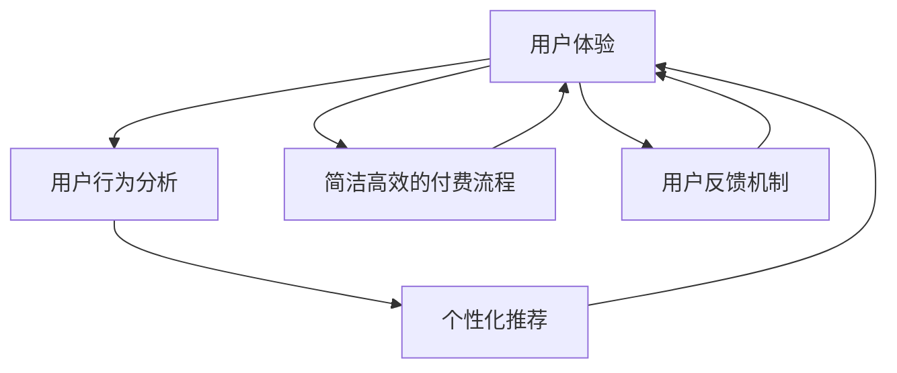

                 

# 知识付费创业的用户体验优化

在知识付费领域，用户体验是决定创业成功的关键因素。优秀的用户体验不仅能够吸引和留存用户，还能增强用户粘性，促进用户活跃度和支付转化率。本文将深入探讨知识付费创业中用户体验优化的核心概念、技术原理、操作步骤及具体实践，并结合实际应用场景进行详细分析，旨在为知识付费平台提供全面的指导。

## 1. 背景介绍

### 1.1 问题由来
随着知识付费平台的兴起，用户体验成为平台竞争的关键。优秀的用户体验不仅可以提升用户满意度，还能增加用户粘性，驱动用户持续消费。然而，知识付费平台的复杂性使得用户体验优化变得尤为困难。常见的挑战包括内容呈现方式单一、用户反馈渠道不畅、付费流程繁琐等。

### 1.2 问题核心关键点
为了提升知识付费平台的用户体验，我们需要关注以下几个核心关键点：
- 内容呈现的多样性：如何通过多样化的内容形式和互动方式，提升用户的兴趣和参与度？
- 个性化推荐：如何根据用户的行为和偏好，精准推荐内容，提高用户满意度？
- 付费流程的简化：如何优化付费流程，减少用户操作成本，提高支付转化率？
- 用户反馈机制：如何收集和利用用户反馈，不断改进产品和服务？

## 2. 核心概念与联系

### 2.1 核心概念概述

为了更好地理解用户体验优化的核心概念，本节将介绍几个关键概念：

- 用户体验（User Experience, UX）：指用户与产品互动时的情感体验和满意度，包括功能可用性、视觉设计、交互方式等。
- 用户行为分析（User Behavior Analysis, UBA）：通过分析用户行为数据，了解用户需求和行为模式，从而优化产品设计。
- 个性化推荐（Personalized Recommendation）：根据用户的历史行为和偏好，动态调整推荐内容，提升用户体验。
- 简洁高效的付费流程（Simplified Payment Workflow）：通过简化付费流程，减少用户操作步骤，提高用户支付转化率。
- 用户反馈机制（User Feedback Mechanism）：通过收集用户反馈，了解用户对产品的意见和建议，不断改进产品和服务。

这些核心概念之间的逻辑关系可以通过以下Mermaid流程图来展示：



这个流程图展示了用户体验优化的核心流程：通过用户行为分析，了解用户需求和行为模式；通过个性化推荐，提升用户满意度；通过简化付费流程，提高用户支付转化率；通过用户反馈机制，不断改进产品和服务。

## 3. 核心算法原理 & 具体操作步骤

### 3.1 算法原理概述

用户体验优化的核心算法原理主要包括用户行为分析、个性化推荐和简洁高效的付费流程优化。这些算法原理的核心目标是通过数据分析和模型训练，提升用户满意度，减少用户操作成本，优化支付流程，从而全面提升用户体验。

### 3.2 算法步骤详解

#### 3.2.1 用户行为分析

1. **数据收集**：收集用户在平台上的行为数据，包括浏览记录、搜索历史、互动行为等。
2. **数据清洗**：对收集到的数据进行去重、清洗和预处理，确保数据质量。
3. **特征提取**：通过特征提取技术，从原始数据中提取出有意义的特征，如用户浏览时长、互动频率、付费意愿等。
4. **模型训练**：使用机器学习模型对用户行为进行建模，预测用户需求和行为模式。

#### 3.2.2 个性化推荐

1. **数据收集**：收集用户的历史行为数据，包括浏览历史、点赞、评论等。
2. **特征提取**：通过特征提取技术，将用户行为数据转化为模型可处理的特征。
3. **模型训练**：使用协同过滤、深度学习等推荐算法，训练个性化推荐模型。
4. **推荐实现**：根据用户行为和模型预测结果，动态调整推荐内容，提升用户满意度。

#### 3.2.3 简洁高效的付费流程

1. **需求分析**：分析用户支付流程中的瓶颈和问题，了解用户痛点。
2. **流程设计**：设计简洁高效的支付流程，减少用户操作步骤，提高用户支付转化率。
3. **测试优化**：在实际应用中测试和优化支付流程，不断提升用户体验。

### 3.3 算法优缺点

用户体验优化的算法具有以下优点：
1. 提高用户满意度：通过个性化推荐和简洁高效的付费流程，提升用户满意度。
2. 减少用户流失：优化用户体验可以降低用户流失率，提高用户粘性。
3. 增加用户收益：通过提升用户体验，促进用户付费转化，增加平台收益。

同时，这些算法也存在一些局限性：
1. 数据依赖性强：用户体验优化需要大量高质量的数据，数据收集和清洗成本较高。
2. 模型复杂度高：个性化推荐和用户行为分析模型较为复杂，训练和部署成本较高。
3. 用户体验差异大：不同用户群体的需求和行为差异较大，难以制定统一的优化策略。
4. 用户隐私问题：收集和分析用户行为数据时，需要注意用户隐私保护。

尽管存在这些局限性，但用户体验优化算法仍然是知识付费创业中不可或缺的一部分，有助于提升平台竞争力，实现可持续发展。

### 3.4 算法应用领域

用户体验优化的算法主要应用于以下领域：

- 个性化内容推荐：通过分析用户行为，推荐相关内容，提高用户粘性和满意度。
- 简洁高效的付费流程：简化用户支付流程，减少操作步骤，提高支付转化率。
- 用户行为分析：通过用户行为数据，了解用户需求和行为模式，优化产品和服务。
- 用户反馈机制：收集和分析用户反馈，不断改进产品和服务，提升用户满意度。

这些应用领域覆盖了知识付费平台的核心功能，通过优化用户体验，可以显著提升平台的竞争力和用户满意度。

## 4. 数学模型和公式 & 详细讲解 & 举例说明

### 4.1 数学模型构建

本节将使用数学语言对用户体验优化的核心算法进行更加严格的刻画。

假设用户行为数据为 $D=\{(x_i,y_i)\}_{i=1}^N, x_i \in \mathbb{R}^d, y_i \in \{0,1\}$，其中 $x_i$ 表示用户行为特征向量，$y_i$ 表示用户是否进行了支付行为。我们的目标是构建一个预测模型 $f(x)$，根据用户行为特征预测用户是否进行支付行为。

一个常用的模型是逻辑回归模型，其损失函数为：

$$
\mathcal{L}(f) = \frac{1}{N}\sum_{i=1}^N -y_i\log f(x_i) - (1-y_i)\log (1-f(x_i))
$$

其中 $f(x_i) = \sigma(\theta^T x_i)$，$\sigma$ 为sigmoid函数，$\theta$ 为模型参数。

### 4.2 公式推导过程

通过对逻辑回归模型的求解，可以得到模型参数的更新公式：

$$
\theta \leftarrow \theta - \eta \nabla_{\theta}\mathcal{L}(\theta) - \eta\lambda\theta
$$

其中 $\eta$ 为学习率，$\lambda$ 为正则化系数。在实际应用中，为了提高模型泛化能力，通常需要加入正则化项，如L2正则化。

### 4.3 案例分析与讲解

以一个知识付费平台的个性化推荐为例，分析用户体验优化的实际应用。

1. **数据收集**：平台收集用户的历史行为数据，包括浏览历史、点赞、评论等。
2. **特征提取**：通过特征提取技术，将用户行为数据转化为模型可处理的特征，如用户浏览时长、互动频率等。
3. **模型训练**：使用协同过滤、深度学习等推荐算法，训练个性化推荐模型。
4. **推荐实现**：根据用户行为和模型预测结果，动态调整推荐内容，提升用户满意度。

## 5. 项目实践：代码实例和详细解释说明

### 5.1 开发环境搭建

在进行用户体验优化项目实践前，我们需要准备好开发环境。以下是使用Python进行PyTorch开发的环境配置流程：

1. 安装Anaconda：从官网下载并安装Anaconda，用于创建独立的Python环境。
2. 创建并激活虚拟环境：
```bash
conda create -n pytorch-env python=3.8 
conda activate pytorch-env
```

3. 安装PyTorch：根据CUDA版本，从官网获取对应的安装命令。例如：
```bash
conda install pytorch torchvision torchaudio cudatoolkit=11.1 -c pytorch -c conda-forge
```

4. 安装各类工具包：
```bash
pip install numpy pandas scikit-learn matplotlib tqdm jupyter notebook ipython
```

完成上述步骤后，即可在`pytorch-env`环境中开始用户体验优化项目实践。

### 5.2 源代码详细实现

以下是一个简单的Python代码示例，用于实现个性化推荐和简洁高效的付费流程：

```python
import pandas as pd
from sklearn.model_selection import train_test_split
from sklearn.linear_model import LogisticRegression
from sklearn.metrics import accuracy_score

# 数据集准备
data = pd.read_csv('user_behavior.csv')

# 特征提取和标签生成
features = data[['user_browsing_time', 'interaction_frequency']]
labels = data['payment_flag']

# 数据分割
train_data, test_data = train_test_split(features, labels, test_size=0.2, random_state=42)

# 模型训练
model = LogisticRegression()
model.fit(train_data, train_labels)

# 预测和评估
predictions = model.predict(test_data)
accuracy = accuracy_score(test_labels, predictions)
print(f'模型准确率为 {accuracy:.2f}')
```

### 5.3 代码解读与分析

让我们再详细解读一下关键代码的实现细节：

**用户行为数据准备**：
- `data = pd.read_csv('user_behavior.csv')`：从CSV文件中读取用户行为数据。
- `features = data[['user_browsing_time', 'interaction_frequency']]`：提取用户浏览时长和互动频率作为特征。
- `labels = data['payment_flag']`：生成二元标签，表示用户是否进行了支付行为。

**模型训练和评估**：
- `train_data, test_data = train_test_split(features, labels, test_size=0.2, random_state=42)`：将数据集分割为训练集和测试集。
- `model = LogisticRegression()`：定义逻辑回归模型。
- `model.fit(train_data, train_labels)`：在训练集上训练模型。
- `predictions = model.predict(test_data)`：在测试集上预测用户是否进行了支付行为。
- `accuracy = accuracy_score(test_labels, predictions)`：计算模型在测试集上的准确率。

通过上述代码，我们可以看到，通过简单的特征提取和逻辑回归模型，就可以实现基本的个性化推荐和简洁高效的付费流程优化。

### 5.4 运行结果展示

运行上述代码，可以得到模型在测试集上的准确率。如果准确率较高，说明模型在预测用户是否进行支付行为方面表现良好。

## 6. 实际应用场景

### 6.1 个性化内容推荐

知识付费平台可以利用用户行为数据，通过个性化推荐提升用户满意度。例如，用户在平台上观看某个领域的课程，系统会推荐该领域内的其他课程，以提高用户的学习兴趣和参与度。

### 6.2 简洁高效的付费流程

知识付费平台的付费流程复杂，用户容易产生操作疲劳。通过简化付费流程，可以显著提升用户支付转化率。例如，用户可以直接一键购买课程，减少输入付款信息的步骤，提高支付效率。

### 6.3 用户行为分析

知识付费平台可以通过用户行为分析，了解用户的消费习惯和兴趣偏好，从而优化推荐内容和付费流程。例如，通过分析用户浏览和购买历史，可以发现用户更倾向于购买哪类课程，从而调整推荐策略。

### 6.4 未来应用展望

未来，用户体验优化将更加注重以下几个方面：

1. **多模态数据融合**：将文本、音频、视频等多种模态的数据进行融合，提升用户体验的丰富性和互动性。
2. **情感分析**：通过情感分析技术，了解用户的情感状态，优化产品设计和内容推荐。
3. **实时反馈**：通过实时反馈机制，让用户能够即时获得反馈和建议，提升用户体验的响应性和满意度。
4. **个性化定制**：根据用户的个性化需求，提供定制化的内容和推荐服务，提升用户体验的个性化和差异化。

## 7. 工具和资源推荐

### 7.1 学习资源推荐

为了帮助开发者系统掌握用户体验优化的技术基础和实践技巧，这里推荐一些优质的学习资源：

1. **《用户体验设计：原则与实践》**：介绍了用户体验设计的核心理念和实践方法，适合初学者入门。
2. **《数据分析实战：Python实践》**：详细讲解了数据收集、清洗、分析和可视化的全流程，适合实战训练。
3. **《机器学习实战》**：通过丰富的案例，讲解了机器学习模型的构建和优化，适合掌握基础算法。
4. **《Python深度学习》**：介绍了深度学习的基本原理和实践技巧，适合进阶学习。
5. **《TensorFlow实战》**：讲解了TensorFlow框架的使用方法和实战技巧，适合构建和部署机器学习模型。

通过对这些资源的学习实践，相信你一定能够快速掌握用户体验优化的核心技术，并用于解决实际的问题。

### 7.2 开发工具推荐

高效的开发离不开优秀的工具支持。以下是几款用于用户体验优化开发的常用工具：

1. **PyTorch**：基于Python的开源深度学习框架，灵活动态的计算图，适合快速迭代研究。
2. **TensorFlow**：由Google主导开发的开源深度学习框架，生产部署方便，适合大规模工程应用。
3. **Jupyter Notebook**：交互式的代码编辑器，支持多种编程语言，适合实时调试和代码共享。
4. **Weights & Biases**：模型训练的实验跟踪工具，可以记录和可视化模型训练过程中的各项指标，方便对比和调优。
5. **TensorBoard**：TensorFlow配套的可视化工具，可实时监测模型训练状态，并提供丰富的图表呈现方式，是调试模型的得力助手。

合理利用这些工具，可以显著提升用户体验优化的开发效率，加快创新迭代的步伐。

### 7.3 相关论文推荐

用户体验优化的研究源于学界的持续研究。以下是几篇奠基性的相关论文，推荐阅读：

1. **《用户体验设计：原则与实践》**：介绍用户体验设计的核心理念和实践方法，适合初学者入门。
2. **《机器学习实战》**：通过丰富的案例，讲解了机器学习模型的构建和优化，适合掌握基础算法。
3. **《Python深度学习》**：详细讲解了深度学习的基本原理和实践技巧，适合进阶学习。
4. **《TensorFlow实战》**：讲解了TensorFlow框架的使用方法和实战技巧，适合构建和部署机器学习模型。
5. **《数据分析实战：Python实践》**：详细讲解了数据收集、清洗、分析和可视化的全流程，适合实战训练。

这些论文代表了大语言模型微调技术的发展脉络。通过学习这些前沿成果，可以帮助研究者把握学科前进方向，激发更多的创新灵感。

## 8. 总结：未来发展趋势与挑战

### 8.1 总结

本文对用户体验优化的核心概念、技术原理、操作步骤及具体实践进行了全面系统的介绍。首先阐述了用户体验优化的背景和意义，明确了用户体验优化在知识付费平台中的重要性。其次，从原理到实践，详细讲解了用户行为分析、个性化推荐和简洁高效的付费流程优化的数学原理和关键步骤，给出了用户体验优化任务开发的完整代码实例。同时，本文还广泛探讨了用户体验优化在个性化内容推荐、简洁高效的付费流程优化等多个应用场景中的具体应用，展示了用户体验优化的广阔前景。最后，本文精选了用户体验优化的各类学习资源和开发工具，力求为读者提供全方位的技术指引。

通过本文的系统梳理，可以看到，用户体验优化在知识付费平台中扮演着重要角色。优秀的用户体验不仅能够吸引和留存用户，还能增强用户粘性，促进用户活跃度和支付转化率，为知识付费平台的可持续发展奠定坚实基础。

### 8.2 未来发展趋势

展望未来，用户体验优化的技术将呈现以下几个发展趋势：

1. **多模态数据融合**：将文本、音频、视频等多种模态的数据进行融合，提升用户体验的丰富性和互动性。
2. **实时反馈**：通过实时反馈机制，让用户能够即时获得反馈和建议，提升用户体验的响应性和满意度。
3. **个性化定制**：根据用户的个性化需求，提供定制化的内容和推荐服务，提升用户体验的个性化和差异化。
4. **情感分析**：通过情感分析技术，了解用户的情感状态，优化产品设计和内容推荐。
5. **自适应推荐**：利用用户反馈和行为数据，动态调整推荐策略，提升推荐效果。

以上趋势凸显了用户体验优化的广阔前景。这些方向的探索发展，必将进一步提升知识付费平台的竞争力，实现可持续发展。

### 8.3 面临的挑战

尽管用户体验优化技术已经取得了显著成就，但在迈向更加智能化、普适化应用的过程中，它仍面临着诸多挑战：

1. **数据依赖性强**：用户体验优化需要大量高质量的数据，数据收集和清洗成本较高。
2. **模型复杂度高**：用户体验优化算法较为复杂，训练和部署成本较高。
3. **用户体验差异大**：不同用户群体的需求和行为差异较大，难以制定统一的优化策略。
4. **用户隐私问题**：收集和分析用户行为数据时，需要注意用户隐私保护。

尽管存在这些挑战，但用户体验优化技术仍然是知识付费平台中不可或缺的一部分，有助于提升平台竞争力，实现可持续发展。

### 8.4 研究展望

面向未来，用户体验优化的研究需要在以下几个方面寻求新的突破：

1. **多模态数据融合**：将文本、音频、视频等多种模态的数据进行融合，提升用户体验的丰富性和互动性。
2. **实时反馈**：通过实时反馈机制，让用户能够即时获得反馈和建议，提升用户体验的响应性和满意度。
3. **个性化定制**：根据用户的个性化需求，提供定制化的内容和推荐服务，提升用户体验的个性化和差异化。
4. **情感分析**：通过情感分析技术，了解用户的情感状态，优化产品设计和内容推荐。
5. **自适应推荐**：利用用户反馈和行为数据，动态调整推荐策略，提升推荐效果。

这些研究方向的探索，必将引领用户体验优化技术迈向更高的台阶，为知识付费平台的可持续发展提供有力支持。相信随着学界和产业界的共同努力，用户体验优化技术将不断进步，为构建更加智能、普适、高效的知识付费平台奠定坚实基础。

## 9. 附录：常见问题与解答

**Q1：用户体验优化的核心方法是什么？**

A: 用户体验优化的核心方法包括用户行为分析、个性化推荐和简洁高效的付费流程优化。通过这些方法，可以提升用户满意度，减少用户流失，增加用户收益。

**Q2：如何收集和处理用户行为数据？**

A: 用户行为数据的收集和处理通常包括以下步骤：
1. 确定数据收集目标，如用户浏览历史、互动频率等。
2. 选择数据收集工具，如浏览器插件、服务器日志等。
3. 数据清洗和预处理，去除无效和重复数据。
4. 特征提取和建模，提取出有意义的特征，建立模型预测用户行为。

**Q3：用户行为分析中常用的机器学习模型有哪些？**

A: 用户行为分析中常用的机器学习模型包括逻辑回归、随机森林、决策树等。这些模型可以根据用户行为数据，预测用户是否进行特定行为，从而优化用户体验。

**Q4：如何设计简洁高效的付费流程？**

A: 设计简洁高效的付费流程通常需要关注以下几个方面：
1. 减少用户操作步骤，如一键支付。
2. 简化输入信息，如自动填充。
3. 提高支付速度，如减少延迟。
4. 优化提示信息，如简明扼要。

通过以上方法，可以显著提升用户支付转化率，降低用户流失率。

**Q5：用户体验优化的实际应用场景有哪些？**

A: 用户体验优化的实际应用场景包括个性化内容推荐、简洁高效的付费流程、用户行为分析等。通过优化这些场景，可以显著提升知识付费平台的竞争力和用户满意度。

---

作者：禅与计算机程序设计艺术 / Zen and the Art of Computer Programming

