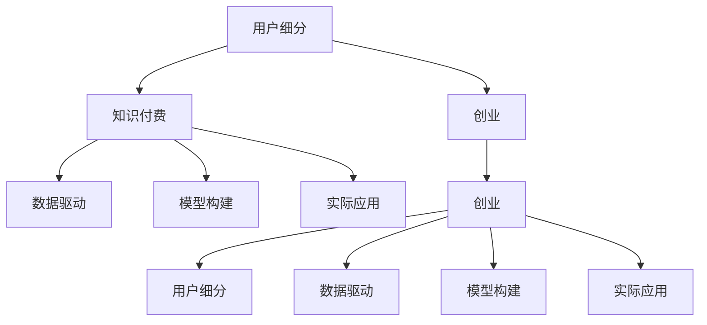

                 

# 知识付费创业的用户细分方法论

> 关键词：用户细分,知识付费,创业,数据驱动,模型构建,实际应用,技术框架

## 1. 背景介绍

### 1.1 问题由来
随着互联网技术的飞速发展，知识付费市场逐渐兴起，知识分享者通过线上平台为受众提供专业内容，并通过订阅、课程购买等方式获取收入。然而，由于用户需求的多样性和不确定性，知识付费平台的商业模式面临挑战。如何精准定位用户需求，有效细分用户群体，提升用户转化率和满意度，成为平台运营的关键。

### 1.2 问题核心关键点
用户细分是知识付费创业中不可或缺的一环。通过用户细分，平台可以针对不同用户需求提供定制化服务，优化用户体验，提升业务效益。同时，在数据驱动和模型构建的基础上，用户细分还能为后续的营销策略、产品迭代等提供支持。

### 1.3 问题研究意义
精准的用户细分不仅能提升知识付费平台的用户转化率和满意度，还能帮助平台在竞争激烈的市场中脱颖而出。同时，用户细分技术在电商、广告、金融等众多领域都有广泛应用，对于未来创业项目的设计和运营具有重要的借鉴意义。

## 2. 核心概念与联系

### 2.1 核心概念概述

为了更好地理解用户细分方法论，本节将介绍几个密切相关的核心概念：

- **用户细分**：将一个大的用户群体按照某些特定属性或行为特征进行分类，以更精准地理解和满足不同用户的需求。
- **知识付费**：提供专业知识的线上平台，用户通过付费获取课程、文章等内容，以满足学习、娱乐、专业技能提升等需求。
- **创业**：创立新企业，将其转化为商业机会，探索商业模式，并实现盈利的过程。
- **数据驱动**：利用大数据分析技术，从海量数据中提取有价值的信息，用于指导决策和策略制定。
- **模型构建**：通过机器学习模型对数据进行分析，发现数据中的规律和趋势，用于用户行为预测和细分。
- **实际应用**：将理论和技术应用于具体场景，解决实际问题，提升业务效果。

这些概念之间的逻辑关系可以通过以下Mermaid流程图来展示：



这个流程图展示了几类核心概念及其之间的关系：

1. 用户细分在知识付费和创业中起到了关键作用。
2. 数据驱动和技术模型是用户细分的重要工具。
3. 实际应用是用户细分的最终目标。

这些概念共同构成了知识付费创业中用户细分的方法论基础，为后续的详细分析和实践提供了清晰的指导。

## 3. 核心算法原理 & 具体操作步骤
### 3.1 算法原理概述

用户细分方法论的核心在于将用户进行合理的分类，从而更好地满足其需求。基于监督学习的方法是实现用户细分的一种常见技术。其基本思想是：通过历史数据和标签信息训练模型，预测新用户的行为特征，实现用户的自动分类。

### 3.2 算法步骤详解

基于监督学习的用户细分方法，主要包括以下几个关键步骤：

**Step 1: 数据准备**

- **数据收集**：从知识付费平台收集用户行为数据，如浏览记录、购买记录、课程评价等。
- **数据预处理**：对数据进行清洗和标准化，去除异常值和噪音，填充缺失值。

**Step 2: 特征工程**

- **特征选择**：从用户行为数据中提取有意义的特征，如课程浏览时长、购买频率、评价评分等。
- **特征工程**：对特征进行归一化、编码、降维等处理，以便于后续模型训练。

**Step 3: 模型选择与训练**

- **模型选择**：根据数据特征和任务需求，选择合适的监督学习模型，如决策树、随机森林、支持向量机等。
- **模型训练**：利用历史数据和标签信息训练模型，优化模型参数。

**Step 4: 模型评估与验证**

- **模型评估**：在测试集上评估模型的性能，计算准确率、召回率、F1值等指标。
- **模型验证**：通过交叉验证等技术手段，验证模型的泛化能力，防止过拟合。

**Step 5: 用户细分与标签生成**

- **用户分类**：利用训练好的模型对新用户进行分类，生成标签。
- **标签映射**：将分类结果映射到业务场景中，形成具体的用户细分结果。

### 3.3 算法优缺点

基于监督学习的用户细分方法，具有以下优点：

1. **高效性**：利用历史数据和标签信息，可以快速训练出用户分类模型。
2. **可解释性**：通过特征选择和模型训练，可以发现用户行为中的重要特征，为后续决策提供依据。
3. **灵活性**：可以根据具体业务需求选择不同的模型和算法，灵活应对不同场景。

同时，该方法也存在一些局限性：

1. **依赖标签**：需要高质量的标注数据，数据收集和标注成本较高。
2. **模型泛化**：模型在训练数据和测试数据之间可能存在差异，泛化能力有限。
3. **动态变化**：用户行为和需求可能会随时间变化，模型需要定期更新以保持准确性。

尽管存在这些局限性，基于监督学习的用户细分方法仍是大规模数据处理和分类的有效手段，广泛应用于知识付费平台的用户分析、个性化推荐等领域。

### 3.4 算法应用领域

基于监督学习的方法在知识付费平台的用户细分中，主要应用于以下场景：

- **新用户识别**：根据用户行为数据，自动识别新用户，并根据其兴趣进行推荐。
- **用户行为分析**：分析用户课程浏览、购买、评价等行为，生成用户画像，用于个性化服务。
- **内容推荐**：根据用户分类结果，推荐符合用户需求和兴趣的课程和文章。
- **营销策略**：利用用户细分结果，制定针对性的营销活动，提高用户转化率和满意度。

此外，用户细分技术在电商、广告、金融等众多领域都有广泛应用，能够帮助企业精准定位用户需求，优化用户体验，提升业务效益。

## 4. 数学模型和公式 & 详细讲解
### 4.1 数学模型构建

用户细分的数学模型通常基于监督学习框架，采用分类模型进行训练和预测。假设用户行为数据集为 $D=\{(x_i,y_i)\}_{i=1}^N$，其中 $x_i$ 为输入特征向量，$y_i$ 为标签，$y_i \in \{0,1\}$，表示用户是否属于某个细分群体。

定义分类器模型为 $h(x;\theta)$，其中 $\theta$ 为模型参数。训练目标是最小化损失函数 $L(h)$，即：

$$
\theta^* = \mathop{\arg\min}_{\theta} L(h)
$$

常见的损失函数包括交叉熵损失、对数损失等。在实际应用中，我们通常使用随机梯度下降等优化算法来最小化损失函数。

### 4.2 公式推导过程

以决策树模型为例，其基本思想是通过一系列特征选择和分类规则，构建一个树形结构，对输入数据进行分类。决策树的构建过程如下：

1. **特征选择**：从输入特征中选择一个最优特征 $f$ 进行划分，使得划分后的子集纯度最高。
2. **节点划分**：将数据集按照特征 $f$ 的取值进行划分，形成两个子集。
3. **递归划分**：对子集继续进行特征选择和节点划分，直到满足终止条件（如节点数、纯度等）。
4. **预测分类**：对新的输入数据 $x$，通过决策树结构进行递归遍历，最终得到分类结果 $y$。

决策树的损失函数为：

$$
L(h) = -\frac{1}{N}\sum_{i=1}^N \log(1 + e^{-y_ih(x_i)}) - \lambda\sum_{i=1}^N h(x_i)^2
$$

其中 $e$ 为自然常数，$y_ih(x_i)$ 表示模型预测结果和真实标签之间的差异。$\lambda$ 为正则化系数，防止模型过拟合。

### 4.3 案例分析与讲解

假设我们要对知识付费平台的用户进行细分，通过决策树模型预测用户是否倾向于购买专业课程。我们选取以下几个特征：课程浏览时长、购买频率、评价评分。

**特征选择**：
- **课程浏览时长**：代表用户对课程的兴趣程度，可以量化为课程浏览的平均时间。
- **购买频率**：表示用户在平台上的消费频率，可以计算过去一个月的购买次数。
- **评价评分**：反映用户对课程的满意度，可以通过评分分布进行量化。

**模型训练**：
- **数据准备**：收集用户的课程浏览、购买、评价等数据，进行数据清洗和特征工程。
- **特征编码**：将连续型特征转化为离散型特征，如将课程浏览时长分为高、中、低三个区间。
- **训练模型**：利用历史数据和标签信息训练决策树模型，选择合适的划分特征和深度。
- **模型评估**：在测试集上评估模型性能，计算准确率、召回率、F1值等指标。

**用户细分与标签生成**：
- **用户分类**：利用训练好的决策树模型，对新用户进行分类，预测其是否倾向于购买专业课程。
- **标签映射**：将分类结果映射到业务场景中，形成具体的用户细分结果，如高潜在需求用户、低潜在需求用户。

## 5. 项目实践：代码实例和详细解释说明
### 5.1 开发环境搭建

在进行用户细分实践前，我们需要准备好开发环境。以下是使用Python进行Scikit-learn开发的环境配置流程：

1. 安装Anaconda：从官网下载并安装Anaconda，用于创建独立的Python环境。

2. 创建并激活虚拟环境：
```bash
conda create -n scikit-learn-env python=3.8 
conda activate scikit-learn-env
```

3. 安装Scikit-learn：
```bash
conda install scikit-learn
```

4. 安装各类工具包：
```bash
pip install numpy pandas scikit-learn matplotlib tqdm jupyter notebook ipython
```

完成上述步骤后，即可在`scikit-learn-env`环境中开始用户细分实践。

### 5.2 源代码详细实现

下面以决策树模型为例，给出使用Scikit-learn进行用户细分的PyTorch代码实现。

首先，定义用户行为特征：

```python
import pandas as pd

# 读取用户行为数据
data = pd.read_csv('user_behavior.csv')

# 特征工程
features = ['course_view_time', 'purchase_frequency', 'evaluation_score']
X = data[features]
y = data['label'] # 用户是否倾向于购买专业课程
```

然后，构建和训练决策树模型：

```python
from sklearn.ensemble import DecisionTreeClassifier
from sklearn.model_selection import train_test_split

# 划分训练集和测试集
X_train, X_test, y_train, y_test = train_test_split(X, y, test_size=0.2, random_state=42)

# 构建决策树模型
clf = DecisionTreeClassifier(criterion='entropy', max_depth=5)
clf.fit(X_train, y_train)

# 模型评估
y_pred = clf.predict(X_test)
print(classification_report(y_test, y_pred))
```

最后，在实际应用中，利用模型对新用户进行分类：

```python
# 新用户行为数据
new_data = pd.read_csv('new_user_behavior.csv')

# 预测新用户分类
new_labels = clf.predict(new_data[features])
print(new_labels)
```

以上就是使用Scikit-learn进行用户细分的完整代码实现。可以看到，利用Scikit-learn库，开发者可以轻松实现决策树模型的构建和训练，进而对用户行为进行分类。

### 5.3 代码解读与分析

让我们再详细解读一下关键代码的实现细节：

**用户行为数据读取**：
- 通过Pandas库读取用户行为数据，并进行基本数据处理。

**特征工程**：
- 定义特征列表，包括课程浏览时长、购买频率、评价评分等。
- 从数据中提取特征数据和标签数据，分别存储到X和y中。

**模型构建与训练**：
- 使用Scikit-learn库的决策树分类器，指定损失函数为熵，限制树的最大深度为5。
- 划分训练集和测试集，并对训练集进行模型训练。
- 在测试集上评估模型性能，输出分类报告。

**用户细分与标签生成**：
- 对新用户的行为数据进行预测，生成分类标签。

可以看出，决策树模型的构建和训练是用户细分的核心步骤，通过合理的特征选择和模型调参，可以显著提升模型的分类效果。

## 6. 实际应用场景
### 6.1 新用户识别

新用户识别是知识付费平台的重要应用场景之一。通过用户细分，平台可以自动识别新用户，并根据其历史行为和兴趣，提供个性化的内容推荐。

具体而言，可以利用用户浏览记录、购买记录等历史数据，训练决策树模型，预测新用户是否倾向于购买专业课程。平台在识别到新用户后，可以根据预测结果推荐符合其兴趣的课程，提高新用户转化率。

### 6.2 个性化推荐

个性化推荐是知识付费平台的核心竞争力之一。通过用户细分，平台可以针对不同用户需求，提供定制化内容推荐，提升用户满意度。

在实际应用中，可以利用用户行为数据和标签信息，训练随机森林、支持向量机等模型，对用户进行分类。根据分类结果，平台可以生成个性化的课程推荐列表，帮助用户找到最符合其需求的内容。

### 6.3 用户行为分析

用户行为分析是平台优化运营策略的重要工具。通过用户细分，平台可以深入了解用户行为特征，发现用户需求变化趋势，及时调整内容策略。

在实际应用中，可以利用用户行为数据，训练分类模型，预测用户是否倾向于购买专业课程、是否频繁参与互动等。平台可以基于分析结果，优化课程内容、改进用户体验，提升平台整体效果。

### 6.4 未来应用展望

随着用户细分技术的发展，未来将会有更多场景得以应用，为知识付费平台带来更大的价值：

1. **内容动态调整**：利用用户细分结果，实时调整内容推荐策略，提升用户满意度。
2. **用户画像构建**：深入分析用户行为特征，构建详细的用户画像，用于营销和用户维护。
3. **个性化营销活动**：根据用户细分结果，设计针对性的营销活动，提高用户参与度和转化率。
4. **动态定价策略**：根据用户细分结果，制定动态定价策略，最大化平台收益。
5. **市场洞察分析**：利用用户细分技术，深入了解市场需求变化，指导新课程开发和业务拓展。

未来，用户细分技术将在知识付费平台和更多领域发挥重要作用，帮助企业更好地理解用户需求，提供个性化服务，提升业务效益。

## 7. 工具和资源推荐
### 7.1 学习资源推荐

为了帮助开发者系统掌握用户细分的方法论，这里推荐一些优质的学习资源：

1. 《Python数据科学手册》：由Jake VanderPlas编写，全面介绍Python在数据科学中的应用，包括数据预处理、特征工程、模型训练等。

2. 《机器学习实战》：由Peter Harrington编写，通过实际案例演示机器学习模型的构建和应用，适合初学者入门。

3. 《统计学习方法》：由李航编写，系统介绍统计学习的基本概念和算法，涵盖监督学习、无监督学习等。

4. 《深度学习》：由Ian Goodfellow、Yoshua Bengio、Aaron Courville编写，全面介绍深度学习的基本原理和应用，涵盖卷积神经网络、循环神经网络等。

5. Kaggle机器学习竞赛：全球最大的数据科学竞赛平台，提供丰富的实战项目，帮助开发者提升实践能力。

通过对这些资源的学习实践，相信你一定能够快速掌握用户细分的方法论，并用于解决实际的业务问题。

### 7.2 开发工具推荐

高效的开发离不开优秀的工具支持。以下是几款用于用户细分开发的常用工具：

1. Python：基于动态语言的脚本语言，拥有丰富的第三方库和框架，适合数据处理和模型训练。

2. Scikit-learn：开源的机器学习库，包含各种经典的分类、回归、聚类等算法，易于使用和调试。

3. TensorFlow：由Google主导开发的深度学习框架，生产部署方便，适合大规模工程应用。

4. PyTorch：基于动态计算图的深度学习框架，适合快速迭代研究，支持多种模型结构。

5. Weights & Biases：模型训练的实验跟踪工具，可以记录和可视化模型训练过程中的各项指标，方便对比和调优。

6. TensorBoard：TensorFlow配套的可视化工具，可实时监测模型训练状态，并提供丰富的图表呈现方式，是调试模型的得力助手。

合理利用这些工具，可以显著提升用户细分任务的开发效率，加快创新迭代的步伐。

### 7.3 相关论文推荐

用户细分技术的发展源于学界的持续研究。以下是几篇奠基性的相关论文，推荐阅读：

1. An Introduction to Statistical Learning：由Gareth James等编写，系统介绍统计学习的基本概念和算法，涵盖回归、分类、聚类等。

2. Decision Trees：由J Ross Quinlan编写，详细介绍决策树算法的基本原理和实现方法，适合初学者入门。

3. Random Forest：由T Tony Ho编写，介绍随机森林算法的原理和应用，涵盖特征选择、模型训练等。

4. Support Vector Machines：由Cristianini等编写，详细介绍支持向量机算法的基本原理和实现方法，涵盖核函数、优化算法等。

这些论文代表了大规模数据处理和分类的重要技术，通过学习这些前沿成果，可以帮助研究者把握学科前进方向，激发更多的创新灵感。

## 8. 总结：未来发展趋势与挑战
### 8.1 研究成果总结

本文对用户细分方法论进行了全面系统的介绍。首先阐述了知识付费创业中用户细分的背景和意义，明确了用户细分在提升用户体验和业务效益方面的重要作用。其次，从原理到实践，详细讲解了基于监督学习的用户细分方法，给出了用户细分任务开发的完整代码实例。同时，本文还广泛探讨了用户细分技术在实际应用中的多个场景，展示了用户细分范式的广泛应用前景。

通过本文的系统梳理，可以看到，基于监督学习的用户细分方法在知识付费平台中具有广阔的应用前景。未来，随着技术的不断进步和应用场景的拓展，用户细分技术将进一步提升平台的用户转化率和满意度，推动知识付费产业的可持续发展。

### 8.2 未来发展趋势

展望未来，用户细分技术将呈现以下几个发展趋势：

1. **自动化和智能化**：利用深度学习技术，自动进行特征选择和模型训练，提高用户细分效率和精度。
2. **多模态融合**：结合图像、语音、文本等多种模态数据，提升用户细分的全面性和准确性。
3. **动态调整**：利用实时数据进行动态调整，及时应对用户需求变化，提升用户细分结果的实效性。
4. **可解释性增强**：增强模型输出结果的可解释性，帮助用户理解其细分结果的生成逻辑。
5. **隐私保护**：在用户细分过程中，加强隐私保护和数据安全，确保用户数据不被滥用。

以上趋势凸显了用户细分技术的发展方向，将进一步提升用户分类的准确性和实时性，推动知识付费平台的业务创新。

### 8.3 面临的挑战

尽管用户细分技术已经取得了一定进展，但在实现过程中仍面临诸多挑战：

1. **数据质量和多样性**：用户行为数据质量和多样性不足，可能影响细分的准确性。
2. **模型泛化能力**：模型在测试数据和实际应用中的泛化能力有限，需要进行不断的优化和调整。
3. **计算资源需求**：用户细分涉及大量数据处理和模型训练，需要较高的计算资源和存储能力。
4. **模型复杂度**：模型复杂度较高，容易过拟合，需要有效的正则化手段进行控制。
5. **实时性要求**：用户行为和需求实时变化，用户细分结果需要及时更新，对系统响应速度和存储能力提出较高要求。

尽管存在这些挑战，用户细分技术仍然具有广阔的应用前景，需要在数据、算法、工程等各个环节进行优化和改进。

### 8.4 研究展望

未来，用户细分技术将在知识付费平台和更多领域发挥重要作用，进一步推动人工智能技术的发展。

1. **结合认知心理学**：利用认知心理学理论，深入理解用户行为背后的心理机制，提升用户细分的准确性和实效性。
2. **引入自然语言处理**：利用自然语言处理技术，从用户评价、评论等文本数据中提取有用信息，增强用户细分的全面性和准确性。
3. **跨领域应用推广**：将用户细分技术应用于更多领域，如电商、广告、金融等，实现跨领域知识迁移和创新。
4. **模型评估和优化**：利用先进的模型评估和优化方法，如交叉验证、集成学习等，提升用户细分的性能和稳定性。
5. **融合强化学习**：结合强化学习技术，实时调整用户推荐策略，提升用户满意度和平台收益。

这些研究方向将进一步拓展用户细分技术的边界，推动人工智能技术在各领域的深度应用。总之，用户细分技术需要不断地创新和优化，才能真正实现其价值，为知识付费平台和其他业务场景带来更大的收益和用户满意度。

## 9. 附录：常见问题与解答

**Q1：如何选择合适的特征进行用户细分？**

A: 特征选择是用户细分的关键步骤。在实际应用中，可以采用以下方法：

1. **领域知识**：利用领域知识和专家经验，选择与业务需求相关的特征。
2. **相关性分析**：通过相关性分析，选择与标签高度相关的特征。
3. **特征重要性排序**：利用特征重要性排序算法，如Pearson相关系数、LDA等，选择重要特征。
4. **模型评估**：利用模型评估结果，选择对分类效果贡献最大的特征。

**Q2：用户细分模型如何避免过拟合？**

A: 过拟合是用户细分模型常见的问题，可以采用以下方法：

1. **数据增强**：通过数据增强技术，扩充训练数据集，提升模型的泛化能力。
2. **正则化**：使用L1、L2正则化等手段，控制模型的复杂度，防止过拟合。
3. **交叉验证**：利用交叉验证技术，评估模型在多个子集上的表现，避免过拟合。
4. **集成学习**：利用集成学习方法，结合多个模型结果，提升分类效果和稳定性。

**Q3：用户细分结果如何使用？**

A: 用户细分结果可以应用于以下场景：

1. **内容推荐**：根据用户细分结果，推荐符合用户兴趣的内容。
2. **个性化营销**：利用用户细分结果，设计针对性的营销活动，提升用户转化率。
3. **用户画像**：构建详细的用户画像，用于用户行为分析和预测。
4. **动态定价**：根据用户细分结果，制定动态定价策略，最大化平台收益。

合理利用用户细分结果，可以提升平台的用户体验和业务效益。

---

作者：禅与计算机程序设计艺术 / Zen and the Art of Computer Programming

