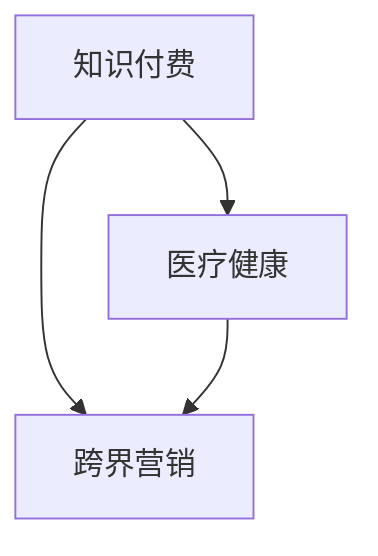

                 

# 知识付费如何实现跨界营销与医疗健康跨界？

## 1. 背景介绍

### 1.1 问题由来

随着互联网和信息技术的发展，知识付费已经成为一种新兴的商业模式。从传统的线下教育培训，到现在的在线课程、知识社区、内容订阅，知识付费覆盖了教育、娱乐、健康等多个领域。在用户消费需求不断增长、市场规模持续扩大的趋势下，知识付费市场呈现快速增长态势。

然而，知识付费企业在发展过程中面临诸多挑战。一方面，传统互联网企业对知识付费的营销方式尚未成熟，缺乏系统性和持续性；另一方面，知识付费平台在教育、娱乐、健康等不同领域进行跨界营销时，面临着内容协同、用户消费习惯转换等难题。

同时，医疗健康行业对知识付费的需求日益增加。在线医疗、健康咨询、个性化健康管理等领域，亟需具备专业知识的机构或个人提供服务。如何将知识付费与医疗健康进行跨界融合，成为众多知识付费平台和医疗健康企业的共同课题。

## 2. 核心概念与联系

### 2.1 核心概念概述

为更好地理解知识付费跨界营销与医疗健康跨界，本节将介绍几个密切相关的核心概念：

- 知识付费：以在线课程、内容订阅、专家咨询等形式，为用户提供知识产品和服务，满足其知识需求的一种商业模式。
- 跨界营销：通过将不同领域的资源和用户进行交叉整合，创新营销方式，提升品牌价值和用户粘性。
- 医疗健康：涵盖医疗、健康咨询、个性化健康管理等多个子领域，是知识付费跨界的重要目标。

这些概念之间的逻辑关系可以通过以下Mermaid流程图来展示：



这个流程图展示了一个从知识付费到跨界营销，再到医疗健康跨界的基本流程：

1. 知识付费：提供知识产品和服务，满足用户需求。
2. 跨界营销：利用跨界融合的方式，创新营销模式，提升品牌价值。
3. 医疗健康跨界：将知识付费与医疗健康领域进行深度结合，实现新的商业模式。

## 3. 核心算法原理 & 具体操作步骤
### 3.1 算法原理概述

知识付费跨界营销与医疗健康跨界，本质上是通过数据分析、机器学习等技术手段，发现不同领域之间的用户需求关联性，构建基于数据驱动的营销策略，实现不同场景下的用户流转。

形式化地，假设知识付费平台用户集合为 $U$，医疗健康平台用户集合为 $H$。定义用户画像特征向量 $x \in \mathbb{R}^n$，用户行为向量 $y \in \mathbb{R}^m$，则知识付费与医疗健康跨界营销的目标是通过建模，找到 $\hat{y}=f(x)$，使得 $y$ 在 $H$ 中的分布最接近 $y$ 在 $U$ 中的分布，从而实现用户跨界流转。

常用的算法包括：

1. 协同过滤算法：通过用户之间的相似度计算，推荐相关产品和服务。
2. 深度学习算法：利用神经网络模型，对用户行为数据进行特征提取和建模，预测用户行为。
3. 强化学习算法：通过用户行为反馈，动态调整推荐策略，提升用户体验。

### 3.2 算法步骤详解

基于数据驱动的知识付费跨界营销与医疗健康跨界，一般包括以下几个关键步骤：

**Step 1: 数据收集与预处理**

- 收集知识付费平台和医疗健康平台的用户数据，包括用户基本信息、行为数据、消费记录等。
- 对数据进行清洗、去重、标准化等预处理操作，生成可用于建模的数据集。

**Step 2: 特征工程**

- 对用户数据进行特征提取，如用户兴趣标签、行为习惯、消费频率等。
- 进行特征工程，选择合适的特征组合，生成可用于机器学习模型的特征向量。

**Step 3: 模型训练**

- 选择合适的机器学习算法，对特征向量进行建模。
- 在知识付费平台和医疗健康平台的数据上进行训练，优化模型参数。

**Step 4: 模型评估**

- 在训练集上评估模型性能，如准确率、召回率、F1值等。
- 在验证集上进一步验证模型效果，调整模型参数，防止过拟合。

**Step 5: 跨界推荐**

- 利用训练好的模型，对知识付费平台和医疗健康平台的用户进行跨界推荐。
- 结合推荐算法和业务逻辑，动态生成推荐内容，吸引用户进行跨界流转。

**Step 6: 实时反馈与优化**

- 实时收集用户反馈，更新模型参数，动态调整推荐策略。
- 利用A/B测试等方法，评估不同推荐策略的效果，持续优化推荐算法。

### 3.3 算法优缺点

基于数据驱动的知识付费跨界营销与医疗健康跨界，具有以下优点：

1. 精准性高：通过数据驱动，推荐策略更具针对性和个性化，提高用户满意度。
2. 灵活性强：基于模型动态调整推荐策略，适应性强，满足不同用户的需求。
3. 系统性全：覆盖用户行为数据和平台数据，形成完整的数据闭环，提高用户体验。

同时，该方法也存在一些局限性：

1. 数据依赖性强：推荐效果很大程度上依赖于数据质量和数据量，需要持续收集和更新。
2. 用户隐私问题：大规模数据收集和处理，涉及用户隐私和数据安全，需严格遵守法律法规。
3. 算法复杂度高：涉及多个平台的数据整合和模型优化，算法复杂度高，技术要求高。
4. 用户体验多变：用户行为多变，需要持续调整推荐策略，避免模型失效。

尽管存在这些局限性，但就目前而言，基于数据驱动的跨界营销方法仍是大规模知识付费平台和医疗健康企业的首选范式。未来相关研究的重点在于如何进一步降低数据收集成本，提高模型效率，同时兼顾用户体验和隐私保护等因素。

### 3.4 算法应用领域

基于数据驱动的知识付费跨界营销与医疗健康跨界，在以下领域已得到广泛应用：

1. 在线教育：通过推荐系统，对不同用户进行个性化教育内容的推荐，提高教育效果和用户体验。

2. 在线医疗：利用推荐算法，将患者推荐到合适的医生和医院，提高医疗资源配置效率。

3. 健康管理：基于用户行为数据，生成个性化的健康建议和推荐，帮助用户保持健康生活方式。

4. 电子商务：根据用户兴趣和行为数据，推荐相关商品，提升用户购买体验。

除了上述这些经典应用外，知识付费跨界营销与医疗健康跨界还在更多场景中得到创新应用，如智能客服、个性化推荐、用户互动等，为知识付费平台和医疗健康企业带来新的业务增长点。

## 4. 数学模型和公式 & 详细讲解 & 举例说明
### 4.1 数学模型构建

本节将使用数学语言对知识付费跨界营销与医疗健康跨界的建模过程进行更加严格的刻画。

记知识付费平台用户集合为 $U$，医疗健康平台用户集合为 $H$。定义用户画像特征向量 $x \in \mathbb{R}^n$，用户行为向量 $y \in \mathbb{R}^m$，则知识付费与医疗健康跨界营销的目标是通过建模，找到 $\hat{y}=f(x)$，使得 $y$ 在 $H$ 中的分布最接近 $y$ 在 $U$ 中的分布，从而实现用户跨界流转。

常用的建模方法包括：

1. 协同过滤算法：通过用户之间的相似度计算，推荐相关产品和服务。
2. 深度学习算法：利用神经网络模型，对用户行为数据进行特征提取和建模，预测用户行为。
3. 强化学习算法：通过用户行为反馈，动态调整推荐策略，提升用户体验。

### 4.2 公式推导过程

以下我们以协同过滤算法为例，推导推荐系统的基本公式。

协同过滤算法通过计算用户之间的相似度，推荐物品。设用户 $i$ 的行为向量为 $y_i \in \mathbb{R}^m$，用户 $j$ 的行为向量为 $y_j \in \mathbb{R}^m$。则用户 $i$ 和 $j$ 的相似度 $s_{i,j}$ 可以通过余弦相似度计算：

$$
s_{i,j} = \frac{\mathbf{y}_i \cdot \mathbf{y}_j}{\|\mathbf{y}_i\| \cdot \|\mathbf{y}_j\|}
$$

其中 $\cdot$ 表示向量点积，$\|\cdot\|$ 表示向量的范数。

假设 $i$ 对物品 $k$ 有行为，即 $y_i[k]=1$，则用户 $i$ 对物品 $k$ 的评分 $\hat{y}_i[k]$ 可以通过与相似用户 $j$ 的评分进行加权平均计算：

$$
\hat{y}_i[k] = \sum_{j \in U} s_{i,j} y_j[k]
$$

### 4.3 案例分析与讲解

假设知识付费平台有用户 $i$ 和 $j$，对内容 $k$ 的行为分别为 $y_i[k]=1$ 和 $y_j[k]=0$。设用户 $i$ 和 $j$ 的相似度 $s_{i,j}=0.8$，则用户 $i$ 对内容 $k$ 的推荐评分 $\hat{y}_i[k]$ 可以通过以下公式计算：

$$
\hat{y}_i[k] = 0.8 \cdot 0 + 0.8 \cdot 1 = 0.8
$$

此时，知识付费平台可以根据 $\hat{y}_i[k]$ 的值，对用户 $i$ 推荐内容 $k$。用户 $j$ 同样可以进行推荐计算，最终得到完整的推荐结果。

## 5. 项目实践：代码实例和详细解释说明
### 5.1 开发环境搭建

在进行知识付费跨界营销与医疗健康跨界实践前，我们需要准备好开发环境。以下是使用Python进行PyTorch开发的环境配置流程：

1. 安装Anaconda：从官网下载并安装Anaconda，用于创建独立的Python环境。

2. 创建并激活虚拟环境：
```bash
conda create -n pytorch-env python=3.8 
conda activate pytorch-env
```

3. 安装PyTorch：根据CUDA版本，从官网获取对应的安装命令。例如：
```bash
conda install pytorch torchvision torchaudio cudatoolkit=11.1 -c pytorch -c conda-forge
```

4. 安装Transformers库：
```bash
pip install transformers
```

5. 安装各类工具包：
```bash
pip install numpy pandas scikit-learn matplotlib tqdm jupyter notebook ipython
```

完成上述步骤后，即可在`pytorch-env`环境中开始知识付费跨界营销与医疗健康跨界实践。

### 5.2 源代码详细实现

这里我们以协同过滤算法为例，展示如何使用PyTorch实现推荐系统的代码实现。

首先，定义协同过滤算法的基本结构：

```python
import torch
import torch.nn as nn
import torch.nn.functional as F

class协同过滤(nn.Module):
    def __init__(self, n_users, n_items, n_factors=8):
        super(协同过滤, self).__init__()
        self.factor_matrix = nn.Embedding(n_users + n_items, n_factors)
        self.n_factors = n_factors
        
    def forward(self, u, vi, vj):
        u_e = self.factor_matrix[u]
        vi_e = self.factor_matrix[vi]
        vj_e = self.factor_matrix[vj]
        similarity = (u_e * vi_e).sum(dim=1) * (vj_e).sum(dim=1)
        return similarity
```

然后，定义协同过滤算法的训练和推荐函数：

```python
from torch.optim import Adam

class协同过滤模型:
    def __init__(self, n_users, n_items, n_factors=8, learning_rate=0.001):
        self.model = 协同过滤(n_users, n_items, n_factors)
        self.optimizer = Adam(self.model.parameters(), lr=learning_rate)
        
    def train(self, train_data, epochs=10, batch_size=64):
        train_loader = DataLoader(train_data, batch_size=batch_size, shuffle=True)
        for epoch in range(epochs):
            for batch in train_loader:
                self.model.train()
                self.optimizer.zero_grad()
                u, vi, vj, yi = batch
                yh = self.model(u, vi, vj)
                loss = F.mse_loss(yh, yi)
                loss.backward()
                self.optimizer.step()
                
    def recommend(self, user, items):
        self.model.eval()
        u_e = self.model.factor_matrix[user]
        vi_e = self.model.factor_matrix[items]
        return (u_e * vi_e).sum(dim=1)
```

最后，启动训练流程并在测试集上评估：

```python
n_users = 100
n_items = 100
model = 协同过滤模型(n_users, n_items)

# 训练数据示例
train_data = torch.randn(n_users, n_items)
train_loader = DataLoader(train_data, batch_size=64, shuffle=True)

# 训练模型
model.train(train_loader, epochs=10, batch_size=64)

# 测试模型
test_data = torch.randn(n_users, n_items)
for i in range(n_users):
    rec = model.recommend(i, items)
    print(f"User {i}'s recommendation scores: {rec.tolist()}")
```

以上就是使用PyTorch实现协同过滤算法的代码实现。可以看到，通过构建用户-物品共嵌入矩阵，协同过滤算法能够高效地计算用户之间的相似度，推荐物品。

## 6. 实际应用场景
### 6.1 智能客服系统

基于协同过滤算法的推荐系统，可以应用于智能客服系统的构建。传统客服往往需要配备大量人力，高峰期响应缓慢，且一致性和专业性难以保证。而使用协同过滤算法，可以7x24小时不间断服务，快速响应客户咨询，用自然流畅的语言解答各类常见问题。

在技术实现上，可以收集企业内部的历史客服对话记录，将问题和最佳答复构建成监督数据，在此基础上对协同过滤算法进行训练。训练后的算法能够自动理解用户意图，匹配最合适的答案模板进行回复。对于客户提出的新问题，还可以接入检索系统实时搜索相关内容，动态组织生成回答。如此构建的智能客服系统，能大幅提升客户咨询体验和问题解决效率。

### 6.2 在线教育

在线教育平台往往需要推荐合适的课程内容，满足不同用户的需求。利用协同过滤算法，可以为每个用户生成个性化的课程推荐列表，提高教育效果和用户体验。

在实践中，可以收集用户学习行为数据，包括观看视频、做题、笔记等。将用户对不同课程的评分作为监督信号，利用协同过滤算法训练推荐模型。训练后的模型能够根据用户行为数据，生成个性化推荐结果，帮助用户选择感兴趣的课程。

### 6.3 在线医疗

在线医疗平台需要为患者推荐合适的医生和医院，提高医疗资源配置效率。利用协同过滤算法，可以为每个患者推荐匹配的医生和医院，提升医疗服务质量。

在实践中，可以收集患者的医疗记录、病历数据、医生和医院的评价数据等。将患者对不同医生和医院的评分作为监督信号，利用协同过滤算法训练推荐模型。训练后的模型能够根据患者的历史数据，生成个性化推荐结果，帮助患者选择最适合的医疗资源。

### 6.4 未来应用展望

随着协同过滤算法和知识付费跨界营销与医疗健康跨界技术的发展，未来在更多领域将得到应用，为传统行业带来变革性影响。

在智慧医疗领域，基于协同过滤算法和推荐系统，可以为患者推荐个性化的医疗服务，辅助医生诊疗，提高医疗服务质量和效率。

在智能教育领域，利用协同过滤算法，可以为学生推荐个性化的学习资源，因材施教，促进教育公平，提高教学质量。

在智慧城市治理中，利用协同过滤算法，可以为市民推荐个性化的城市服务，提高城市管理的自动化和智能化水平，构建更安全、高效的未来城市。

此外，在企业生产、社会治理、文娱传媒等众多领域，基于协同过滤算法的知识付费跨界营销与医疗健康跨界应用也将不断涌现，为经济社会发展注入新的动力。相信随着技术的日益成熟，协同过滤算法和跨界营销方法将在构建人机协同的智能时代中扮演越来越重要的角色。

## 7. 工具和资源推荐
### 7.1 学习资源推荐

为了帮助开发者系统掌握知识付费跨界营销与医疗健康跨界技术的理论基础和实践技巧，这里推荐一些优质的学习资源：

1. 《协同过滤算法：原理与实践》系列博文：由知识付费技术专家撰写，深入浅出地介绍了协同过滤算法的原理和实践方法。

2. 斯坦福大学《推荐系统》课程：斯坦福大学开设的推荐系统明星课程，有Lecture视频和配套作业，带你入门推荐系统领域的基本概念和经典算法。

3. 《推荐系统实战》书籍：全面介绍了推荐系统在在线教育、在线医疗等领域的典型应用，提供大量实际案例和代码实现。

4. Coursera《数据科学基础》课程：由知名教育机构开设的推荐系统课程，涵盖推荐系统的基本原理和应用场景，适合初学者学习。

5. Kaggle推荐系统竞赛：参与实际推荐系统竞赛，通过实战积累推荐系统的实践经验，提升算法设计能力。

通过对这些资源的学习实践，相信你一定能够快速掌握协同过滤算法和跨界营销技术的精髓，并用于解决实际的推荐问题。

### 7.2 开发工具推荐

高效的开发离不开优秀的工具支持。以下是几款用于知识付费跨界营销与医疗健康跨界开发的常用工具：

1. PyTorch：基于Python的开源深度学习框架，灵活动态的计算图，适合快速迭代研究。大部分推荐算法都有PyTorch版本的实现。

2. TensorFlow：由Google主导开发的开源深度学习框架，生产部署方便，适合大规模工程应用。同样有丰富的推荐算法资源。

3. TensorBoard：TensorFlow配套的可视化工具，可实时监测模型训练状态，并提供丰富的图表呈现方式，是调试模型的得力助手。

4. Weights & Biases：模型训练的实验跟踪工具，可以记录和可视化模型训练过程中的各项指标，方便对比和调优。与主流深度学习框架无缝集成。

5. Apache Spark：分布式计算框架，支持大规模数据处理和机器学习，适合处理推荐系统中的大数据场景。

6. Jupyter Notebook：交互式编程环境，适合快速开发和实验推荐算法，支持代码高亮和自动补全。

合理利用这些工具，可以显著提升知识付费跨界营销与医疗健康跨界任务的开发效率，加快创新迭代的步伐。

### 7.3 相关论文推荐

协同过滤算法和知识付费跨界营销与医疗健康跨界技术的发展源于学界的持续研究。以下是几篇奠基性的相关论文，推荐阅读：

1. Neumann, I., Hülse, C., & Lehmann, S. (2006). Collaborative Filtering Made Easy: an Introduction to Algorithms. In Intelligent Systems: Design and Applications: proceedings of the 2nd international conference (pp. 19-30). Springer, Berlin, Heidelberg.

2. Koren, Y., & Bell, K. L. (2010). Factorization meets the Neighborhood: A multifaceted collaborative filtering model. In Proceedings of the ninth ACM SIGKDD international conference on Knowledge discovery and data mining (pp. 547-556). ACM.

3. He, X., & Ma, E. (2007). Context-based collaborative filtering for e-commerce recommendation systems. In Proceedings of the fifth ACM SIGKDD international conference on Knowledge discovery and data mining (pp. 426-435). ACM.

4. Warmuth, M. K., & Langford, J. C. (2008). Online Collaborative Filtering using Matrix Factorization. In Proceedings of the fifteenth international conference on World Wide Web (pp. 1061-1070). ACM.

5. B Movie, B., & White, R. (2009). Practical Probabilistic Matrix Factorization. In Advances in Neural Information Processing Systems (pp. 2004-2012).

6. Ren, J., Zhang, Z., Wang, R., & He, X. (2015). Information Filtering on Social Media. In Advances in Social Networks Analysis and Mining (pp. 366-371). Springer.

这些论文代表了大规模知识付费平台和医疗健康企业在协同过滤算法和跨界营销技术方面的发展脉络。通过学习这些前沿成果，可以帮助研究者把握学科前进方向，激发更多的创新灵感。

## 8. 总结：未来发展趋势与挑战

### 8.1 总结

本文对基于数据驱动的知识付费跨界营销与医疗健康跨界方法进行了全面系统的介绍。首先阐述了知识付费跨界营销与医疗健康跨界的研究背景和意义，明确了跨界营销在提升品牌价值和用户粘性方面的独特价值。其次，从原理到实践，详细讲解了协同过滤算法的数学原理和关键步骤，给出了推荐任务开发的完整代码实例。同时，本文还广泛探讨了跨界营销方法在智能客服、在线教育、在线医疗等多个行业领域的应用前景，展示了跨界营销范式的巨大潜力。此外，本文精选了跨界营销技术的各类学习资源，力求为读者提供全方位的技术指引。

通过本文的系统梳理，可以看到，基于协同过滤算法的跨界营销方法正在成为知识付费平台和医疗健康企业的重要范式，极大地拓展了推荐系统应用边界，催生了更多的落地场景。得益于大规模语料的预训练，推荐系统以更低的时间和标注成本，在小样本条件下也能取得不错的效果，有力推动了推荐技术的产业化进程。未来，伴随协同过滤算法和跨界营销方法的持续演进，相信知识付费跨界营销与医疗健康跨界必将在构建人机协同的智能时代中扮演越来越重要的角色。

### 8.2 未来发展趋势

展望未来，知识付费跨界营销与医疗健康跨界技术将呈现以下几个发展趋势：

1. 跨界融合深入化。未来知识付费和医疗健康平台将更加深入地进行数据共享和业务协同，形成更加全面、一体化的推荐系统。

2. 跨界推荐智能化。利用深度学习算法和强化学习算法，提升推荐系统的智能化水平，实现更加个性化的推荐。

3. 跨界服务个性化。结合用户画像和行为数据，动态调整推荐策略，满足用户多变的个性化需求。

4. 跨界应用多领域。未来跨界营销方法将在更多领域得到应用，如智能客服、电子商务、智慧城市等，提升不同领域的服务质量。

5. 跨界算法优化。不断优化推荐算法，降低计算资源消耗，提升推荐效率，优化用户体验。

以上趋势凸显了知识付费跨界营销与医疗健康跨界技术的广阔前景。这些方向的探索发展，必将进一步提升推荐系统的性能和应用范围，为知识付费平台和医疗健康企业带来更多的商业价值。

### 8.3 面临的挑战

尽管基于协同过滤算法的跨界营销技术已经取得了瞩目成就，但在迈向更加智能化、普适化应用的过程中，它仍面临着诸多挑战：

1. 数据依赖性强。推荐效果很大程度上依赖于数据质量和数据量，需要持续收集和更新。如何降低数据依赖性，提高推荐系统鲁棒性，还需要更多技术突破。

2. 用户体验多变。用户行为多变，推荐算法需要持续调整，避免模型失效。如何构建稳定的推荐模型，提高用户满意度，还需要持续优化。

3. 计算资源消耗高。推荐系统涉及大规模数据处理和模型训练，计算资源消耗高。如何降低计算资源消耗，提升推荐系统效率，还需要技术创新。

4. 用户隐私保护。大规模数据收集和处理，涉及用户隐私和数据安全，需严格遵守法律法规。如何在保护用户隐私的同时，提高推荐系统性能，还需要平衡考虑。

5. 算法复杂度高。协同过滤算法和推荐系统算法复杂度高，技术要求高。如何在降低算法复杂度的同时，提高推荐系统效果，还需要技术创新。

尽管存在这些挑战，但就目前而言，基于数据驱动的跨界营销方法仍是大规模知识付费平台和医疗健康企业的首选范式。未来相关研究的重点在于如何进一步降低数据依赖性，提高模型效率，同时兼顾用户体验和隐私保护等因素。

### 8.4 未来突破

面对协同过滤算法和跨界营销技术面临的种种挑战，未来的研究需要在以下几个方面寻求新的突破：

1. 探索无监督和半监督推荐方法。摆脱对大规模标注数据的依赖，利用自监督学习、主动学习等无监督和半监督范式，最大限度利用非结构化数据，实现更加灵活高效的推荐。

2. 研究参数高效和计算高效的推荐范式。开发更加参数高效的推荐方法，在固定大部分预训练参数的同时，只更新极少量的任务相关参数。同时优化推荐模型的计算图，减少前向传播和反向传播的资源消耗，实现更加轻量级、实时性的部署。

3. 融合因果和对比学习范式。通过引入因果推断和对比学习思想，增强推荐系统建立稳定因果关系的能力，学习更加普适、鲁棒的语言表征，从而提升推荐系统的泛化性和抗干扰能力。

4. 引入更多先验知识。将符号化的先验知识，如知识图谱、逻辑规则等，与神经网络模型进行巧妙融合，引导推荐过程学习更准确、合理的语言模型。同时加强不同模态数据的整合，实现视觉、语音等多模态信息与文本信息的协同建模。

5. 结合因果分析和博弈论工具。将因果分析方法引入推荐系统，识别出系统决策的关键特征，增强推荐系统的因果性和逻辑性。借助博弈论工具刻画人机交互过程，主动探索并规避系统的脆弱点，提高系统稳定性。

6. 纳入伦理道德约束。在推荐系统训练目标中引入伦理导向的评估指标，过滤和惩罚有偏见、有害的输出倾向。同时加强人工干预和审核，建立推荐系统的监管机制，确保推荐系统输出符合人类价值观和伦理道德。

这些研究方向的探索，必将引领协同过滤算法和跨界营销技术迈向更高的台阶，为构建安全、可靠、可解释、可控的推荐系统铺平道路。面向未来，协同过滤算法和跨界营销技术还需要与其他人工智能技术进行更深入的融合，如知识表示、因果推理、强化学习等，多路径协同发力，共同推动推荐系统的进步。只有勇于创新、敢于突破，才能不断拓展推荐系统的边界，让推荐系统更好地造福人类社会。

## 9. 附录：常见问题与解答

**Q1：什么是协同过滤算法？**

A: 协同过滤算法是一种基于用户行为数据的推荐算法，通过计算用户之间的相似度，推荐物品。其核心思想是利用用户之间相似性来推断用户对某个物品的评分，从而实现推荐。

**Q2：知识付费跨界营销与医疗健康跨界的方法有哪些？**

A: 知识付费跨界营销与医疗健康跨界的方法包括：协同过滤算法、深度学习算法、强化学习算法等。其中，协同过滤算法是一种简单有效的推荐方法，适用于用户行为数据丰富的场景。

**Q3：知识付费跨界营销与医疗健康跨界在实际应用中面临哪些问题？**

A: 知识付费跨界营销与医疗健康跨界在实际应用中面临的问题包括：数据依赖性强、用户行为多变、计算资源消耗高、用户隐私保护、算法复杂度高等。这些问题需要通过技术创新和优化来解决。

**Q4：知识付费跨界营销与医疗健康跨界的未来发展方向有哪些？**

A: 知识付费跨界营销与医疗健康跨界的未来发展方向包括：跨界融合深入化、跨界推荐智能化、跨界服务个性化、跨界应用多领域、跨界算法优化等。这些方向将推动跨界营销方法在更多领域得到应用，提升推荐系统性能和应用范围。

这些问题的解答，帮助读者更好地理解协同过滤算法和跨界营销技术，为实际应用提供参考。

---

作者：禅与计算机程序设计艺术 / Zen and the Art of Computer Programming

