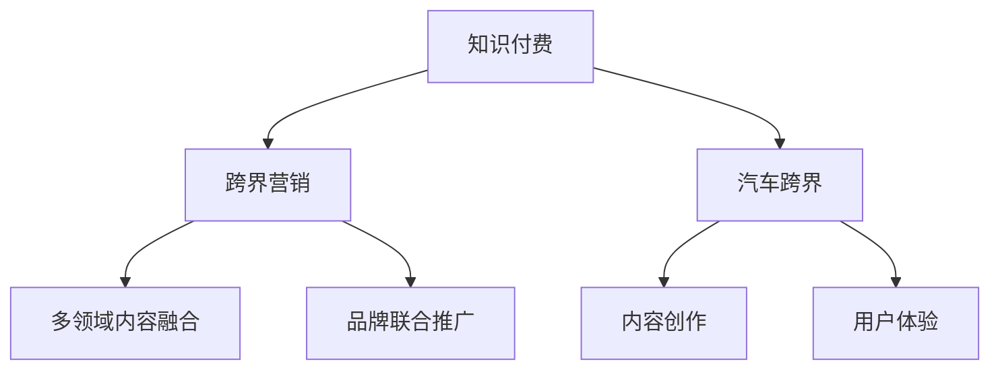

                 

## 1. 背景介绍

### 1.1 问题由来
随着知识经济的崛起，知识付费已成为互联网内容消费的重要趋势。如何在知识付费平台上实现有效跨界营销，成为内容创作者和平台运营者关注的焦点。汽车行业作为知识付费的重要垂直领域，其跨界营销策略同样值得深入探讨。

### 1.2 问题核心关键点
知识付费的跨界营销是指通过整合不同领域的内容和资源，实现交叉推广和互利共赢。汽车跨界营销则是指汽车企业通过与文化、娱乐、教育等领域的合作，提升品牌知名度和用户粘性。

核心关键点包括：
- **跨界合作**：知识付费与汽车行业之间的资源互换和内容交叉。
- **内容创新**：通过多样化内容吸引更多用户。
- **用户粘性**：提升用户在知识付费平台和汽车品牌间的长期互动和忠诚度。

### 1.3 问题研究意义
研究知识付费的跨界营销与汽车跨界策略，有助于内容创作者和汽车企业通过合作提升品牌价值，吸引更多潜在用户，促进内容消费和汽车销售，具有重要的现实意义。

## 2. 核心概念与联系

### 2.1 核心概念概述

为更好地理解知识付费的跨界营销与汽车跨界策略，本节将介绍几个核心概念：

- **知识付费**：用户为获取知识和信息，愿意支付相应费用的新型互联网消费模式。
- **跨界营销**：不同行业之间通过资源整合和内容交叉，实现品牌推广和用户粘性提升的营销策略。
- **汽车跨界**：汽车品牌通过与文化、娱乐、教育等领域的合作，实现品牌多样化发展，提升市场影响力。
- **内容创作**：知识付费平台和汽车企业通过创作优质内容，吸引用户，增强用户粘性。
- **用户体验**：通过提升用户体验，提升用户满意度和忠诚度。

这些核心概念之间的逻辑关系可以通过以下Mermaid流程图来展示：



这个流程图展示了大语言模型的核心概念及其之间的关系：

1. 知识付费平台与汽车企业之间的资源互换。
2. 内容创作和用户体验提升，增加用户粘性。
3. 多领域内容融合和品牌联合推广，实现跨界营销。

## 3. 核心算法原理 & 具体操作步骤
### 3.1 算法原理概述

知识付费的跨界营销与汽车跨界策略的核心算法原理，在于通过数据整合和内容优化，实现不同领域资源的有效利用和品牌联合推广。其关键在于：

- **数据整合**：整合不同领域的数据，进行交叉分析，找到潜在的用户群体和合作点。
- **内容优化**：根据用户需求和行为，优化内容质量，提升用户满意度和粘性。
- **品牌联合**：通过品牌联合推广，实现1+1>2的效果，提升品牌知名度和市场影响力。

### 3.2 算法步骤详解

基于上述算法原理，知识付费的跨界营销与汽车跨界策略一般包括以下几个关键步骤：

**Step 1: 收集并整理数据**
- 收集知识付费平台和汽车行业的数据，包括用户行为、消费偏好、内容反馈等。
- 对数据进行预处理和分析，找到不同领域之间的潜在合作机会。

**Step 2: 制定跨界合作方案**
- 根据数据分析结果，制定跨界合作方案，确定合作的内容、形式、渠道等。
- 确定各领域的合作目标和预期效果，进行可行性分析和风险评估。

**Step 3: 开发跨界合作产品**
- 结合知识付费平台和汽车品牌的特点，设计跨界合作产品，如联合课程、品牌活动、车载APP等。
- 开发跨界合作产品，确保其功能完备、界面友好、用户体验优秀。

**Step 4: 推广和评估**
- 在知识付费平台和汽车品牌各自的渠道上进行推广，提高用户知晓度和参与度。
- 对跨界合作效果进行评估，根据反馈不断优化合作内容和形式。

**Step 5: 持续优化和创新**
- 根据合作效果和市场变化，持续优化跨界合作策略，引入新内容和形式。
- 鼓励创新，不断探索新的跨界合作模式和内容形式，提升用户粘性和品牌影响力。

### 3.3 算法优缺点

知识付费的跨界营销与汽车跨界策略具有以下优点：
1. **资源共享**：通过整合不同领域的数据和资源，实现更高效的利用和推广。
2. **品牌提升**：跨界合作可以提升品牌知名度和市场影响力，扩大品牌覆盖面。
3. **用户粘性**：通过多样化内容和联合推广，提升用户粘性和忠诚度。
4. **风险分散**：不同领域的合作可以分散风险，减少单一领域的市场波动影响。

同时，该策略也存在一些局限性：
1. **协调成本高**：跨界合作需要双方协调沟通，可能涉及不同领域的目标和需求，协调成本较高。
2. **效果评估困难**：跨界合作效果涉及多个领域，难以准确评估其具体贡献和影响。
3. **内容同质化风险**：跨界合作可能造成内容同质化，降低用户区分度和满意度。
4. **市场变化快**：市场变化迅速，跨界合作需要快速适应和调整，否则可能错失机会。

尽管存在这些局限性，但就目前而言，跨界营销仍是提升品牌价值和用户粘性的重要手段。未来相关研究的重点在于如何进一步优化跨界合作的效率和效果，兼顾成本和风险。

### 3.4 算法应用领域

知识付费的跨界营销与汽车跨界策略主要应用于以下领域：

- **内容创作**：如汽车品牌与知识付费平台联合推出汽车知识付费课程，覆盖汽车维修、保养、驾驶技巧等内容。
- **品牌推广**：汽车品牌通过知识付费平台进行品牌推广，如汽车试驾体验课程、汽车行业分析报告等。
- **用户互动**：通过知识付费平台，汽车品牌与用户进行互动，收集用户反馈，改进产品和服务。
- **教育合作**：汽车品牌与教育机构合作，推出面向大学生的汽车技术科普课程，培养学生对汽车行业的兴趣。
- **健康生活**：汽车品牌与健康生活平台合作，推出汽车与健康生活相结合的内容，如汽车驾驶与健康、绿色出行等主题。

这些领域的应用展示了知识付费跨界营销与汽车跨界的巨大潜力。通过多领域资源的整合和内容的创新，知识付费平台和汽车品牌可以形成更为广阔的市场影响力，提升品牌价值和用户粘性。

## 4. 数学模型和公式 & 详细讲解  
### 4.1 数学模型构建

本节将使用数学语言对知识付费的跨界营销与汽车跨界策略进行更加严格的刻画。

记知识付费平台的用户集合为 $U$，汽车品牌集合为 $A$。设知识付费平台的用户对汽车品牌的内容兴趣度为 $P(U,A)$，汽车品牌对知识付费平台的内容推荐度为 $P(A,U)$。

定义合作效果为 $E(U,A)$，其表达式可以表示为：

$$
E(U,A) = \log (P(U,A) \times P(A,U))
$$

其中 $\log$ 函数用于提高模型解释性。

### 4.2 公式推导过程

通过上述定义，我们可以推导出合作效果的最大化表达式。具体而言，对于知识付费平台的用户 $u \in U$，汽车品牌 $a \in A$，合作效果为：

$$
E(u,a) = \log \left( \frac{P(u,a)}{P(a)} \times \frac{P(a,u)}{P(u)} \right)
$$

其中 $P(a)$ 和 $P(u)$ 分别为汽车品牌和知识付费平台的用户兴趣度。通过最大化 $E(u,a)$，可以提升整体合作效果。

### 4.3 案例分析与讲解

以汽车品牌与知识付费平台联合推出汽车知识付费课程为例，分析合作效果。设该课程内容的质量为 $Q$，汽车品牌推广力度为 $P_a$，知识付费平台推荐力度为 $P_u$。则合作效果 $E$ 可以表示为：

$$
E = \log \left( \frac{P(u,a) \times Q \times P_a \times P_u}{P_a \times P_u} \right) = \log (P(u,a) \times Q)
$$

可以看出，合作效果与用户对课程内容的兴趣度 $P(u,a)$ 和课程质量 $Q$ 成正比，与汽车品牌和知识付费平台的推广力度成正比。因此，提高课程质量、加强推广力度，可以有效提升合作效果。

## 5. 项目实践：代码实例和详细解释说明
### 5.1 开发环境搭建

在进行跨界合作实践前，我们需要准备好开发环境。以下是使用Python进行知识付费平台开发的开发环境配置流程：

1. 安装Python 3.x版本。
2. 安装Flask框架：`pip install Flask`。
3. 安装SQLite数据库：`pip install pysqlite3`。
4. 安装Flask-SQLAlchemy：`pip install Flask-SQLAlchemy`。
5. 安装Flask-RESTful：`pip install Flask-RESTful`。
6. 安装Flask-CORS：`pip install Flask-CORS`。

### 5.2 源代码详细实现

下面是一个简单的知识付费平台跨界合作开发示例，使用Flask框架和SQLite数据库。

首先，定义数据库模型和迁移操作：

```python
from flask_sqlalchemy import SQLAlchemy
db = SQLAlchemy(app)

class User(db.Model):
    id = db.Column(db.Integer, primary_key=True)
    name = db.Column(db.String(100))
    email = db.Column(db.String(100))
    courses = db.relationship('Course', backref='users', lazy='dynamic')

class Course(db.Model):
    id = db.Column(db.Integer, primary_key=True)
    name = db.Column(db.String(100))
    description = db.Column(db.Text)
    price = db.Column(db.Float)

app = Flask(__name__)
db.init_app(app)

@app.before_first_request
def create_database():
    db.create_all()
```

然后，定义API接口：

```python
from flask_restful import Resource, Api
api = Api(app)

@app.route('/api/user', methods=['GET'])
def get_users():
    users = User.query.all()
    return {'users': [user.to_json() for user in users]}

@app.route('/api/course', methods=['GET'])
def get_courses():
    courses = Course.query.all()
    return {'courses': [course.to_json() for course in courses]}
```

最后，启动服务：

```python
if __name__ == '__main__':
    app.run(debug=True)
```

### 5.3 代码解读与分析

这段代码实现了知识付费平台的基本功能，包括用户和课程的CRUD操作。其中，用户与课程之间的关联关系通过`users`和`courses`字段进行维护。

通过上述代码示例，可以看出，知识付费平台的跨界合作开发相对简单，主要依赖于Flask框架和SQLite数据库。开发者可以根据具体需求，灵活扩展和优化功能。

## 6. 实际应用场景
### 6.1 智能家居

知识付费平台可以与智能家居品牌合作，推出面向家庭用户的汽车知识课程，涵盖智能家居与汽车相结合的内容，如智能汽车与家居互联、智能汽车驾驶技巧等。通过智能家居设备的终端推送课程，提升用户粘性和互动体验。

### 6.2 健康生活

汽车品牌可以与健康生活平台合作，推出面向健康用户的汽车知识课程，如汽车与健康生活方式、绿色出行等。通过健康生活平台的数据支持，精准推送内容，提升用户粘性和品牌影响力。

### 6.3 环保教育

知识付费平台可以与环保教育机构合作，推出面向学生的汽车技术科普课程，培养学生对汽车行业和环保的兴趣。通过科普课程的推广，提升平台用户量和品牌知名度。

### 6.4 未来应用展望

随着知识付费平台和汽车行业的进一步融合，跨界营销和跨界合作的潜力将进一步释放。未来，可以通过以下方式提升应用效果：

1. **多模态内容融合**：结合视频、音频、图文等多种形式，丰富内容形式，提升用户体验。
2. **大数据分析**：利用大数据技术，进行用户行为分析，精准推荐内容，提高用户满意度。
3. **智能推荐系统**：通过智能推荐系统，实现个性化内容推荐，提升用户粘性。
4. **用户体验优化**：提升平台用户界面和功能体验，增强用户互动和满意度。
5. **品牌联合推广**：通过品牌联合推广活动，提升品牌知名度和市场影响力。

通过以上措施，知识付费平台和汽车品牌可以实现更有效的跨界营销和合作，为用户带来更优质的内容和体验。

## 7. 工具和资源推荐
### 7.1 学习资源推荐

为了帮助开发者系统掌握知识付费的跨界营销与汽车跨界策略，这里推荐一些优质的学习资源：

1. **《知识付费的跨界营销策略》系列博文**：由行业专家撰写，详细介绍了知识付费平台和汽车品牌如何进行跨界合作，提升品牌价值和用户粘性。
2. **《汽车跨界营销案例分析》课程**：详细讲解了汽车品牌如何通过跨界合作提升品牌知名度和市场影响力，适合行业从业者学习。
3. **《知识付费内容创新与用户粘性提升》书籍**：介绍了如何通过内容创新提升用户粘性，适合内容创作者和平台运营者学习。
4. **HuggingFace官方文档**：提供了丰富的预训练语言模型和微调样例代码，是进行跨界合作开发的必备资料。
5. **Kaggle数据集**：提供了海量用户行为和市场数据，适合进行数据分析和建模，提升跨界合作效果。

通过这些资源的学习实践，相信你一定能够系统掌握知识付费的跨界营销与汽车跨界策略，并用于解决实际的业务问题。

### 7.2 开发工具推荐

高效的开发离不开优秀的工具支持。以下是几款用于知识付费平台跨界合作开发的常用工具：

1. **Flask框架**：轻量级Web框架，适合快速迭代研究。
2. **SQLite数据库**：轻量级关系型数据库，适合小规模数据存储和查询。
3. **Flask-SQLAlchemy**：Flask框架与SQLAlchemy的结合，提供了更便捷的数据库操作。
4. **Flask-RESTful**：提供了RESTful风格的API接口，适合开发Web服务。
5. **Flask-CORS**：提供了跨域资源共享（CORS）支持，适合跨域API开发。

合理利用这些工具，可以显著提升跨界合作开发的效率，加快创新迭代的步伐。

### 7.3 相关论文推荐

知识付费的跨界营销与汽车跨界技术的发展源于学界的持续研究。以下是几篇奠基性的相关论文，推荐阅读：

1. **《知识付费平台的用户行为分析与优化》**：研究如何通过大数据分析提升知识付费平台的用户粘性和满意度。
2. **《汽车跨界营销策略》**：研究汽车品牌如何通过跨界合作提升品牌知名度和市场影响力。
3. **《知识付费内容创新与用户粘性提升》**：研究如何通过内容创新提升用户粘性，提升平台用户量和品牌影响力。
4. **《智能推荐系统》**：研究如何通过智能推荐系统实现个性化内容推荐，提升用户粘性和平台效果。

这些论文代表了大语言模型微调技术的发展脉络。通过学习这些前沿成果，可以帮助研究者把握学科前进方向，激发更多的创新灵感。

## 8. 总结：未来发展趋势与挑战

### 8.1 总结

本文对知识付费的跨界营销与汽车跨界策略进行了全面系统的介绍。首先阐述了跨界营销和汽车跨界的理论基础和实际意义，明确了跨界合作在提升品牌价值和用户粘性方面的独特价值。其次，从原理到实践，详细讲解了跨界合作的数学模型和操作步骤，给出了跨界合作开发的完整代码示例。同时，本文还广泛探讨了跨界合作在智能家居、健康生活、环保教育等多个行业领域的应用前景，展示了跨界营销的巨大潜力。此外，本文精选了跨界合作的各类学习资源，力求为读者提供全方位的技术指引。

通过本文的系统梳理，可以看到，跨界营销和汽车跨界策略已经成为提升品牌价值和用户粘性的重要手段。这些方向的探索发展，必将进一步提升知识付费平台和汽车品牌的市场竞争力，为构建人机协同的智能时代中扮演越来越重要的角色。

### 8.2 未来发展趋势

展望未来，知识付费的跨界营销与汽车跨界策略将呈现以下几个发展趋势：

1. **多模态内容融合**：结合视频、音频、图文等多种形式，丰富内容形式，提升用户体验。
2. **大数据分析**：利用大数据技术，进行用户行为分析，精准推荐内容，提高用户满意度。
3. **智能推荐系统**：通过智能推荐系统，实现个性化内容推荐，提升用户粘性。
4. **用户体验优化**：提升平台用户界面和功能体验，增强用户互动和满意度。
5. **品牌联合推广**：通过品牌联合推广活动，提升品牌知名度和市场影响力。

这些趋势凸显了跨界营销和跨界合作的广阔前景。这些方向的探索发展，必将进一步提升知识付费平台和汽车品牌的市场竞争力，为构建人机协同的智能时代中扮演越来越重要的角色。

### 8.3 面临的挑战

尽管跨界营销和汽车跨界策略已经取得了瞩目成就，但在迈向更加智能化、普适化应用的过程中，它仍面临着诸多挑战：

1. **数据隐私问题**：跨界合作涉及用户数据，如何保护用户隐私是一个重要问题。
2. **技术融合难度**：不同领域的技术标准和数据格式不同，技术融合难度较高。
3. **内容同质化风险**：跨界合作可能造成内容同质化，降低用户区分度和满意度。
4. **市场变化快**：市场变化迅速，跨界合作需要快速适应和调整，否则可能错失机会。

尽管存在这些挑战，但就目前而言，跨界营销和汽车跨界策略仍是提升品牌价值和用户粘性的重要手段。未来相关研究的重点在于如何进一步优化跨界合作的效率和效果，兼顾成本和风险。

### 8.4 研究展望

面对跨界营销和汽车跨界策略所面临的种种挑战，未来的研究需要在以下几个方面寻求新的突破：

1. **大数据隐私保护**：研究如何在大数据分析中保护用户隐私，确保用户数据的安全和合规。
2. **技术融合方法**：研究如何实现不同领域技术的无缝融合，提升跨界合作的效率和效果。
3. **内容创新机制**：研究如何通过内容创新提升用户区分度和满意度，降低内容同质化风险。
4. **智能推荐算法**：研究如何通过智能推荐算法实现个性化内容推荐，提升用户粘性。
5. **品牌联合策略**：研究如何通过品牌联合推广活动，提升品牌知名度和市场影响力。

这些研究方向的探索，必将引领知识付费跨界营销和汽车跨界策略迈向更高的台阶，为构建安全、可靠、可解释、可控的智能系统铺平道路。面向未来，跨界营销和汽车跨界策略还需要与其他人工智能技术进行更深入的融合，如知识表示、因果推理、强化学习等，多路径协同发力，共同推动知识付费和汽车品牌的数字化转型。

## 9. 附录：常见问题与解答

**Q1：知识付费平台如何选择合适的汽车品牌进行合作？**

A: 选择合适的汽车品牌进行合作，需要考虑以下因素：
1. 品牌知名度和市场影响力：选择知名度高、影响力大的汽车品牌，能够提升自身平台的品牌价值。
2. 用户匹配度：选择与自身平台用户画像相匹配的汽车品牌，能够提升用户粘性和满意度。
3. 合作可行性：评估合作双方的资源和能力，确保合作顺利进行。
4. 市场需求：根据市场趋势和用户需求，选择有潜力的汽车品牌进行合作。

**Q2：知识付费平台如何进行用户行为分析？**

A: 进行用户行为分析，可以通过以下步骤：
1. 收集用户数据：收集用户行为数据，如课程观看次数、评价反馈、购买记录等。
2. 数据预处理：对数据进行清洗、去重、归一化等预处理操作。
3. 数据分析：利用统计分析、机器学习等方法，对用户行为数据进行分析，找到用户兴趣和偏好。
4. 用户画像：根据分析结果，构建用户画像，精准推荐课程内容。

**Q3：汽车品牌如何进行品牌联合推广？**

A: 进行品牌联合推广，可以通过以下方式：
1. 共同推出品牌活动：联合举办线下活动、线上直播等，提升品牌知名度。
2. 联合推广广告：在各自渠道上联合推广广告，提高曝光率。
3. 联合推广内容：在知识付费平台和汽车品牌各自的渠道上进行联合内容推广，吸引更多用户。
4. 联合促销活动：在重要节日、促销季节等进行联合促销活动，提高用户粘性和购买率。

**Q4：知识付费平台如何进行内容创新？**

A: 进行内容创新，可以通过以下方式：
1. 结合热点话题：根据热门话题和用户兴趣，推出相关课程内容。
2. 引入新领域专家：邀请领域专家进行授课，提升课程质量和专业性。
3. 推出多样化课程形式：结合视频、音频、图文等多种形式，提升用户体验。
4. 创新互动形式：推出互动课程、问答环节等，增强用户互动和粘性。

这些措施可以提升知识付费平台的内容创新能力，吸引更多用户，提升平台影响力。

**Q5：知识付费平台如何进行用户粘性提升？**

A: 进行用户粘性提升，可以通过以下方式：
1. 提高课程质量：提升课程内容和形式，满足用户需求和兴趣。
2. 增强用户互动：增加互动环节，如问答、讨论等，提升用户体验。
3. 个性化推荐：利用智能推荐系统，精准推荐课程内容，提升用户粘性。
4. 加强品牌宣传：通过品牌联合推广、品牌活动等方式，增强用户对平台的信任和忠诚度。

通过以上措施，知识付费平台可以提升用户粘性，增强用户粘性。

---

作者：禅与计算机程序设计艺术 / Zen and the Art of Computer Programming

