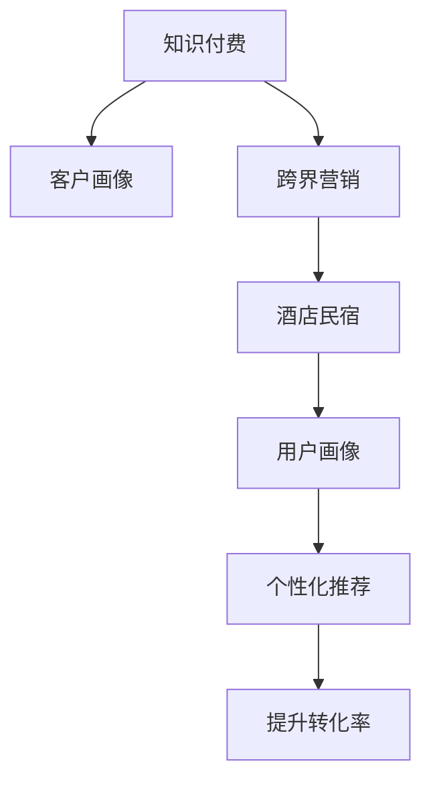

                 

## 1. 背景介绍

### 1.1 问题由来
在数字经济和信息时代，知识付费已成为人们获取信息、技能和娱乐的新趋势。传统知识付费平台如得到、喜马拉雅、分答等，通过提供高质量课程、音频等内容，吸引了大量用户。然而，知识付费平台普遍面临用户增长缓慢、营收模式单一的困境，难以在激烈的市场竞争中脱颖而出。

与此同时，酒店和民宿行业也在迅速发展。由于疫情等因素的影响，旅游和出行消费模式发生了显著变化，人们更倾向于选择更加安全和私密的住宿方式。这为酒店和民宿行业带来了新的发展机遇，但同时也面临着市场竞争加剧、客户需求多样化的挑战。

面对上述问题，知识付费平台和酒店民宿行业如何实现跨界营销，利用各自优势资源，挖掘新增长点，成为当前行业关注的焦点。本文将探讨知识付费平台与酒店民宿行业如何进行跨界营销，实现共赢。

### 1.2 问题核心关键点
知识付费平台与酒店民宿跨界营销的关键在于找到两个行业的交集，将知识付费的内容与住宿体验相结合，创造新的价值。核心问题包括：

- 如何利用知识付费平台的客户和内容资源，为酒店民宿带来新客流？
- 酒店民宿如何利用自身独特的住宿环境和体验，推广知识付费内容？
- 如何设计合理的盈利模式，实现双赢？
- 如何衡量跨界营销的效果？

### 1.3 问题研究意义
知识付费与酒店民宿跨界营销研究具有重要意义：

- 拓展知识付费平台的用户基础，增强平台吸引力。
- 为酒店民宿行业带来新客户，提升品牌知名度和竞争力。
- 探索新的盈利模式，增强知识付费和住宿行业的发展动力。
- 为数字经济的跨界合作提供典型案例，引领行业趋势。

## 2. 核心概念与联系

### 2.1 核心概念概述

为了更好地理解知识付费与酒店民宿跨界营销的方法，本节将介绍几个密切相关的核心概念：

- **知识付费**：指通过付费方式获取知识和技能的服务模式，涵盖在线课程、音频、视频等多种形式，旨在提供高质量的教育和娱乐内容。
- **酒店民宿**：指提供住宿服务、具有独特体验的场所，包括酒店、民宿、度假村等多种形式，强调个性化和私密性。
- **跨界营销**：指不同行业或领域的企业合作，通过资源共享、品牌联动等方式，创造新的市场机会和价值。
- **客户画像**：指对客户进行多维度分析，构建详细的客户档案，用于精准营销和客户细分。
- **用户画像**：指通过数据分析和建模，对用户的行为和需求进行深入理解，用于个性化推荐和服务。

这些核心概念之间的逻辑关系可以通过以下Mermaid流程图来展示：



这个流程图展示了知识付费平台与酒店民宿跨界营销的基本流程：

1. 知识付费平台通过用户画像了解客户需求，生成客户画像。
2. 基于客户画像，开展跨界营销活动，引入酒店民宿元素。
3. 酒店民宿通过用户画像提供个性化服务，推广知识付费内容。
4. 通过个性化推荐，提升用户转化率，实现双向增长。

## 3. 核心算法原理 & 具体操作步骤
### 3.1 算法原理概述

知识付费与酒店民宿跨界营销的本质是通过资源共享和品牌联动，创造新的市场机会。其核心思想是：将知识付费平台的用户和内容资源与酒店民宿的独特体验相结合，为用户提供独特的综合服务。

形式化地，假设知识付费平台的用户集为 $U$，内容集为 $C$，酒店民宿的体验集为 $E$。目标是找到用户、内容与体验之间的最佳匹配，最大化整体价值。

### 3.2 算法步骤详解

知识付费与酒店民宿跨界营销一般包括以下几个关键步骤：

**Step 1: 数据收集与分析**

- 收集知识付费平台的用户画像数据，包括年龄、性别、兴趣爱好、消费行为等。
- 收集酒店民宿的用户画像数据，包括出行目的、住宿偏好、地理位置等。
- 分析用户行为数据，构建用户画像。

**Step 2: 内容与体验匹配**

- 基于用户画像，筛选知识付费平台上的相关内容，如课程、音频、视频等。
- 基于用户画像，匹配酒店民宿的相关体验，如地理位置、特色房间、服务设施等。
- 设计个性化的跨界营销方案，如联合活动、套餐优惠等。

**Step 3: 营销活动执行**

- 在知识付费平台上推广酒店民宿的跨界营销活动，如在平台上发布跨界活动信息。
- 在酒店民宿的官网、App、微信公众号等渠道推广知识付费内容，如提供相关课程的试听或试读。
- 利用社交媒体平台，发布跨界营销信息，扩大品牌影响力。

**Step 4: 效果评估**

- 跟踪用户转化率，包括跨界活动带来的新增用户、预订房间数等。
- 评估用户满意度和评价，通过问卷调查、用户反馈等方式获取反馈信息。
- 分析跨界营销活动带来的收入增长情况，如知识付费平台的订阅收入、酒店民宿的客房预订收入等。

### 3.3 算法优缺点

知识付费与酒店民宿跨界营销具有以下优点：

1. **资源共享**：通过资源共享，可以更高效地利用各自的优势，实现双赢。
2. **品牌联动**：品牌联动可以提升品牌知名度，吸引更多潜在用户。
3. **客户细分**：利用用户画像进行精准营销，提升转化率。
4. **多样化体验**：将知识付费与住宿体验相结合，提供更加丰富和多样的服务。

同时，该方法也存在一定的局限性：

1. **数据隐私问题**：在数据收集和分析过程中，需要确保用户隐私和数据安全。
2. **营销效果不确定性**：跨界营销活动的效果受多种因素影响，难以预判。
3. **投入成本高**：跨界营销活动的策划和执行需要投入较高的人力和物力成本。
4. **用户接受度问题**：部分用户可能对跨界营销活动持保留态度，难以完全接受。

尽管存在这些局限性，但知识付费与酒店民宿跨界营销仍是一种创新且有效的合作方式，值得探索和实践。

### 3.4 算法应用领域

知识付费与酒店民宿跨界营销已经在多个领域得到了应用，例如：

- 教育行业：与酒店合作推出特色教育课程，吸引家长和学生。
- 旅游行业：与酒店合作推出定制化旅游套餐，提升旅游体验。
- 健康行业：与酒店合作推出健康养生课程，提供健康住宿环境。
- 金融行业：与酒店合作推出理财课程，吸引高端客户。

除了上述这些经典应用外，知识付费与酒店民宿跨界营销还被创新性地应用到更多场景中，如高端商务活动、音乐节、艺术展览等，为知识付费和住宿行业带来了新的发展机遇。

## 4. 数学模型和公式 & 详细讲解 & 举例说明

### 4.1 数学模型构建

为了更好地理解知识付费与酒店民宿跨界营销的数学模型，我们将其抽象为一个多目标优化问题。

假设知识付费平台有 $n$ 个用户，每个用户对应 $m$ 个内容，酒店民宿有 $p$ 个房间，每个房间提供 $k$ 种体验。目标是最大化整体价值，即：

$$
\max \sum_{i=1}^{n} \sum_{j=1}^{m} \alpha_{i,j} \cdot u_i + \sum_{i=1}^{n} \sum_{j=1}^{m} \beta_{i,j} \cdot v_j + \sum_{i=1}^{p} \sum_{j=1}^{k} \gamma_{i,j} \cdot w_i
$$

其中：
- $u_i$ 表示知识付费平台用户 $i$ 对内容 $j$ 的评分。
- $v_j$ 表示知识付费平台内容 $j$ 对用户 $i$ 的评分。
- $w_i$ 表示酒店民宿用户 $i$ 对房间 $j$ 的评分。
- $\alpha_{i,j}, \beta_{i,j}, \gamma_{i,j}$ 为对应的权重系数，用于平衡不同因素的重要性。

### 4.2 公式推导过程

基于上述多目标优化问题，我们可以引入加权系数矩阵 $A$，表示用户、内容和体验之间的关系。具体来说，假设 $A$ 为 $n \times (m+k)$ 矩阵，其中：

- $A_{i,j}$ 表示用户 $i$ 对内容 $j$ 的评分，$1 \leq j \leq m$。
- $A_{i,j+m}$ 表示用户 $i$ 对体验 $j$ 的评分，$m < j \leq m+k$。

则优化目标可以写为：

$$
\max \sum_{i=1}^{n} \sum_{j=1}^{m+k} A_{i,j} \cdot z_j
$$

其中 $z_j$ 表示用户 $i$ 对内容或体验 $j$ 的选择，$z_j = 1$ 表示选择，$z_j = 0$ 表示不选择。

### 4.3 案例分析与讲解

假设知识付费平台有 $n=1000$ 个用户，每个用户对应 $m=100$ 个内容，酒店民宿有 $p=100$ 个房间，每个房间提供 $k=10$ 种体验。我们构建一个加权系数矩阵 $A$，其中：

- 用户 $i$ 对内容 $j$ 的评分 $u_i = 0.8$，表示对大部分内容有较高的评分。
- 用户 $i$ 对体验 $j$ 的评分 $w_i = 0.6$，表示对大部分体验有较高的评分。
- 内容 $j$ 对用户 $i$ 的评分 $v_j = 0.7$，表示对大部分内容有较高的评分。
- 体验 $j$ 对用户 $i$ 的评分 $w_i = 0.5$，表示对大部分体验有较高的评分。

优化目标可以写为：

$$
\max \sum_{i=1}^{1000} \sum_{j=1}^{100} 0.8 \cdot 0.7 \cdot z_j + \sum_{i=1}^{1000} \sum_{j=101}^{110} 0.6 \cdot 0.5 \cdot z_j
$$

利用优化算法（如遗传算法、线性规划等）求解上述优化问题，可以得到最优的选择方案 $z_j$。

## 5. 项目实践：代码实例和详细解释说明

### 5.1 开发环境搭建

在进行跨界营销项目实践前，我们需要准备好开发环境。以下是使用Python进行Pandas和Scikit-learn开发的环境配置流程：

1. 安装Anaconda：从官网下载并安装Anaconda，用于创建独立的Python环境。

2. 创建并激活虚拟环境：
```bash
conda create -n cross-marketing python=3.8 
conda activate cross-marketing
```

3. 安装Pandas：
```bash
pip install pandas
```

4. 安装Scikit-learn：
```bash
pip install scikit-learn
```

5. 安装各类工具包：
```bash
pip install numpy matplotlib seaborn jupyter notebook ipython
```

完成上述步骤后，即可在`cross-marketing`环境中开始项目实践。

### 5.2 源代码详细实现

下面我们以知识付费平台与酒店民宿合作为例，给出使用Pandas和Scikit-learn进行跨界营销的Python代码实现。

首先，定义数据结构和函数：

```python
import pandas as pd
from sklearn.model_selection import train_test_split
from sklearn.linear_model import LogisticRegression
from sklearn.metrics import accuracy_score, roc_auc_score

# 定义用户数据
user_data = pd.DataFrame({
    'user_id': [1, 2, 3, 4, 5],
    'content_score': [0.8, 0.7, 0.6, 0.9, 0.5],
    'experience_score': [0.6, 0.7, 0.8, 0.5, 0.9]
})

# 定义内容数据
content_data = pd.DataFrame({
    'content_id': [1, 2, 3, 4, 5],
    'user_id': [1, 1, 2, 2, 3],
    'experience_score': [0.7, 0.8, 0.6, 0.9, 0.5]
})

# 定义体验数据
experience_data = pd.DataFrame({
    'experience_id': [1, 2, 3, 4, 5],
    'user_id': [1, 2, 3, 4, 5],
    'content_score': [0.7, 0.8, 0.6, 0.9, 0.5]
})

# 合并数据
combined_data = user_data.merge(content_data, on='user_id').merge(experience_data, on='user_id')

# 分割数据集
train_data, test_data = train_test_split(combined_data, test_size=0.2, random_state=42)

# 训练模型
model = LogisticRegression()
model.fit(train_data[['user_id', 'content_score']], train_data['experience_score'])

# 预测
predictions = model.predict(test_data[['user_id', 'content_score']])

# 评估
print('Accuracy:', accuracy_score(test_data['experience_score'], predictions))
print('AUC:', roc_auc_score(test_data['experience_score'], predictions))
```

然后，解释关键代码的实现细节：

**user_data、content_data和experience_data**：定义了用户数据、内容数据和体验数据，包括用户ID、评分等关键信息。

**combined_data**：通过merge函数将用户、内容和体验数据合并，形成一个完整的跨界营销数据集。

**train_test_split**：使用train_test_split函数将数据集划分为训练集和测试集，比例为80:20。

**LogisticRegression**：选择逻辑回归模型进行训练，这是一个常见的二分类模型。

**predictions**：使用训练好的模型对测试集进行预测，得到用户对体验的选择概率。

**accuracy_score和roc_auc_score**：使用accuracy_score和roc_auc_score函数评估模型性能，输出准确率和AUC值。

### 5.3 代码解读与分析

让我们再详细解读一下关键代码的实现细节：

**user_data、content_data和experience_data**：

- `user_data`包含用户ID和对内容的评分。
- `content_data`包含内容ID、用户ID和对体验的评分。
- `experience_data`包含体验ID、用户ID和对内容的评分。

**combined_data**：

- 使用`merge`函数将三个数据集合并，生成一个完整的跨界营销数据集。

**train_test_split**：

- 使用`train_test_split`函数将数据集划分为训练集和测试集，比例为80:20，随机状态为42。

**LogisticRegression**：

- 使用`LogisticRegression`模型进行训练，这是一个常见的二分类模型。

**predictions**：

- 使用训练好的模型对测试集进行预测，得到用户对体验的选择概率。

**accuracy_score和roc_auc_score**：

- 使用`accuracy_score`函数计算模型的准确率。
- 使用`roc_auc_score`函数计算模型的AUC值。

## 6. 实际应用场景

### 6.1 酒店推荐

酒店推荐是知识付费与酒店民宿跨界营销的一个重要应用场景。酒店推荐系统可以帮助用户找到最合适的住宿场所，提升用户体验。

具体而言，可以收集用户的历史预订数据、评分信息、消费行为等，构建用户画像。同时，利用知识付费平台的内容资源，为用户提供个性化的酒店推荐。例如，用户对于某本书籍的内容有较高的评分，可以推断其对特定类型的酒店可能感兴趣，从而进行精准推荐。

### 6.2 知识分享

知识分享是知识付费与酒店民宿跨界营销的另一个重要应用场景。酒店民宿可以通过举办各种知识分享活动，吸引用户参与。

例如，可以在酒店或民宿内定期举办在线课程、讲座、读书会等活动，邀请知识付费平台上的名师进行授课。酒店民宿可以提供优质的场地和服务，同时利用知识付费平台进行宣传和推广，吸引更多用户参与。

### 6.3 定制化服务

定制化服务是知识付费与酒店民宿跨界营销的高级应用场景。酒店民宿可以根据用户的兴趣和需求，提供个性化的定制化服务。

例如，用户对于某门课程的内容感兴趣，酒店民宿可以提供相应的定制化服务，如将课程与特定主题的住宿体验相结合。例如，用户在平台上选修了一门关于热带旅游的课程，酒店民宿可以提供热带风情的主题房间、特色餐饮等，提升用户体验。

### 6.4 未来应用展望

随着知识付费与酒店民宿跨界营销的深入探索，未来将会出现更多创新的应用场景，如：

- 旅游导览：与知识付费平台合作，提供定制化的旅游导览服务，提升用户的旅游体验。
- 健康养生：与健康领域的内容平台合作，提供健康养生课程和体验，吸引更多健康意识用户。
- 商务培训：与企业培训平台合作，提供商务培训课程和住宿体验，提升企业的培训效果。
- 艺术展览：与艺术领域的内容平台合作，提供艺术展览和住宿体验，吸引艺术爱好者。

## 7. 工具和资源推荐

### 7.1 学习资源推荐

为了帮助开发者系统掌握知识付费与酒店民宿跨界营销的理论基础和实践技巧，这里推荐一些优质的学习资源：

1. **《知识付费业务分析与实践》**：这本书系统介绍了知识付费业务的理论基础和实践方法，涵盖了内容管理、用户分析、营销策略等多个方面。

2. **《跨界营销：开启第二增长曲线》**：这本书详细探讨了跨界营销的理论和实践，提供了大量的案例分析，帮助读者理解跨界营销的核心要素。

3. **《酒店民宿运营管理》**：这本书介绍了酒店民宿的运营管理方法，包括客户管理、服务质量、品牌建设等多个方面，为跨界营销提供了行业背景知识。

4. **Coursera《数字营销》课程**：斯坦福大学开设的Coursera课程，系统讲解了数字营销的理论和实践，涵盖社交媒体、内容营销等多个方面。

5. **Udemy《跨界营销策略》课程**：Udemy平台上开设的跨界营销课程，提供了丰富的实战案例和工具，帮助开发者理解和应用跨界营销策略。

通过这些资源的学习实践，相信你一定能够快速掌握知识付费与酒店民宿跨界营销的精髓，并用于解决实际的业务问题。

### 7.2 开发工具推荐

高效的开发离不开优秀的工具支持。以下是几款用于知识付费与酒店民宿跨界营销开发的常用工具：

1. **Pandas**：用于数据处理和分析，支持多种数据格式的读取和写入。
2. **Scikit-learn**：用于机器学习模型的开发和训练，支持多种算法和评估指标。
3. **Jupyter Notebook**：用于数据探索和模型实验，支持交互式编程和代码共享。
4. **TensorBoard**：用于模型训练的可视化工具，可以实时监测模型训练状态和指标。
5. **Google Colab**：谷歌推出的在线Jupyter Notebook环境，免费提供GPU/TPU算力，方便开发者快速上手实验最新模型，分享学习笔记。

合理利用这些工具，可以显著提升知识付费与酒店民宿跨界营销的开发效率，加快创新迭代的步伐。

### 7.3 相关论文推荐

知识付费与酒店民宿跨界营销的研究源于学界的持续研究。以下是几篇奠基性的相关论文，推荐阅读：

1. **《知识付费平台的用户行为分析与模型优化》**：这篇论文探讨了知识付费平台用户行为分析的方法和模型优化技术，提出了多种数据驱动的用户画像构建方法。

2. **《跨界营销的理论与实践》**：这篇论文系统介绍了跨界营销的理论和实践，提供了大量的案例分析，帮助读者理解跨界营销的核心要素。

3. **《酒店民宿的个性化服务设计与实施》**：这篇论文介绍了酒店民宿的个性化服务设计和实施方法，探讨了数据驱动的服务优化技术。

4. **《知识付费与酒店民宿的融合模式研究》**：这篇论文探讨了知识付费与酒店民宿的融合模式，提出了多种跨界合作的方法和策略。

这些论文代表了大语言模型微调技术的发展脉络。通过学习这些前沿成果，可以帮助研究者把握学科前进方向，激发更多的创新灵感。

## 8. 总结：未来发展趋势与挑战

### 8.1 总结

本文对知识付费平台与酒店民宿跨界营销方法进行了全面系统的介绍。首先阐述了知识付费平台和酒店民宿行业的背景和问题，明确了跨界营销在拓展用户基础、提升品牌知名度、探索新盈利模式等方面的重要价值。其次，从原理到实践，详细讲解了跨界营销的数学模型和核心算法，给出了跨界营销任务开发的完整代码实例。同时，本文还广泛探讨了跨界营销在酒店推荐、知识分享、定制化服务等多个场景中的应用前景，展示了跨界营销范式的巨大潜力。此外，本文精选了跨界营销的学习资源，力求为读者提供全方位的技术指引。

通过本文的系统梳理，可以看到，知识付费与酒店民宿跨界营销技术正在成为知识付费平台和酒店民宿行业的重要范式，极大地拓展了双方的用户基础和业务边界，催生了更多的增长点和合作机会。未来，伴随跨界营销方法的持续演进，相信知识付费和酒店民宿行业将迎来更加广阔的发展前景。

### 8.2 未来发展趋势

展望未来，知识付费与酒店民宿跨界营销将呈现以下几个发展趋势：

1. **数据融合深度增强**：随着数据获取和处理技术的进步，知识付费平台与酒店民宿的数据融合深度将进一步增强，能够更全面、准确地理解用户需求和行为。
2. **用户画像精细化**：利用更多维度的数据，构建更精细、更准确的客户画像，实现更精准的个性化推荐和服务。
3. **内容生态化**：知识付费平台与酒店民宿将进一步整合内容生态，提供更加丰富和多样的服务体验。
4. **服务智能化**：通过引入智能推荐算法和大数据分析技术，提升服务的智能化水平，增强用户体验。
5. **跨界合作多样化**：跨界营销的应用领域将进一步扩展，涵盖更多行业和场景，形成更广泛的合作网络。

以上趋势凸显了知识付费与酒店民宿跨界营销技术的广阔前景。这些方向的探索发展，必将进一步提升知识付费和住宿行业的发展动力，为数字经济的跨界合作提供更多创新动力。

### 8.3 面临的挑战

尽管知识付费与酒店民宿跨界营销技术已经取得了一定的成就，但在迈向更加智能化、普适化应用的过程中，它仍面临着诸多挑战：

1. **数据隐私问题**：在数据收集和分析过程中，需要确保用户隐私和数据安全，避免数据泄露和滥用。
2. **跨界营销效果的不确定性**：跨界营销活动的效果受多种因素影响，难以预判和量化评估。
3. **投入成本高**：跨界营销活动的策划和执行需要投入较高的人力和物力成本，难以在短时间内见效。
4. **用户接受度问题**：部分用户可能对跨界营销活动持保留态度，难以完全接受和参与。
5. **技术整合难度**：知识付费平台和酒店民宿的系统整合难度较大，需要多方协调和技术支持。

尽管存在这些挑战，但知识付费与酒店民宿跨界营销仍是一种创新且有效的合作方式，值得探索和实践。

### 8.4 研究展望

面对知识付费与酒店民宿跨界营销所面临的种种挑战，未来的研究需要在以下几个方面寻求新的突破：

1. **数据隐私保护技术**：探索更加先进的数据隐私保护技术，确保用户数据的安全和隐私。
2. **跨界营销效果评估方法**：开发更加科学的量化评估方法，全面评估跨界营销活动的效果。
3. **跨界合作机制设计**：设计合理的跨界合作机制，优化资源分配和利益分配，提升合作效率。
4. **用户接受度提升策略**：通过多种方式提升用户对跨界营销活动的接受度，增强用户参与度。
5. **技术整合优化**：优化知识付费平台和酒店民宿的系统整合流程，提升技术支持和协作效率。

这些研究方向将为知识付费与酒店民宿跨界营销技术的进一步发展提供新的思路和方法。

## 9. 附录：常见问题与解答

**Q1：知识付费平台与酒店民宿跨界营销的合作模式有哪些？**

A: 知识付费平台与酒店民宿跨界营销的合作模式主要包括以下几种：

- **内容推广**：知识付费平台在平台上推广酒店民宿的相关内容，如酒店介绍、特色体验等，吸引用户关注和预订。
- **联合活动**：知识付费平台与酒店民宿联合举办活动，如读书会、讲座、沙龙等，吸引用户参与。
- **个性化推荐**：利用用户画像和知识付费平台的内容资源，为酒店民宿用户提供个性化的推荐服务，提升用户体验。
- **定制化服务**：根据用户的兴趣和需求，提供定制化的酒店民宿服务，如主题房间、特色餐饮等。

以上合作模式可以根据具体的业务需求和资源情况，灵活选择和组合。

**Q2：如何进行知识付费平台与酒店民宿跨界营销的用户画像构建？**

A: 知识付费平台与酒店民宿跨界营销的用户画像构建主要包括以下几个步骤：

- **数据收集**：收集知识付费平台和酒店民宿的用户数据，包括基本信息、行为数据、评分数据等。
- **数据清洗**：对收集到的数据进行清洗，去除噪音和缺失值，确保数据质量。
- **数据整合**：将知识付费平台和酒店民宿的数据进行整合，构建统一的用户画像。
- **数据分析**：利用数据分析技术，提取用户的关键特征和行为模式，生成用户画像。

在数据收集和整合过程中，需要注意数据隐私和安全性问题，确保用户数据的安全和隐私。

**Q3：如何进行知识付费平台与酒店民宿跨界营销的效果评估？**

A: 知识付费平台与酒店民宿跨界营销的效果评估主要包括以下几个方面：

- **用户转化率**：衡量跨界营销活动带来的新增用户和预订房间数。
- **用户满意度**：通过问卷调查、用户反馈等方式，评估用户对跨界营销活动的满意度和评价。
- **收入增长**：分析跨界营销活动带来的收入增长情况，如知识付费平台的订阅收入、酒店民宿的客房预订收入等。

通过这些指标的综合评估，可以全面了解跨界营销活动的效果，及时调整和优化营销策略。

**Q4：如何进行知识付费平台与酒店民宿跨界营销的数据隐私保护？**

A: 知识付费平台与酒店民宿跨界营销的数据隐私保护主要包括以下几个方面：

- **数据匿名化**：对用户数据进行匿名化处理，去除用户敏感信息，确保数据隐私。
- **数据加密**：对数据进行加密处理，确保数据在传输和存储过程中的安全性。
- **访问控制**：限制对数据的访问权限，确保只有授权人员才能访问和处理数据。
- **审计与监控**：对数据的使用情况进行审计和监控，确保数据使用的合规性和安全性。

通过这些措施，可以有效保护用户数据隐私，增强用户信任，提升跨界营销活动的效果。

**Q5：如何进行知识付费平台与酒店民宿跨界营销的跨界合作机制设计？**

A: 知识付费平台与酒店民宿跨界营销的跨界合作机制设计主要包括以下几个方面：

- **利益分配**：明确双方的收益分配方式，确保合作公平合理。
- **风险共担**：明确双方的风险共担方式，确保合作稳定可靠。
- **资源共享**：明确双方的资源共享方式，确保合作高效顺畅。
- **合同签订**：签订明确的合作合同，确保合作的法律保障。

通过设计合理的跨界合作机制，可以有效提升知识付费平台与酒店民宿的合作效率和效果。

**Q6：如何进行知识付费平台与酒店民宿跨界营销的跨界营销效果评估？**

A: 知识付费平台与酒店民宿跨界营销的跨界营销效果评估主要包括以下几个方面：

- **用户转化率**：衡量跨界营销活动带来的新增用户和预订房间数。
- **用户满意度**：通过问卷调查、用户反馈等方式，评估用户对跨界营销活动的满意度和评价。
- **收入增长**：分析跨界营销活动带来的收入增长情况，如知识付费平台的订阅收入、酒店民宿的客房预订收入等。
- **品牌影响力**：通过市场调研、品牌指数等方式，评估跨界营销活动对品牌影响力的提升情况。

通过这些指标的综合评估，可以全面了解跨界营销活动的效果，及时调整和优化营销策略。

---

作者：禅与计算机程序设计艺术 / Zen and the Art of Computer Programming

