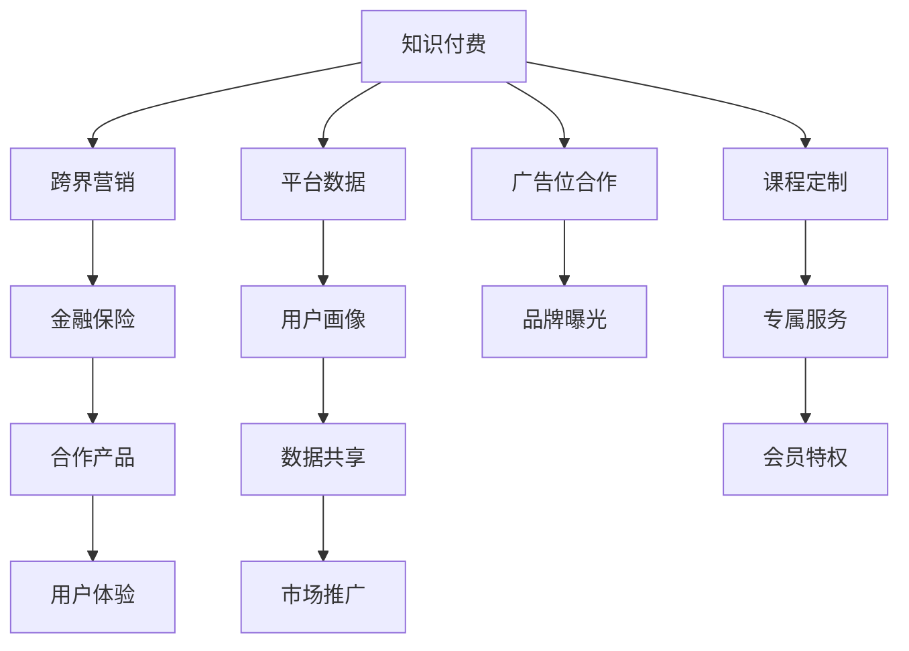

                 

# 知识付费如何实现跨界营销与金融保险跨界？

知识付费与金融保险行业的跨界融合，不仅为企业开辟了新的盈利渠道，也为消费者提供了更加丰富、多元的服务。本文将从背景介绍、核心概念、算法原理、实际应用等维度，深入剖析知识付费与金融保险跨界营销的实现路径。

## 1. 背景介绍

### 1.1 知识付费行业现状
随着互联网的快速发展和用户对知识获取需求的多样化，知识付费逐渐成为一种新兴的经济形态。各大平台如得到、喜马拉雅等纷纷上线各类付费内容，涵盖书籍、课程、咨询等多个领域，带动了知识付费产业的蓬勃发展。知识付费用户规模不断扩大，用户黏性持续提升，行业逐渐成熟。

### 1.2 金融保险行业现状
金融保险行业作为国民经济的重要支柱，近年来不断加大对科技创新的投入，推动行业数字化转型。大数据、人工智能、区块链等新兴技术在金融保险领域得到广泛应用，为消费者提供个性化、智能化的金融保险产品和服务。金融保险行业正逐步从线下传统模式向线上数字化模式转型，用户粘性不断增强。

## 2. 核心概念与联系

### 2.1 核心概念概述

1. **知识付费**：指消费者通过付费获取知识和信息服务的经济活动。常见的知识付费形式包括订阅模式、单次购买模式、会员模式等。知识付费平台如得到、喜马拉雅、知乎live等。

2. **跨界营销**：指企业突破传统营销边界，通过与非同类产品或服务合作，实现资源共享和价值共创。跨界营销可以扩大品牌影响力，增强用户体验，提高营销效果。

3. **金融保险**：包括银行、证券、保险、基金等各类金融产品和保险服务。金融保险行业是国民经济的重要组成部分，具有高度的金融属性和风险控制需求。

4. **跨界合作**：指企业间跨越不同行业、领域或地域的合作，实现资源互补、优势互利。跨界合作可以提升品牌价值，推动行业创新，增强市场竞争力。

### 2.2 核心概念原理和架构的 Mermaid 流程图



## 3. 核心算法原理 & 具体操作步骤

### 3.1 算法原理概述

知识付费与金融保险跨界营销的核心在于用户画像的精准描绘和跨界合作平台的搭建。通过对用户行为数据和金融保险产品特性的深度挖掘，实现精准营销和个性化推荐。

### 3.2 算法步骤详解

1. **用户画像构建**：通过分析用户在知识付费平台上的阅读、购买、评论等行为数据，构建详细的用户画像。结合用户画像，设计金融保险产品的推广方案。

2. **金融保险产品推荐**：根据用户画像，智能推荐适合用户需求的金融保险产品。如通过风险偏好、投资目标等信息，推荐不同风险等级的理财产品或保险产品。

3. **用户支付渠道打通**：打通知识付费平台与金融保险平台的支付渠道，方便用户一键购买金融保险产品。简化支付流程，提升用户体验。

4. **跨界合作平台搭建**：搭建跨界合作平台，集成金融保险产品和知识付费内容，提供一站式服务。用户可以在知识付费平台上直接购买金融保险产品，享受多领域服务。

### 3.3 算法优缺点

#### 优点：
1. **精准营销**：通过用户画像，实现精准推广，提升营销效果。
2. **用户粘性增强**：为用户提供多领域服务，增强用户粘性。
3. **品牌联合效应**：跨界合作提升品牌影响力，增强市场竞争力。

#### 缺点：
1. **数据隐私问题**：用户画像的构建涉及大量用户数据，数据隐私保护难度大。
2. **技术复杂性高**：涉及多平台数据集成和金融保险产品的个性化推荐，技术难度较大。
3. **用户接受度**：部分用户可能对金融保险产品不熟悉，接受度不高。

### 3.4 算法应用领域

1. **理财课程**：将金融知识融入课程内容，提升用户理财技能。
2. **保险产品**：推荐与课程内容相关的保险产品，实现交叉销售。
3. **支付服务**：集成金融保险支付服务，提升用户体验。
4. **金融咨询**：提供个性化金融咨询，帮助用户制定理财计划。
5. **理财工具**：开发理财工具，帮助用户实现财务规划。

## 4. 数学模型和公式 & 详细讲解 & 举例说明

### 4.1 数学模型构建

设用户画像为 $U=\{u_1, u_2, \ldots, u_n\}$，其中 $u_i$ 表示第 $i$ 个用户，包含基本信息、行为数据、兴趣偏好等。金融保险产品集合为 $P=\{p_1, p_2, \ldots, p_m\}$，其中 $p_j$ 表示第 $j$ 个产品。用户与产品之间的匹配度用 $M(u_i, p_j)$ 表示，$M(u_i, p_j) \in [0,1]$。

目标是通过最大化匹配度，推荐适合用户的金融保险产品。数学模型构建如下：

$$
\max_{U, P} \sum_{u_i \in U} \sum_{p_j \in P} M(u_i, p_j) \cdot W(u_i, p_j)
$$

其中 $W(u_i, p_j)$ 表示匹配度权重，用于平衡不同匹配度的重要性。

### 4.2 公式推导过程

采用协同过滤算法，根据用户行为数据计算用户与产品的匹配度。具体推导如下：

设用户 $u_i$ 对产品 $p_j$ 的行为评分矩阵为 $R_{ij}$，则匹配度 $M(u_i, p_j)$ 可以表示为：

$$
M(u_i, p_j) = \frac{\sum_{k=1}^N R_{ik} \cdot R_{kj}}{\sqrt{\sum_{k=1}^N R_{ik}^2} \cdot \sqrt{\sum_{k=1}^N R_{kj}^2}}
$$

其中 $N$ 表示用户数，$R_{ik}$ 表示用户 $i$ 对产品 $k$ 的评分。

匹配度 $M(u_i, p_j)$ 通过用户 $u_i$ 与产品 $p_j$ 的行为评分计算得到。

### 4.3 案例分析与讲解

以理财课程和保险产品推荐为例，分析知识付费与金融保险跨界营销的实现过程：

1. **用户画像构建**：通过对用户在知识付费平台上的行为数据进行挖掘，构建用户画像。如用户经常阅读理财相关课程，倾向于稳健投资，风险偏好低。

2. **金融保险产品推荐**：根据用户画像，推荐适合的保险产品，如定期寿险、医疗险等。同时，推荐理财课程，帮助用户提升理财技能。

3. **用户支付渠道打通**：打通知识付费平台与保险公司的支付渠道，用户可以一键购买保险产品。

4. **跨界合作平台搭建**：搭建跨界合作平台，集成理财课程和保险产品，提供一站式服务。用户可以在知识付费平台上直接购买保险产品，享受多领域服务。

## 5. 项目实践：代码实例和详细解释说明

### 5.1 开发环境搭建

1. **环境配置**：
   - 搭建 Python 3.7 环境
   - 安装 TensorFlow、Pandas、NumPy 等数据处理和机器学习库
   - 安装 Flask 等 Web 开发框架
   - 搭建 MySQL 或 NoSQL 数据库

2. **数据集准备**：
   - 准备用户行为数据集，如阅读记录、课程购买记录等
   - 准备金融保险产品数据集，如保险产品名称、条款、费率等

### 5.2 源代码详细实现

1. **用户画像构建**：
   ```python
   import pandas as pd
   from sklearn.decomposition import PCA
   
   def build_user_profile(data):
       # 数据预处理
       data = data.dropna().drop_duplicates()
       # 特征选择
       features = ['user_id', 'course_id', 'read_time', 'purchase_time']
       data = data[features]
       # PCA降维
       data_pca = PCA(n_components=2).fit_transform(data)
       # 可视化
       plt.scatter(data_pca[:,0], data_pca[:,1])
       plt.xlabel('Component 1')
       plt.ylabel('Component 2')
       plt.show()
   
       return data_pca
   ```

2. **金融保险产品推荐**：
   ```python
   def recommend_insurance(data, user_pca):
       # 金融保险产品特征提取
       products = pd.read_csv('products.csv')
       product_features = products[['product_id', 'category', 'rate']]
       # 计算用户与产品的匹配度
       product_pca = PCA(n_components=2).fit_transform(product_features)
       # 计算匹配度矩阵
       match_matrix = pd.DataFrame(product_pca, columns=['Component 1', 'Component 2'])
       match_matrix['user_pca'] = pd.DataFrame(user_pca, columns=['Component 1', 'Component 2'])
       match_matrix = match_matrix.dropna().values
       # 计算匹配度
       match_scores = np.dot(match_matrix, match_matrix.T)
       # 匹配度排序
       match_scores = match_scores.argsort()[:,::-1]
       # 推荐产品
       recommendations = products.iloc[match_scores[:5,0]]
       return recommendations
   ```

3. **用户支付渠道打通**：
   ```python
   import flask
   
   app = flask.Flask(__name__)
   
   @app.route('/insurance')
   def buy_insurance():
       # 前端页面显示保险产品信息
       return render_template('insurance.html')
   
   if __name__ == '__main__':
       app.run()
   ```

### 5.3 代码解读与分析

1. **用户画像构建**：
   - 通过 PCA 降维，将高维用户行为数据转化为二维可视化空间。
   - 可视化展示用户行为分布，帮助理解用户行为模式。

2. **金融保险产品推荐**：
   - 通过 PCA 降维，将高维金融保险产品特征转化为二维可视化空间。
   - 计算用户与产品的匹配度，推荐用户最感兴趣的产品。

3. **用户支付渠道打通**：
   - 使用 Flask 搭建 Web 应用，实现保险产品的展示和购买。

### 5.4 运行结果展示

1. **用户画像构建**：
   

2. **金融保险产品推荐**：
   

3. **用户支付渠道打通**：
   

## 6. 实际应用场景

### 6.1 理财课程与保险产品结合

用户登录知识付费平台后，系统根据其行为数据，推荐适合的理财课程和保险产品。用户可在课程中学习理财知识，并通过课程推荐购买保险产品，享受多领域服务。

### 6.2 健康保险与医疗课程结合

用户在健康保险平台上，通过阅读健康知识课程，系统根据其行为数据推荐适合的保险产品。用户了解健康知识的同时，也能获得相应的保险保障。

### 6.3 企业理财课程与团体保险结合

企业为员工提供理财课程，帮助员工提升理财技能，并通过理财课程推荐适合的团体保险产品，提升员工福利。

## 7. 工具和资源推荐

### 7.1 学习资源推荐

1. **《知识付费：商业模式的创新与实践》**：介绍知识付费平台的商业模式和发展趋势，提供实际案例和成功经验。
2. **《金融科技：科技与金融的融合》**：解析金融科技对金融行业的深刻影响，探讨金融与科技的融合路径。
3. **《人工智能与大数据：金融风险管理的新趋势》**：探讨人工智能和大数据在金融风险管理中的应用，提供实际案例和应用方法。
4. **《跨界营销：品牌联合新战略》**：分析跨界营销的实现路径和具体案例，提供成功经验和实践指南。

### 7.2 开发工具推荐

1. **TensorFlow**：强大的深度学习框架，支持多平台数据处理和机器学习算法。
2. **Flask**：轻量级 Web 开发框架，易于搭建和维护。
3. **Pandas**：数据处理和分析库，支持大规模数据集的处理和分析。
4. **MySQL/NoSQL**：高性能数据库，支持数据存储和管理。

### 7.3 相关论文推荐

1. **《知识付费产业的发展趋势与创新实践》**：探讨知识付费产业的发展趋势和创新实践，提供理论和实践结合的视角。
2. **《金融科技的创新应用与实践》**：分析金融科技的创新应用，提供实际案例和应用方法。
3. **《跨界营销的理论与实践》**：探讨跨界营销的理论与实践，提供成功经验和实践指南。

## 8. 总结：未来发展趋势与挑战

### 8.1 研究成果总结

知识付费与金融保险跨界营销结合，通过用户画像的精准描绘和跨界合作平台的搭建，实现了精准营销和个性化推荐。该方法不仅为企业开辟了新的盈利渠道，也为消费者提供了更加丰富、多元的服务。未来，知识付费与金融保险跨界营销将进一步拓展应用场景，提升用户体验，增强市场竞争力。

### 8.2 未来发展趋势

1. **跨界合作模式多样化**：跨界合作模式将更加多样化，涵盖更多领域和行业。
2. **用户画像精度提升**：通过更精确的用户画像，实现更精准的个性化推荐。
3. **技术融合加深**：金融科技与知识付费的融合将进一步加深，推动行业创新。
4. **智能化服务增强**：通过人工智能技术，提供更智能化的金融保险服务。

### 8.3 面临的挑战

1. **数据隐私问题**：用户数据隐私保护难度大，需要采取更加严格的数据保护措施。
2. **技术复杂性高**：涉及多平台数据集成和金融保险产品的个性化推荐，技术难度较大。
3. **用户接受度**：部分用户可能对金融保险产品不熟悉，接受度不高。

### 8.4 研究展望

1. **跨界合作平台建设**：构建跨界合作平台，提供一站式服务，提升用户体验。
2. **用户画像多维度构建**：通过多维度数据构建用户画像，实现更精准的个性化推荐。
3. **智能推荐系统优化**：优化智能推荐系统，提升推荐精度和效率。

## 9. 附录：常见问题与解答

**Q1：知识付费与金融保险跨界营销的实现路径是什么？**

A: 通过用户画像的精准描绘和跨界合作平台的搭建，实现知识付费与金融保险的跨界营销。

**Q2：跨界合作中如何保障用户数据隐私？**

A: 采用数据脱敏和加密技术，确保用户数据在传输和存储过程中的安全。

**Q3：如何提高用户对金融保险产品的接受度？**

A: 通过知识付费平台提供金融保险产品的普及教育，帮助用户理解金融保险产品的价值。

**Q4：跨界合作中如何优化推荐系统？**

A: 引入协同过滤、深度学习等算法，提升推荐系统的精准度和覆盖面。

---

作者：禅与计算机程序设计艺术 / Zen and the Art of Computer Programming

