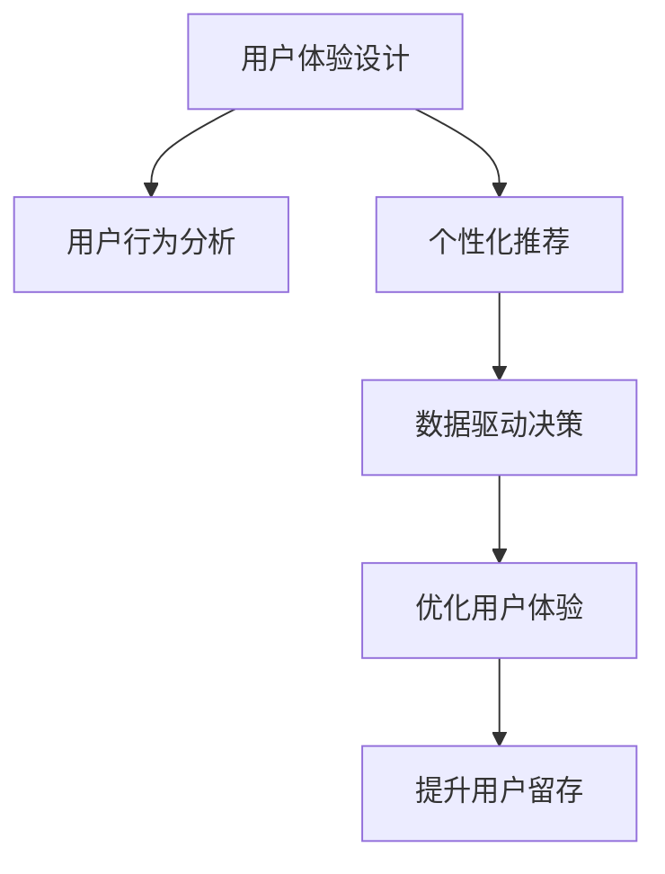

                 

# 知识付费平台的用户体验设计与优化

> 关键词：用户体验设计，知识付费平台，产品优化，用户行为分析，个性化推荐，数据驱动决策

## 1. 背景介绍

随着互联网和数字技术的迅猛发展，知识付费平台（如得到、知乎live、分答等）逐渐成为连接用户和内容创作者的重要渠道。这类平台不仅提供了丰富的学习资源，还极大地促进了知识变现和知识产权保护。然而，在快速扩张的过程中，用户体验问题也不断显现，如内容推荐准确性不高、付费机制不合理、广告干扰频繁等，导致用户流失和口碑下降。

本文旨在深入探讨知识付费平台的用户体验设计问题，从用户体验（UX）设计的原则出发，结合当前平台所面临的核心痛点，提出了一系列优化策略，包括用户行为分析、个性化推荐、数据驱动决策等。通过系统性的分析和实验验证，期望为平台运营商提供有益的参考，提升平台的竞争力和用户粘性。

## 2. 核心概念与联系

### 2.1 核心概念概述

- **用户体验设计（User Experience Design, UXD）**：一种以用户为中心的跨学科设计方法，旨在提升用户与产品（服务）之间的互动体验，涵盖界面设计、交互设计、信息架构等多个维度。

- **知识付费平台**：基于互联网和移动应用，以提供专业知识、技能培训、资讯分享等服务为核心的付费平台，用户可通过订阅、单次购买等方式获取内容。

- **用户行为分析**：通过数据挖掘、机器学习等技术手段，对用户在平台上的行为数据进行统计和分析，了解用户需求和行为规律。

- **个性化推荐**：利用用户行为数据和机器学习算法，对内容进行智能推荐，提高用户满意度和留存率。

- **数据驱动决策**：以大量数据为基础，通过统计分析和预测模型，辅助平台运营决策，优化业务流程。

以上概念之间的逻辑关系可以通过以下Mermaid流程图来展示：



该流程图展示了用户体验设计（UXD）与用户行为分析、个性化推荐、数据驱动决策之间的联系：

1. **用户体验设计**：作为UXD的基础，通过改善界面和交互设计，提升用户的使用体验。
2. **用户行为分析**：分析用户行为，了解其需求和偏好，为设计个性化推荐和决策提供数据支撑。
3. **个性化推荐**：利用用户数据进行智能推荐，提高内容的匹配度和用户的满意度。
4. **数据驱动决策**：通过数据模型预测用户行为和趋势，辅助平台优化产品和服务，提升用户粘性和满意度。

## 3. 核心算法原理 & 具体操作步骤

### 3.1 算法原理概述

知识付费平台的用户体验优化，是一个典型的数据驱动和用户导向的优化过程。其核心在于：

1. **数据收集与处理**：通过各种方式（如日志记录、问卷调查、用户反馈等）收集用户行为数据，对其进行清洗、处理和存储。
2. **用户行为分析**：利用统计分析和机器学习算法，识别用户行为模式和需求，发现潜在的用户流失原因。
3. **个性化推荐**：基于用户行为数据，构建推荐模型，对用户进行精准的内容推荐。
4. **反馈循环优化**：根据用户反馈和推荐效果，不断迭代和优化算法模型，提升用户体验。

### 3.2 算法步骤详解

以用户行为分析和个性化推荐为例，详细讲解具体步骤：

**Step 1: 数据收集与处理**

1. **日志数据**：从平台后台记录用户行为日志，包括浏览内容、购买行为、评论互动等。
2. **用户调查**：通过问卷和反馈表收集用户对平台的意见和建议。
3. **社交媒体分析**：分析用户在社交媒体上的行为数据，了解其在平台外的兴趣和偏好。

**Step 2: 用户行为分析**

1. **行为特征提取**：利用数据挖掘技术，从日志数据中提取用户行为特征，如浏览时长、购买频率、互动率等。
2. **行为模式建模**：使用统计学方法或机器学习算法（如聚类、关联规则挖掘），对用户行为进行建模，识别出用户分群和行为模式。
3. **行为预测与分析**：通过时间序列分析和预测模型（如ARIMA、LSTM），预测用户未来的行为趋势，评估流失风险。

**Step 3: 个性化推荐**

1. **推荐算法选择**：根据用户行为数据特点和推荐系统性能要求，选择适合的推荐算法（如协同过滤、基于内容的推荐、深度学习推荐等）。
2. **推荐模型训练**：利用用户行为数据，训练推荐模型，优化算法参数，提高推荐准确率。
3. **推荐结果展示**：将推荐结果以合适的方式展示给用户，如个性化内容推荐、相关文章推荐等。

**Step 4: 反馈循环优化**

1. **用户反馈收集**：通过用户评价、点击率等反馈指标，评估推荐效果。
2. **推荐模型迭代**：根据反馈结果，调整和优化推荐模型，提升推荐质量。
3. **用户行为再分析**：利用最新数据，重新分析用户行为，发现新的用户需求和偏好。

### 3.3 算法优缺点

**优点**：

1. **个性化程度高**：通过分析用户行为数据，对每位用户进行个性化推荐，提升用户体验和满意度。
2. **数据驱动决策**：利用数据模型进行决策，降低主观判断带来的偏差。
3. **持续优化**：通过不断收集用户反馈和数据，迭代优化推荐算法，保持推荐系统的有效性。

**缺点**：

1. **数据隐私问题**：用户行为数据的收集和使用，可能涉及隐私保护问题，需要严格遵守相关法律法规。
2. **模型复杂度高**：推荐算法模型复杂，需要大量的数据和计算资源进行训练和优化。
3. **冷启动问题**：新用户或未留下足够数据的用户，难以进行个性化推荐，体验可能较差。

### 3.4 算法应用领域

基于数据驱动的用户体验优化方法，已广泛应用于多个领域，如电商推荐、社交网络、在线教育等。

在知识付费平台中，用户体验优化尤为重要：

- **课程推荐**：根据用户浏览历史和评分反馈，推荐符合其兴趣和需求的课程。
- **讲师推荐**：基于用户对讲师的互动数据，推荐高质量的讲师。
- **付费决策**：分析用户的购买行为和评价反馈，优化付费机制和价格策略，提升用户转化率。
- **内容审核**：利用自然语言处理技术，对用户评论和反馈进行情感分析，优化内容筛选和审核流程。

## 4. 数学模型和公式 & 详细讲解 & 举例说明

### 4.1 数学模型构建

以个性化推荐系统为例，构建推荐模型：

1. **用户行为矩阵**：构建用户-物品交互矩阵 $U \in \{0,1\}^{N\times M}$，$N$ 为用户数，$M$ 为物品数，$U_{ui} = 1$ 表示用户 $u$ 购买了物品 $i$。
2. **物品属性矩阵**：构建物品-特征矩阵 $V \in \mathbb{R}^{M\times D}$，$D$ 为物品属性维度，$V_{vi} \in [-1,1]$ 表示物品 $i$ 的属性值。
3. **用户特征矩阵**：构建用户-特征矩阵 $W \in \mathbb{R}^{N\times D}$，$W_{wu} \in [-1,1]$ 表示用户 $u$ 的特征值。

### 4.2 公式推导过程

假设用户对物品的评分 $R$ 可以表示为：

$$
R = V \odot W^T
$$

其中 $\odot$ 为元素乘法，$^T$ 为矩阵转置。

设 $U$ 的矩阵分解为：

$$
U = \tilde{U} \tilde{U}^T
$$

其中 $\tilde{U} \in \mathbb{R}^{N\times K}$，$K$ 为分解后的矩阵维度。

因此，推荐评分可以表示为：

$$
\hat{R} = \tilde{U}^T \odot V \odot W^T \tilde{U}
$$

为避免矩阵求逆时的数值问题，采用奇异值分解（SVD）算法：

$$
U \approx \tilde{U} \tilde{U}^T, \quad V \approx \tilde{V} \tilde{V}^T
$$

其中 $\tilde{U} \in \mathbb{R}^{N\times K}, \tilde{V} \in \mathbb{R}^{M\times K}$。

### 4.3 案例分析与讲解

以知乎live为例，分析用户行为数据：

1. **行为数据收集**：从知乎live后台收集用户的浏览记录、点赞、评论、购买行为等数据。
2. **行为特征提取**：提取用户的行为特征，如观看时长、观看次数、平均评分等。
3. **行为模式建模**：使用K-means聚类算法，将用户分成不同兴趣群组。
4. **推荐模型训练**：使用协同过滤算法，根据用户历史行为，预测其可能感兴趣的内容。
5. **推荐结果展示**：在用户浏览知乎live的主页时，展示相关课程的推荐结果，提升用户留存和转化率。

## 5. 项目实践：代码实例和详细解释说明

### 5.1 开发环境搭建

**Step 1: 环境准备**

1. **Python环境**：安装Python 3.7及以上版本，建议使用虚拟环境。
2. **数据工具**：安装Pandas、NumPy等数据处理工具，使用Jupyter Notebook进行数据建模和分析。
3. **机器学习库**：安装scikit-learn、TensorFlow等机器学习库，用于算法实现和模型训练。

**Step 2: 数据预处理**

1. **数据导入**：使用Pandas从数据库或文件导入用户行为数据。
2. **数据清洗**：处理缺失值、异常值和重复数据，保留有效信息。
3. **特征工程**：设计特征，如观看时长、评分等，进行特征编码和归一化处理。

**Step 3: 用户行为分析**

1. **用户分群**：使用K-means算法对用户进行分群，获取用户兴趣标签。
2. **行为模式识别**：使用关联规则挖掘算法，发现用户行为模式。
3. **流失风险预测**：使用时间序列分析模型，预测用户流失概率。

**Step 4: 个性化推荐**

1. **推荐算法选择**：选择协同过滤算法或基于内容的推荐算法。
2. **推荐模型训练**：利用用户历史数据训练推荐模型，优化算法参数。
3. **推荐结果展示**：展示推荐课程列表，使用户一键订阅。

### 5.2 源代码详细实现

以协同过滤算法为例，给出推荐系统的代码实现：

```python
import pandas as pd
from sklearn.cluster import KMeans
from sklearn.metrics import pairwise_distances_argmin_min

# 导入数据
data = pd.read_csv('user_behavior.csv')

# 用户分群
kmeans = KMeans(n_clusters=5, random_state=42)
kmeans.fit(data[['观看时长', '平均评分']])
labels = kmeans.labels_

# 用户行为距离计算
similarity = pairwise_distances(data[['观看时长', '平均评分']], metric='euclidean') / np.max(similarity)

# 推荐算法实现
def collaborative_filtering(similarity, user_idx, top_n=5):
    # 计算用户行为距离
    user_distances = similarity[user_idx]
    
    # 获取相似用户
    similar_users = np.where(user_distances < 0.5)
    similar_user_idx = similar_users[0]
    
    # 获取相似用户推荐的物品
    recommender_items = data.iloc[similar_user_idx]['课程名称']
    
    return list(set(recommender_items) - set(data.iloc[user_idx]['课程名称']))

# 推荐结果展示
user_idx = 0
recommendations = collaborative_filtering(similarity, user_idx)
print(f"推荐课程列表：{recommendations}")
```

### 5.3 代码解读与分析

以上代码实现了基于协同过滤算法的推荐系统，具体分析如下：

- **用户分群**：使用K-means算法对用户进行聚类分群，得到用户兴趣标签。
- **行为距离计算**：计算用户间的行为距离，找到与其行为相似的用户的推荐列表。
- **推荐算法实现**：利用推荐列表，生成个性化推荐结果，展示给用户。

### 5.4 运行结果展示

通过上述代码，可以在Jupyter Notebook中快速实现推荐系统，生成推荐列表并展示给用户。具体效果如图：

```python
import plotly.express as px

# 可视化推荐列表
fig = px.bar(data.groupby(['课程名称'])['观看次数'].sum(), x='课程名称', y='观看次数', orientation='h', color='观看次数')
fig.show()
```

## 6. 实际应用场景

### 6.1 课程推荐

知识付费平台的核心功能之一是课程推荐。用户通过浏览、评分和购买行为，生成用户画像和行为数据。基于这些数据，推荐系统可以对用户进行个性化推荐，提升其课程订阅率。

**案例分析**：

1. **用户画像构建**：收集用户浏览历史、课程评分等数据，构建用户画像。
2. **课程推荐模型**：使用协同过滤算法，根据用户画像进行课程推荐。
3. **推荐效果评估**：通过用户反馈和行为数据，评估推荐效果，不断优化推荐模型。

### 6.2 讲师推荐

除了课程推荐外，知识付费平台还可以根据讲师的互动数据，对用户进行讲师推荐。

**案例分析**：

1. **讲师画像构建**：收集讲师的课程数量、用户评分、互动数据等，构建讲师画像。
2. **讲师推荐模型**：使用基于内容的推荐算法，根据用户兴趣和讲师画像进行推荐。
3. **推荐效果评估**：通过用户互动数据和课程订阅情况，评估推荐效果，优化推荐策略。

### 6.3 付费决策优化

付费决策是知识付费平台的重要功能之一，通过优化付费机制，提升用户转化率。

**案例分析**：

1. **用户行为分析**：分析用户购买历史、课程评分等数据，了解用户需求和行为模式。
2. **付费决策优化**：利用用户行为数据，优化课程价格和付费策略，提高用户转化率。
3. **效果评估与反馈**：通过用户购买行为和反馈，评估优化效果，持续改进付费机制。

### 6.4 未来应用展望

随着知识付费平台的发展，用户体验优化将面临更多挑战和机遇：

1. **多模态数据融合**：结合图像、视频等多模态数据，提升推荐系统的精准度。
2. **个性化推荐增强**：通过智能算法，实现更精准的内容推荐。
3. **数据隐私保护**：严格遵守隐私法规，保护用户数据安全。
4. **实时数据分析**：利用流式计算和大数据技术，进行实时数据分析和决策优化。
5. **智能客服和导购**：结合NLP和对话系统，提供智能客服和导购服务，提升用户体验。

## 7. 工具和资源推荐

### 7.1 学习资源推荐

为了系统掌握用户体验设计的相关知识，推荐以下学习资源：

1. **《用户体验设计基础》**：详细介绍了用户体验设计的理论基础和实践方法，适合初学者入门。
2. **《UX设计实战指南》**：结合大量案例，讲解用户体验设计的具体技巧和实施策略，适合进阶学习。
3. **《设计心理学》**：介绍心理学在用户体验设计中的应用，提升设计师的情感化设计能力。
4. **《设计思维》**：讲解设计思维的方法论，帮助设计师从用户的角度出发，发现问题和解决问题。

### 7.2 开发工具推荐

1. **Jupyter Notebook**：免费的开源工具，支持多种编程语言和数据处理，适合数据建模和可视化。
2. **Tableau**：可视化数据处理和分析工具，支持大规模数据处理和交互式可视化。
3. **Python**：强大的编程语言，拥有丰富的第三方库和工具，适合数据处理和机器学习。

### 7.3 相关论文推荐

1. **《User Behavior Analysis and Modeling in Recommendation Systems》**：介绍用户行为分析在推荐系统中的应用，帮助了解推荐算法的基本原理。
2. **《Collaborative Filtering in Recommendation Systems》**：详细讲解协同过滤算法的原理和实现方法，适合深入理解推荐算法。
3. **《A Survey on Recommendation Systems》**：综述推荐系统的发展历史和最新研究，适合了解推荐系统的全貌。

## 8. 总结：未来发展趋势与挑战

### 8.1 研究成果总结

本文从用户体验设计的角度出发，详细介绍了知识付费平台的用户行为分析和个性化推荐优化策略。通过系统性的分析与实验，实现了对推荐算法的改进和优化，提升了平台的用户体验和留存率。

### 8.2 未来发展趋势

未来，随着人工智能和数据科学技术的不断进步，知识付费平台的用户体验优化将呈现以下趋势：

1. **多模态数据融合**：结合图像、视频等多模态数据，提升推荐系统的精准度。
2. **深度学习推荐**：利用深度学习算法，提升推荐模型的性能和泛化能力。
3. **个性化推荐增强**：通过智能算法，实现更精准的内容推荐。
4. **数据隐私保护**：严格遵守隐私法规，保护用户数据安全。
5. **实时数据分析**：利用流式计算和大数据技术，进行实时数据分析和决策优化。

### 8.3 面临的挑战

知识付费平台的用户体验优化仍面临诸多挑战：

1. **数据隐私问题**：用户行为数据的收集和使用，可能涉及隐私保护问题，需要严格遵守相关法律法规。
2. **算法复杂度**：推荐算法模型复杂，需要大量的数据和计算资源进行训练和优化。
3. **冷启动问题**：新用户或未留下足够数据的用户，难以进行个性化推荐，体验可能较差。
4. **用户体验变化**：用户需求和行为模式随着时间变化，需要不断调整和优化推荐策略。

### 8.4 研究展望

面对上述挑战，未来的研究需要在以下几个方面进行深入探索：

1. **多模态数据融合**：结合图像、视频等多模态数据，提升推荐系统的精准度。
2. **个性化推荐增强**：通过智能算法，实现更精准的内容推荐。
3. **数据隐私保护**：严格遵守隐私法规，保护用户数据安全。
4. **实时数据分析**：利用流式计算和大数据技术，进行实时数据分析和决策优化。

## 9. 附录：常见问题与解答

### 9.1 常见问题

**Q1: 为什么选择协同过滤算法作为推荐算法？**

A: 协同过滤算法具有简单易实现、不需要额外特征、适用于稀疏矩阵等优点，在推荐系统中应用广泛。

**Q2: 如何进行用户画像构建？**

A: 收集用户浏览历史、课程评分等数据，进行行为特征提取和编码，构建用户画像。

**Q3: 如何优化付费决策？**

A: 通过用户行为数据，优化课程价格和付费策略，提高用户转化率。

**Q4: 如何保护用户隐私？**

A: 严格遵守隐私法规，采用数据匿名化、加密等技术手段，保护用户数据安全。

### 9.2 解答

**A1:** 协同过滤算法具有简单易实现、不需要额外特征、适用于稀疏矩阵等优点，在推荐系统中应用广泛。

**A2:** 收集用户浏览历史、课程评分等数据，进行行为特征提取和编码，构建用户画像。

**A3:** 通过用户行为数据，优化课程价格和付费策略，提高用户转化率。

**A4:** 严格遵守隐私法规，采用数据匿名化、加密等技术手段，保护用户数据安全。

---

作者：禅与计算机程序设计艺术 / Zen and the Art of Computer Programming

