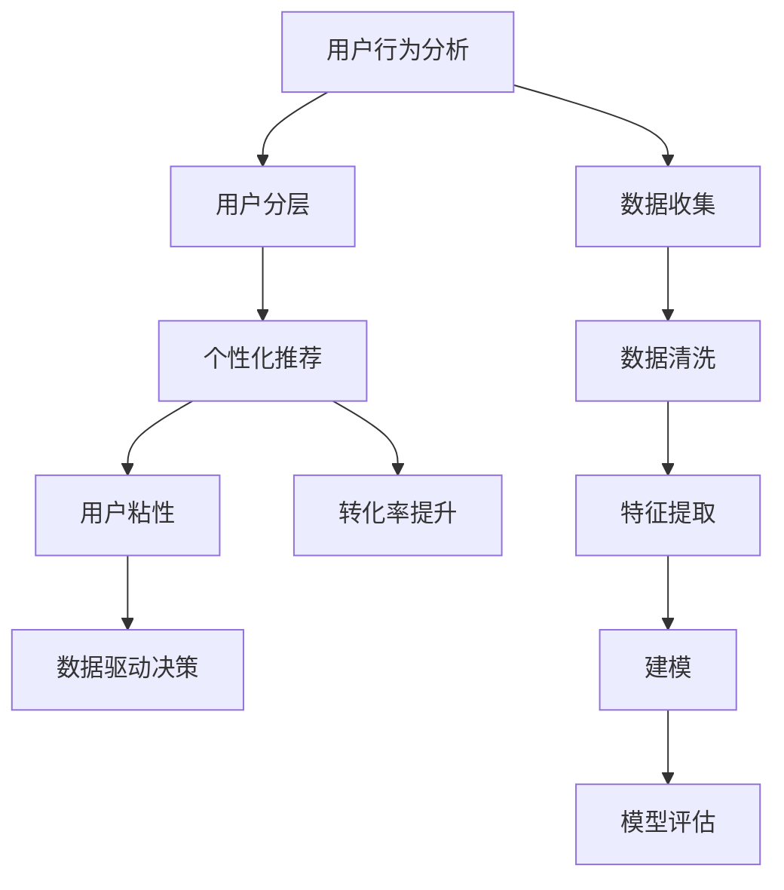

                 

# 知识付费平台的用户分层策略

> 关键词：用户分层,知识付费,用户行为分析,个性化推荐,用户粘性,转化率提升

## 1. 背景介绍

在知识付费领域，用户分层策略的制定和执行是提升平台价值和用户体验的关键。用户分层旨在根据用户的特定行为和属性，将其划分为不同层次，以便为不同层次用户提供量身定制的服务，从而提高用户粘性、提升转化率，实现平台的商业价值最大化。

### 1.1 问题由来

知识付费平台如Coursera、Udemy、得到等，面临着用户多样性大、需求复杂、留存困难等挑战。传统的“一刀切”式服务方式难以满足用户多样化、个性化的需求，导致用户流失率高，平台难以实现可持续发展。因此，用户分层成为提升平台竞争力的重要手段。

### 1.2 问题核心关键点

用户分层的核心关键点在于：
1. **数据收集与分析**：收集用户行为数据，如浏览历史、购买记录、学习进度等，分析用户属性和行为模式，为分层提供依据。
2. **分层模型构建**：基于聚类、分类等算法，将用户划分为不同层次，每个层次具有特定的特征和需求。
3. **策略定制与执行**：为不同层次用户设计专属的内容推荐、优惠券发放、学习路径规划等服务，提升用户满意度和粘性。
4. **效果评估与迭代**：对用户分层策略进行持续评估，收集反馈，优化分层模型和服务，实现用户价值最大化。

### 1.3 问题研究意义

用户分层策略的研究意义主要体现在以下几个方面：
- 提升用户粘性和留存率：通过个性化服务，满足用户需求，增加用户平台粘性。
- 提高转化率和收入：针对不同层次用户设计精准营销策略，提升转化率，实现收入增长。
- 优化用户体验：个性化推荐、学习路径规划等策略，提升用户学习效率和满意度。
- 数据驱动决策：用户分层策略的实施，帮助平台掌握用户需求和行为，为后续决策提供依据。

## 2. 核心概念与联系

### 2.1 核心概念概述

为更好地理解知识付费平台的用户分层策略，本节将介绍几个关键概念：

- **用户行为分析**：通过对用户行为数据的收集和分析，识别用户需求和偏好，为分层提供依据。
- **用户分层**：根据用户属性和行为特征，将用户划分为不同层次，每个层次具有特定的需求和行为模式。
- **个性化推荐**：根据用户层次和需求，设计专属的推荐算法，提升用户满意度。
- **用户粘性**：通过满足用户个性化需求，增加用户对平台的依赖性，提升用户留存率。
- **转化率提升**：通过精准的营销策略和个性化服务，提升用户购买和付费转化率，实现收入增长。
- **数据驱动决策**：依赖数据分析技术，实现用户行为的动态监测和调整，优化平台运营策略。

这些核心概念之间的逻辑关系可以通过以下Mermaid流程图来展示：



这个流程图展示了一系列关键操作：从数据收集到建模评估，最终实现数据驱动的用户分层和个性化策略。

## 3. 核心算法原理 & 具体操作步骤
### 3.1 算法原理概述

知识付费平台的用户分层策略，本质上是一个基于数据驱动的用户画像构建和分类过程。其核心思想是：通过对用户行为数据的分析，构建用户画像，识别不同用户群体的特征，然后根据这些特征将用户进行分层。

具体来说，用户分层策略包括以下步骤：

1. **数据收集与预处理**：收集用户行为数据，包括浏览历史、购买记录、学习进度、评价反馈等，并进行清洗和特征提取。
2. **用户画像构建**：利用聚类、分类等算法，对用户行为数据进行分析，构建用户画像。
3. **分层模型构建**：基于用户画像，使用机器学习模型对用户进行层次划分。
4. **策略定制与执行**：根据用户层次，设计专属的个性化推荐、优惠券、学习路径等策略，提升用户体验。
5. **效果评估与迭代**：对分层策略进行持续评估，收集用户反馈，优化分层模型和策略，实现用户价值的最大化。

### 3.2 算法步骤详解

以Coursera平台为例，介绍用户分层策略的详细操作步骤：

**Step 1: 数据收集与预处理**

- **数据来源**：包括平台内部数据（如浏览历史、购买记录、学习进度、评价反馈等）和第三方数据（如社交媒体、用户评论等）。
- **数据清洗**：去除重复、错误、异常数据，确保数据质量。
- **特征提取**：从行为数据中提取有意义的特征，如课程浏览时间、购买频率、评价情绪等。

**Step 2: 用户画像构建**

- **聚类算法**：使用K-Means、层次聚类等算法，对用户行为数据进行聚类，构建用户画像。
- **特征选取**：选择具有代表性的特征，构建综合用户画像。
- **数据可视化**：使用可视化工具（如Tableau、Power BI）展示用户画像，帮助理解用户行为和需求。

**Step 3: 分层模型构建**

- **分类算法**：使用决策树、随机森林、支持向量机等算法，对用户进行层次划分。
- **模型评估**：使用准确率、召回率、F1-score等指标评估模型效果。
- **交叉验证**：采用交叉验证等方法，避免模型过拟合，确保模型泛化能力。

**Step 4: 策略定制与执行**

- **个性化推荐**：根据用户层次和需求，设计专属的推荐算法，如协同过滤、基于内容的推荐等。
- **优惠券发放**：针对不同层次用户设计专属优惠券，提升转化率。
- **学习路径规划**：根据用户层次和学习目标，设计个性化的学习路径，提升学习效果。

**Step 5: 效果评估与迭代**

- **效果监测**：使用A/B测试等方法，评估分层策略的效果。
- **用户反馈收集**：通过调查问卷、用户评论等方式，收集用户反馈。
- **迭代优化**：根据用户反馈和效果评估结果，优化分层模型和策略。

### 3.3 算法优缺点

用户分层策略的优势在于：
- **提升用户体验**：根据用户层次和需求，提供个性化服务，提升用户满意度。
- **提高转化率**：精准的营销策略和个性化推荐，提升用户购买和付费转化率。
- **优化资源利用**：不同层次的用户提供不同的服务，优化平台资源利用效率。

但该策略也存在一定的局限性：
- **数据依赖**：依赖高质量、全面完整的数据，数据收集和处理成本高。
- **模型复杂度**：分层模型复杂，需要较长的训练时间和计算资源。
- **策略调整难度**：用户需求和行为变化快，需要持续监测和调整策略。
- **隐私风险**：收集和分析用户数据，可能涉及用户隐私问题，需要严格遵守法律法规。

### 3.4 算法应用领域

用户分层策略在知识付费平台中的应用非常广泛，涵盖了以下几个主要领域：

- **个性化推荐**：根据用户层次和需求，设计专属的推荐算法，提升用户满意度。
- **用户行为分析**：分析用户行为数据，识别用户需求和偏好，为分层提供依据。
- **转化率提升**：针对不同层次用户设计精准营销策略，提升转化率。
- **用户粘性提升**：通过满足用户个性化需求，增加用户对平台的依赖性，提升用户留存率。
- **课程内容优化**：根据用户层次和需求，优化课程内容和教学方法，提升学习效果。

这些领域的应用展示了用户分层策略的广泛影响力和实用价值。

## 4. 数学模型和公式 & 详细讲解
### 4.1 数学模型构建

用户分层的数学模型构建主要包括以下几个步骤：

1. **数据预处理**：将原始数据转换为机器学习算法可以处理的格式，包括归一化、编码等操作。
2. **特征选取**：从原始数据中提取有意义的特征，用于构建用户画像。
3. **用户聚类**：使用聚类算法，将用户分为不同层次。
4. **用户分类**：使用分类算法，对用户进行层次划分。
5. **模型评估**：使用评估指标，如准确率、召回率、F1-score等，评估分层模型效果。

### 4.2 公式推导过程

以K-Means聚类算法为例，展示用户聚类过程的数学模型：

假设用户数据集为 $D=\{(x_i)\}_{i=1}^N$，每个用户特征向量 $x_i=(x_{i1},x_{i2},...,x_{in})$，其中 $n$ 为特征数。聚类算法将用户数据分为 $k$ 个簇，每个簇 $C_j=\{(x_i)\}_{i=1}^n$，其中 $j=1,2,...,k$。

聚类目标函数为：

$$
J = \frac{1}{2}\sum_{i=1}^N\sum_{j=1}^k||x_i-C_j||^2
$$

其中 $||\cdot||$ 表示欧几里得距离。聚类目标函数最小化用户与所在簇中心的距离平方和。

优化目标为：

$$
\min_J \sum_{i=1}^N\min_{j=1}^k ||x_i-C_j||^2
$$

通过K-Means算法，可逐步更新每个用户的簇分配，直到目标函数收敛。

### 4.3 案例分析与讲解

以Coursera平台为例，展示用户分层的实际应用：

**案例背景**：Coursera平台上有数百万用户，每个用户有数百门课程的浏览和购买记录。平台希望通过用户分层，提升用户体验和转化率。

**数据收集与预处理**：平台收集了用户的历史浏览数据、课程评价数据、购买记录等，并进行清洗和特征提取。

**用户聚类**：使用K-Means算法，将用户分为五大类。根据聚类结果，发现不同类别的用户具有不同的学习偏好和课程需求。

**用户分类**：使用随机森林算法，对用户进行层次划分。结果显示，高层次用户更倾向于购买专业课程，低层次用户更倾向于免费课程。

**策略定制与执行**：针对高层次用户，平台推荐专业课程和高级认证，提供专属优惠券。针对低层次用户，平台推荐入门课程和免费学习资源，提高学习体验。

**效果评估与迭代**：通过A/B测试，评估分层策略的效果。结果显示，个性化推荐和专属优惠券显著提升了用户转化率和满意度。

## 5. 项目实践：代码实例和详细解释说明
### 5.1 开发环境搭建

在进行用户分层策略实践前，我们需要准备好开发环境。以下是使用Python进行Scikit-Learn开发的环境配置流程：

1. 安装Anaconda：从官网下载并安装Anaconda，用于创建独立的Python环境。

2. 创建并激活虚拟环境：
```bash
conda create -n user-classification python=3.8 
conda activate user-classification
```

3. 安装Scikit-Learn：
```bash
conda install scikit-learn
```

4. 安装各类工具包：
```bash
pip install numpy pandas scipy matplotlib seaborn jupyter notebook ipython
```

完成上述步骤后，即可在`user-classification`环境中开始用户分层策略的开发。

### 5.2 源代码详细实现

下面我们以Coursera平台的用户分层策略为例，给出Scikit-Learn代码实现。

首先，定义数据处理函数：

```python
import pandas as pd
from sklearn.preprocessing import StandardScaler, OneHotEncoder
from sklearn.decomposition import PCA
from sklearn.feature_extraction.text import TfidfVectorizer

def preprocess_data(df):
    # 数据清洗
    df = df.dropna()
    
    # 标准化处理
    scaler = StandardScaler()
    df[['purchase_amount', 'enrollment_time']] = scaler.fit_transform(df[['purchase_amount', 'enrollment_time']])
    
    # 特征提取
    tfidf = TfidfVectorizer()
    df['course_title'] = tfidf.fit_transform(df['course_title']).toarray()
    
    # 热编码处理
    encoder = OneHotEncoder()
    df = pd.concat([df, pd.DataFrame(encoder.fit_transform(df[['user_agent', 'device_type']]), columns=encoder.get_feature_names(['user_agent', 'device_type'])], axis=1)
    
    return df
```

然后，定义用户分层模型：

```python
from sklearn.cluster import KMeans
from sklearn.ensemble import RandomForestClassifier
from sklearn.metrics import accuracy_score, recall_score, f1_score

def cluster_users(df, k=5):
    # 数据预处理
    df = preprocess_data(df)
    
    # 特征选择
    X = df[['purchase_amount', 'enrollment_time', 'course_title']].values
    y = df['course_completed'].value_counts().index
    
    # 聚类
    kmeans = KMeans(n_clusters=k)
    kmeans.fit(X)
    df['cluster_id'] = kmeans.labels_
    
    # 分类
    rfc = RandomForestClassifier(n_estimators=100, random_state=42)
    rfc.fit(X, y)
    df['user_level'] = rfc.predict(X)
    
    return df

def evaluate_users(df):
    # 效果评估
    acc = accuracy_score(df['user_level'], df['course_completed'])
    recall = recall_score(df['user_level'], df['course_completed'])
    f1 = f1_score(df['user_level'], df['course_completed'])
    
    return acc, recall, f1
```

最后，启动用户分层策略的实践流程：

```python
# 数据加载
df = pd.read_csv('user_data.csv')

# 用户分层
df = cluster_users(df)

# 效果评估
acc, recall, f1 = evaluate_users(df)

print(f'Accuracy: {acc:.3f}, Recall: {recall:.3f}, F1-score: {f1:.3f}')
```

以上就是使用Scikit-Learn对Coursera平台用户进行分层的完整代码实现。可以看到，通过简单的数据处理和模型构建，就可以实现对用户的高效分层。

### 5.3 代码解读与分析

让我们再详细解读一下关键代码的实现细节：

**preprocess_data函数**：
- 数据清洗：去除缺失值。
- 标准化处理：使用标准化方法将数值型特征归一化，防止特征值之间的差异过大。
- 特征提取：使用TF-IDF方法提取文本特征，使用热编码处理分类特征。

**cluster_users函数**：
- 特征选择：选择对用户分层最有意义的特征。
- 聚类：使用K-Means算法对用户进行聚类，得到簇分配。
- 分类：使用随机森林算法对用户进行层次划分，得到用户分层结果。

**evaluate_users函数**：
- 效果评估：计算分层模型的准确率、召回率和F1-score，评估模型效果。

可以看到，用户分层策略的实现过程相对简单，但涉及到数据预处理、特征提取、聚类和分类等多个步骤，需要精心设计和调试。

## 6. 实际应用场景

用户分层策略在知识付费平台上的实际应用场景非常广泛，涵盖课程推荐、个性化营销、用户留存等多个方面：

### 6.1 个性化推荐

基于用户分层，可以设计更加精准的推荐算法。例如，针对高层次用户推荐高级课程和认证，针对低层次用户推荐入门课程和免费资源。通过个性化推荐，提升用户满意度和平台粘性。

**案例**：Coursera平台通过用户分层，设计了基于课程难度和用户层次的推荐算法，显著提升了用户的课程完成率和购买转化率。

### 6.2 个性化营销

针对不同层次的用户，设计专属营销策略，提升用户购买和付费转化率。例如，针对高层次用户提供专属优惠和认证奖励，针对低层次用户提供免费试用和课程预告。

**案例**：Udemy平台通过用户分层，设计了针对不同用户层次的专属优惠券和推荐策略，成功吸引了大量新用户注册和付费。

### 6.3 用户留存

通过个性化服务和定制化内容，增加用户对平台的依赖性，提升用户留存率。例如，针对高层次用户提供专属学习路径和导师支持，针对低层次用户提供社区交流和学习社区。

**案例**：得到平台通过用户分层，设计了个性化的学习路径和导师支持，显著提升了用户的长期留存率和学习效果。

### 6.4 未来应用展望

随着用户行为数据的不断积累和技术的进步，用户分层策略将进一步发展和优化，为知识付费平台带来更大的价值：

- **多模态数据融合**：结合文本、语音、图像等多模态数据，构建更全面用户画像，提升分层效果。
- **动态分层模型**：利用实时数据，构建动态更新的分层模型，适应用户行为的变化。
- **深度学习模型**：引入深度学习技术，提升分层的精度和效果。
- **个性化体验**：通过用户分层，提供个性化的学习路径、课程推荐、学习资源等，提升用户满意度和留存率。

未来，用户分层策略将在知识付费平台中发挥越来越重要的作用，帮助平台实现更高的用户价值和商业目标。

## 7. 工具和资源推荐

### 7.1 学习资源推荐

为了帮助开发者系统掌握用户分层策略的理论基础和实践技巧，这里推荐一些优质的学习资源：

1. **《Python数据科学手册》**：全面介绍Python在数据科学中的应用，包括数据清洗、特征工程、聚类、分类等。
2. **《Scikit-Learn官方文档》**：详细介绍了Scikit-Learn库的使用方法，包括聚类、分类、模型评估等。
3. **Coursera《数据科学导论》课程**：由哈佛大学教授开设，涵盖数据科学的基本概念和实践技能。
4. **Kaggle数据科学竞赛**：参与Kaggle竞赛，实战练习数据科学技能，提升数据分析和建模能力。

通过对这些资源的学习实践，相信你一定能够快速掌握用户分层策略的精髓，并用于解决实际的业务问题。

### 7.2 开发工具推荐

高效的开发离不开优秀的工具支持。以下是几款用于用户分层策略开发的常用工具：

1. **Python**：免费开源的编程语言，具有丰富的第三方库和工具支持，适用于数据分析和机器学习任务。
2. **Scikit-Learn**：基于Python的机器学习库，提供了丰富的分类、聚类、模型评估等功能。
3. **Jupyter Notebook**：交互式编程环境，便于实验和结果展示。
4. **TensorBoard**：TensorFlow配套的可视化工具，用于实时监测模型训练状态。
5. **Tableau**：商业智能工具，用于数据可视化和报表展示。

合理利用这些工具，可以显著提升用户分层策略的开发效率，加快创新迭代的步伐。

### 7.3 相关论文推荐

用户分层策略的研究源于学界的持续研究。以下是几篇奠基性的相关论文，推荐阅读：

1. **《用户分层与个性化推荐》**：介绍用户分层的基本概念和算法，重点讨论了聚类和分类方法在用户分层中的应用。
2. **《基于用户分层的个性化推荐系统》**：探讨了用户分层的实际应用，详细介绍了Coursera平台的用户分层策略。
3. **《深度学习在用户分层中的应用》**：讨论了深度学习在用户分层中的应用，包括神经网络、自编码器等模型。
4. **《多模态数据在用户分层中的应用》**：介绍多模态数据在用户分层中的应用，包括文本、语音、图像等数据的融合。

这些论文代表了大语言模型微调技术的发展脉络。通过学习这些前沿成果，可以帮助研究者把握学科前进方向，激发更多的创新灵感。

## 8. 总结：未来发展趋势与挑战

### 8.1 总结

本文对知识付费平台的用户分层策略进行了全面系统的介绍。首先阐述了用户分层的背景、核心概念和关键点，明确了分层在提升用户体验和商业价值方面的独特价值。其次，从原理到实践，详细讲解了用户分层的数学原理和操作步骤，给出了用户分层任务开发的完整代码实例。同时，本文还广泛探讨了分层策略在个性化推荐、用户留存等多个领域的应用前景，展示了分层的广泛影响力和实用价值。

通过本文的系统梳理，可以看到，用户分层策略正在成为知识付费平台的重要范式，极大地拓展了平台的应用边界，催生了更多的落地场景。受益于用户行为数据的不断积累和技术的进步，未来用户分层策略将持续发展和优化，为知识付费平台带来更高的用户价值和商业回报。

### 8.2 未来发展趋势

展望未来，用户分层策略将呈现以下几个发展趋势：

1. **多模态数据融合**：结合文本、语音、图像等多模态数据，构建更全面用户画像，提升分层效果。
2. **动态分层模型**：利用实时数据，构建动态更新的分层模型，适应用户行为的变化。
3. **深度学习模型**：引入深度学习技术，提升分层的精度和效果。
4. **个性化体验**：通过用户分层，提供个性化的学习路径、课程推荐、学习资源等，提升用户满意度和留存率。

这些趋势凸显了用户分层策略的广阔前景。这些方向的探索发展，必将进一步提升知识付费平台的竞争力和用户价值，为平台带来更多的商业机会。

### 8.3 面临的挑战

尽管用户分层策略已经取得了瞩目成就，但在迈向更加智能化、普适化应用的过程中，它仍面临着诸多挑战：

1. **数据质量问题**：用户行为数据质量参差不齐，缺失值、异常值、噪声数据等，影响分层的准确性。
2. **模型复杂度**：用户分层模型复杂，需要较长的训练时间和计算资源。
3. **策略调整难度**：用户需求和行为变化快，需要持续监测和调整策略。
4. **隐私风险**：收集和分析用户数据，可能涉及用户隐私问题，需要严格遵守法律法规。

### 8.4 研究展望

面对用户分层面临的这些挑战，未来的研究需要在以下几个方面寻求新的突破：

1. **数据预处理技术**：改进数据清洗和特征工程方法，提升数据质量。
2. **高效模型设计**：引入高效算法和模型压缩技术，降低训练时间和计算资源消耗。
3. **实时数据处理**：利用流式数据处理技术，实时监测和更新分层模型，提升响应速度。
4. **隐私保护技术**：引入差分隐私、联邦学习等技术，保护用户隐私，遵守法律法规。

这些研究方向的探索，必将引领用户分层策略向更高的台阶，为知识付费平台提供更加全面、高效、安全的服务。面向未来，用户分层策略还需要与其他人工智能技术进行更深入的融合，如自然语言处理、图像识别等，多路径协同发力，共同推动知识付费平台的智能化进程。

## 9. 附录：常见问题与解答

**Q1：用户分层策略是否适用于所有知识付费平台？**

A: 用户分层策略在大多数知识付费平台都可以应用，但具体实施时需要根据平台的特性进行调整。例如，学术类平台的用户层次划分可能更注重专业性和学习深度，而娱乐类平台的用户层次划分可能更注重用户娱乐需求和消费行为。

**Q2：用户分层策略如何避免过拟合问题？**

A: 用户分层策略的过拟合问题主要出现在模型训练阶段。避免过拟合的方法包括：
1. 数据增强：通过合成数据、重采样等方法，增加训练集的多样性。
2. 正则化：使用L1/L2正则、Dropout等方法，防止模型过度拟合。
3. 交叉验证：采用交叉验证等方法，评估模型泛化能力，避免模型在特定数据集上过度拟合。

**Q3：用户分层策略如何处理异常值？**

A: 异常值在用户分层中可能导致模型偏斜，影响分层效果。处理异常值的方法包括：
1. 数据清洗：通过数据预处理，去除明显异常的数据点。
2. 鲁棒模型：使用鲁棒性较强的模型，如随机森林、支持向量机等，降低异常值的影响。
3. 数据标准化：对数据进行标准化处理，减小异常值的影响。

**Q4：用户分层策略在多语言环境下的应用有什么注意事项？**

A: 在多语言环境下，用户分层策略的实施需要注意以下几点：
1. 语言模型：选择适合多语言环境的语言模型，如BERT、GPT等。
2. 特征提取：针对不同语言，设计适合的特征提取方法。
3. 数据集标注：确保标注数据集的多样性和代表性，避免语言偏见。
4. 模型评估：使用多语言评估指标，如BLEU、ROUGE等，评估分层模型的效果。

**Q5：用户分层策略如何应用于新兴知识付费平台？**

A: 新兴知识付费平台可以通过以下方法应用用户分层策略：
1. 数据收集：收集用户行为数据，涵盖不同平台的用户行为特征。
2. 特征工程：根据平台特性，设计适合的特征工程方法。
3. 模型训练：使用适当的机器学习模型，训练用户分层模型。
4. 策略定制：根据平台需求，设计个性化的服务策略。

这些方法可以帮助新兴平台快速构建用户分层体系，提升平台的用户粘性和留存率。

---

作者：禅与计算机程序设计艺术 / Zen and the Art of Computer Programming

