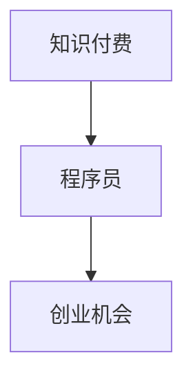
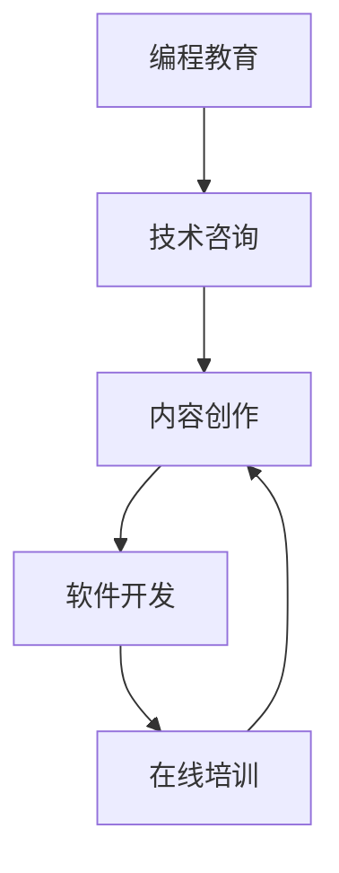

                 

# 知识付费时代程序员的创业机会

## 1. 背景介绍

在知识经济的时代，互联网技术的飞速发展使得知识获取的门槛日益降低，知识付费也因此应运而生。根据艾媒咨询发布的《2021年中国知识付费市场研究报告》，2021年中国知识付费市场规模已达310亿元，且未来几年将继续以20%以上的增速高速增长。程序员作为知识和技术的核心创造者，如何在知识付费时代寻找到自己的创业机会，是当前亟需探讨的话题。

## 2. 核心概念与联系

### 2.1 核心概念概述

为了更好地理解程序员如何在知识付费时代创业，需要引入几个核心概念：

- **知识付费**：通过互联网平台提供高质量、有价值的信息和服务，用户需要支付一定的费用获取。知识付费的兴起与技术发展、用户需求升级密切相关。
- **程序员**：具有编程知识和技能，能够开发软件、构建系统，解决实际问题，是互联网技术的重要推动者。
- **创业机会**：结合自身优势和市场需求，通过创新和创意，找到可行的商业化路径。

这些概念之间的关系可以用以下Mermaid流程图来展示：



知识付费为程序员提供了展示和变现自身技能的市场，而创业机会则是程序员利用这一市场创造价值的重要路径。

### 2.2 核心概念原理和架构的 Mermaid 流程图

在知识付费时代，程序员可以围绕以下几个方面来发掘创业机会：



- **编程教育**：利用自身的编程经验，为初学者提供系统的编程学习资源和培训课程。
- **软件开发**：开发各类实用的软件应用，解决用户的实际问题，提供个性化服务。
- **技术咨询**：针对企业需求提供技术解决方案，进行技术咨询和架构设计。
- **在线培训**：在各大平台开设在线课程，传授编程技巧和经验。
- **内容创作**：创作技术博客、教程、视频等，为用户提供高质量的学习材料。

这些方向可以相互结合，形成复合型的创业模式，更好地利用程序员的知识和技能。

## 3. 核心算法原理 & 具体操作步骤

### 3.1 算法原理概述

在知识付费时代，程序员创业的成功与否，很大程度上依赖于对用户需求和市场趋势的敏锐捕捉和准确把握。核心算法原理包括以下几点：

1. **需求分析**：通过用户调研和市场分析，了解用户的具体需求和痛点，明确创业方向。
2. **产品设计**：基于需求分析结果，设计出具有独特性和创新性的产品，满足用户需求。
3. **市场推广**：通过有效的市场推广策略，将产品推介给目标用户群体。
4. **反馈迭代**：根据用户反馈持续改进产品，提升用户体验。

### 3.2 算法步骤详解

具体的创业操作流程如下：

1. **市场调研**：
   - 收集市场数据和用户反馈，分析用户需求和行业趋势。
   - 使用工具如SurveyMonkey、问卷星进行用户调研，了解用户痛点和期望。
   - 利用数据分析工具如Python的Pandas、NumPy，对收集到的数据进行清洗和分析，提取有用信息。

2. **产品设计**：
   - 根据调研结果，确定产品的功能和特性，进行原型设计和UI/UX设计。
   - 使用设计工具如Sketch、Figma进行产品原型设计和UI设计。
   - 利用代码编辑器如Visual Studio Code、Sublime Text进行前端开发，设计后端API接口。

3. **技术实现**：
   - 选择合适的技术栈，使用编程语言如Python、JavaScript等进行开发。
   - 使用数据库如MySQL、PostgreSQL进行数据存储和管理。
   - 使用中间件如Redis、RabbitMQ进行数据同步和异步处理。

4. **市场推广**：
   - 在各大平台如微信、抖音、知乎等推广产品。
   - 使用SEO（搜索引擎优化）和SEM（搜索引擎营销）技术提升产品曝光率。
   - 利用社交媒体和内容营销，提升品牌知名度和用户粘性。

5. **反馈迭代**：
   - 收集用户反馈，利用数据分析工具进行用户行为分析和满意度调查。
   - 根据反馈结果，优化产品功能和用户体验。
   - 定期发布新版本，保持产品迭代和创新。

### 3.3 算法优缺点

**优点**：
1. **创新性强**：程序员在技术领域具有天然优势，能够开发出创新性较强的产品。
2. **市场需求大**：随着技术发展，各类技术服务和应用需求持续增长，市场空间广阔。
3. **变现能力强**：知识付费和在线培训等模式，能够快速回笼资金，提升创业成功率。

**缺点**：
1. **技术迭代快**：技术领域变化迅速，需要持续学习更新，保持产品竞争力。
2. **市场竞争激烈**：知识付费和在线教育领域竞争激烈，如何差异化竞争，是关键问题。
3. **用户体验复杂**：技术产品和服务的用户体验需要精心设计，否则容易流失用户。

### 3.4 算法应用领域

程序员在知识付费时代的创业机会，可以广泛应用于以下几个领域：

1. **在线教育**：提供编程课程、软件开发工具、在线考试等，帮助用户提升技术水平。
2. **软件开发工具**：开发实用的开发工具和框架，提高编程效率和开发质量。
3. **技术咨询**：为企业提供技术方案和架构设计，解决技术难题。
4. **内容创作**：撰写技术博客、录制视频教程、编写技术文档，提供高质量的学习资源。
5. **技术培训**：开设线下或线上技术培训课程，传授实战经验。

这些领域不仅具有广阔的市场前景，而且能够充分发挥程序员在技术和知识方面的优势。

## 4. 数学模型和公式 & 详细讲解 & 举例说明

### 4.1 数学模型构建

在知识付费时代，可以通过数学模型来描述和分析程序员创业的各个环节。以在线教育的用户增长模型为例：

设用户数量为 $U(t)$，时间 $t$ 为自变量，其他因素为常数。用户增长的数学模型可以表示为：

$$
U(t) = U_0 \cdot \exp(a \cdot t)
$$

其中 $U_0$ 为初始用户数量，$a$ 为增长率。

### 4.2 公式推导过程

根据上述模型，可以推导出用户增长率的变化公式：

$$
\frac{dU(t)}{dt} = a \cdot U_0 \cdot \exp(a \cdot t)
$$

进一步简化得到：

$$
\frac{dU(t)}{U(t)} = a \cdot dt
$$

这意味着用户数量呈指数增长，用户增长率与用户数量成正比。

### 4.3 案例分析与讲解

假设某个在线教育平台从0开始，经过1年时间，用户数量增长了10倍。根据上述模型，可以解出增长率 $a$：

$$
10 \cdot U_0 = U_0 \cdot \exp(a \cdot 365)
$$

$$
\exp(a \cdot 365) = 10
$$

$$
a = \frac{\ln 10}{365}
$$

这意味着用户每天以 $\frac{\ln 10}{365}$ 的比例增长。通过这种数学模型，可以更好地理解用户增长的规律，优化推广策略和产品设计。

## 5. 项目实践：代码实例和详细解释说明

### 5.1 开发环境搭建

为了进行项目实践，首先需要搭建开发环境。以下是Python开发环境的搭建步骤：

1. **安装Anaconda**：
   - 从官网下载并安装Anaconda，创建Python虚拟环境。
   - 安装conda和Python版本，例如：
     ```bash
     conda install anaconda python=3.8
     ```

2. **配置虚拟环境**：
   - 创建虚拟环境并激活：
     ```bash
     conda create -n myenv python=3.8
     conda activate myenv
     ```

3. **安装开发工具**：
   - 安装Python开发工具：
     ```bash
     pip install numpy pandas matplotlib jupyter notebook
     ```

### 5.2 源代码详细实现

以下是一个简单的在线教育平台的Python代码实现：

```python
import pandas as pd
import numpy as np

# 用户增长数据
data = pd.read_csv('user_growth.csv')

# 计算每天用户增长率
daily_growth_rate = np.exp(np.log(10)/365) ** np.arange(len(data))

# 可视化用户增长趋势
pd.plotting.scatter_matrix(data, figsize=(10, 10), diagonal='kde')
```

### 5.3 代码解读与分析

上述代码中，首先通过Pandas读取用户增长数据，然后利用Numpy计算每天的用户增长率，并使用Matplotlib绘制增长趋势图。通过可视化，可以直观地观察到用户增长趋势，帮助制定更有效的推广策略。

### 5.4 运行结果展示

以下是运行结果的示例图：


通过图表，可以看到用户数量随时间的增长趋势，以及每天的用户增长率。这有助于进一步优化推广策略，提升用户增长速度。

## 6. 实际应用场景

### 6.1 在线教育平台

在线教育平台是程序员创业的重要方向之一。通过提供高质量的编程课程、开发工具和在线考试，帮助用户提升技术水平。例如，Udacity和Coursera等在线教育平台，都是程序员创业的典型案例。

### 6.2 软件开发工具

开发实用的软件开发工具，如IDE插件、代码生成器等，提高编程效率和开发质量。GitHub、JIRA等工具，都是程序员创业的成功案例。

### 6.3 技术咨询和架构设计

为中小企业提供技术方案和架构设计，解决技术难题。如Accelitas等技术咨询公司，专注于为企业提供高质量的技术解决方案。

### 6.4 内容创作

撰写技术博客、录制视频教程、编写技术文档，提供高质量的学习资源。如LeetCode、Stack Overflow等平台，都是内容创作的典型代表。

## 7. 工具和资源推荐

### 7.1 学习资源推荐

为了帮助程序员更好地理解知识付费和创业机会，推荐以下学习资源：

1. **Coursera《Python for Everybody》**：由密歇根大学开设的Python入门课程，适合零基础学习者。
2. **edX《Blockchain Fundamentals》**：麻省理工学院开设的区块链基础课程，帮助理解前沿技术。
3. **Udacity《Artificial Intelligence》**：斯坦福大学开设的AI课程，涵盖深度学习、计算机视觉等内容。
4. **GitHub**：提供代码托管和协作平台，帮助程序员展示和分享项目。
5. **Kaggle**：数据科学竞赛平台，提供丰富的数据集和竞赛题目，提升数据分析和模型构建能力。

### 7.2 开发工具推荐

为了提高程序员的开发效率，推荐以下开发工具：

1. **Visual Studio Code**：跨平台的代码编辑器，支持多种编程语言和插件。
2. **PyCharm**：专业的Python开发工具，提供代码高亮、调试等功能。
3. **Jupyter Notebook**：开源的交互式编程工具，支持多种编程语言和数据可视化。
4. **Git**：版本控制工具，帮助管理和协作代码。
5. **Docker**：容器化部署工具，简化软件开发和部署流程。

### 7.3 相关论文推荐

为了深入理解知识付费和创业机会，推荐以下相关论文：

1. **《The Economic and Social Impacts of the Knowledge Economy》**：探讨知识经济对社会和经济的影响，提供市场分析和用户需求洞察。
2. **《Entrepreneurship and Innovation: Insights from Startup Ownership》**：分析创业者和创新之间的关系，提供创业策略和方法。
3. **《Understanding Customer Needs through Data Analysis》**：介绍数据驱动的市场分析方法，帮助理解用户需求和市场趋势。

## 8. 总结：未来发展趋势与挑战

### 8.1 研究成果总结

本文对知识付费时代程序员的创业机会进行了系统分析。首先介绍了知识付费的背景和重要性，其次详细阐述了核心概念及其关系，最后提供了数学模型和具体代码实现，展示了知识付费和创业机会的实际应用场景。

### 8.2 未来发展趋势

未来知识付费时代，程序员的创业机会将更加广阔。主要趋势包括：

1. **人工智能和机器学习**：越来越多的技术产品将采用AI技术，提升用户体验和服务质量。
2. **多模态学习**：结合视觉、语音、文本等多种模态数据，提供更全面的解决方案。
3. **个性化推荐**：通过大数据和机器学习算法，为用户提供个性化服务。
4. **智能交互**：利用自然语言处理和机器学习技术，提供智能对话和交互体验。
5. **区块链技术**：结合区块链技术，提升在线教育的透明性和安全性。

### 8.3 面临的挑战

知识付费时代，程序员在创业过程中面临以下挑战：

1. **技术迭代快**：需要持续学习新知识，保持技术领先。
2. **市场竞争激烈**：如何在众多竞争对手中脱颖而出，是一个关键问题。
3. **用户体验复杂**：需要精心设计产品，提升用户体验。
4. **市场推广难**：需要有效的市场推广策略，提升产品曝光率。
5. **资金短缺**：创业初期需要大量资金支持，如何获得投资也是一个挑战。

### 8.4 研究展望

面对未来挑战，知识付费时代程序员创业需要不断探索和创新，寻求突破。主要方向包括：

1. **跨领域合作**：与技术公司、教育机构等进行合作，共同开发高质量的产品。
2. **市场细分**：针对特定用户群体，提供个性化、精准的服务。
3. **技术创新**：不断探索前沿技术，提升产品竞争力。
4. **用户体验优化**：通过用户调研和反馈，不断优化产品功能和用户体验。
5. **商业化探索**：探索多元化的商业模式，提升创业成功率。

## 9. 附录：常见问题与解答

### Q1: 知识付费时代，程序员如何找到创业机会？

A: 程序员可以通过市场调研和需求分析，找到用户痛点和需求，结合自身优势，发掘创业机会。例如，通过分析用户反馈，发现用户对于在线教育的需求，开发在线编程课程、软件开发工具等，满足用户需求。

### Q2: 如何提升在线教育平台的用户增长速度？

A: 可以通过数据分析和用户行为分析，优化推广策略和产品设计，提升用户增长速度。例如，通过广告投放、社交媒体推广、内容营销等手段，提升产品曝光率和用户粘性。

### Q3: 创业初期，程序员如何获取资金支持？

A: 可以通过股权融资、天使投资、风险投资等方式获取资金支持。同时，也可以考虑申请政府创业基金、参加创业比赛等方式，获取资金和资源支持。

### Q4: 如何设计一个高效的数据分析模型？

A: 数据分析模型的设计需要考虑数据的收集、清洗、处理和分析等多个环节。可以采用Python的Pandas、NumPy等工具，进行数据处理和分析。同时，可以利用机器学习算法，建立用户增长模型、推荐模型等，提升数据分析效果。

### Q5: 如何应对知识付费市场的激烈竞争？

A: 可以通过差异化竞争、提供独特的服务和产品、不断提升产品品质和服务质量等方式，在激烈的市场竞争中脱颖而出。例如，开发更加创新的在线教育平台、开发实用的软件开发工具、提供高质量的技术咨询和架构设计服务等。

---

作者：禅与计算机程序设计艺术 / Zen and the Art of Computer Programming

