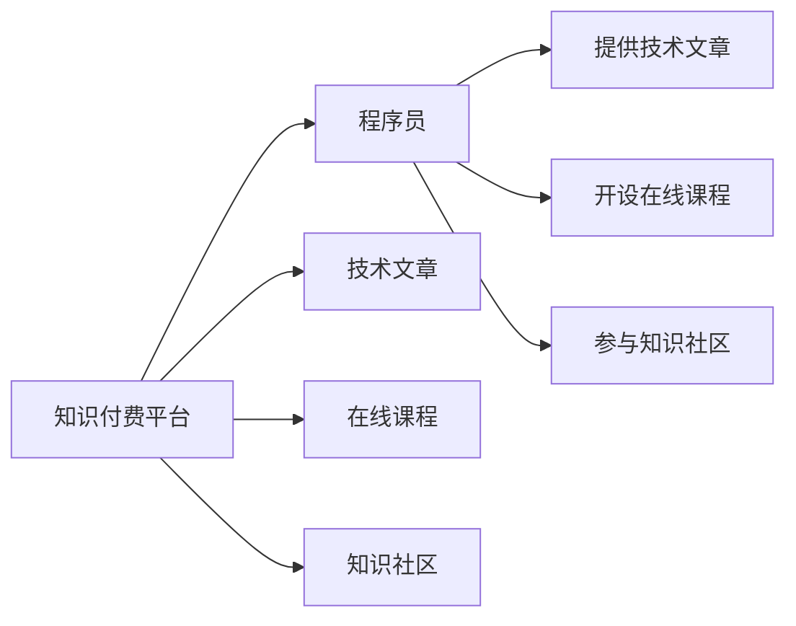

                 

# 知识付费时代程序员的机遇

## 1. 背景介绍

随着互联网技术的迅猛发展和数字经济的兴起，知识付费行业正呈现出爆发式增长的态势。内容创作者凭借其独特的专业知识和丰富的经验，逐渐成为知识付费市场中的重要参与者。程序员作为互联网技术的主要创造者，不仅掌握着前沿的技术，也积累了丰富的实践经验。在这个时代，程序员具有独特的优势，可以借助知识付费的机遇，实现技术价值和知识传播的有机结合，进一步提升个人职业发展。

### 1.1 知识付费行业背景
知识付费行业作为数字经济的细分领域，近年来取得了飞速发展。平台如喜马拉雅、知乎、得到、Coursera等不断涌现，为知识创作者提供了广阔的舞台。根据艾媒咨询数据显示，2020年中国知识付费市场规模达到了253.1亿元，用户规模达到了4.23亿人，预计到2023年市场规模将达到560.8亿元，用户规模将达到7.48亿人。这显示出知识付费行业市场空间巨大，前景广阔。

### 1.2 程序员的独特优势
程序员具有独特的优势，可以凭借技术实力、项目经验、逻辑思维能力等，提供有价值的专业知识和技能。相比于传统的在线教育，程序员可以提供更加实践和个性化的教学内容，使学习者能够迅速掌握最新的技术趋势和实际问题解决方案，满足市场对高端技能人才的迫切需求。

## 2. 核心概念与联系

### 2.1 核心概念概述
本节将介绍知识付费和程序员相关核心概念：

- **知识付费**：指用户为获取知识或信息而支付费用的商业模式。知识付费平台的兴起为用户提供了方便快捷的学习渠道，同时为知识创作者提供了变现途径。

- **程序员**：指通过编程语言和软件技术，编写程序代码，实现软件系统开发、维护、优化等专业技术人员。程序员具备较强的逻辑思维能力和技术能力，能够在技术领域提供权威的专业知识。

- **技术文章**：指程序员撰写并发布在技术社区、博客等平台上的专业文章，用于分享知识、解决问题、技术交流等。

- **在线课程**：指程序员通过知识付费平台提供的系统化学习课程，传授专业知识、项目经验等，帮助用户掌握技术和技能。

- **知识社区**：指程序员在社交媒体、技术论坛等平台组织和参与的讨论交流空间，用于技术分享、问题解答、学习互助等。

这些概念相互关联，共同构成了知识付费时代程序员的机遇基础。

### 2.2 核心概念原理和架构的 Mermaid 流程图



这个流程图展示了知识付费平台的运作机制：

1. 知识付费平台为程序员提供平台和技术支持。
2. 程序员利用平台发布技术文章、开设在线课程、参与知识社区。
3. 用户通过付费方式获取学习内容，从而实现知识变现。

## 3. 核心算法原理 & 具体操作步骤

### 3.1 算法原理概述
程序员借助知识付费平台，可以通过技术文章、在线课程等形式，分享知识和经验，获得收入。核心算法原理主要包括：

- **内容创作**：程序员撰写技术文章、制作在线课程，利用自身的专业知识，创建有价值的内容。
- **平台分发**：知识付费平台提供分发渠道，将内容推送给有需求的读者，实现内容的传播。
- **用户付费**：用户根据内容价值，选择付费购买或阅读，从而实现知识的变现。

### 3.2 算法步骤详解

#### 3.2.1 内容创作

**步骤1：选题与内容策划**
- 确定创作主题：选择一个具有较高需求和技术深度的技术问题或项目。
- 制定内容大纲：规划内容框架、深度、进度等，保证内容的系统性和连贯性。
- 进行市场调研：分析目标用户需求，确定内容方向和形式。

**步骤2：内容创作**
- 撰写技术文章：结合实际项目经验，系统地讲解技术原理、实现过程、问题解决方法等。
- 制作在线课程：录制视频、编写讲义，利用在线平台提供课程内容，实现系统化教学。
- 参与知识社区：在社交媒体、技术论坛等平台发布文章、解答问题，与读者互动交流。

**步骤3：内容优化**
- 获取反馈：收集读者反馈，了解内容质量和用户需求。
- 持续改进：根据反馈调整内容形式和内容深度，提升内容质量。

#### 3.2.2 平台分发

**步骤1：账号注册与认证**
- 注册平台账号：在知识付费平台注册账号，并进行实名认证。
- 提交相关证明：提交认证材料，如技术博客、项目案例、相关资格证书等。

**步骤2：内容上传与发布**
- 上传内容：将撰写好的技术文章、制作好的在线课程上传到平台。
- 设置价格与标签：根据内容难度和市场价值，设置合理的价格，并添加相关标签，便于用户查找。

**步骤3：用户推广**
- 使用社交媒体：通过微博、微信公众号等平台推广内容，扩大受众范围。
- 参与技术交流：在技术论坛、社区等平台上积极参与讨论，提高影响力。

#### 3.2.3 用户付费

**步骤1：用户订阅**
- 用户支付费用：用户选择购买或订阅内容，进行支付。
- 平台发放收益：平台将用户支付的费用按照一定比例分配给程序员创作者。

**步骤2：内容阅读**
- 平台提供阅读服务：用户可以按需阅读内容，享受知识服务。
- 创作者享受收益：程序员创作者获取平台发放的收益，实现知识变现。

### 3.3 算法优缺点

#### 3.3.1 优点
- **内容价值高**：程序员具备专业的技术背景和丰富的实践经验，能够提供高含金量的技术文章和在线课程。
- **精准传播**：知识付费平台利用大数据和算法推荐，确保内容能够精准推送给有需求的用户。
- **收益稳定**：用户通常会长期订阅内容，形成稳定的收入来源。
- **覆盖广泛**：知识付费平台覆盖广泛，能够覆盖大量对技术知识有需求的用户。

#### 3.3.2 缺点
- **市场竞争激烈**：知识付费市场竞争激烈，需要不断创新内容和形式，保持竞争力。
- **内容质量要求高**：内容质量直接决定了用户是否愿意付费，程序员需要不断提升自身技术水平和写作能力。
- **平台依赖性强**：依赖于知识付费平台的推荐和分发机制，受平台政策和算法影响较大。
- **用户体验不稳定**：平台可能存在服务不稳定、内容更新不及时等问题，影响用户体验。

### 3.4 算法应用领域

知识付费时代程序员的机遇可以应用于多个领域：

- **技术博客**：程序员可以通过在技术博客平台上发布技术文章，分享专业知识，吸引用户关注。
- **在线课程**：程序员可以开设在线课程，系统地教授技术知识，帮助用户掌握技术和项目经验。
- **技术社区**：程序员可以在技术社区、论坛等平台上参与讨论，解答问题，建立技术影响力。
- **技术培训**：程序员可以为企业提供技术培训服务，提升企业技术水平。
- **技术咨询**：程序员可以通过技术咨询平台，提供技术方案和项目指导。

## 4. 数学模型和公式 & 详细讲解 & 举例说明

### 4.1 数学模型构建

设程序员的内容创作量为 $C$，平台分发量为 $D$，用户付费量为 $P$，收益率为 $R$。内容创作量与分发量、付费量之间存在以下关系：

$$
R = \alpha \cdot C \cdot D \cdot P
$$

其中 $\alpha$ 为内容价值系数，取决于内容的深度、广度和市场需求。

### 4.2 公式推导过程

对于程序员的内容创作，假设创作量为 $C$，每个内容的价值为 $V$，平台推荐概率为 $p$，用户付费率为 $q$，则总收入 $R$ 可以表示为：

$$
R = C \cdot V \cdot p \cdot q
$$

假设内容创作的单位时间为 $t$，单位时间内的创作量为 $C$，则每单位时间的收益率为：

$$
R_t = C \cdot V \cdot p \cdot q
$$

### 4.3 案例分析与讲解

**案例1：技术博客收益计算**

假设程序员在技术博客平台上每周发布一篇技术文章，每篇文章价值 $V=500$ 元，平台推荐概率 $p=0.5$，用户付费率 $q=0.2$，平台收益率为 $0.3$。根据公式计算每周收益：

$$
R_{博客} = 4 \cdot 500 \cdot 0.5 \cdot 0.2 \cdot 0.3 = 120
$$

每周收益为120元，全年收益约为6600元。

**案例2：在线课程收益计算**

假设程序员在知识付费平台上开设一个为期3个月的在线课程，每节课价值 $V=300$ 元，平台推荐概率 $p=0.2$，用户付费率 $q=0.5$，平台收益率为 $0.3$。根据公式计算课程收益：

$$
R_{课程} = 24 \cdot 300 \cdot 0.2 \cdot 0.5 \cdot 0.3 = 2160
$$

课程收益为2160元，全年收益约为6720元。

## 5. 项目实践：代码实例和详细解释说明

### 5.1 开发环境搭建

#### 5.1.1 安装开发环境

**步骤1：安装Python**
- 从官网下载Python安装包，安装到计算机上。
- 添加环境变量，设置开发工具路径。

**步骤2：安装开发工具**
- 安装IDE如PyCharm、VSCode等，配置开发环境。
- 安装相关依赖库，如Flask、Django等。

**步骤3：搭建开发环境**
- 创建虚拟环境，并激活。
- 安装所需的Python库和依赖。

#### 5.1.2 搭建技术博客

**步骤1：选择合适的博客平台**
- 选择博客平台，如Medium、CSDN、简书等，进行注册认证。
- 创建博客账号，并设置博客权限。

**步骤2：撰写技术文章**
- 根据选题和内容大纲，撰写技术文章。
- 检查语法和格式，确保文章质量。

**步骤3：发布技术文章**
- 选择发布平台，并上传文章。
- 设置文章标签和分类，增加曝光率。

#### 5.1.3 搭建在线课程

**步骤1：选择合适的在线平台**
- 选择知识付费平台，如Coursera、Udemy、网易云课堂等。
- 创建账号，并进行实名认证。

**步骤2：制作课程内容**
- 录制视频讲解，编写讲义和PPT。
- 制作课程预览，吸引用户关注。

**步骤3：发布课程内容**
- 上传课程内容，设置课程价格。
- 添加标签和课程介绍，吸引用户购买。

### 5.2 源代码详细实现

以下是一个简单的技术博客平台搭建示例，使用Flask框架实现：

```python
from flask import Flask, render_template, request
from flask_sqlalchemy import SQLAlchemy

app = Flask(__name__)
app.config['SQLALCHEMY_DATABASE_URI'] = 'sqlite:////tmp/test.db'
db = SQLAlchemy(app)

class BlogPost(db.Model):
    id = db.Column(db.Integer, primary_key=True)
    title = db.Column(db.String(100), nullable=False)
    content = db.Column(db.Text, nullable=False)

@app.route('/')
def index():
    posts = BlogPost.query.all()
    return render_template('index.html', posts=posts)

@app.route('/add', methods=['GET', 'POST'])
def add():
    if request.method == 'POST':
        title = request.form['title']
        content = request.form['content']
        post = BlogPost(title=title, content=content)
        db.session.add(post)
        db.session.commit()
        return redirect('/')
    return render_template('add.html')

if __name__ == '__main__':
    app.run(debug=True)
```

该代码搭建了一个简单的技术博客平台，可以发布和展示技术文章。

### 5.3 代码解读与分析

**代码分析**

- **Flask框架**：用于构建Web应用，提供了便捷的路由管理、模板渲染、数据库操作等功能。
- **SQLAlchemy**：用于数据库操作，支持多种数据库类型，提供ORM（Object-Relational Mapping）功能，方便数据库的CRUD操作。
- **模板渲染**：使用Flask提供的模板引擎渲染HTML页面，方便展示数据。
- **路由管理**：使用Flask提供的路由功能，实现不同页面的处理。

**运行结果展示**

启动Web应用后，在浏览器中访问 `http://localhost:5000`，可以看到博客列表页面，如下图所示：

```html
<h1>技术博客列表</h1>
<ul>
    
        <li><a href="/{{ post.id }}">{{ post.title }}</a></li>
    
</ul>
<a href="/add">添加文章</a>
```

点击“添加文章”链接，进入文章添加页面，如下图所示：

```html
<h1>添加文章</h1>
<form method="POST">
    <input type="text" name="title" placeholder="文章标题" required>
    <textarea name="content" placeholder="文章内容" required></textarea>
    <button type="submit">提交</button>
</form>
```

## 6. 实际应用场景

### 6.1 技术培训

随着互联网技术的不断发展，技术培训需求日益增长。程序员可以利用知识付费平台，开设在线课程，传授自身丰富的技术经验，帮助用户掌握最新技术和项目技能。例如，某知名编程网站推出了Python课程，内容包括Python基础、Web开发、数据分析等，吸引了大量学习者。

### 6.2 技术咨询

程序员可以为企业提供技术咨询，帮助企业解决技术问题，提升技术水平。例如，某技术博客博主为企业提供定制化技术解决方案，解决企业在数据处理、系统优化、技术架构等方面的问题，得到了企业高度认可。

### 6.3 技术交流

程序员可以在知识社区、技术论坛等平台上参与讨论，与同行交流技术经验，分享项目案例。例如，某知名程序员在技术论坛上分享自己的项目经验，吸引了大批粉丝，建立了自己的技术影响力。

### 6.4 未来应用展望

知识付费时代的程序员将面临更多的机遇，可以借助平台实现技术价值和知识传播的有机结合，提升个人职业发展。

#### 6.4.1 技术博客平台多样化

未来的技术博客平台将更加多样化，不仅限于文章发布，还将包含视频讲解、音频讲解、直播互动等多种形式，吸引更多用户关注。

#### 6.4.2 在线课程体系化

未来的在线课程将更加体系化，不仅涵盖基础知识，还将包含实战项目、技术案例等，帮助用户全面掌握技术能力。

#### 6.4.3 技术社区深度化

未来的技术社区将更加深度化，不仅进行技术交流，还将进行项目协作、问题解答、知识众筹等，建立更加紧密的技术生态。

## 7. 工具和资源推荐

### 7.1 学习资源推荐

- **《深入理解计算机编程》**：深入介绍计算机编程的基本概念、算法和数据结构，适合入门学习。
- **《Python编程：从入门到实践》**：介绍Python编程语言的基础知识和实际应用，适合Python初学者。
- **《数据科学实战》**：涵盖数据科学基础知识和实战项目，适合数据科学爱好者。
- **Coursera**：提供大量在线课程，涵盖计算机科学、数据科学、商业分析等领域，适合深度学习。
- **LeetCode**：提供算法和数据结构题库，适合编程练习和面试准备。

### 7.2 开发工具推荐

- **PyCharm**：Java和Python开发工具，支持多种开发框架和库，功能强大，界面友好。
- **VSCode**：跨平台的IDE，支持多种语言和框架，插件丰富，社区活跃。
- **Flask**：轻量级的Web框架，简单易用，适合快速搭建Web应用。
- **Django**：全功能的Web框架，功能丰富，适合大型Web应用开发。
- **Git**：版本控制工具，支持多人协作和代码管理。

### 7.3 相关论文推荐

- **《编程的艺术》**：介绍编程语言的基本概念、设计原则和实践技巧。
- **《深度学习：理论、算法与实践》**：涵盖深度学习的基本理论和实际应用，适合深度学习初学者。
- **《分布式系统：原理与设计》**：介绍分布式系统的基本概念和设计原理，适合系统架构师。
- **《大规模机器学习：算法与系统》**：涵盖大规模机器学习的基本算法和系统设计，适合数据科学家。

## 8. 总结：未来发展趋势与挑战

### 8.1 研究成果总结

知识付费时代为程序员提供了广阔的机遇，可以借助平台实现技术价值和知识传播的有机结合，提升个人职业发展。然而，知识付费市场竞争激烈，需要不断创新内容和形式，保持竞争力。

### 8.2 未来发展趋势

未来的知识付费市场将继续增长，技术培训、技术咨询、技术交流等形式将更加多样化。技术博客平台将更加多样化，在线课程体系化，技术社区深度化。

### 8.3 面临的挑战

尽管知识付费时代为程序员带来了机遇，但也面临诸多挑战：

- **内容质量要求高**：内容质量直接决定了用户是否愿意付费，程序员需要不断提升自身技术水平和写作能力。
- **市场竞争激烈**：知识付费市场竞争激烈，需要不断创新内容和形式，保持竞争力。
- **平台依赖性强**：依赖于知识付费平台的推荐和分发机制，受平台政策和算法影响较大。
- **用户体验不稳定**：平台可能存在服务不稳定、内容更新不及时等问题，影响用户体验。

### 8.4 研究展望

未来的研究应关注以下几个方向：

- **内容质量提升**：提升内容质量和深度，吸引更多用户关注。
- **内容多样化**：丰富内容形式，满足不同用户的需求。
- **用户互动**：加强用户互动和交流，提高用户粘性。
- **技术改进**：提升技术水平和开发效率，提高内容产出速度。
- **市场扩展**：拓展市场范围，吸引更多用户和读者。

## 9. 附录：常见问题与解答

### 9.1 问题1：为什么知识付费时代程序员有机会？

**解答**：程序员具备专业的技术背景和丰富的实践经验，能够提供高含金量的技术文章和在线课程。同时，知识付费平台利用大数据和算法推荐，确保内容能够精准推送给有需求的用户。

### 9.2 问题2：如何选择适合自己的知识付费平台？

**解答**：选择知识付费平台时，需要考虑平台的知名度、用户基数、推荐算法、付费模式等因素。建议选择用户基数大、推荐算法先进的平台，如Coursera、Udemy、网易云课堂等。

### 9.3 问题3：如何提升内容质量？

**解答**：提升内容质量需要不断学习新知识、积累实战经验，关注行业动态和技术趋势。同时，加强与用户互动，了解用户需求，不断改进和优化内容。

### 9.4 问题4：如何平衡内容创作和日常工作？

**解答**：合理规划时间，利用碎片时间进行内容创作。同时，利用自动化工具和团队合作，提升内容产出效率。

---

作者：禅与计算机程序设计艺术 / Zen and the Art of Computer Programming

