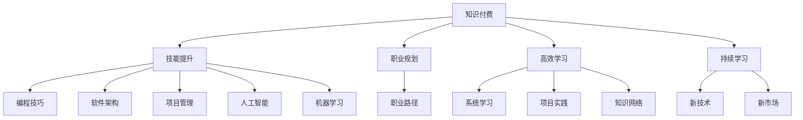

                 

# 知识付费让程序员告别朝九晚五

## 1. 背景介绍

在现代社会，程序员是极具魅力和吸引力的职业。他们通常被看作是技术前沿的探索者、问题解决的专家，甚至是智慧的化身。然而，由于技术更新迭代速度快、市场需求大、工作压力重，许多程序员常常面临“朝九晚五”的生活方式，工作与生活难以平衡，甚至出现职业倦怠。为了帮助程序员提升技能、拓宽视野、提高效率，知识付费应运而生，成为一种新的学习方式，不仅能够使程序员告别“朝九晚五”，还为他们的职业生涯提供了更多可能。

## 2. 核心概念与联系

### 2.1 核心概念概述

知识付费指的是通过购买或订阅付费内容，获取专业人士、领域专家或学习机构提供的知识和技能。在IT领域，这包括但不限于编程技巧、软件架构、项目管理、人工智能、机器学习等方面的知识和技能。核心概念包括：

- **知识付费**：通过付费形式获取知识和技能的学习方式。
- **技能提升**：通过学习新的技术或改进现有技能，增加就业竞争力。
- **职业规划**：利用付费内容进行职业规划，明确发展方向。
- **高效学习**：利用付费资源实现高效、系统的学习。
- **持续学习**：保持知识的更新和技术的掌握，避免被淘汰。

### 2.2 核心概念原理和架构的 Mermaid 流程图



此图表展示了知识付费的各个核心概念及其相互关系。通过知识付费，程序员可以从编程技巧、软件架构到人工智能、机器学习等多方面提升自身技能，同时规划职业生涯、实现高效学习，并保持持续学习，从而在技术不断变化的市场中保持竞争力。

## 3. 核心算法原理 & 具体操作步骤

### 3.1 算法原理概述

知识付费的核心算法原理主要包括推荐系统、个性化学习路径规划、内容推荐优化等。这些算法通过分析用户的学习行为和需求，为用户推荐最相关的付费内容，从而提高学习效率和满意度。

推荐系统通过协同过滤、基于内容的推荐、深度学习推荐等多种算法，对用户的历史行为和偏好进行分析，预测用户可能感兴趣的内容。个性化学习路径规划则根据用户的学习进度和知识掌握情况，推荐最适合的学习内容和顺序。内容推荐优化则通过反馈机制不断调整推荐算法，以提高推荐内容的精准度。

### 3.2 算法步骤详解

1. **用户画像建立**：平台收集用户的学习行为数据，包括浏览记录、购买记录、评价反馈等，建立详细的用户画像。
2. **内容分析与分类**：对付费内容进行标签化，如编程语言、框架、工具等，并建立内容库。
3. **算法训练与优化**：基于机器学习模型，训练推荐系统，优化个性化学习路径规划算法。
4. **内容推荐与反馈**：根据用户画像和内容分析结果，向用户推荐付费内容，并根据用户反馈不断优化推荐算法。
5. **学习进度与调整**：根据用户的学习进度和反馈，动态调整学习路径和推荐内容。

### 3.3 算法优缺点

**优点**：
- 个性化推荐，提高学习效率和满意度。
- 系统化学习路径，帮助用户有条理地提升技能。
- 持续反馈机制，不断优化学习体验。

**缺点**：
- 数据隐私问题：用户数据隐私保护存在风险。
- 过度依赖推荐：用户可能陷入平台推荐内容的“信息茧房”，限制知识面。
- 付费成本：部分内容付费门槛较高，可能对部分用户形成经济负担。

### 3.4 算法应用领域

知识付费在IT领域的应用非常广泛，具体包括但不限于以下几个方面：

- **编程与开发**：学习编程语言、框架、工具等，如Python、Java、Vue、React等。
- **数据科学与人工智能**：机器学习、深度学习、自然语言处理等。
- **软件架构与设计**：设计模式、架构模式、微服务、DevOps等。
- **项目管理与协作**：敏捷开发、Scrum、DevOps、Git等。
- **安全与防护**：网络安全、应用安全、数据安全等。

## 4. 数学模型和公式 & 详细讲解

### 4.1 数学模型构建

知识付费的学习过程可以抽象为数学模型，主要包括以下几个要素：

- **用户U**：包含基本信息、学习行为、偏好等。
- **内容C**：包括课程、文章、视频、书籍等。
- **时间T**：学习时长、频率等。
- **反馈F**：用户对内容的评价、反馈等。

学习过程可以表示为：

$$
\text{学习路径} = f(\text{用户U}, \text{内容C}, \text{时间T}, \text{反馈F})
$$

### 4.2 公式推导过程

以推荐系统为例，假设用户对内容A的评分是$X$，平台对内容A的评分是$Y$，用户与内容A的历史交互次数是$Z$。根据协同过滤算法，用户对内容A的评分可以表示为：

$$
\text{评分} = X * \frac{Z}{Y}
$$

其中，$X$和$Z$为用户与内容的交互频率，$Y$为内容质量评分。通过这种方法，平台可以根据用户的历史行为和内容质量，推荐相关内容。

### 4.3 案例分析与讲解

**案例1：技术栈升级**
李明是一名前端开发者，他希望提升自己在后端开发方面的能力。平台根据他的学习行为、已掌握的技能和兴趣，推荐了相关课程，如Node.js、Express、MySQL等，并制定了详细的学习路径。李明通过付费订阅这些课程，顺利掌握了后端开发的技能，成功转型为全栈开发者。

**案例2：新技术跟踪**
王丽是一名数据科学家，她需要持续学习最新的机器学习算法和技术。平台通过分析她的学习历史和偏好，推荐了深度学习、自然语言处理、强化学习等方面的课程，帮助她保持在技术前沿的位置。

## 5. 项目实践：代码实例和详细解释说明

### 5.1 开发环境搭建

知识付费平台通常使用Python进行开发，Python的强大生态系统和丰富的库支持，使得开发变得更加高效。以下是Python开发环境的搭建步骤：

1. 安装Anaconda或Miniconda。
2. 创建虚拟环境，安装必要的库，如TensorFlow、PyTorch、Flask等。
3. 搭建Web服务器，如使用Flask框架。
4. 部署数据库，如使用MySQL或PostgreSQL。
5. 配置云服务，如AWS、阿里云等。

### 5.2 源代码详细实现

以下是一个简单的Python代码示例，用于推荐系统中的协同过滤算法实现：

```python
from sklearn.metrics.pairwise import cosine_similarity
from sklearn.feature_extraction.text import TfidfVectorizer

def similarity_matrix(train_data):
    # 计算训练数据中每对内容的相似度
    vectorizer = TfidfVectorizer(stop_words='english')
    train_tfidf = vectorizer.fit_transform(train_data)
    similarity_matrix = cosine_similarity(train_tfidf)
    return similarity_matrix

def content_recommendation(user, train_data):
    # 计算用户与内容的相似度
    user_similarity = similarity_matrix(train_data)
    user_vector = vectorizer.transform(user)
    user_score = user_similarity.dot(user_vector)
    recommendation = [(train_data[i], user_score[i]) for i in range(len(user_score))]
    # 返回评分最高的内容
    recommendation = sorted(recommendation, key=lambda x: x[1], reverse=True)
    return recommendation[:5]
```

### 5.3 代码解读与分析

该代码实现了一个简单的协同过滤算法，用于推荐用户感兴趣的内容。`similarity_matrix`函数用于计算训练数据中每对内容的相似度，`content_recommendation`函数用于根据用户行为推荐内容。

### 5.4 运行结果展示

假设训练数据为以下内容：

- "学习Python编程基础"
- "Python高级特性"
- "Python与数据库"
- "Python数据可视化"
- "Python机器学习"

用户行为为：

- 阅读"学习Python编程基础"
- 阅读"Python高级特性"
- 阅读"Python与数据库"
- 阅读"Python数据可视化"

运行`content_recommendation(user, train_data)`函数，可以得到用户最感兴趣的内容推荐结果。

## 6. 实际应用场景

### 6.1 技术培训与认证

知识付费在技术培训与认证中的应用非常广泛。许多知名机构和公司通过知识付费平台提供认证课程，帮助学员掌握最新技术。例如，Cisco的Cloud Academy、Microsoft的Learning Portal等平台，提供了广泛的IT技能培训和认证课程，帮助学员在职业生涯中不断提升。

### 6.2 企业内训

企业内训也是知识付费的重要应用场景。许多大公司通过内部培训平台，提供专业技能培训，帮助员工提升技能，增强团队竞争力。例如，Google的Google Career Academy、Facebook的Facebook Developer Academy等平台，提供了丰富的IT培训资源，帮助员工在职业生涯中不断进步。

### 6.3 自由职业与远程工作

知识付费还为自由职业和远程工作提供了新的可能性。自由职业者可以通过知识付费平台接收到各种技能提升课程，提高自身竞争力，增加收入。远程工作者则可以通过知识付费平台获得技能提升，更好地适应远程工作环境，提升工作效率。

### 6.4 未来应用展望

未来，知识付费将继续在IT领域发挥重要作用。随着人工智能、大数据等技术的不断进步，知识付费平台将具备更加智能化的推荐能力和个性化服务，帮助用户更高效地提升技能，实现职业发展。

## 7. 工具和资源推荐

### 7.1 学习资源推荐

- **Coursera**：提供广泛的IT技能培训课程，涵盖编程、数据科学、机器学习等。
- **Udacity**：提供技术技能培训课程，如人工智能、机器学习、全栈开发等。
- **Pluralsight**：提供软件开发、网络安全、IT基础等方面的课程，覆盖从入门到高级的内容。
- **edX**：提供免费的计算机科学课程，涵盖算法、数据结构、操作系统等。
- **GitHub**：提供开源项目和代码库，帮助用户学习和实践编程技能。

### 7.2 开发工具推荐

- **Python**：强大的编程语言，广泛用于数据分析、机器学习、Web开发等。
- **Jupyter Notebook**：交互式编程环境，适合进行数据分析和机器学习实验。
- **AWS**：云计算平台，提供强大的计算资源，支持大规模数据处理和机器学习。
- **Google Colab**：免费的Jupyter Notebook环境，提供GPU和TPU支持。
- **Visual Studio Code**：轻量级的代码编辑器，支持多种编程语言和工具插件。

### 7.3 相关论文推荐

- **Knowledge Is Powerful: A Study of Open-API Knowledge Sharing**：探讨了API知识共享平台如何通过知识付费机制，促进开发者技能提升。
- **Collaborative Filtering for Recommendation Systems**：介绍协同过滤算法的基本原理和实现方法。
- **A Survey on Knowledge Sharing Platforms in Educational Environments**：综述了知识共享平台在教育领域的应用现状和发展趋势。
- **Adaptive Recommendation Systems for Learning**：探讨了自适应推荐系统在教育中的应用，通过分析用户行为和学习路径，提供个性化的学习推荐。

## 8. 总结：未来发展趋势与挑战

### 8.1 研究成果总结

知识付费在IT领域取得了显著成效，帮助许多程序员提升技能，拓宽职业道路。然而，知识付费仍面临诸多挑战，如数据隐私、内容质量、推荐算法等问题，需要进一步解决。

### 8.2 未来发展趋势

未来，知识付费将进一步发展，呈现以下几个趋势：

- **智能化推荐**：利用人工智能和大数据技术，提升推荐系统的智能性和准确性。
- **多样化内容**：提供更加多样化的付费内容，涵盖编程、数据科学、设计思维等多个领域。
- **全球化普及**：知识付费平台将走向全球化，提供多语言、多文化的学习内容，支持全球开发者和教育机构。
- **社区化互动**：建立知识付费社区，促进用户之间的交流和互动，增强学习效果。
- **个性化服务**：根据用户的学习行为和偏好，提供更加个性化的学习路径和服务。

### 8.3 面临的挑战

知识付费在发展过程中，仍面临以下挑战：

- **数据隐私**：平台需要保护用户数据的隐私，避免数据泄露和滥用。
- **内容质量**：需要确保付费内容的质量和准确性，避免误导用户。
- **推荐算法**：推荐算法需要不断优化，提高推荐系统的精准度和用户体验。
- **用户行为分析**：需要更深入地分析用户行为，提供更有针对性的学习建议。
- **商业模式**：需要探索新的商业模式，吸引更多的用户和开发者。

### 8.4 研究展望

未来，知识付费领域的研究可以从以下几个方向进行：

- **数据隐私保护**：开发更加安全的数据隐私保护技术，确保用户数据的安全性。
- **内容质量控制**：建立严格的内容审核机制，确保付费内容的质量和准确性。
- **推荐算法优化**：通过优化推荐算法，提高推荐系统的智能性和精准度。
- **用户行为分析**：深入分析用户行为，提供更有针对性的学习建议。
- **多样化付费模式**：探索多样化的付费模式，如按需订阅、按需付费等，满足不同用户的需求。

## 9. 附录：常见问题与解答

**Q1：知识付费是否对程序员的职业发展有帮助？**

A: 知识付费可以极大地帮助程序员提升技能、拓宽职业道路。通过系统化的学习路径、个性化的推荐内容和高效的学习方式，程序员可以快速掌握新技术、提升工作效率，从而在职业发展中获得更多机会。

**Q2：如何选择合适的知识付费平台？**

A: 选择知识付费平台时，需要考虑以下因素：
- 平台提供的课程内容是否全面、专业。
- 平台的教学质量和师资力量是否强大。
- 平台的互动性和社区氛围是否良好。
- 平台的用户评价和口碑是否良好。
- 平台的付费模式是否灵活，是否能够满足不同用户的需求。

**Q3：知识付费是否能够替代传统教育？**

A: 知识付费不能完全替代传统教育。传统教育通常包含课堂教学、实验、实践等多种形式，能够提供系统化的知识和技能训练。而知识付费更多依赖于自主学习，缺乏面对面的交流和指导。因此，两者可以互补，共同构成完整的教育体系。

**Q4：知识付费平台如何保障内容质量？**

A: 知识付费平台通常会通过以下几个方式保障内容质量：
- 严格的课程审核机制，确保课程内容的专业性和准确性。
- 定期更新课程内容，确保课程的时效性和前沿性。
- 用户评价和反馈机制，及时发现和纠正内容问题。
- 邀请知名专家和行业领袖授课，提升课程质量。

---

作者：禅与计算机程序设计艺术 / Zen and the Art of Computer Programming

