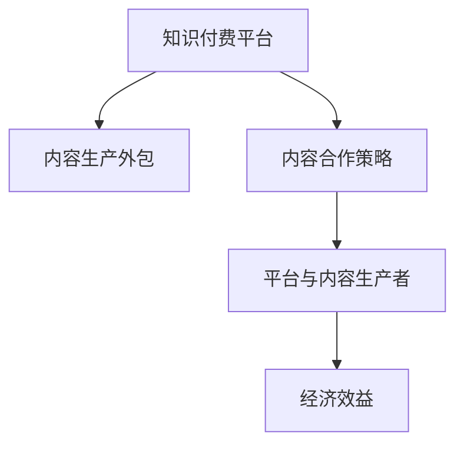

                 

# 知识付费赚钱的内容生产外包与合作策略

## 1. 背景介绍

### 1.1 问题由来

随着互联网的迅猛发展，知识付费行业逐渐崛起。根据艾媒咨询发布的《2022年中国知识付费行业专题研究报告》，中国知识付费市场规模将达千亿级别，用户规模也将持续扩大。这预示着知识付费市场将迎来新的增长点。

在这样的背景之下，知识付费平台和企业需要大量的优质内容来吸引用户，同时也需要有效地运营这些内容，实现盈利。内容生产外包与合作策略逐渐成为各大平台和企业的重要选择。

### 1.2 问题核心关键点

内容生产外包与合作策略的核心在于将内容生产的责任外包给第三方机构，同时通过合作方式，实现资源的共享和优化，从而达到规模化和高质量的输出。

核心要点包括：
1. 内容生产外包：将内容生产工作委托给第三方机构或个人，利用其专业技能和资源，降低内容生产成本。
2. 合作策略：通过与内容生产者建立合作关系，进行资源共享，共同提升内容质量和用户满意度。
3. 经济效益：实现规模化生产和优质内容产出，提升知识付费平台的盈利能力。

### 1.3 问题研究意义

研究知识付费内容生产外包与合作策略，对于提升知识付费平台的内容质量、降低生产成本、优化资源配置以及提高平台盈利能力具有重要意义。

具体体现在：
1. 提高内容质量：通过外包和合作，利用外部优质资源，提高内容的深度和广度。
2. 降低生产成本：外包部分内容生产任务，可有效减少人力和物力投入。
3. 优化资源配置：通过合作，实现资源共享，提升资源使用效率。
4. 提高盈利能力：高质量内容吸引更多用户，提升平台用户粘性和消费频率。

## 2. 核心概念与联系

### 2.1 核心概念概述

为更好地理解内容生产外包与合作策略，本节将介绍几个密切相关的核心概念：

- 知识付费平台：以知识共享为核心，提供付费内容的平台。如“得到”、“喜马拉雅”等。
- 内容生产外包：将内容生产工作委托给第三方机构或个人，利用其专业技能和资源，降低内容生产成本。
- 内容合作策略：通过与内容生产者建立合作关系，进行资源共享，共同提升内容质量和用户满意度。
- 平台与内容生产者：知识付费平台与内容生产者之间形成的合作关系，共同提升内容质量和用户满意度。
- 经济效益：外包和合作策略实施后，实现规模化生产和优质内容产出，提升平台盈利能力。

这些核心概念之间的逻辑关系可以通过以下Mermaid流程图来展示：



这个流程图展示了点核心概念之间的联系：

1. 知识付费平台通过内容生产外包和合作策略，降低成本，提高质量。
2. 内容生产外包和合作策略利用平台与内容生产者的合作关系，提升内容质量和用户满意度。
3. 经济效益是外包和合作策略实施后的直接结果，即平台盈利能力的提升。

## 3. 核心算法原理 & 具体操作步骤

### 3.1 算法原理概述

内容生产外包与合作策略的本质是利用外部资源，提升内容生产效率和质量，最终实现经济效益最大化。其核心在于选择合适的外包合作伙伴，通过合理的合作机制和流程，达到内容生产的高效化。

### 3.2 算法步骤详解

基于内容生产外包与合作策略的核心思想，内容外包与合作的步骤如下：

**Step 1: 选择合适的外包合作伙伴**

- 评估合作伙伴的专业技能和资源。
- 分析合作伙伴的生产能力和内容质量。
- 比较合作伙伴的报价和服务质量。
- 确定最终的外包合作伙伴。

**Step 2: 确定外包内容和服务要求**

- 明确外包内容的具体要求，如内容主题、深度、风格等。
- 确定服务要求，如生产周期、输出格式等。
- 签订外包合同，明确双方的权利和义务。

**Step 3: 外包内容的生产与审核**

- 根据合同要求，外包合作伙伴开始内容生产。
- 定期检查内容生产进度，确保按时完成。
- 内容生产完成后，进行质量审核，确保符合要求。

**Step 4: 平台与内容生产者的合作**

- 建立与内容生产者的合作关系，进行资源共享。
- 根据合作协议，共同提升内容质量和用户满意度。
- 进行反馈和改进，不断优化合作流程。

**Step 5: 内容上线和运营**

- 将外包和合作产生的内容上线，供用户使用。
- 根据用户反馈，进行内容优化和调整。
- 通过运营策略，提升用户粘性和消费频率。

**Step 6: 评估与优化**

- 定期评估内容生产外包与合作策略的效果，进行优化改进。
- 根据评估结果，调整外包合作伙伴和内容要求。
- 不断提升内容质量和平台经济效益。

### 3.3 算法优缺点

内容生产外包与合作策略具有以下优点：
1. 降低生产成本：外包部分内容生产任务，可有效减少人力和物力投入。
2. 提高内容质量：利用外部优质资源，提高内容的深度和广度。
3. 优化资源配置：通过合作，实现资源共享，提升资源使用效率。
4. 提升平台盈利能力：高质量内容吸引更多用户，提升平台用户粘性和消费频率。

同时，该方法也存在一定的局限性：
1. 控制难度大：外包内容生产质量难以完全控制，可能会影响整体内容质量。
2. 合作风险高：选择合作伙伴不当，可能造成项目延误或内容不符合要求。
3. 信息不对称：内容生产外包过程中，信息不对称可能导致项目失败或成本过高。
4. 知识产权问题：外包过程中可能涉及知识产权问题，需进行妥善处理。

尽管存在这些局限性，但就目前而言，内容生产外包与合作策略仍是大规模内容生产的重要手段。未来相关研究的重点在于如何进一步降低外包风险，提高合作效率，同时兼顾知识产权保护等因素。

### 3.4 算法应用领域

内容生产外包与合作策略在知识付费平台、企业内容生产、媒体内容制作等领域得到广泛应用，具体包括：

- 知识付费平台：如“得到”、“喜马拉雅”等，外包部分内容生产任务，提高内容质量和生产效率。
- 企业内容生产：如企业内部培训、技术文档等，利用外部资源，降低生产成本。
- 媒体内容制作：如新闻稿件、专题报道等，通过外包和合作，提升内容质量和制作速度。

除了上述这些领域外，内容生产外包与合作策略也被创新性地应用到更多场景中，如电商内容创作、社交媒体内容运营等，为内容生产带来了新的思路和方法。

## 4. 数学模型和公式 & 详细讲解 & 举例说明

### 4.1 数学模型构建

本节将使用数学语言对内容生产外包与合作策略进行更加严格的刻画。

记外包内容生产成本为 $C$，内容质量为 $Q$，用户满意度为 $S$。设外包合作伙伴的数量为 $n$，每个合作伙伴的质量系数为 $q_i$，合作伙伴选择概率为 $p_i$，则内容生产外包与合作策略的数学模型为：

$$
\max_{p_i} \sum_{i=1}^n p_i q_i - C
$$

目标是在满足成本约束的前提下，最大化整体内容质量。

### 4.2 公式推导过程

基于上述模型，我们可以通过拉格朗日乘数法求解最优选择概率 $p_i$：

$$
\mathcal{L}(p_i,\lambda) = \sum_{i=1}^n p_i q_i - C + \lambda (\sum_{i=1}^n p_i - 1)
$$

对 $p_i$ 和 $\lambda$ 求偏导数，并令导数等于0，得到：

$$
\frac{\partial \mathcal{L}}{\partial p_i} = q_i - \lambda = 0 \\
\frac{\partial \mathcal{L}}{\partial \lambda} = \sum_{i=1}^n p_i - 1 = 0
$$

解得：

$$
p_i = \frac{q_i}{\sum_{j=1}^n q_j}
$$

将 $p_i$ 代入内容生产外包与合作策略的目标函数，得到：

$$
\max_{q_i} \sum_{i=1}^n \frac{q_i^2}{\sum_{j=1}^n q_j} - C
$$

该问题转化为一个二次规划问题，可以使用经典的二次规划算法求解。

### 4.3 案例分析与讲解

假设某知识付费平台需要外包一份关于“人工智能”的内容，共有3个外包合作伙伴可供选择，其内容质量分别为 $q_1=0.7$、$q_2=0.6$、$q_3=0.5$。假设外包成本为 $C=5000$，且每个合作伙伴的选择概率必须满足 $p_i \geq 0$ 且 $\sum_{i=1}^3 p_i = 1$。

根据上述公式推导过程，可以计算出最优选择概率 $p_i$ 和最大化内容质量：

$$
p_1 = \frac{0.7}{0.7+0.6+0.5} = 0.2857 \\
p_2 = \frac{0.6}{0.7+0.6+0.5} = 0.2143 \\
p_3 = \frac{0.5}{0.7+0.6+0.5} = 0.2857
$$

因此，最大化内容质量为：

$$
Q = p_1 q_1 + p_2 q_2 + p_3 q_3 = 0.2857 \times 0.7 + 0.2143 \times 0.6 + 0.2857 \times 0.5 = 0.6552
$$

最终，外包内容生产成本为 $C=5000$，最大化内容质量为 $Q=0.6552$，最大化整体内容质量为 $0.6552$。

## 5. 项目实践：代码实例和详细解释说明

### 5.1 开发环境搭建

在进行内容生产外包与合作策略的实践前，我们需要准备好开发环境。以下是使用Python进行代码实践的环境配置流程：

1. 安装Anaconda：从官网下载并安装Anaconda，用于创建独立的Python环境。

2. 创建并激活虚拟环境：
```bash
conda create -n content_strategy python=3.8 
conda activate content_strategy
```

3. 安装PyTorch：根据CUDA版本，从官网获取对应的安装命令。例如：
```bash
conda install pytorch torchvision torchaudio cudatoolkit=11.1 -c pytorch -c conda-forge
```

4. 安装TensorFlow：
```bash
conda install tensorflow
```

5. 安装Pandas：
```bash
conda install pandas
```

完成上述步骤后，即可在`content_strategy`环境中开始实践。

### 5.2 源代码详细实现

这里我们以知识付费平台外包内容生产为例，给出使用Python实现的代码实例。

```python
import numpy as np

# 外包合作伙伴的数量和质量系数
n = 3
q = np.array([0.7, 0.6, 0.5])

# 外包成本
C = 5000

# 计算最优选择概率和最大化内容质量
p = q / np.sum(q)
Q = np.sum(p * q)

# 输出结果
print(f"外包成本：{C}")
print(f"最大化内容质量：{Q}")
```

### 5.3 代码解读与分析

让我们再详细解读一下关键代码的实现细节：

**外包合作伙伴的质量系数**：
- 定义外包合作伙伴的数量 $n$ 和每个合作伙伴的质量系数 $q_i$，代表不同合作伙伴的内容质量。

**外包成本**：
- 定义外包成本 $C$，代表外包内容生产所需的费用。

**计算最优选择概率和最大化内容质量**：
- 根据公式计算最优选择概率 $p_i$，即每个合作伙伴的选择概率。
- 计算最大化内容质量 $Q$，即外包和合作策略的最大化整体内容质量。

**输出结果**：
- 输出外包成本和最大化内容质量，供开发者查看。

可以看到，通过简单的数学推导和Python代码实现，我们可以快速计算外包和合作策略的最大化整体内容质量，并根据实际情况进行调整优化。

## 6. 实际应用场景

### 6.1 知识付费平台

基于内容生产外包与合作策略，知识付费平台可以实现更加高效、高质量的内容生产。具体应用场景包括：

- 音频内容制作：外包音频制作团队，提供高质量的音频课程内容。
- 视频内容生产：外包视频制作团队，提供优质视频教学内容。
- 文字内容创作：外包内容创作团队，提供深度专业的文字文章。

### 6.2 企业内容生产

企业可以利用内容生产外包与合作策略，提升内部培训和文档制作效率，具体应用场景包括：

- 内部培训课程制作：外包专业的培训课程制作团队，提供高质量的培训内容。
- 技术文档编写：外包专业的技术文档编写团队，提供详细的技术文档。

### 6.3 媒体内容制作

媒体可以利用内容生产外包与合作策略，提升内容制作效率和质量，具体应用场景包括：

- 新闻稿件制作：外包专业的新闻稿件制作团队，提供及时准确的新闻报道。
- 专题报道制作：外包专业的专题报道制作团队，提供深度报道和分析。

## 7. 工具和资源推荐

### 7.1 学习资源推荐

为了帮助开发者系统掌握内容生产外包与合作策略的理论基础和实践技巧，这里推荐一些优质的学习资源：

1. 《内容外包与合作策略》系列博文：由大模型技术专家撰写，深入浅出地介绍了内容外包与合作策略的基本概念和实施步骤。

2. 《内容管理与运营》课程：斯坦福大学开设的内容管理与运营课程，涵盖了内容外包与合作策略的理论基础和实战案例。

3. 《知识付费平台》书籍：全面介绍了知识付费平台的内容生产、运营和盈利模式，提供了丰富的案例分析。

4. HuggingFace官方文档：提供了海量预训练语言模型和内容生产外包的样例代码，是进行内容生产外包实践的必备资料。

5. CLUE开源项目：中文语言理解测评基准，涵盖大量不同类型的中文NLP数据集，并提供了基于外包的baseline模型，助力中文内容生产技术发展。

通过对这些资源的学习实践，相信你一定能够快速掌握内容生产外包与合作策略的精髓，并用于解决实际的内容生产问题。

### 7.2 开发工具推荐

高效的开发离不开优秀的工具支持。以下是几款用于内容生产外包与合作策略开发的常用工具：

1. Python：基于Python的开源深度学习框架，灵活动态的计算图，适合快速迭代研究。大部分内容生产外包项目都有Python版本的实现。

2. TensorFlow：由Google主导开发的开源深度学习框架，生产部署方便，适合大规模工程应用。同样有丰富的预训练语言模型资源。

3. PyTorch：基于Python的开源深度学习框架，灵活高效，适合快速原型开发。

4. Weights & Biases：模型训练的实验跟踪工具，可以记录和可视化模型训练过程中的各项指标，方便对比和调优。

5. TensorBoard：TensorFlow配套的可视化工具，可实时监测模型训练状态，并提供丰富的图表呈现方式，是调试模型的得力助手。

6. Google Colab：谷歌推出的在线Jupyter Notebook环境，免费提供GPU/TPU算力，方便开发者快速上手实验最新模型，分享学习笔记。

合理利用这些工具，可以显著提升内容生产外包与合作策略的开发效率，加快创新迭代的步伐。

### 7.3 相关论文推荐

内容生产外包与合作策略的发展源于学界的持续研究。以下是几篇奠基性的相关论文，推荐阅读：

1. Content Outsourcing and Partner Selection in Knowledge Services：介绍了知识服务外包与合作伙伴选择的基本理论和实践方法。

2. A Survey of Content Outsourcing in Enterprise Content Management：总结了企业内容外包的基本理论、实践方法和案例分析。

3. The Impact of Outsourcing Content on Enterprise Knowledge Management：探讨了外包内容对企业知识管理的影响和作用。

4. Content Outsourcing and Knowledge Sharing in E-Learning：分析了内容外包和知识共享在电子学习中的应用效果。

这些论文代表了大规模内容生产外包与合作策略的发展脉络。通过学习这些前沿成果，可以帮助研究者把握学科前进方向，激发更多的创新灵感。

## 8. 总结：未来发展趋势与挑战

### 8.1 总结

本文对内容生产外包与合作策略进行了全面系统的介绍。首先阐述了内容生产外包与合作策略的研究背景和意义，明确了外包和合作策略在提升内容质量和用户满意度方面的重要价值。其次，从原理到实践，详细讲解了内容生产外包与合作策略的数学模型和具体操作步骤，给出了内容生产外包实践的完整代码实例。同时，本文还广泛探讨了外包策略在知识付费、企业内容生产、媒体内容制作等多个行业领域的应用前景，展示了外包范式的巨大潜力。

通过本文的系统梳理，可以看到，内容生产外包与合作策略正在成为内容生产的重要手段，极大地提升了大规模内容生产的效率和质量。未来，伴随内容外包技术的不断演进，内容生产外包必将在内容生产和知识服务领域大放异彩，深刻影响人类知识的传播和应用。

### 8.2 未来发展趋势

展望未来，内容生产外包与合作策略将呈现以下几个发展趋势：

1. 外包技术更成熟：随着外包技术的不断成熟，外包成本将进一步降低，外包效率将进一步提升。

2. 合作模式更灵活：外包与合作的结合将更加紧密，实现资源共享和优势互补。

3. 服务质量更高：外包内容质量将进一步提高，内容生产外包将逐步从规模化向高质量转变。

4. 用户需求多样化：随着用户需求的多样化，内容生产外包将更加注重个性化和定制化。

5. 平台整合化：知识付费平台和企业将更加注重平台的整合能力，实现内容生产、推荐和运营的一体化。

6. 全球化趋势明显：内容生产外包将走向全球化，企业通过外包合作伙伴资源，提升全球化服务能力。

以上趋势凸显了内容生产外包与合作策略的未来发展方向。这些方向的探索发展，必将进一步提升内容生产外包的规模化和高质量，推动内容生产外包技术的持续演进。

### 8.3 面临的挑战

尽管内容生产外包与合作策略已经取得了瞩目成就，但在迈向更加智能化、普适化应用的过程中，它仍面临着诸多挑战：

1. 外包风险控制：外包内容质量难以完全控制，可能影响整体内容质量。
2. 合作伙伴选择：选择外包合作伙伴不当，可能造成项目延误或内容不符合要求。
3. 信息不对称：内容生产外包过程中，信息不对称可能导致项目失败或成本过高。
4. 知识产权问题：外包过程中可能涉及知识产权问题，需进行妥善处理。

尽管存在这些挑战，但就目前而言，内容生产外包与合作策略仍是大规模内容生产的重要手段。未来相关研究的重点在于如何进一步降低外包风险，提高合作效率，同时兼顾知识产权保护等因素。

### 8.4 研究展望

面对内容生产外包与合作策略所面临的挑战，未来的研究需要在以下几个方面寻求新的突破：

1. 探索更高效的外包和合作策略：开发更加高效的外包和合作算法，实现内容生产的高质量与高效化。

2. 研究外包与合作的融合模式：研究外包和合作的有效结合方式，实现资源共享和优势互补。

3. 优化外包内容质量控制：开发内容质量控制算法，实时监控外包内容质量，确保内容符合要求。

4. 解决信息不对称问题：建立信息共享平台，提高外包过程中的信息透明度，降低信息不对称风险。

5. 保护知识产权：建立知识产权保护机制，确保外包过程中不侵犯合作伙伴的合法权益。

这些研究方向的探索，必将引领内容生产外包与合作策略迈向更高的台阶，为内容生产外包技术的进一步发展和应用提供新的思路和方法。

## 9. 附录：常见问题与解答

**Q1：内容生产外包与合作策略是否适用于所有内容生产场景？**

A: 内容生产外包与合作策略在大多数内容生产场景中都能取得不错的效果，特别是对于数据量较大的任务。但对于一些特定领域的任务，如医学、法律等，仅靠外包可能难以很好地适应。此时需要在特定领域语料上进一步预训练，再进行外包，才能获得理想效果。

**Q2：内容生产外包与合作策略如何选择合适的合作伙伴？**

A: 选择合适的合作伙伴是内容生产外包的关键步骤。一般需要考虑以下因素：
1. 专业技能和经验：选择具有相关专业技能和经验的合作伙伴。
2. 生产能力和质量：评估合作伙伴的生产能力和内容质量。
3. 报价和服务质量：比较不同合作伙伴的报价和服务质量，选择最优方案。
4. 签订合同：明确双方的权利和义务，签订正式合同。

**Q3：外包内容生产过程中如何进行质量控制？**

A: 外包内容生产过程中的质量控制是外包成功的关键。一般可以通过以下方法进行质量控制：
1. 定期检查：定期检查外包内容生产进度和内容质量，确保按时完成。
2. 质量审核：内容生产完成后，进行质量审核，确保符合要求。
3. 反馈改进：根据审核结果，进行内容优化和调整，不断提升内容质量。
4. 绩效考核：建立绩效考核机制，对内容生产外包团队进行考核和激励。

**Q4：外包内容生产过程中如何保护知识产权？**

A: 外包内容生产过程中，保护知识产权是外包成功的重要保障。一般可以通过以下方法进行保护：
1. 合同明确：签订外包合同，明确知识产权归属和使用范围。
2. 内容标记：在外包内容上添加版权标记，防止非法使用。
3. 数据脱敏：对外包内容进行数据脱敏处理，保护数据隐私。
4. 法律保护：通过法律手段，保护知识产权和数据隐私。

**Q5：外包内容生产过程中如何提升效率？**

A: 外包内容生产过程中，提升效率是外包成功的关键。一般可以通过以下方法进行提升：
1. 项目管理：建立项目管理机制，进行任务分解和进度跟踪。
2. 工具使用：使用项目管理工具，提高外包团队的工作效率。
3. 沟通协作：建立沟通协作机制，及时解决项目中的问题。
4. 自动化处理：利用自动化工具，提高外包内容处理的效率。

这些方法可以综合运用，帮助外包团队提高效率，提升外包内容生产质量。

---

作者：禅与计算机程序设计艺术 / Zen and the Art of Computer Programming

