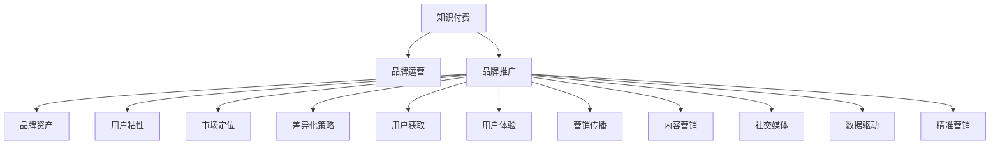

                 

# 知识付费赚钱的品牌品牌运营与品牌推广策略

> 关键词：知识付费,品牌运营,品牌推广,品牌资产,用户粘性,市场定位,差异化策略,用户获取,用户体验,营销传播,内容营销,社交媒体,数据驱动,精准营销

## 1. 背景介绍

### 1.1 问题由来
随着互联网的普及和智能设备的广泛使用，知识付费市场正以指数级速度增长。在知识信息爆炸的时代，用户对优质、精准、有深度的内容需求日益增强。品牌作为知识付费平台的价值体现，其运营与推广策略的有效性直接关系到平台的盈利能力和用户满意度。

本文档旨在深入探讨知识付费领域品牌品牌运营与推广的策略，详细阐述如何通过有效的运营与推广，提升品牌影响力，提高用户粘性，最终实现盈利目标。

## 2. 核心概念与联系

### 2.1 核心概念概述

- **知识付费**：指消费者为获取知识信息而支付的金钱。知识付费模式通过优质的内容输出，满足用户对知识的需求，并在此基础上构建信任，形成稳定的用户群体。

- **品牌运营**：通过系统的品牌管理和运营策略，构建品牌的核心价值和独特形象，建立与用户的深度互动和情感联系。

- **品牌推广**：通过各种营销手段，扩大品牌知名度，提升品牌形象，增加用户转化率，实现品牌价值的最大化。

- **品牌资产**：品牌运营与推广的核心成果，包括品牌知名度、美誉度、用户忠诚度等无形资产，是品牌竞争力的重要体现。

- **用户粘性**：指用户对品牌的忠诚度和依赖度，表现为高频使用、重复购买、积极推荐等行为。

- **市场定位**：通过分析目标市场和用户需求，明确品牌的市场定位，制定差异化策略，提高品牌竞争力。

- **差异化策略**：利用独特的品牌价值和市场定位，在竞争激烈的市场中脱颖而出，赢得更多用户的青睐。

- **用户获取**：通过精准的营销策略和推广手段，吸引潜在用户，增加品牌的市场份额。

- **用户体验**：通过优质的内容和良好的服务体验，提升用户满意度，增强用户对品牌的认同感。

- **营销传播**：通过多种渠道和方式，将品牌信息传递给目标用户，提高品牌曝光率和市场占有率。

- **内容营销**：以高质量的内容为核心，通过用户对内容的关注和分享，提升品牌影响力，吸引新用户。

- **社交媒体**：利用社交网络平台，扩大品牌传播范围，增强用户互动，提升品牌知名度和美誉度。

- **数据驱动**：通过分析用户行为数据，制定精准的营销策略和运营方案，实现品牌价值的最大化。

- **精准营销**：根据用户的行为数据和偏好，提供个性化的内容和推荐，提升用户的满意度和转化率。

这些核心概念之间的逻辑关系可以通过以下Mermaid流程图来展示：



这个流程图展示了你文章中各个核心概念之间的关联，你应当确保对每个概念都有深入理解，以便为读者提供全面的知识付费品牌品牌运营与推广策略。

## 3. 核心算法原理 & 具体操作步骤

### 3.1 算法原理概述

品牌品牌运营与推广的核心在于构建品牌的核心价值和独特形象，通过系统的品牌管理和运营策略，提升品牌知名度和美誉度，最终实现盈利目标。其核心算法原理主要包括：

1. **品牌价值构建**：通过高质量的内容输出，建立品牌的核心价值和用户信任。
2. **市场分析与定位**：通过市场调研和用户分析，明确品牌的目标市场和用户需求。
3. **差异化策略制定**：根据市场定位和用户需求，制定独特的品牌策略，提升品牌竞争力。
4. **用户体验优化**：通过提供优质的内容和良好的服务，提升用户体验，增强用户粘性。
5. **精准营销实现**：通过数据分析和用户行为分析，制定精准的营销策略，提升用户转化率。

### 3.2 算法步骤详解

#### 3.2.1 品牌价值构建
品牌价值构建是品牌品牌运营与推广的基础。其核心步骤包括：
1. **高质量内容输出**：通过持续输出有深度、有价值的内容，吸引用户关注和参与。
2. **用户互动与反馈**：积极响应用户反馈，不断优化内容，增强用户参与感和满意度。
3. **内容多样化与深度化**：丰富内容形式，深入探讨用户感兴趣的话题，提高内容吸引力。

#### 3.2.2 市场分析与定位
市场分析与定位是品牌品牌运营与推广的起点。其核心步骤包括：
1. **目标市场调研**：通过市场调研，了解目标市场的特点和需求。
2. **用户需求分析**：通过用户调研，了解用户的具体需求和偏好。
3. **市场定位制定**：根据调研结果，制定明确的市场定位，突出品牌特色。

#### 3.2.3 差异化策略制定
差异化策略制定是品牌品牌运营与推广的关键。其核心步骤包括：
1. **竞争分析**：分析主要竞争对手的品牌策略和市场表现。
2. **品牌特色挖掘**：挖掘品牌的独特价值和优势，制定差异化策略。
3. **策略实施与优化**：根据市场反馈，不断调整和优化差异化策略，提升品牌竞争力。

#### 3.2.4 用户体验优化
用户体验优化是品牌品牌运营与推广的核心。其核心步骤包括：
1. **界面优化**：通过优化界面设计，提升用户体验。
2. **功能完善**：通过增加功能特性，满足用户更多需求。
3. **服务升级**：通过提升服务质量，增强用户满意度和忠诚度。

#### 3.2.5 精准营销实现
精准营销实现是品牌品牌运营与推广的重要手段。其核心步骤包括：
1. **数据分析**：通过用户行为数据，分析用户偏好和需求。
2. **个性化推荐**：根据用户需求，提供个性化的内容和推荐。
3. **营销策略优化**：根据数据反馈，不断优化营销策略，提升用户转化率。

### 3.3 算法优缺点

品牌品牌运营与推广的算法具有以下优点：
1. **系统性**：通过系统化的运营与推广策略，确保品牌价值和市场定位的一致性。
2. **精准性**：通过数据分析和用户行为分析，实现精准的营销和运营。
3. **可量化**：通过设定明确的指标和目标，可以系统评估运营与推广效果。

同时，该算法也存在一些局限性：
1. **成本高**：高质量内容产出和市场调研需要大量的人力和时间成本。
2. **数据获取难**：用户行为数据的获取和分析需要强大的技术支持。
3. **变化快**：市场和用户需求变化快，品牌策略需要快速调整。

### 3.4 算法应用领域

品牌品牌运营与推广的算法广泛应用于知识付费平台、在线教育、健康咨询等领域。例如：

- **知识付费平台**：通过高质量内容输出，建立用户信任，提升品牌价值，实现盈利。
- **在线教育**：通过提供优质的课程和教学服务，增强用户粘性，提升品牌美誉度。
- **健康咨询**：通过提供专业的健康建议和咨询服务，增强用户信任，提高品牌价值。

除了这些领域，品牌品牌运营与推广的算法还可以应用于更多的知识服务行业，帮助品牌建立用户信任，提升市场竞争力。

## 4. 数学模型和公式 & 详细讲解 & 举例说明

### 4.1 数学模型构建

品牌品牌运营与推广的数学模型主要涉及用户行为数据和品牌运营指标。其核心模型包括：

- **用户行为模型**：通过用户的行为数据，建立用户偏好和需求模型。
- **品牌运营指标模型**：通过品牌运营的核心指标，评估品牌的市场表现和用户粘性。

### 4.2 公式推导过程

以用户行为模型为例，其核心公式为：

$$
U = \alpha \times C + \beta \times F + \gamma \times D
$$

其中：
- $U$：用户行为评分
- $\alpha$：内容相关性权重
- $C$：用户对内容的评价
- $\beta$：功能相关性权重
- $F$：用户对功能的评价
- $\gamma$：服务相关性权重
- $D$：用户对服务的评价

通过这个公式，可以综合评估用户对品牌各个方面的评价，指导品牌运营策略的制定。

### 4.3 案例分析与讲解

假设某知识付费平台的用户行为数据如下：
- 内容评分 $C = 4.5$
- 功能评分 $F = 4.2$
- 服务评分 $D = 4.1$

代入公式，计算用户行为评分：

$$
U = 0.7 \times 4.5 + 0.2 \times 4.2 + 0.1 \times 4.1 = 4.35
$$

这个结果表明，用户对平台的整体评价相对较高，需要进一步优化内容、功能和服务的体验，以提升用户粘性和满意度。

## 5. 项目实践：代码实例和详细解释说明

### 5.1 开发环境搭建

要实现品牌品牌运营与推广的算法，首先需要搭建开发环境。以下是使用Python进行代码开发的环境配置流程：

1. 安装Anaconda：从官网下载并安装Anaconda，用于创建独立的Python环境。

2. 创建并激活虚拟环境：
```bash
conda create -n brand-analysis python=3.8 
conda activate brand-analysis
```

3. 安装相关包：
```bash
pip install pandas numpy matplotlib scikit-learn seaborn plotly
```

4. 数据准备：
- 收集用户行为数据，包括内容评分、功能评分、服务评分等。
- 收集品牌运营指标数据，包括品牌知名度、用户粘性、市场份额等。

5. 搭建数据管道：
```python
import pandas as pd
from plotly.offline import init_notebook_mode, iplot

init_notebook_mode(connected=True)

# 读取用户行为数据
user_behavior_data = pd.read_csv('user_behavior_data.csv')

# 读取品牌运营指标数据
brand_metrics = pd.read_csv('brand_metrics.csv')

# 数据合并
merged_data = pd.merge(user_behavior_data, brand_metrics, on='user_id')

# 可视化分析
merged_data.plot(kind='scatter', x='content_score', y='brand_awareness')
```

完成上述步骤后，即可在`brand-analysis`环境中开始品牌品牌运营与推广的算法实现。

### 5.2 源代码详细实现

下面是一个基于用户行为数据的品牌品牌运营与推广算法的详细实现：

```python
import pandas as pd
from sklearn.ensemble import RandomForestRegressor

# 读取用户行为数据
user_behavior_data = pd.read_csv('user_behavior_data.csv')

# 读取品牌运营指标数据
brand_metrics = pd.read_csv('brand_metrics.csv')

# 数据合并
merged_data = pd.merge(user_behavior_data, brand_metrics, on='user_id')

# 特征选择与预处理
selected_features = ['content_score', 'function_score', 'service_score', 'brand_awareness']
merged_data_selected = merged_data[selected_features]

# 数据划分
train_data = merged_data_selected.sample(frac=0.8, random_state=42)
test_data = merged_data_selected.drop(train_data.index)

# 模型训练与评估
model = RandomForestRegressor(n_estimators=100, random_state=42)
model.fit(train_data, train_data['brand_awareness'])

# 模型预测
predictions = model.predict(test_data)

# 可视化结果
import matplotlib.pyplot as plt
plt.scatter(predictions, test_data['brand_awareness'], color='red')
plt.xlabel('Predicted Brand Awareness')
plt.ylabel('Actual Brand Awareness')
plt.title('Brand Awareness Prediction')
plt.show()
```

### 5.3 代码解读与分析

这里我们详细解读一下关键代码的实现细节：

**特征选择**：
- `selected_features`：选择与品牌运营指标相关的用户行为特征。
- `merged_data_selected`：从原始数据中提取需要的特征。

**数据划分**：
- `train_data`：选取80%数据作为训练集。
- `test_data`：剩余20%数据作为测试集。

**模型训练**：
- `RandomForestRegressor`：使用随机森林回归模型进行训练。
- `n_estimators`：指定随机森林中的决策树数量。
- `random_state`：指定随机数种子，保证模型结果可复现。

**模型评估**：
- `model.fit(train_data, train_data['brand_awareness'])`：在训练集上训练模型。
- `predictions = model.predict(test_data)`：在测试集上预测品牌知名度。

**可视化结果**：
- `plt.scatter(predictions, test_data['brand_awareness'], color='red')`：绘制预测值和实际值的散点图。
- `plt.xlabel('Predicted Brand Awareness')`：设置X轴标签。
- `plt.ylabel('Actual Brand Awareness')`：设置Y轴标签。
- `plt.title('Brand Awareness Prediction')`：设置图表标题。
- `plt.show()`：显示图表。

通过上述代码，我们可以使用Python实现一个简单的品牌品牌运营与推广算法，通过用户行为数据预测品牌知名度，并进行可视化分析。

### 5.4 运行结果展示

```python
import matplotlib.pyplot as plt
plt.scatter(predictions, test_data['brand_awareness'], color='red')
plt.xlabel('Predicted Brand Awareness')
plt.ylabel('Actual Brand Awareness')
plt.title('Brand Awareness Prediction')
plt.show()
```

运行上述代码后，将得到一个散点图，其中横轴为预测的品牌知名度，纵轴为实际的品牌知名度。通过散点图可以看出预测值和实际值之间的差异，从而评估模型的预测效果。

## 6. 实际应用场景

### 6.1 知识付费平台

在知识付费平台中，品牌品牌运营与推广的核心在于提升用户粘性和转化率。具体场景包括：
- **用户分析**：通过用户行为数据，分析用户偏好和需求，制定个性化的内容推荐。
- **内容优化**：根据用户反馈，优化课程内容和质量，提升用户体验。
- **营销策略**：通过数据分析，制定精准的营销策略，吸引新用户，提高品牌知名度。

### 6.2 在线教育

在线教育领域，品牌品牌运营与推广的关键在于建立用户信任和增强课程吸引力。具体场景包括：
- **课程推荐**：根据用户行为和偏好，推荐最适合的课程，提高用户满意度。
- **名师推荐**：利用名师的号召力，提升品牌形象和课程吸引力。
- **用户互动**：通过社群和论坛，增强用户互动，提升用户粘性。

### 6.3 健康咨询

健康咨询平台，品牌品牌运营与推广的核心在于建立专业信任和提供优质服务。具体场景包括：
- **健康建议**：根据用户健康数据，提供个性化的健康建议。
- **医生推荐**：推荐最合适的医生和专家，提升用户信任度。
- **服务优化**：通过用户反馈，不断优化服务和体验，提高用户满意度。

### 6.4 未来应用展望

随着知识付费市场的进一步发展，品牌品牌运营与推广将面临更多的机遇和挑战。未来，品牌品牌运营与推广将向以下几个方向发展：

1. **智能化运营**：通过AI技术，实现品牌运营的智能化和自动化，提高运营效率。
2. **个性化营销**：利用大数据和机器学习，实现精准的用户分析和个性化营销，提升用户转化率。
3. **多渠道营销**：通过多种营销渠道，扩大品牌影响力，提升用户获取率。
4. **内容营销**：通过高质量的内容输出，提升品牌知名度和用户信任度。
5. **社交媒体营销**：利用社交媒体平台，增强用户互动，提升品牌影响力。

## 7. 工具和资源推荐

### 7.1 学习资源推荐

为了帮助开发者系统掌握品牌品牌运营与推广的理论基础和实践技巧，这里推荐一些优质的学习资源：

1. **《数字营销精要》系列博文**：由知名营销专家撰写，深入浅出地介绍了数字营销的基础知识和最新趋势。
2. **Coursera《数字营销策略》课程**：由顶尖大学开设的营销课程，涵盖数字营销的各个方面，适合系统学习。
3. **《品牌管理》书籍**：系统介绍了品牌管理的理论和实践，适合品牌运营的深入学习。
4. **HubSpot Academy**：提供免费的数字营销课程，涵盖内容营销、社交媒体营销等多个领域。
5. **Google Analytics Academy**：提供免费的数字营销分析课程，帮助用户掌握数据分析技能。

通过对这些资源的学习实践，相信你一定能够快速掌握品牌品牌运营与推广的精髓，并用于解决实际的营销问题。

### 7.2 开发工具推荐

高效的开发离不开优秀的工具支持。以下是几款用于品牌品牌运营与推广开发的常用工具：

1. **Google Analytics**：用于用户行为数据分析，帮助品牌运营和推广策略的制定。
2. **Hootsuite**：用于社交媒体管理和营销，帮助品牌提升社交媒体影响力和用户互动。
3. **Adobe Analytics**：提供全面的数据分析工具，帮助品牌运营和推广效果评估。
4. **Tableau**：用于数据可视化和报告生成，帮助品牌运营决策。
5. **Trello**：用于项目管理，帮助品牌运营和推广策略的实施和监控。

合理利用这些工具，可以显著提升品牌品牌运营与推广的开发效率，加快创新迭代的步伐。

### 7.3 相关论文推荐

品牌品牌运营与推广的研究源于学界的持续研究。以下是几篇奠基性的相关论文，推荐阅读：

1. **《品牌传播与消费者感知》**：探讨品牌传播对消费者感知的影响，提出品牌传播的策略和方法。
2. **《数字营销新趋势》**：分析数字营销的新趋势和挑战，提出应对策略。
3. **《内容营销的崛起》**：探讨内容营销的兴起和重要性，提出内容营销的实践建议。
4. **《社交媒体营销的挑战与机遇》**：分析社交媒体营销的挑战和机遇，提出应对策略。
5. **《大数据驱动的品牌运营》**：探讨大数据在品牌运营中的应用，提出数据驱动品牌运营的方法。

这些论文代表了大品牌运营与推广的研究发展脉络。通过学习这些前沿成果，可以帮助研究者把握学科前进方向，激发更多的创新灵感。

## 8. 总结：未来发展趋势与挑战

### 8.1 总结

本文对品牌品牌运营与推广的算法进行了全面系统的介绍。首先阐述了品牌品牌运营与推广的背景和意义，明确了运营与推广在提升品牌价值和市场竞争力方面的独特价值。其次，从原理到实践，详细讲解了品牌品牌运营与推广的数学模型和关键步骤，给出了品牌品牌运营与推广任务开发的完整代码实例。同时，本文还广泛探讨了品牌品牌运营与推广在知识付费、在线教育、健康咨询等多个行业领域的应用前景，展示了品牌品牌运营与推广范式的巨大潜力。此外，本文精选了品牌品牌运营与推广的学习资源，力求为读者提供全方位的技术指引。

通过本文的系统梳理，可以看到，品牌品牌运营与推广的算法正在成为知识付费领域的重要范式，极大地拓展了品牌运营的边界，催生了更多的落地场景。受益于大数据、AI技术的持续进步，品牌品牌运营与推广技术还将不断演进，为品牌管理带来更多的创新和突破。

### 8.2 未来发展趋势

展望未来，品牌品牌运营与推广技术将呈现以下几个发展趋势：

1. **智能化运营**：利用AI技术，实现品牌运营的智能化和自动化，提高运营效率。
2. **个性化营销**：利用大数据和机器学习，实现精准的用户分析和个性化营销，提升用户转化率。
3. **多渠道营销**：通过多种营销渠道，扩大品牌影响力，提升用户获取率。
4. **内容营销**：通过高质量的内容输出，提升品牌知名度和用户信任度。
5. **社交媒体营销**：利用社交媒体平台，增强用户互动，提升品牌影响力。

这些趋势凸显了品牌品牌运营与推广技术的广阔前景。这些方向的探索发展，必将进一步提升品牌运营的效率和效果，为品牌管理带来更多的创新和突破。

### 8.3 面临的挑战

尽管品牌品牌运营与推广技术已经取得了显著成就，但在迈向更加智能化、普适化应用的过程中，它仍面临着诸多挑战：

1. **数据获取困难**：用户行为数据的获取和分析需要强大的技术支持，数据隐私和安全问题也需要重视。
2. **模型复杂度**：品牌运营的模型通常比较复杂，模型的解释性和可解释性不足，难以理解和调试。
3. **市场变化快**：品牌运营的市场需求和用户行为变化快，品牌策略需要快速调整。
4. **资源投入高**：高质量内容产出和市场调研需要大量的人力和时间成本。

### 8.4 研究展望

面对品牌品牌运营与推广所面临的挑战，未来的研究需要在以下几个方面寻求新的突破：

1. **自动化运营**：通过AI技术，实现品牌运营的自动化和智能化，降低人工成本。
2. **透明化分析**：通过可解释的AI模型，提升品牌运营决策的透明性和可理解性。
3. **动态调整**：通过实时数据分析，动态调整品牌运营策略，提高市场适应性。
4. **多模态融合**：通过多模态数据分析，实现品牌运营的全面化和精准化。

这些研究方向将推动品牌品牌运营与推广技术迈向更高的台阶，为品牌管理带来更多的创新和突破。

## 9. 附录：常见问题与解答

**Q1：品牌品牌运营与推广是否适用于所有知识付费平台？**

A: 品牌品牌运营与推广的核心在于提升用户粘性和品牌知名度，适用于大多数知识付费平台。但不同的平台在用户需求和市场定位上有所差异，需要根据具体情况制定个性化的运营策略。

**Q2：如何选择合适的用户行为特征？**

A: 选择与品牌运营指标相关的用户行为特征，例如内容评分、功能评分、服务评分等。特征选择应根据品牌运营的核心指标和业务需求进行，尽量涵盖关键的用户行为信息。

**Q3：品牌品牌运营与推广的算法是否需要大量数据支持？**

A: 品牌品牌运营与推广的算法需要大量数据支持，包括用户行为数据和品牌运营指标数据。这些数据可以来源于平台内数据、用户调研、市场调研等渠道。

**Q4：如何评估品牌品牌运营与推广的效果？**

A: 品牌品牌运营与推广的效果评估应包括品牌知名度、用户粘性、市场份额等核心指标。可以通过用户调查、市场调研、数据分析等手段进行评估，确保运营策略的有效性。

**Q5：品牌品牌运营与推广的算法是否需要不断迭代优化？**

A: 品牌品牌运营与推广的算法需要根据市场和用户需求的变化，不断迭代优化。定期评估运营策略和推广效果，调整优化模型和策略，确保品牌运营的持续性和有效性。

通过本文的系统梳理，可以看到，品牌品牌运营与推广的算法正在成为知识付费领域的重要范式，极大地拓展了品牌运营的边界，催生了更多的落地场景。受益于大数据、AI技术的持续进步，品牌品牌运营与推广技术还将不断演进，为品牌管理带来更多的创新和突破。

---

作者：禅与计算机程序设计艺术 / Zen and the Art of Computer Programming

