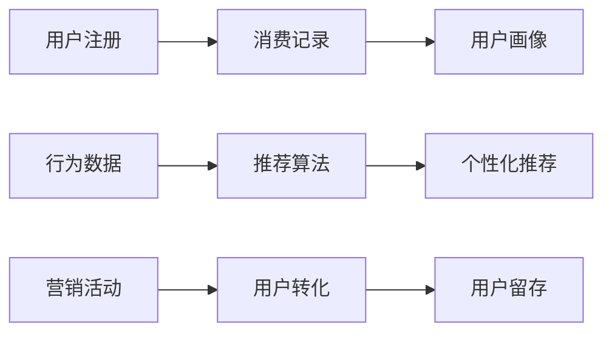

                 

# 知识付费赚钱的用户忠诚度提升与维系策略

> 关键词：知识付费, 用户忠诚度, 营销策略, 用户行为分析, 个性化推荐

## 1. 背景介绍

随着知识付费的兴起，越来越多的用户开始愿意为优质内容付费。然而，知识付费产品的运营面临着诸多挑战，特别是用户忠诚度提升与维系问题。如何设计有效的策略，构建稳定的用户群体，实现长期盈利，是知识付费领域亟需解决的问题。本文将从用户行为分析、个性化推荐、营销策略等多个角度，探讨知识付费用户忠诚度提升与维系的综合策略。

## 2. 核心概念与联系

### 2.1 核心概念概述

1. **知识付费**：用户为获取专业知识、技能、信息等内容而支付费用的模式。常见的知识付费形式包括在线课程、电子书、音频、视频等。
2. **用户忠诚度**：用户对知识付费产品的持续关注与消费行为，反映了用户对产品的满意度和依赖程度。
3. **个性化推荐**：根据用户的历史行为和偏好，推荐其可能感兴趣的内容，提高用户满意度和留存率。
4. **用户行为分析**：通过分析用户在平台上的行为数据，了解用户需求和偏好，指导产品改进和内容推荐。
5. **营销策略**：通过市场推广和用户转化，吸引新用户，并促进老用户活跃度和消费行为。

### 2.2 核心概念原理和架构的 Mermaid 流程图



## 3. 核心算法原理 & 具体操作步骤
### 3.1 算法原理概述

用户忠诚度提升与维系策略的核心在于提高用户满意度和持续消费行为。这可以通过以下几个步骤实现：

1. **用户画像构建**：通过用户行为数据，构建详细的用户画像，了解用户需求和偏好。
2. **个性化推荐系统**：根据用户画像，设计个性化推荐算法，提供符合用户兴趣的内容。
3. **营销活动设计**：针对不同用户群体，设计有效的营销活动，促进用户参与和转化。
4. **忠诚度管理**：通过会员制、积分激励等机制，增强用户对平台的忠诚度。

### 3.2 算法步骤详解

**Step 1: 用户画像构建**

用户画像构建是用户忠诚度提升的基础。通过收集用户的基本信息、行为数据、学习进度等，构建详尽的用户画像。常用的数据来源包括：

- **基本信息**：用户年龄、性别、职业、地域等。
- **行为数据**：课程学习进度、内容消费时间、互动评论等。
- **学习数据**：考试成绩、测验结果、学习偏好等。

**Step 2: 个性化推荐系统**

个性化推荐系统通过分析用户行为和偏好，推荐可能感兴趣的内容。常用方法包括：

- **协同过滤**：基于用户历史行为，寻找相似用户，推荐其可能感兴趣的内容。
- **内容推荐**：根据内容特征，推荐与用户历史消费内容相似或相关的其他内容。
- **混合推荐**：结合多种推荐方法，综合考虑不同维度的推荐结果。

**Step 3: 营销活动设计**

营销活动设计旨在通过市场推广和用户转化，吸引新用户，并促进老用户活跃度和消费行为。常用方法包括：

- **折扣促销**：限时折扣、新用户优惠等，吸引新用户注册和消费。
- **社交分享**：通过社交网络分享课程、文章等，利用用户口碑传播。
- **内容体验**：提供免费的优质内容或试用课程，吸引用户试用并付费。

**Step 4: 忠诚度管理**

忠诚度管理是通过会员制、积分激励等机制，增强用户对平台的长期依赖。常用方法包括：

- **会员制**：为忠实用户提供会员特权，如课程优先级、免费书籍等。
- **积分系统**：通过积分奖励，激励用户完成学习任务、参与社区活动等。
- **内容权益**：提供独家内容、直播课程等权益，满足用户高层次需求。

### 3.3 算法优缺点

个性化推荐系统的主要优点包括：

- **提高用户满意度**：通过推荐用户感兴趣的内容，增加用户粘性。
- **减少用户流失**：通过精准推荐，降低用户流失率。
- **提升转化率**：通过个性化营销，提高用户转化率。

主要缺点包括：

- **数据隐私问题**：需要收集大量用户行为数据，涉及用户隐私问题。
- **推荐准确性**：推荐算法需要高质量的用户数据和复杂模型设计，推荐结果可能不够准确。
- **资源消耗大**：个性化推荐系统需要大量计算资源，增加了平台运营成本。

### 3.4 算法应用领域

个性化推荐系统已广泛应用于电商、音乐、视频等多个领域，提升用户满意度和平台收益。知识付费平台同样可以借鉴这些成功经验，构建适合的知识推荐系统，提高用户忠诚度。

## 4. 数学模型和公式 & 详细讲解 & 举例说明

### 4.1 数学模型构建

个性化推荐系统通常基于协同过滤、内容推荐、混合推荐等模型构建。以协同过滤为例，其数学模型为：

$$
\text{推荐项} = \text{用户} \times \text{项目} \times \text{评分矩阵}
$$

其中，用户和项目分别表示用户和内容的特征向量，评分矩阵表示用户对内容的评分数据。

### 4.2 公式推导过程

以协同过滤为例，推荐算法主要分为以下几步：

1. 计算用户相似度：通过余弦相似度或皮尔逊相关系数，计算用户之间的相似度。
2. 计算内容推荐分数：根据相似用户的评分数据，计算内容对目标用户的推荐分数。
3. 排序推荐：根据推荐分数排序，推荐高分内容。

### 4.3 案例分析与讲解

假设某知识付费平台有10个用户和10个课程，每个用户对课程的评分如下：

| 用户ID | 课程ID | 评分 |
| --- | --- | --- |
| 1 | 1 | 5 |
| 1 | 2 | 4 |
| 2 | 1 | 3 |
| 2 | 3 | 5 |
| ... | ... | ... |
| 10 | 10 | 3 |

根据上述数据，计算用户1和用户3的相似度，以及课程1对用户3的推荐分数。

1. 计算用户1和用户3的相似度：

$$
\text{相似度} = \frac{\text{用户1和用户3的评分向量点积}}{|\text{用户1和用户3的评分向量范数}|\cdot|\text{用户1和用户3的评分向量范数}|} = \frac{5\cdot5 + 4\cdot3}{\sqrt{(5^2+4^2)}\cdot\sqrt{(5^2+3^2)}} = 0.8
$$

2. 计算课程1对用户3的推荐分数：

$$
\text{推荐分数} = \text{用户3的评分向量}\cdot\text{用户1的评分向量} = [5, 3, 0, 0, 0, 0, 0, 0, 0, 0] \cdot [5, 4, 3, 5, 0, 0, 0, 0, 0, 0] = 20
$$

3. 排序推荐：根据推荐分数，推荐课程1和课程3给用户3。

## 5. 项目实践：代码实例和详细解释说明

### 5.1 开发环境搭建

使用Python进行项目开发，需安装以下工具：

- **Python**：3.7及以上版本。
- **Pandas**：用于数据处理和分析。
- **Scikit-learn**：用于机器学习模型构建。
- **TensorFlow**：用于深度学习模型训练。
- **Flask**：用于构建Web服务。

### 5.2 源代码详细实现

以协同过滤为例，以下是Python代码实现：

```python
import pandas as pd
import numpy as np
from sklearn.metrics.pairwise import cosine_similarity

# 读取用户和课程评分数据
df = pd.read_csv('ratings.csv')

# 构建用户和课程的评分矩阵
rating_matrix = df.pivot_table(values='rating', index='user_id', columns='course_id', fill_value=0)

# 计算用户相似度矩阵
similarity_matrix = cosine_similarity(rating_matrix)

# 推荐算法
def recommend_course(user_id):
    user_similarity = similarity_matrix[user_id]
    top_n = 10  # 推荐top n个课程
    similar_user_indices = np.argsort(user_similarity)[-top_n:]
    recommended_courses = []
    for idx in similar_user_indices:
        similarity = similarity_matrix[idx]
        recommendations = np.where(similarity > 0.8)[0]
        recommended_courses.extend(list(rating_matrix.loc[idx].index[recommendations]))
    return recommended_courses

# 测试推荐算法
recommended_courses = recommend_course('user1')
print(recommended_courses)
```

### 5.3 代码解读与分析

代码实现了基于协同过滤的推荐算法。具体步骤如下：

1. 读取用户和课程的评分数据，构建评分矩阵。
2. 计算用户之间的相似度矩阵。
3. 定义推荐函数，根据相似用户推荐课程。
4. 测试推荐函数，推荐用户1的课程。

## 6. 实际应用场景

### 6.1 智能客服系统

智能客服系统可以通过个性化推荐，提高用户满意度，降低流失率。用户在使用知识付费产品时，遇到问题，可以咨询客服，系统根据用户历史行为，推荐相关课程或FAQ。

### 6.2 金融投资分析

金融投资分析平台可以通过个性化推荐，提升用户粘性，增加付费意愿。根据用户的历史交易数据和行为特征，推荐相关课程或资讯，帮助用户提升投资技能。

### 6.3 健康管理平台

健康管理平台可以通过个性化推荐，增强用户对平台的功能依赖。根据用户的健康数据和行为习惯，推荐相应的课程和健康资讯，提高用户健康水平。

### 6.4 未来应用展望

未来，随着人工智能技术的发展，个性化推荐系统将更加智能化。主要趋势包括：

- **多模态推荐**：结合用户行为数据和图像、语音等多模态数据，提升推荐准确性。
- **实时推荐**：通过流式处理和实时分析，提升推荐时效性。
- **推荐模型优化**：引入深度学习模型，如协同过滤、深度神经网络等，提升推荐效果。

## 7. 工具和资源推荐

### 7.1 学习资源推荐

- **《推荐系统》课程**：斯坦福大学提供的Coursera课程，深入讲解推荐系统的原理和实现。
- **《推荐系统实战》书籍**：详细介绍了推荐系统的经典算法和工程实现。
- **TensorFlow官方文档**：TensorFlow深度学习框架的详细文档，包含推荐系统相关的代码示例。

### 7.2 开发工具推荐

- **Pandas**：数据处理和分析的Python库，适合推荐系统数据处理。
- **Scikit-learn**：机器学习库，适合构建协同过滤等推荐算法。
- **TensorFlow**：深度学习库，适合构建复杂的推荐模型。
- **Flask**：Web框架，适合构建推荐系统的前端服务。

### 7.3 相关论文推荐

- **《协同过滤推荐系统》**：经典推荐系统论文，介绍了协同过滤算法的原理和实现。
- **《深度学习推荐系统》**：介绍深度神经网络在推荐系统中的应用。
- **《混合推荐系统》**：介绍混合推荐算法的原理和实现。

## 8. 总结：未来发展趋势与挑战

### 8.1 总结

本文对知识付费用户忠诚度提升与维系策略进行了系统介绍。通过构建用户画像、设计个性化推荐系统、实施有效的营销活动，可以有效提升用户满意度和留存率，实现知识付费产品的长期盈利。

### 8.2 未来发展趋势

未来，知识付费平台将更加注重用户忠诚度的提升和维系，个性化推荐和营销策略将进一步优化。主要趋势包括：

- **多模态数据融合**：结合多种数据源，提升推荐系统效果。
- **实时推荐系统**：通过实时数据处理和分析，提高推荐的时效性。
- **智能化推荐算法**：引入深度学习等先进算法，提升推荐准确性。

### 8.3 面临的挑战

尽管个性化推荐和用户忠诚度管理在知识付费领域已有所应用，但仍然面临诸多挑战：

- **数据隐私问题**：用户数据收集和使用涉及隐私保护，需要合理设计数据收集和使用策略。
- **推荐系统偏见**：推荐系统可能存在性别、地域等偏见，需要进一步优化算法和数据。
- **营销效果评估**：如何评估营销活动的效果，需要设计科学的指标和评估方法。

### 8.4 研究展望

未来，知识付费用户忠诚度提升与维系的研究方向将更加多元化。主要方向包括：

- **跨领域推荐**：将推荐系统应用于多个领域，实现知识整合和跨领域推荐。
- **隐私保护算法**：开发隐私保护算法，在保障用户隐私的同时，提升推荐效果。
- **个性化营销策略**：设计个性化营销策略，增强用户粘性。

## 9. 附录：常见问题与解答

**Q1: 用户画像构建如何实现？**

A: 用户画像构建需要收集和分析用户的基本信息、行为数据和学习进度等。常用的数据来源包括注册信息、课程学习记录、内容消费行为等。构建用户画像的方法包括：

- **数据收集**：通过用户注册、课程学习等环节，收集用户行为数据。
- **特征提取**：将数据转化为特征向量，如时间戳、消费金额、学习时长等。
- **聚类分析**：对用户特征进行聚类，划分用户群体，了解不同群体的需求和行为特征。

**Q2: 如何设计高效的个性化推荐系统？**

A: 个性化推荐系统的设计需要考虑多个因素，包括数据来源、算法选择、系统架构等。常用的推荐算法包括协同过滤、内容推荐、混合推荐等。设计高效的推荐系统需要：

- **数据预处理**：清洗和处理数据，构建高质量的推荐数据集。
- **算法优化**：选择合适的推荐算法，并优化算法参数。
- **系统架构设计**：设计高效的推荐系统架构，提高推荐系统性能。

**Q3: 用户忠诚度管理有哪些有效策略？**

A: 用户忠诚度管理可以通过会员制、积分激励、内容权益等机制，增强用户对平台的依赖。常用的策略包括：

- **会员制**：为忠实用户提供会员特权，如课程优先级、免费书籍等。
- **积分系统**：通过积分奖励，激励用户完成学习任务、参与社区活动等。
- **内容权益**：提供独家内容、直播课程等权益，满足用户高层次需求。

**Q4: 推荐系统的偏见问题如何解决？**

A: 推荐系统的偏见问题可以通过多维度的数据收集和算法优化来解决。常用的方法包括：

- **数据多样性**：收集更多维度的数据，减少单一数据源带来的偏见。
- **算法公平性**：设计公平性算法，减少性别、地域等偏见。
- **模型监督**：引入人工监督，定期检查和优化推荐模型。

以上问题及解答仅为参考，实际操作中需根据具体情况进行调整和优化。

---

作者：禅与计算机程序设计艺术 / Zen and the Art of Computer Programming

